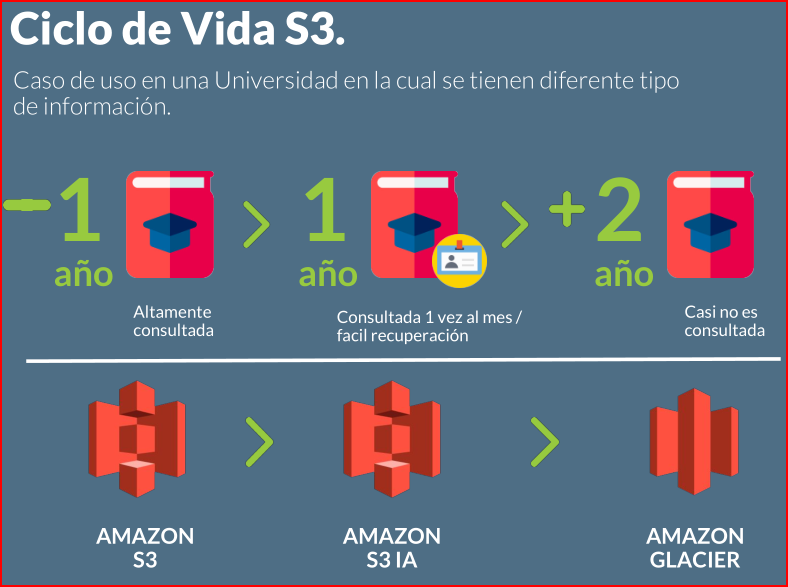

# AWS

```bash

░█████╗░  ░██╗░░░░░░░██╗  ░██████╗
██╔══██╗  ░██║░░██╗░░██║  ██╔════╝
███████║  ░╚██╗████╗██╔╝  ╚█████╗░
██╔══██║  ░░████╔═████║░  ░╚═══██╗
██║░░██║  ░░╚██╔╝░╚██╔╝░  ██████╔╝
╚═╝░░╚═╝  ░░░╚═╝░░░╚═╝░░  ╚═════╝░
```

1. [c_bd_aws](#c_bd_aws)
2. [c_clud_computing](#c_clud_computing)
3. [c_fundamentos_aws4](#c_fundamentos_aws4)
4. [c_infraestructura_como_codigo](#c_infraestructura_como_codigo)
5. [c_networking_content_delivery](#c_networking_content_delivery)
6. [c_storage](#c_storage)
7. [c_resume](#c_resume)

## c_bd_aws

## Introducción a RDS

### 2. Características de Relational Database Service (RDS)

*RDS* (__Relational Database Service__) es un servicio de AWS enfocado a bases de datos relacionales con compatibilidad a 6 motores de bases de datos:

- Amazon Aurora
- MySQL
- MariaDB
- PostgreSQL
- Oracle
- Microsoft SQL Server

Cada uno con sus características, integraciones y limitaciones.

Entre sus características principales podemos destacar los *__backups automáticos__* con un tiempo de retención de hasta 35 días, es decir, si encontramos algún problema con nuestras bases de datos podemos restablecerlas a la hora, minuto y segundo que necesitemos dentro del periodo de retención. Recuerda que por defecto este periodo es de __7__ días. También tenemos la opción de hacer backups manuales, podemos tomar snapshots manuales en cualquier momento si nuestra aplicación lo necesita. Además, AWS por defecto tomará un snapshot final de nuestras bases de datos antes de eliminarlas, así podremos restablecerla si tenemos algún inconveniente.

Todas las bases de datos relacionales utilizan un sistema de almacenamiento, si la carga de lectura y escritura son constantes, el sistema General Purpose funciona muy bien, sin embargo, podemos utilizar el sistema Provisioned Storage cuando requerimos de altas cantidades de consumo y operaciones de disco.

*RDS* es un sistema completamente administrado, esto quiere decir que AWS reduce nuestra carga operativa automatizando muchas tareas de nuestra base de datos, por ejemplo, las actualizaciones. A nivel de seguridad contamos con muchas opciones, una de ellas es la posibilidad de encriptar nuestra base de datos para que solo nosotros y las personas o roles que especifiquemos tengan acceso.

También tenemos integración con otros servicios de AWS, por ejemplo, __IAM__ para administrar a los usuarios, roles, grupos y políticas de conexión a la base de datos por medio de tokens con __máximo 20 conexiones por segundo__ (recomendado para escenarios de prueba), o la integración de __Enhanced monitoring__ para hacer monitoreo en tiempo real nuestras bases de datos (*recuerda que además de subir el precio, no está disponible para instancias small*).

Cuando utilizamos el servicio RDS con el motor de *MySQL* podemos crear __multiples bases de datos con un solo endpoint__ (una sola conexión), ya que entre las características de este motor encontramos la cantidad de bases de datos ilimitada. Obviamente, debemos tener en cuenta que nuestras instancias deberían soportar la cantidad de bases de datos que vamos a utilizar, y las herramientas de monitoreo nos pueden ayudar a medir esta relación de tamaño y rendimiento.

Recuerda que si necesitamos un permiso de usuarios diferente para cada base de datos vamos a necesitar configuraciones diferentes en las keys (llaves de acceso) de nuestra instancia.

### 6 Conexión por consola a nuestra base de datos

Para lograr el tráfico entre una instancia __EC2__ y una BD __RDS__; se hace mediante sus __Security Groups__ de cada uno, que al momento que se crean se personalizan.

Cuando se crea la instancia __EC2__ en su __Security Groups__ se personaliza para que conexión por el puerto `SSH` y desde la __Source__ `My IP` y se crea una llave __pem__ que luego os servira para conectar por medio de la terminal.

1. Permitir que el __Security Groups__ de BD __RDS__ pueda ser accedida desde la instancia __EC2__ copiando el `Group ID` (*el __Security Groups__ de la BD tiene como parametros Type: MYSQL/Aurora - Protocol:TCP - Port Range: 3306 - Source: Custum[Su IP/32]*), del __EC2__ se hace creando una nueva regla __Security Groups__ de BD __RDS__, en la pestaña de __Inbound__ `Type: MYSQL/Aurora - Protocol:TCP - Port Range: 3306 - Source: Custom - Group ID[de EC2]`

2. Permitir que el __Security Groups__ de __EC2__ pueda ser accedida desde la instancia BD __RDS__ copiando el `Group ID` de __RDS__ (*el __Security Groups__ de __EC2__ tiene como parametros Type: SSH - Protocol:TCP - Port Range: 22 - Source: Custum[Su IP/32]*), del __RDS__ se hace creando una nueva regla __Security Groups__ de __EC2__, en la pestaña de __Inbound__ `Type: MYSQL/Aurora - Protocol:TCP - Port Range: 3306 - Source: Custom - Group ID[de RDS]`

## Backups, Performance y HA en RDS

### 8 Estrategias de backup

:link: [Despliegues Multi-AZ de Amazon RDS](https://aws.amazon.com/es/rds/details/multi-az/)

Los sistemas de backup manuales de RDS son completamente nuestra responsabilidad y debemos determinar cuándo tomar estos snapshots. Recuerda qué estos estos backups son incrementales, pueden mantener la información incluso cuando borramos la base de datos y nos permiten migrar la información entre diferentes regiones.

Por otra parte, los backups automáticos se hacen a diario, pero las operaciones de entrada y salida pueden quedar suspendidas por algunos segundos. Para solucionar este problema, es recomendado trabajar con despliegues Multi-AZ, que nos permiten utilizar una instancia de reserva de la base de datos cuando la instancia principal no se encuentra disponible.

- __Manuales__: Son incrementales y se mantienen al borrar la BD. *Pueden copiarse a AZ y regiones*
- __Automáticos__: Se hacen a diario. E/S pueden quedar suspendidos(segundos). Se recomienda hacer despliegues Multi-AZ
- __Precio__: Dependen del storage de la DB. Aumenta con la retención.

*El precio de nuestros backups depende de dos cosas*: __la retención (el tiempo que tenemos disponibles nuestros backups, máximo 35 días) y la cantidad almacenamiento que utilizamos (storage)__.

### Migración a RDS

### Aurora

### Introducción a DynamoDB

### Particiones e Índices en DynamoDB

### DynamoDB Streams y Replicación

## c_clud_computing

## c_fundamentos_aws4

## c_infraestructura_como_codigo

## c_networking_content_delivery

## c_storage

## Almacenamiento de objetos en AWS (S3)

### Características de S3

- __S3__ es almacenamiento de objetos como archivos, PDF’s, imágenes, etc. Dentro de __S3__ contamos con diferentes tipos de almacenamiento:
  - S3 Standar
  - S3 IA (*Infrequent Access* acceso poco frecuente)
  - S3 IA One Zone(*Infrequent Access* Una Zona)
  - Glacier

Dependiendo de la clase de S3 va a variar la durabilidad y disponibilidad.
**Bucket** es la unidad donde vamos a almacenar la información en S3, su identificador se encuentra compuesto por la región donde fue creado, la dirección de Amazon AWS y el nombre del __bucket__. Para los casos cuando queramos acceder a un objeto simplemente se le suma el nombre del objeto, este debe ser único, en minúsculas y no se permiten los caracteres especiales salvo _ y -. El nombre de un __Bucket__ debe ser único a nivel global.

### Versionamiento de archivos en S3

:link: [Uso del control de versiones AWS](https://docs.aws.amazon.com/es_es/AmazonS3/latest/dev/Versioning.html)

Tener un control de versiones de tus archivos es importante y necesario cuando manejamos información muy delicada. En los casos donde tenemos un error o cargamos un archivo incompleto siempre podremos volver a la versión anterior de nuestro archivo.

*Al momento de ir añadiendo varias versiones de un archivo AWS va a poner un tag al último archivo para tener claro que es esta la última versión.* Es importante tener en cuenta que la característica de versionamiento te va a cobrar por el almacenamiento total de tus archivos, es decir la última versión y todas sus versiones anteriores.

Utilice el control de versiones para mantener varias versiones de un objeto en un bucket. Por ejemplo, podría almacenar ``my-image.jpg`` (*versión 111111*) y ``my-image.jpg`` (*versión 222222*) en un solo bucket. El control de versiones le protege de las consecuencias de las sobrescrituras y eliminaciones involuntarias. También puede utilizar el control de versiones para archivar objetos de manera que tenga acceso a las versiones anteriores.

### Sitio web estático

Podremos utilizar nuestro propio dominio como en cualquier sitio web estático, para ello usaremos __Route 53__ que es el servicio encargado de la parte de __DNS__ y __gestión de dominios en S3__.

En los sitios web estáticos debes tener en cuenta que el dominio deberá llamarse igual al __bucket__, los archivos index y error deben ser públicos, debe ser configurado con el servicio __Route 53__.

### Logs a nivel de objetos

:link:[¿Cómo puedo habilitar el registro en el nivel de objeto para un bucket de S3 con eventos de datos de AWS CloudTrail?](https://docs.aws.amazon.com/es_es/AmazonS3/latest/user-guide/enable-cloudtrail-events.html)

La ruta para activar es Propiedades(del bucket, del que queremos hacer registro) `Objec-level loggin` (*Registro de nivel de objeto*)

Podemos activar el `Object-level Logging` dentro de un bucket en __S3__ para llevar registro de todas las acciones que se realicen en este, esta funcionalidad nos sirve cuando tenemos buckets con información crítica. Al activar el `Object-level Logging` debemos conectarlo a __CloudTrail__.

**CloudTrail** es como una cola/registro donde se guardan las llamadas a la __API__ del S3 del cual necesitamos saber las todas las acciones que pasan con el.

Después de realizar __CloudTrail__ sobre un __S3__ se puede conectar al servicio de __CloudWatch Events__ que sirve para especificar y filtrar diferentes eventos para que nos alerte sobre eventos especificos de nuestro __S3__ especifico.

1. Registro de la información que se haer sobre nuestros  __buckets__ criticos.
2. Realizar registro con diferentes plataformas de monitoreo, ya sea dentro dentro de AWS como __CloudWatch__ o opr ejemplo __splunk__ :link:[Server Monitoring Software and Tools](https://www.splunk.com/en_us/it-operations/server-monitoring.html) y relacionarlas con :link:[newrelic](https://newrelic.com/)
3. Crear diferentes alertas como por ejemplo, alertas sobre objetos eliminados, alertas sobre objetos creados en el __bucket__ y crear una nueva capa de seguridad.

### Transferencia acelerada

- :link:[Aceleración de transferencia de Amazon S3](https://docs.aws.amazon.com/es_es/AmazonS3/latest/dev/transfer-acceleration.html)
- :link:[Estimate the latency from your browser to each AWS region.](https://www.cloudping.info/)

La ruta para activar es Propiedades(del bucket, del que queremos hacer registro) > `Transfer Acceleration`

Tomando ventaja del servicio de __CDN__ de AWS podemos cargar nuestra información de forma más rápida, esta característica no se encuentra disponible en __buckets__ que contengan puntos (`.`) en su nombre.

*La transferencia acelerada te será sumamente útil cuando tengas que subir información a tu bucket, pero tú no te encuentres en la misma región donde creaste tu bucket.*

Aceleración de transferencia de Amazon S3 permite transferir archivos de manera rápida, fácil y segura entre su cliente y un *bucket de S3* a larga distancia. Transfer Acceleration aprovecha las ubicaciones de borde distribuidas globalmente de __Amazon CloudFront__. A medida que los datos llegan a una ubicación de borde, se redirigen a Amazon S3 a través de una ruta de red optimizada.

Por el uso de __Transfer Acceleration__ se podrían aplicar cargos por transferencia de datos adicionales.

### Eventos en S3

La ruta para activar es Propiedades(del bucket, del que queremos hacer registro) > Events(Eventos)

Los eventos nos servirán en los casos donde queremos recibir notificaciones cuando se ejecute determinada acción dentro de un bucket con información importante.

- Al momento de crear un evento debemos ponerle un nombre, indicarle la acción que debe notificar, además podemos especificarle la carpeta y el tipo de archivo. Por último, debemos indicarle hacia donde debe mandar la notificación, puede ser hacia:
  - __SNS Topic__: Sistema de notificaciones simples de AWS(enviar notificaciones por email, mensajes de texto, endpoits de notificaciones.)
  - __SQS Queue__: Colas. Se puede integrar esa "Cola" a un servicio de monitoreo como *splunk* o alguno similar.
  - __Lambda Function__: Despues de utilizar una *función lambda* se puede registrar para que haga casi cualquier cosa, como por ejemplo validar el evento y enviar el archivo a otro __bucket__´y/o valida que inicie otro proceso despues de validación.

1. Nos permite trazabilidad. Sobre estructuras sobre el __bucket__.
2. Control sobre determinados tipos de eventos.
3. Más de un evento/reglas sobre diferentes tipos de archivos para el mismo **bucket**
4. Generar arquitecturas más completas convinando servicios somo  SQS, SNS.

### Replicación

:link:[Replicación](https://docs.aws.amazon.com/es_es/AmazonS3/latest/dev/replication.html)

**Nota:** La replicación requiere el control de versiones del bucket

La ruta para activar es Administración(del bucket, del que queremos hacer registro)>Replication(*Replicación*)

La característica de replicar información se realiza solamente para buckets de una región a otra, no es posible pasar de un bucket de una misma región a otro de la misma.

El proceso de replicación se *realiza de forma asíncrona*. Es común realizar réplicas para Data Recovery, Auditorías y Compliance.

Al momento de replicar la información podemos indicarle que sean todos los objetos del bucket, los objetos que se encuentren dentro de determinada carpeta o aquellos que tengan cierto tag. Además, podemos replicar objetos encriptados.

En la replicación debes tener en cuenta algunas cosas con el cifrado.

1. El bucket destino puede tener policy que encripten.
2. *Las llaves de cifrado son regionales* y si el bucket destino esta en otra región pues la llave cambiaría.

Casos de uso:

1. Temas de auditoria.
2. Data recovery.
3. Transferir información a otra cuenta de otra empresa, de AWS mediante la "Replicación".

## Clases de storage en S3

**S3**(Service Level Agreement)

1. **S3 Standar.**
2. __S3-IA.__ S3 Infrequent Access o de acceso poco frecuente está diseñado para almacenar objetos que son accedidos con menor frecuencia que S3 Estándar(uno o dos veces por mes.), su costo de almacenamiento es menor, pero el costo de solicitudes es mayor.
3. __S3-IS.__ Única zona - acceso poco frecuente. Es para acceso poco frecuente, similar a S3-IA, pero con la diferencia de que solamente se encontrará en una zona de disponibilidad y tiene un costo menor en almacenamiento por GB.
4. __Amazon Glacier.__ *Glacier solamente será utilizado para backups y data histórica*, el precio de almacenamiento por GB es sumamente menor siendo el más económico. Al ser data histórica la disponibilidad de la información es menor, siendo que pedimos la información una vez cada seis meses o cada año.

### Ciclo de Vida



:link:[Transición de objetos con el ciclo de vida de Amazon S3](https://docs.aws.amazon.com/es_es/AmazonS3/latest/dev/lifecycle-transition-general-considerations.html) :warning:


Esta funcionalidad va a mover la información de una clase de almacenamiento a otra cada que pase cierto tiempo. No tendrá la misma frecuencia de accesibilidad un archivo de hace 1 año que uno de hace una semana, por ello el ciclo de vida nos será de utilidad para disminuir los costos de nuestros archivos.

El mínimo de tiempo para pasar objetos a __S3-IA__ es de 30 días. Asimismo, deben pasar 120 días para mover la información a Glacier.

### Estrategias de seguridad en la nube

Migration and transfer(Migración y transferencia)>Snowball

1. __Snowball__.
2. __Snowmobile__.
3. __\>100MB.__ Carga multiparte, dividir el archivo en pequeñas partes y cargar esas partes en paralelo.
4. __SDK__. Java, .NET, Python, Node JS, Ruby, PHP, y C++
5. __AWS__ Cli. Mendiante el uso de las __CLI__ de AWS aprovechando la shell.

## Seguridad en S3

NOTA: Las llaves en la nueva ersión de AWS se crean en __Key Management Service (KMS)__ *Llaves administradas por el cliente*

Server Side Encryption.

- __SSE-S3__. AWS gestiona y administra las llaves de cifrado. Advanced Encrytion Standar de 256 bits(AES-256)
- __SSE-KMS(Key Management Service).__ Llaves almacenadas en AWS creadas por el Usuario. Mayor control de las llaves, a nivel de auditorias y permisos, integración por una gran cantidad de servicios. *Llave preferente* [Creación de claves](https://docs.aws.amazon.com/es_es/kms/latest/developerguide/create-keys.html)
- __SSE-C.__

### Políticas en S3

:link:[Generador de póliticas AWS](https://awspolicygen.s3.amazonaws.com/policygen.html)
La ruta para activar es Propiedades(del bucket, del que queremos hacer registro)>Permisos>Pólitica del bucket
Que "Usuarios" y que "roles" tienen acceso a nustro bucket y con que condiciones.
Se basan en forma json de usuario y rol

- Son un documento JSON
- "Statement": [{...},{...},{...}] Es obligatorio. Contiene varios elementos.
- Especifica reglas de sintaxis de lenguaje. Ejemplo: 2012-10-17 y 2008-10-17. Opcional.
- Es un identificador de la política. Algunos servicios pueden necesitarlo. Opcional.
- Valores: Allow o Deny. Es Obligatorio.
- Específica usuario o rol. Utiliza el ARN del role o usuario. Es Obligatorio.

### Ejemplos de Políticas en S3

Ejemplos en [Ejemplos de Políticas en S3. pgs. 45-50](https://github.com/macknilan/Cuaderno/blob/master/Aws/docs/storage-en-aws.pdf)

### ACL en S3

Listas de control de acceso al bucket.
Capa adicional de seguridad.
Permisos a nival de cuentas.
Se complementan con las políticas.

Propiedades del bucket>Permisos>Listas de control de acceso.

Grupo Envío de registros de S3: Parte de seguridad adicional, mandar registros de actividad en los buckets.

## Storage Gateway

### Características de storage gateway

Servicio híbrido.
Servicio que interactúa con nuestra arquitectura física en la empresa/data center/negocio con la nube AWS

- Es almacenamiento híbrido con integración "__onpremise__" optimizado para transferencia de datos.
- __Casos de uso__: Backup, archiving, disaster recovery, y cloud data processing.
- __Protocolos__: Utiliza protocolos como NFS, SMB y iSCSI.
- __Integración__: S3, EBS, Glacier.
- __Uso__: Descargar e instalar una VM, configure y puede usarla.
- __Seguridad__: Brinda todas las ventajas de seguridad y durabilidad que provee la nube de AWS.

### Storage Gateway - File Gateway

Ruta: `Almacenamiento > Storage gateway`

- Hay tres tipos:
  1. __File gateway__: Store files as objects in Amazon S3, with a local cache for low-latency access to your most recently used data.
  2. __Volume gateway__: Block storage in Amazon S3 with point-in-time backups as Amazon EBS snapshots.
  3. __Tape gateway__: Block storage in Amazon S3 with point-in-time backups as Amazon EBS snapshots.

1. File Gateway. Maquina virtual que nos permite conectar a AWS y my *Application server*
2. Es a nivel de objetos.
3. Permite que aplicaciones on-premise accedan a storage a través de SMB(*Server Message Block*) o NFS(*Network File System*).
4. La data es cacheada en el File Gateway y convertida en objetos en S3.

### Storage gateway - Virtual Tape Library

Se recomienda mandar a S3 Glacier.

- Reemplaza el backup en cintas aprovechando el cloud.
- Backup existente es generado directamente desde on-premise en virtual tape.

### Storage gateway - Volume Gateway

- Crear caché de archivos locales. Mejora la latencia de archivos locales.
- Crear snapshots locales en AWS. Estos backups son cargados asíncronamente a AWS.

Hay dos tipos:

- __Cached volumes__: Low-latency access to your most recently used data.
- __Stored volumes__: On-premises data with scheduled offsite backups.

## Sistema de archivos elástico(EFS)

### Elastic File System(EFS)

Ruta: `Almacenamiento > EFS`

Permite muchas instancias(n instancias) __EC2__ en la misma zona, que se conecten a AWS EFS. Y de esta manera las instancias conectadas podrán ver la misma información.

- __Pricing__: El valor es por GB consumido. No por aprovisionado.
- __Uso__: Aumento y reducción automática de su capacidad.
- __Funcionalidad__: Concede un acceso compartido paralelo masivo a miles de instancias Amazon EC2,
- __IOPs__: permite altos niveles de IOPs.
  - Uso general.
  - E/S Máx.
- __RED__: Permite mejor rendimiento en red.
  - Transmisión por rafagas.
  - Aprovisionado. Se representa la velocidad en MB.
- __Funcionalidad__: Habilitar cifrado de datos en reposo.
- __Compatibilidad__: *Solo es compatible con S.O. Linux*
- __Montaje__: Provee un paso a paso de montaje del sistema de archivos en Linux.

### Casos de uso de EFS

## Sistema de archivo por bloques (EBS) *Elastic Block Stores*

### Caracteristicas de EBS(*Elastic Block Stores*)

**Disco duro virtual en la nube**

Ruta: `EC2 > ELASTIC BLOCK STORE > Volúmenes`

Se pueden instalar SO(windos & linux)  
Se pueden instalar Aplicaciones(windos & linux)  
Se paga por el espacio aprovisionando(DETERMINAR CUANDO SE NECESITA APROVISIONAR MÁS UN EXTRA).

1 a 1  
EC2 a EBS

- __Replicación__: Cada volumen se replica dentro de una AZ para proteger ante un error.
- __Diseño__: Esta diseñado para ayudar a diferentes cargas de trabajo.
- __Montaje__: __SOLO__ *Un EBS pude estar asociado sólo a una instancia EC2* y *Un EC2 a varias instancias EBS*
- __Boot__: No se puede encriptar y no permiten todos los tipos de EBS disponibles.
- __Volúmen adicional__: Puede encriptarse y usar todos los tipos de EBS disponibles.
- __Montaje__: Se debe hacer por la consola de AWS y a nivel de sistema operativo; es complatible en __windos__ y **linux**
- __Tipos__: Hay diferentes tipos de EBS; esto cambia el precio.
- __Protección__: se puede proteger el borrado accidental al crear la instancia.
- __Limites__: Puede ser hasta de 16TB.

### Tipos de EBS - GP2 - IO1

Los tipos de *EBS* se especifican en el "*paso 4*" cuando se crea una instancia __EC2__ en el campo `Volume Type`.

EBS-SSD **GP2**

- Balance entre performance y precio. 3 IOPS por cada GB hasta 10,000 IOPS
- Limite hasta 3000 IOPS para periodos costos debajo de 1GB.
- Puede ser Root de una instancia en __windos__ y __linux__.
- Entre 1 GB y 16GB

EBS-SSD **IO1**

- Diseñados para I/O intensiva.
- Se usan para mas de 10,000 IOPS.
- Hasta 20,000 IOPS por volumen.
- Se puede usar para BD no relacionales o uso intensivo I/O.
- Puede ser Root de una instancia en __windos__ y __linux__.
- Entre 4GB y 16TB.

### Tipos de EBS - ST1 - SC1

EBS-HDD __ST1__(Throughput Optimized HDD)

- Casos de uso: BigData, Datawarehouse, Log Process, Streaming
- No se pude aqui instalar el S.O.
- No pueden ser Boot de una EC2
- Entre 500GB y 16TB

EBS-HDD __SC1__(Cold HDD)

- *Volumen de menor costo para cargas de acceso con poca frecuencia.*
- No puede tener el S.O. instalado.
- No puede ser el Boot de una EC2
- Se paga por capacidad aprovicionada.
- Entre 500GB y 16TB

### EBS Snapshots y AMI

Snapshots

- Copias de seguridad del volumen(foto en el tiempo del volumen).
- Son incrementables. Se guarda lo que se a modificado.
- Se pueden programar con el lifecycle manager o de firma manual.
- Compatibles con cualquier S.O.
- El *lifecycle manager* funciona a nivel de **Tags**

**AMI**

- Es una imagen con aplicaciones pre-instaladas y configuradas para una funcion en especifico que pueden servir como plantillas/templates para instancias que deseamos crear.
- Pueden ser echas por yo usuario o usar las que ya están echas por empresas ó personas.

### AWS Storage S3 vs EBS vs EFS

**S3**(Simple Storage Service)

- Objetos(imágenes, documentos, archivos), no se instalan aplicaciones.
- No almacenar mas de 5TB por objeto.
- Almacenamiento de BK.
- Data de historial.
- Almacenar __logs__, para posteriormente realizar procesamientos cons los archivos.
- Almacenamiento de sitios web estáticos.

**EBS**(Elastic Block Stores)

- Es el HDD que esta asociado con la instancia **EC2**
- Bloques, se puede instalar aplicaciones y S.O.
- Proyectos de BigData.
- BD no relacionales.

**EFS**(Elastic File System)

- Objetos(imágenes, documentos, archivos), no se instalan aplicaciones.
- Aplicaciones y cargas de trabajo que tengan que tengan que compartir información en AWS. Sitios Web con auto-scaling y almacenamiento centralizado.

## c_resume

- __Objetos__: S3(tener en cuenta la clase de storage, existen diferentes clases)
- __Data historica__: Glacier(storage más económico en AWS)
- __Versonamiento de archivos__: permitirá devolver nuestros archivos a versions anteriores, es muy usado para archivos críticos.
- __Replicación__: entre buckets se hace forma asincrónica.
- Ciclo de vida de storage: Se usa para gestionar los objetos para ahorrar costos y disminuir la administración humana.
- Es recomendado mantener nuestros objetos encriptados en la nube, podemos seleccionar  entre *SSE-S3*, *SSE-C* y *SSE-KMS*.
- Todos nuestros buckets deben tener configurada una __Policy__ con los permisos necesarios.
- Al momento de crear nuestra instancia debemos seleccionar el volumen que se ajuste a nuestras necesidades de I/O, precio y uso.
- En __EFS__ podemos conectar más de una instancia __EC2__ a nuestro sistema de archivos y su costo será únicamente por lo usado.
- Los __snapshots__ son los incrementales y podemos programarlos usando __tags__ para los volúmenes **EBS**
