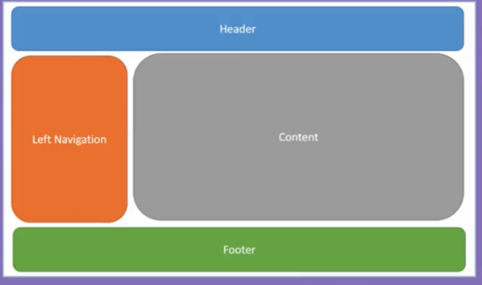
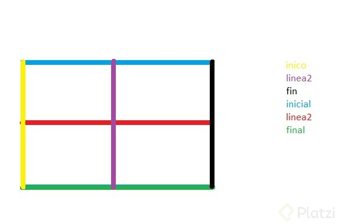
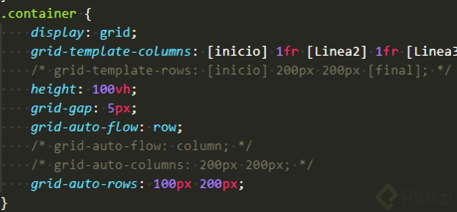
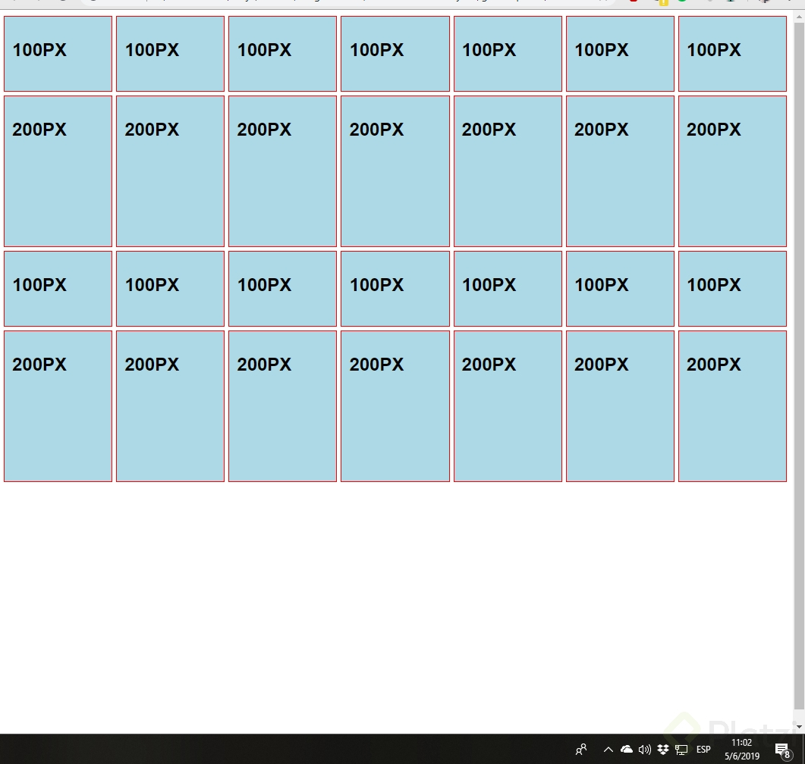
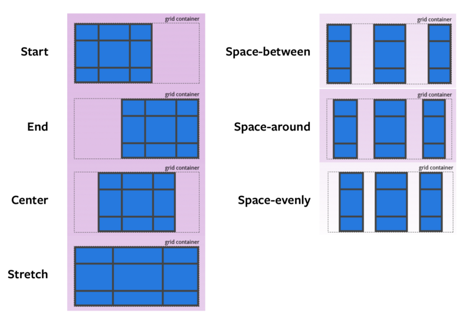

# Curso de CSS Grid Layout


### 2 ¿Que es CSS grids?

El módulo de CSS Grids nos permite generar layouts o distribuciones del contenido en nuestro sitios web de forma eficiente. Controla esta estructura bidimensional de filas y columnas fácilmente con propiedades de css logrando un mejor flujo que el que se tiene al utilizar tags de HTML


### 3 Conceptos fundamentales sobre CSS Grid Layout

:link: [A Complete Guide to Grid](https://css-tricks.com/snippets/css/complete-guide-grid/)

+ **Grid Container**: va a ser el elemento padre que va a tener puesto un nuevo tipo de display: grid. Nos permite colocar otras propiedades para manipular nuestro layaout.
+ **Grid Item**: Son nuestro componentes, contenido, lo que vamos a manejar. Nuestras filas o columnas que vamos a mover a nuestro gusto. Son hijos directos de grid.
+ **Grid Line**: Lineas divisorias horizontales y vecales.
+ **Grid Track**: Espacio entre dos líneas adyacentes. Filas y columnas.
+ **Grid Cell**: Celdas, espacio en dos filas adyacentes y 2 columnas adyacentes.
+ **Grid Area**: Espacio rodeado por 4 grid lines

### 4. Definiendo columnas

Una vez dado el `display grid` a nuestro `Container` _principal_ podemos apoyarnos de nuevas propiedades para hacer que nuestro layout haga lo que queremos.

Para definir _Columnas_ de contenido en nuestro _layout_ debemos definir la propiedad `grid-template-columns` seguido del qué tamaño serán el número de columnas que queremos. Su sintaxis es la siguiente:

```css
.Container{
    display: grid;
    grid-template-columns: N1 N2 N3 ... ;
    // ( **N** representa el tamaño que queremos que sean nuestra columnas, puede ser cualquier unidad de medida)"
}
```
**Se debe poner el display de grid al contenedor**
```css
.container{
    display: grid;
}
```
Para definir columnas debemos ponerle la propiedad de `grid-template-columns` al contenedor, en esta debemos definir el tamaño de cada una de las columnas, por ejemplo: si en la propiedad ponemos los siguientes valores
```css
.container{
    grid-template-columns: 200px200px200px;
}
```
estamos estableciendo tres columnas, cada una de 200px.

También podemos poner medidas _dinámicas_, tales como _porcentajes_, se definen exactamente igual que como en el ejemplo anterior:
```css
.container{
    grid-template-columns: 25%50%25%;
}
```
También podemos combinar las _medidas relativas_ con las _medidas absolutas_:

```css
.container{
    grid-template-columns: 25%200px25%;
}
```
### 5. Definiendo filas

:link: [CSS Grid Tutorial](https://qhmit.com/)
+ **Grid explicito** (explicit grid) es cuando nosotros definimos el numero de filas o columnas.
+ **Grid implicito** (implicit grid) es cuando tenemos filas o columnas que no definimos pero son parte de nuestro grid.


### 6. Grids identados y tipos de displays
Display subgrid para heredar la configuración del grid padre (cuando se esten anidando grids).
```css
display: subgrid; /* No disponible aun¿*/
```
Display inline-grid muestra el grid en una sola linea:
```css
display: inline-grid; /* No disponible aun */
```
### 7. Espaciado entre filas y columnas
:link:[gap (grid-gap)](https://developer.mozilla.org/en-US/docs/Web/CSS/gap)

Chrome 66 hizo cambios en css-grid, específicamente en gap y ahora es simplemente gap:

`grid-column-grap` a `column-grap`
`grid-row-gap` a `row-grap`
`grid-grap` a `gap`

```css
column-gap: 30px;
row-gap: 50px;
/*grid-gap: filas columnas;*/
gap: 10px 100px;
```

### 8. Repetidores, unidades de medida y funciones

**Unidad de medida**: fracciones `fr` distrubuye el espacio disponible en formas iguales.  
**Funciones**:  
+ `repeat`_(cantidad, valor)_ para usar el mismo valor varias veces
+ `minmax`_(min, max)_ agregar un valor minimo y maximo para el tamaño al hacer responsive  
+ `auto`: Es lo mismo que `fr` pero al mismo tiempo no lo es, porque auto distribuye el espaciado que tiene la columna pero con referencia a su contenido.


### 9. Definiendo áreas de contenido



Si vamos a usar area en más de una columna colocamos el mismo donde del area donde la queramos. Ejemplo:
```css
grid-template-areas: "header header"
                                 "left contenido"
                                 "footer footer";
```
Para usar estas areas:
```css
.header {
    grid-area: header:
}
```
¿Que son los viewport?

En este caso en el ejemplo del profesor:
`height: 100vh;`

Son medidas relativas de acuerdo al `viewport`. **Vh** hace referencia a la centésima parte de la altura del `viewport` y vw a la centésima parte del ancho del `viewport`.

```
1vh = 1% de la altura del viewport
100vh = altura del viewport

1vw = 1%del ancho del viewport
100vw = ancho del viewport
```

### 10. Definiendo el tamaño de las columnas dentro de un grid
Definir el tamaño de las columnas dentro de un grid:
```css
grid-column-start: 1;
grid-column-end: 3;
```
Para escribir esto en una sola linea:
```css
grid-column: inicio / final;
```
Para usar por espacios: `span #`
Para usar el espacio de toda la columna usamos `-1` al final Ejemplo: `grid-column: 1/ -1;`

**Sintaxis sin resumir:**
```css
grid-column-start: 1;
grid-column-end: 3;
```
**Sintaxis resumida:**
```css
grid-column: 1 / 3;
grid-column: inicio / final;
```
**Sintaxis definiendo por líneas:**
```css
grid-column: 1 / 3;
```
**Sintaxis definiendo por columnas:**
```css
grid-column: 1 / span 2;
```
**Sintaxis para ocupar todo el ancho dinamicamente:**
```css
grid-column: 1 / -1;
```

### 11. Definiendo el tamaño de filas dentro de un grid

Definir el tamaño de las filas dentro de un grid:
```css
grid-row-start: valor;
grid-row-end: valor;
```
Igual que las columnas para escribir esto en una sola linea:
```css
grid-row: inicio / final;
```
_El negativo_ significa que comienza contando desde el final.  
Por ejemplo si quieres que contenga todo el ancho hasta que empieza la ultima columna utilizarías
```css
grid-column: 1 / -2;
```
### 12. Definiendo el nombre de lineas

Para nombrar lineas colocamos el nombre entre [ ]. Ejemplo:
```css
grid-template-columns: [inicio] 1fr [linea2] 1fr [final];

```
En estos casos no podemos usar la función repeat()


```css
grid-template-columns: [inicio] 1fr [linea2] 1fr [fin];
grid-template-rows: [inicial] 1fr [linea2] 1fr [final];
```

### 13. Manejando el grid implícito

Va a ser formado por los elementos HTML que no estan siendo contemplados dentro de las filas y columnas de CSS, lso elelentos CSS que no an sido contemplatos dentro de las filas y columnas, todo lo que nos sobra es nuestro grid implicito.

Para cambiar el flujo automático de mi grid:
```css
grid-auto-flow: column;
```
Por defecto viene `grid-auto-flow: row;`
Para asignar el valor por defecto de el espacio de las columnas o filas que no han sido asignadas:
```css
grid-auto-columns: valores;
grid-auto-rows: valores;
```
**Manejando grid implícito:** Cuando columnas o filas no tienen un valor explicito, es decir, cuando no asignamos valores específicos para controlarlas, se ordenan de manera implícita, hay propiedades que existen para manipular nuestro gird implícito:

`grid-auto-flow`: Con esta propiedad manipulamos el orden del grid implícito. Si ingresamos el valor column ,todo lo que sea grid implícito se apilara como columna y si ingresamos row ,como fila.

`grid-auto-column`: Con esta propiedad podemos darle valores a cada columna.

`grid-auto-row`: Con esta propiedad podemos darle valores a cada fila.

**NO ESPECIFICANDO**: Si yo no especifico filas o columnas, con grid-auto-row o grid-auto-column , podemos manipular todas las columnas o filas.


Resultado


### 14 Alineación de contenido
```css
justify-items: valor; /* PARA ALINEACIÓN HORIZONTAL */
align-items: valor; /* PARA ALINEACIÓN VERTICAL */
```
Los valores que toman _por defecto_ es **stretch** el cual hace que tomen todo el valor asignado en la fila o columna.

Para asignar la alineación de un solo elemento podemos usar:
```css
align-self: valor;
justify-self: valor;
```
`justify-items` (Horizontal)
```css
justify-items: value;
```
**VALUES**:
+ `start` : contenido hacia la izquierda
+ `end` : contenido hacia la derecha
+ `center` : contenido al medio
+ `stretch` : estira el contenido al espacio que nos de el grid

**align-items (Vertical)**
VALUES:
+ `start` : contenido hacia arriba
+ `end` : contenido hacia la abajo
+ `center` : contenido al medio
+ `stretch` : estira el contenido al espacio que nos de el grid

**ALINEACIÓN INDIVIDUAL**
```css
justify-self (HORIZONTAL)
align-self (VERTICAL )
```

### 15. Alineación de filas y columnas

**Para alinear el contenido de filas y columnas:**
`justify-content`: valor; horizontal
`align-content`: valor; vertical

**Pata distribuir uniformemente:**
Con `space-around` Los items tienen el mismo espacio a su alrededor
Con `space-evenly` Hay un espacio mas homogeneo entre items
Con `space-between` El primer item al inicio, el último al final




