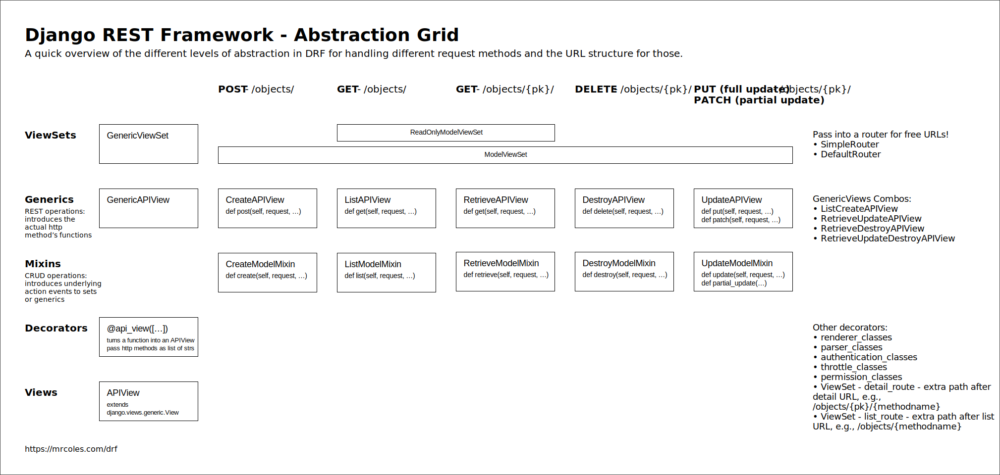

# Django REST Framework

- :link: [https://www.django-rest-framework.org/](https://www.django-rest-framework.org/)
    + :link: :octocat: [https://github.com/encode/django-rest-framework](https://github.com/encode/django-rest-framework)

- :link: :octocat: [http://www.cdrf.co/](http://www.cdrf.co/)

- :link: :video_camera: [Django Rest-framework Youtube 14 videos](https://www.youtube.com/playlist?list=PLgCYzUzKIBE9Pi8wtx8g55fExDAPXBsbV)
    + :link: :octocat: [mitchtabian / CodingWithMitchBlog-REST-API](https://github.com/mitchtabian/CodingWithMitchBlog-REST-API)

- :link: :video_camera: [Build an API with Django // Part 1 to 4](https://www.youtube.com/watch?v=RPsDhoWY_kc&list=PLLRM7ROnmA9HzbIXYN6D3wOZ0wUrqNs_d)
    + :link: :octocat: [justdjango / drf-api](https://github.com/justdjango/drf-api)


- :notebook_with_decorative_cover: [api-design-ebook-2012-03.pdf](docs/api-design-ebook-2012-03.pdf)
- :link: [Facebook Graph API](https://developers.facebook.com/docs/graph-api/)
- :notebook_with_decorative_cover: [APIs_design.pdf](docs/APIs_design.pdf)
- :link: [List of HTTP status codes](https://en.wikipedia.org/wiki/List_of_HTTP_status_codes)

Uno de los prerequisitos para crear APIs es conocer el protocolo HTTP. Verbos, métodos, estados y las cabeceras.

Van a estar diseñando una interfaz para programadores para que otros programadores puedan interactuar, nos olvidaremos de los templates para que un equipo de Frontend se encargue de eso. Debemos tener la perspectiva de un usuario de API y no la de un diseñador de API.

El objetivo es algo que siempre se deben preguntar qué problema deben de resolverle al usuario final nuestra API. El éxito de nuestra API se mide por qué tan rápido nuestros compañeros pueden usarla.

**REST**: Es una serie de principio de cómo diseñar una web service. Un estilo de arquitectura.

- HTTP Status Code:
    + 201: Creado
    + 304: No modificado
    + 404: No encontrado
    + 401: No autorizado
    + 403: Prohibido o restringido.

- Pro tips:
    + SSL
    + Caché
    + Valida
    + CSRF o Cross-Site Request Forgery
    + Limita los requests
    + Complementa tu API con un SDK


## Introducción a Django REST Framework :link:[Link](https://gist.github.com/pablotrinidad/44ef5c2019ff99fe9877195f7d2e0776)

El uso de herramientas cada vez más especializadas en la construcción de interfaces gráficas continúa en aumento y la necesidad de construir APIs que puedan alimentarlas crece junto con ellas. Ya sea que desees construir un API para alimentar a un cliente o para exponer funcionalidad a otros servicios a través de la red, si tu objetivo es crear un servicio RESTful y quieres utilizar Django, la opción inevitable es usar Django **REST Framework**.

Django REST Framework es un conjunto de clases y utilidades que siguen la filosofía de Django de modularidad y baja cohesión que te permitirán crear el API que necesitas con muy poco esfuerzo y alta personalización.

Django REST framework puede ser incluido a cualquier proyecto con un simple `pip install djangorestframework` y la correspondiente instalación de `'rest_framework'` en `INSTALLED_APPS`

## Request y Reponse

Si bien Django ya incluye dos clases muy potentes para manejar las peticiones y las respuestas (`HttpRequest` y `HttpResponse`), Django REST Framework (DRF) no se queda atrás y extiende esta funcionalidad exponiendo sus propias clases `Request` y `Response` que facilitan todavía más el manejo de datos y la salida a múltiples formatos utilizando los famosísimos `Renderers` de *DRF*, pero vayamos directo a un ejemplo:

El siguiente código:
```python
# users.views

from django.contrib.auth.models import User
from django.http import HttpResponse, JsonResponse


def list_users(request):
    if request.method == 'GET':
        users = User.objects.all()
        data = []
        for user in users:
            data.append({
                'id': user.pk,
                'username': user.username,
                'email': user.email,
                'first_name': user.first_name,
                'last_name': user.last_name
            })
        return JsonResponse(data, safe=False)
    else:
        return HttpResponse('Method not allowed', status_code=405)
```

puede ser fácilmente traducido a:

```python
# users.views

from django.contrib.auth.models import User
from rest_framework.decorators import api_view
from rest_framework.response import Response


@api_view(['GET'])
def list_users(request):
    users = User.objects.all()
    data = []
    for user in users:
        data.append({
            'id': user.pk,
            'username': user.username,
            'email': user.email,
            'first_name': user.first_name,
            'last_name': user.last_name
        })
    return Response(data)
```

Donde `request` es una instancia de la clase **Request** de DRF.

## Serializers

Otro concepto muy fuerte de *DRF* son sus **`Serializers`**. Los serializers
permiten convertir tipos de datos complejos como *Querysets* e *instancias de clases*
a datos nativos de Python a través de una serie de validaciones sucesivias. Al igual
que con los *Requests*, hagámos una prueba.

Suponiendo que tenemos la siguiente clase:

```python
class Airplane(object):

    def __init__(self, model, year, fuel_consumption):
        self.model = model
        self.year = year
        self.fuel_consumption = fuel_consumption
```

Y el siguiente serializer:

```python
from rest_framework import serializers

class AirplaneSerializer(serializers.Serializer):

    model = serializers.CharField()
    year = serializers.IntegerField(min_value=1970, max_value=2019)
    fuel_consumption = serializers.FloatField()
```

Entonces podríamos realizar el siguiente tipo de operaciones:
```python
boeing = Airplane('Boeign', 1980, 34.3)
boeign_serializer = AirplaneSerializer(boeing)
boeign_serializer.data
>>> {'model': 'Boeing', 'year': 1980, 'fuel_consumption': 34.3}
```

## Model serializers 🤯

Cuando ya tenemos la estructura de los datos definida, es decir, cuando ya tenemos un modelo que tiene los detalles necesarios de nuestra esquema, no necesitamos crear un serializer que repita esos mismos detalles dentro de su especificación ya que *DRF* provee una clase especial que se llama **`ModelSerializer`** y es capaz de leer la definición del modelo y utilizarla dentro de sus validaciones. Por ejemplo:

Dado el modelo de **Repositorio**:
```python
# repositories.models

from django.db import models


class Repository(models.Model):

    name = models.CharField(max_length=50, unique=True)
    owner = models.CharField(max_length=50, help_text="Owner's username")
    url = models.URLField()
    followers = models.PositiveIntegerField(default=0)
```

Podemos definir un serializer de la siguiente manera:
```python
# repositories.serializers

from rest_framework import serializers
from repositories.models import Repository


class RespositoryModelSerializer(serializers.ModelSerializer):

    class Meta:
        model = Repository
        fields = ('id', 'name', 'owner', 'url', 'followers')
        read_only_fields = ('id',)
```

Y finalmente tener una sola vista que pueda manejar la creación y listado de una manera muy clara:

```python
# repositories.views

from rest_framework import status
from rest_framework.decorators import api_view
from rest_framework.response import Response

from repositories.serializers import RespositoryModelSerializer
from repositories.models import Repository


@api_view(['GET', 'POST'])
def list_create_users(request):
    if request.method == 'POST':
        serializer = RespositoryModelSerializer(data=request.data)
        serializer.is_valid(raise_exception=True)
        serializer.save()
        return Response(serializer.data, status=status.HTTP_201_CREATED)
    else:  # HTTP method is GET
        queryset = Repository.objects.all()
        serializer = RespositoryModelSerializer(queryset, many=True)
        return Response(serializer.data)

```

Lo cual, junto con la URL correcta podría darnos las siguientes funcionalidades:

* Creación de repositorios a través del método POST a la URL `/repositories/`
* Listado de repositorios a través del método GET a la URL `/repositories/`

Resultado:
```http
GET /repositories/ HTTP/1.1
Accept: */*
...


HTTP/1.1 200 OK
Allow: GET, OPTIONS
Content-Type: application/json
...

[
    {
        "id": 1,
        "name": "cookiecutter-django",
        "owner": "pydanny"
        "url": "http://github.com/pydanny/cookiecutter-django",
        "followers": 5922
    },
    {
        "id": 2,
        "name": "pyjwt"
        "owner": "jpadilla"
        "url": "https://github.com/jpadilla/pyjwt",
        "followers": 923
    }
    ...
]
```

Y

```http
POST /repositories/ HTTP/1.1
Accept: application/json, */*
Content-Type: application/json
...

{
    "name": "cride-platzi",
    "owner": "pablotrinidad",
    "url": "http://github.com/pablotrinidad/cride-platzi",
    "followers": 45
}

HTTP/1.1 200 Created
Content-Type: application/json
...

{
    "id": 3,
    "name": "cride-platzi",
    "owner": "pablotrinidad",
    "url": "http://github.com/pablotrinidad/cride-platzi",
    "followers": 45
}

```

## Class-based views

Pero... ¿quién realmente usa vistas basadas en funciones estos días? Habiendo tantas herrramientas dentro de las clases de Django, no usar herencia de clases en nuestro proyecto debería casi ser considerado una mala práctica 😅.

¿Recuerdas la clase **`View`** que tiene Django que nos permite tener vistas basadas en clases? Bueno, DRF tiene la suya y de hecho hereda de **`View`**, se llama **`APIView`**.

El código anterior lo podemos traducir a los siguiente:

```python
# repositories.views

from rest_framework import status
from rest_framework.response import Response
from rest_framework.views import APIView

from repositories.serializers import RespositoryModelSerializer
from repositories.models import Repository


class ListCreateUsersAPIView(APIView):

    def post(self, request):
        """Handle HTTP POST method."""
        serializer = RespositoryModelSerializer(data=request.data)
        serializer.is_valid(raise_exception=True)
        serializer.save()
        return Response(serializer.data, status=status.HTTP_201_CREATED)

    def get(self, request):
        """Handle HTTP GET method."""
        queryset = Repository.objects.all()
        serializer = RespositoryModelSerializer(queryset, many=True)
        return Response(serializer.data)
```

## ¿No es suficiente? 🤔

¿Aún no te convence? Bueno, así como Django tiene sus propios mixins que nos permiten tener vistas para realizar tareas genéricas, DRF tienes las suyas. 

El código anterior todavía puede ser reducido a lo siguiente:

```python

# repositories.views

from rest_framework.generics import ListCreateAPIView

from repositories.serializers import RespositoryModelSerializer
from repositories.models import Repository


class ListCreateUsersAPIView(ListCreateAPIView):

    queryset = Repository.objects.all()
    serializer_class = RespositoryModelSerializer
```

## Conclusión

En fin, Django REST Framework adquiere su nombre por la increíble cantidad de clases, funciones y herramientas que nos permiten controlar todas las parter del proceso de construcción de un API. Algo que particularmente me gusta mucho es que el código fuente del proyecto también puede funcionar como una muy buena guía si tu objetivo es crear mixins y clases más específicas.

### Request, response, renderers y parsers

- :link: [DRF Requests](https://www.django-rest-framework.org/api-guide/requests/)
- :link: [DRF Responses](https://www.django-rest-framework.org/api-guide/responses/)

### Autenticación y tipos de autenticación
- :link: [DRF Authentication](https://www.django-rest-framework.org/api-guide/authentication/)
- :link: [DRF Permissions](https://www.django-rest-framework.org/api-guide/permissions/)
- :link: [JSON Web Tokens](https://jwt.io/)
- :link: [Basic access authentication](https://en.wikipedia.org/wiki/Basic_access_authentication)
- :link: [OAuth](https://en.wikipedia.org/wiki/OAuth)


+ Los `routers` son una herramienta que nos permiten definir las urls de nuestro API de una manera sencilla y ordenada. Básicamente nos permiten definir limpiamente qué método de una `class view` se ejecutará al llegar una petición HTTP contra un `path` concreto usando un _verbo_ HTTP u otro. En resumen nos permiten definir cómodamente conjuntos de urls y nos encaminan a nuestros métodos en función del verbo HTTP (GET, POST, PUT, PATCH...).
+ Las `views` no son más que extensiones de las `class-view` de django, pero de alguna forma vitaminadas para simplificarnos el enganche con los _routers_, los _serializadores_ y los _modelos_ y en _lugar de renderizar un html como respuesta devolver de forma sencilla un json_, xml u otra estructura de datos que nos interese que devuelva nuestra API. En este punto prima la convención sobre la configuración pudiendo basarnos en las clases standards de la librería para describir en muy pocas líneas nuestra API.
+ Los `serializadores` nos permiten definir al detalle cómo serán las respuestas que devolverá nuestro API y cómo procesaremos el contenido de las peticiones que nos lleguen.


Django-Rest-Framework(DRF) supports three different types of views. They are
1. Function Based Views
2. Class Based Views / Generic Views
3. ViewSets

**Based on the developer convenience developer can choose the type of view.**

**Function based views(FBV)**:

1. Our view should return the response as per the standards of the django rest framework (Response but not reggular HttpResponse).
2. Django REST provides a set of decorators that will check whether the view returning the correct Response or not.
3. Django REST provides the following decorators
    1. api_view,
    renderer_classes, parser_classes, authentication_classes,
    2. throttle_classes, permission_classes, detail_route, list_route
    3. `@api_view`: It converts the function based view into a subclass of API view.
    4. `@renderer_classes`: It takes an iterable set of renderer classes which helps in creating response to a request with various media types.
    5. `@parser_classes`: It takes an iterable set of parser classes which allows REST to accept requests with different various media types.
    6. `@authentication_classes`: It takes an iterable set of authentication classes that will allow REST authenticate the request.
    7. `@throttle_classes`: It takes an iterable set of throttle classes that will limit number of requests per user in a specific amount of time.
    8. `@permission_classes`: It takes an iterable set of permission classes that allows REST to check whether user allowed to take the requested resource or not.
    9. `@detail_route`: It will mark the function/method to be served for detail request.
    10. `@list_route`: It will mark the function/method to served for list request.
    11. _All other decorators must come after_ `@api_view`
    12. Every decorator takes a single argument which must be a list or tuple of classes except `@detail_route`, `@list_route`.
    13. We need to configure the urls for FBV views.

### Generic Views(Class Based Views — CBV):

REST class based views are just like django class based views.   
Every incoming request will be dispatched to the appropriate method handler just like django CBV.   
`APIView` is the base class for all the _DRF CBV and GenericAPIView_ **is the base class for all the generic CBV.**   
Following are the generic views provided by the DRF
    + CreateAPIView
    + ListAPIView
    + RetrieveAPIView
    + DestroyAPIView
    + UpdateAPIView
    + ListCreateAPIView
    + RetrieveUpdateAPIView
    + RetrieveDestroyAPIView
    + RetrieveUpdateDestroyAPIView

#### CreateAPIView
+ Inherit this class only if you want to create a model instance.
+ _Just like CreateView in django_.
+ Only allows the request type **“POST”**.

#### ListAPIView
+ Inherit this class only if you want to retrieve list of model instances.
+ _It works just like ListView in django._
+ You can override the method “get_queryset” if you want conditional queryset to be returned.
+ It only allows the request type **“GET”**

#### RetrieveAPIView
+ Inherit this class only if you want to retrieve details of a specific model instance.
+ You have to provide a unique identifier as a argument in the url.
+ _It works just like DetailView in django._
+ It only allows the request type **“GET”**

#### DestroyAPIView
+ Inherit this class only if you want to delete a model instance.
+ You have to provide a unique identifier as a argument in the url.
+ It only allows the request type **“DELETE”**

#### UpdateAPIView
+ Inherit this class only if you want to update a model instance.
+ You have to provide a unique identifier as a argument in the url.
+ Use request type **“PUT”** for complete update of model instance.
+ Use request type **“PATCH”** for partial update.
+ It only allows the request types **“PUT”**, **“PATCH”**

#### ListCreateAPIView
+ Inherit this class if you want to create a list of model instances at once.
+ It only allows the request types **“GET”**, **“POST”**
+ Use request type **“POST”** for creating the list of model instances.
+ Use request type **“GET”** for retrieving the list of model instances.

#### RetrieveUpdateAPIView
+ Inherit this class if you want both functionalities retriving and updating the model instance.
+ It allows request type **“GET”**, **“PUT”**, **“PATCH”**

#### RetrieveDestroyAPIView
+ Inherit this class if you want both functionalities retriving and deleting the model instance.
+ It allows request type **“GET”**, **“DELETE”**

#### RetrieveUpdateDestroyAPIView
+ Inherit this class if you want the three functionalities retrive, update, delete for the same url.
+ It allows request type **“GET”**, **“DELETE”**, **“PUT”** and **“PATCH”**
+ Inherit the above mentioned classes based on your requirement.
+ Unlike in FBV we do not use decorators instead we use class attributes [for rendereres, permissions, parsers, throttles, etc.](https://github.com/encode/django-rest-framework/blob/master/rest_framework/views.py#L99)
+ To customise default behaviour of the DRF by overriding the appropriate methods and attributes.
+ We need to configure the urls for CBV views.
+ To use CBV we must have basic understanding of Object Oriented Programming.

### ViewSets

+ _ViewSets works exactly same as generic views(CBV)_. The only difference is that it **allows us to combine the logic for set of related views in a single class**.
+ It does not provide method handlers like “get”, “post”, “put”, etc.
+ _We do not configure the urls with ViewSets instead we use Routers to register viewsets_.
+ Routers generates urls for ViewSets automatically and binds methods like
    - retrieve
    - list
    - create
    - update
    - delete
    - partial_upate
    
    for different request method types(GET, POST, etc).
+ DRF provides three generic viewsets
    - GenericViewSet
    - ReadOnlyModelViewSet
    - ModelViewSet

#### GenericViewSet
+ It does not include the basic actions/methods like **“list”**, **“create”**, etc. _we have to define these methods in order to use it._
+ But It provides methods like **“get_object”** and **“get_queryset”**
+ _Inherit it and use it only if you want to implement completly new behaviour_ rather than the basic behaviour provided by DRF.

#### ReadOnlyModelViewSet
+ It provides the functionality of CBV views `ListAPIView` and `RetrieveAPIView` in a single class.
+ It accepts only accepts the request method type “GET”

#### ModelViewSet
+ It provides complete functionality of CBV of DRF in a single class.
+ You can avoid writing of six different classes.
+ You can also avoid configuring of urls for classes.


### Django REST Framework Abstraction Grid

+ :link: [Django REST Framework Abstraction Grid](https://mrcoles.com/django-rest-framework-abstraction-grid/)




