# DOCKER

```bash
                                             .?777777777?^                                          
                                             ^B555555555B7                                          
                                             ^BYYPJPY55YG7                                          
                                             ^BYYPJPY55YG7                                          
                         ................... ~G5Y5Y5Y555G7                                          
                        .GPP5P5PP5PGGPPPP5P55PGPPPPPPPPPG7                                          
                        .G5Y5Y5YY5YPPJ5YY5Y5Y5GYY5J5Y55YG7                :P57.                     
                        .G5YPJP55PJPPJP55PYPY5GY5PYPY55YG7               ~G5Y5GY:                   
                        .G5Y5J5YY5JPPJ5YY5J5Y5GYY5J5Y55YG7              .G5JYYY5G7                  
              ^777777777?GPPPPPPPPPGGPPPPPPPPPGPPPPPPPPPG5777777777!    7GYYYYYYYB!                 
              7B555555555GPY5Y5555YGGY5555Y5Y5G5Y5Y5Y555GP55555555GG    ?GYYYYYYJPG7??J??7~^.       
              7GY55YPJPYYG5YPJPYYPJPPJPYYPJPY5GYYPJPY55YGPJPY55YPJPP    ~B5YYYYYY55P5555PPPPG5.     
              7GY55YPJPYYG5YPJPYYPJPPJPYYPJPY5GYYPJPY55YGPJPY55YPJPP     ?GYYYYYY5555555555PG!      
          ... ?G555Y5Y5Y5G5Y5Y55Y5YGGY5YY5Y5Y5G5Y5Y5Y555GPY5Y55Y5YPP...:~JGPYYYY555555555PGY:       
         !GPPPPPPPPPPPPPPPPPPPPPPPPPPPPPPPPPPPPPPPPPPPPPPPPPPPPPPPPPPPPP55YYYYY5PPPPPPPPY!.         
         ?G55YYYYYYYYYYYYYYYYYYYYYYYYYYYYYYYYYYYYYYYYYYYYYYYYYYYYYYYYYYYYYYYY55PP~^^::.             
         7G55YYYYYYYYYYYYYYYYYYYYYYYYYYYYYYYYYYYYYYYYYYYYYYYYYYYYYYYYYYYYYYY55PG:                   
         ^B55YYYYYYYYYYYYYYYYYYYYYYYYYYYYYYYYYYYYYYYYYYYYYYYYYYYYYYYYYYYYYY55GP.                    
          PP55YYYYYYYYYYYYYYYYYYYYYYJJYYYYYYYYYYYYYYYYYYYYYYYYYYYYYYYYYYY555GY.                     
          !G55YYYYYYYYYYYYYYYYYYYY7:^:.!YYYYYYYYYYYYYYYYYYYYYYYYYYYYYYY555PG!                       
           YG55YYYYYYYYYYYYYYYYYYY:.J?..YYYYYYYYYYYYYYYYYYYYYYYYYYYYY555PGY.                        
            5G55YYYYYYYYYYYYYYYYYYJ~^^^?YYYYYYYYYYYYYYYYYYYYYYYYYYY555PG5^                          
             JG55YYYYYYYYYY55PPJYYYYYYYYYYYYYYYYYYYYYYYYYYYYYYYYY555PGY^                            
              ~PGPPPPPPP55Y?!^. :JYYYYYYYYYYYYYYYYYYYYYYYYYYYY555PG57.                              
               .7GY~::..          ^JYYYYYYYYYYYYYYYYYYYYYYY555PP5?:                                 
                  ~YJ~.             :7JYYYYYYYYYYYYYYY555PPP5J~.                                    
                    .~JJ?!^:..        .^!?YY555555PPPPP5J7^.                                        
                        .^!7?J???77!!!!!!7J5P555Y?7~^..                                             
                               ....::::::...                                                        
```

- :link: [Install Docker](https://docs.docker.com/engine/installation/)
- :link: [Docker Hub](https://hub.docker.com/)
- :link: [Docker ToolBox](https://www.docker.com/products/docker-toolbox)
- :link: [Docker In Action - Libro de Docker](https://www.manning.com/books/docker-in-action)
- :link: [dive](https://github.com/wagoodman/dive)

## ¿Que es docker?

**"Docker es una plataforma para desarrollo, entrega y
ejecución de aplicaciones mediante la tecnología de
contenedores”**

La plataforma de Docker se compone de múltiples herramientas

- Docker Engine
- Docker Hub
- Docker Trusted Registry
- Docker Machine
- Docker Swarm
- Docker Compose
- Kitematic

Para la instalación de docker en cualquier versión de linux se utiliza el siguiente archivo que esta en el siguiente link
[https://get.docker.com/](https://get.docker.com/)
el cual se puede instalar de la siguiente manera

```bash
#
# This script is meant for quick & easy install via:
#   'curl -sSL https://get.docker.com/ | sh'
# or:
#   'wget -qO- https://get.docker.com/ | sh'
#
# For test builds (ie. release candidates):
#   'curl -fsSL https://test.docker.com/ | sh'
# or:
#   'wget -qO- https://test.docker.com/ | sh'
#
# For experimental builds:
#   'curl -fsSL https://experimental.docker.com/ | sh'
# or:
#   'wget -qO- https://experimental.docker.com/ | sh'
#
# Docker Maintainers:
#   To update this script on https://get.docker.com,
#   use hack/release.sh during a normal release,
#   or the following one-liner for script hotfixes:
#     aws s3 cp --acl public-read hack/install.sh s3://get.docker.com/index
#
```

Después de la instalación de docker se tiene que **agregar el usuario** el cual estamos usando **al grupo** que se creo cuando se instalo **docker**

```bash
# sudo usermod -aG docker <NOMBRE_DE_USUARIO>
```

Posterior mente se siente que deslogearse o abrir una sesión de bash nueva y ejecutar el comando

```bash
docker
```

Y se tiene que mostrar algo por el estilo...

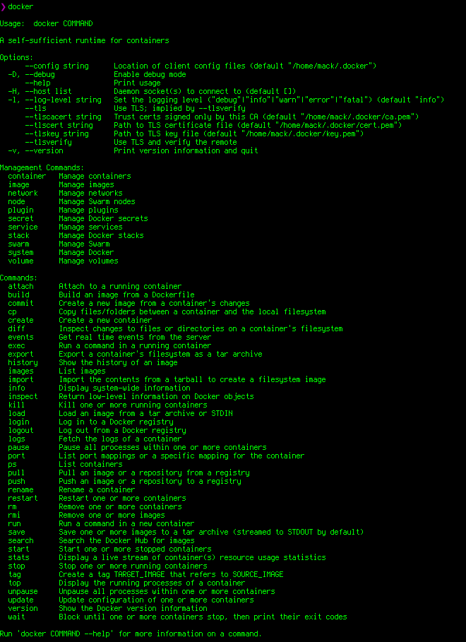

Para saber las opciones de cada comando y ayuda de ellos

```docker
docker ps --help
```

Para saver la información del docker que tenemos instalado

```docker
docker info
docker version
```

## DOCKER ENGINE

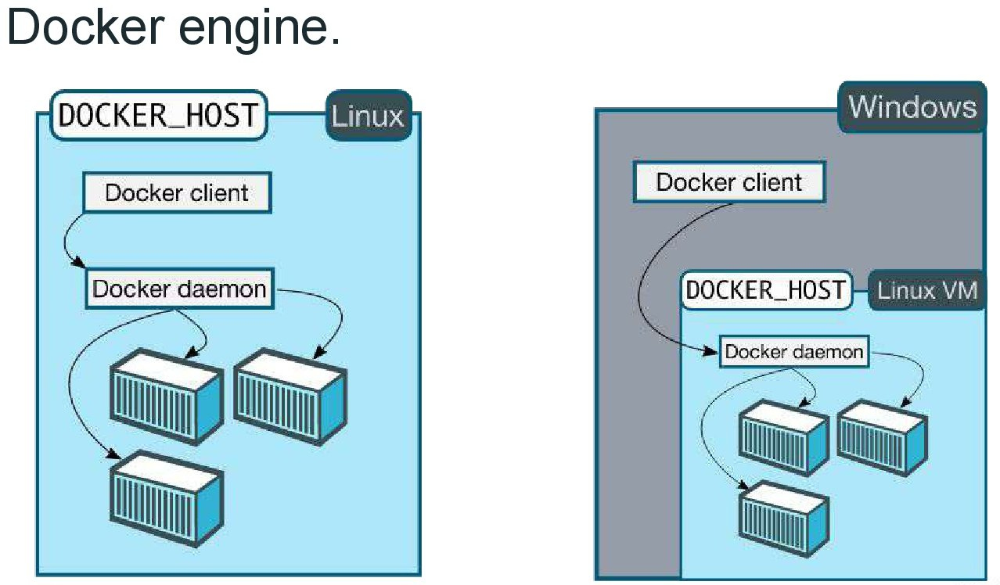

## Contenedores e imagenes

- Imagenes
  - Plantilla de sólo lectura para crear nuestros contenedores.
  - Creadas por nosotros u otros usuarios de la cumunidad.
  - Se puden guardar en registro interno o público.
- Contendores
  - Aplicación aislada.
  - Contiene todo lo necesario para ejecutar nuestra aplicación.
  - Basados en una o más imagenes.

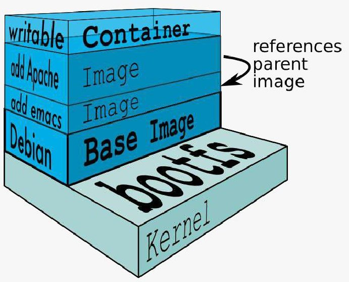

Para saber que imágenes locales tenemos con docker

```docker
docker images
```

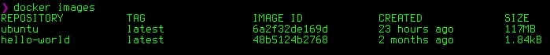

## Ciclo de vida de los contenedores

- Ciclo de vida básico
  - Se crea el contenedor a partir de una imagen
  - Se ejecuta un proceso determinado en el contenedor
  - El proceso finaliza y el contenedor se detiene
  - Se destruye el contenedor
- Ciclo de vida avanzado
  - Se crea el contenedor a partir de una imagen
  - Se ejecuta un proceso determinado en el contenedor
  - Realizar acciones dentro del contenedor
  - **Detener el contenedor**
  - **Lanzar el contenedor nuevamente**

Para instalar o correr una imagen que se encuentra instalada y si no lo esta se descarga de hub.docker.com que el sitio de docker de imágenes publicas por ejemplo la imagen de **hello-world**

- Para descargar una imagen del repositorio externo, se utiliza el comando `docker pull`
- Cuando se ejecuta un contenedor con el comando `docker run` las imágenes son descargadas automáticamente si no se encuentran en el repositorio `local local copy is found`

```docker
docker run hello-world
```

Para instalar una imagen de manera OFICIAL de [Docker Hub](https://hub.docker.com/ "Docker Hub")

```docker
docker pull <NOMBRE_DE_IMAGEN>
```

De forma automática se descargara la ultima version **latest** que esta marcada en **tag**
Si se **requiere instalar** una **imagen** de **versión especifica**

```docker
docker pull <NOMBRE_DE_IMAGEN:TAG_NAME>
```

**NOTA: Para buscar imagenes de docker con la linea de comandos:**

```docker
docker search <NOMBRE_DE_LA_IMAGEN>
```

ejem.

```docker
docker pull ubuntu:14:04
```

## Creando nuestro primer contenedor

• Utilizando el comando

```docker
docker run
```

- El comando docker run realiza 2 acciones
  – Crea el contenedor con la imagen especificada
  – Ejecuta el contenedor
- Sintaxis

```docker
docker run [opciones] [imagen] [comando][args]
```

-El formato de la imagen es repository:[tag]

ejem.

```docker
docker run ubuntu echo "Hola desde Docker en ubuntu"
```

Para comprobar que se ejecuto desde la imagen de **docker ubuntu**

```docker
docker ps -a
```

tiene salida...

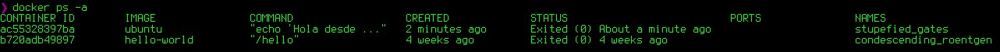

Si se desea saber que **imágenes** son las que se **están ejecutando**

```docker
docker ps
```

## Listando los contenedores

- Utilizar docker `ps` para listar los contenedores
- La bandera `–a` lista todos los contenedores (inclusive aquellos que se encuentran detenidos)

## Contenedores interactivos

- Utilizar las banderas `-i` and `-t` en el comando **docker run**
- La bandera `-i` le indica a docker utilizar el STDIN del contenedor
- La bandera `-t` indica que se requiere de una pseudo terminal
- Nota: Es necesario ejecutar un proceso de terminal en el contenedor `(ej: sh /bash /zsh /etc)`

ejem...

```docker
docker run -it ubuntu bash
```

y en los procesos de docker se muestra que se esta ejecutando

Para crear un contenedor al que puedas entrar y salir todo lo que quieras se debe definir expresamente un entrypoint como `/bin/bash` usando por ejemplo el siguiente comando:

```bash
docker run -it --entrypoint /bin/bash --name ubuntu ubuntu:latest
```

_PARA SALIR DEL CONTENEDOR_

```bash
exit
```

- :link: [Linux Alpine Docker Hub](https://hub.docker.com/_/alpine)
- :link: [Linux Alpine](https://wiki.alpinelinux.org/wiki/Tutorials_and_Howtos#Postinstall:_desktops_and_applications)

```bash
$ docker pull alpine
#
$ docker run -it --entrypoint /bin/sh --name [NOMBRE_DESEADO] [NOMBRE_DE_IMAGEN]
#
$ docker run -it --entrypoint /bin/sh --name prueba alpine:latest
```

Cada vez que se ejecuta el comando `$ docker run` se crea un contenedor **nuevo, completamente diferente** y nos damos cuenta en el **HASH**

```bash
root@10c74cf79623:/#
```

Para poder entrar de nuevo al **mismo contenedor** se tiene que poner el mismo **HASH**

```docker
docker start <CONTAINER_ID>
```

para confirmar que este correctamente levantado el contenedor se ejecuta el comando

```docker
docker ps
```

**SI Y SOLO SI**, con el contenedor levantado podemos entrar con el comando

```docker
# docker attach <CONTAINER_ID>
eje-
docker start -a -i <CONTAINER_ID>  (-a attach)
```

Cuando se ejecuta un contenedor de forma interactiva y se necesita SALIR y QUE SE SIGA EJECUTANDO, dentro del contenedor se tiene que pulsar las teclas

```bash
CRTL + P + Q
```

## ID de contenedores

- Los contenedores pueden referenciarse utilizando su ID de contenedor o un nombre
- ID formato reducido y extendido
- La información de puede obtener del comando `docker ps`
- Utilizar la bandera `--no-trunc` en `docker ps` para obtener el formato extendido de ID.

```docker
docker ps -a --no-trunc
```

#### Para poder hacer referencia a un contenedor por nombre (NO SE PUEDEN REFERENCIAR DOS CONTENEDORES CON EL MISMO NOMBRE)

```docker
docker run --name [UN_NOMBRE] ubuntu ls
```

ahora cuando ejecutando el comando `docker ps -a` aparece en la lista el `[CONTAINER_ID]` seguido por el `[NOMBRE]`

Para poder poner el mismo nombre a otro contenedor se tiene tiene que **REMOVER** el contenedor **(PRECAUCION)**

```docker
docker rm [UN_NOMBRE]
```

Para forzar la detención de un contenedor se usa

```docker
docker kill [CONTAINER_ID]
```

## Listado con filtro de contenedores con `docker ps`

- La bandera `--filter` agrega condiciones de filtrado
- Se puede filtrar basado en el código de salida y estado del contenedor
- El estado puede ser
  - Restarting
  - Running
  - Exited
  - Paused
- Para especificar múltiples condiciones utilizar la bandera --filter por cada condición
- Otros filtros: `id` `label` `name` `exited` `status` `ancestor` `isolation`

```docker
docker ps --help
docker ps -h
```

### Eliminar/borrar imagenes & contenedores

SINTAXIS IMÁGENES

```
docker rmi [OPTIONS] IMAGE [IMAGE...]
```

| Name, shorthand | Default | Description                    |
| --------------- | ------- | ------------------------------ |
| --force, -f     | FALSE   | Force removal of the image     |
| --no-prune      | FALSE   | Do not delete untagged parents |

LISTAR

```docker
docker ps -a
```

ELIMINAR

```docker
docker rmi <image ó hash>
```

Eliminar imagenes que se quedan colgadas

LISTAR

```docker
docker images -f dangling=true
```

ELIMINAR

```docker
docker rmi $(docker images -f dangling=true -q)
```

Eliminar imagenes de acuerdo a algun patron

LISTAR

```docker
docker ps -a | grep "pattern"
docker ps -a | grep "pattern"
```

ELIMINAR

```docker
docker images | grep "pattern" | awk '{primt $1}' | xargs docker rm
```

ELiminar todas las imagenes

LISTAR

```docker
docker images -a
```

ELIMINAR

```docker
docker rmi $(docker images -a -q)
```

### Eliminar contenedores e imagenes al mismo tiempo

```docker
docker rm $(docker ps -aq) && docker rmi $(docker images -q)
```

### Sintaxis contenedores

```docker
docker rm [OPTIONS] CONTAINER [CONTAINER...]
```

Para eliminar un contenedor especifico

```docker
docker rm [ID_or_Name] [ID_or_Name]
```

Para eliminar un contenedor después de crearlo. Se crea y cuando acaba su función para la cual fue creado se elimina

```docker
docker run --rm [image_name]
```

Puede localizar contenedores utilizando `docker ps -a` y filtrarlos por su estado: `created, restarting, running, paused, o exited`.
Para revisar la lista de contenedores salidos, utilice el indicador `-f` para filtrar en función del estado.
Cuando haya verificado que desea eliminar esos contenedores, utilice `-q` para pasar los identificadores al comando `docker rm`

LISTAR

```docker
docker ps -a -f status=exited
```

ELIMINAR

```docker
docker rm $(docker ps -a -f status=exited -q)
```

(otra forma de filtrado)

LISTAR

```docker
docker ps -a -f status=exited -f status=created
```

ELIMINAR

```docker
docker rm $(docker ps -a -f stauts=exited -f status=created -q)
```

Eliminar contenedores dependiendo de un patron
LISTAR

```docker
docker ps -a | grep "pattern"
```

ELIMINAR

```docker
docker ps -a | grep "pattern" | awk '{print $3}' | xargs docker rmi
```

### Detener y eliminar todos los contenedores

LISTAR

```docker
docker ps -a
```

ELIMINAR

```docker
docker stop $(docker ps -a -q)
docker rm $(docker ps -a -q)
```

Ejemplo para hacer **ping** desde un contenedor

```docker
docker run ubuntu:14.04 ping -c 10 www.google.com
```

## Ejecutando contenedores de fondo

- Correr de fondo **(background)** o como **demonio**
- Utiliza la bandera `-d` (detached mode)
- Para poder ver el "output" utilizar el comando `docker logs [id contendor]/[nombre contenedor]`

Ejemplo para hacer ping desde un contenedor ejecutarlo como **demonio ó contenedor de fondo**

```docker
docker run -d ubuntu:14.04 ping -c 10 www.google.com
```

Los contenedores están aislados del sistema y a nivel de red, cada contenedor tiene su propia stack de net y sus propios puertos.

Debemos redirigir los puertos del contenedor a los de la computadora y lo podemos hacer al utilizar este comando:

```docker
docker run -d --name server -p 8080:00  nombreDelContenedor
```

```docker
docker run -d -name server ngnix -p 8080:80
```

### Para ver los log de un contenedor

Se tiene que ejecutar el comando **cuando un contenedor se encuentra activo**

```docker
docker loogs [CONTAINER_ID]
```

Para poder ver en **tiempo real el log** de un contenedor se añade una bandera

```docker
docker logs -f [CONTAINER_ID]
```

## Un caso practico

- Ejecutar un servidor de aplicaciones (tomcat)
- La bandera `-P` expone los puertos utilizados por el contenedor

## Vincularse a un contenedor

- Vincularse a un contenedor, traera dicho contenedor al frente
- El output del proceso 1 será mostrado por la pantalla
- Utilizar **docker attach** y especifica el **nombre / ID** del contenedor
- **Cuidado** SÍ se preciona **CTRL+C** vinculado a un contenedor, el mismo se detendra de mandera inmediata

## Docker exec

- docker exec habilita a ejecutar procesos adicionales dentro del contenedor.
- Generalmente se utiliza para acceder dentro de una terminal dentro de un contenedor en ejecucion.

```docker
docker exec -i -t [CONTENEDOR_ID] [comando]
```

- Al salir del contenedor no finaliza el contaniner.

## Acciones sobre un contenedor

- `docker stop` y `docker kill` detienen un contenedor en ejecución.}
- `docker start` se utiliza para un contenedor en estado **STOPED** o **KILLED**.
- La bandera `-a` en `docker start` se utiliza para ejecutarse automaticamente al contenedor.

Pausa un contenedor

```docker
docker pause [CONTAINER_ID]
docker unpause [CONTAINER_ID]
```

## Inspeccionando un contenedor

El comando `docker inspect` se utiliza para acceder a información util de un contenedor.

```docker
docker inpect [CONTAINER_ID]
```

eje.

```docker
docker inspect [CONTAINER_ID] | grep macadress
```

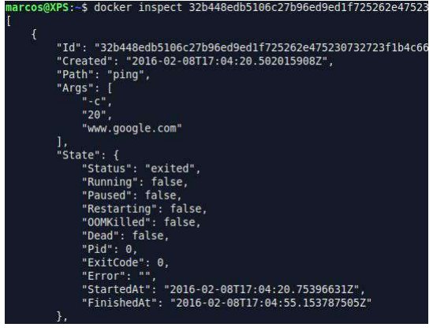

## Formas de crear imagenes

Tres modos

- Hacer `commit` de los contenidos de un contenedor
- Contruir una imagen basandose en un **dockerfile**
- Importar un archivo **tar** a docker con el contenido de una imagen

Creación de imagenes.

- Sistemas de capas entre imágenes.
- Docker crea una ultima capa de modo escritura para los contenedores.
- Las imagenes padre son de solo lectura.
- Todos los cambios son realizados en la capa de escritura.

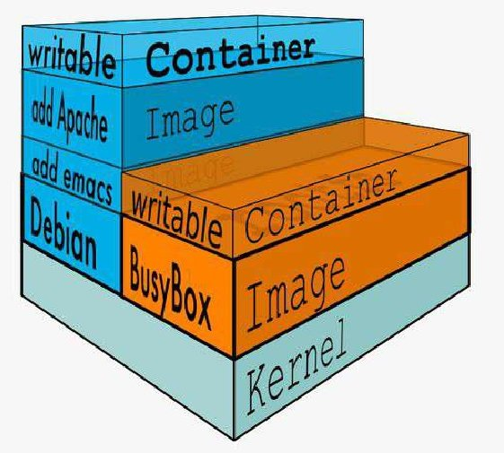

### Crear una imagen con el metodo `commit`

1ro Se tiene que crear un cotenedor de form interactiva

```docker
docker run -it <NOMBRE_DE_LA_IMAGEN>
```

Para ejemplo demostrativo se podría crear un archivo el cual se verificara más adelante.

- Dejando el contenedor corriendo, se habre otra consola y en la consola nueva se crea la imagen con el comando `commit`

```docker
docker commit [CONTAINER_ID] [NOMBRE_QUE_SE_DESEA]:[TAG(opcional)]
```

- Con esto la imagen ya esta creada
- Verificar que la imagen este creada con el comando

```docker
docker ps
```

- Ingresar dentro del contenedor y realizar las modificaciones necesarias
- Utlizar:

```docker
docker commit [CONTAINER_ID]
```

- Para observar los cambios realizados.
- Salvar los cambios realizados con el comando **docker commit** en una nueva imagen
- El formato de nombre de la imagen puede ser:
  - Oficial
    - ununtu 14.04
    - nginx
  - Usuario/organizacion
    - johnny/myapp
    - mycompany/myapp
  - Registro privado
    - registry mycompany.com:5000/my-page

Para poder saber cuales son las **diferiencias** o los **cambios** en una **imagen** creada

```docker
docker diff [CONTAINER_ID]
```

### Para poder iniciar y detener docker

```bash
# systemctl deamon-reload
systemctl restart docker
```

#### NOTA -> COMANDO DEPRECADO

```docker
docker daemon --help
Command "daemon" is deprecated, and will be removed in Docker 17.12. Please run `dockerd` directly.

Usage: dockerd COMMAND
```

## Parametros de inicio del Docker Engine

- Cómo configurar los parámetro de inicio dependerá de:
  - Si nos encontramos ejecutando el demonio de manera interactiva o como un servicio(`docker daemon …`)
  - Si se encuentra corriendo como servicio, el sistema operativo (Ubuntu, Debian, CentOS or Fedora etc…)
- Si ejecutamos el demonio de docker de manera interactiva, especificar los parámetros de inicio es tan sencillo como:
  `sudo docker daemon [options] &`
- En el caso de utilizar **upstart** localizar el archivo en
  `/etc/default/docker` y modificar `DOCKER_OPTS` (_sudo service docker restart_ es necesario)
- En `systemd` localizar el archivo **docker service** (y modificar el archivo referenciado por la propiedad **EnvironmentFile**)

### CONFIGURACION DEL ARCHIVO DE DOCKER

:link: [Control and configure Docker with systemd](https://docs.docker.com/config/daemon/systemd/ "Control and configure Docker with systemd")

#### Realizar la configuración del archivo de docker ejecutar

```bash
# systemctl status docker
```

Se muestra los sig:

```bash
systemctl status docker
● docker.service - Docker Application Container Engine
  Loaded: loaded (/lib/systemd/system/docker.service; enabled)
  Active: active (running) since Wed 2017-04-26 20:36:20 CDT; 1h 26min ago
  Docs: https://docs.docker.com
 Main PID: 966 (dockerd)
  CGroup: /system.slice/docker.service
  ├─ 966 /usr/bin/dockerd -H fd://
  └─1048 docker-containerd -l unix:///var/run/docker/libcontainerd/docker-containerd.sock --metrics-interval=0 --start-timeout 2m --state-dir /var/run/docke...
```

#### Para los sistemas linux `systemd` tiene que realizar de la siguiente forma

_Links de referencia_->
:link:

1. [#custom-docker-daemon-options](https://docs.docker.com/engine/admin/systemd/#custom-docker-daemon-options)
2. [dockerd](https://docs.docker.com/engine/reference/commandline/dockerd/)
3. [#httphttps-proxy](https://docs.docker.com/engine/admin/systemd/#httphttps-proxy)
4. [#daemon-socket-option](https://docs.docker.com/engine/reference/commandline/dockerd/#daemon-socket-option)
5. [#troubleshoot-the-daemon](https://docs.docker.com/engine/admin/#troubleshoot-the-daemon)

#### Se tiene que crear en la siguiente ruta el archivo **daemon.json**

```bash
# /etc/docker/daemon.json
```

Tiene un formato json, y se pueden aplicar las siguientes variables dependiendo de las necesidades

```json
{
  "authorization-plugins": [],
  "data-root": "",
  "dns": [],
  "dns-opts": [],
  "dns-search": [],
  "exec-opts": [],
  "exec-root": "",
  "experimental": false,
  "storage-driver": "",
  "storage-opts": [],
  "labels": [],
  "live-restore": true,
  "log-driver": "",
  "log-opts": {},
  "mtu": 0,
  "pidfile": "",
  "cluster-store": "",
  "cluster-store-opts": {},
  "cluster-advertise": "",
  "max-concurrent-downloads": 3,
  "max-concurrent-uploads": 5,
  "default-shm-size": "64M",
  "shutdown-timeout": 15,
  "debug": true,
  "hosts": [],
  "log-level": "",
  "tls": true,
  "tlsverify": true,
  "tlscacert": "",
  "tlscert": "",
  "tlskey": "",
  "swarm-default-advertise-addr": "",
  "api-cors-header": "",
  "selinux-enabled": false,
  "userns-remap": "",
  "group": "",
  "cgroup-parent": "",
  "default-ulimits": {},
  "init": false,
  "init-path": "/usr/libexec/docker-init",
  "ipv6": false,
  "iptables": false,
  "ip-forward": false,
  "ip-masq": false,
  "userland-proxy": false,
  "userland-proxy-path": "/usr/libexec/docker-proxy",
  "ip": "0.0.0.0",
  "bridge": "",
  "bip": "",
  "fixed-cidr": "",
  "fixed-cidr-v6": "",
  "default-gateway": "",
  "default-gateway-v6": "",
  "icc": false,
  "raw-logs": false,
  "allow-nondistributable-artifacts": [],
  "registry-mirrors": [],
  "seccomp-profile": "",
  "insecure-registries": [],
  "disable-legacy-registry": false,
  "no-new-privileges": false,
  "default-runtime": "runc",
  "oom-score-adjust": -500,
  "runtimes": {
          "runc": {
                    "path": "runc"
          },
          "custom": {
                    "path": "/usr/local/bin/my-runc-replacement",
                    "runtimeArgs": [
                              "--debug"
                    ]
          }
  }
}
```

eje:

Para activar `debug` y el nivel del `debug` se hace de la siguiente manera:

```json
# daemon.json
{
 "debug":true,
 "log-level": "debug"
}
```

Posteriormente se tiene que reiniciar el demonio de docker

#### Para el **system upstart**

Se tiene que crear la variable en el archivo de la siguiente ruta que es predeterminada para
todos los sistemas

```
# vim /etc/default/docker
```

```bash
# PARAMETROS PERSONALIZADOS
OPTIONS="--log-level=debug"
```

Se tiene que modificar el archivo de la ruta

```bash
 /lib/systemd/system/docker.service
```

Para modificar el parametro de nivel de **debug** se tiene que modificar la variable **OPTIONS**

```bash
...
# En la version de docker 1.13 el parametro “daemon” es reemplazado por dockerd:
# Archivo: /lib/systemd/system/docker.service
# PARAMETROS PARA AGREGAR ARCHIVO DE AMBIENTE DE TRABAJO
# SE MANDA DONDE ESTA EL ARCHIVO PARA SISTEMAS service "/etc/default/docker"
EnvironmentFile=-/etc/default/docker # SI NO ESTA ESTA LINEA SE AGREGA
ExecStart=/usr/bin/docker -H fd:// $OPTIONS
...
```

Se tiene que reiniciar docker para que tome los cambios, para ver que cambio la forma **debug**

**NOTA -> PARA MOSTRAR LOS LOGS EN SISTEMAS LINUX CON _SYSTEMD_**

```bash
# journalctl -u docker
```

## ¿Qué podemos configurar en el inicio de docker?

- Decidir cómo escucha el demonio de docker (tcp / unix socket)
- Especificar un servidor DNS
- Definir el nivel de logging
- Habilitar el modo de DEBUG
- Cambiar el registro por defecto
- Configuraciones de seguridad (TLS)
  - Referencia completa [Use the Docker command line](https://docs.docker.com/engine/reference/commandline/cli/) :link:

## Logs del demonio de Docker

- Especificar el parámetro `--log-level` en cualquiera de sus variantes **(DOCKER_OPTS / interactiva)**
- En caso de ejecutarse como servicio es necesario reiniciar el demonio para que el mismo tome los cambios
- Ubicaciones por defecto:
  - Upstart: `/var/log/upstart/docker.log`
  - Interactivo: `stdout`
  - Systemd: `journalctl -f -u docker.service`

## Conectándose a un demonio de forma remota

- Hasta el momento nuestro cliente y servidor se encuentran en el mismo equipo
- Qué sucede si necesitamos conectarnos a un demonio externo?
- Es necesario cambiar unas configuraciones:
  - Primero es necesario decirle al demonio de docker que escuche en una conexión TCP
  - Luego es necesario configurar el cliente de docker para indicarle la dirección remota de nuestro demonio.
- El demonio de docker soporta conectividad mediante 3 tipos de APIs
  - unix (por defecto en /var/run/docker.sock - root)
  - tcp
  - fd (systemd)
- Finalmente configurar el cliente de manera correspondiente

### Para los sistemas linux **SYSTEMD** se que realizar de la siguiente forma

Modificar el archivo:

```bash
# vim /lib/systemd/system/docker.service
```

Se modifica la linea:

```bash
ExecStart=/usr/bin/dockerd -H fd://
```

Para que quede de la siguiente manera:

```bash
ExecStart=/usr/bin/dockerd -H fd:// -H tcp://0.0.0.0:2375
```

Se tiene que realizar el reinicio de docker con los comandos:

```bash
# systemctl daemon-reload
# systemctl restart docker
```

Se tiene que poner el siguiente parametro
NOTA: EL **PUERTO 2375** ES PARA CONEXIONES **NO ENCRIPTIDADAS** Y EL **PUERTO 2376** ES PARA **CONEXIONES ENCRIPTADAS.**

```bash
➜ ~ systemctl status docker
● docker.service - Docker Application Container Engine
  Loaded: loaded (/lib/systemd/system/docker.service; enabled; vendor preset: enabled)
  Active: active (running) since Sun 2017-10-01 20:17:07 CDT; 7s ago
  Docs: https://docs.docker.com
 Main PID: 9606 (dockerd)
  Tasks: 18
  Memory: 57.4M
  CPU: 934ms
  CGroup: /system.slice/docker.service
  ├─9606 /usr/bin/dockerd -H fd:// -H tcp://0.0.0.0:2375
  └─9613 docker-containerd -l unix:///var/run/docker/libcontainerd/docker-containerd.sock --metrics-interval=0 --start-timeout 2m --state-dir /var/run/docker/li
```

### Para ejecutar docker

Con las modificaciones al archivo `/lib/systemd/system/docker.service` se tiene que ejecutar docker de la siguiente manera:

```docker
docker -H tcp://0.0.0.0:2375 ps[SE EJECUTA EL COMANDO ps]
```

### Utilizar variales del file system

Para que no se tenga que escribir en todas las ocasiones el comando `-H tcp://0.0.0.0:2375` se setea una variable en FILE SYSTEM de linux de la siguiente manera:

```bash
export DOCKER_HOST="-H tcp://0.0.0.0:2375"
```

## DOCKERFILES

- :link: [Best practices for writing Dockerfiles](https://docs.docker.com/develop/develop-images/dockerfile_best-practices/)
- :link: [pythonspeed](https://pythonspeed.com/)
- :link: [A deep dive into the official Docker image for Python](https://pythonspeed.com/articles/official-python-docker-image/)
- :link: [Production-ready Docker packaging for Python developers](https://pythonspeed.com/docker/)

#### Imagen oficial de Docker para Python recomendada

### :rotating_light: :construction: :construction: :rotating_light:

:link: [A deep dive into the official Docker image for Python](https://pythonspeed.com/articles/official-python-docker-image/) como lo recomienda el articulo y tambien en la imagen de python que esta basado :link: :octocat: :whale: [cookiecutter-django](https://github.com/pydanny/cookiecutter-django) es la imagen de Docker de :link: :octocat: [python 3.8 slim-buster](https://github.com/docker-library/python/blob/master/3.8/buster/slim/Dockerfile) La bariante de _Debian_ `slim`tiene menos paquetes instalados, así que no hay compiladores por ejemplo.

```bash
docker pull python:3.8-slim-buster
```

Crear un contenedor basado en la imagen de `python:3.8-slim-buster` y ponerle como combre `python_38_slim_buster` de _forma interactiva_ y entrar a _bash_

```bash
docker run -it --name python_38_slim_buster python:3.8-slim-buster /bin/bash
```

- Provee una forma más efectiva de generar imágenes en vez de utilizar `docker commit`
- Se integra de manera automática en el flujo de desarrollo y de integración continua
- Las instrucciones más utilizadas son `FROM` y `RUN`
- Una vez construido el Dockerfile, utilizar `docker build (-t)` para generar la nueva imagen

```docker
docker build <RUTA_DE_DONDE_SE_ENCUENTRA_EL_ARCHIVO_DOCKERFILES>
```

Ejemplo de archivo. Estas lineas crea una imagen desde la imagen de "ubuntu"

```bash
# Ejemplo de un comentarlo
FROM ubuntu:14.04
RUN apt-get -q update
RUN apt-get install -y vim
RUN apt-get install -y curl
```

Para comprobar que si se instalaron los paquetes:

```docker
docker run -it <ID_CONTEINER> bash
```

El comando para poder ejecutar ese archivo estando ubicados dentro de la ruta del archivo creado anteriormente.

```docker
docker build .
```

**NOTA:** Se crea sin nombre y sin "_tag_"

Para poder crear una imagen con nombre con el con el contenedor anterior.

```docker
docker build -t [NOMBRE_DE_LA_IMAGEN:NOMBRE_DE_TAG][RUTA_DE_DONDE_SE_ENCUENTRA_ARCHIVO_DOCKERFILE]
```

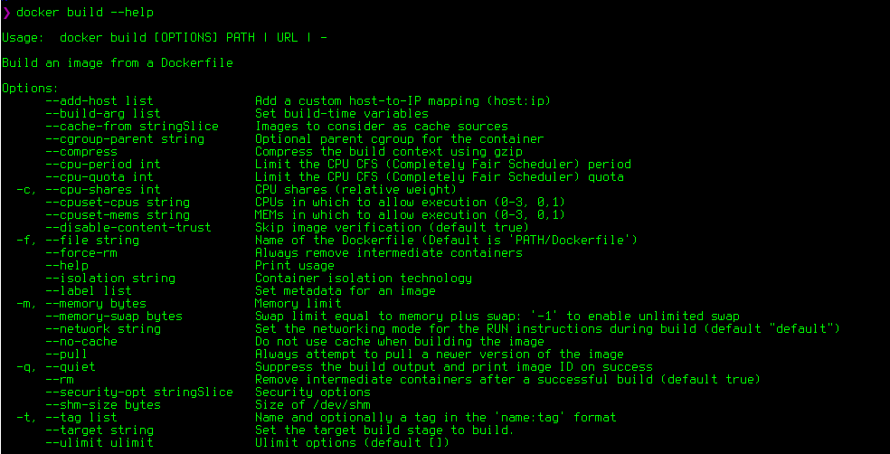

- `ARG` - This instruction allows you to define variables that can be passed at build-time. You can also set a default value.
- `FROM` - The base image for building a new image. This instruction must be the first non-comment instruction in the Dockerfile. The only exception from this rule is when you want to use a variable in the `FROM` argument. In this case, `FROM` can be preceded by one or more `ARG` instructions.
- `LABEL` - Used to add metadata to an image, such as description, version, author ..etc. You can specify more than one `LABEL`, and each `LABEL` instruction is a _key-value pair_.
- `RUN` - The commands specified in this instruction will be executed during the build process. Each RUN instruction creates a new layer on top of the current image.
- `ADD` - Used to copy files and directories from the specified source to the specified destination on the docker image. The source can be local files or directories or an URL. If the source is a local tar archive, then it is automatically unpacked into the Docker image.
- `COPY` - Similar to `ADD` but the source can be only a local file or directory.
- `ENV` - This instruction allows you to define an environment variable.
- `CMD` - Used to specify a command that will be executed when you run a container. You can use only one `CMD` instruction in your Dockerfile.
- `ENTRYPOINT` - Similar to `CMD`, this instruction defines what command will be executed when running a container.
- `WORKDIR` - This directive sets the current working directory for the RUN, `CMD`, ENTRYPOINT, COPY, and `ADD` instructions.
- `USER` - Set the username or `UID` to use when running any following RUN, `CMD`, ENTRYPOINT, COPY, and `ADD` instructions.
- `VOLUME` - Enables you to mount a host machine directory to the container.
- `EXPOSE` - Used to specify the port on which the container listens at runtime.

```bash
# DOCKERFILE
FROM ubuntu:18.04

RUN apt-get update && \
    apt-get install -y redis-server && \
    apt-get clean

EXPOSE 6379

CMD ["redis-server", "--protected-mode no"]
```

1. On line 1 we are defining the base image.
2. The `RUN` instruction that starts on line 3 will update the `apt` index, install the _“redis-server”_ package and `clean the apt cache`. The commands used in instructions are the same as the commands you would use to install redis on Ubuntu server .
3. The `EXPOSE` instruction defines the port on which the redis server listens.
4. In the last line, we are using the `CMD` instruction to set the default command that will be executed when the container runs.

The next step is to build the image. To do so run the following command from the directory where the Dockerfile is located:

```bash
docker build -t linuxize/redis .
```

The option `-t` specifies the image name and optionally a _username_ and _tag_ in the `username/imagename:tag` format.

```bash
# In path/to/your/dev/folder/Dockerfile
# Base Image
FROM python:3.6

RUN apt-get update && apt-get install -y --no-install-recommends \
        python3-setuptools \
        python3-pip \
        python3-dev \
        python3-venv \
        git \
        && \
    apt-get clean && \
    rm -rf /var/lib/apt/lists/*

EXPOSE 8000

CMD python -c "print('hello world')"
```

- `FROM`
  - `FROM` is going to build your image from another pre-existing image. This can get pretty advanced so for now, we just use a good python 3.6 image.
- `RUN`
  - `RUN` is a command that allows you to do any bash shell command you'd do normally. In our case, we just do some basic system updates and basic installs.
- `EXPOSE`
  - `EXPOSE` allows your docker image to have a port or ports exposed to outside the image. This is important for web applications and software you want to receive requests.
- `CMD`
  - `CMD` this is the final command your docker image will run. It's typically reserved for something like running a web application.
- `COPY`
  - `COPY` copy is another command we haven't yet added to our Dockerfile. This will allow you to copy local files to your Docker image.

```docker
docker build -t hello-world -f Dockerfile .
```

- `-t` portion means "_tag_" and you can add your own tag name I used _hello-world_ since this might be your first time using Docker. When in doubt, include a tag.
- `-f` is the path to the _Dockerfile_ you're going to use to build your image.

```bash
FROM python:3

WORKDIR /usr/src/app

COPY requirements.txt ./
RUN pip install --no-cache-dir -r requirements.txt

COPY . .

CMD [ "python", "./your-daemon-or-script.py" ]
```

#### :whale: + :snake: Docker + Django

:construction: En la carpeta Docker se encuentra el ejemplo **dj_docker**

- :link: [Django on Docker - A Simple Introduction](https://www.codingforentrepreneurs.com/blog/django-on-docker-a-simple-introduction)
- :link: [Installing system packages in Docker with minimal bloat](https://pythonspeed.com/articles/system-packages-docker/)

Crear una carpeta `dj_docker`

Instalar pipenv

```bash
python3 -m pip install --user pipenv
```

Crear carpeta con el nombre del projecto

```bash
mkdir dj_docker
```

Crear el ambiente virtual

```bash
# --tree QUE OCUPE PYTHON 3
$ pipenv --three
```

Instalar django

```bash
pipenv install django
```

Instalar gunicorn

```bash
pipenv install gunicorn
```

Activar amviente virtual

```bash
pipenv shell
```

Crear un proyecto en django

```bash
pipenv run django-admin startproject dj_docker .
```

BD local y migraciones

```bash
python manage.py makemigrations
python manage.py migrate
python manage.py createsuperuse
#
USER: dj_doker_2020
PWD: dj docker 2020
```

Actualizar dentro de `settings.py`

```bash
# importar os
import os
...
# DEBUG can be True/False or 1/0
DEBUG = int(os.environ.get('DEBUG', default=1))
```

Crear el archivo `.env` en carpeta raiz solo con la info de `DEBUG=1`

```bash
touch .env
# EDITAR EL ARCHIVO Y PONER SOLO LA INFO
DEBUG=1
```

Probar la configuración con

```bash
gunicorn dj_docker.wsgi:application --bind 0.0.0.0:8000
```

En local browser ir a la dirección `http://localhost:8000/`

Crear el archivo `Dockerfile` la imagen y el contenedor

Dentro de la carpeta del proyecto `dj_docker` crear el archivo `Dockerfile`

```bash
touch Dockerfile
```

Estructura de archivos y carpetas del projecto

```bash
.
├── db.sqlite3
├── dj_docker
│   ├── asgi.py
│   ├── __init__.py
│   ├── settings.py
│   ├── urls.py
│   └── wsgi.py
├── Dockerfile
├── .env
├── install-packages.sh
├── manage.py
├── Pipfile
└── Pipfile.lock
```

El archivo `Dockerfile` ocupa la imagen

```bash
docker pull $ docker pull python:3.8-slim-buster
```

```bash
# BASE IMAGE
FROM python:3.8-slim-buster

# RUN ITS CONTENT THE FILE TO INSTALL
# UPDATES FROM THE DEBIAN REPOSITORIES
COPY install-packages.sh .
RUN chmod +x install-packages.sh
RUN ./install-packages.sh

# CREATE AND SET WORKING DIRECTORY
RUN mkdir /app
WORKDIR /app

# ADD CURRENT DIRECTORY CODE TO WORKING DIRECTORY
ADD . /app/

# SET DEFAULT ENVIRONMENT VARIABLES
ENV PYTHONUNBUFFERED 1
ENV PYTHONDONTWRITEBYTECODE 1
ENV DEBIAN_FRONTEND=noninteractive
# ENV LANG C.UTF-8

# SET PROJECT ENVIRONMENT VARIABLES
# GRAB THESE VIA PYTHON'S os.environ
# THESE ARE 100% OPTIONAL HERE
ENV PORT=8000

RUN apt-get update \
  # && apt-get install -y apt-utils \
  # DEPENDENCIES FOR BUILDING PYTHON PACKAGES
  && apt-get install -y build-essential \
  # PSYCOPG2 DEPENDENCIES
  && apt-get install -y libpq-dev \
  # TRANSLATIONS DEPENDENCIES
  && apt-get install -y gettext \
  # INSTALL GIT
  && apt-get install -y git \
  # CLEANING UP UNUSED FILES
  && apt-get purge -y --auto-remove -o APT::AutoRemove::RecommendsImportant=false \
  && rm -rf /var/lib/apt/lists/*

# INSTALL ENVIRONMENT DEPENDENCIES
RUN pip3 install --upgrade pip
RUN pip3 install pipenv

# INSTALL DEPENDENCIES FOR PROJECT FROM PIPFILE
RUN pipenv install --skip-lock --system --dev

EXPOSE 8888
CMD gunicorn dj_docker.wsgi:application --bind 0.0.0.0:$PORT
```

:eyes: En el mismo nivel se crea el archivo `install-packages.sh` el cual tiene por objetivo instalar las actualizaciones de debian por separado (_hay que hacer más pruebas para obtener menor peso de la imagen_)

```bash
#!/bin/bash

# Bash "strict mode", to help catch problems and bugs in the shell
# script. Every bash script you write should include this. See
# http://redsymbol.net/articles/unofficial-bash-strict-mode/ for
# details.
set -euo pipefail

# Tell apt-get we're never going to be able to give manual
# feedback:
export DEBIAN_FRONTEND=noninteractive

# Update the package listing, so we know what package exist:
apt-get update

# Install security updates:
apt-get -y upgrade

apt-get -y install --no-install-recommends apt-utils

# Install a new package, without unnecessary recommended packages:
apt-get -y install --no-install-recommends syslog-ng

# Delete cached files we don't need anymore:
apt-get clean
rm -rf /var/lib/apt/lists/*
```

Construir la imagen Docker

```bash
docker build -t simple-django-on-docker -f Dockerfile .
```

Ejecutar el contenedor

```bash
docker run -it -p 80:8888 simple-django-on-docker
```

En la dirección `http://localhost` para comprobar que se esta ejecutando

## El build cache

- Docker guarda un snapshot de cada imagen luego de cada instrucción de build
- Antes de ejecutar un paso, docker revisa si la instrucción se encuentra en la cache teniendo en cuenta el orden original.
- Si la condición anterior se cumple, docker utiliza la cache en vez de ejecutar el paso nuevamente.
- Docker utuiliza comparación de estrings exactas para checar con la cache.
  - Simplemente cambiando el orden de las instrucciones la cache se invalida.
- Para deshabilitar la cache manuelmente se pude utilizar la bandera `--no-cache`

```bash
docker build --no-cache -t imagen .
```

Estas lineas crean una imagen desde la imagen de "ubuntu" PERO en una sola CAPA "**LAYER" ESTO SE HACE PARA HACER MEJOR PERFORMANCE**

```bash
# .Dockerfile NOMBRE DEL ARCHIVO
FROM ubuntu
RUN apt-get install curl -y && RUN apt-get install vim -y
```

De esta namenra se crea **una** sola **capa** y se instalo lo mismo. Esta es la manera recomendada por parte de docker. Para que no pese tanto la imagen creada.
**NOTA: LAS CAPAS CREADAS EN UNA IMAGEN PERSONALISADA SE PUEDEN USAR COMO UNA IMAGEN DESCARGADA, SE PUDEN TRATAR COMO CUALQUIER _CONTENEDOR_**

## Historia de una imagen

- El comando `$ docker history [CONTAINER_ID]` muestra las capas de las cuales se encuentra creada una imagen.
- Se puede observar cada capa, cuando fue creada, su tamaño y el comando con el cual se generó.

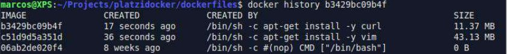

## La instrucción CDM

- **CDM** define el comando por defecto a ejecutar cuando se crea el contenedor
- Se puede usar tanto el formato **Shell** como **Exec**
- _Solo se puede especificar una vez en el dockerfile_
  - Si se especifica multiples veces, sólo la ultima será valida
- Puede ser **anulado** manualmente via el **docker CLI**
  ejem:

```docker
# Ejemplo de comando CMD
# 1
# FROM debian
# RUN apt-get -q update
# RUN apt-get install -y curl
# RUN apt-get install -y vim
# 2
FROM debian
CMD ping -c 10 www.google.com
```

ejem:

```docker
# 1
# FROM debian
# RUN apt-get -q update
# RUN apt-get install -y curl
# RUN apt-get install -y vim
# 2
# FROM debian
# CMD ping -c 10 www.google.com
# 3
FROM debian
CMD ["ping", "-c", "10", "www.google.com"]
```

## La instrucción ENTRYPOINT

- Define el punto de entrada con el comando que el container correrá cuando se crea
- Los argumentos de _runtime_ son enviados como parámetros a la instrucción ENTRYPOINT
- También posee forma de **EXEC** y **Shell**
- El contenedor funciona a modo de ejecutable

El comando `ENTRYPOINT` sirve para poder usar comandos de forma interactiva y se puden ocupar en conjunto con el comando **CMD**
y se tienen que poner en el **formato EXEC** "_si no, no funciona._"

```docker
FROM ubuntu
CDM ["-c", "2", "www.google.com"]
ENTRYPOINT ["ping"]
```

Se utiliza el comando **CDM** para poder mandarle los parametros al _comando ping_ en caso contrario **después de hacer build** a la imagen y al momento de correr la imagen se le tendrian que indicar que parametros se le pasan a ping

## Copiando archivos

- Cuando creamos imágenes generalmente necesitamos hacer más cosas que instalar paquetes
- Ejemplos:
  - Compilar nuestro código y ejecutar nuestra aplicación
  - Copiar archivos de configuración
  - Copiar otro contenido
- Para eso utilizamos la instrucción `COPY <SRC> ... <SRC> <DST>`

ejem:

```docker
FROM ubuntu
COPY test.txt /tmp/platzi
CMD cat /tmp/platzi
```

Lo que realiza este build de la imagen ubuntu es copiar una archivo que se encuentra en la misma ruta de la imagen,
dentro de la imagen, y ya despues dentro de la imagen imprime el contenido del archivo

## Dockerizando nuestra aplicación :rotating_light: :link

- Utilizar Dockerfiles resulta esencial para lograr que nuestra aplicación se ejecute en contenedores
- Tomemos nuestra por ejemplo. Para ejecutarla necesitamos lo siguiente
  - Python
  - Librerías accesorias
  - Archivos adicionales de configuración
- Qué sucede cuando queremos llevar nuestra aplicación a otro entorno?
- Podemos hacer un docker container y utilizarlo de igual manera en todos nuestros ambientes

**NOTA: El parametro _EXPOSE_ es para poder expecificarle a docker que puerto usar y se osupca en conjunto
con el parametro -P al momento de correr nuestra imagen.**

```docker
FROM python:2.7

COPY app.py requirements.txt /app/
RUN pip install -r /app/requirements.txt
CMD python /app/app.py
EXPOSE 5000
```

## Especificando un directorio de trabajo

- La instrucción `WORKDIR` permite setear el directorio de trabajo para el cual las instrucciones `RUN`, `CMD`, `ENTRYPOINT` y `COPY` puedan utilizar
- Sintáxis
  - `WORKDIR /ruta/a/carpeta`
- La ruta puede ser tanto absoluta como relativa **dentro del contenedor**
- La instrucción puede utilizarse más de una vez

```docker
FROM python:2.7

WORKDIR /app

COPY app.py requirements.txt ./
RUN pip install -r requirements.txt
CMD python app.py
EXPOSE 5000
```

## La instrucción ADD

- Puede hacer `FETCH` atrabes de la web.
- La instrucción **ADD** desempaqueta los archivos _.tar_
- Posee el mismo formato que la instrucción `COPY` y ambos operan de manera muy símilar
- **ADD** tiene la habilidad de descomprimir archivos automáticamente
- **ADD** puede obtener archivos de una URL (_no descomprime en este caso_)
- Ambas instrucciones **realizan un checksum** de los archivos añadidos para calcular la cache.

```docker
FROM ubuntu
RUN apt-get update && apt-get install -y jp2a
ADD http://cdn.meme.am./instances/66627195.jpg /tmp/img.jpg
ENV TERM xterm-256color
CMD jp2a --size=60x40 /tmp/img.jpg
```

## Otras instrucciones

- `MAINTAINER` agrega metadata al dockerfile sobre el dueño de la imagen, es lo primero despues del `FROM`
- `ENV` permite añadir variables de entorno al contenedor
- `LABEL` permite agregar etiquetas al contenedor

## Consejos y buenas prácticas para Dockerfiles

- Poner el primero comando `RUN` de las cosas que no van a cambiar demasiado
- **IMPORTANTE**: Cada línea del dockerfile crea una imagen nueva si modifica el estado de la imagen. Es importante buscar el balance entre la cantidad de capas creadas y la legibilidad del Dockerfile
- No instalar paquetes innecesarios
- Utilizar un `ENTRYPOINT` por dockerfile
- Combinar comandos similares utilizando **“&&”** y **“\”**
- Utilizar el sistema de cache de manera inteligente

link -> [Docker reference](https://docs.docker.com/engine/reference/builder/) :link:

## Compartir nuestras imágenes

- Para compartir nuestras imágenes tenemos las siguientes opciones
- Utilizar docker hub
- Utilizar nuestro propio servidor de registro interno
- Los comandos docker export y docker import
  - Las imágenes en Docker hub pueden ser públicas o privadas

:link: [Docker Hub](https://hub.docker.com)

## Etiquetando las imágenes

- Utilizado para renombrar imágenes locales antes de compartirlas en un repositorio
- Sintaxis:

```docker
docker tag [ID imagen] [repo:tag]
docker tag [local repo:tag] [repo:tag]
```

- Una imagen puede tener múltiples etiquetas

## Volumenes

**LOS VOLUMENES SON UN DIRECTORIO ESTATICO QUE SE COMPARTEN ENTRE LOS VOLUMENES, Y LOS VOLUMENES SON LOS CONTENEDORES DE DOCKER.**

- Un directorio asiganado en el contenedor en el cual se persiste información independiente del cliclo de la vida del contenedor
- Los cambios en el volúmen son excluidos cuando se guarda una imagen
- La información se persiste aunque se elimine el contenedor
- Pueden están mapeados a un directorio del host
- Pueden compartirse entre contenedores
- Las instrucciones `RUN` del Dockerfile no modifican la información de los volúmenes.

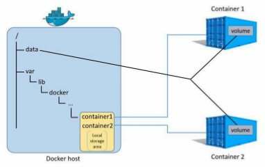

- Separa información del contenedor _vs_ persistente
- Sirven para compartir datos entre contenedores
- Tienen mejor performance ya que no utiliza `COW`

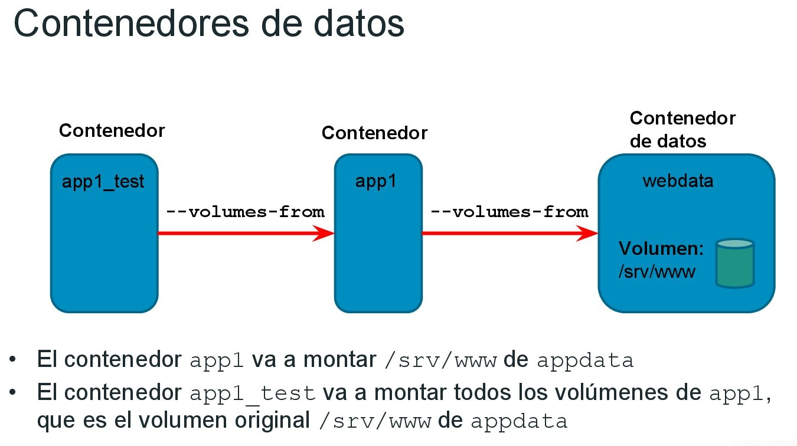

## Utilizando volúmenes

**ES UN DIRECTORIO ESTÁTICO QUE SE COMPARTE ENTRE TODOS LOS DIFERENTES CONTENEDORES DE DOCKER.**

:link: [Manage data in Docker](https://docs.docker.com/storage/)

- El comando docker volume contiene sub comando para gestionar los volúmenes en docker
- Los comandos son:

```docker
docker volume create <VOLUME_NAME>
docker volume ls
docker volume inspect <VOLUME_NAME>
docker volume rm <VOLUME_NAME>
```

- Para montar un volúmen se utiliza la bandera `-v` en el comando `docker run` (_puede utilizarse más de una vez_)
  Se pueden montar directorios del host con el formato

```bash
-v [host path]:[container path]:[ro|rw]
```

```bash
-v host_src:container_dest:options
```

- The `host_src` ca` be an absolute path to a file or directory on the host or a named volume.
- The `container_dest` is an absolute path to a file or directory on the container.
- Options can be `rw` _(read-write)_ and `ro` _(read-only)_. If no option is specified, _it defaults_ to `rw`.

ejem:

```docker
docker run --name web_server -d -p 8080:80 -v $(pwd)/public_html:/usr/share/nginx/html nginx
```

ejem:

```docker
docker run -it -v prueva:/prueba ubuntu bash
```

Para saber en donde se encuentra el directorio estático que se comparte: `$ docker volume inspect [VOLUMEN_NAME]`.

```json
# docker volume inspect <VOLUME_NAME>
[
  {
  "Driver": "local",
  "Labels": {},
  "Mountpoint": "/var/lib/docker/volumes/docker_volumen/_data",
  "Name": "docker_volumen",
  "Options": {},
  "Scope": "local"
  }
]
```

Entrar a la ruta `/var/lib/docker/volumes/docker_volumen/_data` para crear archivos y que se compartan entre todos los contenedores que se compartió el _volumen/carpeta_.

```bash
# cd /var/lib/docker/volumes/docker_volumen/_data
```

## Volúmenes en el Dockerfile

- La instrucción **VOLUME** crea un punto de montaje de volúmenes
- Se pueden especificar los argumentos como **JSON** o **string**
- Con este método no se pueden mapear archivos del host (debido a que el dockerfile puede ejecutarse en cualquier equipo)
- Los volúmenes son inicializados cuando el contenedor inicia con la data existente en el directorio
- _Los volúmenes se crean con nombre aleatorio/anonimo._

```docker
FROM ubuntu
VOLUME /ruta_del_volumen
```

```bash
Options:
  -f, --filter filter Provide filter values (e.g. 'dangling=true')
  --format string Pretty-print volumes using a Go template
  --help Print usage
  -q, --quiet Only display volume names
```

Los volumenes se pueden definir por **ruta** o por **nombre**.
Para especificar la ruta del volumen para que no la determine docker; pero se crea de manera anonima.:

```docker
docker run -it -v /ruta/absoluta/nombre_de_la_carpeta:/nombre_de_la_carpeta ubuntu bash
```

## Aspectos de Seguridad en Docker

:link: [OpenSSL](https://wiki.archlinux.org/index.php/OpenSSL)

- Docker permite ejecutar aplicaciones de manera segura debido a los controles y privilegios que utiliza
- Los Namespaces proveen una vista aislada del sistema. Cada contenedor utiliza su propio entorno de:
  - IPC, Stack de red, root file system etc…
- Los procesos que se ejecutan en un contenedor no pueden ver o afectar a procesos en otros contenedores
- Los Control groups (Cgroups) aislan los recursos del sistema utilizador por cada contenedor (memoria / cpu / red / io)
  - Aseguran que un contenedor no pueda hacer fallar el host por hacer mal uso de sus recursos.

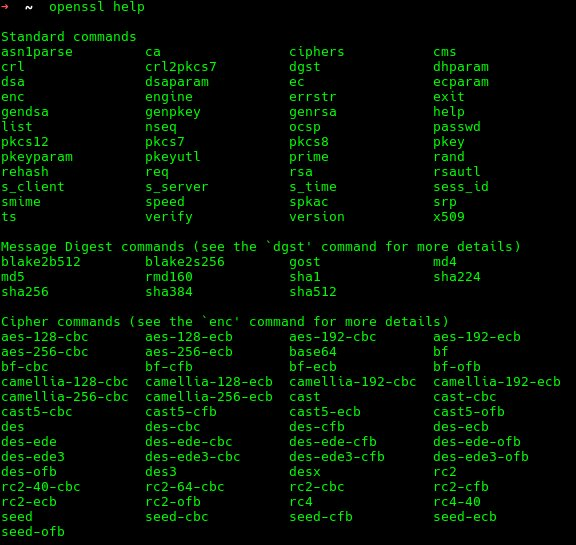

### Configuración de TLS (cont.)

- Docker provee mecanismos para autenticar el cliente y el demonio entre ellos.
- Agrega autenticación y autorización y encriptación para las conexiones a través de la red
- Las claves pueden ser distribuidas a clientes autorizados
- Requisitos
  - Tener instalado OpenSSL 1.0.1 o superior
  - Crear una carpeta donde guardar las claves protegidas (chmod 700)

### Pasos a seguir

- Crear una **A**utoridad de **C**ertificación **(CA)**
  - **(b)**. `Es necesario una clave privada y un certificado.`
- Configurar la clave privada del servidor
- Crear un requerimiento de firma **(CSR)** de certificado para el servidor
- Firmar la clave del servidor con el **CSR** _mediante nuestro_ **CA**
- Crear una _clave privada_ y un **CSR** para el _cliente_
- _Firmar la clave del cliente_ con el **CSR** mediante nuestro **CA**
- _Iniciar el demonio_ de docker con la opción de **TLS** y _especificar_ la _ubicación_ de la _clave privada_ del **CA**, el certificado del servidor y la clave privada del servidor
- _Configurar_ el _cliente de docker_ para que utilice la _clave privada del cliente_ y la clave privada del **CA**

#### 1 Crear la clave privada y un certificado

Se crea una carpeta donde se guarde la llave de la _Autoridad Certificante_ (**CA**)

```bash
mkdir docker-ca
```

(**1ra OPCION**) Se crea la llave **.pem** con el comando **"genrsa"** (`ESTA OPCIÓN ESTA DREPECADA`)

```bash
openssl genrsa -aes256 -out ca-key.pem 2048
```

- **"-genrsa"** -> Comando para decirle a **openssl** que se creara una llave privada **rsa**
- **"-aes256"** -> Es el algoritmo que se ocupa para crear la llave **.pem**
- **"-out"** -> Se le dice cual es el archivo en el cual esta la llave (`ca-key.pem`)
- **"2048"** -> La cantidad de bits que vamos a ocupar para nuestra encriptación.
  _Posteriormente pide una frase para la llave._

(**2da OPCION**) Se crea la llave **.pem** con el comando **"genpkey"**

```bash
openssl genpkey -algorithm RSA -out ca-key.pem -pkeyopt rsa_keygen_bits:4096
```

- **"-algorithm RSA"** -> Se le indica que deseamos que ocupe el algoritmo **RSA**.
- **"-out"** -> Se le indica cual es el nombre del archivo `.pem (ca-key.pem)`
- **"-pkeygen"** -> Se setea el algoritmo a ocupar.
- **"rsa_keygen_bits:4096"** -> Es el algoritmo que se ocupara para crear la llave y ocupara 4096 bits para crearlo.

(**3da OPCION**) Se crea la llave **.pem** con el comando **"genpkey"** `ENCRIPTADA (RECOMENDADA)` - _Clave privada de la autoridad autorizante_

```bash
openssl genpkey -aes-256-cbc -algorithm RSA -out ca-key.pem -pkeyopt rsa_keygen_bits:4096
```

- **"-aes-256-cbc"** -> Algoritmo de cifrado.
- **"-algorithm RSA"** ->Se le indica que deseamos que ocupe el algoritmo **RSA**.
- **"-out"** -> Se le indica cual es el nombre del archivo `.pem (ca-key.pem)`
- **"-pkeygen"** -> Se setea el algoritmo a ocupar.
- **"rsa_keygen_bits:4096"** -> Es el algoritmo que se ocupara para crear la llave y ocupara 4096 bits para crearlo.

**1.1** - Crear un certificado que ocupara el servidor y el cliente. Se crea el archivo **C**ertificación de **A**utoridad (**CA**) Es la solicitud de firma del certificado.

```bash
openssl req -new -x509 -days 365 -key ca-key.pem -sha256 -out ca.pem
```

- **"req -new"** -> Solicita generar un nuevo certificado. **request new**
- **"x509"** -> Es el tipo de certificado, que también sirve para poder gestionar el ciclo de vida del certificado.
- **"-days 365"** -> Es el tiempo de vida que se le asigna al certificado.
- **"[NOMBRE_/DE_LA/LLAVE].pem"** -> Es el nombre de la llave que se genero en el paso anterior **CA**, la _clave privada de la autoridad autorizante_.
- **"-sha256"** -> Comando de encriptación para el certificado, que también puede ser "**-sha512**"
- **"-out [NOMBRE_/DE_LA/LLAVE].pem"** -> Es en donde queremos guardar nuestro certificado. `(ca.pem)`

**NOTA**: AL CREAR EL CERTIFICADO PREGUNTARA POR LA **"frase"** DE LA LLAVE QUE SE ASIGNO AL CERTIFICADO **CA**

#### 2 Configurar la llave privada del servidor

**NOTA**: Se crea la llave privada del servidor, _SIN LA FRASE DE SEGURIDAD_

Se crea la llave **.pem** con el comando **"genpkey"**

```bash
openssl genpkey -algorithm RSA -out server-key.pem -pkeyopt rsa_keygen_bits:4096
```

- **"-algorithm RSA"** -> Se le indica que deseamos que ocupe el algoritmo RSA.
- **"-out [NOMBRE_/DE_LA_/LLAVE].pem"** -> Se le indica cual es el nombre del archivo .pem (server-key.pem)
- **"-pkeygen"** -> Se setea el algoritmo a ocupar.
- **"rsa_keygen_bits:4096"** -> Es el algoritmo que se ocupara para crear la llave y ocupara 4096 bits para crearlo.

#### 3 - Crear un requerimiento de firma (Certificate Signing Request - CSR) de certificado para el servidor

```bash
openssl req -subj "/CN=localhost" -sha256 -new -key server-key.pem -out server.csr
```

- **"openssl req"** -> Se solicita que **openssl** requiera la forma del certificado.
- **"-subj "/CN=localhost""** -> Ahora que se tiene una **CA**, podemos crear la clave para el servidor y
  la petición de firmado del certificado (**certificate signing request, CSR**).
  Por favor, _verifica que Common Name (es decir, el FQDN o YOUR Name) coincide con el nombre del host que vas a usar para conectar a Docker_.
  Es la máquina en donde se ejecuta el docker al cual nos vamos a conectar remotamente.
- **"-sha256"** -> Comando de encriptación para el certificado, que también puede ser "-sha512"
- **"-new -key"** -> Se solicita a openssl una nueva clave sobre la clave del servidor, previamente realizada.
- **"-out [NOMBRE_DEL_ARCHIVO]-csr"** -> Se crea el archivo .csr el cual es CSR de certificado para el servidor.

#### 4 - Firmar la clave del servidor con el CSR(Certificate Signing Request) mediante nuestro CA

`ESTE PASO ES EN DOS PARTES`

- **PASO UNO** -> Crear un archivo de para configuración del servidor y decirle de que maquinas puede recibir requerimientos. _En caso de que sea una VPS se pone la IP publica_
  - Como las conexiones **TLS** pueden realizarse usando la dirección **IP** o un nombre **DNS**, _deben especificarse durante la creación del certificado._

```bash
echo subjectAltName = IP:192.168.1.20,IP:127.0.0.1 > extfile.cnf
```

- **PASO DOS** -> Firmar la clave del servidor con la autoridad autorizante - **Firmar la clave pública con nuestra CA**

:link: [Link Protect the Docker daemon socket](https://docs.docker.com/engine/security/https/)

---

`Since TLS connections can be made via IP address as well as DNS name, the IP addresses need to be specified when creating the certificate. For example, to allow connections using 10.10.10.20 and 127.0.0.1:`

```bash
echo subjectAltName = DNS:$HOST,IP:10.10.10.20,IP:127.0.0.1 >> extfile.cnf
```

FRAGMENTO DE PÁGINA

---

```bash
openssl x509 -req -days 365 -sha256 -in server.csr -CA ca.pem -CAkey ca-key.pem -CAcreateserial -out server-cert.pem -extfile extfile.cnf
```

- **"openssl x509 -req -days 365"** -> Es el tipo de certificado, que también sirve para poder gestionar el ciclo de vida del certificado.Es el tiempo de vida que se le asigna al certificado.
- **"-sha256"** -> Comando de encriptación para el certificado, que también puede ser **"-sha512"**
- **"-in server.csr"** -> Se le dice a openssl que ocupe el archivo **CSR** que se creo en el paso anterior.
- **"-CA ca.pem"** -> Se solicita a openssl el certificado de autoridad creado en el paso anterior
- **"-CAkey ca-key.pem"** -> Se lolicita la clave privada de la autoridad autorizante
- **"-CAcreateserial -out server-cert.pem"** -> Es el parámetro que dice que estamos haciendo las credenciales para el servidor con salida al fichero **server-cert.pem** _para el servidor_.
- **"-extfile extfile.cnf"** -> Le mandamos los parámetros al archivo creado en el paso anterior

#### 5 - Crear una clave privada y un CSR para el `cliente`

**SON DOS PASOS**. Se realizan los mismos pasos que se hicieron que del lado del servidor, pero en la creación de la clave no se hará con la frase de seguridad, y se ocupara la **"1ra OPCIÓN"**

##### PASO UNO CREAR UNA CLAVE PRIVADA

(**1ra OPCION**) Se crea la llave **.pem** con el comando **"genpkey"** _---SIN ENCRIPTAR---_ **Clave para el cliente**

```bash
openssl genpkey -algorithm RSA -out client-key.pem -pkeyopt rsa_keygen_bits:4096
```

- **"-algorithm RSA"** -> Se le indica que deseamos que ocupe el algoritmo RSA.
- **"-out"** -> Se le indica cual es el nombre del archivo .pem (client.key.pem)
- **"-pkeygen"** -> Se setea el algoritmo a ocupar.
- **"rsa_keygen_bits:4096"** -> Es el algoritmo que se ocupara para crear la llave y ocupara 4096 bits para crearlo.

(**2da OPCION**) Se crea la llave **.pem** con el comando **"genpkey"** _---ENCRIPTADA---_ **Clave privada para el cliente.**

```bash
openssl genpkey -aes-256-cbc -algorithm RSA -out client-key.pem -pkeyopt rsa_keygen_bits:4096
```

- **"-aes-256-cbc"** -> Algoritmo de cifrado.
- **"-algorithm RSA"** ->Se le indica que deseamos que ocupe el algoritmo **RSA**.
- **"-out"** -> Se le indica cual es el nombre del archivo **.pem (client-key.pem)**
- **"-pkeygen"** -> Se setea el algoritmo a ocupar.
- **"rsa_keygen_bits:4096"** -> Es el algoritmo que se ocupara para crear la llave y ocupara **4096 bits** para crearlo.

##### PASO DOS Crear un requerimiento de firma (Certificate Signing Request - CSR) de certificado para el cliente

```bash
openssl req -subj "/CN=client" -sha256 -new -key server-key.pem -out client.csr
```

- **"openssl req"** -> Se solicita que openssl requiera la forma del certificado.
- **"-subj "/CN=client""** -> Se le puede escribir un nombre o un email
- **"-sha256"** -> Comando de encriptación para el certificado, que también puede ser **"-sha512"**
- **"-new -key"** -> Se solicita a openssl una nueva clave sobre la clave del servidor, previamente realizada.
- **"-out [NOMBRE_DEL_ARCHIVO]-csr"** -> Se crea el archivo **.csr** el cual es **CSR de certificado para el servidor**.

#### 6 - Firmar la clave del cliente con el CSR(Certificate Signing Request) mediante nuestro CA

**ESTE PASO ES EN DOS PARTES**
Para simplificar, los siguientes dos pasos pueden realizarse desde la máquina donde se encuentra el Docker daemon.
_Lo mismo que se aplica para el servidor en el paso 4, aplica pero del lado del cliente._

**PASO UNO**

```bash
echo "extendedKeyUsage = clientAuth" > extfile.cnf
```

**""extendedKeyUsage = clientAuth""** -> Se le dice a la autoridad autorizante **(CA)**; esto _es para una cliente_ y no para un servidor

**PASO DOS**

```bash
openssl x509 -req -days 365 -sha256 -in client.csr -CA ca.pem -CAkey ca-key.pem -CAcreateserial -out client-cert.pem -extfile extfile.cnf
```

- **"openssl x509 -req -days 365"** -> Es el tipo de certificado, que también sirve para poder gestionar el ciclo de vida del certificado.Es el tiempo de vida que se le asigna al certificado.
- **"-sha256"** -> Comando de encriptación para el certificado, que también puede ser **"-sha512"**
- **"-in client.csr"** -> Se le dice a openssl que **ocupe el archivo CSR** que _se creo en el paso anterior._
- **"-CA ca.pem"** -> Se solicita a openssl el _certificado de autoridad creado_, el certificado del servidor.
- **"-CAkey ca-key.pem"** -> Se solicita la clave privada de la autoridad autorizante
- **"-CAcreateserial -out client-cert.pem"** -> Es el parámetro que dice que estamos haciendo las credenciales para el servidor con salida al fichero **client-cert.pem** para el servidor.
- **"-extfile extfile.cnf"** -> Le mandamos los parámetros al archivo creado en el paso anterior.

### Asegurando nuestras claves

1. Asegurarse que las claves del cliente y del servidor sólo puedan ser leídas por el usuario actual

```bash
chmod -v 0400 ca-key.pem client-key.pem server-key.pem
```

2. Remover el acceso de escritura a todos los certificados

```bash
chmod -v 0444 ca.pem server-cert.pem client-cert.pem
```

3. Crear la carpeta `/etc/docker` en caso que no exista.

4. Cambiar los permisos de la carpeta `/etc/docker`.

```bash
sudo chown <username>:docker /etc/docker
sudo chmod 700 /etc/docker
```

5. Copiar las claves de servidor a la nueva carpeta

```bash
sudo cp ~/docker-ca/{ca,server-key,server-cert}.pem /etc/docker
```

### Usando Docker con TLS

1. Iniciar el demonio con los siguientes parámetros:

```bash
DOCKER_OPTS="-H tcp://0.0.0.0:2376 --tlsverify
--tlscacert=/etc/docker/ca.pem
--tlscert=/etc/docker/server-cert.pem
--tlskey=/etc/docker/server-key.pem”
```

2. Reiniciar el servicio de Docker en caso de ser necesario

```bash
sudo service docker restart
```

3. Utilizar las credenciales correspondientes en el cliente (`carpeta docker-ca`)

```docker
docker --tlsverify \
--tlscacert=ca.pem \
--tlscert=client-cert.pem \
--tlskey=client-key.pem \
-H tcp://127.0.0.1:2376 \
```

### Tips

- Podemos emitir especificar todas las claves en el cliente creando una carpeta **.docker** en el home de nuestro usuario
- Sin embargo, es necesario renombrar nuestros archivos a: **ca.pem, cert.pem and key.pem**
- Una vez realizados los pasos anteriores cada vez que utilicemos el comando docker, el cliente utilizará las claves automáticamente. Sólo es necesario especificar el comando `--tlsverify y -H`

```docker
docker --tlsverify -H 127.0.0.1:2376 ps -a
```

- Para simplificar aún más el uso del cliente, podemos utilizar las variables de entorno `DOCKER_HOST` y `DOCKER_TLS_VERIF`

## Redes

### Modelo de Red de Docker

- Cuando docker inicia, crea una interfaz virtual `docker0` en el equipo de host
- `docker0` es asignado un rango de `IP` de la subnet privada definida por la `RFC 1918`

Cuando se esta ejecutando contenedor de docker se crean las interfaces de red:

```bash
- vethbf583a5@if5
- veth5c7e79b@if7
```

### El comando docker network

- El comando `$ docker network` nos permite interactuar con las redes en docker y los contenedores dentro de ellas
- Los sub commandos son:

```docker
docker network create
docker network connect
docker network ls (LISTA TODAS LAS REDES QUE TIENE DOCKER CONFIGURADAS POR DEFECTO)
docker network rm
docker network disconnect
docker network inspect
```

- Utilizar la bandera `--net` para especificar una red cuando se crea un contenedor
- Utilizando la bandera `--link` se puede acceder a los contenedores por nombre.

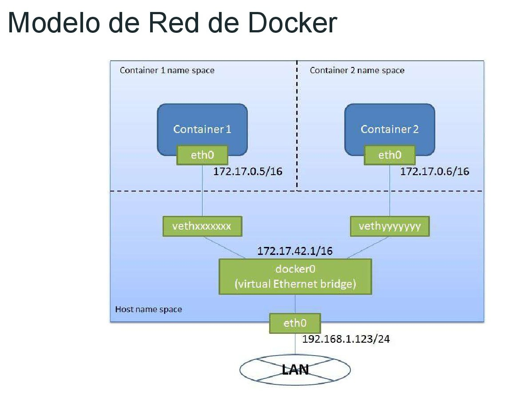

```docker
➜ ~ docker network ls
NETWORK ID NAME DRIVER SCOPE
a2d218baea37 bridge bridge local
6aab2b2bf95a host host local
0eba056c91f8 none null local
```

La red **"bridge"** es la red que ocupan todos los contenedores por defecto.
La red **"host"** es para compartir la misma **IP** del **HOST**
Esto se demuestra usando la bandera **"--net"** al momento de crear un contenedor

eje:

```docker
docker run -it --net=host debian bash
```

El resultado de visualizar las conexiones de red **DENTRO DEL CONTENEDOR** es el siguiente **(EN NEGRITAS)**:

```bash
2: eth0: <NO-CARRIER,BROADCAST,MULTICAST,UP> mtu 1500 qdisc mq state DOWN group default qlen 1000
  link/ether 00:26:9e:7c:c4:65 brd ff:ff:ff:ff:ff:ff
3: wlan0: <BROADCAST,MULTICAST,UP,LOWER_UP> mtu 1500 qdisc mq state UP group default qlen 1000
  link/ether 00:26:c6:1a:c5:56 brd ff:ff:ff:ff:ff:ff
  inet 192.168.79.70/25 brd 192.168.79.127 scope global dynamic wlan0
  valid_lft 49659sec preferred_lft 49659sec
  inet6 fe80::226:c6ff:fe1a:c556/64 scope link
  valid_lft forever preferred_lft forever
4: docker0: <NO-CARRIER,BROADCAST,MULTICAST,UP> mtu 1500 qdisc noqueue state DOWN group default
  link/ether 02:42:75:2f:d9:51 brd ff:ff:ff:ff:ff:ff
  inet 172.17.0.1/16 scope global docker0
  valid_lft forever preferred_lft forever
  inet6 fe80::42:75ff:fe2f:d951/64 scope link
  valid_lft forever preferred_lft forever
```

Se crea una una interfas **"wlan0"** ó **"eth0"** _IGUAL_ que el _hosts_

### Creando nuestra red

- Utilizar el comando "docker network create"
- Hay **2 tipos de redes que pueden crearse**
  - **Bridge**(_SE CREAN DE MANERA PREDETERMINADA_)
  - **Overlay**(_SE OCUPA PARA CREAR REDES ENTRE CONTENEDORES DOCKER DE EQUIPOS FÍSICOS DISTINTOS_)
- **Una red bridge** es igual a la red **"docker0"** (_la red utilizada por defecto en docker_)
- **Una red Overlay** permite desplegar contenedores en _diferentes hosts físicos_ y que los mismos se comuniquen de manera directa.
- Los contenedores se pueden conectar a más de una red mediante el comando **"docker network connect"**

ejem:

```docker
[ docker network create <NOMBRE_DE_LA_RED> ]
$ docker network create mi_red
```

Para comprobarlo se ejecuta:

```bash
$ docker network ls
NETWORK ID NAME DRIVER SCOPE
a2d218baea37 bridge bridge local
6aab2b2bf95a host host local
39d31b644330 mi_red bridge local
0eba056c91f8 none null local
```

Para ocupar la bandera `--link` y acceder a los contenedores por nombre.

1. Crear un contenedor con nombre:

```docker
[ docker run -it --name [NOMBRE_DEL_CONTENEDOR] debian bash ]
$ docker run -it --name mi_red debian bash
```

2. Para **conectarse** al **contenedor** _desde otro contenedor_ **PERO A LA MISMA RED**

```docker
docker run -it --link [NOMBRE_DEL_CONTENEDOR] debian bash
```

3. Para poder comprobarlo se tiene que hacer un ping **PERO AL NOMBRE [NOMBRE_DEL_CONTENEDOR]**, y tienen que contestar.

**NOTA**: La bandera `--link` modifica el archivo `# cat /etc/hosts` para que se conecte a la interfas de red adecuada.

Para ocupar la bandera `--link` y también la bandera `--net` para _conectar contenedores a la misma red_:

Se crea el contenedor **No1**

```docker
docker run -it --name [NOMBRE_DE_CONTENEDOR] --net=mi_red debian bash
```

Se crea contenedor **No2**

```docker
docker run -it --link [NOMBRE_DE_CONTENEDOR] --net=mi_red debian bash
```

De esta manera los dos contenedores estarán en la misma red. **PERO AHORA SE CONECTAN POR MEDIO DE "DNS INTERNO" QUE ESTA EN EL ARCHIVO**
`# cat /etc/resolv.conf`

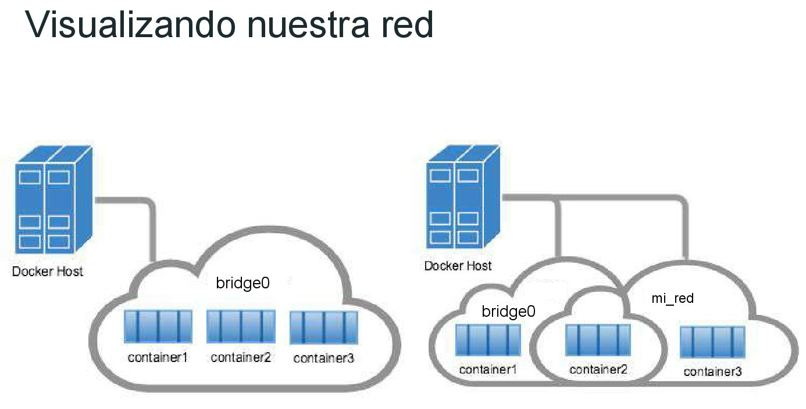

#### Para hacer un contenedor que vea dos redes distintas

1. Creación de contenedor _No1_ **[RED 1 DISTINTA](SE CONECTA LA LA RED "bridge" DE FORMA PREDETERMINADA)**

```docker
docker run -it --name container1 debian bash
```

2. Creación de contenedor _No3_ **(RED 3 DISTINTA)**

```docker
docker run -it --name container3 --net=mi_red debian bash
```

3. Creación de contenedor _No2_ **(VE RED DE CONTENEDOR No3)**

```docker
docker run -it --name container2 --net=mi_red debian bash
```

4. PARA CONECTAR EL `container2` **A LA RED DE** `container1`

```docker
docker network connect bridge container2
```

#### Exponiendo contenedores a una red externa

- Los contenedores en una red **bridge** sólo pueden ser accedidos por los otros contenedores en la misma red.
- Para hacer que un contenedor pueda ser accedido desde el exterior, _es necesario mapear sus puertos mediante el hosts_.
- El contenedor puede ser accedido mediante el puerto mapeado en el host.

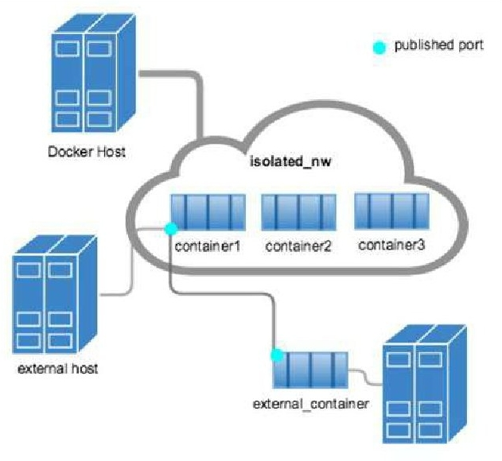

### Mapear puertos

1. Con la bandera `-P` "letra pe" _MAYUSCULA_ es para exponer un puerto de docker de manera **aleatoria**.
2. Con la bandera `-P` "letra pe" _MINUSCULA_ es para exponer un puerto de docker de manera **personalizada**.

```docker
[ docker run -d -p PUERTO_HOST:PUERTO_CONTENEDOR ]
$ docker run -d -p 80:5000
```

Cuando se accede al link, se accede en el puerto **80**, y en el puerto del contenedor se entra por el puerto **5000**

## Docker Machine

> "_Machine lets you create Docker hosts on your computer, on cloud providers, and inside your own data center.
> It creates servers, installs Docker on them, then configures the Docker client to talk to them_"

> "Docker machine es una herramienta para provisionar hosts de Docker y configurar el Engine en los mismos"

- Docker-Machine te permite crear hosts de Docker en la computadora, en proveedores de la nube y dentro de su propio centro de datos. Crea servidores, instala Docker en ellos, luego configura el cliente Docker para comunicarte con ellos.

**NOTA**: Para que funcione `docker-machine` en linux es necesario que este instalado `virtualvox`.

- Docker Machine Github - Para instalar.
  - :link: [Docker Machine Overview](https://docs.docker.com/machine/overview/)

1. Crea hosts de docker adicionales en el entorno local.
2. Crea hosts de docker en clouds providers (eje. Amazon AWS, Digital Ocean, etc...)
3. Machine crea el servidor, instala y configura Docker.

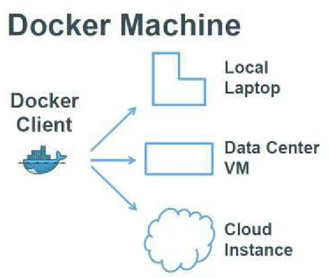


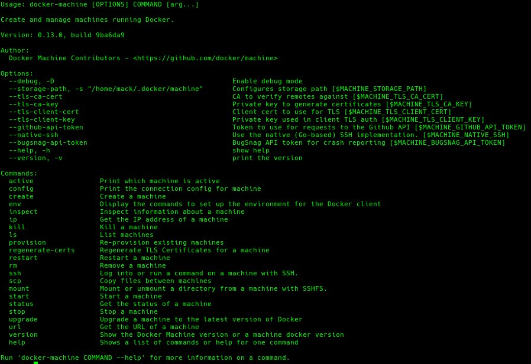

### Usando el comando `docker-machine` create y especificar el driver a usar

- El driver permite a docker-machine utilizar el entorno deseado
  - Sintaxis

```docker
docker-machine create --driver <driver> <hostname>
```

ejem:

```docker
docker-machine create -d virtualbox primera-maquina
```

Si la maquina tiene problemas para crear la maquina virtual por que se presenta el siguiente error:

`Error with pre-create check: "This computer doesn't have VT-X/AMD-v enabled. Enabling it in the BIOS is mandatory"`
se puede ejecutar:

```docker
docker-machine create --virtualbox-no-vtx-check -d virtualbox primera-maquina
```

Para acceder a la maquina virtual creada

```docker
docker-machine ssh <NOMBRE_DE_VM>
```

**Adentro de la maquina funciona como cualquier maquina de docker**

Para conectarse mi cliente de mi **host** al **docker-machine** se puede hacer saber cuales son las configuraciones para conectarse al `docker-machine"`

```docker
docker-machine config <NOMBRE_DE_VM>
```

Se le pasan los parámetros a docker de la siguiente manera y se ejecutan parámetros de docker(**CONECTAMOS DESDE EL DOCKER DE HOST A LA MV**)

```docker
docker $(docker-machine config <NOMBRE_DE_VM>) ps
docker $(docker-machine config <NOMBRE_DE_VM>) images
```

Para saber la manera de como debería de definir las variables de entorno para conectar con el demonio

```docker
docker-machine env <NOMBRE_DE_VM>
```

Para pasar las variables de entorno al host

```docker
eval $(docker-machine env <NOMBRE_DE_VM>)
```

Pasa quitar las variables de entorno

```docker
eval $(docker-machine env -u)
```

En la ruta

```docker
.docker/machine/machines/
```

- Es en donde se crean los parámetros de la VM

Para saber la IP de la VM

```docker
docker-machine ip <NOMBRE_DE_VM>
```

Y con la IP es posible conectarse por medio de SSH

```docker
ssh -i .docker/machine/machines/<NOMBRE_DE_VM>/id_rsa docker@192.168.99.103
```

### Docker Machine - AWS

- Para crear un host en AWS es necesario
  - AWS access key
  - AWS secret key
  - El VPC ID para la instancia donde correrá docker
- La imagen utilizada por defecto es Ubuntu 14.04 LTS

```docker
docker-machine create
--driver amazonec2 \
--amazonec2-access-key <AWS access key> \
--amazonec2-secret-key <AWS secret key> \
--amazonec2-vpc-id <VPC ID> \
testhost
```

- Otros providers
  - DigitalOcean, GCE, Azure, SoftLayer, Rackspace, VMware, Openstack

### Docker machine - extras

- Existen 2 métodos para conectarse a un host con `docker-machine`
  - Utilizar `docker-machine ssh`
  - Setear las variables de entorno para apuntar al host de docker
  - **Hack**: Usar la clave ssh manualmente (**_no recomendado_**)
- El comando `env` retorna las variables necesarias para que nuestro cliente de Docker se conecte al host creado
- Los hosts pueden ser detenidos o iniciados con el comando `dockermachine stop/start/restart`
- Utilizar `docker-machine inpsect <name>` para botener más información del host provisionado
- `docker-machine rm` elimina nuestro host creado.

## Docker y microservicios

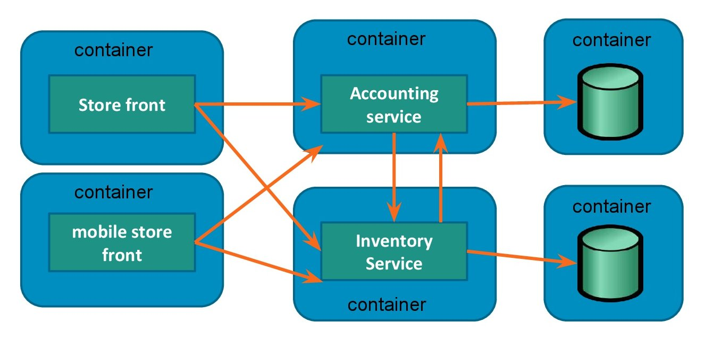

### Docker Compose

> “Compose es una herramienta para crear y administrar aplicaciones multi-contenedor"

- :link: :octicat: [Docker compose github](https://github.com/docker/compose)
- :link: [The Official YAML Web Site](https://yaml.org/)
- :link: [Aprende X en Y minutos](https://learnxinyminutes.com/docs/es-es/yaml-es/)

- En una arquitectura de microservicios existen demasiados servicios, por ende múltiples componentes para correr
- Resulta tedioso ejecutar "docker run" por cada componente y luego manualmente orquestar todo
- Docker Compose al rescate

- :link: [Docker compose github - Define and run multi-container applications with Docker](https://github.com/docker/compose)
- :link: [Instalar docker-compose](https://github.com/docker/compose/releases)
- :link: [Full documentation is available on](https://github.com/docker/compose/releases)
- :link: [Referencia y lineamientos del archivo "docker-compose.yml"](https://docs.docker.com/compose/compose-file/#compose-file-structure-and-examples)
- :link: [Como se compone un archivo ".yml"](https://docs.docker.com/compose/compose-file)


- `docker-compose.yml` define los servicios que componen la aplicación
- Cada servicio contiene las instrucciones para construir y ejecutar el contenedor

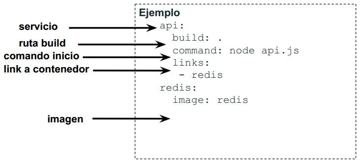

- Utilizar `docker-compose up` para iniciar nuestra aplicación
- El comando `up`:
  - Construye la imagen para cada servicio
  - Crea e inicializa los contenedores
- Compose automáticamente se da cuenta cuales contenedores iniciar primero
- Los contenedores pueden correr en background (bandera `-d`)
- Los nombres de los contenedores tendrán el formato
  - `<proyecto>_<servicio>_<numero>`
- Otras acciones: `logs/start/stop/restart/pull/rm`

- :link: [How To Remove Docker Containers, Images, Volumes, and Networks](https://linuxize.com/post/how-to-remove-docker-images-containers-volumes-and-networks/)
- :link: [The Docker Handbook](https://www.freecodecamp.org/news/the-docker-handbook/)

### Docker Compose - extras

- Muchos de los parámetros en el archivo `docker-compose.yml` tienen su equivalente como instrucción utilizando el **docker engine**
- Las opciones especificadas en el Dockerfile son respetadas por compose y no es necesario redefinirlas
  - Ejemplo
    - Exponemos el puerto **8080** en el Dockerfile utilizado por tomcat
    - Necesitamos correr tomcat mediante un servicio via Compose
    - No es necesario especifica el parámetro `ports` siendo que se encuentra definido en el Dockerfile
- `docker compose build` solamente generará las imágenes de aquellos Dockerfiles q hayan sido modificados
- Pueden utilizarse variables de entorno en compose mediante la sintaxis `$(MI_VARIABLE)`

### Docker's cheat sheet

- `docker run <image-name:tag>` busca la imagen en el host si no la pilla intenta descargarla
  - Con la opcion `--name` podemos renombrar un container pero el nuevo nombre tiene que ser unico
  - `-it` Ejecuta el container pero de forma interactiva con la terminal
  - `-p`: publish, habilitar la comunicacion entre puertos del host y contenedor `<puerto-host>:<puerto-contenedor>`
  - `-v` `<path en el host>:<path en el contenedor>`, asignamos un espacio compartido entre el host y el contenedor, ambas partes tiene acceso a esos archivos, es un mount tipo bind
  - `-d`, hace que se ejecute el contenedor en backgound y muestra el _id_ del contenedor
  - `-mount src=dbdata`, `dst=/data/db mongo` Para poder asociar el directorio de un contenedor a un volumen se utiliza el parámetro `--mount`
    luego `src` para indicar el volumen donde se guardará la información, y luego `dst` para indicar el destino o directorio del contenedor que se
    montará en el volumen indicado en `src`. Una vez ejecutado nuevamente _mongo_ con el nombre de db sobre el volumen `dbdata`, volver a
    ejecutar un bash dentro del contenedor y probar nuevamente la creación de datos en mongo.
  - `--env` pones variales de entorno
- `docker logs <docker-name|docker-id>`
  - Muestra los logs del contenedor incluso si esta apagado
- `docker rm <docker-name|docker-id>`
  - Borra el contenedor
- `docker rm $(docker ps -aq)`
  - Se obtendran todos los id de los contenedores y estos seran borrados
- `docker ps`
  - Muestra solo los contenedores que se estan ejecutando
  - `-a` Muestra todos los contenedores
  - `-aq` Solo mostrara los id de todos los contenedores
- `docker inspect <image-id|image-name>`
  - Muestra la metada sobre el estado del contenedor
- `docker inspect -f {{ json .Config.Env}} <image-id|image-name>`
  - Le decimos a docker que nos muestre la informacion en formato _json_ del campo _config.env_ que pertenece a la "metadata" del container
- `docker rename <docker-name> <docker-new-name>`
  - Comando para renombrar el container
- `docker run -d ubuntu tail -f /dev/null`
  - Dado que el comando por defecto que ejecutar el contenedor de ubuntu es `/bin/bash` este se apagara cuando no tenga nada que mostrar
  - `tail -f /dev/null` mostrara el contenido nuevo que nunca llegar a nuestro archivo, de esta manera el contenedor nunca se apagara
- `docker exec -it <id|name> <comando>`
  - Sirve para entrar a un contenedor activo 👇
  - Ejecuta de forma interactiva un comando en el contenedor, por ejemplo `docker exec -it ubuntu-name bash` "Ejecutamos bash dentro del container ubuntu-name"
- `docker volume`
  - `create` crea un volumen
  - `inspect` muestra infomacion detallada sobre el/los volume(s)
  - `ls` lista los volumenes
  - `prune` borra todo los volumenes que no esten siendo utilizados
  - `rm` borra 1 o mas volumenes
- `docker pull <image name>` descarga una imagen pero no la ejecuta
- `docker image ls` lista las imagenes disponibles en tu computadora
- `docker build -t <nombre de la imagen> .`
  - `build` Se construye una imagen a partir de un Dockerfile
  - `-t` nombre y opcionalmente un tag o etiqueta `<name>:<tag>`
  - `.` _(Path)_ es el contexto de build, un sector en el disco y el deamon de docker puede usar todo lo que esta en tiempo de build, no puede usar nada que este fuera de este path
- `docker tag <image-name> <dockerhub-user>/<image-name>`
  - Para poder subir nuestra imagen al repositorio de docker es necesario ponerle una etiqueta especificando nuestra cuenta de dicker hub
- `docker push <dockerhub-user>/<image-name>`
  - Subimos nuestra imagen al repositorio de docker
- `Docker network ls`
  - Lista todas las redes disponibles
- `Docker network create --atachable <nombre de red>`
  - Creamos una red para los contenedores
  - `--attachable` le decimos a docker que mas contenedores se pueden conectar
- `docker network connect <nombre red> <nombre contenedor>`
  - Conectamos el conector a una de las redes
- `Docker inspect <nombre de red>`
  - Obtenemos informacion de nuestra red
  - En el campo containers, podemos ver los contenedores conectados

#### Docker básicos

```bash
docker images
docker container
docker volume
docker network
# PARA CADA UNO
ls
rm
prune
-a
-q
```

#### Docker imagenes

Listar todos las imagenes

```docker
docker images -a
```

#### Docker contenedores

Listar todos los contenedores

```docker
docker container ls -a
```

Detener todos los contenedores

```docker
docker container stop $(docker container ls -aq)
```

Detener y eliminar todos contenedores

```docker
docker container rm $(docker container ls -aq)
```

Elininar todos los contenedore detenidos, imagenes colgadas y networks no utilizadas

```docker
docker system prune
```

Eliminar todos los volumenes no utilizados

```docker
docker system prune --volumes
```

#### Algunos comandos de `docker compose`

```docker
# COMPOSE_FILE
export COMPOSE_FILE=local.yml

docker compose build
docker compose up
docker compose ps
docker compose down
```

#### Docker compose imagenes

```docker
# Para construir las imagenes
docker compose -f local.yml build

# Para correr el stack
docker compose -f local.yml up

# Para ver el estado de los procesos de Docker
docker compose -f local.yml ps

# Para detener la ejecución
docker compose -f local.yml down
```

#### Comandos de administración

La bandera `--rm` lo que hace es que crea un contenedor solo para el fin indicado y cuando acabe de ejecutarse el comando **mata el contenedor**

```docker
# Para correr comandos de Django usamos
docker compose -f local.yml run --rm django COMMAND
#
# Por ejemplo para crear un super usuario
docker compose -f local.yml run --rm django python manage.py createsuperuser
```

### Habilitar debugger/Hacer modiciaciones/migraciones

Cuando sea necesario hacer modificaciones/presentan problemas con las migraciones y una opción es que se elimine el _volumen_ de la BD donde se almacena la data tiene la terminación `NOMBRE DEL PROYECTO_postgres_data`

1. Primero se tiene que detener la ejecucion de docker compose

```docker
docker compose -f local.yml down
```

```docker
# Mostrar los volunenes de docker
docker volume ls
# Eliminar el volumen NOMBRE DEL PROYECTO_postgres_data
docker volume rm NOMBRE DEL PROYECTO_postgres_data
```

2. Para correr el stack de contenedores

```docker
# -f, --file FILE             Specify an alternate compose file
docker compose -f local.yml up
```

3. Saber con que nombre esta el contenedor

```docker
# -f, --file FILE             Specify an alternate compose file
# ps List containers
docker compose -f local.yml ps
```

4. Matar el docker django

```docker
# -f, --force     Force the removal of a running container (uses SIGKILL)
# -l, --link      Remove the specified link
# -v, --volumes   Remove anonymous volumes associated with the container
docker rm -f <ID>
```

5. Despues de sacar/matar el docker de django para levantar lo de nuevo es:

```docker
# run,  Run a one-off command
# --rm,   Remove stopped containers
# --service-ports,   Run command with the service's ports enabled and mapped to the host.
docker compose -f local.yml run --rm --service-ports django
# Hacer migraciones
docker compose -f local.yml run --rm django python manage.py makemigrations
# Migrar a la BD
docker compose -f local.yml run --rm django python manage.py migrate
# EJEMPLO PARA CREAR SUPER-USUARIO
docker compose -f local.yml run --rm django python manage.py createsuperuser

# Entrar al shell de django +
docker compose run --rm django python manage.py shell_plus
```

Para crear una aplicación dentro de del proyecto, la carpeta se tiene que crear.

```docker
docker compose -f local.yml run --rm django python manage.py startapp <NOMBRE_APP> ./root/<NOMBRE_APP>
#
docker compose -f local.yml run --rm django django-admin startapp <NOMBRE_APP> ./root/<NOMBRE_APP>
```
