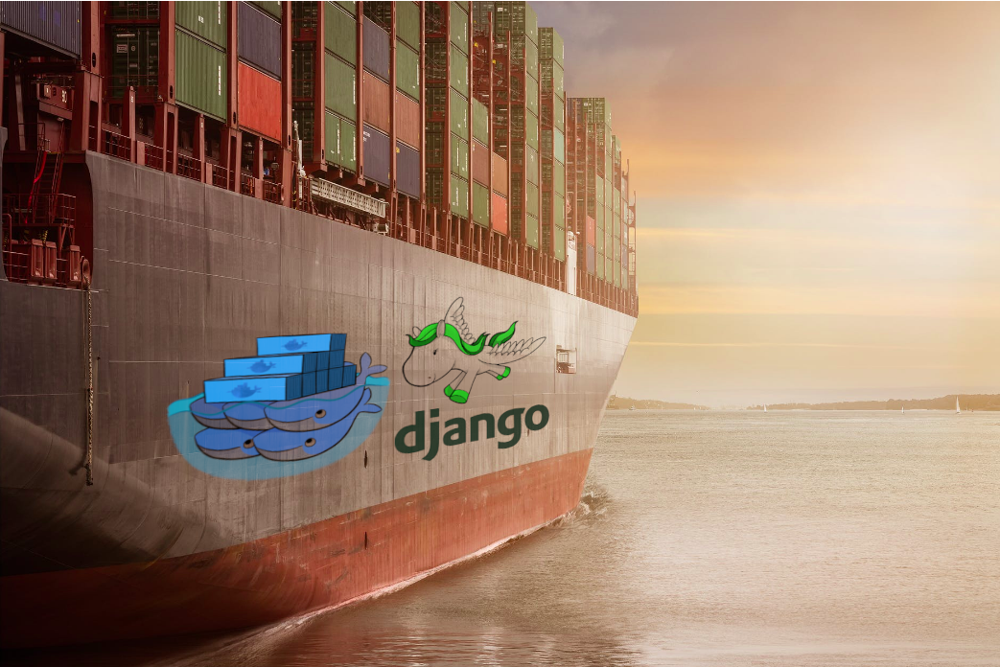

#### <a name="INDEX"> :whale2: + :snake: </a>



- :link: [Last estable release python](https://endoflife.date/python)
- :link: [discuss.python.org release](https://discuss.python.org/tag/release)

- [Django on Docker](#Django-on-Docker)
- [Django on Docker in progress](#Django-on-Docker-in-progress)
- [Cookiecutter Django list of commands](#Cookiecutter-Django-list-of-commands)
- [Docker + Django + Postgresql fast way](#docker--django--postgresql-fast-way)
- [Docker + Django + Postgresql](#docker--django--postgresql)

### Django on Docker

:construction: En la carpeta Docker se encuentra el ejemplo **dj_docker**

#### :whale: + :snake: Docker + Django

Descargar la imagen de PostgreSQL

```bash
docker pull postgres
```

Iniciar una instancia de PostgreSQL

```bash
docker run --name some-postgres -e POSTGRES_PASSWORD=mysecretpassword -d postgres
```

Ya que el contenedor/imagen se este ejecutando, en otra terminal(o en la misma), ejecutar el siguiente comando, para poder entrar al contenedor

```bash
docker exec -it postgres psql -U postgres
```

- :link: [Django on Docker - A Simple Introduction](https://www.codingforentrepreneurs.com/blog/django-on-docker-a-simple-introduction)
- :link: [Installing system packages in Docker with minimal bloat](https://pythonspeed.com/articles/system-packages-docker/)

Crear una carpeta `dj_docker`

Verificar la version de `pip`

```bash
python3 -m pip --version
```

Instalar pipenv

```bash
python3 -m pip install --user pipenv
```

Crear carpeta con el nombre del projecto

```bash
mkdir dj_docker
```

Crear el ambiente virtual

```bash
# --tree QUE OCUPE PYTHON 3
$ pipenv --three
```

Instalar django

```bash
pipenv install django
```

Instalar gunicorn

```bash
pipenv install gunicorn
```

Activar ambiente virtual

```bash
pipenv shell
```

Crear un proyecto en django

```bash
pipenv run django-admin startproject dj_docker .
```

BD local y migraciones

```bash
python manage.py makemigrations
python manage.py migrate
python manage.py createsuperuse
#
USER: dj_doker_2020
PWD: dj docker 2020
```

Actualizar dentro de `settings.py`

```bash
# importar os
import os
...
# DEBUG can be True/False or 1/0
DEBUG = int(os.environ.get('DEBUG', default=1))
```

Crear el archivo `.env` en carpeta raiz solo con la info de `DEBUG=1`

```bash
touch .env
# EDITAR EL ARCHIVO Y PONER SOLO LA INFO
DEBUG=1
```

Probar la configuración con

```bash
gunicorn dj_docker.wsgi:application --bind 0.0.0.0:8000
```

En local browser ir a la dirección `http://localhost:8000/`

Crear el archivo `Dockerfile` la imagen y el contenedor

Dentro de la carpeta del proyecto `dj_docker` crear el archivo `Dockerfile`

```bash
touch Dockerfile
```

Estructura de archivos y carpetas del proyecto

```bash
.
├── db.sqlite3
├── dj_docker
│   ├── asgi.py
│   ├── __init__.py
│   ├── settings.py
│   ├── urls.py
│   └── wsgi.py
├── Dockerfile
├── .env
├── install-packages.sh
├── manage.py
├── Pipfile
└── Pipfile.lock
```

El archivo `Dockerfile` ocupa la imagen

```bash
docker pull $ docker pull python:3.9-slim-buster
```

```bash
# BASE IMAGE
FROM python:3.9-slim-buster

# RUN ITS CONTENT THE FILE TO INSTALL
# UPDATES FROM THE DEBIAN REPOSITORIES
COPY install-packages.sh .
RUN chmod +x install-packages.sh
RUN ./install-packages.sh

# CREATE AND SET WORKING DIRECTORY
RUN mkdir /app
WORKDIR /app

# ADD CURRENT DIRECTORY CODE TO WORKING DIRECTORY
ADD . /app/

# SET DEFAULT ENVIRONMENT VARIABLES
ENV PYTHONUNBUFFERED 1
ENV PYTHONDONTWRITEBYTECODE 1
ENV DEBIAN_FRONTEND=noninteractive
# ENV LANG C.UTF-8

# SET PROJECT ENVIRONMENT VARIABLES
# GRAB THESE VIA PYTHON'S os.environ
# THESE ARE 100% OPTIONAL HERE
ENV PORT=8000

RUN apt-get update \
  # && apt-get install -y apt-utils \
  # DEPENDENCIES FOR BUILDING PYTHON PACKAGES
  && apt-get install -y build-essential \
  # PSYCOPG2 DEPENDENCIES
  && apt-get install -y libpq-dev \
  # TRANSLATIONS DEPENDENCIES
  && apt-get install -y gettext \
  # INSTALL GIT
  && apt-get install -y git \
  # CLEANING UP UNUSED FILES
  && apt-get purge -y --auto-remove -o APT::AutoRemove::RecommendsImportant=false \
  && rm -rf /var/lib/apt/lists/*

# INSTALL ENVIRONMENT DEPENDENCIES
RUN pip3 install --upgrade pip
RUN pip3 install pipenv

# INSTALL DEPENDENCIES FOR PROJECT FROM PIPFILE
RUN pipenv install --skip-lock --system --dev

EXPOSE 8888
CMD gunicorn dj_docker.wsgi:application --bind 0.0.0.0:$PORT
```

:eyes: En el mismo nivel se crea el archivo `install-packages.sh` el cual tiene por objetivo instalar las actualizaciones de debian por separado (_hay que hacer más pruebas para obtener menor peso de la imagen_)

```bash
#!/bin/bash

# Bash "strict mode", to help catch problems and bugs in the shell
# script. Every bash script you write should include this. See
# http://redsymbol.net/articles/unofficial-bash-strict-mode/ for
# details.
set -euo pipefail

# Tell apt-get we're never going to be able to give manual
# feedback:
export DEBIAN_FRONTEND=noninteractive

# Update the package listing, so we know what package exist:
apt-get update

# Install security updates:
apt-get -y upgrade

apt-get -y install --no-install-recommends apt-utils

# Install a new package, without unnecessary recommended packages:
apt-get -y install --no-install-recommends syslog-ng

# Delete cached files we don't need anymore:
apt-get clean
rm -rf /var/lib/apt/lists/*
```

Construir la imagen Docker

```bash
docker build -t simple-django-on-docker -f Dockerfile .
```

Ejecutar el contenedor

```bash
docker run -it -p 80:8888 simple-django-on-docker
```

En la dirección `http://localhost` para comprobar que se esta ejecutando

[[Volver al inicio]](#INDEX)

### :construction: :construction: Django on Docker in progress :construction: :construction

Crear una carpeta `core`

Instalar pipenv

```bash
python3 -m pip install --user pipenv
```

Crear carpeta con el nombre del projecto

```bash
mkdir core
```

Crear el ambiente virtual

```bash
# --tree QUE OCUPE PYTHON 3
$ pipenv --three
```

Instalar django & libreria para PosrgreSQL

```bash
$ pipenv install django
# psycopg2
$ pipenv install psycopg2
# django-environ
$ pipenv install django-environ
```

:rotating_light: Activar ambiente virtual

```bash
pipenv shell
```

Crear un proyecto en django

```bash
pipenv run django-admin startproject core .
```

:eyes: Tener previamente PostgreSQL :octocat: [PostgreSQL](https://github.com/macknilan/Cuaderno/blob/master/PostgreSQL/PostgreSQL.md)

Cambiar la configuración de conección en `settings.py` para que se conecte a la BD de _PostgreSQL(local)_ y hacer pruebas de conexión

```bash
DATABASES = {
 'default': {
     'ENGINE': 'django.db.backends.postgresql_psycopg2',
     'NAME': 'sandbox',
     'USER': 'user_sandbox',
     'PASSWORD': 'user_sandbox_2020',
     # 'HOST': 'db', # SET IN docker-compose.yml
     'HOST': 'localhost',
     'PORT': '5432',
 }
}
```

BD local y migraciones

```bash
python manage.py makemigrations
python manage.py migrate
python manage.py createsuperuse
#
USER: core_2020
PWD: dj pg docker 2020
```

Actualizar dentro de `settings.py`

```bash
# importar os
import os
...
# DEBUG can be True/False or 1/0
DEBUG = int(os.environ.get('DEBUG', default=1))
```

Crear el archivo `.env` en carpeta raiz solo con la info de `DEBUG=1`

```bash
touch .env
# EDITAR EL ARCHIVO Y PONER SOLO LA INFO
DEBUG=1
```

En la carpeta `core`

El archivo `Dockerfile` ocupa la imagen

```bash
docker pull $ docker pull python:3.9-slim-buster
```

```bash
# BASE IMAGE
FROM python:3.9-slim-buster

# RUN ITS CONTENT THE FILE TO INSTALL
# UPDATES FROM THE DEBIAN REPOSITORIES
COPY install-packages.sh .
RUN chmod +x install-packages.sh
RUN ./install-packages.sh

# CREATE AND SET WORKING DIRECTORY
RUN mkdir /app
WORKDIR /app

# ADD CURRENT DIRECTORY CODE TO WORKING DIRECTORY
ADD . /app/

# SET DEFAULT ENVIRONMENT VARIABLES
ENV PYTHONUNBUFFERED 1
ENV PYTHONDONTWRITEBYTECODE 1
ENV DEBIAN_FRONTEND=noninteractive
# ENV LANG C.UTF-8

# SET PROJECT ENVIRONMENT VARIABLES
# GRAB THESE VIA PYTHON'S os.environ
# THESE ARE 100% OPTIONAL HERE
# ENV PORT=8000

RUN apt-get update \
  # && apt-get install -y apt-utils \
  # DEPENDENCIES FOR BUILDING PYTHON PACKAGES
  && apt-get install -y build-essential \
  # PSYCOPG2 DEPENDENCIES
  && apt-get install -y libpq-dev \
  # TRANSLATIONS DEPENDENCIES
  && apt-get install -y gettext \
  # INSTALL GIT
  && apt-get install -y git \
  # CLEANING UP UNUSED FILES
  && apt-get purge -y --auto-remove -o APT::AutoRemove::RecommendsImportant=false \
  && rm -rf /var/lib/apt/lists/*

# INSTALL ENVIRONMENT DEPENDENCIES
RUN pip3 install --upgrade pip
RUN pip3 install pipenv

# INSTALL DEPENDENCIES FOR PROJECT FROM PIPFILE
RUN pipenv install --skip-lock --system --dev

EXPOSE 8000
```

:eyes: En el mismo nivel se crea el archivo `install-packages.sh` el cual tiene por objetivo instalar las actualizaciones de debian por separado (_hay que hacer más pruebas para obtener menor peso de la imagen_)

- :link: :whale2: [Compose file versions and upgrading](https://docs.docker.com/compose/compose-file/compose-versioning/)

:file_cabinet: `local.yml`

```bash
version: '3.9'

services:
  postgres:
    image: postgres
    env_file:
      - ./.envs/.local/.postgres
    container_name: postgres
    volumes:
      - local_postgres_data:/var/lib/postgresql/data
      # - local_postgres_data_backups:/backups
    ports:
      - "5432:5432"
  django:
    build: .
    env_file:
      - ./.envs/.local/.django
      - ./.envs/.local/.postgres
    container_name: django
    command: python /app/manage.py migrate
    command: python /app/manage.py runserver 0.0.0.0:8000
    volumes:
      - .:/app
    ports:
        - "8000:8000"
    depends_on:
        - postgres
volumes:
  local_postgres_data:
```

Estructura de archivos y carpetas del projecto

```bash
.
├── core
│   ├── asgi.py
│   ├── __init__.py
│   ├── settings.py
│   ├── urls.py
│   └── wsgi.py
├── Dockerfile
├── install-packages.sh
├── local.yml
├── manage.py
├── Pipfile
└── Pipfile.lock
```

Como la imagen esta previamente desarrollada con un proyecto

```bash
# COMPOSE_FILE
$ export COMPOSE_FILE=local.yml

$ docker-compose build
$ docker-compose up
$ docker-compose ps
$ docker-compose down
```

```bash
$ docker-compose -f local.yml up --build
#
$ docker-compose -f local.yml ps
```

## Cookiecutter Django list of commands

- :link: :octocat: [Cookiecutter Django](https://github.com/pydanny/cookiecutter-django)
- :link: [Cookiecutter Django Docs](https://cookiecutter-django.readthedocs.io/en/latest/index.html)

Verificar la version de `pip`

```bash
python3 -m pip --version
```

Actualizr pip

```bash
python3 -m pip install --user --upgrade pip
#
python3 -m pip install --upgrade pip
```

1. Crear ambiente local

```bash
python3 -m venv [NOMBRE-DEL-ENTORNO-VIRTUAL]
```

2. Dentro del ambiente local, y estar ubicados donde se desee que este la carpeta del proyecto

```bash
python3 -m pip install "cookiecutter>=2.1.1"
```

3. Instalar _cookiecutter-django_

```bash
$ cookiecutter https://github.com/pydanny/cookiecutter-django
# OR
$ cookiecutter gh:pydanny/cookiecutter-django
```

Configuración posible para cookiecutter

```bash
project_name [My Awesome Project]: root-backend
project_slug [root_backend]:
description [Behold My Awesome Project!]: Behold My Awesome Project!
author_name [Daniel Roy Greenfeld]: Rodolfo Ugalde
domain_name [example.com]: mack.com
email [rodolfo-ugalde@example.com]: my_mail@gmail.com
version [0.1.0]:
Select open_source_license:
1 - MIT
2 - BSD
3 - GPLv3
4 - Apache Software License 2.0
5 - Not open source
Choose from 1, 2, 3, 4, 5 [1]: 1
timezone [UTC]: America/Mexico_City
windows [n]: n
use_pycharm [n]: n
use_docker [n]: y
Select postgresql_version:
1 - 14
2 - 13
3 - 12
4 - 11
5 - 10
Choose from 1, 2, 3, 4, 5 [1]: 1
Select cloud_provider:
1 - AWS
2 - GCP
3 - None
Choose from 1, 2, 3 [1]: 1
Select mail_service:
1 - Mailgun
2 - Amazon SES
3 - Mailjet
4 - Mandrill
5 - Postmark
6 - Sendgrid
7 - SendinBlue
8 - SparkPost
9 - Other SMTP
Choose from 1, 2, 3, 4, 5, 6, 7, 8, 9 [1]: 1
use_async [n]: n
use_drf [n]: y
Select frontend_pipeline:
1 - None
2 - Django Compressor
3 - Gulp
Choose from 1, 2, 3 [1]: 2
use_celery [n]: y
use_mailhog [n]: y
use_sentry [n]: n
use_whitenoise [n]: n
use_heroku [n]: n
Select ci_tool:
1 - None
2 - Travis
3 - Gitlab
4 - Github
Choose from 1, 2, 3, 4 [1]: 1
keep_local_envs_in_vcs [y]: y
debug [n]: n
```

👀 También puede configurar la variable de entorno `COMPOSE_FILE` apuntando a `local.yml`

```bash
export COMPOSE_FILE=local.yml
```

4. Build the Stack

```bash
docker-compose -f local.yml build
```

5. Run the Stack

```bash
$ docker-compose -f local.yml up
#
$ docker-compose -f local.yml down
```

6. Comandos de administración
   Como con cualquier comando de shell que deseamos ejecutar en nuestro contenedor, esto se hace usando el

```bash
docker-compose -f local.yml run --rm
```

```bash
docker-compose -f local.yml run --rm django python manage.py makemigrations
docker-compose -f local.yml run --rm django python manage.py migrate
docker-compose -f local.yml run --rm django python manage.py createsuperuser
```


### Docker + Django + Postgresql fast way

1. `$ mkdir sandbox_dj_docker`
2. Crear el archivo `requirements.txt`

```txt
Django >= 3.2
psycopg2-binary >= 2.9
```

3. Crear el archivo Dockerfile

```
# GET THE IMAGE SLIM-BUSTER
FROM python:3.9-slim-buster
# FORCE STDIN, STDOUT AND STDERR TO BE TOTALLY UNBUFFERED. ON SYSTEMS WHERE IT MATTERS, ALSO PUT STDIN, STDOUT AND STDERR IN BINARY MODE.
ENV PYTHONUNBUFFERED=1
WORKDIR /code
COPY requirements.txt /code/
RUN pip3 install -r requirements.txt
COPY . /code/
#
```

4. Crear el archivo `docker-compose.yml`

```yml
version: "3.9"

services:
  db:
    image: postgres
    volumes:
      - ./data/db:/var/lib/postgres/data
    environment:
      - POSTGRES_DB=postgres
      - POSTGRES_USER=postgres
      - POSTGRES_PASSWORD=postgres
  web:
    build: .
    command: python3 manage.py runserver 0.0.0.0:8000
    volumes:
      - .:/code
    ports:
      - "8000:8000"
    depends_on:
      - db
```

5. ejecutar el siguiente comando para crear el proyecto en la carpeta que se creo

```bash
docker-compose run web django-admin startproject dj_docker .
```

🚨 Se instala como root

5. Modificar en el `settings.py`

```py
...
import psycopg2.extensions
...
ALLOWED_HOSTS = ['0.0.0.0']
...
DATABASES = {
    'default': {
        'ENGINE': 'django.db.backends.postgresql_psycopg2',
        'NAME': 'postgres',
        'USER': 'postgres',
        'PASSWORD': 'postgres',
        'HOST': 'db',  # SET IN docker-compose.yml
        'PORT': '5432',
    },
    'OPTIONS': {
        'isolation_level': psycopg2.extensions.ISOLATION_LEVEL_SERIALIZABLE,
    },
}
```

6. Ejecutar los comando para ejecutar docker

```bash
# REALISAR LAS MIGRACIONES
$  docker-compose run web python manage.py makemigrations
#
$  docker-compose run web python manage.py migrate
# PARA LEVANTAR/INICIAR DOCKER-COMPOSE
$ docker-compose up
# PARA DETENER DOCKER-COMPOSE
$ docker-compose down
```

### Docker + Django + Postgresql

:construction: :construction: (WIP) :construction: :construction:

1. `$ mkdir django-on-docker && cd django-on-docker`
2. `$ touch Dockerfile`

```dockerfile
# GET THE IMAGE SLIM-BUSTER
FROM python:3.10.6-slim-buster

# RUN ITS CONTENT THE FILE TO INSTALL
# UPDATES FROM THE DEBIAN REPOSITORIES
# COPY install-packages.sh .
# RUN chmod +x install-packages.sh
# RUN ./install-packages.sh

# INSTALL APT PACKAGES
RUN apt-get update && apt-get install --no-install-recommends -y \
    # dependencies for building Python packages
    build-essential \
    # psycopg2 dependencies
    libpq-dev \
    && rm -rf /var/lib/apt/lists/*

# CREATE AND SET WORKING DIRECTORY
# RUN mkdir /app
WORKDIR /app

# FORCE STDIN, STDOUT AND STDERR TO BE TOTALLY UNBUFFERED. ON SYSTEMS WHERE IT MATTERS, ALSO PUT STDIN, STDOUT AND STDERR IN BINARY MODE.
# SET DEFAULT ENVIRONMENT VARIABLES
ENV PYTHONUNBUFFERED 1
# PYTHON FROM COPYING PYC FILES TO THE CONTAINER
ENV PYTHONDONTWRITEBYTECODE 1

# COPY /requirements/requirements.txt /app
COPY /requirements /app

RUN python3 -m pip install --no-cache-dir --upgrade \
    pip \
    setuptools \
    wheel
# RUN python3 -m pip install --no-cache-dir -r requirements.txt
RUN python3 -m pip install --no-cache-dir -r local.txt

# INSTALL REQUIRED SYSTEM DEPENDENCIES
RUN apt-get update && apt-get install --no-install-recommends -y \
    # psycopg2 dependencies
    libpq-dev \
    # Translations dependencies
    gettext \
    # cleaning up unused files
    && apt-get purge -y --auto-remove -o APT::AutoRemove::RecommendsImportant=false \
    && rm -rf /var/lib/apt/lists/*

# ADD CURRENT DIRECTORY CODE TO WORKING DIRECTORY
COPY . /app
```

3. `$ touch local.yml`

```yml
version: "3.9"

volumes:
  local_postgres_data: {}
  local_postgres_data_backups: {}

services:
  django: &django
    build:
      context: .
      dockerfile: ./compose/local/django/Dockerfile
    image: root_local_django
    container_name: django
    depends_on:
        - postgres
    volumes:
      - .:/app
    env_file:
      - ./.envs/.local/.django
      - ./.envs/.local/.postgres
    ports:
        - "8000:8000"
    command: /start

  postgres:
    build:
      context: .
      dockerfile: ./compose/production/postgres/Dockerfile
    image: root_production_postgres
    container_name: postgres
    volumes:
      - local_postgres_data:/var/lib/postgresql/data
      - local_postgres_data_backups:/backups
    env_file:
      - ./.envs/.local/.postgres
    ports:
      - "5431:5432"
```

4. `$ touch install-packages.sh`

```bash
#!/bin/bash

# Bash "strict mode", to help catch problems and bugs in the shell
# script. Every bash script you write should include this. See
# http://redsymbol.net/articles/unofficial-bash-strict-mode/ for
# details.
set -euo pipefail

# Tell apt-get we're never going to be able to give manual
# feedback:
export DEBIAN_FRONTEND=noninteractive

# Update the package listing, so we know what package exist:
apt-get update

# Install security updates:
apt-get -y upgrade

# Install a new package, without unnecessary recommended packages:
apt-get -y install --no-install-recommends syslog-ng

# INSTALL APT PACKAGES
# build-essential -> DEPENDENCIES FOR BUILDING PYTHON PACKAGES
# libpq-dev -> psycopg2 DEPENDENCIES
apt-get update && apt-get install --no-install-recommends -y \
    build-essential \
    libpq-dev \
    && rm -rf /var/lib/apt/lists/*

# Delete cached files we don't need anymore (note that if you're
# using official Docker images for Debian or Ubuntu, this happens
# automatically, you don't need to do it yourself):
apt-get clean
# Delete index files we don't need anymore:
rm -rf /var/lib/apt/lists/*
```

5. Crear el proyecto, **sin** _que se esten ejecutando los contenedores._

```bash
# CREAR EL PROYECTO EN LA CARPETA
$ docker-compose -f local.yml run django django-admin startproject root .
#
# EN LUGAR DE HACER Build the Stack CON
# $ docker-compose -f local.yml build
```

6. Modificar en el `settings.py` para setear las las variables de entorno de _postgres_

```py
...
import psycopg2.extensions
import environ
# ENVIRON SETTINGS
env = environ.Env()

# SECURITY WARNING: don't run with debug turned on in production!
# DEBUG = True
DEBUG = env.bool("DJANGO_DEBUG", False)
...
ALLOWED_HOSTS = ['localhost', '0.0.0.0', '127.0.0.1']
...
DATABASES = {
    'default': {
        'ENGINE': 'django.db.backends.postgresql',
        'NAME': env.str('POSTGRES_DB'),
        'USER': env.str('POSTGRES_USER'),
        'PASSWORD': env.str('POSTGRES_PASSWORD'),
        'HOST': env.str('POSTGRES_HOST'),
        'PORT': env.str('POSTGRES_PORT')
    },
    'OPTIONS': {
        'isolation_level': psycopg2.extensions.ISOLATION_LEVEL_SERIALIZABLE,
    },
}
```

7. Hacer las migraciones para comprobar que estan bien las variables de entorno

La bandera `--rm` lo que hace es que crea un contenedor solo para el fin indicado y cuando acabe de ejecutarse el comando **mata el contenedor**

```bash
$ docker-compose -f local.yml run --rm django python manage.py makemigrations
#
$ docker-compose -f local.yml run --rm django python manage.py migrate
```

8. Se levantan los servicio para comprobar errores

```bash
docker-compose -f local.yml up
```

9. Se crea el super-usuario

```bash
docker-compose -f local.yml run --rm django python manage.py createsuperuser
```

10. Dar de baja los servicios y comprobar el estado de los servicios levandados

```bash
$ docker-compose -f local.yml down
# WATCH PROCESS UP
$ docker-compose -f local.yml ps
```

11. Comandos de imagenes y contenedores

Eliminar _todas_ las imagenes.

```bash
docker rmi $(docker images -aq)
```

Eliminar _todos_ los contenedores.

```bash
docker rm $(docker ps -a -q)
```

Eliminar volumenes

```bash
docker volume rm [NOMBRE_DEL_VOLUME]
```

Docker básicos

```bash
$ docker images
$ docker container
$ docker volume
$ docker network
# PARA CADA UNO
ls
rm
prune
-a
-q
```

12. :moon_cake: Conectarse al servicio de \_postgres\* cuando se esta ejecutando con **pgAdmin4**

- Identificar cual es el **contenedor** _de posrgres_

```bash
$ docker container ls -a
# OUTPUT
CONTAINER ID   IMAGE                     COMMAND                  CREATED             STATUS             PORTS                                       NAMES
c3705fe5e238   django-on-docker_django   "python3 manage.py r…"   26 minutes ago      Up 26 minutes      0.0.0.0:8000->8000/tcp, :::8000->8000/tcp   django
bfe4f282013d   postgres                  "docker-entrypoint.s…"   About an hour ago   Up About an hour   0.0.0.0:5432->5432/tcp, :::5432->5432/tcp   postgres
```

- _Inspeccionar_ el contenedor `bfe4f282013d` para saber la _IP_ en particular

```bash
docker inspect bfe4f282013d | grep IPAddress
```

- Ejecutar **pgAdmin4** y conectarse a esa _IP_ con las credenciales del archivo `.envs` > `.postgres`

#### Habilitar debugger

```bash
# 1 Para correr el stack de contenedores
# -f, --file FILE             Specify an alternate compose file
$ docker-compose -f local.yml up
```

```bash
# 2 Saber con que nombre esta el contenedor
# -f, --file FILE             Specify an alternate compose file
# ps List containers
$ docker-compose -f local.yml ps
```

```bash
# 3 MATAR EL DOCKER DJANGO
# -f, --force     Force the removal of a running container (uses SIGKILL)
# -l, --link      Remove the specified link
# -v, --volumes   Remove anonymous volumes associated with the container
$ docker rm -f <ID>
```

```bash
# 4 DESPUES DE SACAR/MATAR EL DOCKER DE django PARA LEVANTAR LO DE NUEVO ES
# run Run a one-off command
# rm Remove stopped containers
$ docker-compose -f local.yml run --rm --service-ports django
# Hacer migraciones
$ docker-compose -f local.yml run --rm django python manage.py makemigrations
# Migrar a la BD
$ docker-compose -f local.yml run --rm django python manage.py migrate
# EJEMPLO PARA CREAR SUPER-USUARIO
$ docker-compose -f local.yml run --rm django python manage.py createsuperuser
# Entrar al shell de django +
$ docker-compose run --rm django python manage.py shell_plus
# Cuando se presentan problemas con las migraciones y una opción es que se elimine el "volumen" de la BD donde se almacena la data tiene la terminación NOMBRE DEL PROYECTO_postgres_data
# Primero se tiene que detener la ejecucion de docker-compose
$ docker-compose -f local.yml down
# Mostrar los volunenes de docker
$ docker volume ls
# Eliminar el volimen NOMBRE DEL PROYECTO_postgres_data
$ docker volume rm NOMBRE DEL PROYECTO_postgres_data
```

Para crear una aplicación dentro de del proyecto, la carpeta se tiene que crear.

```bash
$ docker-compose -f local.yml run --rm django python manage.py startapp <NOMBRE_APP> ./root/<NOMBRE_APP>
#
$ docker-compose -f local.yml run --rm django django-admin startapp <NOMBRE_APP> ./root/<NOMBRE_APP>
```

[[Volver al inicio]](#INDEX)
