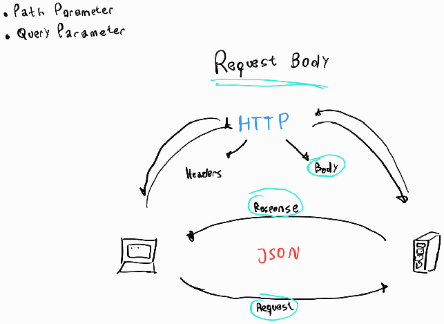
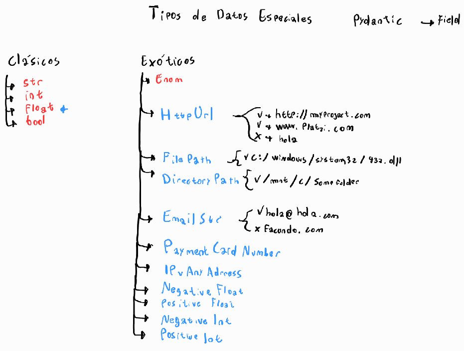

# FastAPI

```bash
⡀⡀⡀⡀⡀⡀⡀⡀⡀⡀⡀⡀⡀⡀⡀⡀⡀⡀⡀⡀⡀⡀⡀⡀⡀⡀⡀⡀⡀⡀⡀⡀⡀⡀⡀⡀⡀⡀⡀⡀⡀⡀⡀⡀⡀⡀⡀⡀⡀⡀⡀⡀⡀⡀⡀⡀⡀⡀⡀⡀⡀⡀⡀⡀⡀⡀⡀⡀⡀⡀⡀⡀⡀
⡀⡀⡀⢀⣴⣶⣿⣿⣿⣿⣶⣦⡀⡀⡀⡀⡀⡀⡀⢰⣶⣶⣶⣶⣶⣶⡆⡀⡀⡀⡀⡀⡀⡀⡀⡀⡀⡀⡀⡀⡀⡀⢠⣤⡄⡀⡀⡀⡀⡀⡀⡀⣰⣶⡄⡀⡀⡀⡀⡀⣴⣶⣶⣶⣶⣤⣀⡀⡀⡀⣶⡆⡀
⡀⡀⣰⣿⣿⣿⣿⡿⢹⣿⣿⣿⣿⣦⡀⡀⡀⡀⡀⢸⣿⡇⡀⡀⡀⡀⡀⢀⣀⣀⣀⣀⡀⡀⡀⡀⢀⣀⣀⣀⡀⡀⢸⣿⣇⣀⣀⡀⡀⡀⡀⢰⣿⠻⣿⡄⡀⡀⡀⡀⣿⣿⡀⡀⠈⠙⣿⣧⡀⡀⣿⡇⡀
⡀⢰⣿⣿⣿⣿⡿⡀⠸⠿⢿⣿⣿⣿⡆⡀⡀⡀⡀⢸⣿⣇⣀⣀⣀⣀⡀⠘⠛⠋⠛⢻⣷⡀⡀⣼⣿⠛⠉⠛⠃⡀⢸⣿⡟⠛⠛⠃⡀⡀⢠⣿⠏⡀⢻⣷⡀⡀⡀⡀⣿⣿⡀⡀⡀⢀⣿⡿⡀⡀⣿⡇⡀
⡀⢸⣿⣿⣿⣟⣁⣀⡀⢠⣾⣿⣿⣿⡇⡀⡀⡀⡀⢸⣿⡟⠛⠛⠛⠛⡀⢀⣤⣤⣤⣼⣿⡇⡀⠹⢿⣦⣤⣀⡀⡀⢸⣿⡇⡀⡀⡀⡀⢀⣿⡟⡀⡀⠈⢿⣷⡀⡀⡀⣿⣿⣶⣶⡾⠿⠟⠁⡀⡀⣿⡇⡀
⡀⠈⢿⣿⣿⣿⣿⣿⢀⣾⣿⣿⣿⡿⠁⡀⡀⡀⡀⢸⣿⡇⡀⡀⡀⡀⢰⣿⡏⠁⡀⢸⣿⡇⡀⡀⡀⠈⠙⢿⣷⡀⢸⣿⡇⡀⡀⡀⡀⣼⡿⠛⠛⠛⠛⠛⣿⣇⡀⡀⣿⣿⡀⡀⡀⡀⡀⡀⡀⡀⣿⡇⡀
⡀⡀⡀⠻⢿⣿⣿⣿⣿⣿⣿⣿⠟⠁⡀⡀⡀⡀⡀⢸⣿⡇⡀⡀⡀⡀⡀⠻⣷⣦⣤⣼⣿⡇⡀⣶⣶⣤⣴⣾⠟⡀⡀⠻⣷⣶⣶⡦⣸⣿⠃⡀⡀⡀⡀⡀⢹⣿⡆⡀⣿⣿⡀⡀⡀⡀⡀⡀⡀⡀⣿⡇⡀
⡀⡀⡀⡀⡀⠉⠙⠛⠛⠋⠉⡀⡀⡀⡀⡀⡀⡀⡀⡀⡀⡀⡀⡀⡀⡀⡀⡀⡀⡀⡀⡀⡀⡀⡀⡀⡀⡀⡀⡀⡀⡀⡀⡀⡀⡀⡀⡀⡀⡀⡀⡀⡀⡀⡀⡀⡀⡀⡀⡀⡀⡀⡀⡀⡀⡀⡀⡀⡀⡀⡀⡀⡀
```

🔗 [FastAPI](https://fastapi.tiangolo.com/) ↗️  
🔗 [uvicorn.org/](https://www.uvicorn.org/) ↗️  
🔗 [starlette.io](https://www.starlette.io/) ↗️  
🔗 [pydantic-docs.helpmanual.io](https://pydantic-docs.helpmanual.io/) ↗️  

:octocat: [curso-fastapi-fundamentos-path-validaciones](https://github.com/platzi/curso-fastapi-fundamentos-path-validaciones "curso-fastapi-fundamentos-path-validaciones") ↗️

FastAPI utiliza otros frameworks dentro de si para funcionar

- **Uvicorn**: es una librería de Python que funciona de servidor, es decir, permite que cualquier computadora se convierta en un servidor.  
- **Starlette**: es un framework de desarrollo web de bajo nivel, para desarrollar aplicaciones con este requieres un amplio conocimiento de Python, entonces FastAPI se encarga de añadirle funcionalidades por encima para que se pueda usar mas fácilmente.  
- **Pydantic**: Es un framework que permite trabajar con datos similar a pandas, pero este te permite usar modelos los cuales aprovechara FastAPI para crear la API  

Para empezar a ocupar FastAPI se puede hacer como se muestra en la documentación. [#optional-dependencies](https://fastapi.tiangolo.com/#optional-dependencies) ↗️

```py
pip install "fastapi[all]"
```

Para empezar y no instalar todas librerías se puede instalar lo básico.

```py
pip install fastapi uvicorn
```

🔗 [openapis.org](https://www.openapis.org/) ↗️  
🔗:octocat:  [redoc](https://github.com/Redocly/redoc) ↗️  
🔗 [swagger.io](https://swagger.io/) ↗️  

FastAPI un framework de desarrollo backend para Python.

FastAPI también está parado sobre los hombros de OpenAPI, el cual es un conjunto de reglas que permite definir cómo describir, crear y visualizar APIs.  Open apI ES una especificación de como definir una API

OpenAPI es una especificación para describir, crear, consumir y visualizar APIs REST.

Es un conjunto de reglas que permiten decir que una API está bien definida.

OpenAPI necesita de un software, el cual es Swagger, que es un conjunto de softwares que permiten trabajar con APIs.

FastAPI funciona sobre un programa de Swagger el cual es Swagger UI, que permite mostrar la API documentada en HTML.

Acceder a la documentación interactiva con Swagger UI:

```bash
{localhost}/docs
```

Acceder a la documentación interactiva con Redoc:

```bash
{localhost}/redoc
```

Se esta usando OAS3 - Open api specification version 3

**OPEN API**: es una especificación que define como describir, crear y visualizar API’s. Permite reconocer si una API está definida adecuadamente. Require de Swagger.

**Swagger**: software para trabajar API’s.

**ReDoc**: es una alternativa de Swagger instalada por default con FastAPI.

FastAPI funciona sobre SwaggerUI (User Interface) que permite mostrar gráficamente la API documentada. SwaggerUI obtiene especificaciones de OPEN API y la muestra por Fast API.

## Query Parameters & Path Parameters

**Path Parameter**  

🔗 [fastapi tutorial path-params](https://fastapi.tiangolo.com/tutorial/path-params/) ↗️

Los parámetros de ruta son partes variables de una ruta URL . Por lo general, se utilizan para señalar un recurso específico dentro de una colección, como un usuario identificado por ID.

Una URL puede tener varios parámetros de ruta.

```py
app.get("/items/{item_id}")  # <-- item_id
```

**Query Parameters:**  
Un _Query Patameter_ es un conjunto de elementos opcionales los cuales son añadidos al finalizar la ruta, con el objetivo de definir contenido o acciones en la url, estos elementos se añaden después de un `?` para agregar más query parameters utilizamos `&`

```bash
"/tweets/{tweet_id}/details?age=30&height=184"
```


## Request Body y Response Body



El protocolo HTTP existe una comunicación entre el usuario y el servidor. Esta comunicación está compuesta por cabeceras (_headers_) y un cuerpo (_body_). Por lo mismo, se tienen dos direcciones en la comunicación entre el cliente y el servidor y definen de la siguiente manera:

**Request** : Cuando el cliente solicita/pide datos al servidor.  
**Response** : Cuando el servidor responde al cliente.  
**Request Body**: Con lo anterior mencionado, Request Body viene a ser el cuerpo (body) de una solicitud del cliente al servidor.  

**Response Body**
Con lo anterior mencionado, Response Body viene a ser el cuerpo (body) de una respuesta del servidor al cliente.

¿Con cuál de las siguientes operations no deberías enviar jamás un request body?

No se debería de _enviar datos_ jamas un request body con _operations_ **GET**

## Models

🔗 [sql-databases](https://fastapi.tiangolo.com/tutorial/sql-databases/ "models") ↗️  
🔗 [response-models](https://fastapi.tiangolo.com/tutorial/response-model/ "response-models") ↗️  

Los modelos son la representación de una entidad en código, una entidad es un objeto de la vida real, que tiene ciertos atributos.  
Por ejemplo:
    - Carro: color
    - motor
    - año
    - marca

Persona
    + edad
    + nombres
    + apellidos
    + altura

Para poder crear modelos en el código se utiliza la librería `Pydantic`, importando la clase `BaseModel`:

🔗 [Body - Fields](https://fastapi.tiangolo.com/tutorial/body-fields/ "Body - Fields") ↗️  

The same way you can declare additional validation and metadata in path operation function parameters with `Query`, `Path` and `Body`, you can declare validation and metadata inside of Pydantic models using Pydantic's Field.

Declare body parameters as optional, by setting the default to `None`

## Validaciones: Query Parameters

Las validaciones tal como se definen, nos sirven para comprobar si son correctos los parámetros entregados en cada una de las peticiones. Estas validaciones funcionan restringiendo o indicando el formato de entrega en cada una de las peticiones.

_Query parameters_
Entonces, se definen las validaciones para las Query Parameters para definir un estándar de consulta y especificar cómo se deben entregar los datos.

```py
"""
Script de FastAPI de hello word

Run:
    uvicorn main:app --reload --port 8000 --host 127.0.0.1
    uvicorn main:app --reload
"""
# python


# Pydantic
from pydantic import BaseModel, Field

# fastpi
from fastapi import FastAPI, Query

app = FastAPI()

# models
class Person(BaseModel):
    first_name: str = Field(title="First name", min_length=8, max_length=20)
    last_name: str = Field(title="Last name", min_length=8, max_length=20)
    age: int = Field(default=0, title="The age", gt=1, le=100)
    hair_color: str | None = Field(
        default=None, title="Hair color", max_length=20
    )  # optional parameter
    is_married: bool | None = Field(
        default=None, title="Is Married"
    )  # optional parameter


@app.get("/")
def home():
    return {"Hello": "World"}


@app.post("/person/add")
def add_person(person: Person):
    return person


@app.get("/person/detail")
def detail_person(
    name: str
    | None = Query(
        default=None, min_length=8, max_length=50
    ),  # Query Parameters opcional
    age: int = Query(gt=1, le=100),  # Query Parameters obligatorio
):
    return {name: age}

```

## Validaciones: explorando más parameters

Para especificar las validaciones, debemos pasar le como parámetros a la función `Query` lo que necesitemos validar.

Para tipos de datos str:

- `max_length`: Para especificar el tamaño máximo de la cadena.
- `min_length`: Para especificar el tamaño mínimo de la cadena.
- `regex`: Para especificar expresiones regulares.

Para tipos de datos int:

- `ge`: (_greater or equal than ≥_) Para especificar que el valor debe ser mayor o igual.
- `le`: (_less or equal than ≤_) Para especificar que el valor debe ser menor o igual.
- `gt`: (_greater than >_) Para especificar que el valor debe ser mayor.
- `lt`: (_less than <_) Para especificar que el valor debe ser menor.

Es posible dotar de mayor contexto a nuestra documentación. Se deben usar los parámetros title y description.

- `title`: Para definir un título al parámetro.
- `description`: Para especificar una descripción al parámetro.

## Validaciones: Path Parameters

- 🔗 [#path-parameters](https://fastapi.tiangolo.com/tutorial/path-params/#path-parameters "#path-parameters") ↗️
- 🔗 [#order-matters](https://fastapi.tiangolo.com/tutorial/path-params/#order-matters "#order-matters") ↗️

[#path-parameters-and-numeric-validations](https://fastapi.tiangolo.com/tutorial/path-params-numeric-validations/#path-parameters-and-numeric-validations "#path-parameters-and-numeric-validations") ↗️  
☝️👇

> In the same way that you can declare more validations and metadata for query parameters with `Query`, you can declare the same type of validations and metadata for path parameters with `Path`.

```py
@app.get("/person/detail/{person_id}")
def detail_person(
    person_id: int = Path(
        gt=0,
        title="The ID of the item(person) to get title",
        description="This is the ID person. It's required.",
    )
):
    return {person_id: "It exist"}
```

## Validaciones: Request Body

- 🔗 [#body-multiple-parameters](https://fastapi.tiangolo.com/tutorial/body-multiple-params/#body-multiple-parameters "#body-multiple-parameters") ↗️
- 🔗 [#body-fields](https://fastapi.tiangolo.com/tutorial/body-fields/ "body-fields") ↗️
- 🔗 [#body-nested-models](https://fastapi.tiangolo.com/tutorial/body-nested-models/#body-nested-models "#body-nested-models") ↗️

> With FastAPI, you can define, validate, document, and use arbitrarily deeply nested models (thanks to Pydantic).

```py
# PRIMERA OPCIÓN
# @app.put("/person/detail/{person_id}")
# async def update_person(
#     person: Person,
#     location: Location,
#     person_id: int = Path(
#         gt=0,
#         title="The ID of the item(person) to get title",
#         description="This is the ID person. It's required.",
#     ),
# ):
#     results = person.dict()
#     results.update(location.dict())
#     return results


# SEGUNDA OPCIÓN
# @app.put("/person/detail/{person_id}")
# def update_person(
#     person_id: int,
#     person: Person,
#     location: Location,
# ):
#     results = {"person_id": person_id, "person": person, "location": location}
#     return results


# TERCERA OPCIÓN
@app.put("/person/detail/{person_id}")
def update_person(
    person: Person,
    location: Location,
    person_id: int = Path(
        gt=0,
        title="The ID of the item(person) to get title",
        description="This is the ID person. It's required.",
    ),
):
    results = {"person_id": person_id, "person": person, "location": location}
    return results
``

## Validaciones: Models

Diferencia Path, Query Parameters and Request Body  
Usamos `Path Parameters` cuando por ejemplo se trata de un `id` y esas cosas, como una variable etc, usamos los `Requests Body` para enviar información que tiene formato de un modelo y usamos los `Query Parameters` para solicitar información opcional del servidor.

**Validaciones Models**  
Para validar modelos tomamos uso de la clase de `Pydantic Field`, que funciona igual a las validaciones que ya hemos hecho con `Path`, `Query` y `Body`

```py
class HairColor(Enum):
    white = "white"
    brown = "brown"
    blonde = "blonde"


class Location(BaseModel):
    city: str = Field(
        title="The City", description="The City", min_length=3, max_length=20
    )
    state: str = Field(
        title="The State", description="The State", min_length=3, max_length=20
    )
    country: str = Field(
        title="The Country", description="The Country", min_length=3, max_length=20
    )


class Person(BaseModel):
    first_name: str = Field(
        title="First name", description="First name", min_length=8, max_length=20
    )
    last_name: str = Field(
        title="Last name", description="Last name", min_length=8, max_length=20
    )
    age: int = Field(default=0, title="The age", description="The age", gt=0, le=100)
    hair_color: HairColor | None = Field(
        default=None, title="Hair color", description="Hair color"
    )  # OPTIONAL PARAMETER Y HACE REFERENCIA A LA CLASE HairColor PARA SOLO TOMAR LAS OPCIONES
    is_married: bool | None = Field(
        default=None, title="Is Married", description="Is Married"
    )  # OPTIONAL PARAMETER 
```

## Tipos de datos especiales

- 🔗 [#special-types-and-validation](https://fastapi.tiangolo.com/tutorial/body-nested-models/?h=httpu#special-types-and-validation "#special-types-and-validation")  
- 🔗 [Pydantic's exotic types](https://pydantic-docs.helpmanual.io/usage/types/#pydantic-types "Pydantic's exotic types")  



## Creando ejemplos de Request Body automáticos

> You can declare examples of the data your app can receive. Here are several ways to do it.

🔗 [#field-additional-arguments](https://fastapi.tiangolo.com/tutorial/schema-extra-example/?h=schema_extra#field-additional-arguments "#field-additional-arguments") ↗️

When using `Field()` with Pydantic models, you can also declare extra info for the _JSON_ Schema by passing any other arbitrary arguments to the function.

You can use this to add `example` for each field.

- Pydantic permite validar que un string es un correo electrónico con `EmailStr`
- La clase Field se importa desde Pydantic
- **Una excepción** es el tipo de dato que NO puede ser retornado por una path operation function
- Los parámetros utilizados para validar un query parameter, son igualmente correctos para validar un path parameter
- Un request body es enviado por un cliente
- El comando curl Descargar el resultado de visitar un sitio web.
- Pydantic permite crear modelos de datos, y utilizarlos en una API.
- `...` Es ul valor alores especiales en Python establece que un query o path parameter es obligatorio
- `Bool` No es una clases válida que permita definir el tipo de parámetro de uno en particular en la definición de una path operation function
- FastAPI es Open Source y significa que que cualquier desarrollador en el mundo tiene acceso al código fuente y puede contribuir.
- Si es posible combinar dos request body en la respuesta http de una path operation
- Es opcional un query parameter en un endpoint en específico.
- Una _Path Operation_ function es una función atada a un path operation decorator, que, junto al mismo, hace parte de una path operation.
- `GET`es una `operations` no deberías enviar jamás un request body.
- Un Path Parameter en un endpoint en específico, el mismo es _obligatorio

## Status Code personalizados

Los status code o códigos de estado son respuestas http los cuales indican el el estado de finalización de una solicitud especifica:

- Respuestas informativas (100-199)
- Respuestas Satisfactorias (200-299)
- Redirecting (300-399)
- Errores de los clientes (400-499)
- Errores de los servidores (500-599)
- más información: [HTTP response status codes](https://developer.mozilla.org/en-US/docs/Web/HTTP/Status "developer.mozilla.org HTTP response status codes")

> HTTP response status codes. HTTP response status codes indicate whether a specific HTTP request has been successfully completed. Responses are grouped in five classes:

🔗 [HTTP response status codes](https://developer.mozilla.org/en-US/docs/Web/HTTP/Status "developer.mozilla.org HTTP response status codes")

Para FastAPI se tiene que importar el modulo `status`

```py
from fastapi import status
```

Archivos  

- 🔗 [Request Files](https://fastapi.tiangolo.com/tutorial/request-files/ "Request Files")
- 🔗 [Request Forms and Files](https://fastapi.tiangolo.com/tutorial/request-forms-and-files/ "Request Forms and Files")

- Tipos de entradas de datos en FastAPI:
  - Path Parameters -> URL y obligatorios
  - Query Parameters -> URL y opcionales
  - Request Body -> JSON
  - Formularios -> Campos en el frontend
  - Headers -> Cabeceras HTTP que pueden ser de cliente a servidor y viceversa
  - Cookies -> Almacenan información
  - Files -> Archivos como imágenes, audio, vídeo, etc.
  - Para manejar archivos con FastAPI necesitamos de las clases ‘File’ y ‘Upload File’.

- Upload file tiene 3 parámetros:
  - Filename -> Nombre del archivo
  - Content_Type -> Tipo de archivo
  - File -> El archivo en sí mismo

_Archivos_  
Entrada de datos que se refiere a los archivos FastAPI, por ejemplo una imagen o un video, se utilizan dos `clases File` y `UploadFile`

_UploadFile_  
Esta clase tiene una serie de parámetros, se refiere a la clase donde se guardará el archivo

- **filename**: se refiere al nombre del archivo, con esto tenemos el control sobre el nombre del archivo que suba el cliente a la aplicación.
- **content_type**: formato del archivo por ejemplo JPEG, MP4, GIF…
- **file**: se refiere al archivo en si mismo, los bytes del mismo

_File_  
Hereda de Form y funciona similar a las clases Query, Path y Body, se encarga de guardar los bytes del archivo.

**Deprecar una pieza de código sucede cuando:**

1. Se encuentra un mejor método mas eficiente para resolver un problema que nosotros ya tenemos. Lo que hacemos no es eliminar dicho método si no la dejamos sin efecto. Para aprovechar el código posteriormente si lo requerimos nuevamente.
2. Una funcionalidad diferente de nuestro código a la que ya tenemos definidos.
3. Cuando se esta realizando una re-factorización profunda del código, debido a que no tiene las mejores practicas, se define deprecar las path operation que se tienen por otras nuevas y se reemplazan. Nota: Siempre es mejor mantener el código que modificarlo desde cero.

:octocat: 🔗 [PyJWT](https://github.com/jpadilla/pyjwt)

**PyJWT** (_Python JSON Web Token_) es una biblioteca de Python que se utiliza para codificar y decodificar tokens _JWT_ (_JSON Web Token_). Un token _JWT_ es un objeto de seguridad que se utiliza para autenticar a los usuarios en aplicaciones web y móviles. Los tokens _JWT_ se emiten por un servidor de autenticación y luego se envían al cliente, que los utiliza para demostrar su identidad al acceder a recursos protegidos en el servidor

- **Flujo de autenticación**
  - _Ruta para iniciar sesión_
        - Lo que obtendremos como resultado al final de este módulo es la protección de determinadas rutas de nuestra aplicación para las cuales solo se podrá acceder mediante el inicio de sesión del usuario. Para esto crearemos una ruta que utilice el método POST donde se solicitarán los datos como email y contraseña.
    - _Creación y envío de token_
      - Luego de que el usuario ingrese sus datos de sesión correctos este obtendrá un token que le servirá para enviarlo al momento de hacer una petición a una ruta protegida.
    - _Validación de token_
      - Al momento de que nuestra API reciba la petición del usuario, comprobará que este le haya enviado el token y validará si es correcto y le pertenece. Finalmente se le dará acceso a la ruta que está solicitando.


```py
```

```py
```

```py
```

```py
```

```py
```
