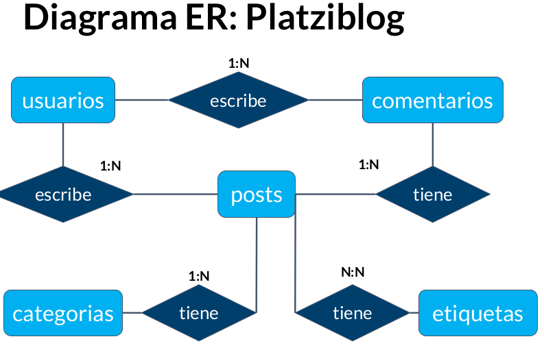
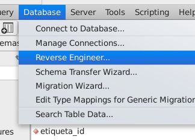

#### [Fundamentos de Bases de Datos CNo.2](#fundamentos_de_bases_de_datos_cno_2)

#### [Fundamentos de Bases de Datos CNo.1](#fundamentos_de_bases_de_datos_cno_1)

#### <a name="fundamentos_de_bases_de_datos_cno_2">Fundamentos de Bases de Datos CNo.2</a>

## 1. Bienvenida conceptos básicos y contexto histórico de las Bases de Datos
### 1. Expert Session: resuelve tus dudas sobre las bases de datos
### 2. Bienvenida conceptos básicos y contexto histórico de las Bases de Datos

:link: [Para generar datos random que llenar cualquier BD](https://www.generatedata.com/)

- **Tipos de bases de datos**:
    + **Relacionales**: En la industria hay varias compañías dedicadas a ser manejadoras de bases de datos relacionales como SQL Server, Oracle, MariaDB, entre otras.
    + **No relacionales**: Todavía están avanzando y existen ejemplos muy distintos como cassandra, elasticsearch, neo4j, MongoDB, entre otras.

- **Servicios**:
    + **Auto administrados**: Es la base de datos que instalas tú y te encargas de actualizaciones, mantenimiento, etc.
    + **Administrados**: Servicios que ofrecen las nubes modernas como Azure y no debes preocuparte por mantenimiento o actualizaciones.

## 2. Introducción a las bases de datos relacionales
### 3. Historia de las RDB

Las bases de datos surgen de la necesidad de conservar la información más allá de lo que existe en la memoria RAM.  

_Las bases de datos basadas en archivos_ eran datos guardados en texto plano, fáciles de guardar pero muy difíciles de consultar y por la necesidad de mejorar esto nacen las bases de datos relacionales. _Su inventor Edgar Codd_ dejó ciertas reglas para asegurarse de que toda la filosofía de las bases de datos no se perdiera, estandarizando el proceso.  

:link: [Codd's 12 rules](https://www.w3resource.com/sql/sql-basic/codd-12-rule-relation.php)

### 4. Entidades y atributos

Una *entidad* es algo similar a un objeto (programación orientada a objetos) y representa algo en el mundo real, incluso algo abstracto. Tienen atributos que son las cosas que los hacen ser una entidad y por convención se ponen en plural.  
Los *atributos compuestos* son aquellos que tienen atributos ellos mismos.  

- Los **atributos llave** son aquellos que identifican a la entidad y no pueden ser repetidos. Existen:
    + **Naturales**: Son inherentes al objeto como el número de serie
    + **Clave artificial**: No es inherente al objeto y se asigna de manera arbitraria.

- Las **entidades débiles**: No pueden existir sin una entidad fuerte y se representan con un cuadrado con doble línea.
    + **Identidades débiles por identidad**: No se diferencian entre sí más que por la clave de su identidad fuerte.
    + **Identidades débiles por existencia**: Se les asigna una clave propia.


### 5. Entidades de Platzi Blog

Entidates y atributos del proyecto

+ usuarios
    + login
    + password
    + nickname
    * email
    * idUsuario
+ comentarios
    + contenido
    * fecha_publicacion
    + idComentario
    + idUsuario(clave foranea)
+ posts
    + Titulo
    + fechas_publicacion
    + contenido
    + estatus
    + etiquetas (atributo multivaluado)
    + idPost
+ categorias
    + Nombre categoria
    + idCategoria

### 6. Relaciones

*Las relaciones* nos permiten ligar o unir nuestras diferentes entidades y se representan con rombos. Por convención se definen a través de verbos.

Las relaciones tienen una propiedad llamada *cardinalidad* y tiene que ver con números. Cuántos de un lado pertenecen a cuántos del otro lado:

+ Cardinalidad: 1 a 1 Cuando las dos entidades tinen un valor
+ Cardinalidad: 0 a 1 Cuando la entidad no esta pero la otra entidad existe
+ Cardinalidad: 1 a N Cuando un valor tiene la entidad de multiples valores
+ Cardinalidad: 0 a N Cuando la entidad no existe pero hay lugares donde puede estar

### 7. Múltiples muchos

:open_file_folder: [Paginas del documento 33 - 38](https://github.com/macknilan/Cuaderno/blob/master/Fundamentos_de_BD/docs/fundamentos-de-bases-de-datos_2019.pdf)


### 8. Diagrama ER

Un diagrama(_MER_) es como un mapa y nos ayuda a entender cuáles son las entidades con las que vamos a trabajar, cuáles son sus relaciones y qué papel van a jugar en las aplicaciones de la base de datos.



### 9. Diagrama Físico: tipos de datos y constraints

- Para llevar a la práctica un diagrama debemos ir más allá y darle detalle con parámetros como(Tipos de dato):
    * **Texto**: CHAR(n), VARCHAR(n)[250 caracteres], TEXT
    * **Números**: INTEGER, BIGINT, SMALLINT, DECIMAL(n,s), NUMERIC(n,s)
    * **Fecha/hora**: DATE, TIME, DATETIME, TIMESTAMP
    * **Lógicos**: BOOLEAN

- Constraints (Restricciones)
    * **NOT NULL**: Se asegura que la columna no tenga valores nulos
    * **UNIQUE**: Se asegura que cada valor en la columna no se repita
    * **PRIMARY KEY**: Es una combinación de NOT NULL y UNIQUE
    * **FOREIGN KEY**: Identifica de manera única una tupla en otra tabla
    * **CHECK**: Se asegura que el valor en la columna cumpla una condición dada
    * **DEFAULT**: Coloca un valor por defecto cuando no hay un valor especificado
    * **INDEX**: Se crea por columna para permitir búsquedas más rápidas


### 10. Diagrama Físico: normalización

La normalización como su nombre lo indica nos ayuda a dejar todo de una forma normal.

Esto obedece a las *12 reglas de Codd* y nos permiten separar componentes en la base de datos:

+ Primera forma normal **(1FN):** Atributos atómicos (Sin campos repetidos)
+ Segunda forma normal **(2FN):** Cumple 1FN y cada campo de la tabla debe depender de una clave única.
+ Tercera forma normal **(3FN):** Cumple 1FN y 2FN y los campos que NO son clave, NO deben tener dependencias.
+ Cuarta forma normal **(4FN):** Cumple 1FN, 2FN, 3FN y los campos multivaluados se identifican por una clave única.


### 11. Diagrama Físico: normalizando Platziblog


### 12. Formas normales en DB relacionales

## 3. RDBMS (MySQL) o cómo hacer lo anterior de manera práctica
### 13. RDB ¿Qué?

*RDBMS* significa *Relational Database Management System* o sistema manejador de bases de datos relacionales.

- Es un programa que se encarga de seguir las reglas de **Codd** y se puede utilizar de manera programática.
    + Oracle
    + PostgreSQL
    + MySql


### 14. Instalación local de un RDBMS (Windows)
### 15. Instalación local de un RDBMS (Mac)
### 16. Instalación local de un RDBMS (Ubuntu/Linux)

+ :octocat: [Notas del cuaderno de MySql](https://github.com/macknilan/Cuaderno/blob/master/Mysql/MySQL.md)
+ :link: [MySQL Community Downloads - MySQL Workbench ](https://dev.mysql.com/downloads/workbench/)
+ :link: [ MySQL Community Downloads - MySQL Community Server ](https://dev.mysql.com/downloads/mysql/)

Hay dos maneras de acceder a manejadores de bases de datos:

1. Instalar en máquina local un administrador de bases relacional.
2. Tener ambientes de desarrollo especiales o servicios cloud.

En este curso usaremos **MySQL** porque tiene un impacto histórico siendo muy utilizado y además es software libre y gratuito. **La versión 5.6.43** _es compatible con la mayoría de aplicaciones y frameworks._

**root** es el usuario principal que tendrá todos los permisos y por lo tanto en ambientes de producción hay que tener mucho cuidado al configurarlo.

### 17. Clientes gráficos
### 18. Servicios administrados

1. Google Clouds
2. Amazon AWS
3. [000webhost](https://www.000webhost.com/)

:link: [Google Cloud Platform](https://console.cloud.google.com/getting-started?pli=1)

Hoy en día muchas empresas ya no tienen instalados en sus servidores los **RDBMS** sino que los contratan a otras personas. Estos servicios administrados cloud te permiten concentrarte en la base de datos y no en su administración y actualización.
BD en la nube como pueden ser AWS, Google Cloud Platform, DigitalOcena

## 4. SQL hasta en la sopa
### 19. Historia de SQL

`SQL` significa **S**tructured **Q**uery **L**anguage y tiene una estructura clara y fija. Su objetivo es hacer un solo lenguaje para consultar cualquier manejador de bases de datos volviéndose un gran estándar.

Ahora existe el `NOSQL` o **N**ot **O**nly **S**tructured **Q**uery **L**anguage que significa que no sólo se utiliza SQL en las bases de datos _no relacionales_.

### 20. DDL create

**SQL** tiene dos grandes sublenguajes:   
**DDL o Data Definition Language** que nos ayuda a crear la estructura de una base de datos. Existen 3 grandes comandos:

- **Create**: Nos ayuda a crear bases de datos, tablas, vistas, índices, etc.
- **Alter**: Ayuda a alterar o modificar entidades.
- **Drop**: Nos ayuda a borrar. Hay que tener cuidado al utilizarlo.

3 objetos que manipularemos con el lenguaje _DDL_:
    - Database o bases de datos
    - Table o tablas. Son la traducción a SQL de las entidades
    - View o vistas: Se ofrece la proyección de los datos de la base de datos de forma entendible. 


**DDL** (_Data Definition Language_):

- Permite crear y modificar la estructura de una base de datos.
    * **CREATE**: Utilizado para crear nuevas tablas, campos e índices.
    * **ALTER**: Utilizado para modificar las tablas agregando campos o cambiando la definición de los campos.
    * **DROP**: Empleado para eliminar tablas e índices.
    * **TRUNCATE**: Empleado para eliminar todos los registros de una tabla.
    * **COMMENT**: Utilizado para agregar comentarios al diccionario de datos.
    * **RENAME**: Tal como su nombre lo indica es utilizado para renombrar objetos.


Crea una BD
```sql
mysql> CREATE DATABASE nombredelabasededatos;
```
Se traduce a..
```sql
CREATE SCHEMA `platziblog` DEFAULT CHARACTER SET utf8 ;
```

Para usar una BD
```
mysql> USE DATABASE nombredelabasededatos;
```

Crear la tabla en D.B. platziblog; se peude hacer por linea de comandos y en workbench de manera visual.
```sql
CREATE TABLE `platziblog`.`people` (
  `person_id` INT NOT NULL AUTO_INCREMENT,
  `last_name` VARCHAR(255) NULL,
  `first_name` VARCHAR(255) NULL,
  `address` VARCHAR(255) NULL,
  `city` VARCHAR(255) NULL,
  PRIMARY KEY (`person_id`));
```

### 21. CREATE VIEW y DDL ALTER

Las vistas lo que hacen es tomar datos de la DB, ponerlas de formas prsentable y convertirlas en algo que se pueda consultar de manera recurrente

Por convencion se adiciona `v_` al nomnre de la vista

Ejemplo de la vista.
```sql
CREATE VIEW v_brasil_customers AS
    SELECT customer_name;
contact_name
    FROM customers
    WHERE country = "Brasil";
```
Insertar datos en la tabla
```sql
INSERT INTO people (last_name, first_name, address, city)
VALUES ('Vázquez', 'Israel','Calle Famosa Num 1','México'),
('Hernández','Mónica','Reforma 222','México'),
('Alanis','Edgar','Central 1', 'Monterrey');
```
Para crear una vista seleccionar con boton derecho sobre y escribir la siguiente sentencia sql


```sql
CREATE VIEW `platzi_people` AS
SELECT * FROM platziblog.people
```
Para que se cree la vista
```sql
CREATE 
    ALGORITHM = UNDEFINED 
    DEFINER = `root`@`localhost` 
    SQL SECURITY DEFINER
VIEW `platzi_people` AS
    SELECT 
        `people`.`person_id` AS `person_id`,
        `people`.`last_name` AS `last_name`,
        `people`.`first_name` AS `first_name`,
        `people`.`address` AS `address`,
        `people`.`city` AS `city`
    FROM
        `people`
```


Cuando se altera una tabla añadiendo un campo nuevo con Mysql Workbench desde el menú con click derecho se muestra esta sentencoa SQL para aplicar
```sql
ALTER TABLE `platziblog`.`people` 
ADD COLUMN `date_of_birth` DATETIME NULL AFTER `city`;
```
Ejemplo SQL de alterar una campo
```sql
ALTER TABLE `platziblog`.`people` 
CHANGE COLUMN `date_of_birth` `date_of_birth` VARCHAR(30) NULL DEFAULT NULL ;
```

```sql
ALTER TABLE `platziblog`.`people` 
DROP COLUMN `date_of_birth`;
```

### 22. DDL drop

Está puede ser la sentencia ¡más peligrosa! (????), sobre todo cuando somos principiantes. Básicamente borra o desaparece de nuestra base de datos algún elemento.

```sql
DROP TABLE nombredelatabla;
```
```sql
DROP DATABASE nombredelabasedetados;
```

### 23. DML

**DML** (_Data Manipulation Language_):

- Permite recuperar, almacenar, modificar, eliminar, insertar y actualizar datos de una base de datos.
    * **SELECT**: Utilizado para consultar registros de la base de datos que satisfagan un criterio determinado.
    * **INSERT**: Utilizado para cargar de datos en la base de datos en una única operación.
    * **UPDATE**: Utilizado para modificar los valores de los campos y registros especificados
    * **DELETE**: Utilizado para eliminar registros de una tabla de una base de datos.
INSERT
```sql
INSERT INTO people (last_name,
first_name, address, city)
VALUES ('Hernández', 'Laura',
'Calle 21', 'Monterrey');
```
UPDATE
```sql
UPDATE people
SET last_name = 'Chávez', city= 'Mérida'
WHERE person_id = 1;
```
UPDATE(MySQL Workbench para la ejecución por que afecta a muchos registos)
```sql
UPDATE people
SET first_name = 'Juan'
WHERE city = 'Mérida';
```
DELETE una sola persona
```sql
DELETE FROM people
WHERE person_id = 1;
```
DELETE toda la tabla!!!
```sql
DELETE FROM people;
```

### 24. ¿Qué tan standard es SQL?

La utilidad más grande de SQL fue unificar la forma en la que pensamos y hacemos preguntas a un repositorio de datos. Ahora que nacen nuevas bases de datos igualmente siguen tomando elementos de SQL.

**DCL** (_Data Control Language_):

- Permite crear roles, permisos e integridad referencial, así como el control al acceso a la base de datos.
    * **GRANT**: Usado para otorgar privilegios de acceso de usuario a la base de datos.
    * **REVOKE**: Utilizado para retirar privilegios de acceso otorgados con el comando GRANT.

**TCL** (_Transactional Control Language_):

- Permite administrar diferentes transacciones que ocurren dentro de una base de datos.
    * **COMMIT**: Empleado para guardar el trabajo hecho.
    * **ROLLBACK**: Utilizado para deshacer la modificación que hice desde el último COMMIT.

¿Qué es la integridad referencial?
> La integridad referencial es un sistema compuesto por reglas que permiten la garantía de las relaciones entre las filas de la tabla relacionadas para que sean válidas y que estas relaciones no se eliminen ni se modifiquen por error.


### 25. Creando Platziblog: tablas independientes

Tabla categoria
```sql
CREATE TABLE `platziblog`.`categorias` (
  `id` INT NOT NULL AUTO_INCREMENT,
  `nombre_categoria` VARCHAR(30) NOT NULL,
  PRIMARY KEY (`id`));
```
Tabla etiquetas
```sql
CREATE TABLE `platziblog`.`etiquetas` (
  `id` INT NOT NULL AUTO_INCREMENT,
  `nombre_etiquetas` VARCHAR(30) NOT NULL,
  PRIMARY KEY (`id`));
```
Tabla usuarios
```sql
CREATE TABLE `platziblog`.`usuarios` (
  `id` INT NOT NULL AUTO_INCREMENT,
  `login` VARCHAR(30) NOT NULL,
  `password` VARCHAR(32) NOT NULL,
  `nickname` VARCHAR(40) NOT NULL,
  `email` VARCHAR(40) NOT NULL,
  PRIMARY KEY (`id`),
  UNIQUE INDEX `email_UNIQUE` (`email` ASC));
```

### 26. Creando Platziblog: tablas dependientes

El comando “cascade” sirve para que cada que se haga un update en la tabla principal, se refleje también en la tabla en la que estamos creando la relación.

Las _Foreing Key_ options son las siguientes:

+ *On update*: Significa qué pasará con las relaciones cuando una de estas sea modificada en sus campos relacionados, Por ejemplo, pueden utilizarse los valores:
    - `cascade`: Si el _id_ de un usuario pasa de 11 a 12, entonces la relacion se actualizará y el post buscará el _id_ nuevo en lugar de quedarse sin usuario.
    - `restrict`: Si el _id_ de un usuario pasa de 11 a 12, no lo permitirá hasta que no sean actualizados antes todos los post relacionados.
    - `set null`: Si el _id_ de un usuario pasa de 11 a 12, entonces los post solo no estará relacionados con nada.
    - `no action`: Si el _id_ de un usuario pasa de 11 a 12, no se hará nada. Solo se romperá la relación.

* **On delete**
    - `cascade`: Si un usuario es eliminado entonces se borrarán todos los post relacionados.
    - `restrict`: No se podrá eliminar un usuario hasta que sean eliminados todos su post relacionados.
    - `set null`: Si un usuario es eliminado, entonces los post solo no estará relacionados con nada.
    - `no action`: Si un usuario es eliminado, no se hará nada. Solo se romperá la relación.

Tabla posts, primero se crea hasta `PRIMARY KEY` despues se se crean las restricciones


```sql
ALTER TABLE `platziblog`.`posts` 
ADD INDEX `posts_usuarios_idx` (`usuario_id` ASC);
;
ALTER TABLE `platziblog`.`posts` 
ADD CONSTRAINT `posts_usuarios`
  FOREIGN KEY (`usuario_id`)
  REFERENCES `platziblog`.`usuarios` (`id`)
  ON DELETE NO ACTION
  ON UPDATE CASCADE;

```


```sql
CREATE TABLE `posts` (
  `id` int(11) NOT NULL AUTO_INCREMENT,
  `titulo` varchar(130) NOT NULL,
  `fecha_publicacion` timestamp NULL DEFAULT NULL,
  `contenido` text NOT NULL,
  `estatus` char(8) DEFAULT 'activo',
  `usuario_id` int(11) DEFAULT NULL,
  `categoria_id` int(11) DEFAULT NULL,
  PRIMARY KEY (`id`),
  KEY `posts_usuarios_idx` (`usuario_id`),
  KEY `posts_categorias_idx` (`categoria_id`),
  CONSTRAINT `posts_categorias` FOREIGN KEY (`categoria_id`) REFERENCES `categorias` (`id`) ON DELETE NO ACTION ON UPDATE NO ACTION,
  CONSTRAINT `posts_usuarios` FOREIGN KEY (`usuario_id`) REFERENCES `usuarios` (`id`) ON DELETE NO ACTION ON UPDATE CASCADE
) ENGINE=InnoDB AUTO_INCREMENT=65 DEFAULT CHARSET=utf8;
```

Tabla comentarios, la tabla ya se puede creear cuando estan echas las demas tablas con el siguiente escrio porque ya las relaciones y las restrisciones con las demás tablas estan completas
```sql
CREATE TABLE `comentarios` (
  `id` int(11) NOT NULL AUTO_INCREMENT,
  `cuerpo_comentario` text NOT NULL,
  `usuario_id` int(11) NOT NULL,
  `post_id` int(11) NOT NULL,
  PRIMARY KEY (`id`),
  KEY `comentarios_usuario_idx` (`usuario_id`),
  KEY `comentarios_post_idx` (`post_id`),
  CONSTRAINT `comentarios_post` FOREIGN KEY (`post_id`) REFERENCES `posts` (`id`) ON DELETE NO ACTION ON UPDATE NO ACTION,
  CONSTRAINT `comentarios_usuario` FOREIGN KEY (`usuario_id`) REFERENCES `usuarios` (`id`) ON DELETE NO ACTION ON UPDATE NO ACTION
) ENGINE=InnoDB DEFAULT CHARSET=utf8;
```


### 27. Creando Platziblog: tablas transitivas

Las **tablas transitivas/pivote** sirven como puente para unir dos tablas. No tienen contenido semántico.

**Reverse Engineer** nos reproduce el esquema del cual nos basamos para crear nuestras tablas. Es útil cuando llegas a un nuevo trabajo y quieres entender cuál fue la mentalidad que tuvieron al momento de crear las bases de datos.

Tabla `post_etiquetas` que funciona para que los post tengan etiquetas sobre varios temas, por eje.
```sql
CREATE TABLE `posts_etiquetas` (
  `id` int(11) NOT NULL AUTO_INCREMENT,
  `post_id` int(11) NOT NULL,
  `etiqueta_id` int(11) NOT NULL,
  PRIMARY KEY (`id`),
  KEY `postsetiquetas_post_idx` (`post_id`),
  KEY `postsetiquetas_etiquetas_idx` (`etiqueta_id`),
  CONSTRAINT `postsetiquetas_etiquetas` FOREIGN KEY (`etiqueta_id`) REFERENCES `etiquetas` (`id`) ON DELETE NO ACTION ON UPDATE NO ACTION,
  CONSTRAINT `postsetiquetas_post` FOREIGN KEY (`post_id`) REFERENCES `posts` (`id`) ON DELETE NO ACTION ON UPDATE NO ACTION
) ENGINE=InnoDB AUTO_INCREMENT=54 DEFAULT CHARSET=utf8;
```




Con la herramienta de **Reverse Engineer** de MySql WorkBench se puede hacer el diagrama MER de una BD entera.


## 5. Consultas a una base de datos
### 28. ¿Por qué las consultas son tan importantes?

Las consultas o queries a una base de datos son una parte fundamental ya que esto podría salvar un negocio o empresa.

- Alrededor de las consultas a las bases de datos se han creado varias especialidades como
    - ETL(Extraer/Extract - Transformar/Transform Cargar/Load) o transformación de datos
    - Business intelligence
    - Incluso Machine learning.


### 29. Estructura básica de un Query

Los queries son la forma en la que estructuramos las preguntas que se harán a la base de datos. Transforma preguntas en sintaxis.

El query tiene básicamente 2 partes: `SELECT` y `FROM` y puede aparecer una tercera como `WHERE`.

La estrellita o asterisco **(*)** quiere decir que vamos a seleccionar todo sin filtrar campos.


```sql
-- Ejemplos select
SELECT	*
FROM		posts;

SELECT	titulo, fecha_publicacion, estatus
FROM		posts;

SELECT	titulo AS encabezado, fecha_publicacion AS publicado, estatus AS estado
FROM		posts;

-- SELECT	posts.titulo, categorias.nombre_categoria;
SELECT	count(*)
FROM		posts;

SELECT	count(*) numero_posts
FROM		posts;

SELECT *
FROM posts
WHERE fecha_publicacion < '2024';

```

### 30. SELECT
`SELECT` se encarga de proyectar o mostrar datos.

El nombre de las columnas o campos que estamos consultando puede ser cambiado utilizando `AS` después del nombre del campo y poniendo el nuevo que queremos tener:

```sql
SELECT titulo AS encabezado
FROM posts;
```
Existe una función de `SELECT` para poder contar la cantidad de registros. Esa información (un número) será el resultado del query:
```sql
SELECT COUNT(*)
FROM posts;
```

### 31. FROM

**FROM** _indica de dónde se deben traer los datos_ y puede ayudar a hacer sentencias y filtros complejos cuando se quieren unir tablas. La sentencia compañera que nos ayuda con este proceso es `JOIN`.

Los diagramas de Venn son círculos que se tocan en algún punto para ver dónde está la intersección de conjuntos. Ayudan mucho para poder formular la sentencia `JOIN` de la manera adecuada dependiendo del query que se quiere hacer.


### 32. Utilizando la sentencia FROM


```sql
-- FROM
SELECT	*
FROM		posts;
--
SELECT	*
FROM	usuarios 
	LEFT JOIN posts on usuarios.id = posts.usuario_id;
-- 
SELECT	*
FROM	usuarios 
	LEFT JOIN posts on usuarios.id = posts.usuario_id
WHERE	posts.usuario_id IS NULL;

SELECT	*
FROM	usuarios 
	RIGHT JOIN posts on usuarios.id = posts.usuario_id;
-- 
SELECT	*
FROM	usuarios 
	RIGHT JOIN posts on usuarios.id = posts.usuario_id
WHERE	posts.usuario_id IS NULL;

SELECT	*
FROM	usuarios 
	INNER JOIN posts on usuarios.id = posts.usuario_id;
-- 
SELECT	*
FROM	usuarios 
	JOIN posts on usuarios.id = posts.usuario_id;
-- 
SELECT	*
FROM		usuarios 
	LEFT JOIN posts   ON usuarios.id = posts.usuario_id
UNION 
SELECT	*
FROM		usuarios 
	RIGHT JOIN posts ON usuarios.id = posts.usuario_id;
-- 
SELECT	*
FROM	usuarios 
	LEFT JOIN posts on usuarios.id = posts.usuario_id
WHERE	posts.usuario_id IS NULL
UNION
SELECT	*
FROM	usuarios 
	RIGHT JOIN posts on usuarios.id = posts.usuario_id
WHERE	posts.usuario_id IS NULL;
```


### 33. WHERE

**WHERE** es la sentencia que nos ayuda a _filtrar tuplas o registros_ dependiendo de las características que elegimos.

+ La propiedad `LIKE` nos ayuda a traer registros de los cuales conocemos sólo una parte de la información.
+ La propiedad `BETWEEN` nos sirve para arrojar registros que estén en el medio de dos. Por ejemplo los registros con id entre 20 y 30.

Los operadores `LIKE` y `BETWEEN` `AND`, pueden ser negados con `NOT`
```sql
NOT LIKE
NOT BETWEEEN – AND –
```


```sql
-- WHERE examples

SELECT	*
FROM		posts
WHERE	id	< 50;

SELECT	*
FROM		posts
WHERE	estatus = 'Inactivo';

SELECT	*
FROM		posts
WHERE	titulo LIKE '%escandalo%';

SELECT	*
FROM		posts
WHERE	fecha_publicacion > '2025-01-01';

SELECT	*
FROM		posts
WHERE	fecha_publicacion BETWEEN '2023-01-01' AND '2025-12-31';

SELECT	*
FROM		posts
WHERE	YEAR(fecha_publicacion) BETWEEN '2023' AND '2024';

SELECT	*
FROM		posts
WHERE	MONTH(fecha_publicacion) = '04';

```

### 34. Utilizando la sentencia WHERE nulo y no nulo

El valor _nulo_ en una tabla generalmente es su valor por defecto cuando nadie le asignó algo diferente. La sintaxis para hacer búsquedas de datos nulos es `IS NULL`.

La sintaxis para buscar datos que no son nulos es `IS NOT NULL`

```sql
SELECT	*
FROM		posts
WHERE	usuario_id IS NOT NULL;

SELECT	*
FROM		posts
WHERE	usuario_id IS NULL;

SELECT	*
FROM		posts
WHERE	usuario_id IS NULL;
AND status='activo'
AND id < 50
AND categoria_id = 2
AND YEAR(fecha_publicacion) = '2025'
;
```

### 35. GROUP BY

`GROUP BY` tiene que ver con agrupación. Indica a la base de datos qué criterios debe tener en cuenta para agrupar.

- Se pueden encontrar las siguientes funciones de agregado:
    + **AVG** Calcula el promedio
    + **COUNT** Cuenta los registros de un campo
    + **SUM** Suma los valores de un campo
    + **MAX** Devuelve el maximo de un campo
    + **MIN** Devuelve el mínimo de un campo

```sql
-- GROUP BY
SELECT	estatus, COUNT(*) AS post_number
FROM		posts
GROUP BY estatus;

SELECT	YEAR(fecha_publicacion) AS post_year, COUNT(*) AS post_number
FROM		posts
GROUP BY post_year;

SELECT	MONTHNAME(fecha_publicacion) AS post_month, COUNT(*) AS post_number
FROM		posts
GROUP BY post_month;

SELECT	estatus, MONTHNAME(fecha_publicacion) AS post_date, COUNT(*) AS post_number
FROM		posts
GROUP BY estatus, post_date;

```

### 36. ORDER BY y HAVING

La sentencia `ORDER BY` tiene que ver con el ordenamiento de los datos dependiendo de los criterios que quieras usar.

- **ASC** sirve para ordenar de forma ascendente.
- **DESC** sirve para ordenar de forma descendente.
- **LIMIT** se usa para limitar la cantidad de resultados que arroja el query.

`HAVING` tiene una similitud muy grande con `WHERE`, sin embargo el uso de ellos depende del orden. Cuando se quiere seleccionar tuplas agrupadas únicamente se puede hacer con `HAVING`.


```sql
-- ORDER BY
-- Ordenar los posts por el campo fecha_publicacion de forma ascendente.
Select * From posts 
ORDER BY fecha_publicacion Asc;
-- Ordenar los posts por el campo fecha_publicacion de forma descendente.
SELECT	*
FROM		posts
ORDER BY fecha_publicacion DESC;

SELECT	*
FROM		posts
ORDER BY titulo ASC;

SELECT	*
FROM		posts
ORDER BY titulo DESC;
-- Mostrar los primeros cinco posts que resulten de la consulta.
SELECT	*
FROM		posts
ORDER BY usuario_id ASC
LIMIT 5;

SELECT	MONTHNAME(fecha_publicacion) AS post_month, estatus, COUNT(*) AS post_quantity
FROM		posts
GROUP BY estatus, post_month
ORDER BY post_month;

-- HAVING
SELECT	MONTHNAME(fecha_publicacion) AS post_month, estatus, COUNT(*) AS post_quantity
FROM		posts
WHERE post_quantity > 1
GROUP BY estatus, post_month
ORDER BY post_month;

-- Agrupar por estatus y mes. Contar los posts y mostrar los que se han mayores a uno. Finalmente se debe ornear por mes.
SELECT	MONTHNAME(fecha_publicacion) AS post_month, estatus, COUNT(*) AS post_quantity
FROM		posts
GROUP BY estatus, post_month
HAVING post_quantity > 1
ORDER BY post_month;

-- Agrupar por Año y mes. Contar los posts y mostrar los que sean mayores a uno. Finalmente se debe ornear por Año.
SELECT YEAR(fecha_publicacion) AS Año, MONTHNAME(fecha_publicacion) AS Mes, status, Count(*) AS Cant
FROM posts GROUP BY Ano, Mes
Having Cant > 1
ORDER BY Año;
```

### 37. El interminable agujero de conejo (Nested queries)
Los **Nested queries** significan que dentro de un query podemos hacer otro query. 

Esto sirve para hacer _join de tablas_, estando una en memoria. También teniendo un query como condicional del otro.

Este proceso puede ser tan profundo como quieras, teniendo infinitos queries anidados.

_Se le conoce como un producto cartesiano ya que se multiplican todos los registros de una tabla con todos los del nuevo query_. Esto provoca que el query sea difícil de procesar por lo pesado que puede resultar.

```sql
-- SE LE DICE QUE ESTA TABLA new_table_projection.date SE QUIERE EL CAMPO .date
SELECT new_table_projection.date, COUNT(*) AS posts_count
FROM ( -- MAGIC
    SELECT DATE(MIN(fecha_publicacion)) AS date, YEAR(fecha_publicacion) AS post_year
    FROM posts
    GROUP BY post_year
) AS new_table_projection
GROUP BY new_table_projection.date 
ORDER BY new_table_projection.date;

SELECT *
FROM posts
WHERE fecha_publicacion = (
	SELECT MAX(fecha_publicacion)
	FROM posts
);

SELECT MAX(fecha_publicacion)
FROM posts;

```

### 38. ¿Cómo convertir una pregunta en un query SQL?

:open_file_folder: [Pag. 89 fundamentos-de-bases-de-datos_2019.pdf](https://github.com/macknilan/Cuaderno/blob/master/Fundamentos_de_BD/docs/fundamentos-de-bases-de-datos_2019.pdf)

- De pregunta a Query
    + `SELECT`: Lo que quieres mostrar
    + `FROM`: De dónde voy a tomar los datos
    + `WHERE`: Los filtros de los datos que quieres mostrar
    + `GROUP BY`: Los rubros por los que me interesa agrupar la información
    + `ORDER BY`: El orden en que quiero presentar mi información
    + `HAVING`: Los filtros que quiero que mis datos agrupados tengan

+ `WHERE` utiliza las propiedades:
    - `LIKE`, nos ayuda a filtrar los registros cuando solo conocemos una parte de la información.
    - `BETWEEN`, nos ayuda a filtrar registros que estén entre un rango.
+ `ORDER BY` utiliza los siguientes criterios:
    - `ASC`. Ordena de forma ascendente.
    - `DESC`. Ordena de forma descendente
    - `LIMIT`. Limita la cantidad de resultados para mostrar en el query, Ej: Mostrar los 5 primeros registros.

### 39. Preguntándole a la base de datos

`GROUP_CONCAT` toma el resultado del query y lo pone como campo separado por comas.

```sql
-- Lo que quieres mostrar = SELECT
-- De donde voy a tomar los datos = FROM
-- Los filtros de los datos que quieres mostrar = WHERE
-- Los rubros por los que me interesa agrupar mi información = GROUP BY
-- El orden en que quiero presentar mi información ORDER BY
-- Los filtros que quiero que mis datos agrupados tengan HAVING

-- ¿Cuántos tags tienen cada post?
SELECT  posts.titulo, COUNT(*) AS num_etiquetas
FROM    posts
    INNER JOIN posts_etiquetas ON posts.id = posts_etiquetas.post_id
    INNER JOIN etiquetas ON etiquetas.id = posts_etiquetas.etiqueta_id
GROUP BY posts.id;

-- ¿Cuál es el tag que mas se repite?
SELECT  etiquetas.nombre_etiqueta, COUNT(*) AS ocurrencias
FROM etiquetas
    INNER JOIN posts_etiquetas ON etiquetas.id = posts_etiquetas.etiqueta_id
GROUP BY etiquetas.id
ORDER BY ocurrencias DESC;

-- Los tags que tiene un post separados por comas
SELECT  posts.titulo, GROUP_CONCAT(nombre_etiqueta)
FROM    posts
    INNER JOIN posts_etiquetas ON posts.id = posts_etiquetas.post_id
    INNER JOIN etiquetas ON etiquetas.id = posts_etiquetas.etiqueta_id
GROUP BY posts.id;

-- ¿Que etiqueta no tiene ningun post asociado?
SELECT	*
FROM	etiquetas 
	LEFT JOIN posts_etiquetas on etiquetas.id = posts_etiquetas.etiqueta_id
WHERE	posts_etiquetas.etiqueta_id IS NULL;

```

### 40. Consultando PlatziBlog

Puedes usar una abreviación para evitar escribir lo mismo cada vez.
Ejemplo:

FROM categorias AS c


Función `CASE` permite agregar un campo virtual con información generada a partir de condiciones múltiples.

Mostrar el idioma, precio de todos los libros, así como agregar una columna de informe que indique si el libro es caro, módico o barato basado en el precio
```sql
SELECT  idioma, precio, 
CASE
	WHEN precio > 1000THEN"Muy caro"
	WHEN precio > 500THEN"Precio módico"
	ELSE"Muy barato"
ENDAS"informe"
FROM libros;
```

```sql
-- Las categorías ordenadas por numero de posts
SELECT c.nombre_categoria, COUNT(*) AS cant_posts
FROM    categorias AS c
    INNER JOIN posts AS p on c.id = p.categoria_id
GROUP BY c.id
ORDER BY cant_posts DESC;


-- ¿Cuál es la categoría que tiene mas posts?
-- c.nombre_categoria NOMBRE DE LA C ES UN HINT
SELECT c.nombre_categoria, COUNT(*) AS cant_posts
FROM    categorias AS c
    INNER JOIN posts AS p on c.id = p.categoria_id
GROUP BY c.id
ORDER BY cant_posts DESC
LIMIT 1;

-- ¿Que usuario ha contribuido con mas post?
SELECT u.nickname, COUNT(*) AS cant_posts
FROM    usuarios AS u
    INNER JOIN posts AS p on u.id = p.usuario_id
GROUP BY u.id
ORDER BY cant_posts DESC
LIMIT 1;

-- ¿De que categorías escribe cada usuario?
SELECT u.nickname, COUNT(*) AS cant_posts,  GROUP_CONCAT(nombre_categoria)
FROM    usuarios AS u
    INNER JOIN posts AS p ON u.id = p.usuario_id
    INNER JOIN categorias AS c ON c.id = p.categoria_id
GROUP BY u.id
ORDER BY cant_post DESC;

-- ¿Que usuario no tiene ningun post asociado?
SELECT	*
FROM	usuarios 
	LEFT JOIN posts on usuarios.id = posts.usuario_id
WHERE	posts.usuario_id IS NULL
```

## 6. Introducción a la bases de datos NO relacionales
### 41. ¿Qué son y cuáles son los tipos de bases de datos no relacionales?

Respecto a las bases de datos no relacionales, no existe un solo tipo aunque se engloben en una sola categoría.

- Tipos de bases de datos no relacionales:
    - **Clave - valor**: Son ideales para almacenar y extraer datos con una clave única. Manejan los diccionarios de manera excepcional. Ejemplos: DynamoDB, Cassandra.
    - **Basadas en documentos**: Son una implementación de clave valor que varía en la forma semiestructurada en que se trata la información. Ideal para almacenar datos JSON y XML. Ejemplos: MongoDB, Firestore.
    - **Basadas en grafos**: Basadas en teoría de grafos, sirven para entidades que se encuentran interconectadas por múltiples relaciones. Ideales para almacenar relaciones complejas. Ejemplos: neo4j, TITAN.
    - **En memoria**: Pueden ser de estructura variada, pero su ventaja radica en la velocidad, ya que al vivir en memoria la extracción de datos es casi inmediata. Ejemplos: Memcached, Redis.
    - **Optimizadas para búsquedas**: Pueden ser de diversas estructuras, su ventaja radica en que se pueden hacer queries y búsquedas complejas de manera sencilla. Ejemplos: BigQuery, Elasticsearch.


### 42. Servicios administrados y jerarquía de datos

:link: [Cloud Firestore](https://firebase.google.com/docs/firestore?hl=es-419)

**Firebase** es un _servicio de Google_ donde puedes tercerizar muchos elementos en la nube.
- Jerarquía de datos:
    1. Base de datos
    2. Colección
    3. Documento

:open_file_folder: [Pag. 99 fundamentos-de-bases-de-datos_2019.pdf](https://github.com/macknilan/Cuaderno/blob/master/Fundamentos_de_BD/docs/


## 7. Manejo de modelos de datos en bases de datos no relacionales
### 43. Top level collection con Firebase

El modelo de bases de datos no relacionales es un poco más cercano al mundo real en su comportamiento.

1. Las top level collections son las colecciones que se tienen de inmediato o entrada en el proyecto.
2. Firebase es un servicio que tiene múltiples opciones y está pensado principalmente para aplicaciones móviles y web.

:link: [Firebase](https://firebase.google.com/)

### 44. Creando y borrando documentos en Firestore

1. `string`: Cualquier tipo de valor alfanumérico
2. `number`: Soporta enteros y flotantes.
3. `boolenan`: Los clásicos valores True y False
4. `map`: Permite agregar un documento dentro de otro.
5. `array`: Permite agregar un conjunto de datos (soporte multi type) sin nombre e identificador.
6. `null`: Indica que no se ha definido un valor.
7. `timestamp`: Permite almacenar fechas (guarda el año, mes, día y hora).
8. `geopoint`: Guarda una localización geográfica (coordenadas latitud-longitud).
9. `reference`: Permite referencia un documento (relaciona dos documentos, no importa su colección).


```sql
```

### 45. Colecciones vs subcolecciones

**La particularidad de las top level collections es que existen en el primer nivel de manera intrínseca**. _Las subcolecciones_ ya no vivirán al inicio de la base de datos.

Si tienes una entidad separada que vas a referenciar desde muchos lugares es recomendado usar un _top level collection_. Por el otro lado si se necesita hacer algo intrínseco al documento es aconsejable usar subcolecciones.


### 46. Recreando Platziblog


### 47. Construyendo Platziblog en Firestore

Emplear colecciones de nivel cero para entidades fuertes, que mas adelante se empleen para realizar busquedas exhaustivas.

Emplear subcolecciones para entidades débiles, que solo permitan plasmar información relacionada, pero que dicha data no sea una fuente de consulta primaria para nuestra aplicación.

### 48. Proyecto final: transformando tu proyecto en una db no relacional
Dentro de las bases de datos relacionales tenemos diferentes niveles de datos. En primer lugar tenemos las Bases de Datos o Esquemas como repositorios donde vivirán los datos que nos interesa guardar. Dentro del esquema existen las Tablas que provienen del concepto de entidades; y a su vez dentro de las tablas tenemos las tuplas o renglones.

Cuando trabajamos con bases de datos basadas en documentos como Firestore, aún existe la figura de la base de datos, sin embargo cambiaremos las tablas en favor de las colecciones y las tuplas en lugar de los documentos.

Recuerda:

Tabla -> Colección

Tupla -> Documento

Dentro de las Colecciones existen 2 grandes tipos. Las Top level collection o colecciones de nivel superior y las subcollections o subcolecciones. Estas últimas viven únicamente dentro de un documento padre.

¿Cómo saber cuál escoger?

Para determinar si tu colección debe ser top level o subcolección no hay una regla escrita en piedra y más bien tiene que ver con el caso de uso en particular y con la experiencia que hayas ganado como desarrollador.

Lo cierto es que no hay una sola forma de estructurar nuestra DB basada en documentos, y por tanto no existe una respuesta correcta, sin embargo a continuación te ofrezco un par de reglas guía que puedes utilizar para transformar tu proyecto que ya trabajaste en bases de datos relacionales en un proyecto no relacional.

Regla 1. Piensa en la vista de tu aplicación

La primera pista que te puedo dar es que pienses en un inicio en la manera en que los datos serán extraídos. En el caso de una aplicación, la mejor forma de pensarlo es en términos de las vistas que vas a mostrar a un momento determinado en la aplicación.

Es decir, al armar la estructura en la base de datos que sea un espejo o que al menos contenga todos los datos necesarios para llenar las necesidades que tiene nuestra parte visual en la aplicación.

En el caso de Platziblog por ejemplo si tienes una vista de un blog post individual, generalmente conviene mostrar además de los datos inherentes al post como el contenido, datos adicionales como las etiquetas que tiene o por ejemplo el autor (o autores si es colaborativo), en este caso tal vez convenga guardar estas dos “entidades” (autores y etiquetas) como subcolecciones de cada documento blog post.

Regla 2. La colección tiene vida propia

Esta regla se refiere a que la excepción a la regla 1 es cuando tenemos un caso en que la “entidad” que tiene necesidad de vivir y modificarse constantemente de manera independiente a las otras colecciones. Por ejemplo en Platziblog podemos en el ejemplo anterior hacer una excepción a autores porque nos conviene tenerlas como top level collection en el sentido que se añadan, borren, cambien o listen los usuarios sin depender del blog post.

Experimenta aplicando estas dos reglas a un proyecto que ya conozcas en una base de datos relacional y trata de convertirla en un proyecto de Firestore y comentanos los retos a los que te enfrentaste.

## 8. Bases de datos en la vida real
### 49. Bases de datos en la vida real

Hoy en dia, se utilizan diversos tipos de bases de datos segun el problema que se quiera resolver:

Las bases de datos relacionales, durante mucho tiempo, fueron utilizadas para resolver todo tipo de situaciones, pero al aumentar enormemente el numero de datos a manejar, se volveron ineficientes en muchos casos.

Firestore o MongoDB nos permiten obtener los datos actuales de la aplicacion de manera simple. Sin embargo, no nos permite hacer, por ejemplo, queries muy complejos.
En una misma disciplina, es probable que haya que utilizar mas de un tipo de bases de datos.


### 50. Big Data

Big Data es un concepto que nace de la necesidad de manejar grandes cantidades de datos. La tendencia comenzó con compañías como YouTube al tener la necesidad de guardar y consultar mucha información de manera rápida.

Es un gran movimiento que consiste en el uso de diferentes tipos de bases de datos.

:link: [¿Qué es Machine Learning y cómo se usa en Big Data?](https://noticias.universia.es/ciencia-tecnologia/noticia/2017/09/12/1155659/machine-learning-como-usa-big-data.html)

### 51. Data warehouse

Data Warehouse trata de guardar cantidades masivas de datos para la posteridad. Allí se guarda todo lo que no está viviendo en la aplicación pero es necesario tenerlo.

Debe servir para guardar datos por un largo periodo de tiempo y estos datos se deben poder usar para poder encontrar cuestiones interesantes para el negocio.

### 52. Data mining

El Data Mining se dedica a minar datos, a extraerlos de donde sea que estén (archivos muertos, base de datos actual, etc…) y hacer sentido de ellos para darles un uso.

#### EJEMPLOS DE APLICACIONES DE LA MINERÍA DE DATOS

La capacidad predictiva del data mining ha cambiado el diseño de las estrategias empresariales. Ahora se puede entender el presente para anticiparse al futuro. Estos son algunos ejemplos de data mining en la industria actual:

+ _Marketing_: La minería de datos se utiliza para explorar bases de datos cada vez mayores y mejorar la segmentación del mercado. Analizando las relaciones entre parámetros como edad de los clientes, género, gustos, etc., es posible adivinar su comportamiento para dirigir campañas personalizadas de fidelización o captación. El data mining en marketing predice también qué usuarios pueden darse de baja de un servicio, qué les interesa según sus búsquedas o qué debe incluir una lista de correo para lograr una tasa de respuesta mayor.
+ _Comercio minorista_: Los supermercados, por ejemplo, emplean los patrones de compra conjunta para identificar asociaciones de productos y decidir cómo situarlos en los diferentes pasillos y estanterías de los lineales. El data mining detecta además qué ofertas son las más valoradas por los clientes o incrementa la venta en la cola de caja.
+ _Banca_: Los bancos recurren a la minería de datos para entender mejor los riesgos del mercado. Es habitual que se aplique a la calificación crediticia (rating) y a sistemas inteligentes antifraude para analizar transacciones, movimientos de tarjetas, patrones de compra y datos financieros de los clientes. El data mining también permite a la banca conocer más sobre nuestras preferencias o hábitos en internet para optimizar el retorno de sus campañas de marketing, estudiar el rendimiento de los canales de venta o gestionar las obligaciones de cumplimiento de las regulaciones.
+ _Medicina_: La minería de datos favorece diagnósticos más precisos. Al contar con toda la información del paciente —historial, examen físico y patrones de terapias anteriores— se pueden prescribir tratamientos más efectivos. También posibilita una gestión más eficaz, eficiente y económica de los recursos sanitarios al identificar riesgos, predecir enfermedades en ciertos segmentos de la población o pronosticar la duración del ingreso hospitalario. Detectar fraudes e irregularidades y estrechar vínculos con los pacientes al ahondar en el conocimiento de sus necesidades son también ventajas de emplear el data mining en medicina.
+ _Televisión y radio_: Hay cadenas que aplican la minería de datos en tiempo real a sus registros de audiencia en televisión online (IPTV) y radio. Estos sistemas recaban y analizan sobre la marcha información anónima de las visualizaciones, las retransmisiones y la programación de los canales. Gracias al data mining se pueden emitir recomendaciones personalizadas a los radioyentes y telespectadores, conocer en directo sus intereses y su actividad, y entender mejor su conducta. Las cadenas obtienen, además, conocimiento muy valioso para sus anunciantes, que aprovechan estos datos para llegar con más precisión a sus clientes potenciales.

:link: [DATA MINING': DEFINICIÓN, EJEMPLOS Y APLICACIONES ](https://www.iberdrola.com/innovacion/data-mining-definicion-ejemplos-y-aplicaciones)

### 53. ETL


**ETL** son las siglas de **Extract**, **Transform**, **Load** (_extraer, transformar y cargar_). Se trata de tomar datos de archivos muertos y convertirlos en algo que sea de utilidad para el negocio.

También ayuda a tomar los datos vivos de la aplicación, transformarlos y guardarlos en un data warehouse periódicamente.

### 54. Business intelligence

Business Intelligence es una parte muy importante de las carreras de datos ya que es el punto final del manejo de estos. Su razón de ser es tener la información lista, clara y que tenga todos los elementos para tomar decisiones en una empresa.

Es necesario tener una buena sensibilidad por entender el negocio, sus necesidades y la información que puede llevar a tomar decisiones en el momento adecuado al momento de realizar business intelligence.


- B.I. permite
    + Observar ¿qué está ocurriendo?
    + Comprender ¿por qué ocurre?
    + Predecir ¿qué ocurriría?
    + Colaborar ¿qué debería hacer el equipo?
    + Decidir ¿qué camino se debe seguir?

:link: [https://www.sinnexus.com/business_intelligence/](https://www.sinnexus.com/business_intelligence/)

### 55. Machine Learning

**Machine Learning** tiene significados que varían. Es una serie de técnicas que involucran la inteligencia artificial y la detección de patrones.

**Machine learning** para datos tiene un gran campo de acción y es un paso más allá del business intelligence.

Nos ayuda a hacer modelos que encuentran patrones fortuitos encontrando correlaciones inesperadas.

- Tiene dos casos de uso particulares:
    + Clasificación
    + Predicción


### 56. Data Science

Data Science es aplicar todas las técnicas de procesamiento de datos. En su manera más pura tiene que ver con gente con un background de estadísticas y ciencias duras.

### 57. ¿Por qué aprender bases de datos hoy?

Hoy en dia no existen bases de datos ‘one size fits all’, es decir, hoy en dia en las aplicaciones modernas se utilizan distintas bases de datos ya sean relacionales, no relacionales, etc en una sola aplicacion. Las bases de datos relacionales servian muy bien por un tiempo para cumplir con varias demandas pero a medida que llego el Big Data estas no pudieron manejar bien toda esta carga con lo cual fueron creando otras.

- **Big Data**: Grandes cantidades de datos, el reto que empezo a cerrar las puertas fueron que se estuvieron manejando cada vez mas grandes, grandes volumenes de datos. Se refiere a que en este momento en milesimas de segundos vamos a guardar grandes cantidades de datos. Es un gran movimiento que surgio con Youtube y Facebook ya que necesitaban guardar muchoos datos rapido.
- **Data Warehouse**: Guardar grandes cantidades masivas de datos, la diferencia con Big Data es guardar mas datos que en Big Data pero que son datos historicos, es decir, que no se extraen muy a menudo. Ejemplo de Google que usa eso es Bigtable, otra solucion es BigQuery.
- **Data Mining**: Es literal picar piedra, es decir, debido a que el orden en que se guardaban estos datos no era el mas optimo o el mas eficaz nos toca como data miners intentar buscar en todos esos datos y sacar informacion util que ayude en las decisiones de negocio. En si no se refiere a una base de datos sino a un conjunto de tecnicas para extraer informacion valiosa para las empresas.
- **ETL**: Son las siglas de Extract, Transform, Load. Se trata de tomar datos de archivos muertos y convertirlos en algo que sea de utilidad para el negocio. Tambien ayuda a tomar los datos vivos de la aplicacion, transformarlos y guardarlos en un data warehouse periodicamente. Esta tecnica tiene dos grandes usos: Para el datamining cuando tenemos una base de datos sin orden, sacamos la info, la limpiamos y la guardamos en un data warehouse y ahora si esta ordenada y podemos sacarle provecho a ella. Otro gran caso de uso es mas o menos similar pero cuando lo tenemos que hacer en tiempo real que sirve para hacer etl, es decir, guardamos el estado en bases de datos no relacional que no son muy buenas manejando queries complejos y si tenemos muchas relaciones y con ETL podemos aprovechar la informacion aunque este asi y obtener informacion valiosa. Aunque no existen tecnologias que hagan todo el proceso existen los data pipelines para manejar todas estas fases.
- **Business Intelligence**: Como el nombre lo dice inteligencia para el negocio, que se refiere a tener los datos de manera oportuna y datos correctos que los ayuden a dar informacion necesaria para hacer las decisiones correctas. Con esto tratamos de hacer sentido a toda la info obtenida y nos ayuda a saber digamos que tipo de audiencia tenemos, el historico de como han ido las ventas en ciertos periodos, es decir, nos permite visualizar las relaciones que tiene nuestro sistema y aplicacion y los clientes entre si. Herramientas para esto: Tableau, QlikView, PowerBI.
- **Machine Learning**: Son una serie de tecnicas que involucran la inteligencia artificial y deteccion de patrones. A diferencia de Business Intelligence que queremos buscar un patron en especifico con la informacion que ya tenemos, mientras que con Machine Learning dado un conjunto de datos buscamos encontrar patrones que no esperas o no eran obvios para un ser humano, ademas que busca saber en un futuro como se comportarian nuestros usuarios. Una bd muy buena para esto es BigQuery que nos sirve como warehouse y ademas nos permite hacer queries que nos podrian ayudar con BusinessIntelligence como son Data Studio. Entre los dos casos de uso principales de ML son: clasificacion y prediccion.
    * **Clasificacion** nos referimos a que si tenemos varios datos historicos y queremos conocer por ejemplo cuales temas fueron mas interesantes durante un periodo en especifico, no serviria con buscar palabras claves, para este tipo de casos se utiliza la tecnica de ML denominada Procesamiento de Lenguaje Natural lo que hace es tomar un texto o reconocimiento de voz que utiliza el lenguaje natural humano nada estructurado, lo empieza a procesar y nos devuelve los patrones que encontro. Por ejemplo con el Platziblog: Si tenemos un modelo muy bien entrenado, es decir, que le hayamos pasado una buena cantidad de articulos que si sabemos que son de politica y reconoce estos patrones. Cuando le pasamos toda la informacion de Platziblog nos devuelve articulos que no especificaban por ninguna parte que se trataban de politica pero gracias al modelo pudimos identificarlos.
    * **Prediccion** nos ayuda a la toma de decisiones. Por ejemplo le damos las ventas de unos años pasados, procesa las ventas y genera un modelo, que cuando le pasemos las ventas actuales nos ayuda a identificar las relaciones y patrones que nos ayuda a visualizar a donde nos dirigimos, es decir, si le pasamos ventas proyectadas a futuro este nos dice que va a pasar, si se va a comportar igual, etc.
    BigQuery es una buena herramienta debido a que con un lenguaje similar a SQL pero con mas funcionalidades nos permite ademas de hacer consultas, almacenarla y alimentarla a un algoritmo de modelos de ML que con el mismo lenguaje SQL al ejecutarlo estamos creando modelos que nos ayudaran a predecir valores futuros.
- **Data Science**: Es aplicar todo lo que hemos visto, tecnicas de ETL, Data Mining, Business Intelligence. Aunque esta mas dirigida a personas con background de estadisticas, hoy en dia tambien participan personas con el perfil de Data Engineering. Al hacer Data Science estamos aplicando todo lo visto en los temas anteriores, no solo a nivel tecnico sino que desarrollamos la experiencia y conocimientos sobre las distintas tecnologias, en que parte del desarrollo de nuestro proyecto tenemos que utilizarlas, etc. _Con lo cual el Data Science juega el papel de manager dentro de un equipo de profesionales de datos._


### <a name="fundamentos_de_bases_de_datos_cno_1">Fundamentos de Bases de Datos CNo.1</a>

---

## Teoría general de Bases de Datos

- Las Bases de Datos surgen de la idea de tener un espacio dónde poder almacenar de una forma mucho más eficiente toda la información de nuestros proyectos. Anteriormente este almacenamiento era en papel, y aunque a la fecha algunas empresas por temas de regulación lo siguen haciendo en parte así, el tener una Base de Datos ha permitido tener mucho más control de la información.
- **Los datos no son información.** Solo en el momento que creamos un reporte que contenga ciertos datos, éstos se convierten en información.
- **DBMS** = Data Base Management System o **SGBD** = Sistemas de Gestión de Bases de Datos.

### Propósito general de las Bases de Datos
- **1950-1960**: Maquinas tabuladoras, tarjetas perforadas y cintas magnéticas.
- **1960-1979**: Modelos jerárquicos, discos duros, modelo de data relacional, transacciones en tiempo real.
- Un disco duro tiene **información persistente**, o sea que perdura en el tiempo.
- **1970-1980**: SQL, Sistemas SQL comerciales, bases de datos paralelas y distribuidas, bases de datos orientadas a objetos.
- **SQL es un estándar**, la mayoría de los comandos básicos, en cualquier tipo de datos que sea SQL deben funcionar (MariaDB, MySQL, etc).
- **1980-1990**: Data mining, data warehouse, e-commerce.
- **2000-Actualidad**: XML, administración automatizada, analytics, big data, No SQL, InMemory, Scale Out, Systems of Engagement.

### Tipos de Bases de Datos y sus aplicaciones en la industria

- Las **Bases de Datos** se pueden dividir en:
    - **Bases de Datos Relacionales**
    - **Bases de Datos no Relacionales**
- Bases de Datos Relacionales empresariales (más importantes)
    - **DB2**
    - **SQL Server**
    - **Oracle**
- Algunas **Bases de Datos Relacionales** comunes:
    - **MariaDB**: Es una distribución de Bases de Datos que deriva de MySQL.
    - **Redis**: Una Base de Datos que en la actualidad se trabaja mucho.
    - **neo4j**: Es una Base de Datos basada en nodos. Está centrada en grafos que nos va a permitir encontrar relaciones entre objetos. Muy común en eCommerce.
    - **Cassandra**: Es una Base de Datos muy importante del proyecto Apache. Trabaja con grandes volúmenes de datos.
    - **MongoDB**: Es una Base de Datos en NoSQL que se basa en trabajar en varias instancias.
    - **PostrgreSQL**: Esta es una Base de Datos comunitaria pero tiene una versión entreprise que tiene soporte.


### Visión general de los datos

**¿Qué es un dato?**
Un dato es algo que nos va a permitir describir un objeto. Ese objeto global lo vamos a poder llamar “Entidad”. Una entidad puede estar llena de datos.

**Entidad**: Abstracción de un objeto que tiene características.
**Relación**: Como se comportan los objetos con respecto a otros objetos.

Existen **3 niveles de Abstracción en las Bases de Datos:**
- **Conceptual**: Se tiene que empezar a modelar una Base de Datos dependiendo de lo que se quiere hacer basado en los conceptos de “entidad” y “relación”.
- **Lógico**: El diagrama lógico nos va a resolver ciertas dudas de consistencia, para evitar crear loops o evitar que tenga cosas que no tengan sentido en nuestro proyecto.
- **Físico**: Es finalmente cómo lo va a ver la Base de Datos.

### Tipos de Datos

Igual que en cualquier lenguaje de programación, existen **variables** en las **Bases de Datos**:
- **Caracteres**: Pueden ser desde letras hasta caracteres especiales.
- **Numérico**: Del 0 al 9 pero con una longitud especial.
- **Varchar**: Caracteres con un formato más variable.
- **Imagen** Para manejar images no se recomienda BD relacional, se recomiendan **BD Mongo SQL**, el **concepto HDFS con Hadoop** y **JPFS**
- **Fecha**: Generalmente van acompañadas de una hora.
- **Moneda**: esto facilita todo si se trabaja con diferentes denominaciones.
- **Texto**: Variables que tienen mayor tamaño que un char o que un varchar.
- **Bit**: Se puede trabajar con 1 y 0 o también con verdadero y falso.
- **Decimal**

**Esquema** = Es la estructura lógica que va a tener una Base de Datos.
**Instancia** = Contenido de partículas que tiene una Base de Datos en un instante de tiempo.

¿Qué debemos esperar para modelar una **Base de Datos**?
- Los datos.
- La relación que existe entre los datos.
- Restricciones de los datos.

- Existen 3 cosas para poder hacer la descripción de una **Base de Datos**:
    + **DML** = Data Manipulation Language o Lenguaje de Manipulación de Datos.
    + **DDL** = Data Definition Language o Lenguaje de Definición de Datos.
    + **SQL** = Structured Query Language o Lenguaje de Consulta Estructurada.

- **Otros tipos de Bases de Datos:**
    + Bases de Datos Relacionales
    + Basadas en Objetos Relacionales
    + XML
    + NoSQL
    + In-Memory


### Diferentes tipos de Bases de Datos

- **Características de Bases de Datos SQL:**
    + Es un lenguaje estructurado.
    + Tiene un esquema de tablas.
    + Tiene integración con otros tipos de archivos.
    + Tiene indexación por medio de árboles.
- **Características de Bases de Datos NoSQL**:
    - Se puede trabajar con un lenguaje estructurado o con uno no estructurado.
    - Tiene diferente tipo de indexación. Se utiliza normalmente Json.
    - Tiene un crecimiento horizontal.
- **Características de Bases de Datos Analíticas y de Bigdata**:
    - Son de lenguaje no estructurado.
    - Tiene integración de muchos sistemas.
    - Tiene integración también a sistemas tradicionales y sistemas de engagement.
    - Principio “divide y vencerás”
    - Se basa en esquemas Scale Out.
    - Crecimiento horizontal.
- **Características de Bases de Datos basadas en aceleración**:
    - Normalmente basadas in Memory.
    - Uso de aceleradores como GPU, flash cards, FPGAs.
    - Tienen estructuras diferentes, por ejemplo, basadas en nodos.
    - Uso frecuente de ambientes empresariales productivos y de datawarehouse.

**Bases de datos SQL**
    - La indexación funciona como un indice de un libro o de un temario, nos dice donde encontramos un tema y en que pagina.
    - La indexación en SQL se hace por medio de una estructura de arbol, esta nos permite hacer busquedas.
    - Existe el problema que cuando se buscan tipos de datos que no estan necesariamente estructurados en una estructura de datos se busca desde el primer dato hasta el ultimo.
    - Ejemplos; PostgreSQL, MariaDB.

**Bases de Datos No SQL**
    - La indexación funciona con objetos JSON, no necesariamente funciona como un arbol, se pueden hacer indices dividiendo los objetos por sus caracteristica y particularidades.
    - Ejemplos; MongoDB, Cassandra.

**Bases de datos Analíticas y de Bigdata**
    - Lenguaje no estructurado, Integración de muchos sistemas, Sistemas tradionales y de segagement, principio de divide y venceras, basado en esquemas Scale Out
    - Ejemplos; Hadoop, Hortonworks, Spark

**Bases de datos basadas en aceleración**
    - Normalmente basadas "*In Memory*", Uso de aceleradores como GPU, Flash cards, FPGAs, Estructuras diferentes por ejemplo basadas en nodos, uso frecuente en ambientes empresariales productivos y de datawerehouse
    - Son bases de datos muy rápidas que sin embargo no tienen persistencia.
    - Ejemplos; Redis, neo4j, Kinetica.

**Formas de usos en las bases de datos:**
    - On premise open source, bases de datos de formato empresarial u opensource instalada en nuestra maquina sin una gran infraestructura.
    - Licenciamiento por cores o sockets, se paga dependiendo de ciertas características; como el hardware en el que va a correr.
    - Licenciamiento modular, se paga por funcionalidades o modulos para necesidades diferentes.
    - Pago por uso a través de SAAS(Software As A Service) o PAAS (Platform As A Service). Es como adquirir una renta y pagar por usar una base de datos.
    - Suscripción de nodos de computo, funciona para plataformas como Hadoop el cual no es centralizado y trabaja de forma distribuida, se paga por nodo utilizado.

### Reto ¿Hadoop y Blockchain podrían cambiar una Base de Datos tradicional?

## Bases de Datos Relacionales
### ¿Qué es una Entidad?

+ **Entidad** = Es una abstracción del mundo real.
+ **Barker** = Aquí una entidad se representa como una caja, es una caja que va a tener atributos. Estos atributos van a poder ser obligatorios u opcionales.

[Barker’s Notation](http://www.vertabelo.com/blog/technical-articles/barkers-erd-notation)

**Recomendación**:
El formato para trabajar con los ID debe ser “number”. No siempre va a poder ser así, pero es lo más recomendable.


### ¿Qué es una Relación?

- Para definir una **Relación** tenemos que tener en cuenta los siguientes puntos:
    + **La obligatoriedad**. Ésta se denota con una línea continua.
    + **Opcional**. Se representa con una línea punteada.

**Datos importantes**:
El símbolo con el que representamos la característica “de uno a muchos” es con la llamada pata de gallo, que gráficamente es una línea continua con dos líneas en 45 grados en cada lado.
```
0 - 1 ----------- (cero a uno: es obligatorio pero solo se puede tener uno)
1 - 1 _______ (uno a uno: es obligatorio y solo se puede tener uno)
0 - M ----------- ≡ (cero a muchos: no es obligatorio y se puede tener muchos)
1 - M _______ ≡ (uno a muchos: es obligatorio y se puede tener muchos)
M - M ≡ ----------- ≡ (muchos a muchos: no es obligatorio y se puede tener muchos)
```

### Características o datos de una Entidad

eje:
Se recomienda que sean de tipo **numérico** porque estos tipos de datos son mas **rápidos** de encontrar por medio de una **búsqueda**, ya que solo hay 10 posibilidades (0 a 9) de comparación a diferencia de un tipo de dato **caracter** donde hay que hacer al rededor de 70 comparaciones.

### ¿Ya aparecieron las llaves?
- Las llaves nos dan acceso a los datos de una entidad, su notación es la de numeral **#.**
- Las llaves tienen que ser **irrepetibles y obligatorias**, por lo tanto el ID puede ser una llave.
- Una llave puede ser **compuesta**, esta se compone de 2 numeros, entre ID y Numero de seguro social. (Como un numero de teléfono móvil).
- Las llaves **foráneas** son llaves que van a estar en nuestra tabla, que no necesariamente son nuestras llaves primarias pero van a permitir acceder a otra tabla donde ahí sean llaves primarias.
- Una llave **foranea** tiene que ser llave **primaria** de una tabla (entidad).
- Las llaves son fundamentales por que son obligatoriamente **índices**, los cuales permiten encontrar los datos cuando se necesitan de una forma rápida y ordenada.


### Índices e Indexación
#### Para tomar en cuenta:
- Las _llaves primarias_ obligatoriamente van a ser índices.
- Las Bases de Datos indexan con un algoritmo llamado: _Árboles B+_
- Los _Árboles B+ son una estructura que va a tener un tronco_, tres raíces, de las cuales se van a ir derivando tres raíces más por cada una, hasta donde sea necesario.
- Por defecto todas las Bases de Datos están indexadas, así no le pongamos índices. Lo que sucede es que la Base de Datos siempre obliga a indexar porque siempre tienen un atributo que está oculto, este atributo es `RowID`.

Representa una dirección de la base de datos, ocupada por una única fila. _El ROWID_ de una fila es un identificador único para una fila dentro de una base de datos. No hay dos filas con el mismo _ROWID_. Este tipo de dato sirve para guardar punteros a filas concretas.

-_El _ROWID_ se compone de:
    + Número de datafile donde se almacena la fila
    + Dirección del bloque donde está la fila
    + Posición dentro del bloque

Siempre que queramos obtener una fila de la forma más rápida posible, debemos hacerlo a través de su _ROWID_. Un uso típico suele ser obtener un listado de _ROWID_s con un SELECT, y después acceder a cada una de las filas directamente con la condición del ROWID.
```
                                            |
                                            |
                                -------------------------
                                |           |           |
                                |J          |K          |L
                            ---------   ---------   ---------
                            |   |   |   |   |   |   |   |   |
                            |   |   |   |   |   |   |   |   |
                            |   |   |   |   |   |   |   |   |
                            A   B   C   D   E   F   G   H   I
```

### Constrains o Restricciones
- Las restricciones se pueden trabajar desde la Base de Datos. Normalmente las validaciones con restricciones se hacen desde la aplicación, pero es importante tener en cuenta que podemos hacerlo de igual forma desde la Base de Datos.
- Las llaves primarias y las llaves foraneas no solamente tienen la restricción Not null, sino que además tienen la restricción unique, no puede haber otra igual.
- Con check, las validaciones que podemos hacer son: Igual, mayor o igual, menor o igual, mayor qué o menor qué.


### Capas de abstracción del modelo Entidad-Relación
- **Capa Conceptual**: En esta capa vamos a tener varias entidades, aún sin nombre definido. Las entidades van a tener cada una sus laves primarias y sus atributos, además van a tener relaciones.
- Para que existan las relaciones “muchos a muchos” se necesitan llaves foráneas en las entidades.
- **Capa Lógica**: El modelo Entidad-Relación para poder procesar las relaciones “muchos a muchos” las va a partir en entidades que se llaman: Entidades Débiles.
- **Capa Física**: Este modelo va a ser el paso del modelo lógico hacia la representación que ya va a tener la Base de Datos. En esta capa, ya cada uno de los datos empieza a entrar en las clasificaciones según su tipo de dato.


### Metodología básica de 9 pasos con Barker (Paso 1)

**Paso 1**: Vamos a identificar cuáles son las entidades que van a resolver nuestros problema.
**Recomendación**: Documentarse muy bien acerca del problema que se va a resolver.
Entidades en PLURAL.


### Metodología básica de 9 pasos con Barker (Paso 2)

**Paso 2**: Identificación de las relaciones de las entidades.
**Para tomar en cuenta**: Pueden existir relaciones entre entidades que se relacione entre ellas mismas.

   ---       | Avion | Aerolinea | Ruta | Tripulante | Piloto | Aeropuerto | Pais | Ciudad | Pasajero 
-----        | ----- | -----     | -----| -----      | -----  | -----      | -----| -----  | -----      |
Avion         |  :x: :black_small_square:  |     1:1   |  1:M |    1:M     |   1:M  |     1:M    | :x:  |  :x:   |    1:M     |
Aerolinea    |   1:M |    :x: :black_small_square:    |  1:M |    1:M     |   1:M  |     1:M    | :x:  | :x:    |    1:M     |
Ruta         | :x:   |     1:M   | :x: :black_small_square:  |  :x:       |  :x:   |     1:M    |  1:1 |   1:1  |  :x:       |
Tripulante   | :x:   |     1:1   | :x:  |   :x: :black_small_square:      |  :x:   |    :x:     |:x:   | :x:    |  :x:       |
Piloto       |   1:M |     1:1   |  1:M |   :x:      |  :x: :black_small_square:   |    :x:     |:x:   | :x:    |  :x:       |
Aeropuerto   |   1:M |     1:M   |  1:M |   :x:      |  :x:   |    :x: :black_small_square:     |  1:1 |   1:1  |    1:M     |
Pais         | :x:   |   :x:     |  0:M |   :x:      |  :x:   |      0:M   | :x: :black_small_square:  |   1:M  |   :x:      |
Ciudad       | :x:   |   :x:     |  0:M |   :x:      |  :x:   |      0:M   |  1:1 |  :x: :black_small_square:   |   :x:      |
Pasajero     | :x:   |     1:M   |  1:M |   :x:      |  :x:   |      1:M   | :x:  |  :x:   |   :x:  :black_small_square:     |

**NOTA** Las que estan en diagonal no se relacionan, _regularmente_


### Metodología básica de 9 pasos con Barker (Paso 3)

Entidades y Relaciones en el diagrama conceptual


### Metodología de Diseño (Corrección de paso 2 y 3)

Se tienen que buscar que las relariones sean equivalentes/complementarias NO deben de ser iguales.
La relacion debe de ser en dos sentidos, al menos de 0:1.

   ---       | Avion | Aerolinea | Ruta | Tripulante | Piloto | Aeropuerto | Pais | Ciudad | Pasajero 
-----        | ----- | -----     | -----| -----      | -----  | -----      | -----| -----  | -----      |
Avion        |  :x::black_small_square:  |     1:1   |  :x: |    :x:     |   1:M  |     1:M    | :x:  |  :x:   |    :x:     |
Aerolinea    |   1:M |     :x::black_small_square:   |  1:M |    1:M     |   1:M  |     1:M    | :x:  | :x:    |    1:M     |
Ruta         | :x:   |     1:M   | :x::black_small_square:  |  :x:       |  :x:   |     1:M    |  :x: |   :x:  |  :x:       |
Tripulante   | :x:   |     1:1   | :x:  |   :x::black_small_square:      |  :x:   |    :x:     |:x:   | :x:    |  :x:       |
Piloto       |   1:M |     1:1   |  :x: |   :x:      |  :x::black_small_square:   |    :x:     |:x:   | :x:    |  :x:       |
Aeropuerto   |   1:M |     1:M   |  1:M |   :x:      |  :x:   |    :x::black_small_square:    |  :x: |   1:1  |    :x:     |
Pais         | :x:   |   :x:     |  :x: |   :x:      |  :x:   |      :x:   | :x::black_small_square:  |   1:M  |   :x:      |
Ciudad       | :x:   |   :x:     |  :x: |   :x:      |  :x:   |      0:M   |  1:1 |  :x::black_small_square:   |   :x:      |
Pasajero     | :x:   |     1:M   |  :x: |   :x:      |  :x:   |      :x:   | :x:  |  :x:   |   :x::black_small_square:      |


### Metodología de Diseño (Paso 4)

**Paso 4**: Asignar atributos a las entidades.

- Para hacer un buen ejercicio hay que pensar en:
    + ¿Que atributos voy a necesitar?
    + ¿Cual va a ser la codificación que voy a utilizar?
    + ¿Como los voy a trabajar dependiendo del tipo de dato?

Hasta este punto no nos vamos a fijar en que motor de base de datos vamos a correr.   
El **tipo de dato** va a ser **obligatorio** o no **obligatorio**, dando la posibilidad de que sea nulo o no nulo (**Null o Not Null en SQL**).   
Vamos a tener **un identificador único** de cada tabla, una **llave primaria**. Mínimo una por tabla.   
Para hacer mas **fácil** las consultas hay que tener una **nomenclatura** para cada tabla (como AV_ para avión) y así poder referirnos a los atributos que se repiten en varias tablas (como nombre).   
Hay que **revisar el tipo de dato** que vamos a usar, los identificadores se pueden trabajar como serial, así la misma base de datos se va a encargar de que el valor de ese **identificador sea único e irrepetible.**
Definimos la **obligatoriedad** de los datos, las **llaves primarias tienen que ser obligatorias**.

### Metodología de Diseño (Solución del paso 4): Terminando de Aseignar Atributos a las Entidades

__Avion__

Atributo|Tipo|Obligatorio|PK
--------|----|-----------|---|
AV_ID|serial|:x:|:x:
AV_matricula|varchar(8)|:x:|:x:
AV_placa|Varchar(6)|:x:|
AV_nom|Varchar(15)|:x:|
AV_tipo|Varchar(20)|:x:|
AV_marca|Varchar(30)||

__Aerolinea__

|Atributo|Tipo|Obligatorio|PK
--------|----|-----------|---|
|AE_ID|serial|:x:|:x:
|AE_nombre|varchar(20)|:x:|
|AE_fechainicio|timestamp||

__Ruta__

|Atributo|Tipo|Obligatorio|PK
--------|----|-----------|---|
|RU_ID|serial|:x:|:x:
|RU_millas|Number(5,2)|:x:|
|RU_frecuanciaMes|Number(3)||

__Tripulante__

|Atributo|Tipo|Obligatorio|PK
--------|----|-----------|---|
|TP_ID|serial|:x:|:x:
|TP_pasaporte|Varchar(15)|:x:|
|TP_nombre|Varchar(30)|:x:|
|TP_fechaNac|timestamp||
|TP_fechaInicio|timestamp||
|TP_alergias|Varchar(120)|:x:|

__Piloto__

|Atributo|Tipo|Obligatorio|PK
--------|----|-----------|---|
|PI_ID|:x:|:x:|:x:
|PI_pasaporte|Varchar(15)|:x:|:x:
|PI_permisoNavega|Varchar(20)|:x:|:x:
|PI_nombre|Varchar(40)|:x:|
|PI_fechaNac|timestamp||
|PI_fechaInicio|timestamp||
|PI_alergias|Varchar(120)|:x:|

__Aeropuerto__

|Atributo|Tipo|Obligatorio|PK
--------|----|-----------|---|
|AP_ID|serial|:x:|:x:
|AP_nombre|Varchar(40)|:x:|
|AP_numeroPistas|Number(2)|:x:|
|AP_capacidadPasajeros|Number(5)||
|AP_fechainicio|timestamp||

__Pais__

|Atributo|Tipo|Obligatorio|PK
--------|----|-----------|---|
|PA_ID|serial|:x:|:x:
|PA_nombre|Varchar(30)|:x:|

__Ciudad__

|Atributo|Tipo|Obligatorio|PK
--------|----|-----------|---|
|CI_ID|serial|:x:|:x:
|CI_nombre|Varchar(30)|:x:|
|CI_tipoClima|Varchar(50)|:x:|

__Pasajero__

|Atributo|Tipo|Obligatorio|PK
--------|----|-----------|---|
|PS_ID|serial|:x:|:x:
|PS_nombre|Varchar(30)|:x:|
|PS_pasaporte|Varchar(15)||
|PS_contactoEmergencia|Varchar(40)|:x:|


### Metodología de Diseño (Pasos 5, 6 y 7):

#### 5. Generar un diagrama conceptual (entidades, relaciones y atributos).
Las relaciones siempre van en **dos sentidos**:
- A->B
- B->A
- **Identificadores**:
    - ```#``` --> PK (Pimary Key)
    - ```*```(asterisco) --> Obligatorio
    - ```O```(circulo) --> Opcional

#### 6. Modelo lógico.

Las relaciones se hacen por medio de **entidades débiles**, entre las entidades relacionadas, esto es porque no podemos generar muchas **llaves foráneas** en ambas entidades (fuertes).
En estas entidades debiles se usan **ambas llaves primarias** de las entidades (fuertes) que tenían relación.
En las entidades debiles no debería haber tipos de **datos seriales**, estas tendrían que ser **integer**, ya que las entidades debiles no tienen forma de tener consistencia con esa serialidad.


#### 7. Identificar nuevos atributos que generan nuestras entidades débiles.

En las entidades nuevas (ó tablas nuevas), se pueden generar nuevos atributos, que solo se pueden manegar en las nuevas entidades, y que **no son sencillos de manejar en una relación de muchos a muchos.**

## Metodología de Diseño (Paso 8): Construir el Diagrama del Modelo Físico


Las lineas de las relaciones van a ser **lineas rectas** y **no lineas curvas**, en la relación **uno a muchos** vamos a crear una linea con un sentido que **termina en cabeza de flecha**. Las lineas **1 a 1** ó **0 a 1** se mantienen como antes.
Las llaves foráneas en **entidades debiles** refieren o **apuntan** hacia su **llave primaria** en entidades fuertes.

En el modelo fisico hay que poner el tipo de dato de acuerdo a la base de datos en la que vamos a trabajar.

Los motores de base de datos tienen diferentes implementaciones de los tipos de datos, hay que revisar a que se traducen dependiendo de la base de datos.

Metodología de Diseño (Paso 9)   
Reto con el paso 4 de la Metodología de Diseño   

## Bases de Datos NO Relacionales y Otros tipos de Bases de Datos
Atomicidad y consistencia   
Aislamiento y durabilidad   
Bases de Datos In-Memory (Cambio de árboles a columnar)   
Otros tipos de Bases de Datos en la industria   
Bases de Datos In-Memory con indexación de columnar   
Proyecto (Paso 1 y 2)   
Proyecto (Paso 3 y 4)   
Proyecto (Continuación del paso 4)   
Metodología de Diseño (Paso 5)   
Metodología de Diseño (Paso 6 y 7)   
Solución de atributos de entidad del proyecto - Atributos adicionales a entidad débil creada   
Metodología de Diseño (Paso 8)   
Llevando nuestro proyecto a SQL (Paso 9)   
Metodología de Diseño (Paso 9)   
Dependencias funcionales   
Normalización, llevando el proyecto hasta tercera forma normal (primera forma normal)   
Normalización, llevando mi proyecto hasta tercera forma normal (segunda forma normal)   
Normalización, llevando mi proyecto hasta tercera forma normal (Cuarta y quinta forma normal)   
Comenzando con SQL   
Comenzando con SQL 2   
ACID desde lo no relacional   
CAP   
Scale Out y Scale Up   
¿Scale out o Scale up?   
DBMS en nube para poder iniciar una aplicación propia   
Estructura básica del Query 1   
Estructura básica del Query 2   
Estructura básica del Query con más de una tabla   
Estructura básica del Query con más de una tabla 2   
Tuplas y más tuplas   
Insertar registros   
Joins   
Aplicando noSQL 1   
Aplicando noSQL 2   
Aplicando noSQL 3   
Aplicando noSQL 4   


