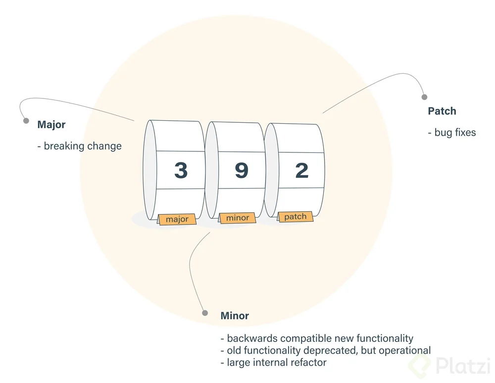

# Curso de Gestión de Dependencias y Paquetes con NPM

## - [Introducción a NPM](#1-Acerca-de-NPM-paquetes-y-módulos)
## - [YARN](#yarn)
### 1.Acerca de NPM, paquetes y módulos
¿Qué es **NPM** (_node package manager_) ? Es un gestor de paquetes, el más popular que tiene JavaScript, donde encontrarás una gran cantidad de recursos para poder implementar en tus proyectos. También vas a poder crear tus propios paquetes y compartirlos con toda la comunidad.

Es la forma más popular de manejar nuestras dependencias en JS

## 2. Instalación
### 2. Windows
### 3. Mac

## 3. Configuración
### 4. Iniciar un proyecto
:link: [npm-package.json Specifics of npm's package.json handling](https://docs.npmjs.com/files/package.json.html)

```bash
git init
```
Establece la configuración por defecto para el archivo package.json
```bash
npm init -y
```
Editar package.json  
Agregar el nombre del autor a la configuración por defecto de NPM
```bash
npm set init.author.name "Camilo"
```

`npm init` Nos sirve para crear el archivo package.json el cual contiene toda la información acerca de nuestro proyecto, entre los datos que contiene son:

+ `package name`, que es el nombre de tu proyecto.
+ `version`, la versión en la que esta tu proyecto.
+ `description`, sobre que trata nuestro proyecto.
+ `entry point`, el punto de entrada de nuestro proyecto.
+ `test` command u otros comandos de utilidad para nuestro proyecto.
+ `gti repository`, el repositorio donde esta almacenado tu proyecto, podria ser github, gitlab, entre otros.
+ `keywords`, son palabras que describen a nuestro proyecto
+ `author`, quien esta desarrollando el proyecto aquí va nombre `<email>`


### 5. Instalación de dependencias

+ `–save` : Este documento que vas a instalar dentro del proyecto es necesario para vivir en producción. Hay que tener cuidado con los paquetes que instalamos, cuando es a producción y cuando no lo es.
+ `–save-dev`: Este documento que vamos a instalar solo es necesario en nuestro entorno local o en el de desarrollo. Es importante no mandar dependencias a producción ni omitir algunas que deban de estar en producción.

```bash
npm i -D -E date-fns
```
+ -i: Instalar
+ -D: Guardar dependencia de desarrollo
+ -E: guardar versión exacta

De forma global `-g`
```bash
sudo npm i -g nodemon
```

Listar todos los paquetes instalados de forma global
```bash
npm list -g --depth 0
```
Instalar de manera opcional `-O`
```bash
npm install eslint -O
```

### 6. Instalación de dependencias con force
:link: (dependencies)[https://docs.npmjs.com/files/package.json.html#dependencies]

Simular la instalación de un paquete de forma **simulada**
```bash
npm i react --dry-run
```
Instalar de manera forzada: es decir que fuerza la instalación de la última versión
```bash
npm i webpack -f
```
Revisar el archivo `package.json` y volver a instalar las dependencias que estan como estan declaradas en el archivo.
```bash
npm install
```
Instalar versión en específico/particular
```bash
npm i json-server@0.15.0
```

### 7. Actualizar y eliminar paquetes
Mostrar el árbol de jerarquía de los paquetes
```bash
npm list
```
Mostrar todos los paquetes locales sin dependencias.
```bash
npm list --depth=0
```
Revisar que paquetes disponen de nuevas versiones
```bash
npm outdate
```
Revisar cual es la version mas resiente de un paquete en especifico
```bash
npm view <package_name> version
```
Para ver un output más detallado
 ```bash
npm outdate --dd
 ```
Actualizar los paquetes que no están en la ultima versión
 ```bash
npm update
 ```
Actualizar un paquete especifico
 ```bash
npm install json-server@latest
 ```
Eliminar un paquete de `node_modules` y del archivo `package.json`
 ```bash
npm uninstall json-server
 ```
Desinstalar un paquete de todo `node_modules` pero no del archivo `package.json`
 ```bash
npm uninstall webpack --no-save
 ```


### 8. Package lock y el uso los símbolos ^ y ~

Package lock y el uso los símbolos ^ y ~


`^` Si mantenemos el caret dentro de la configuración de nuestro package estamos garantizando que cuando realicemos una actualización o tengamos un cambio que podamos realizar, vamos a hacer actualización de los cambios menores y de los parches o bug fixes.
Para quedarnos en una sola versión eliminamos el caret.

`~` Establece que vamos a recibir actualizaciones o cambios solamente de los cambios que son parches o bug fixes.

### 9. Ejecutar tareas
Los scripts son comandos que podemos establecer para poder ejecutarlos desde la consola
Crear un comando convidando
```bash
"deploy": "npm run format && npm run bluid",
```

### 10. Solución de problemas
Activar el modo _vervose_ de todo lo que ocurre dentro del proyecto
```bash
npm run <NOMBRE_PROYECTO> --dd
```
Limpiar cache
```bash
npm cache clean --force
```
Verificar si existe cache
```bash
npm cache verify
```
Eliminar carpeta `node_modules`
```bash
rm -rf node_modules
```
Instalar el paquete `rimraf` para eliminar de buena manera `node_modules`
```bash
sudo npm i -g rimraf
```
Eliminar con `rimraf` la carpeta `node_modules`
```bash
rimraf node_modules
```


### 11. Seguridad
:link: [Develop fast. Stay secure](https://snyk.io/)

Podemos revisar las vulnerabilidades de nuestro proyecto con:
```bash
npm audit
```
Nos permite ver una auditoría en formato json
```bash
npm audit --json
```
En caso de tener vulverabilidades, se recomienda usar el comando:
```bash
npm audit fix
```
Y en caso de que esto no lo solucione, podemos ir actualizandolos de uno en uno.

## 4. Publicar un paquete
### 12. Crear un paquete para NPM
### 13. Publicar un paquete en NPM
### 14. Paquetes privados
### 15. Cierre del curso


## Yarn

1.
```bash
$ curl -sS https://dl.yarnpkg.com/debian/pubkey.gpg | sudo apt-key add -
$ echo "deb https://dl.yarnpkg.com/debian/ stable main" | sudo tee /etc/apt/sources.list.d/yarn.list
```
2. 
```bash
$ sudo apt update
$ sudo apt install yarn
```
3.
```bash
$ yarn --version
```

```bash
```

|           npm          |           yarn          |
|:----------------------:|:-----------------------:|
| npm init               | yarn init               |
| npm run                | yarn run                |
| npm test               | yarn test               |
| npm login (and logout) | yarn login (and logout) |
| npm link               | yarn link               |
| npm publish            | yarn publish            |
| npm cache clean        | yarn cache clean        |
| npm ugrade             | yarn upgrade-interactive        |


| Command                  | npm                                | yarn                         |
|--------------------------|------------------------------------|------------------------------|
| Install dependencies     | npm install                        | yarn                         |
| Install package          | npm install [package]              | yarn add [package]           |
| Install dev package      | npm install --save-dev [package]   | yarn add --dev [package]     |
| Uninstall package        | npm uninstall [package]            | yarn remove [package]        |
| Uninstall dev package    | npm uninstall --save-dev [package] | yarn remove [package]        |
| Update                   | npm update                         | yarn upgrade                 |
| Update package           | npm update [package]               | yarn upgrade [package]       |
| Global install package   | npm install --global [package]     | yarn global add [package]    |
| Global uninstall package | npm uninstall --global [package]   | yarn global remove [package] |
| List Global packages     | npm list -g --depth 0              | yarn global list             |
| List local packages      | npm list --depth=0                 | yarn list --depth=0          |
| List outdated local packa| npm outdated                       | yarn outdated                |
| List outdated global pack| npm outdated --global              | :x:                       |


