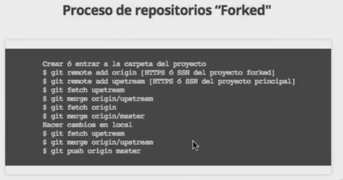

# Git & GitHub


- :link: [git](https://github.com/git/git)
- :link: [git](https://git-scm.com/)
- :link: [gitimmersion.com](http://gitimmersion.com/index.html)
- :link: [learngitbranching](https://learngitbranching.js.org/)
- :link: [GitHub Guides](https://guides.github.com/)
- :link: [github-cheat-sheet](https://github.com/tiimgreen/github-cheat-sheet)
- :link: [EMOJI CHEAT SHEET](https://www.webpagefx.com/tools/emoji-cheat-sheet/)
- :link: :octocat:[Notas C. Nuevo Git y GitHub](#notas_c_nuevo_git)


### Instalación
```
$ sudo apt-get install git
```

### Para comprobar la version
```
$ git --version
```

## Instalar git

Para instalar git la versión mas reciente del link
- :link: https://github.com/git/git.git
- :link: https://www.kernel.org/pub/software/scm/git/
```bash
$ sudo apt-get update
$ sudo apt-get install git
$ sudo apt-get update
```
```bash
$ sudo apt-get install libcurl4-gnutls-dev libexpat1-dev gettext libz-dev libssl-dev
```
```bash
$ wget https://github.com/git/git/archive/v1.9.2.zip -O git.zip
```
```bash
$ unzip git.zip
$ cd git-XXX
$ make prefix=/usr/local all
$ sudo make prefix=/usr/local install
```
Para instalar **Gitk** visualisador de commits para **git** en linux/windows
```bash
$ sudo apt-get install git-gui
```
## Paso_GIT

METODO No.1 **HACER LA LLAVE SSH "sra"**
Si quiere crear un par de llave RSA en vez de DSA solo debe usar -t rsa ( no debe especificar el largo "-b" por defecto el largo para RSA es de 4096 y es suficiente)
```bash
$ ssh-keygen -t rsa -b 4096 -C "comentario_de_la_llave+your_email@example.com" -> frase_de_la_llave
```

METODO No.2 **HACER LA LLAVE SSH "ed25519"**  
- :link:[Upgrade Your SSH Key to Ed25519](https://medium.com/risan/upgrade-your-ssh-key-to-ed25519-c6e8d60d3c54)
- :link:[EdDSA WikiPedia](https://en.wikipedia.org/wiki/EdDSA)
- :link:[How to use ssh-keygen to generate a new SSH key](https://www.ssh.com/ssh/keygen)
- :link:[SSH keys - ArchWiki](https://wiki.archlinux.org/index.php/SSH_keys)

```bash
$ ssh-keygen -o -a 100 -t ed25519 -f ~/.ssh/id_ed25519 -C "comentario_de_la_llave+your_john@example.com" #-> frase_de_la_llave
```
Preguntara para hacer la frase de la contraseña.  
- `-o` : Save the private-key using the new _OpenSSH_ format rather than the PEM format. Actually, this option is implied when you specify the key type as **ed25519**.
- `-a`: It’s the numbers of _KDF_ (Key Derivation Function) rounds. Higher numbers result in slower passphrase verification, increasing the resistance to brute-force password cracking should the private-key be stolen.
- `-t`: Specifies the type of key to create, in our case the **Ed25519**.
- `-f`: Specify the filename of the generated key file. If you want it to be discovered automatically by the SSH agent, it must be stored in the default `.ssh` directory within your home directory.
- `-C`: An option to specify a comment. It’s purely informational and can be anything. But it’s usually filled with `<login>@<hostname>` who generated the key.


## Adding your SSH key to the ssh-agent
Before adding a new SSH key to the ssh-agent to manage your keys, you should have [checked for existing SSH](https://help.github.com/articles/checking-for-existing-ssh-keys/) keys and [generated a new SSH key](https://help.github.com/articles/generating-a-new-ssh-key-and-adding-it-to-the-ssh-agent/#generating-a-new-ssh-key)

1. Start the ssh-agent in the background.
```bash
$ eval "$(ssh-agent -s)"
Agent pid 59566
```

2. Add your SSH private key to the ssh-agent. If you created your key with a different name, or if you are adding an existing key that has a different name, replace id_rsa in the command with the name of your private key file.
```bash
$ ssh-add ~/.ssh/id_rsa
```

3. Add the SSH key to your GitHub account.Copy the SSH key to your clipboard.
If your SSH key file has a different name than the example code, modify the filename to match your current setup. When copying your key, don't add any newlines or whitespace.
```bash
$ sudo apt-get install xclip
# Downloads and installs xclip. If you don't have `apt-get`, you might need to use another installer (like `yum`)

$ xclip -sel clip < ~/.ssh/id_rsa.pub
# Copies the contents of the id_rsa.pub file to your clipboard
```

**NOTA**.- Tip: If xclip isn't working, you can locate the hidden .ssh folder, open the file in your favorite text editor, and copy it to your clipboard.

4. In the upper-right corner of any page, click your profile photo, then click Settings.
5. Authentication keysIn the user settings sidebar, click SSH and GPG keys.
6. SSH Key buttonClick New SSH key or Add SSH key.
7. In the "Title" field, add a descriptive label for the new key. For example, if you're using a personal Mac, you might call this key "Personal MacBook Air".
8. The key fieldPaste your key into the "Key" field.
9. The Add key buttonClick Add SSH key.
10. Sudo mode dialogIf prompted, confirm your GitHub password.

## Probando su conexión ssh
After you've set up your SSH key and added it to your GitHub account, you can test your connection.

Before testing your SSH connection, you should have:

- [Checked for existing SSH keys](https://help.github.com/articles/checking-for-existing-ssh-keys)
- [Generated a new SSH key](https://help.github.com/articles/generating-a-new-ssh-key-and-adding-it-to-the-ssh-agent)
- [Added a new SSH key to your GitHub account](https://help.github.com/articles/adding-a-new-ssh-key-to-your-github-account)

1. Abrir la terminal  y
```bash
$ ssh -T git@github.com
```

# Attempts to ssh to GitHub
Se mostraran mensajes de advertencia ejem:
```bash
The authenticity of host 'github.com (192.30.252.1)' can't be established.
RSA key fingerprint is 16:27:ac:a5:76:28:2d:36:63:1b:56:4d:eb:df:a6:48.
Are you sure you want to continue connecting (yes/no)?

The authenticity of host 'github.com (192.30.252.1)' can't be established.
RSA key fingerprint is SHA256:nThbg6kXUpJWGl7E1IGOCspRomTxdCARLviKw6E5SY8.
Are you sure you want to continue connecting (yes/no)?
```

**Nota**: The example above lists the GitHub IP address as 192.30.252.1. When pinging GitHub, you may see a range of IP addresses. For more information, see "What IP addresses does GitHub use that I should whitelist?"

2. Verify that the fingerprint in the message you see matches one of the messages in step 2, then type yes:
```bash
Hi username! You've successfully authenticated, but GitHub does not
provide shell access.
```

You may see this error message:
```bash
Agent admitted failure to sign using the key.
debug1: No more authentication methods to try.
Permission denied (publickey).
```

This is a known problem with certain Linux distributions. For more information, see "[Error: Agent admitted failure to sign](https://help.github.com/articles/error-agent-admitted-failure-to-sign)".
Verify that the resulting message contains your username. If you receive a "permission denied" message, see "[Error: Permission denied (publickey)](https://help.github.com/articles/error-permission-denied-publickey)".

Para entrar vía terminal a maquina remota vía ssh
```bash
$ ssh root@XXX.XXX.XXX.XXX -> Después pedirá cambia la contraseña por otra nueva "xxxxxxxxxxxxxxx"
```

Para que se pueda conectar el VPS con nuestro repositorio en github se tiene que hacer una llave ssh en el usuario en el que se esta ejecutando nuestra aplicación.

Cuando se crea la llave ssh, en el repositorio de github se añade. Con nombre lacanteramack854JdsK
```bash
$ ssh-keygen -t rsa -b 4096 -C "comentario_de_la_llave" -> Frase contrasena_de_la_llave
```

Cuando se crea la llave ssh y esta instalal en github ahora en nuestra sesión de nuestro usuario en vps dentro de la carpeta donde se encuentra manage.py y dentro del ambiente virtual se ejecuta
```bash
$ git init
```

Se agrega la dirección del repositorio remoto
```bash
$ git remote add origin [REPOSITORIO HTTPS o SSH]
```
Eliminar dirección del repositorio remoto
```bash
$ git remote rm <REMOTE-NAME>
```

Se comprueba que se añadieron correctamente
```bash
$ git remote -v
```

Para descargar/jalar el repositorio a nuestro vps, tiene que ser de la rama master
```bash
$ git pull origin master -> Piede el password del ssh
```

### Añadir nuestra llave SSH al agente ssh-agent
```
$ eval "$(ssh-agent -s)"
Agent pid 59566

$ ssh-add ~/.ssh/id_rsa
```

### Probar la conexión con Github
```
ssh -T git@github.com
# Attempts to ssh to GitHub
```

### Después configuraremos nuestros datos (usaré los míos):
```
$git config --global user.name "TU NOMBRE"
$git config --global user.email "TU CORREO DE GITHUB"
$git config --global color.ui true
$git config --global --list
```

### Subir cambios a GitHub
```
$ git init
$ git remote add origin [HTTPS or SSH]
$ git remote -v [Para ver en que rama nos encontramos]
```

### Abreviatura/contracciones
```bash
- git pull = git fetch + git merge
- git commit -am "MENSAJE DEL commit" # SOLO SI NO SE HA AÑADIDO(s) NUEVOS ARCHIVOS
```

### Generamos cambios
```
$ git add -A
$ git commit -m "[Mensaje]" - (ABREVIATURA __$ git commit -am "[Mensaje]"__ )
$ git push origin master
$ git checkout [branch/rama/puede ser master ó otra rama del proyecto]
```

### 2.2 Ramas - Practiquemos ramas
```
git branch [nombre]
```

## 2.2 Ramas - git log

Agrupar los commits por autor
```bash
$ git shortlog
```

### GIT SUPER-LOG No.1

NOTA: Se cambio el nombre de git superlog -> git slog Para que se sea más rapido escribirlo
```bash
$ git config --global alias.slog "log --graph --abbrev-commit --decorate --date=relative --format=format:'%C(bold blue)%h%C(reset) - %C(bold green)(%ar)%C(reset) %C(white)%s%C(reset) %C(dim white)- %an%C(reset)%C(bold yellow)%d%C(reset)'" --all
```
### GIT SUPER-LOG No.2
NOTA: Se cambio el nombre de git superlog -> git slog Para que se sea más rapido escribirlo
```bash
$ git config --global alias.slog "log --graph --pretty=format:'%Cred%h%Creset -%C(yellow)%d%Creset %s %Cgreen(%cr) %C(bold blue)<%an>%Creset' --abbrev-commit"
```
### Exploración: Git Clone
```bash
$ git clone [https or SSH]
```
```bash
$ git log (comprobar commits)
```

## Git Fetch & Git Merge
### Creamos ó entramos a la carpeta de nuestro proyecto
```
$ git branch -v [Para ver en que rama nos encontramos]
$ git init (si apenas vamos a iniciar)
$ git remote add origin [HTTS or SSH]
$ git branch -a [Para mostrar los branches ocultos]
$ git fetch origin
$ git merge origin/master
```
### Hacen cambios
```
$ git fetch origin
$ git merge origin/master
$ git push origin master
```

### Repositorios "forked" - Crear ó entrar a la carpeta del proyecto
```
$ git remote add origin [HTTPS ó SSH del proyecto forked]
$ git remote add upstream [HTTPS ó SSH del proyecto "main"]
$ git fetch upstream
$ git merge origin/upstream
$ git fetch origin
$ git merge origin/master
```
### Hacer cambios en local
```
$ git fetch upstream
$ git merge origin/upstream
$ git push origin master
```

### Tags
Los tags o etiquetas nos permiten asignar versiones a los commits con cambios más importantes o significativos de nuestro proyecto.  
Comandos para trabajar con etiquetas:
- Crear un nuevo tag y asignarlo a un commit: `git tag -a nombre-del-tag id-del-commit`
- Borrar un tag en el repositorio local: `git tag -d nombre-del-tag`
- Listar los tags de nuestro repositorio local: `git tag o git show-refs --tags`
- Publicar un tag en el repositorio remoto: `git push origin --tags`
- Borrar un tag del repositorio remoto: `git tag -d nombre-del-tag y git push origin :refs/tags/nombre-del-tag`

`git remote add origin <DIRECCION_DE_NUESTRO_ REPOSITORIO>`

Para subir los cambios al repositorio -> git push origin master

*…or create a new repository on the command line*
```bash
echo "# xxxxxxxxx-xxxxxxx-xxxxxxx" >> README.md
git init
git add README.md
git commit -m "first commit"
git remote add origin git@github.com:xxxxxxxxxx/xxxxxxxxx-xxxxxxx-xxxxxxx.git
git push -u origin master
```
**…or push an existing repository from the command line**
```bash
git remote add origin git@github.com:xxxxxxxxxx/xxxxxxxxx-xxxxxxx-xxxxxxx.git
git push -u origin master
```
**…or import code from another repository**
You can initialize this repository with code from a Subversion, Mercurial, or TFS project.


## Git Workflow – Iteración Básica

### Empezar a rastrear la carpeta del proyecto, iniciar un repositorio:
```bash
git init
```

### Mostrar el punto donde nos encontramos en la iteración, qué archivos podemos guardar o ver el estado:
```bash
git status
```

### Agregar archivos al área de preparación (Staging):
```bash
git add favicon.ico
#
git status
```

### Agregar todos los archivos a Staging Area:
```bash
git add –A
```

### Primer commit:
```bash
git commit –m "Creación inicial del proyecto. Assets, Imágenes"
```

### Modificar el código y hacer un segundo Commit:
```bash
# Modificar index.html
$ git status # (Muestra en rojo que index.html fue modificado)
$ git add index.html
$ git commit –m "Título y descripción agregadas."
```
### Asignar un Alias a un comando largo de Git:
```bash
git config --global alias.superlog "log --graph --abbrev-commit --decorate --date=relative --format=format:'%C(bold blue)%h%C(reset) - %C(bold green)(%ar)%C(reset) %C(white)%s%C(reset) %C(dim white)- %an%C(reset)%C(bold yellow)%d%C(reset)' --all"
```
## GIT SUPER-LOG - ALIAS

- :link: [Alias](https://git.wiki.kernel.org/index.php/Aliases)
- :link: [Alias stackoverflow.com question](https://stackoverflow.com/questions/23925998/alias-to-create-aliases#23928098)

En linux los alias creados son se almacenan en al archivo `~.gitconfig` 
```bash
[alias]
    st = status
    ci = commit -v
```
Formato para hacer "alias"
```bash
git config --global alias.<alias> <git-command>
```

Formato para remover un alias
```bash
$ git config --global --unset alias.<NOMBRE-DEL-ALIAS>
```

Cuando se usa **oh-my-zsh** se instala un plug-in de github el cual se encuentra en la ruta
```bash
.oh-my-zsh/plugins/git/git.plugin.zsh
```

:heavy_exclamation_mark: **NOTA**: :heavy_exclamation_mark: Se cambio el nombre de git superlog -> git slog Para que se sea más rapido escriirlo :heavy_exclamation_mark:
```bash
git config --global alias.slog "log --graph --abbrev-commit --decorate --date=default --format=format:'%C(bold blue)%h%C(reset) - %C(bold green)(%ar)%C(reset) %C(white)%s%C(reset) %C(dim white)- %an%C(reset)%C(bold yellow)%d%C(reset)' --all"
```

- Crear una rama -> `git checkout -b <nombre_de_nueva_rama>` (Crea nueva rama y se cambia a ella)
- Borrar una rama -> `git branch -d <nombre_de_rama>` (Antes de borrar tiene que estar fusionada)
- Borrar una rama -> `git branch -D <nombre_de_rama>` (Forzar eliminación de rama)
- Modificaciones/rectificar al ultimo commit -> `git commit -am "<comentarios>" --amend`
- Descartar cambios en directorio de trabajo -> `git checkout -- <nombre_de_archivo>`
- Es lo mismo `git add -A git commit -m "<MENSAJE_DE_COMMIT>" a git commit -am "<MENSAJE DE COMMIT>" S`
- `git log -m "mensaje" --amend` -> Rectifica y sustituye el ultimo commit
- `git log --oneline` -> muestra el commit resumido en una linea
- `git log --decorate` -> muestra el commit con el head indicado donde esta posicionado
- `git log --stat` -> explica con detalle en numero de lineas que se convinaron.
- `git log -p` -> es un análisis más profundo del anterior (`git log --stat`).
- `git shortlog` -> agrupa por autor y muestra los titulos del commit.
- `git log --graph --oneline --decorate` -> muestra grafica del de historial del repositorio.
- `git log -<n>` -> Mustra los ultimos **n** commits.
- `git log --author <name>` -> Filtrar commits por autor. `# git log --author=Bob`
- `git log --committer <name>` -> Filtrar commits por nombre.
- `git log --after <date> --before <date>` -> Filtrar commits por un rango de fechas `# git log --after "2014-02-01" --before "2014-02-02"`
- `git log -- nombre_de_archivo.py name_of_the_file.py` -> El log de archivos particulares.
- `git log -i --grep="JRA-224:"` -> Filtrar log's por mensajes en el comentario en el commit.
- `git grep "texto a buscar"` -> Busca en todos los archivos del repositorio el texto que se encuentra en las comillas.
- Con `git grep -n` color nos saldrá un output el cual nos dirá en qué línea está lo que estamos buscando.
- Con `git grep -c` color nos saldrá un output el cual nos dirá cuántas veces se repite esa palabra y en qué archivo.
- Si queremos buscar cuántas veces utilizamos un atributo de HTML lo hacemos con `git grep -c "<p>"`.

:link:[GitHub Cheat Sheet](https://github.github.com/training-kit/downloads/github-git-cheat-sheet.pdf)
### Git Fetch + Git Merge


### Proyecto de terceros "Proyectos Forks"




### PROCESO DE GITHUB EN PROYECTO EN PRODUCCIÓN


To set your identity:
```bash
git config --global user.name "John Doe"
git config --global user.email johndoe@example.com
```
To set your editor:
```bash
git config --global core.editor emacs
```
To enable color:
```bash
git config --global color.ui true
```
To stage all changes for commit:
```bash
git add --all
```
To stash changes locally, this will keep the changes in a separate changelist called stash and the working directory is cleaned. You can apply changes from the stash anytime
```bash
git stash
```
To stash changes with a message
```bash
git stash save "message"
```
To list all the stashed changes
```bash
git stash list
```
To apply the most recent change and remove the stash from the stash list
```bash
git stash pop
```
To apply any stash from the list of stashes. This does not remove the stash from the stash list
```bash
git stash apply stash@{6}
```
To commit staged changes
```bash
git commit -m "Your commit message"
```
To edit previous commit message
```bash
git commit --amend
```
Git commit in the past
```bash
git commit --date="`date --date='2 day ago'`"
git commit --date="Jun 13 18:30:25 IST 2015"
```
More recent versions of Git also support --date="2 days ago" directly. To change the date of an existing commit
```bash
git filter-branch --env-filter \
  'if [ $GIT_COMMIT = 119f9ecf58069b265ab22f1f97d2b648faf932e0 ]
  then
  export GIT_AUTHOR_DATE="Fri Jan 2 21:38:53 2009 -0800"
  export GIT_COMMITTER_DATE="Sat May 19 01:01:01 2007 -0700"
  fi'
```
To removed staged and working directory changes
```bash
$ git reset --hard
```
To go 2 commits back
```bash
$ git reset --hard HEAD~2
```
Para saber que archivos se borran\eliminar(prueba en seco)
```bash
$ git clean --dry-run
```
Para borrar\eliminar todos los archivos listados con el comando anterior (que no son carpetas) tecleamos
```bash
$ git bash -f
```
Borrar\eliminar archivos no trakeados
```bash
$ git clean -f -d
```
Eliminar\borrar archivos no trakeados y archivos ignorados
```bash
$ git clean -f -d -x
```
To push to the tracked master branch:
```bash
$ git push origin master
```
To push to a specified repository:
```bash
$ git push git@github.com:username/project.git
```
To delete the branch "branch_name" locally (force)
```bash
$ git branch -D branch_name
```
Delete branch remotely
```bash
$ git push origin --delete remoteBranchName
```
To make an exisiting branch track a remote branch
```bash
$ git branch -u upstream/foo
```
To see who commited which line in a file
```bash
$ git blame filename
```
To sync a fork with the master repo:
```bash
$ git remote add upstream git@github.com:name/repo.git # Set a new repo
$ git remote -v # Confirm new remote repo
$ git fetch upstream # Get branches
$ git branch -va # List local - remote branches
$ git checkout master # Checkout local master branch
$ git checkout -b new_branch # Create and checkout a new branch
$ git merge upstream/master # Merge remote into local repo
$ git show 83fb499 # Show what a commit did.
$ git show 83fb499:path/fo/file.ext # Shows the file as it appeared at 83fb499.
$ git diff branch_1 branch_2 # Check difference between branches
$ git log # Show all the commits
$ git status # Show the changes from last commit
```

Commit history of a set of files
```bash
$ git log --pretty=email --patch-with-stat --reverse --full-index -- Admin\*.py > Sripts.patch
```
Import commits from another repo
```bash
$ git --git-dir=../some_other_repo/.git format-patch -k -1 --stdout <commit SHA> | git am -3 -k
```
View commits that will be pushed
```bash
$ git log @{u}..
```
View changes that are new on a feature branch
```bash
$ git log -p feature --not master
$ git diff master...feature
```
Interactive rebase for the last 7 commits
```bash
$ git rebase -i @~7
```
Diff files WITHOUT considering them a part of git  
This can be used to diff files that are not in a git repo!
```bash
$ git diff --no-index path/to/file/A path/to/file/B
```

To pull changes while overwriting any local commits
```bash
$ git fetch --all
$ git reset --hard origin/master
```
Update all your submodules
```bash
$ git submodule update --init --recursive
```
Perform a shallow clone to only get latest commits (helps save data when cloning large repos)
```bash
$ git clone --depth 1 <remote-url>
```
To unshallow a clone
```bash
$ git pull --unshallow
```
Create a bare branch (one that has no commits on it)
```bash
$ git checkout --orphan branch_name
```
Checkout a new branch from a different starting point
```bash
$ git checkout -b master upstream/master
```
Remove all stale branches (ones that have been deleted on remote)  
So if you have a lot of useless branches, delete them on Github and then run this
```bash
$ git remote prune origin
```
The following can be used to prune all remotes at once
```bash
$ git remote prune $(git remote | tr '\n' ' ')
```
Revisions can also be identified with `:/text`  
So, this will show the first commit that has "cool" in their message body
```bash
$ git show :/cool
```
Undo parts of last commit in a specific file
```bash
$ git checkout -p HEAD^ -- /path/to/file
```
Revert a commit and keep the history of the reverted change as a separate revert commit
```bash
$ git revert <commit SHA>
```
**Git cherry-pick**: Traer commits viejos al head de un branch
_Pich a commit from a branch to current branch. This is different than merge as this just applies a single commit from a branch to current branch_  
Existe un mundo alternativo en el cual vamos avanzando en una rama pero necesitamos en master uno de esos avances de la rama, para eso utilizamos el comando.  
`cherry-pick` es una mala práctica porque significa que estamos reconstruyendo la historia, usa `cherry-pick` con sabiduría. _Si no sabes lo que estás haciendo ten mucho cuidado_.
```bash
$ git cherry-pick <commit-SHA1>
```
### <a name="notas_c_nuevo_git">Notas C. Nuevo Git y GitHub</a>

(Nota: Texto de Platzi.com)
Texto: @juandc

`git reset` y `git rm` son comandos con utilidades muy diferentes, pero aún así se confunden muy fácilmente.

**git rm**
---

Este comando nos ayuda a eliminar archivos de Git sin eliminar su historial del sistema de versiones. Esto quiere decir que si necesitamos recuperar el archivo solo debemos “viajar en el tiempo” y recuperar el último _commit_ antes de borrar el archivo en cuestión.

Recuerda que `git rm` no puede usarse así nomás. Debemos usar uno de los flags para indicarle a Git cómo eliminar los archivos que ya no necesitamos en la última versión del proyecto:

>`git rm --cached:` Elimina los archivos del área de Staging y del próximo _commit_ pero los mantiene en nuestro disco duro.   
`git rm --force:` Elimina los archivos de Git y del disco duro. Git siempre guarda todo, por lo que podemos acceder al registro de la existencia de los archivos, de modo que podremos recuperarlos si es necesario (pero debemos usar comandos más avanzados).

**git reset**
---

Este comando nos ayuda a volver en el tiempo. Pero no como `git checkout` que nos deja ir, mirar, pasear y volver. Con git reset volvemos al pasado sin la posibilidad de volver al futuro. Borramos la historia y la debemos sobreescribir. No hay vuelta atrás.

Este comando es muy peligroso y debemos usarlo solo en caso de emergencia. Recuerda que debemos usar alguna de estas dos opciones:

Hay dos formas de usar `git reset:` con el argumento `--hard`, borrando toda la información que tengamos en el área de _staging_ (y perdiendo todo para siempre). O, un poco más seguro, con el argumento `--soft`, que mantiene allí los archivos del área de _staging_ para que podamos aplicar nuestros últimos cambios pero desde un _commit_ anterior.

>`git reset --soft:` Borramos todo el historial y los registros de Git pero guardamos los cambios que tengamos en _Staging_, así podemos aplicar las últimas actualizaciones a un nuevo _commit_.   
`git reset --hard:` Borra todo. Todo todito, absolutamente todo. Toda la información de los commits y del área de _staging_ se borra del historial.

**¡Pero todavía falta algo!**

`git reset HEAD:` Este es el comando para sacar archivos del área de _Staging_. No para borrarlos ni nada de eso, solo para que los últimos cambios de estos archivos no se envíen al último _commit_, a menos que cambiemos de opinión y los incluyamos de nuevo en _staging_ con `git add`, por supuesto.

**¿Por que esto es importante?**

Imagina el siguiente caso:

Hacemos cambios en los archivos de un proyecto para una nueva actualización. Todos los archivos con cambios se mueven al área de _staging_ con el comando `git add`. Pero te das cuenta de que uno de esos archivos no está listo todavía. Actualizaste el archivo pero ese cambio no debe ir en el próximo _commit_ por ahora.

**¿Qué podemos hacer?**

Bueno, todos los cambios están en el área de _Staging_, incluido el archivo con los cambios que no están listos. Esto significa que debemos sacar ese archivo de _Staging_ para poder hacer _commit_ de todos los demás.

¡Al usar `git rm` lo que haremos será eliminar este archivo completamente de git! Todavía tendremos el historial de cambios de este archivo, con la eliminación del archivo como su última actualización. Recuerda que en este caso no buscábamos eliminar un archivo, solo dejarlo como estaba y actualizarlo después, no en este _commit_.

En cambio, si usamos `git reset HEAD`, lo único que haremos será mover estos cambios de _Staging_ a _Unstaged_. Seguiremos teniendo los últimos cambios del archivo, el repositorio mantendrá el archivo (no con sus últimos cambios pero sí con los últimos en los que hicimos _commit_) y no habremos perdido nada.

**Conclusión**: Lo mejor que puedes hacer para salvar tu puesto y evitar un incendio en tu trabajo es conocer muy bien la diferencia y los riesgos de todos los comandos de Git.


**Git Reset y Reflog: Úsese en caso de emergencia**

Con `git reflog` despliga todo el el historial hasta 90 días, mostrando el `HEAD` en donde se ha estado el proyecto de la forma `HEAD@{12}`
```bash
$ git reflog --all
#
$ git reflog
```
¿Qué pasa cuando todo se rompe y no sabemos qué está pasando? Con `git reset HashDelHEAD` nos devolveremos al estado en que el proyecto funcionaba.
- `git reset --soft HashDelHEAD` te mantiene lo que tengas en _staging_ ahí.
- `git reset --hard HashDelHEAD` resetea absolutamente todo incluyendo lo que tengas en _staging_.
Comandos y recursos colaborativos en Git y Github
```bash
$ git shortlog -sn # MUESTRA CUANTOS COMMIT HAN HECHO CADA MIEMBROS DEL EQUIPO.
```
```bash
$ git shortlog -sn --all # MUESTRA CUANTOS COMMIT HAN HECHO CADA MIEMBROS DEL EQUIPO HASTA LOS QUE HAN SIDO ELIMINADO
```
```bash
$ git shortlog -sn --all --no-merge # MUESTRA CUANTOS COMMIT HAN HECHO CADA MIEMBROS QUITANDO LOS ELIMINADOS SIN LOS 
MERGES
```
```bash
$ git blame ARCHIVO # MUESTRA QUIEN HIZO CADA COSA LINEA POR LINEA
```
```bash
$ git COMANDO --help # MUESTRA COMO FUNCIONA EL COMANDO.
```
```bash
$ git blame ARCHIVO -Llinea_inicial,linea_final # MUESTRA QUIEN HIZO CADA COSA LINEA POR LINEA INDICÁNDOLE DESDE QUE 
LINEA VER EJEMPLO -L35,50
```
```bash
$ git branch -r # SE MUESTRAN TODAS LAS RAMAS REMOTAS
```
```bash
$ git branch -a # SE MUESTRAN TODAS LAS RAMAS TANTO LOCALES COMO REMOTAS
```


