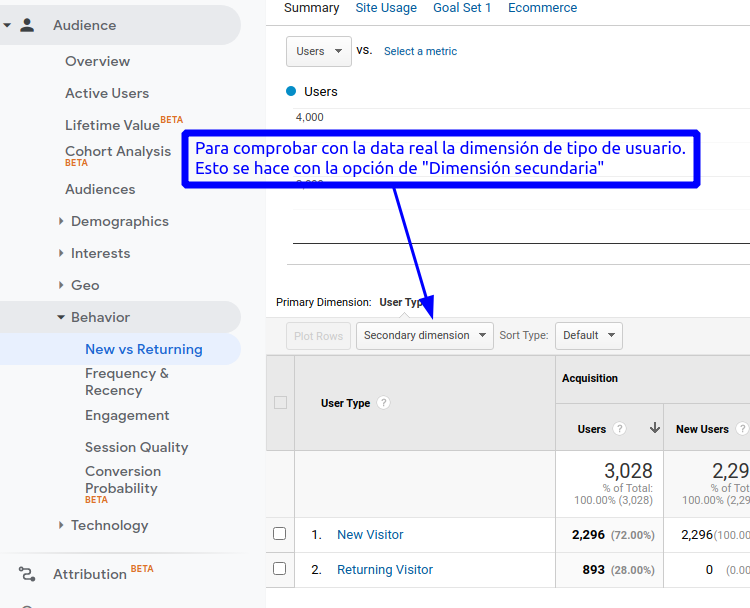
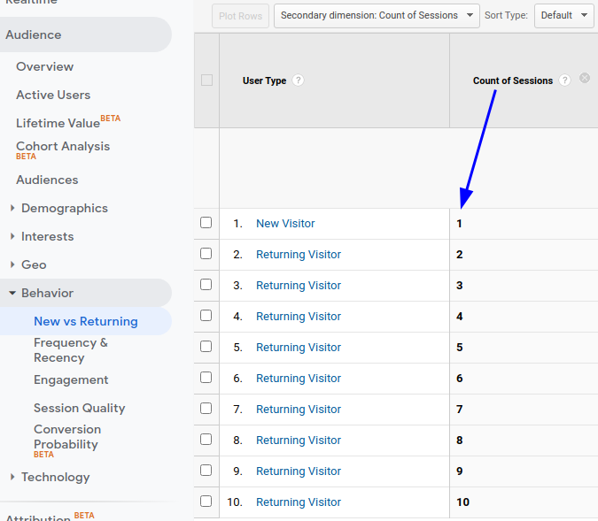
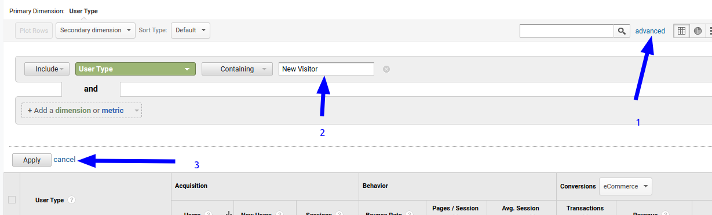
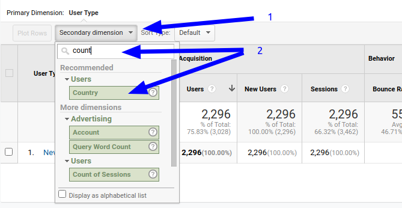
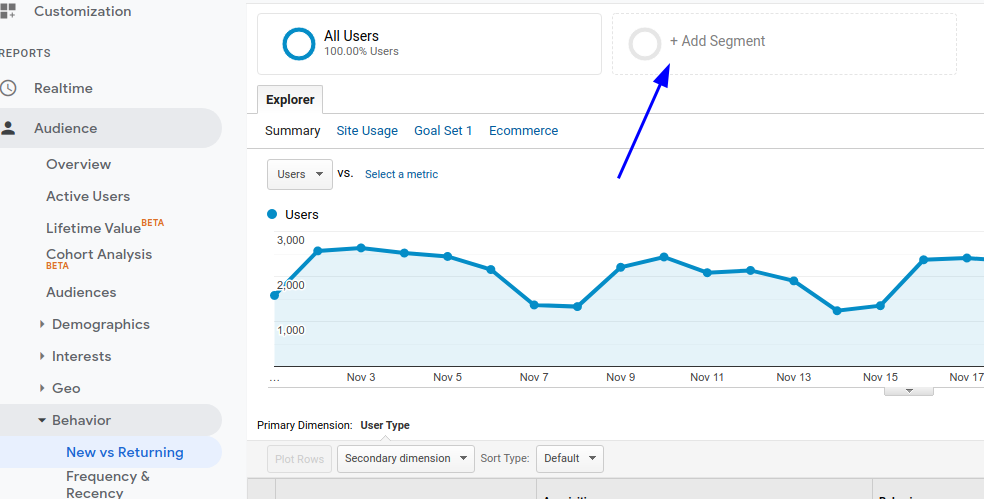

# C Google Analytics

:file_folder: c_google_analytics

- :link: [OFFICIAL BLOG Google Marketing Platform The latest news and perspectives on the power of ads and analytics.](https://blog.google/products/marketingplatform/360/)

En Oct 14, 2020 Google saco una nueva versión de Google Analytics, _Google Analytics 4_ __G4__ :link:    
Ahora se tiene que hacer el procedimiento de creación de seteo para G4 diferente.   
:video_camera: :link: [Easy Google Analytics 4 Setup 2021 (Install GA4 and Universal Analytics)](https://youtu.be/dPYx-eS4gyE)

- :link: [How to get started with the new Google Analytics](https://support.google.com/analytics/answer/10089681)
- :link: [Google Analytics 4 Tutorials](https://youtube.com/playlist?list=PLgr_8Hk8l4ZG-drs4DouI1e4uqTmbz2od)

En esta página de google la analitica es publica y se pude ocupar para praticar para este curso.   
- :link: [Google Merchandise Store](https://shop.googlemerchandisestore.com/)

1. Usuarios                          _Audiencia_
2. Usuarios nuevos                   _Aidiencia_
3. Sesiones                          _Comportamiento_
4. Número de sesiones por usuario    _Comportamiento_
5. Número de visitas a páginas       _Comportamiento_
6. Páginas / sesión                  _Comportamiento_
7. Duración media de la sesión       _Comportamiento_
8. Porcentaje de rebote              _Comportamiento_

- **Métricas:** Es la necesidad de contar y medir.
- **Cookies:** Archivo almacenado en el navegador luego de colsultar una web para recordar patrones de navegación. **Las cookies están instaladas con respecto al dispositivo.**
- Para Google Analytics los **usuarios son diferentes a las personas.**
- **Usuarios es igual a dispositivos.**
- Una persona puede tener diversos dispositivos y conectarse desde el que se desee haciendolo distintas veces, para corregir esto se usa una configuracipón llamada **cross device tracking/signal** :link: [Activate Google signals](https://support.google.com/analytics/answer/7532985)
- **La suma de usuarios usuales es distinta a la suma de usuarios totales.** No hay que sumar los usarios del mes anterior con los de este mes para decir cual es el número total de usuarios

Tipos de usuarios y sesiones.   
- **Usuarios:** representan la cantidad de visitantes únicos que acceden a un sitio web.
- GA diferencia los usuarios por un ID que crea automáticamente, y que es almacenado por el navegador como una cookie; pero si se cambia de navegador, de ordenador o de dispositivo, GA creará una nueva ID, y se considera como un nuevo usuario.

**Sesiones**: Es un conjunto de interacciones que se da en un periodo tenerminado. El tiempo que tarde el usuario entre realizar una interacción y otra será un factor para determinara el numero de sesiones. Si el tiempo entre una interacción y otra es menor a 30 min esta se mantendrá con una misma sesión, pero si el tiempo entre interacciones supera los 30 min ya será tomado como una nueva sesión.

- **Número de visitas**: es contabilizar el numero de veces que se ha visitado una pagina en un periodo de tiempo determinado.   
    Sin embargo en ocasiones podría ocurrir que una pagina tenga una cantidad de visitas exageradas, ya es habitual que un
    usuario puede visitar mucha veces una misma pagina en un periodo de tiempo corto, para evitar esta distorsión
    existe otra métrica que se llama:
- **Numero de paginas vistas únicas**: que te dice el numero de vistas únicas durante esa sesión, de esta manera es mas fácil
    calcular si una pagina tuvo mayor o menor interés.
- **Duración media de la sesión**: GA determina el tiempo de sesión a través del tiempo que transcurre desde una primera carga
    dentro de un sitio hasta las otras cargas que se hagan en el mismo, el problema esta en que GA no logra determinar cual
    fue el tiempo de carga de la ultima pagina o pagina de salida, ni de un usuario que visite una sola pagina, porque como
    se menciona anteriormente GA ve el tiempo entre cargas y no en cargas únicas. Entonces en estos dos casos asume que el
    tiempo en esas paginas es 0, a esto hay que prestarle atención ya que por ejemplo en un blog donde se cargue una sola pagina
    esta métrica va a fallar.

_Para calcular la duración media de las sesiones_, Analytics suma la duración de cada sesión durante el periodo especificado y divide
el resultado entre el número total de sesiones. Por ejemplo:

1. Duración de todas las: 1000 minutos (60.000 segundos)
2. Número total de sesiones: 100
3. Duración media de la sesión: 1000/100 = 10 minutos (600 segundos)

- :link: [Duración media de la sesión](https://support.google.com/analytics/answer/1006253?hl=es)

- **Rebote**: Por defecto un rebote en Google Analytics es cuando un usuario entra a un sitio y no
    genera más interacción que la misma carga de la página, es decir, sólo genera una interacción.
    Efectivamente por defecto una sesión con una sola página vista será tomada como un rebote,
    si es que no se hizo otra interacción. _¿Cuándo no pasaría esto?_, por ejemplo si el usuario inicia
    una sesión en una página y la refresca en un periodo menor a 30 minutos, el refrescar será tomado
    como una nueva interacción, así que ahí no habrá rebote a pesar que sólo consumió una sola página.
- **Porcentaje de rebote**: _Es la división de los rebotes por la entradas._ **Rebotes/Entradas**. Es decir,
    la cantidad de personas que en una sesión sólo tuvieron una interacción divido por las que iniciaron
    la sesión en la misma página, independiente si posteriormente generaron nuevas interacciones en su navegación.

Accedera a la cuenta de demostración.   
:link: [Cuenta de demostración](https://support.google.com/analytics/answer/6367342?hl=es)

:link: [Google Merchandise Store](https://shop.googlemerchandisestore.com/)  
Enero
Usuarios    52,627  
Sesiones    66,211  
Nunnero de sesiones por usuario -> Sesiones/Usuarios -> 1.258118456

Numero de visitas a paginas	299721
Paginas/Sesion	4.526755373

Suma de usuarios != Usuarios totales
Se toman dos meses Diciembre-Enero

Usuarios(Tomando los datos por periodos/rango de fechas diferentes)
Diciembre   60800
Enero       52627
            113427

Si se toman por el perido/rango de fecha de Diciembre-Enero
El total son 110604

Es diferente por que contabiliza doble a los usuarios que que fueron nuevos en el periodo y que volvieron a ser recurentes en el perido analizado

Usuarios nuevos != Usuarios recurentes   
15 Diciembre   
Audiencia>Comportamiento>New vs Returning Visitors   

Usuarios
Nuevos          2296
Recuerentes     893
                3,189 != a 3,028 usuarios que reporta GA

Para comprobar con la data real la dimensión de tipo de usuario.   
Esto se hace con la opción de "Dimensión secundaria"

Y se agrega la columna _Numero de sesiones(Count of Sessions)_

Si queremos saber del total de usuarios nuevos que llegan a nuestro sitio de donde llegan(geografia) y cuales son los paises que traen más igresos

Seleccionar el tipo de usuario desde los segmentos

   
   

- :link: 

