# Curso de JavaScript Engine (V8) y el Navegador

## 1. Introducción al curso
### 1. Requisitos antes de empezar
Las herramientas que se ocuparan són google chrome

### 2. Historia de JavaScript
:link: [The Evolution of the Web](http://www.evolutionoftheweb.com/)

Historia de la web
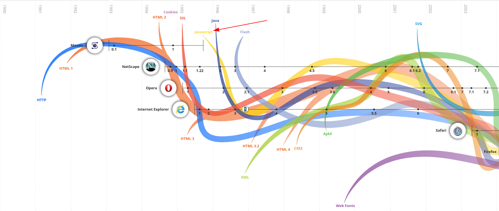

Paginas estaticas, nada de interacción.
Su fundador(programador) de js es **Breandan Eich**, pero antes de JavaScript genero un lenguaje de programación para _NetScape_ en dos tres semanas.

1. Mocha 1995
2. LiveScript 1995
3. JavaScript 1995
4. JScript(Microsoft) 1995
5. ECMA(grupo) 1997
6. V8 2008. Es un engine de JS que corre en el navegador
7. Node.js 2009 JS BackEnd
8. Frameworks 2010
9. ES6 2015 

**ECMA**
>Es una especificación estandarizada por **Ecma International**. Fue creado para estandarizar JavaScript y ayudar a fomentar múltiples implementaciones independientes.

## 2. JavaScript Engine
### 3. ¿Cómo funciona el JavaScript Engine?
:link: [DEV JavaScript Visualized: the JavaScript Engine](https://dev.to/lydiahallie/javascript-visualized-the-javascript-engine-4cdf)

**Motor de JavaScript**

Lista de tareas -> en JS -> se tiene que comunicar con la computadora -> que la computa entiende 01010101, pero JS no lo habla. -> el motor de JavaScript es el encargado de interpretar a lenguaje computadora 0101010101 y se lo pasa para que la computadora lo haga y se llama **Just un time compiles**

### 4. V8, el JavaScript Engine de Chrome
V8 es Motor de JavaScript de Chrome

Cada navegador de internet que existe tiene el propio :link: [List of ECMAScript engines](https://en.wikipedia.org/wiki/List_of_ECMAScript_engines) y es OpenSource

Nace por que Google tienen el GoogleMaps

NodeJS es el JavaScript en el BackEnd

### 5. Profundizando en el Engine
:link: [Parse](https://developer.mozilla.org/en-US/docs/Glossary/Parse)

>Parsing means analyzing and converting a program into an internal format that a runtime environment can actually run, for example the JavaScript engine inside browsers.

+ :link: [Abstract Syntax Tree Explorer](https://astexplorer.net/)
+ :octocat: [A web tool to explore the ASTs generated by various parsers](https://github.com/fkling/astexplorer)

**Hoisting**:Es donde el motor en su función de optimizacion reinterpreta el código de una mejor forma y se pueden presentar errores de programacón. El _hoisting_ solo sucede con variables y funciones que se mandan a llamar.

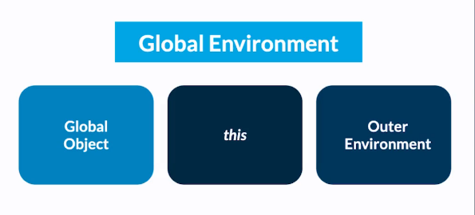

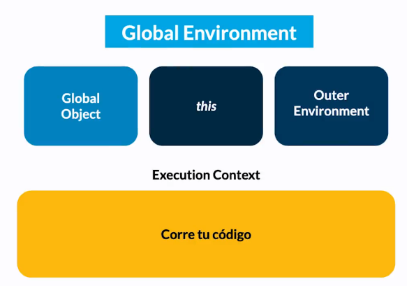

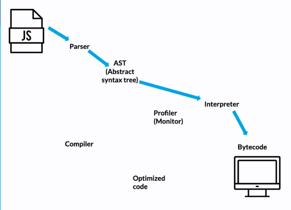

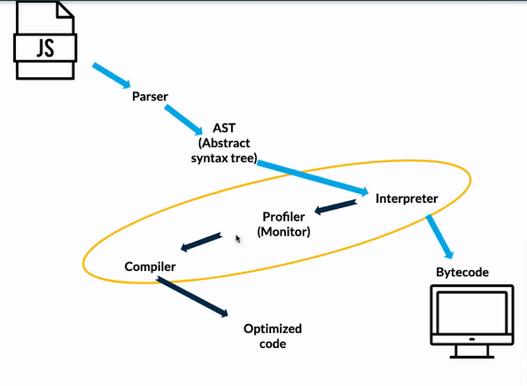

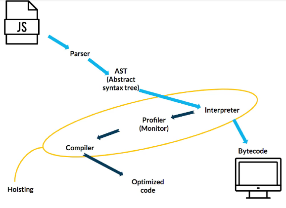

- Si llamamos una variable antes de ser declarada, el compiler crea la variable en la memory heap y la inicializa como undefined
- En el caso de las funciones es distinto, primero mandamos a llamar a las funciones antes de ejecutarlas.
- El hoisting a veces funciona pero no tenemos control de las variables que se van a cambiar
- Si llamamos a una constante (const) antes de inicializar retorna un error de tipo: Uncaught ReferenceError, que corresponde a variables que son referenciadas pero no pudieron ser capturadas


+ :link: [ECMAScript parsing infrastructure for multipurpose analysis](https://esprima.org/)
+ :link: [Hoisting](https://developer.mozilla.org/en-US/docs/Glossary/Hoisting)
+ Parsers y el Abstract Syntax Tree
    * El JS Engine recibe el código fuente y lo procesa de la siguiente manera: 
        - El **parser** descompone y crea tokens que integran el **AST**.
        - Se compila a **bytecode** y se ejecuta.
        - Lo que se pueda se **optimiza a machine code** y se reemplaza el código base.

Un **SyntaxError** es lanzado cuando el motor JavaScript encuentra partes que no forman parte de la sintaxis del lenguaje y esto lo logra gracias a que se tiene un AST generado por el parser.

El _parser_ es del 15% al 20% del proceso de ejecución por lo que hay que usar parser del código justo en el momento que lo necesitamos y no antes de saber si se va a usar o no.

### 6. Ejemplo de Objeto global y hoisting

Hoisting es cuando se tiene que declarar las variables antes de usarlas.

## 3. Código de Ejecución
### 7. Memory Heap

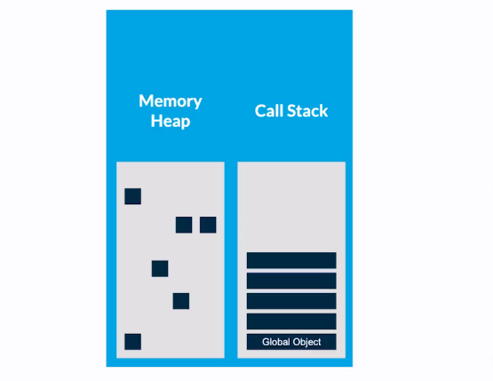
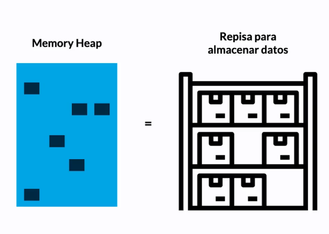

Los objetos en JS (objetos, arrays, funciones y _básicamente todo lo que sea un valor primitivo_ que son _Boolean_, _Null_, _Undefined_, _Number_, _String_, _Symbol_) se almacenan en la parte de memoria que de llama Memory Heap. :link: [JavaScript data types and data structures](https://developer.mozilla.org/en-US/docs/Web/JavaScript/Data_structures)

Los valores primitivos son almacenados en el Call Stack, dentro del Scope (Contexto de Ejecución de la función que tenga acceso a esa variable).

Acceder al Call Stack es mucho más rápido que al Heap. Además, en el Call Stack también se guardan las referencias, “como si fueran valores primitivos”.

Cuando se asigna una variable a otra y esta apunta a un objeto, se copia la referencia, como si fuera un valor primitivo. Si el objeto tiene atributos como un número por ejemplo, este se guarda en la posición de memoria reservada para ese objeto.

Los objetos también pueden tener más objetos dentro. En ese caso, dentro de la posición de memoria de ese objeto se va a guardar una referencia a otra posición de memoria

### 8. Call Stack

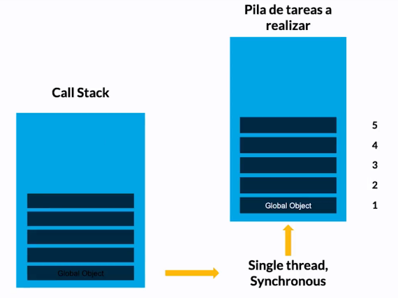

1. Como se mandan a llamar las variables y las funciones
2. Las tareas en el callstack se apilan de abajo hacia arriba.
3. Se llaman de la última que mandamos a llamar hacia abajo
4. En la base de la pila reposa el Global Object
5. Si una función llama a otra, la pone encima de la pila.
6. Se ejecuta una tarea a la vez (sincronía)
7. Una vez que se van ejecutando las tareas se van retirando de la pila
8. Al ejecutar todas las tareas se retira el Global object.

### 9. Garbage Collection

**Garbage Collection**: Limpia la memoria de los datos no utilizados para no sobrecargarla y seguir trabajando sin problemas y se hace de manera automatica en JavaScript

### 10. Stack overflow

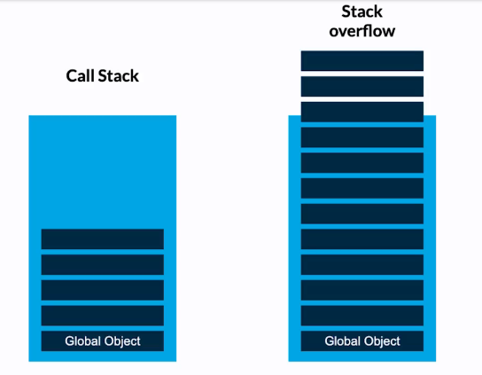

Se tiene el _Call STACK_, la lista de tareas, en su base esta el _GLOBAL OBJECT_.  
Todo el codigo se va agregando en la pila, y el global object, en su base va evacuando uno a uno
puede ocurrir que una funcion desborde de tareas la pila.

A esto se le llama -> stack overflow.

Cuando esto ocurria, el navegador se cerraba; actualmente cuando alguna funcion empieza a llenar la pila el navegador detecta este comportamiento y detiene la funciòn que esta ocacionando esto.

### 11. JavaScript Runtime

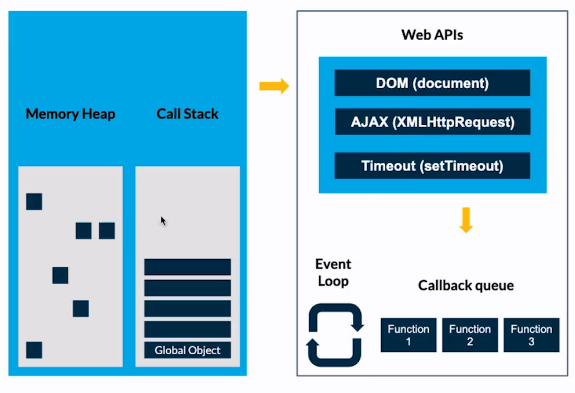

### 12. Asincronía
:link: [Web APIs MDN web docs](https://developer.mozilla.org/en-US/docs/Web/API)

Las promesas y async await resuelven la asincronía de distinta forma. Con las promesas no sabemos cuándo se va a resolver y con async await forzamos una espera en la función. No siempre se va a usar uno, el otro o ambos, por ello lo primero es entender el caso de uso y después empezamos a implementar todo lo que hemos aprendido aquí.

```javascript
console.log('taco 1')
console.log('taco 2')
console.log('taco 3')
setTimeout(()=>{
    console.log('torta 1')
},1000)
console.log('taco 4')
setTimeout(()=>{
    console.log('torta 2')
},500)
setTimeout(()=>{
    console.log('torta 3')
},0)
```

### 13. Recapitulación


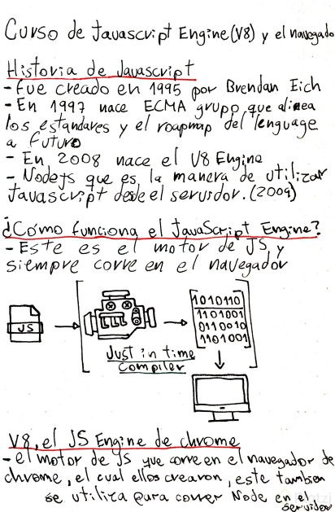
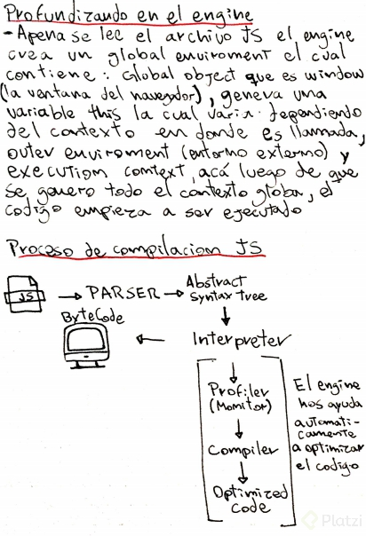
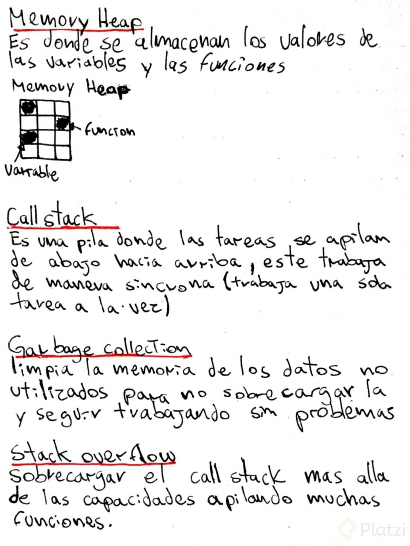
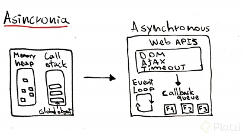


