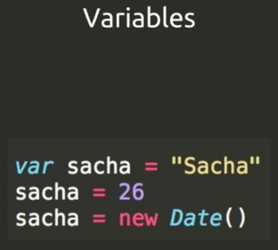
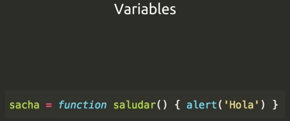
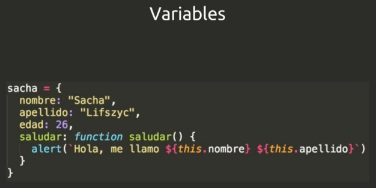
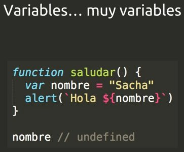
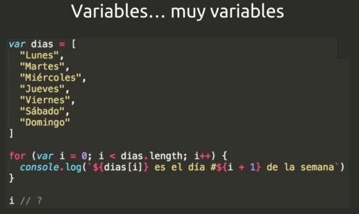
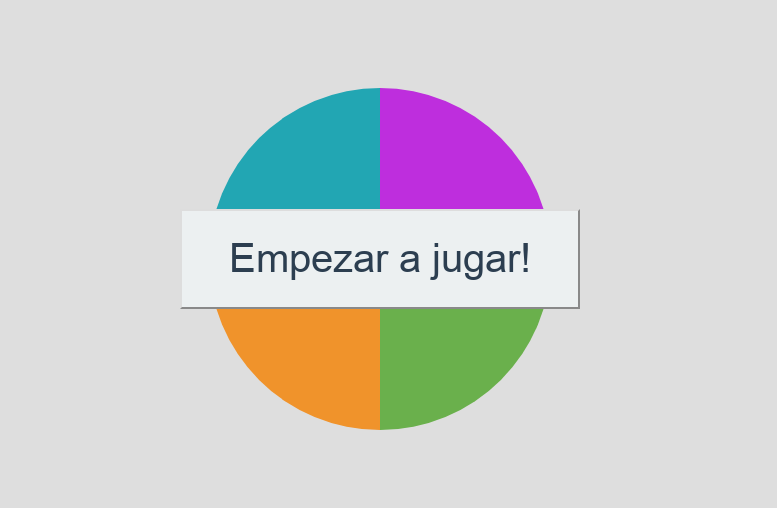

### Links

- :octocat: :link: :school: [Escuela de Js](https://github.com/macknilan/Cuaderno/blob/master/JavaScript/school_js_platzi/school_js_platzi.md)
* :link: [ECMAScript 6 — New Features: Overview & Comparison](http://es6-features.org/#Constants)
* :link: [CMA-262 7ᵗEdition / June 2016 ECMAScript 2016 Language Specification](https://www.ecma-international.org/ecma-262/7.0/index.html)
* :link: [The best front-end hacking cheatsheets — all in one place.](https://medium.freecodecamp.org/modern-frontend-hacking-cheatsheets-df9c2566c72a)
* :link: [ES2015+ cheatsheet A quick overview of new JavaScript features in ES2015, ES2016, ES2017 and beyond](https://devhints.io/es6)
* :link: [JavaScript Cheat Sheet - OverAPI](http://overapi.com/javascript)
* :link: [JavaScript in one page](http://www.cheat-sheets.org/sites/javascript.su/#arrayDescription)
* :link: [JavaScript Regular Expression - Cheatsheet](https://www.debuggex.com/cheatsheet/regex/javascript)
* :link: [JavaScript Event KeysCodes](http://keycode.info/)
* :link: [33 Concepts Every JavaScript Developer Should Know](https://github.com/leonardomso/33-js-concepts)

## Estructura del lenguaje Js









### Los callbacks de JavaScript

Lo primero que se ejecuta es la declaración de las funciones, cuando javascript ejecuta una linea de carga
en una pila de ejecución; javascript solo ejecuta una cosa ala vez, por esto, de debe de tener la pila lo
más limpia posible; sin embargo se puede delegar la ejecución de otras cosas.

**Javascript** cuando ejecuta código lo hace de manera **síncrona**, pero de una manera que tiene que ejecutar
código **asíncrono** es con las funciones llamadas *callbacks*.  Estás se ejecutan y nos debuelben el proceso,
generalmente después de algun evebto de tiempo, al completarse request o al terminar de leer un archivo.


```javascript
console.log("El area de un triangulo de base 5 y altura 7 es: " + 5 * 7 / 2)
console.log(`El area de un triangulo de base 5 y altura 7 es: ${5 *7 / 2}`)
```

### Operador condicional (ternario)
* :link: [Operador condicional (ternario)](https://developer.mozilla.org/es/docs/Web/JavaScript/Referencia/Operadores/Conditional_Operator)

El operador condicional (ternario) es el único operador en JavaScript que tiene tres operandos. Este operador se usa con frecuencia como atajo para la instrucción if.
```javascript
"La Cuota es de:  " + (isMember ? "$2.00" : "$10.00")

var elvisLives = Math.PI > 4 ? "Sip" : "Nop";

var firstCheck = false,
    secondCheck = false,
    access = firstCheck ? "Acceso Denegado" : secondCheck ? "Acceso Denegado" : "Acceso Permitido";
  
console.log( access ); // muestra "Acceso Permitido"
```


## Ejemplo de forEach 
* :link: [forEach](https://developer.mozilla.org/en-US/docs/Web/JavaScript/Reference/Global_Objects/Array/forEach)

```javascript
var array1 = ['a', 'b', 'c'];

array1.forEach(function(element) {
  console.log(element);
});
```
### Ejemplo de forEach
```javascript
const items = ['item1', 'item2', 'item3'];
const copy = [];

items.forEach(function(item){
  copy.push(item)
});
```

```javascript
// CALCULAR LABASE DE UN TRIANGULO
let base = 5
let height = 7
console.log(`El area de un triangulo de base ${base} y ${height}  es: ${base * height / 2}`)
```

```javascript
// CALCULAR LABASE DE UN TRIANGULO
    let base = 5
    let height = 7
    function triangleArea(base, height)
        return base * height / 2
    }

    console.log(`El area de un triangulo de base ${base} y ${height}  es: ${triangleArea(base, height)}`)
```


```javascript
// CALCULAR LABASE DE UN TRIANGULO
let base = 5
let height = 7
let triangleArea = (base, height) => base * height / 2


console.log(`El area de un triangulo de base ${base} y ${height}  es: ${triangleArea(base, height)}`)
```


```javascript
// CALCULAR LABASE DE UN TRIANGULO
let base = 5
let height = 7
const triangleArea = (base, height) => { //ARROW FUNTIONS
    //COMENTARIO
    return base * height / 2
}

console.log(`El area de un triangulo de base ${base} y ${height}  es: ${triangleArea(base, height)}`)
```


```javascript
// RESTRICCION POR EDAD
const startWars7 = 'Start Wars: El despertar de la fuerza'
const pgStartWars7 = 13

const nameSacha = 'Sacha'
const ageSacha = 26

const nameSantiago = 'Santiago'
const ageSantiago = 12

function canWatchStartWars7(name, age, isWhitAdult = false){
    if (age >= pgStartWars7 ){
        alert(`${name} puede pasar a ver ${startWars7} `)
    } else if (isWhitAdult) {
        alert(` ${name} puede pasar a ver ${startWars7}.
         Aunque su edad es ${age}, se cuentra acompañad@ por un adulto `)
    } else {
        alert(` ${name} no puede pasar a ver ${startWars7}.
        tiene ${age} años y necesita tener ${pgStartWars7} `)
    }
}

canWatchStartWars7(nameSacha, ageSacha)
canWatchStartWars7(nameSantiago, ageSantiago, true)
```

```javascript
// RESTRICCION POR EDAD
const startWars7 = 'Start Wars: El despertar de la fuerza',
    pgStartWars7 = 13,
    nameSacha = 'Sacha',
    ageSacha = 26,
    nameSantiago = 'Santiago';
let ageSantiago = 12

const canWatchStartWars7 = (name, age, isWhitAdult = false) => {
    if (age >= pgStartWars7 ){
        alert(`${name} puede pasar a ver ${startWars7} `)
    } else if (isWhitAdult) {
        alert(` ${name} puede pasar a ver ${startWars7}.
         Aunque su edad es ${age}, se cuentra acompañad@ por un adulto `)
    } else {
        alert(` ${name} no puede pasar a ver ${startWars7}.
        tiene ${age} años y necesita tener ${pgStartWars7} `)
    }
}

canWatchStartWars7(nameSacha, ageSacha)
canWatchStartWars7(nameSantiago, ageSantiago, true)
```


```javascript
// MANEJO DE STRINGS
function platzom(str) {
    let translation = str

    //SI LA PALABRA ORIGINAL ES UN PALINDROMO
    //NINGUNA ANTERIOR CUENTA Y SE DEVUELBE LA MISMA PALABRA
    //INTERCALANDO MAYUSCULAS Y MINUSCULAS
    const reverse = (str) => str.split('').reverse().join('')

    function minMay(str){
        const length = str.length
        let translation = ''
        let capitalize = true
        for (let i = 0; i < length; i++) {
            const char = str.charAt(i)
            translation += capitalize ? char.toUpperCase() : char.toLowerCase()
            capitalize = !capitalize
        }
        return translation
    }

    if (str == reverse(str)) {
        return minMay(str)
    }

    // SI LA PALABRA TERMINA CON ar SE LE ELIMINAN 
    if (str.toLowerCase().endsWith('ar')) { //1ro CONVIERTE A MINUSCULAS, DESPUES VERIFICA QUE TERMINE CON ar
        translation = str.slice(0, -2) //SE LE QUITA LAS LETRAS ar
    }
    
    // SI LA PALABRA INICIA CON Z SE LE AÑADE AL FINAL 'pe'
    if (str.toLowerCase().startsWith('z')) {
        translation += 'pe'
    }
    
    // SI LA PALABRA TRADUCIDA TIENE MAS DE 10 LETRAS SE PARTE A LA MITAD Y SE UNE CON
    // UN GUION
    const length = translation.length
    if ( length >= 10) {
        const firtsHalf = translation.slice(0, Math.round(length / 2))
        const secondHalf = translation.slice(Math.round(length / 2))
        translation = `${firtsHalf}-${secondHalf}`
    }

    return translation
}
console.log(platzom("Programar")) // Program
console.log(platzom("Zorro")) // Zorrope
console.log(platzom("Zarpar")) // Zarpe
console.log(platzom("abecedario")) //abece-dario
console.log(platzom("sometemos")) //SoMeTeMoS
```

```javascript
// PROMEDIO CORRIDO POR SEMANA
// Math.floor(3.9) //rendondea hacia abajo 3.9 = 3
// Math.ceil(3.1) //redondea para arriba 3.1 = 4
// Math.round(3.5) // redondea dependiendo 3.1 = 3, 3.5 = 4
// Math.trunc(3.6) //rendondea hacia abajo 3.6 = 3

const nombre = 'rodolfo'
const dias = [
    'lunes',
    'martes',
    'miercoles',
    'jueeves',
    'viernes',
    'sabado',
    'domingo',
]

function correr(){
    const min = 5
    const max = 15
    return Math.round(Math.random() * (max - min)) + min
}

let totalKms = 0
for (let i = 0; i < dias.length; i++) {
    const kms = correr()
    totalKms += kms
    console.log(`El día ${dias[i]} ${nombre} corrio  ${kms} kms `)
}

const promedioKms = totalKms/dias.length
console.log(` En promedio ${nombre} corrio ${promedioKms.toFixed(2)} kms `)
```

```javascript
//CALCULAR GOLPES ENTRE GOKU SV SUPERMAN Y CALCULAR QUIEN GANA
let vidaGoku = 100;
let vidaSuperman = 100;

const min_power = 5;
const max_power = 12;

const ambosSiguenVivos = () => vidaGoku > 0 && vidaSuperman > 0;
const calcularGolpe = () => Math.round(Math.random() * (max_power - min_power) + min_power);
const gokuSigueVivo = () => vidaGoku > 0

let round = 0;

while(ambosSiguenVivos())
{
  round++
  console.log(`Round: ${round}`)

  const golpeGoku = calcularGolpe();
  const golpeSuperman = calcularGolpe();

  if (golpeGoku > golpeSuperman)
  {
    console.log(`Goku ataca a Superman con un golpe de ${golpeGoku}`);
    vidaSuperman -= golpeGoku;
    console.log(`Superman queda en ${vidaSuperman} puntos de vida`);
  }
  else
  {
    console.log(`Superman ataca a Goku con un golpe de ${golpeSuperman}`);
    vidaGoku -= golpeSuperman;
    console.log(`Goku queda en ${vidaGoku} puntos de vida`);
  }
}

if(gokuSigueVivo())
    {
        console.log(`Goku gano la pelea. su vida es de: ${vidaGoku}`);
    } else {
        console.log(`Superman gano la pelea. su vida es de: ${vidaSuperman}`);
    }

```

```javascript
// CALCULAR LA FECHA DE NACIMIENTO
> const nacimiento = new Date(1979, 10, 16)
> nacimiento
< Fri Nov 16 1979 00:00:00 GMT-0600 (CST)
> const hoy = new Date()
> hoy
< Sat Feb 10 2018 14:55:32 GMT-0600 (CST)
> const tiempo = hoy -nacimiento
> tiempo
< 1206716132069
> const tiempoSegundos = tiempo/1000
> tiempoSegundos
< 1206716132.069
> const tiempoMin = tiempoSegundos/60
> tiempoMin
< 20111935.534483332
> const tiempoHoras = tiempoMin/60
> tiempoHoras
< 335198.9255747222
> const proximo = new Date(hoy.getFullYear(),nacimiento.getMonth(),nacimiento.getDate())
> proximo
< Fri Nov 16 2018 00:00:00 GMT-0600 (CST)
> const diasSemana1 = [
    "Domingo",
    "Lunes",
    "Martes",
    "Miercoles",
    "Jueves",
    "Viernes",
    "Sabado",
 ]
> console.log(diasSemana1[proximo.getDay()])
  Viernes
```
```javascript
// CALCULAR LA FECHA DE NACIMIENTO
let hoy = new Date();
let diasSemana = ['Lunes','Martes','Miercoles','Jueves','Viernes','Sabado','Domingo']
const MESES = ['','Enero','Febrero','Marzo','Abril','Mayo','Junio','Julio','Agosto','Septiembre','Octubre','Noviembre', 'Diciembre',]

console.log(`Operacion realizada el dia ${hoy.getDate()} de 
            ${MESES[hoy.getMonth()]} de ${hoy.getFullYear()}`);

// Operacion realizada el dia 11 de Enero de 2018

const nacimiento = new Date(1979, 11, 16);

console.log(`Fecha de nacimiento: Dia ${nacimiento.getDate()} 
            del mes ${MESES[nacimiento.getMonth()]} del año ${nacimiento.getFullYear()}`);

// Fecha de nacimiento: Dia 16 del mes Noviembre del año 1979

const tiempo = hoy.getTime() - nacimiento.getTime();
console.log(`Tiempo ->: ${tiempo}`);

const tiempoDias = tiempo/1000/60/60/24;
console.log(`Tiempo en dias -> ${tiempoDias} `);

const tiempoAnos = Math.floor(tiempoDias/365);
console.log(`tiempoAnos -> ${tiempoAnos}`);

const tiempoMeses = Math.floor((tiempoDias - (tiempoAnos * 365)) /31);
console.log(`tiempoMeses -> ${tiempoMeses}`);

const dias = Math.floor(tiempoDias - (tiempoAnos * 365) - (tiempoMeses * 31));
console.log(`dias -> ${dias}`);

console.log(`Han pasado ${tiempoDias} años ${tiempoMeses} meses dias ${dias} desde mi nacimiento`)
// Han pasado 13937.549797256945 años 2 meses dias 5 desde mi nacimiento

```
### Prototipos

```javascript
//EJEMPLO #1
function Persona(nombre, apellido) { // --> PROTOTIPO
    this.nombre = nombre
    this.apellido = apellido
}

Persona.prototype.saludar = function () { // --> ATRIBUTO SALUDAR
    console.log(`Hola, me llamo ${this.nombre} ${this.apellido}`)
}

var sacha = new Persona('Sacha', 'Lifszyc')
sacha.saludar();
var erika = new Persona('Erika', 'Luna')
erika.saludar();
var arturo = new Persona('Arturo', 'Martinez')
```

```javascript
//EJEMPLO #1.1
function Persona(nombre, apellido, altura) {
  this.nombre = nombre
  this.apellido = apellido
  this.altura = altura
}

Persona.prototype.saludar = function () {
  console.log(`Hola, me llamo ${this.nombre} ${this.apellido}`)
}

Persona.prototype.soyAlto = function () {
  return this.altura > 1.8
}

var sacha = new Persona('Sacha', 'Lifszyc', 1.72)
sacha.soyAlto();
var erika = new Persona('Erika', 'Luna', 1.65)
erik.soyAlto();
var arturo = new Persona('Arturo', 'Martinez', 1.89)
arturo.soyAlto();
```

### Prototipos a Clases con "Herencia de clases"

```javascript
//EJEMPLO #1.2 AHORA EN "CLASES"

class Persona {
  constructor(nombre, apellido, altura) {
    this.nombre = nombre
    this.apellido = apellido
    this.altura = altura
  }

  saludar() {
    console.log(`Hola, me llamo ${this.nombre} ${this.apellido}`)
  }

  soyAlto() {
    return this.altura > 1.8
  }
}

class Desarrollador extends Persona {
  constructor(nombre, apellido, altura) {
    super(nombre, apellido, altura)
  }

  saludar() {
    console.log(`Hola, me llamo ${this.nombre} ${this.apellido} y soy desarrollador/a`)
  }
}

var erika = new Persona('Erika', 'Luna', 1.65)
erika.saludar()
var arturo = new Desarrollador('Arturo', 'Martinez', 1.89)
arturo.saludar()
```

### Clases con "Herencia de clases"
#### Pasar funciones como parametros
```javascript
class Persona {
  constructor(nombre, apellido, altura) {
    this.nombre = nombre
    this.apellido = apellido
    this.altura = altura
  }

  saludar(fn) {
    var { nombre, apellido } = this

    console.log(`Hola, me llamo ${nombre} ${apellido}`)
    if (fn) {
      fn(nombre, apellido)
    }
  }

  soyAlto() {
    return this.altura > 1.8
  }
}

class Desarrollador extends Persona {
  constructor(nombre, apellido, altura) {
    super(nombre, apellido, altura)
  }

  saludar(fn) {
    // var nombre = this.nombre
    // var apellido = this.apellido
    var { nombre, apellido } = this

    console.log(`Hola, me llamo ${nombre} ${apellido} y soy desarrollador/a`)
    if (fn) {
      fn(nombre, apellido, true)
    }
  }
}

function responderSaludo(nombre, apellido, esDev) {
  console.log(`Buen día ${nombre} ${apellido}`)
  if (esDev) {
    console.log(`Ah mirá, no sabía que eras desarrollador/a`)
  }
}

var sacha = new Persona('Sacha', 'Lifszyc', 1.72)
var erika = new Persona('Erika', 'Luna', 1.65)
var arturo = new Desarrollador('Arturo', 'Martinez', 1.89)

sacha.saludar()
erika.saludar(responderSaludo)
arturo.saludar(responderSaludo)
```

### CallBacks
```javascript
const API_URL = 'https://swapi.co/api/'
const PEOPLE_URL = 'people/:id'

const lukeUrl = `${API_URL}${PEOPLE_URL.replace(':id', 1)}`
const opts = { crossDomain: true }

const onPeopleResponse = function (persona) {
  console.log(`Hola yo soy, ${persona.name}`)
}

$.get(lukeUrl, opts, onPeopleResponse)
```
### Promesas

#### SINTAXIS
```javascript
new Promise( ( resolve, reject ) => {
  // LLAMADO ASÍNCRONO
  if( todoOK ) {
     // SE EJECUTÓ EL LLAMADO EXITOSAMENTE
     resolve()
  } else {
     // HUBO UN ERROR EN EL LLAMADO
     reject()
  }
})
```

```javascript
const API_URL = 'https://swapi.co/api/'
const PEOPLE_URL = 'people/:id'
const opts = { crossDomain: true }

function obtenerPersonaje(id) {
  return new Promise((resolve, reject) => {
    const url = `${API_URL}${PEOPLE_URL.replace(':id', id)}`
    $
      .get(url, opts, function (data) {
        resolve(data)
      })
      .fail(() => reject(id))
  })
}

function onError(id) {
  console.log(`Sucedió un error al obtener el personaje ${id}`)
}

obtenerPersonaje(1)
  .then(function (personaje) {
    console.log(`El personaje 1 es ${personaje.name}`)
  })
  .catch(onError)
```

###  MÚLTIPLES PROMESAS EN PARALELO
```javascript
const API_URL = 'https://swapi.co/api/'
const PEOPLE_URL = 'people/:id'
const opts = { crossDomain: true }

function obtenerPersonaje(id) {
  return new Promise((resolve, reject) => {
    const url = `${API_URL}${PEOPLE_URL.replace(':id', id)}`
    $
      .get(url, opts, function (data) {
        resolve(data)
      })
      .fail(() => reject(id))
  })
}

function onError(id) {
  console.log(`Sucedió un error al obtener el personaje ${id}`)
}

var ids = [1, 2, 3, 4, 5, 6, 7]
// var promesas = ids.map(function (id) {
//   return obtenerPersonaje(id)
// })
var promesas = ids.map(id => obtenerPersonaje(id))
Promise
  .all(promesas)
  .then(personajes => console.log(personajes))
  .catch(onError)
```

### ASYNC-AWAIT: LO ÚLTIMO EN ASINCRONISMO
```javascript
const API_URL = 'https://swapi.co/api/'
const PEOPLE_URL = 'people/:id'
const opts = { crossDomain: true }

function obtenerPersonaje(id) {
  return new Promise((resolve, reject) => {
    const url = `${API_URL}${PEOPLE_URL.replace(':id', id)}`
    $
      .get(url, opts, function (data) {
        resolve(data)
      })
      .fail(() => reject(id))
  })
}

function onError(id) {
  console.log(`Sucedió un error al obtener el personaje ${id}`)
}

async function obtenerPersonajes() {
  var ids = [1, 2, 3, 4, 5, 6, 7]
  var promesas = ids.map(id => obtenerPersonaje(id))
  try {
    var personajes = await Promise.all(promesas)
    console.log(personajes)
  } catch (id) {
    onError(id)
  }
}

obtenerPersonajes()
```

### RECURSIVIDAD Ejemplo 01
```javascript
<!DOCTYPE html>
<html lang="en" dir="ltr">

    <head>
        <meta charset="utf-8">
        <title>Clase 38 - Recursividad</title>
    </head>

    <body>
        <script>
        /*
              13  |_4___
              13 - 4 = 9      1
              9 - 4 = 5       1
              5 - 4 = 1       1
              1 - 4 = -3      0
            */
        function divisionEntera(dividendo, divisor) {
            if (dividendo < divisor) {
                return 0
            }
            return 1 + divisionEntera(dividendo - divisor, divisor)
        }
        </script>
    </body>

</html>
```


### RECURSIVIDAD Ejemplo 02
```javascript
let contadorRec = 1
function fibonacciRecursivo(num) {
  contadorRec++
  if (num == 1) return 0
  if (num == 2) return 1

  return fibonacciRecursivo(num - 1) +
      fibonacciRecursivo(num - 2)
}
```
### RECURSIVIDAD & MEMORIZACIÓN Ejemplo 01
```javascript
<!DOCTYPE html>
<html lang="en" dir="ltr">

<head>
    <meta charset="utf-8">
    <title>Clase 39 - Memoización</title>
</head>

<body>
    <script>
    /*
        !6 = 6 * 5 * 4 * 3 * 2 * 1 = 720
        !12 = 12 * 11 * 10 * 9 * 8 * 7 * !6
      */
    function factorial(n) {
        if (!this.cache) {
            this.cache = {}
        }
        debugger
        if (this.cache[n]) {
            return this.cache[n]
        }
        if (n === 1) {
            return 1
        }
        this.cache[n] = n * factorial(n - 1)
        debugger
        return this.cache[n]
    }
    </script>
</body>

</html>
```


### RECURSIVIDAD & MEMORIZACIÓN Ejemplo 02
```javascript
let contadorMemo = 1
function fibonacciMemo(num, memoria = {}) {
    contadorMemo++
    if (memoria[num]) return memoria[num]
    if (num == 1) return 0
    if (num == 2) return 1

    console.log(memoria)
    return memoria[num] = fibonacciMemo(num - 1, memoria) + fibonacciMemo(num - 2, memoria)
}
```

### Iteradores en Javascript
```javascript
// EJEMPLO No.1
function fibonacci() {
    let a = 0, b = 1
    return {
        next: function () {
            let f = a
            a = b
            b = f + a
            return {value: f, done: false}
        }
    }
}

const fibo = fibonacci()

// fibo.next() // 0
// fibo.next() // 1
// fibo.next() // 1
// fibo.next() // 2
// fibo.next() // 3
// fibo.next() // 5
// fibo.next() // 8

// a = 0
// b = 1

// a   b       f
// 0   1       0
// 1   0+1     1
// 1   2       1
// 2   1+2     2
// 3   2+3     3
// 5   3+5     5
// 8   5+8     8
// 13  8+13    13
```
### Iteradores en Javascript
```javascript
// EJEMPLO No. 2
function fibonacci() {
    let a = 0, b = 1
    return {
        next: function () {
            let f = a
            a = b
            b = f + a
            return {value: f, done: false}
        }
    }
}

const fibo = {}
fibo[Symbol.iterator] = fibonacci

let i = 1
for (let value of fibo) {
    console.log(value)
    i++
    if (i > 20) break
}
```

### Generadores en Javascript
* :link: [Generadores en Javascript](https://developer.mozilla.org/en-US/docs/Web/JavaScript/Reference/Statements/function*)
```javascript
//EJEMPLO No. 1
function* fibonacci () {
    let a = 0, b = 1
    while(true) {
        let f = a
        a = b
        b = f + a
        yield f
    }
}

    
const fibo = fibonacci()
fibo.next()
// {value: 0, done: false}
// {value: 1, done: false}
// {value: 1, done: false}
// {value: 2, done: false}
// {value: 3, done: false}
// {value: 5, done: false}
```

### Generadores en Javascript
```javascript
//EJEMPLO No. 2
function* fibonacci () {
    let a = 0, b = 1
    while(true) {
        let f = a
        a = b
        b = f + a
        let reset = yield f
        if (reset) a =0, b = 1
    }
}

const fibo = fibonacci()
fibo.next()
// {value: 0, done: false}
// {value: 1, done: false}
// {value: 1, done: false}
// {value: 2, done: false}
// {value: 3, done: false}
// {value: 5, done: false}
// 
// fibo.next(true)
// {value: 0, done: false}
// {value: 1, done: false}
// {value: 1, done: false}
// {value: 2, done: false}
// {value: 3, done: false}
// {value: 5, done: false}
```

## JUEGO EN HTML & JAVASCRIPT (Simon says)

```javascript
<!DOCTYPE html>
<html>

<head>
    <meta charset="utf-8">
    <title>Simon Dice</title>
    <style>
    body {
        margin: 0;
        background: #dedede;
        display: flex;
        align-items: center;
        height: 100vh;
    }

    .gameboard {
        height: 100vh;
        width: 100vh;
        border-radius: 50%;
        overflow: hidden;
        margin: 0 auto;
        max-height: 60vh;
        max-width: 60vh;
    }

    .color {
        width: 50%;
        height: 50%;
        display: inline-block;
    }

    .left {
        float: left;
    }

    .right {
        float: left;
    }

    .celeste {
        background: #22a6b3;
    }

    .celeste.light {
        background: #7ed6df;
    }

    .violeta {
        background: #be2edd;
    }

    .violeta.light {
        background: #e056fd;
    }

    .naranja {
        background: #f0932b;
    }

    .naranja.light {
        background: #ffbe76;
    }

    .verde {
        background: #6ab04c;
    }

    .verde.light {
        background: #badc58;
    }

    .btn-start {
        width: 400px;
        height: 100px;
        background: #ecf0f1;
        color: #2c3e50;
        font-size: 2.5rem;
        position: absolute;
        top: calc(50% - 50px);
        left: calc(50% - 200px);
    }

    .hide {
        display: none;
    }

    * {
        font-family: 'Arial';
    }
    </style>
</head>

<body>
    <div class="gameboard">
        <div id="celeste" class="color celeste left" data-color="celeste"></div>
        <div id="violeta" class="color violeta right" data-color="violeta"></div>
        <div id="naranja" class="color naranja left" data-color="naranja"></div>
        <div id="verde" class="color verde right" data-color="verde"></div>
        <button id="btnEmpezar" class="btn-start" onclick="empezarJuego()">Empezar a jugar!</button>
    </div>
    <script src="https://cdnjs.cloudflare.com/ajax/libs/sweetalert/2.1.0/sweetalert.min.js"></script>
    <script>
    const celeste = document.getElementById('celeste')
    const violeta = document.getElementById('violeta')
    const naranja = document.getElementById('naranja')
    const verde = document.getElementById('verde')
    const btnEmpezar = document.getElementById('btnEmpezar')
    const ULTIMO_NIVEL = 10
    class Juego {
        constructor() {
            this.inicializar = this.inicializar.bind(this)
            this.inicializar()
            this.generarSecuencia()
            setTimeout(this.siguienteNivel, 500)
        }
        inicializar() {
            this.siguienteNivel = this.siguienteNivel.bind(this)
            this.elegirColor = this.elegirColor.bind(this)
            this.toggleBtnEmpezar()
            this.nivel = 1
            this.colores = {
                celeste,
                violeta,
                naranja,
                verde
            }
        }
        toggleBtnEmpezar() {
            if (btnEmpezar.classList.contains('hide')) {
                btnEmpezar.classList.remove('hide')
            } else {
                btnEmpezar.classList.add('hide')
            }
        }
        generarSecuencia() {
            this.secuencia = new Array(ULTIMO_NIVEL).fill(0).map(n => Math.floor(Math.random() * 4))
        }
        siguienteNivel() {
            this.subnivel = 0
            this.iluminarSecuencia()
            this.agregarEventosClick()
        }
        transformarNumeroAColor(numero) {
            switch (numero) {
                case 0:
                    return 'celeste'
                case 1:
                    return 'violeta'
                case 2:
                    return 'naranja'
                case 3:
                    return 'verde'
            }
        }
        transformarColorANumero(color) {
            switch (color) {
                case 'celeste':
                    return 0
                case 'violeta':
                    return 1
                case 'naranja':
                    return 2
                case 'verde':
                    return 3
            }
        }
        iluminarSecuencia() {
            for (let i = 0; i < this.nivel; i++) {
                const color = this.transformarNumeroAColor(this.secuencia[i])
                setTimeout(() => this.iluminarColor(color), 1000 * i)
            }
        }
        iluminarColor(color) {
            this.colores[color].classList.add('light')
            setTimeout(() => this.apagarColor(color), 350)
        }
        apagarColor(color) {
            this.colores[color].classList.remove('light')
        }
        agregarEventosClick() {
            this.colores.celeste.addEventListener('click', this.elegirColor)
            this.colores.verde.addEventListener('click', this.elegirColor)
            this.colores.violeta.addEventListener('click', this.elegirColor)
            this.colores.naranja.addEventListener('click', this.elegirColor)
        }
        eliminarEventosClick() {
            this.colores.celeste.removeEventListener('click', this.elegirColor)
            this.colores.verde.removeEventListener('click', this.elegirColor)
            this.colores.violeta.removeEventListener('click', this.elegirColor)
            this.colores.naranja.removeEventListener('click', this.elegirColor)
        }
        elegirColor(ev) {
            const nombreColor = ev.target.dataset.color
            const numeroColor = this.transformarColorANumero(nombreColor)
            this.iluminarColor(nombreColor)
            if (numeroColor === this.secuencia[this.subnivel]) {
                this.subnivel++
                if (this.subnivel === this.nivel) {
                    this.nivel++
                    this.eliminarEventosClick()
                    if (this.nivel === (ULTIMO_NIVEL + 1)) {
                        this.ganoElJuego()
                    } else {
                        setTimeout(this.siguienteNivel, 1500)
                    }
                }
            } else {
                this.perdioElJuego()
            }
        }
        ganoElJuego() {
            swal('Platzi', 'Felicitaciones, ganaste el juego!', 'success')
                .then(this.inicializar)
        }
        perdioElJuego() {
            swal('Platzi', 'Lo lamentamos, perdiste :(', 'error')
                .then(() => {
                    this.eliminarEventosClick()
                    this.inicializar()
                })
        }
    }

    function empezarJuego() {
        window.juego = new Juego()
    }
    </script>
</body>

</html>
```
## Estructura de datos inmutables
```javascript
const nombrePersona = {
    nombre: 'Pepito',
    apellido: 'Perez',
    edad: 28
}
// const cumpleanos = persona => persona.edad++
const cumpleanosInmutable = persona => ({
    ...persona,
    edad: persona.edad + 1
})

// nombrePersona
// {nombre: "Pepito", apellido: "Perez", edad: 28}
// cumpleanosInmutable(nombrePersona)
// {nombre: "Pepito", apellido: "Perez", edad: 29}
// nombrePersona
// {nombre: "Pepito", apellido: "Perez", edad: 28}
// cumpleanosInmutable(nombrePersona)
// {nombre: "Pepito", apellido: "Perez", edad: 29}
```

### Cambiando de contexto al llamar a una función
El contexto (o alcance) de una función es por lo general, window. Así que en ciertos casos, cuando intentamos referirnos a this en alguna parte del código, es posible que tengamos un comportamiento inesperado, porque el contexto quizás no sea el que esperamos.

Existen al menos tres maneras de cambiar el contexto de una función.

- Usando el método .bind, enviamos la referencia a la función sin ejecutarla, pasando el contexto como parámetro.
- Usando el método .call, ejecutamos inmediatamente la función con el contexto indicado
- Usando el método .apply, es similar a .call pero los parámetros adicionales se pasan como un arreglo de valores
```javascript
const Pepito = {
    nombre: 'Pepito',
    apellido: 'Perez'
}
const Juana = {
    nombre: 'Juana',
    apellido: 'Martinez'
}

function saludar(saludo = 'Hola') {
    console.log(`${saludo}, mi nombre es ${this.nombre}`)
}
// const saludarAPepito = saludar.bind(Pepito)
// Hola, mi nombre es Pepito
// const saludarAJuana = saludar.bind(Juana)
// Hola, mi nombre es Juana
//
// setTimeout(saludar.bind(Pepito, 'Hola pe'), 1000)
// Hola pe, mi nombre es Pepito
// saludar.call(Pepito, 'Hola pe')
// Hola pe, mi nombre es Pepito
saludar.apply(Pepito, ['Hola pe'])
// Hola pe, mi nombre es Pepito
```


### CLASES ejempllo de -DISTANCIA ENTRE DOS PUNTOS-
```javascript
// DISTANCIA ENTRE DOS PUNTOS
const p1 = {
    x: 0,
    y: 4
}

const p2 = {
    x: 3,
    y: 0
}

function distancia(p1, p2){
    const x = p1.x - p2.x
    const y = p1.y - p2.y
    
    return Math.sqrt(x * x + y * y)
}

console.log(distancia(p1,p2))
// console.log(distancia(p1,x: 20, y: -7))

```

```javascript
// DISTANCIA ENTRE DOS PUNTOS

const p1 = {
    x: 0,
    y: 4,
    moverEnX(x){ // HACE LA MISMA FUNCION QUE PARA P2
        this.x += x
    },
    moverEnX(y){ // HACE LA MISMA FUNCION QUE PARA P2
        this.y += y
    }
}

const p2 = {
    x: 3,
    y: 0,
    moverEnX: function (x) { this.x += x }, // SE HACE REFERENCIA AL VALOR DE x QUE VALE 3
    moverEnY: function (y) { this.y += y }, // SE HACE REFERENCIA AL VALOR DE Y QUE VALE 0
}

function distancia(p1, p2){
    const x = p1.x - p2.x
    const y = p1.y - p2.y
    
    return Math.sqrt(x * x + y * y).toFixed(2)
}
// PARA MOVER CUALQUIERA DE LOS PUNTOS -> `p2.moverEnX(3)`
console.log(distancia(p1,p2))
```

```javascript
// DEFINIR LA CLASE/PROTOTIPO "Punto"


const p1 = new Punto(0, 4) // SE CREA UN NUEVO OBJETO
const p2 = new Punto(3, 0) // SE CREA UN NUEVO OBJETO

console.log(p1.distancia(p2))
console.log(p2.distancia(p1))
p1.moverEnX(10)
console.log(p1.distancia(p2))
p2.moverEnY(-4)
console.log(p1.distancia(p2))
```

```javascript
// DEFINIR LA CLASE/PROTOTIPO "Punto" - Object.create
const Punto = {
    init: function(x, y){
        this.x = x
        this.y = y

    },
    moverEnX: function moverEnX(x){
        this.x += x
    },
    moverEnY: function moverEnY(y){
        this.y += y
    },
    distancia: function distancia(p){
        const x = this.x - p.x
        const y = this.y - p.y

        return Math.sqrt(x * x + y * y).toFixed(2)
    }

}

const p1 = Object.create(Punto)
const p2 = Object.create(Punto)
p1.init(0, 4)
p2.init(3, 0)

console.log(p1.distancia(p2))
console.log(p2.distancia(p1))
p1.moverEnX(10)
console.log(p1.distancia(p2))
p2.moverEnY(-4)
console.log(p1.distancia(p2))
```

```javascript
// DEFINIR LA CLASE/PROTOTIPO "Punto" - Class de Javascript
class Punto{ // SE CREA UN NUEVO OBJETO DE TIPO PUNTO
    constructor(x, y){ // DICE QUE ES CLASE PERO FUNCIONA COMO PROTOTIPO
        this.x = x
        this.y = y
    }

    moverEnX (x) { // METODOS NO ES NECESARIO EL KEYWORD "function"
        this.x += x
    }

    moverEnY (y) {
        this.y += y
    }

    distancia(p) {
        const x = this.x - p.x
        const y = this.y - p.y

        return Math.sqrt(x * x + y * y).toFixed(2)
    }
}

const p1 = new Punto(0, 4) // SE CREA UN NUEVO OBJETO
const p2 = new Punto(3, 0) // SE CREA UN NUEVO OBJETO

console.log(p1.distancia(p2))
console.log(p2.distancia(p1))
p1.moverEnX(10)
console.log(p1.distancia(p2))
p2.moverEnY(-4)
console.log(p1.distancia(p2))
```

```javascript
var nombre = "Sacha"

function saludar10() {
  var nombre
  if (true) {
     nombre = "Eric"
  }
  
  console.log(`Hola ${nombre}`)
}

saludar("Sacha")
console.log(`La variable nombre tiene el valor ${nombre}`)

function saludarASacha10() {
  const nombre = "Sacha"

  for (let i = 0; i < 10; i++) {
    console.log(`Hola ${nombre}`)
  }
}

saludarASacha10()
```
### Ejemplo Operador Spread (...)
* :link: [Spread syntax](https://developer.mozilla.org/en-US/docs/Web/JavaScript/Reference/Operators/Spread_syntax)

```javascript
var mackObj = {
    nombre:   'Mack',
    apellido: 'Nilan',
    edad: 30
}

function cumpleanos(persona){
    return{
        ...persona,
        edad: persona.edad + 1,
        mensaje: "Feliz cumple!"
    }
}
// cumpleanos(mackObj)
// {nombre: "Mack", apellido: "Nilan", edad: 31, mensaje: "Feliz cumple!"}
```

```javascript
var a, b, c, d, e;
a = [1,2,3];
b = "dog";
c = [42, "cat"];
  
// Using the concat method.
d = a.concat(b, c);
  
// Using the spread operator.
e = [...a, b, ...c];
  
console.log(d);
console.log(e);
  
// Output:  
// 1, 2, 3, "dog", 42, "cat"  
// 1, 2, 3, "dog", 42, "cat" 


```


```javascript
// OPERACIONES CON METODOS DE ARRAYS

function suma(...numeros) {
  return numeros.reduce(function (acum, numero) {
    acum += numero
    return acum
  }, 0) // <- ES EL VALOR INICIAL DEL ACOMULADOR
}

const dobles = (...numeros) => numeros.map(numero => numero * 2)

const pares = (...numeros) => numeros.filter(numero => numero % 2 == 0)

```
* :link: - [reduce](https://developer.mozilla.org/es/docs/Web/JavaScript/Referencia/Objetos_globales/Array/reduce)
* :link: - [push](https://developer.mozilla.org/es/docs/Web/JavaScript/Referencia/Objetos_globales/Array/push)
* :link: - [filter](https://developer.mozilla.org/es/docs/Web/JavaScript/Referencia/Objetos_globales/Array/filter)
* :link: - [map](https://developer.mozilla.org/en-US/docs/Web/JavaScript/Reference/Global_Objects/Array/map)
* :link: - [sort](https://developer.mozilla.org/en-US/docs/Web/JavaScript/Reference/Global_Objects/Array/sort)

### Ejemplo de reduce

```javascript
var alan = {
    nombre: 'Alan',
    apellido: 'Perez',
    altura: 1.86,
    cantidadDeLibros: 78
}

var martin = {
    nombre: 'Martin',
    apellido: 'Gomez',
    altura: 1.85,
    cantidadDeLibros: 132
}

var dario = {
    nombre: 'Dario',
    apellido: 'Juarez',
    altura: 1.71,
    cantidadDeLibros: 90
}
var personas = [alan, martin, dario]

const reducer = (acum, persona) => {
    return acum + persona.cantidadDeLibros
}
var totalDeLibros = personas.reduce(reducer, 0);

console.log(`Total de libros entre todos -> ${totalDeLibros}`);
```


### Ejemplo de map

```javascript
var sacha = {
  nombre: 'Sacha',
  apellido: 'Lifszyc',
  altura: 1.72
}

var alan = {
  nombre: 'Alan',
  apellido: 'Perez',
  altura: 1.86
}

var martin = {
  nombre: 'Martin',
  apellido: 'Gomez',
  altura: 1.85
}

var personas = [sacha, alan, martin]
// personas


const pasarAlturaACms = personas => {
    return {
        ...personas, // SE CREA Y SE REGRESA UN NUEVO OBJETO -personas- Y SE GUARDAN EN -personasCms-
        altura: personas.altura * 100
    }
}

// ALTERNATIVA
// const pasarAlturaACms = persona => ({
//   ...persona,
//   altura: persona.altura * 100
// })

var personasCms = personas.map(pasarAlturaACms)
```


### Ejemplo de Closures
```javascript
function saludarFamilia(apellido) {
  return function saludarMiembroDeFamilia(nombre) {
    console.log(`Hola ${nombre} ${apellido}`)
  }
}

const saludarGomez = saludarFamilia("Gomez")
const saludarPerez = saludarFamilia("Perez")
const saludarRomero = saludarFamilia("Romero")

saludarGomez("Pedro")
saludarGomez("Juan")
saludarGomez("Laura")
saludarGomez("Mónica")

saludarPerez("Dario")
saludarPerez("Martin")
saludarPerez("Julieta")

saludarRomero("Jorge")

```

```javascript
// CLOSURES JAVASCRIPT EJEMPLO 2
function makePrefixer(antes) {
    return function palabra(palabra) {
        console.log(`${antes}${palabra}`)
    }
}

const prefijoRe = makePrefixer("re")

makePrefixer("bueno")

// rebueno
```

### PRIMERRA FORMA - this, _this y los arrow functions
```javascript
class Persona{
    constructor(nombre, amigos = []){
        this.nombre = nombre
        this.amigos = amigos
    }

    listarAmigos(){
        const _this = this
        this.amigos.forEach(function(amigo){
            console.log(`Mi nombre es ${_this.nombre} y soy amigos de ${amigo}`)
        }.bind(this))
    }
}

const mack = new Persona("Pablo", ["Pedro", "Paco", "Luis"])

// mack.listarAmigos()
```
### SEGUNDA FORMA - this, _this y los arrow functions  - bind() sirve para definir this en contecto de esa funcion.
```javascript
class Persona{
    constructor(nombre, amigos = []){
        this.nombre = nombre
        this.amigos = amigos
    }

    listarAmigos(){
        this.amigos.forEach((amigo) => {
            console.log(`Mi nombre es ${this.nombre} y soy amigos de ${amigo}`)
        })
    }
}

const mack = new Persona("Pablo", ["Pedro", "Paco", "Luis"])
// mack.listarAmigos()
```

### Funcion bind()
```javascript
<html>
  <head>
    <style>
      * {
        font-size: 24px;
      }
    </style>
  </head>
  <body>
    <button id="boton">Off</button>
    <script>

        class Toggable {
          constructor(el) { // el DE ELEMENT
            // INICIALIZAR EL ESTADO INTERNO
            this.el = el
            this.el.innerHTML = 'Off'
            this.activated = false
            this.onClick = this.onClick.bind(this)
            this.el.addEventListener('click', this.onClick)
          }

          onClick(ev) {
            // CAMBIAR EL ESTADO INTERNO Y LLAMAR A toggleText
            this.activated = !this.activated
            this.toggleText()
          }

          toggleText() {
            // CAMBIAR TEXTO
            this.el.innerHTML = this.activated ? 'On' : 'Off'
          }
        }

        const button = document.getElementById('boton')

        const miBoton = new Toggable(button)
    </script>
  </body>
</html>

```

### bind DE LOS PARAMETROS
```javascript
function saludar(nombre, apellido){
    console.log(`Hola soy ${nombre} ${apellido}`)
}
saludar("Pepito", "Rudo")


const saludarBind = saludar.bind(null, "Tecnico") //<-- SE HACE bind DE LOS PARAMTROS
saludarBind("Segungo")
saludarBind("Primero")

// Hola soy Pepito Rudo
// Hola soy Tecnico Segungo
// Hola soy Tecnico Primero

```

### EL METODO BIND()
+ **El metodo bind()**: es un metodo de todas las funciones, el cual **nos debuelve una funcion para ser invocada en cualquier momento**  
Se caracteriza por permitirnos definir el scope/contextoy por permitir establecer previamente los parametros
```javascript
const new function = fun.bind(contexto, primerParametro) // ESTABLECE EL scope Y EL/LOS PARAMETROS fun

newFunction(segundoParametro) // EJECUTA fun PERO CON LA CARACTERISTICA DE QUE YA ESTA ESTABLECIDO EL SCOPE
Y LOS PARAMETROS, Y NOS PERMITE ENVIARLE MÁS PARAMETROS A fun SI FUERA EL CASO

```

### METODO call()
```javascript
const sacha = {
  nombre: 'Paco',
  apellido: 'Perez'
}

function saludar(veces, uppercase) {
    let str = `Hola ${this.nombre} ${this.apellido}`
    str = uppercase ? str.toUpperCase() : str
    for (let i = 0; i < veces; i++) {
        console.log(str)
    }
}
saludar.call(sacha, 3, true)
//(3) Hola Paco Perez
```

### METODO apply()
```javascript
const sacha = {
    nombre: 'Sacha',
    apellido: 'Lifszyc'
}

function saludar(veces, uppercase) {
    let str = `Hola ${this.nombre} ${this.apellido}`
    str = uppercase ? str.toUpperCase() : str
    for (let i = 0; i < veces; i++) {
        console.log(str)
    }
}
saludar.apply(sacha,[3, true])
```

### METODO CALL() Y APPLY()
* LOS METODS call() Y apply() **EJECUTAN LA FUNCION "PADRE"** INSTANTANEAMENTE, Y NOS PERMITE ESTABLECER EL SCOPE
Y LOS PARAMETROS CON LA **DIFERIENCIA** DE QUE apply(), RECIBE LOS PARAMETROS EN UN ARRAY
```javascript
fun.call(contexto, primerParametro, segundoParametro) //EJECUTA fun CON EL SCOPE ESTABLECIDO Y CON LOS PARAMETROS
ENVIADOS.

fun.apply(contexto, primerParametro, segundoParametro) //EJECUTA fun CON EL ESCOPE ESTABLECIDO Y CON
LOS PARAMETROS ENVIADOS EN EL ARRAY

```

### EJEMPLO QUE AL PRECIONAR LAS TECLAS SE ACTIVA UN SONIDO Y SE MUESTRA EN HTML Y CSS QUE TECLA SE PRECIONO
```javascript

<!DOCTYPE html>
<html lang="en">
<head>
  <meta charset="UTF-8">
  <title>JS Drum Kit</title>
  <link rel="stylesheet" href="style.css">
</head>
<body>


  <div class="keys">
    <div data-key="65" class="key">
      <kbd>A</kbd>
      <span class="sound">clap</span>
    </div>
    <div data-key="83" class="key">
      <kbd>S</kbd>
      <span class="sound">hihat</span>
    </div>
    <div data-key="68" class="key">
      <kbd>D</kbd>
      <span class="sound">kick</span>
    </div>
    <div data-key="70" class="key">
      <kbd>F</kbd>
      <span class="sound">openhat</span>
    </div>
    <div data-key="71" class="key">
      <kbd>G</kbd>
      <span class="sound">boom</span>
    </div>
    <div data-key="72" class="key">
      <kbd>H</kbd>
      <span class="sound">ride</span>
    </div>
    <div data-key="74" class="key">
      <kbd>J</kbd>
      <span class="sound">snare</span>
    </div>
    <div data-key="75" class="key">
      <kbd>K</kbd>
      <span class="sound">tom</span>
    </div>
    <div data-key="76" class="key">
      <kbd>L</kbd>
      <span class="sound">tink</span>
    </div>
  </div>

  <audio data-key="65" src="sounds/clap.wav"></audio>
  <audio data-key="83" src="sounds/hihat.wav"></audio>
  <audio data-key="68" src="sounds/kick.wav"></audio>
  <audio data-key="70" src="sounds/openhat.wav"></audio>
  <audio data-key="71" src="sounds/boom.wav"></audio>
  <audio data-key="72" src="sounds/ride.wav"></audio>
  <audio data-key="74" src="sounds/snare.wav"></audio>
  <audio data-key="75" src="sounds/tom.wav"></audio>
  <audio data-key="76" src="sounds/tink.wav"></audio>

<script>
  function playSound(e) {
  //console.log(e.keyCode); // SE CAPTURA EL CODIGO DE LA TECLA PRESIONADA 65
  // BUSCAR EL AUDIO DEPENDIENDO DE LA TECLA PRECIONADA
  const audio = document.querySelector(`audio[data-key="${e.keyCode}"]`);
  const key = document.querySelector(`.key[data-key="${e.keyCode}"]`);
  //console.log(audio); // <audio data-key="83" src="sounds/hihat.wav"></audio>
  if (!audio) return; // SI NO SE ENCUENTRA LA TECLA SE PARA LA FUNCION
  // console.log(audio.currentTime);
  audio.play();
  audio.currentTime = 0; // REGRESAR AL INICIO DEL AUDIO PARA REPETIRLO
  //console.log(key)
  key.classList.add('playing'); // SE AÑADE LA CLASE "playing"
};

  function removeTransition(e){
    // console.log(e);
    // SE SALTA SI NO ES 'transform'
    if (e.propertyName !== 'transform') return; // EN CSS EN EL EVENTO "TransitionEvent" SE BUSCA LA PROPIEDAD "propertyName"
    // console.log(e.propertyName);
    // console.log(this); // <div data-key="65" class="key playing"> // PROVIENEN DE key DEL VALOR DE keys
    this.classList.remove('playing'); // SE REMUEVE LA CLASE 'playing'
  }

  const keys = document.querySelectorAll('.key'); // REGRESA NODO DE TECLAS OCUPADAS 
  keys.forEach(key => key.addEventListener('transitionend', removeTransition));
  // console.log(keys);
  window.addEventListener('keydown', playSound); // EN LA VENTANA WINDOWS SE BUSCA EL EVENTO TECLA Y SE ALAMACENA EN EL EVENTO(e) DE LA FUNCION
</script>


</body>
</html>


```

### EJEMPLO PARA HACER UN RELOG CON MANESILLAS
```javascript

<!DOCTYPE html>
<html lang="en">
<head>
  <meta charset="UTF-8">
  <title>JS + CSS Clock</title>
</head>
<body>


    <div class="clock">
      <div class="clock-face">
        <div class="hand hour-hand"></div>
        <div class="hand min-hand"></div>
        <div class="hand second-hand"></div>
      </div>
    </div>


  <style>
    html {
      background:#018DED url(http://unsplash.it/1500/1000?image=881&blur=50);
      background-size:cover;
      font-family:'helvetica neue';
      text-align: center;
      font-size: 10px;
    }

    body {
      margin: 0;
      font-size: 2rem;
      display:flex;
      flex:1;
      min-height: 100vh;
      align-items: center;
    }

    .clock {
      width: 30rem;
      height: 30rem;
      border:20px solid white;
      border-radius:50%;
      margin:50px auto;
      position: relative;
      padding:2rem;
      box-shadow:
        0 0 0 4px rgba(0,0,0,0.1),
        inset 0 0 0 3px #EFEFEF,
        inset 0 0 10px black,
        0 0 10px rgba(0,0,0,0.2);
    }

    .clock-face {
      position: relative;
      width: 100%;
      height: 100%;
      transform: translateY(-3px); /* account for the height of the clock hands */
    }

    .hand {
      width:50%;
      height:6px;
      background:black;
      position: absolute;
      top:50%;
      /*ESTILOS MODIFICADOS*/
      transform-origin: 100%;
      transform: rotate(90deg);
      transition: all 0.05s;
      transition-timing-function: cubic-bezier(0.33, 3.46, 0.58, 1);
    }

  </style>

  <script>
  // SE SELECCIONA LA MANESILLA SOLO DE SEGUNDOS POR LA CLASE
  const secondHand = document.querySelector('.second-hand');
  const minsHand = document.querySelector('.min-hand');
  const hourHand = document.querySelector('.hour-hand');

  function setDate(){
    const now = new Date();
    const seconds = now.getSeconds();
    const secondsDegrees = ((seconds / 60) * 360) + 90;
    secondHand.style.transform = `rotate(${secondsDegrees}deg)`;

    const mins = now.getMinutes();
    const minsDegrees = ((mins / 60) * 360) + 90;
    minsHand.style.transform = `rotate(${minsDegrees}deg)`;
    
    const hours = now.getHours();
    const hoursDegrees = ((hours / 12) * 360) + 90;
    hourHand.style.transform = `rotate(${hoursDegrees}deg)`;

    console.log(`${hours} - ${secondsDegrees} - ${minsDegrees}`);
  }

  setInterval(setDate, 1000);

  </script>
</body>
</html>


```
### EJEMPLO DE REDUCE, PUSH, MAP, FILTER
```javascript

<!DOCTYPE html>
<html lang="en">
<head>
  <meta charset="UTF-8">
  <title>Array Cardio 💪</title>
</head>
<body>
  <p><em>Psst: have a look at the JavaScript Console</em> 💁</p>
  <script>
    // Get your shorts on - this is an array workout!
    // ## Array Cardio Day 1

    // Some data we can work with

    const inventors = [
      { first: 'Albert', last: 'Einstein', year: 1879, passed: 1955 },
      { first: 'Isaac', last: 'Newton', year: 1643, passed: 1727 },
      { first: 'Galileo', last: 'Galilei', year: 1564, passed: 1642 },
      { first: 'Marie', last: 'Curie', year: 1867, passed: 1934 },
      { first: 'Johannes', last: 'Kepler', year: 1571, passed: 1630 },
      { first: 'Nicolaus', last: 'Copernicus', year: 1473, passed: 1543 },
      { first: 'Max', last: 'Planck', year: 1858, passed: 1947 },
      { first: 'Katherine', last: 'Blodgett', year: 1898, passed: 1979 },
      { first: 'Ada', last: 'Lovelace', year: 1815, passed: 1852 },
      { first: 'Sarah E.', last: 'Goode', year: 1855, passed: 1905 },
      { first: 'Lise', last: 'Meitner', year: 1878, passed: 1968 },
      { first: 'Hanna', last: 'Hammarström', year: 1829, passed: 1909 }
    ];

    const people = ['Beck, Glenn', 'Becker, Carl', 'Beckett, Samuel', 'Beddoes, Mick', 'Beecher, Henry', 'Beethoven, Ludwig', 'Begin, Menachem', 'Belloc, Hilaire', 'Bellow, Saul', 'Benchley, Robert', 'Benenson, Peter', 'Ben-Gurion, David', 'Benjamin, Walter', 'Benn, Tony', 'Bennington, Chester', 'Benson, Leana', 'Bent, Silas', 'Bentsen, Lloyd', 'Berger, Ric', 'Bergman, Ingmar', 'Berio, Luciano', 'Berle, Milton', 'Berlin, Irving', 'Berne, Eric', 'Bernhard, Sandra', 'Berra, Yogi', 'Berry, Halle', 'Berry, Wendell', 'Bethea, Erin', 'Bevan, Aneurin', 'Bevel, Ken', 'Biden, Joseph', 'Bierce, Ambrose', 'Biko, Steve', 'Billings, Josh', 'Biondo, Frank', 'Birrell, Augustine', 'Black, Elk', 'Blair, Robert', 'Blair, Tony', 'Blake, William'];

    // Array.prototype.filter()
    // 1. Filter the list of inventors for those who were born in the 1500's
    
    //const fifteen = inventors.filter(function(inventors){
    /*const fifteen = inventors.filter(inventors => {
      if (inventors.year >=1500 && inventors.year <=1600) {
        return true; // NOS QUEDAMOS CON EL VALOR - Return true to keep the element, false otherwise, taking three arguments:
      }

    });*/
    let fifteen = inventors.filter(inventors => (inventors.year >=1500 && inventors.year <=1600))
    console.table(fifteen);

    // Array.prototype.map()
    // 2. Give us an array of the inventors' first and last names

        let fullNames = inventors.map(inventors => (`${inventors.first} ${inventors.last}`))
        console.table(fullNames);

    // Array.prototype.sort()
    // 3. Sort the inventors by birthdate, oldest to youngest

        // 1RA FORMA
        // inventors.sort(function(a, b) {
        //     console.log(`a -> ${a.year} - b -> ${b.year}`);
        //     return a.year - b.year;
        // });
        // console.table(inventors);

        // 2DA FORMA
        let ordered = inventors.sort((a, b) => (a.year > b.year ? 1 : -1))
        console.table(ordered);


    // Array.prototype.reduce()
    // 4. How many years did all the inventors live?

        let totalYears = inventors.reduce((acomuladorTotal, inventors) => {
            return acomuladorTotal + (inventors.passed - inventors.year)
        }, 0); // SE INICIALISA A CERO LA VARIALE 'acomuladorTotal' O SE PUEDE DECLARAR ANTES CON CERO
        console.log(totalYears);

    // 5. Sort the inventors by years lived

        let masBiejo = inventors.sort(function(a, b){
            let primerPersona = a.passed - a.year;
            let segundaPersona = b.passed - b.year;
                return segundaPersona < primerPersona ? 1 : -1; //SE CAMBIA EL SIGNO PARA SORTEAR DE MAYOR A MENOR
        });
        console.table(masBiejo);


    // 6. create a list of Boulevards in Paris that contain 'de' anywhere in the name
    // https://en.wikipedia.org/wiki/Category:Boulevards_in_Paris

    //    let category = document.querySelector('.mw-category'); //SE BUSCA DENTRO DE VARIABLE QUE GUARDO ELEMENTOS DEL DOM
        // let links = category.querySelectorAll('a'); // TOMA LOS VALORES DEL DOM COMO UN NODO
        // let links = Array.from(category.querySelectorAll('a')); // SE CONVIERTEN EL NODO EN ARRAY
    //    let links = [...category.querySelectorAll('a')]; // SE CONVIERTEN EL NODO EN ARRAY CON EL OPERADO SPREAD

    //    let de = links
    //                .map(links => links.textContent) // POR EL METODO map SE OBTIENE UN ARRAY PARA SACAR EL PARAMETRO DE LA VARIABLE OBJETO links
    //                .filter(streetName => streetName.includes('de'));

    // 7. sort Exercise
    // Sort the people alphabetically by last name
    
        let alpah = people.sort( (primero, segundo) => {
            // console.log(primero); // VER EL VALOR QUE RESULTA
            // let separados = primero.split(', '); // CADA VES SE CREA UN ARREGLO DE DOS POR CADA NOMBRE, primero, segundo
            // console.log(separados); // VER EL VALOR QUE RESULTA DESPUES
            // let [primi, segundi] = primero.split(', '); // SE ELIMINA EL ARRAY Y SE CREAN EN VARIABLES
            // console.log(primi, segundi); // VER EL VALOR QUE RESULTA DESPUES
            let [aPrimi, aSegundi] = primero.split(', '); // SE ELIMINA EL ARRAY Y SE CREAN EN VARIABLES DE PRIMERO
            let [bPrimi, bSegundi] = segundo.split(', '); // SE ELIMINA EL ARRAY Y SE CREAN EN VARIABLES DE SEGUNDO
            // console.log(`a1 ${aPrimi} a2 ${aSegundi}--b1 ${bPrimi} b2 ${bSegundi}`);
            return aPrimi > bPrimi ? 1 : -1;
        });
        console.log(alpah);


    // 8. Reduce Exercise
    // Sum up the instances of each of these
    const data = ['car', 'car', 'truck', 'truck', 'bike', 'walk', 'car', 'van', 'bike', 'walk', 'car', 'van', 'car', 'truck' ];

    let transportation = data.reduce(function(obj, item){
        //console.log(`obj ${obj} - item ${item}`);
        if (!obj[item]){
            obj[item] = 0;
        }
        obj[item]++;
        return obj;
    }, {}); // SE DECLARA UN OBJETO VACIO
    console.table(transportation);


  </script>
</body>
</html>


```

### BUSCAR EN LINK (JSON) MIENTRAS ESCRIBES
```javascript

<!DOCTYPE html>
<html lang="en">
<head>
  <meta charset="UTF-8">
  <title>Type Ahead 👀</title>
  <link rel="stylesheet" href="style.css">
</head>
<body>

  <form class="search-form">
    <input type="text" class="search" placeholder="City or State">
    <ul class="suggestions">
      <li>Filter for a city</li>
      <li>or a state</li>
    </ul>
  </form>
<script>
    const endpoint = 'https://gist.githubusercontent.com/Miserlou/c5cd8364bf9b2420bb29/raw/2bf258763cdddd704f8ffd3ea9a3e81d25e2c6f6/cities.json';

    const cities = []; // SE CREA ARRAY BACIO PARA LAS CIUDADES
    // const prom = fetch(endpoint); console.log(prom); // fetch SIEMPRE REGRESA UNA PROMESA, 
    // PARA TRABAJAR CON LAS PROMESAS SE USA ".then"
    // fetch(endpoint).then(alotData => console.log(alotData)); // REGRESA MUCHA INFO EN LA RESPUESTA PERO NO JSON
    fetch(endpoint)
        .then(alotData => alotData.json()) // EN LA RESPUESTA EN __proto__ HAY UN METODO JSON, QUE REGRESA OTRA PROMESA
        // .then(data => console.log(data)); // REGRESA UN ARRAY DE OBJETOS QUE SE TIENEN QUE ASIGNAR A cities
        .then(data => cities.push(...data)); // SE UTILIZA EL OPERADOR 'spread' PARA METERLO EN EL ARRAY 'cities'

    function numberWithCommas(x) {
        return x.toString().replace(/\B(?=(\d{3})+(?!\d))/g, ',');
    }

    function encuentraCoincidencia(palabraBuscar, cities){
        // HACER FILTRADO DEL ARRAY PARA BUSCAR LA PALABRA
        return cities.filter(lugar => {
            const regex = new RegExp(palabraBuscar, 'gi'); // g-> GLOBAL BUSCA EN TODA LA PALABRA, i-> MAYUSCULAS & MINUSCULAS NO IMPORTA
            // BUSCAR EN EL DICCIONARIO EL CONTENIDO DE LAS LLAVES 'city' Y 'state' EN TODO EL ARRAY 'cities'
            return lugar.city.match(regex) || lugar.state.match(regex)
            // encuentraCoincidencia('york', cities);
        });
    }
    // FUNCION PARA MOSTRAR LAS COINCIDENCIAS DE LO QUE SE ESCRIBE EN INPUT
    function muestraIguales(){
        // console.log(this.value);
        const igualArray = encuentraCoincidencia(this.value, cities);
        // console.log(igualArray);
        const html = igualArray.map(place => {
            const regex = new RegExp(this.value, 'gi');
            const nombreCiudad = place.city.replace(regex, `<span class="hl">${this.value}</span>`);
            const nombreEstado = place.state.replace(regex, `<span class="hl">${this.value}</span>`);
            return `
                <li>
                    <span class="name">${nombreCiudad}, ${nombreEstado}</span>
                    <span class="population">${numberWithCommas(place.population)}</span>
                </li>
            `;
        }).join(''); // SE UNEN TODAS LAS COINCIDENCIAS
        searchSuggestions.innerHTML = html; // A LA CLASE '.suggestions' SE LE CAMBIA EL CONTENIDO EN html

    }
    // SE BUSCAN LAS CLASES '.seach' Y '.suggestions' 
    const searchInput = document.querySelector('.search');
    const searchSuggestions = document.querySelector('.suggestions');
    // EN LA CLASE 'searchInput' SE BUSCAN CAMBIOS Y CUANDO OCURRA SE EJECUTA LA FUNCION 'muestraIguales'
    searchInput.addEventListener('change', muestraIguales);
    // EN LA CLASE 'searchInput' SE BUSCAN CAMBIOS DE 'tecla arriba' Y CUANDO OCURRA SE EJECUTA LA FUNCION 'muestraIguales'
    searchInput.addEventListener('keyup', muestraIguales); // MOSTRAR CAMBIOS CUANDO SE ESCRIBA


</script>
  </body>
</html>


```
### Manejo de Arrays No.2
* :link: [some](https://developer.mozilla.org/en-US/docs/Web/JavaScript/Reference/Global_Objects/Array/some)
* :link: [findIndex](https://developer.mozilla.org/en-US/docs/Web/JavaScript/Reference/Global_Objects/Array/findIndex)
* :link: [slice](https://developer.mozilla.org/en-US/docs/Web/JavaScript/Reference/Global_Objects/Array/slice)
```javascript
<!DOCTYPE html>
<html lang="en">
<head>
  <meta charset="UTF-8">
  <title>Array Cardio 💪💪</title>
</head>
<body>
  <p><em>Psst: have a look at the JavaScript Console</em> 💁</p>
  <script>
    // ## Array Cardio Day 2

    const people = [
      { name: 'Wes', year: 1988 },
      { name: 'Kait', year: 1986 },
      { name: 'Irv', year: 1970 },
      { name: 'Lux', year: 2015 }
    ];

    const comments = [
      { text: 'Love this!', id: 523423 },
      { text: 'Super good', id: 823423 },
      { text: 'You are the best', id: 2039842 },
      { text: 'Ramen is my fav food ever', id: 123523 },
      { text: 'Nice Nice Nice!', id: 542328 }
    ];

    // Some and Every Checks
    // https://developer.mozilla.org/en-US/docs/Web/JavaScript/Reference/Global_Objects/Array/some
    // Array.prototype.some() // ALMENOS UNA PERSONA TIENE 19 O MAYOR?
    // PRIMERA FORMA
    //  const esAdulto = people.some(  persona => {
    //    const anoActual = (new Date()).getFullYear();
    //    console.log(anoActual)
    //    if (anoActual - persona.year >= 19) {
    //      return true;
    //    }
    //  });
    // console.log(esAdulto)
    // console.log({esAdulto}) // MUESTRA LAS VARIABLES Y SUS VALORES
    // SEGUNDA FORMA
    //  const esAdulto = people.some(  persona => {
    //    const anoActual = (new Date()).getFullYear();
    //    return anoActual - persona.year >= 19;
    //  });
    // console.log(esAdulto)
    // console.log({esAdulto}) // MUESTRA LAS VARIABLES Y SUS VALORES
    // TERCERA FORMA
    const esAdulto = people.some( persona => (new Date().getFullYear()) - persona.year >= 19 );
    // console.log(esAdulto)
    console.log({esAdulto}) // MUESTRA LAS VARIABLES Y SUS VALORES
    // Array.prototype.every() // is everyone 19 or older?
    const todosAdultos = people.every( persona => (new Date().getFullYear()) - persona.year >= 19 );
    console.log({todosAdultos}) // MUESTRA LAS VARIABLES Y SUS VALORES

    // https://developer.mozilla.org/en-US/docs/Web/JavaScript/Reference/Global_Objects/Array/find
    // Array.prototype.find()
    // Find is like filter, but instead returns just the one you are looking for
    // find the comment with the ID of 823423
    const comment = comments.find( comment =>  comment.id === 823423 );
    console.log(comment);

    // https://developer.mozilla.org/en-US/docs/Web/JavaScript/Reference/Global_Objects/Array/findIndex
    // https://developer.mozilla.org/en-US/docs/Web/JavaScript/Reference/Global_Objects/Array/slice
    // Array.prototype.findIndex()
    // Find the comment with this ID
    // delete the comment with the ID of 823423
    const index = comments.findIndex( comment => comment.id === 823423 );
    console.log(index); // MUESTRA EL INDEX EN EL CUAL SE ENCONTRO LA COINCIDENCIA
    const newComments = [...comments.slice(0, index), ...comments.slice(index + 1)];
    console.table(comments);
    console.table(newComments);
  </script>
</body>
</html>
```


