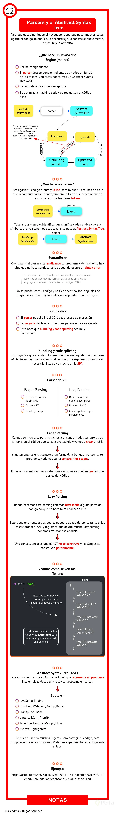
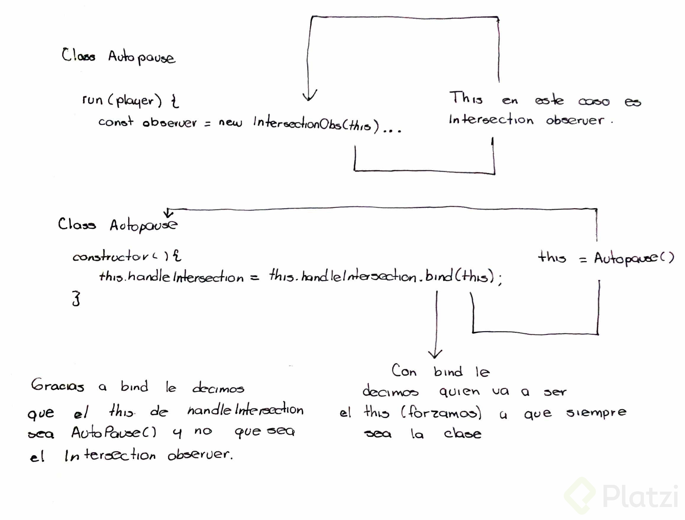
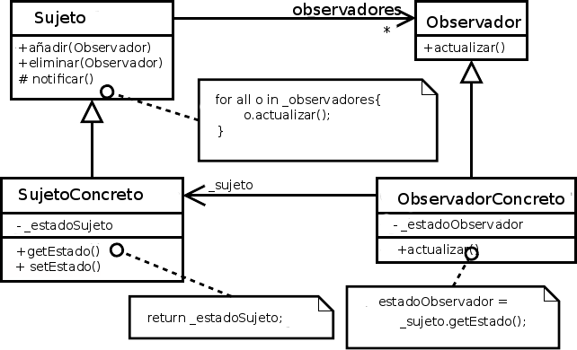

# Curso Profesional de JavaScript

### Instalasion nodejs

- [node homepage](https://nodejs.org/en/)
- [node homepage github](https://github.com/nodejs/node)
- [NodeSource Node.js Binary Distributions](https://github.com/nodesource/distributions#debinstall)

```bash
# Using Debian, as root
curl -sL https://deb.nodesource.com/setup_12.x | bash -
apt-get install -y nodejs
# key
```

key

```bash
curl -sSL https://deb.nodesource.com/gpgkey/nodesource.gpg.key | sudo apt-key add -
# wget can also be used:
# wget --quiet -O - https://deb.nodesource.com/gpgkey/nodesource.gpg.key | sudo apt-key add -
```

`vim /etc/apt/sources.list`

```bash
# Node
deb https://deb.nodesource.com/node_12.x buster main
deb-src https://deb.nodesource.com/node_12.x buster main
# curl -sSL https://deb.nodesource.com/gpgkey/nodesource.gpg.key | sudo apt-key add -
# sudo apt-get install -y nodejs
```

`npm` se instalal cuando instalamos node.js

*npm* es el manejador de paquetes de Node con él podemos instalar dependencias a nuestro proyecto o instalar programas globalmente en nuestro sistema.

```bash
$ npm
# Output
Usage: npm <command>

where <command> is one of:
    access, adduser, audit, bin, bugs, c, cache, ci, cit,
    clean-install, clean-install-test, completion, config,
    create, ddp, dedupe, deprecate, dist-tag, docs, doctor,
    edit, explore, get, help, help-search, hook, i, init,
    install, install-ci-test, install-test, it, link, list, ln,
    login, logout, ls, org, outdated, owner, pack, ping, prefix,
    profile, prune, publish, rb, rebuild, repo, restart, root,
    run, run-script, s, se, search, set, shrinkwrap, star,
    stars, start, stop, t, team, test, token, tst, un,
    uninstall, unpublish, unstar, up, update, v, version, view,
    whoami

npm <command> -h  quick help on <command>
npm -l            display full usage info
npm help <term>   search for help on <term>
npm help npm      involved overview

Specify configs in the ini-formatted file:
    /home/mack/.npmrc
or on the command line via: npm <command> --key value
Config info can be viewed via: npm help config

npm@6.10.3 /usr/lib/node_modules/npm
```

JSON Viewer

- JSON Viewer, chrome web store plug-in
Postman
- [Postman - The Collaboration Platform for API Development](https://www.getpostman.com/)

## 1. Introducción

### 1. ¿Qué significa ser un profesional de JavaScript?

+ Conocimiento del lenguaje.
- COnocimiento de los entornos de programación.
- Mejores prácticas.
- Versado de código.
- Herramientas.
- Ética/Profesionalismo
- Experiencia.

**No fundamentos**
‌Los "*no fundamentos*" representan las siguientes características del lenguaje:  
- **Promesas** (nivel pro).
- **Getters, setters**: son formas de obtener valor de una variable sin tener que poner this.name.
**Proxies**: es un feature muy raro, pero que más adelante veremos a profundidad. Sirve para interceptar a una función + antes de que se ejecute.
- **Generadores**: esto es raro, pero vamos a ver que sí es eficiente.

- **¿Como Funciona?** Este lenguaje corre sobre un motor. JavaScript
- **Versado en código** Esto quiere decir que tenemos que leer mucho código, un lugar hermoso para ponernos a leer + código es GitHub. Debemos leer mucho y hacerlo de forma muy constante.
- **Mejores prácticas** patrones de diseño
- **Ética**
  - Es responsable.
  - Entrega a tiempo sus trabajos.
  - Sabe decir que no.
  - No hace daño.

‌

### 2. Aspectos que destacan a un profesional

- Repo del curso :octocat: [javascript-profesional](https://github.com/Sparragus/javascript-profesional)
- Mi repo del curso :octocat: [macknilan/javascript-profesional](https://github.com/macknilan/javascript-profesional)
- [MDN web docs HTMLMediaElement](https://developer.mozilla.org/en-US/docs/Web/API/HTMLMediaElement)

NOTA: Se parte como referencia del `commit` no. 2 *Inicio del proyecto*

- :octocat: [macknilan/javascript-profesional/COMMITS](https://github.com/macknilan/javascript-profesional/commits/master)

1. Escribir codigo optimizado que logre mejor resultado.
2. Conocer el entorno de programación. Dominar la sintaxis y las herramientas que ayudaran a reducir cantidad de herrores.
3. Leer codigo de otras personas ayuda a fortalecer habilidades para la solución de problemas.
4. Étixa profesional. Cada proyecto que se realiza es fundamental para la operación de un sistema.

### 3. Inicio del proyecto

#### 1. Crear una carpeta en la cual va estar el proyecto e instalar git

```bash
mkdir c_pro_js_platzi
```

#### 2. Ejecutar `npm init -y`. Se crea el siguiente archivo

```javascript
{
  "name": "c_pro_js_platzi",
  "version": "1.0.0",
  "description": "",
  "main": "index.js",
  "scripts": {
    "test": "echo \"Error: no test specified\" && exit 1"
  },
  "keywords": [],
  "author": "",
  "license": "ISC"
}
```

Archivo `.gitignore`

```
node_modules
.cache
dist
```

#### 3. Se remplaza por este, para efectos del curso. Cambiando `"name"`  

Se toma como referencia el `commit` no. 2 *Inicio del proyecto* del repo

```javascript
{
  "name": "c_pro_js_platzi",
  # "name": "platzi-media-player",
  "version": "1.0.0",
  "description": "Proyecto del Curso Profesional de JavaScript de la Escuela de JavaScript de Platzi.",
  "license": "MIT",
  "author": "Richard B. Kaufman López <richardbkaufman@gmail.com>",
  "keywords": [
    "platzi"
  ],
  "scripts": {
    "start": "live-server"
  },
  "devDependencies": {
  }
}
```

#### 4. Se tiene que instalar `live-server`

```bash
$ npm i -D live-server
# i -> install
# -D -> Develoment
# live-server -> app
```

#### 5. El archivo `package.json` cambia a

```bash
{
  "name": "c_pro_js_platzi",
  "version": "1.0.0",
  "description": "Proyecto del Curso Profesional de JavaScript de la Escuela de JavaScript de Platzi.",
  "license": "MIT",
  "author": "Richard B. Kaufman López <richardbkaufman@gmail.com>",
  "keywords": [
    "platzi"
  ],
  "scripts": {},
  "devDependencies": {
    "live-server": "^1.2.1"
  }
}

```

#### 6. Se usa atravez de un escript *npm* modificando

```bash
"scripts": {
    "start": "live-server"
},
```

```javascript
<main class="container">
      <video class="movie">
        <source src="./assets/BigBuckBunny.mp4" />
      </video>
      <button>Play/Pause</button>
    </main>
    <script>
      function MediaPlayer(config) {
        this.media = config.el;
      }
      MediaPlayer.prototype.play = function() {
        this.media.play();
      };
      MediaPlayer.prototype.pause = function() {
        this.media.pause();
      };
      MediaPlayer.prototype.togglePlay = function() {
        if (this.media.paused) {
          this.play();
        } else {
          this.pause();
        }
      };
      const video = document.querySelector('video');
      const player = new MediaPlayer({ el: video });
      const button = document.querySelector('button');
      button.onclick = () => player.togglePlay();
    </script>
```

#### 7. Del repo, del `commit` no. 2 *Inicio del proyecto*. Descargar el archivo `index.html` y la carpeta `assets`

#### 8. Para usar en terminal

```bash
npm start
```

#### 9. En *chrome* en la dirección `http://127.0.0.1:8080/` se mostrara el incio del proyecto

## 2. Repaso de Conceptos Fundamentales

### 4. Cómo llega un script al navegador

El **DOM** es la representación que hace el navegador de un documento **HTML**.

El navegador interpreta el archivo **HTML** y cuando termina de transformarlo al **DOM** se dispara el evento **DOMContentLoaded** lo que significa que todo el documento está disponible para ser manipulado.

Todo script que carguemos en nuestra página tiene un llamado y una ejecución.

Tanto con **async** como **defer** podemos hacer llamados asíncronos pero tiene sus diferencias(archivo PDF):

- 1. **async**.
    Con **async** podemos hacer la petición de forma asíncrona y no vamos a detener la carga del DOM hasta que se haga la ejecución del código.

```javascript
<body>
    <script async src="demo_async.js" ></script>
    <!-- A bunch of HTML -->
</body>
```

+ 2. **defer**.
    La petición es igual asíncrona como en el **async** pero va a **"deferir"** la ejecución del Javascript hasta el final de que se cargue todo el documento.

```javascript
<body>
    <script defer src="demo_async.js" ></script>
    <!-- A bunch of HTML -->
</body>
```
*Hay que tener en cuenta que cuando carga una página y se encuentra un script a ejecutar toda la carga se detiene. Por eso se recomienda agregar tus scripts justo antes de cerrar el body para que todo el documento esté disponible.*

### 5. Scope

>En git, hacer `checkout` al `commit` que tiene nombre de *Scope*. Revisar el archivo `scope.html`

Pasar a link `http://127.0.0.1:8080/ejercicios/` para pasar a los ejercicios

El Scope o ámbito es lo que define el tiempo de vida de una variable, en que partes de nuestro código pueden ser usadas.

En el archivo `scope.html` que esta en la ruta `school_js_platzi/c_pro_js_platzi/ejercicios/`

1. **Global Scope**
    Variables disponibles de forma global se usa la palabra var, son accesibles por todos los scripts que se cargan en la página. Aquí hay mucho riesgo de sobreescritura.

```javascript
// GLOBAL SCOPE
var message = 'Hello, Platzi!';
var $ = function(message) {
    console.log('Say: ' + message);
};
```

En consola se escribe `window.message`

2. **Function Scope**
    Variables declaradas dentro de una función sólo visibles dentro de ella misma (incluyendo los argumentos que se pasan a la función).

```javascript
// FUNCTION SCOPE
function printNumbers() {
  var i;
  for (i = 0; i < 10; i++) {
    function eventuallyPrintNumber(n) {
      setTimeout(function() {
        console.log(n);
      }, 100);
    }
    eventuallyPrintNumber(i);
  }
}
printNumbers();
```

3. **Block Scope**
    Variables definidas dentro de un bloque, por ejemplo variables declaradas dentro un loop while o for. Se usa **let** y **const** para declarar este tipo de variables.

```javascript
// BLOCK SCOPE
function printNumbers2() {
    for (let i = 0; i < 10; i++) {
        setTimeout(function() {
            console.log(i);
        }, 100);
    }
}
printNumbers2();
```

4. **Module Scope**
    Cuando se denota un script de tipo module con el atributo `type="module` las variables son limitadas al archivo en el que están declarada

El archivo `index.html` se declara que el archivo `index.js` es un modulo

```javascript
<script type="module" src="/assets/index.js"></script>
```

En la carpeta `assets` se crea el archivo `MediaPlayer.js` se exporta como mudulo `export default MediaPlayer;`

```javascript
function MediaPlayer(config) {
    this.media = config.el;
}
MediaPlayer.prototype.play = function() {
    this.media.play();
};
MediaPlayer.prototype.pause = function() {
    this.media.pause();
};
MediaPlayer.prototype.togglePlay = function() {
    if (this.media.paused) {
        this.play();
    } else {
        this.pause();
    }
};
export default MediaPlayer;
```

El archivo `index.js` se importa el modulo `import MediaPlayer from './MediaPLayer.js'`

```javascript
import MediaPlayer from './MediaPLayer.js'

const video = document.querySelector('video');
const player = new MediaPlayer({
    el: video
});

const button = document.querySelector('button');
button.onclick = () => player.togglePlay();
```

### 6. Closures

>En git, hacer `checkout` al `commit` que tiene nombre de *clousures*. Revisar el archivo `closures.html`

Son funciones que regresan una función o un objeto con funciones que mantienen las variables que fueron declaradas fuera de su scope.

Los **closures** nos sirven para tener algo parecido a variables privadas, *característica que no tiene JavaScript por default.* Es decir encapsulan variables que no pueden ser modificadas directamente por otros objetos, sólo por funciones pertenecientes al mismo.

**Clouser** Es una funcion o un objeto con funciones que recuerda el estado de las variables al momento de ser invocada, y conserva este estado a travéz de reiteradas ejecuciones.

```javascript
// IIFE
(function() {
  let color = 'green';

  function printColor() {
    console.log(color);
  }

  printColor();
})();
```

```javascript
// FUNCIONES QUE REGRESAN FUNCIONES
function makeColorPrinter(color) {
  let colorMessage = `The color is ${color}`;

  return function() {
    console.log(colorMessage); //MEMORISA LA VARIABLE
  };
}
let greenColorPrinter = makeColorPrinter('green');
console.log(greenColorPrinter());
// SALIDA -> The color is green
```

```javascript
// VARIABLES "PRIVADAS"
function makeCounter(n) {
    let count = n;
    return {
        increase: function() {
            count = count + 1;
        },
        decrease: function() {
            count = count - 1;
        },
        getCount: function() {
            return count;
        },
    };
}
let counte_r = makeCounter(7);
console.log('The count is:', counte_r.getCount());
counte_r.increase();
console.log('The count is:', counte_r.getCount());
counte_r.decrease();
counte_r.decrease();
counte_r.decrease();
counte_r.decrease();
console.log('The count is:', counte_r.getCount());
counte_r.count = 0; // ESTA VARIABLE NO ESTA EXPUESTA, POR QUE LA VARIABLE ES PRIVADA
console.log('The count is:', counte_r.getCount());
// SALIDA
// The count is: 7
// The count is: 8
// The count is: 4
// The count is: 4
```

### 7. El primer plugin

> **NOTA** Comiit `ffbfc72` EN REPO

Archivo `index.js` se manda a llamar el pluging de la ruta `import AutoPlay from './plugins/AutoPlay.js';` y se agrega codigo el boton del `index.html` se mande a llamar y se ponga en silencio/prendido el sonido del video

```javascript
import MediaPlayer from './MediaPLayer.js'
import AutoPlay from './plugins/AutoPlay.js';

const video = document.querySelector('video');
const player = new MediaPlayer({
    el: video,
    plugins: [new AutoPlay()]
});

const button = document.querySelector('button');
button.onclick = () => player.togglePlay();

const muteButton = document.querySelector('#muteButton');
muteButton.onclick = () => {
    if (player.media.muted) {
        player.unmute();
    } else {
        player.mute();
    }
};
```

Se creal el primer plugin en la carpeta `assets/plugin` en el archivo `AutoPlay.js` que se encarga de prender y apagar el sonido del video con el prototipo `run` para el video se ejecute cuando al pagina se carga

```javascript
function AutoPlay() {}
AutoPlay.prototype.run = function(player) {
  player.mute();
  player.play();
};
export default AutoPlay;
```

En el archivo `MediaPlayer.js` se manda a llamar el nuevo *plaugin* y se crea el prototipo `_initPlugins` para mandar a llamar el prototipo `run`. Tambien se crea el los prototipos `mute` y `unmute` para encender y apagar el sonido del video.

```javascript
// OBJETO DE CONFIGURACIÓN
function MediaPlayer(config) {
    this.media = config.el;
    this.plugins = config.plugins || [];

    this._initPlugins();
}
MediaPlayer.prototype._initPlugins = function() {
    this.plugins.forEach(plugin => {
        plugin.run(this);
    });
};
MediaPlayer.prototype.play = function() {
    this.media.play();
};
MediaPlayer.prototype.pause = function() {
    this.media.pause();
};
MediaPlayer.prototype.togglePlay = function() {
    if (this.media.paused) {
        this.play();
    } else {
        this.pause();
    }
};
MediaPlayer.prototype.mute = function() {
  this.media.muted = true;
};
MediaPlayer.prototype.unmute = function() {
  this.media.muted = false;
};
export default MediaPlayer;

```

### 8. this

>**this** se refiere a un objeto, ese objeto es el que actualmente está ejecutando un pedazo de código.

- No se puede asignar un valor a **this** directamente y este depende de en que scope nos encontramos:
  - Cuando llamamos a **this** en el Global Scope o Function Scope, se hace referencia al objeto window. A excepción de cuando estamos en strict mode que nos regresará undefined.
  - Cuando llamamos a **this** desde una función que está contenida en un objeto, **this** se hace referencia a ese objeto.
  - Cuando llamamos a **this** desde una “clase”, se hace referencia a la instancia generada por el constructor.

```html
    <h1>
      <code>this</code> se refiere a un objeto. Ese objeto es el que actualmente
      está ejecutando un pedazo de código.
    </h1>

    <script>
      // THIS EN EL SCOPE GLOBAL
      console.log(`this: ${this}`);

      // THIS EN EL SCOPE DE UNA FUNCIÓN
      function whoIsThis() {
        return this;
      }

      console.log(`whoIsThis(): ${whoIsThis()}`);

      // THIS EN EL SCOPE DE UNA FUNCIÓN EN STRICT MODE
      function whoIsThisStrict() {
        'use strict';
        return this;
      }

      console.log(`whoIsThisStrict(): ${whoIsThisStrict()}`);

      // THIS EN EL CONTEXTO DE UN OBJETO
      const person = {
        name: 'Gabriel',
        saludar: function() {
          console.log(`Hola soy ${this.name}`);
        },
      };

      person.saludar();

      // THIS CUANDO SACAMOS A UNA FUNCIÓN DE UN OBJETO
      const accion = person.saludar;
      accion();

      // THIS EN EL CONTEXTO DE UNA "CLASE"
      function Person(name) {
        // this = {}
        this.name = name;
      }

      Person.prototype.saludar = function() {
        console.log(`Me llamo ${this.name}`);
      };

      const angela = new Person('Angela');
      angela.saludar();
    </script>
```

Otro ejemplo

```javascript
// THIS EN EL SCOPE GLOBAL
// (EL OBJETO ES WINDOW)
console.log(`this en el scope global es: ${this}`)
// THIS EN EL SCOPE DE UNA FUNCIÓN  

// (ES EL DUEÑO DE LA FUNCIÓN (QUIEN LA INVOCA), EN ESTE CASO WINDOW)
function whoIsThis() {
    console.log(`this en el scope de una función es: ${this}`)
}
whoIsThis()

function whoIsThisInner() {
    function inner() {
        console.log(`this en el scope de una función interna es: ${this}`)
    }
    inner()
}
whoIsThisInner()

// THIS EN EL SCOPE DE UNA FUNCIÓN CON MODO ESTRICTO ACTIVADO
// EVITA LA PROPAGACIÓN DE THIS DESDE EL EXTERIOR
// POR LO QUE THIS SERÁ UNDEFINED (ES DECIR NO SE MANDA O EMPAQUETA)
// NI DE FUERA HACIA ADENTRO, COMO DENTRO HASTA MAS ADENTRO
function whoIsThisStrictMode() {
    // EL MODO ESTRICTO POR LO GENERAL ES DECLARADO AL INICIO DEL ARCHIVO, SU FUNCIÓN ES EVITAR QUE SE HAGA USO DE VARIABLES NO DECLARADAS
    'use strict'
    console.log(`this en el scope de una función en modo estricto es ${this}`)

    function inner() {
        console.log(`this en el scope de una función interna en modo estricto es ${this}`)
    }
    inner()
}
whoIsThisStrictMode()

const objetito = {
    nombre: 'Mongo',
    tipo: 'Perro'
}
// SIN EMBARGO, YO PUEDO INDICAR EXPLICITAMENTE A UNA FUNCIÓN CUAL SERÁ EL CONTEXTO DE THIS QUE DEBERÁ TOMAR EN CUENTA.
whoIsThisStrictMode.call(objetito)

// THIS EN EL CONTEXTO DE UN OBJETO
// THIS SERÁ EL DUEÑO DE LA FUNCIÓN, ES DECIR QUIEN LA INVOCA, EN ESTE CASO EL PROPIO OBJETO
const persona = {
    nombre: 'Alejandro',
    saludar: function () {
        console.log(`Hola, me llamo ${this.nombre}`)
    }
}
// SALUDAR SE INVOCA A PARTIR DEL OBJETO PERSONA (THIS = OBJETO PERSONA)
persona.saludar()

// THIS CUANDO SACAMOS A UNA FUNCION DE UN OBJETO
// SE PIERDE EL CONTEXTO DEL THIS, PUESTO QUE LA REFERENCIA SE INVOCA DESDE UN CONTEXTO DIFERENTE AL OBJETO
const accion = persona.saludar
accion()

// THIS EN EL CONTEXTO DE UNA CLASE
// EN ESTE CASO THIS ES EL PROPIO OBJETO
function Animal(nombre) {
    this.nombre = nombre
}
Animal.prototype.saludar = function () {
    console.log(`Hola dueño me llamo ${this.nombre}`)
}
const mongo = new Animal('monguito')
mongo.saludar()

// THIS EN EL CONTEXTO DE UNA FUNCIÓN CONTROLADORA DE EVENTO
// THIS ES EL PROPIO ELEMENTO QUE ACTIVO EL EVENTO
const boton = document.querySelector('#btn-1')
boton.addEventListener('click', function (event) {
    console.log(`this en el scope de una función controlador de evento es ${this}`)
})

// THIS EN SCOPE DE UNA FUNCIÓN QUE PROCESA EL EVENT LOOP (ASINCRONAS)
// LOS PROCESOS QUE LE SON DELEGADOS AL NAVEGADOR, THIS ES EL PROPIO NAVEGADOR, ES DECIR WINDOW
const boton2 = document.querySelector('#btn-2')
boton2.addEventListener('click', function (event) {
    console.log(`this el el controlador de evento es ${this}`)

    setTimeout(function() {
        // AQUÍ THIS SALTA DE UN CONTEXTO A OTRO
        console.log(`this en una función asincrona, que le es delegada al navegador ${this}`)
    }, 1000)
})
```

### 9. Los métodos call, apply y bind

Estas funciones nos sirven para establecer el valor de **this**, es decir cambiar el contexto que se va usar cuando la función sea llamada.

Las funciones **call**, **apply** y **bind** *son parte del prototipo Function*.

>Toda función usa este prototipo y por lo tanto tiene estas tres funciones.

- **functionName.call()**. Ejecuta la función recibiendo como primer argumento el **this** y los siguientes son los argumentos que recibe la función que llamó a call.
- **functionName.apply()**. Ejecuta la función recibiendo como primer argumento el **this** y como segundo un arreglo con los argumentos que recibe la función que llamó a apply.
- **functionName.bind()**. Recibe como primer y único argumento el **this**. No ejecuta la función, sólo regresa otra función con el nuevo this integrado.

```javascript
<ul>
    <li><button class="call-to-action">Aprender</button></li>
    <li><button class="call-to-action">Aprender Más</button></li>
    <li><button class="call-to-action">¡Nunca parar de Aprender!</button></li>
</ul>
<script>
// Establece `this` usando `call`
function saludar() {
    console.log(`Hola. Soy ${this.name} ${this.apellido}`);
}

const richard = {
    name: 'Richard',
    apellido: 'Kaufman López',
};

saludar.call(richard);

// Establece `this` usando `call` y pasar argumentos a la función
function caminar(metros, direccion) {
    console.log(`${this.name} camina ${metros} metros hacia ${direccion}.`);
}

caminar.call(richard, 400, 'norte');

// Establece `this` usando `apply` y pasar argumentos a la función
const valores = [800, 'noreste'];
caminar.apply(richard, valores);

/*
  Call - comma
  Apply - arreglo
*/

// Establecer `this` en una nueva función usando `bind`
const daniel = { name: 'Daniel', apellido: 'Sánchez' };
const danielSaluda = saludar.bind(daniel);
danielSaluda();

const danielCamina = caminar.bind(daniel, 2000);
danielCamina('oeste');

// SALIDA
//Hola. Soy Richard Kaufman López
// Richard camina 400 metros hacia norte.
// Richard camina 800 metros hacia noreste.
// Hola. Soy Daniel Sánchez
// Daniel camina 2000 metros hacia oeste.

// Cuándo es útil usar uno de estos métodos
const buttons = document.getElementsByClassName('call-to-action');
// buttons.forEach(button => {
//   button.onclick = () => alert('Nunca pares de aprender!');
// });

// NodeList
Array.prototype.forEach.call(buttons, button => {
    button.onclick = () => alert('Nunca pares de aprender!');
});
</script>
```

Funcion **curryng** Esta tecnica nos permita guerdar argumentos parciales con el `bind`.

```javascript
function caminar(metros, dirección) {
    console.log(`${this.name} camina ${metros} hacia ${direccion}`)
}
const luisCamina = caminar.bind(luis, 400)
luisCamina('norte')
// SALIDA -> luis camina 400 hacia norte
```

### 10. Prototype

En Javascript todo son objetos, no tenemos clases, no tenemos ese plano para crear objetos.

Todos los objetos **“heredan”** de un prototipo que a su vez hereda de otro prototipo y así sucesivamente creando lo que se llama la **prototype** chain.

La keyword `new` crea un nuevo objeto que **“hereda”** todas las propiedades del **prototype** de otro objeto. No confundir **prototype** con proto que es sólo una propiedad en cada instancía que apunta al prototipo del que hereda.

UN OBJETO COMÚN Y CORRIENTE

```javascript
const zelda = {
  name: 'Zelda',
};

zelda.saludar = function() {
  console.log(`Hola soy ${this.name}`);
};

zelda.saludar();

const link = {
  name: 'Link',
};

link.saludar = function() {
  console.log(`Hola soy ${this.name}`);
};

link.saludar();
```

SEAMOS UN POCO MÁS EFICIENTES

```javascript
// SEAMOS UN POCO MÁS EFICIENTES
function Hero(name) {
  const hero = {
    name: name,
  };

  hero.saludar = function() {
    console.log(`Hola soy ${this.name}`);
  };

  return hero;
}
const zelda = Hero('Zelda');
zelda.saludar();

const link = Hero('Link');
link.saludar();
```

AUN PODEMOS MEJORAR MÁS Y EVITAR TENER QUE CREAR LA MISMA FUNCIÓN CADA VEZ

```javascript
// AUN PODEMOS MEJORAR MÁS Y EVITAR TENER QUE CREAR LA MISMA FUNCIÓN CADA VEZ
const heroMethods = {
  saludar: function() {
    console.log(`Me llamo ${this.name}`);
  },
};

function Hero(name) {
  const hero = {
    name: name,
  };
  hero.saludar = heroMethods.saludar;
  return hero;
}

const zelda = Hero('Zelda');
zelda.saludar();

const link = Hero('Link');
link.saludar();
```

Object.create `const nuevoObjeto = Object.create(objeto)`

```javascript
// Object.create
// const nuevoObjeto = Object.create(objeto)
const heroMethods = {
    saludar: function() {
    console.log(`Soy superheroe! ${this.name}`);
    },
};

function Hero(name) {
    const hero = Object.create(heroMethods);
    hero.name = name;

    return hero;
}

const zelda = Hero('Zelda');
zelda.saludar();

const link = Hero('Link');
link.saludar();
```

LOS MÉTODOS DE hero DENTRO DE Hero

```javascript
// LOS MÉTODOS DE HERO DENTRO DE Hero
function Hero(name) {
  const hero = Object.create(Hero.prototype);
  hero.name = name;
  return hero;
}

Hero.prototype.saludar = function() {
  console.log(`Soy superheroina! ${this.name}`);
};

const zelda = Hero('Zelda');
zelda.saludar();

const link = Hero('Link');
link.saludar();
```

```javascript
// new es un atajo (azucar sintactica) para llevar Hero.prototype al objeto que estamos creando
function Hero(name) {
    // this = Object.create(Hero.prototype);
    this.name = name;
    // return this;
}
Hero.prototype.saludar = function() {
    console.log(`New: ${this.name}`);
};

const zelda = new Hero('Zelda');
zelda.saludar();

const link = new Hero('Link');
link.saludar();
```

### 11. Herencia Prototipal

Por default los objetos en JavaScript tienen cómo prototipo a **Object** que es el punto de partida de todos los objetos, es el prototipo padre. **Object** es la raíz de todo, por lo tanto tiene un prototipo padre undefined.

Cuando se llama a una función o variable que no se encuentra en el mismo objeto que la llamó, se busca en toda la prototype chain hasta encontrarla o regresar undefined.

La función **hasOwnProperty** sirve para verificar si una propiedad es parte del objeto o si viene heredada desde su prototype chain.

```javascript
    <h1>
        <code>SomeObject.prototype</code> es un objeto donde definimos el
        prototipo de las instancias de <code>SomeObject</code>. Es decir, las
        instancias de <code>SomeObject</code> van a "heredar" de
        <code>SomeObject.prototype</code>.
        <br />
        <br />
        <code>SomeObject.[[Prototype]]</code> es el prototipo de
        <code>SomeObject</code>. Es decir, <code>SomeObject</code> "hereda" de
        <code>SomeObject.prototype</code>.
    </h1>
    <script>
    function Hero(name) {
        this.name = name;
    }

    Hero.prototype.saludar = function() {
        console.log(`Hola, soy ${this.name}.`);
    };

    const zelda = new Hero('Zelda');

    // propiedades de la instancia
    console.log('Name:', zelda.name);
    // propiedades de la "clase"
    console.log('Saludar:', zelda.saludar);

    // propiedades heredadas ej: toString
    console.log('toString:', zelda.toString);

    // hasOwnProperty (de dónde sale toString o esto?)
    console.log(
        'zelda.hasOwnProperty("saludar"):',
        zelda.hasOwnProperty('saludar')
    );

    // inspeccionemos el prototipo del zelda
    // inspeccionemos el prototipo del Hero
    // inspeccionemos el prototipo del Object
```

Ya vimos como funciona la herencia, cuando asignamos métodos a hero pudimos acceder a el a pesar de que cuando buscamos en la consola nos apareciera como un objeto vacío, sin embargo en `__proto__` estaba la referencia a los métodos. Esta es una de las mejores características que tiene JavaScript.

Vamos a inspeccionar a esto hasta a llegar a `Object`

```javascript
function Persona(name) {
    this.name = name
}
Persona.prototype.saludar = function() {
    console.log(`Hola, me llamo ${this.name}`);
}
const miPersona = new Persona('Augusto')
miPersona.saludar()
```

Si llamamos a con el `console.logPersona.name` nos dará la propiedad `name` de la instancia.

Si llamamos `Persona.saludar` nos dará la propiedad de la clase. Ahora, si llamamos a `Persona.toString` nos sale que es una función que hemos heredado, pero ¿de donde sale esta función?

Usemos hasOwnProperty
‌
Esto lo vamos a usar para saber si alguna propiedad pertenece a la clase. De esta forma lo sabremos:

```javascript
> miPersona.hasOwnProperty('name')
< true
> miPersona.hasOwnProperty('saludar')
< false
```

Vemos que name sí forma parte de `miPersona` pero su método saludar no. Vamos a ver cómo es que entonces accedemos a saludar.

```javascript
> miPersona
< Persona {name: "Augusto"}
    name: "Augusto"
    __proto__:
        saludar: ƒ ()
        constructor: ƒ Persona(name)
        __proto__:
            constructor: ƒ Object()
            hasOwnProperty: ƒ hasOwnProperty()
            isPrototypeOf: ƒ isPrototypeOf()
            propertyIsEnumerable: ƒ propertyIsEnumerable()
            toLocaleString: ƒ toLocaleString()
            toString: ƒ toString()
            valueOf: ƒ valueOf()
            __defineGetter__: ƒ __defineGetter__()
            __defineSetter__: ƒ __defineSetter__()
            __lookupGetter__: ƒ __lookupGetter__()
            __lookupSetter__: ƒ __lookupSetter__()
            get __proto__: ƒ __proto__()
            set __proto__: ƒ __proto__()  
```

Entonces vemos que usando esto en nuestra consola nos aparecerá que en el `__proto__` es donde está el método `saludar`, y en el `__proto__` del `__proto__` está la función `toString()`.

Podemos acceder al proto de la siguiente forma: `miPersona.__proto__`, pero esto puede variar dependiendo del navegador, no en todos aparece de esa forma, solo es una representación de la herencia. La forma correcta de acceder al proto es de la siguiente forma:

```javascript
> Object.getPrototypeOf(miPersona)
< {saludar: ƒ, constructor: ƒ}
```

Podemos comprobar que es el mismo objeto que `prototype` de la siguiente forma:

```javascript
> Object.getPrototypeOf(miPersona) === Persona.prototype 
< true
```

Hace referencia al mismo lugar de memoria. Ese objeto es idéntico al que está en `Persona.prototype`. Esto significa que no es una copia. Esto quiere decir que si le agregamos un método a Persona inmediatamente está disponible en `miPersona`, esto por que el lenguaje lo encadena y representa la misma cosa.

El lenguaje busca el método en el objeto, sino existe se va al `proto` y si no está en el `proto` se va al `proto` del `proto`, allí acaba. El ultimo `proto` es `Object`, es el punto de partida de todos los objetos de JavaScript. El `proto` de Object no existe, es aquí cuando la búsqueda se detiene, si ejecutamos una función que no existe en el `proto` nos saldrá un error.

## 3. Cómo funciona JavaScript

### 12. Parsers y el Abstract Syntax Tree

El JS Engine recibe el código fuente y lo procesa de la siguiente manera:

- El **parser** descompone y crea tokens que integran el **AST**.
- Se compila a **bytecode** y se ejecuta.
- Lo que se pueda se **optimiza a machine code** y se reemplaza el código base.

Un `SyntaxError` es lanzado cuando el motor JavaScript encuentra partes que no forman parte de la sintaxis del lenguaje y esto lo logra gracias a que se tiene un **AST** generado por el parser.

El parser es del 15% al 20% del proceso de ejecución por lo que hay que usar parser del código justo en el momento que lo necesitamos y no antes de saber si se va a usar o no.



### 13. Abstract Syntax Tree en Práctica

- :link: [AST EXPLORER](https://astexplorer.net/#/gist/16fc27fc420f705455f2b42b6c804aa1/d9cc7988c2c743d7edfbb3c3b1abed866c975ee4)
- :link: [ESLint Find and fix problems in your JavaScript code](https://eslint.org/)

Vamos a usar el **AST** para crear una regla de eslint, este analizará estéticamente nuestro código a ver si hay que levantar un warning por violar la sintaxis. Muchas de estas reglas ya viene con e eslint, pero podemos agregar nuestras propias reglas. Vamos a usar la herramienta **AST** | Explorer para experimentar. Usaremos la configuración por defecto, veremos en la parte superior izquierda el código que vamos a ingresar, a la derecha el tree creado, en la parte inferior izquierda las funciones de las reglas y a la derecha de eso la salida de nuestro código.

‌En el link de AST Explorer ya tenemos un código escrito. Donde el la primera entrada tenemos las tareas que debe cumplir nuestro fixer.

```javascript
const pi = 3.1415;
const half_pi = 1.57075;
// variable constantes
// variables que guarden un numero

// El nombre de la variable tiene que estar en UPPERCASE
```

A la derecha tenemos el árbol completo de todas estas declaraciones y gracias a el podemos manipular, detectar errores o interpretar lo que escribamos. Luego implementamos una función que recibe la declaración de la variable y accedemos a los datos que nos ofrece el AST para lograr cumplir con los requerimientos de nuestro solucionador.

```javascript
export default function(context) {
  return {
    VariableDeclaration(node) {
        // tipo de variable const
          if (node.kind === "const") {
          const declaration = node.declarations[0];

          // asegurarnos que el valor es un numero
          if (typeof declaration.init.value === "number") {
            if (declaration.id.name !== declaration.id.name.toUpperCase()) {
              context.report({
                node: declaration.id,
                message: "El nombre de la constante debe estar en mayúsculas",
                fix: function(fixer) {
                  return fixer.replaceText(declaration.id, declaration.id.name.toUpperCase())
                }
              })
            }
          }
        }
    }
  };
};
```

Con `context.report()` podemos mandar un warning y además podemos solucionar el problema que se haya presentado.

### 14. Cómo funciona el JavaScript Engine

NOTA: Diapositiva 43 de archivo adjunto.

Una vez tenemos el **AST** ahora hay que convertirlo a **Bytecode**.

**Bytecode** es como el código assembler pero en lugar de operar en el procesador opera en la máquina virtual V8 del navegador.

**Machine code** es el más bajo nivel, es código binario que va directo al procesador.

**El profiler** se sitúa en medio del bytecode y el optimizador

Cada máquina virtual tiene sus particularidades, por ejemplo V8 tiene algo llamado **Hot Functions**.

Cuando una sentencia función es ejecutada muy frecuentemente, V8 la denomina como una hot function y hace una optimización que consiste en convertirla a machine code para no tener que interpretarla de nuevo y agilizar su ejecución.

- Cada navegador tiene su implementación de JavaScript Engine:
  - SpiderMonkey - Firefox
  - Chackra - Edge
  - JavaScriptCore - Safari
  - V8 - Chrome

### 15. Event Loop

NOTA: Diapositiva 61 de archivo adjunto.

El **Event Loop** hace que Javascript parezca ser multihilo a pesar de que corre en un solo proceso.

- Javascript se organiza usando las siguientes estructuras de datos:
  - **Stack**. Va apilando de forma organizada las diferentes instrucciones que se llaman. Lleva así un rastro de dónde está el programa, en que punto de ejecución nos encontramos.
  - **Memory Heap**. De forma desorganizada se guarda información de las variables y del scope.
  - **Schedule Tasks**. Aquí se agregan a la cola, las tareas programadas para su ejecución.
  - **Task Queue**. Aquí se agregan las tares que ya están listas para pasar al stack y ser ejecutadas. El stack debe estar + vacío para que esto suceda.
  - **MicroTask Queue**. Aquí se agregan las promesas. Esta Queue es la que tiene mayor prioridad.

El **Event Loop** es un loop que está ejecutando todo el tiempo y pasa periódicamente revisando las queues y el stack moviendo tareas entre estas dos estructuras.

## 4. Fundamentos Intermedios

### 16. Promesas

Para crear las promesas usamos la clase **Promise**. El constructor de **Promise** recibe un sólo argumento, un callback con dos parámetros, resolve y reject. resolve es la función a ejecutar cuando se resuelve y reject cuando se rechaza.

El **async/await** es sólo syntax sugar de una promesa, por debajo es exactamente lo mismo.

La clase **Promise** tiene algunos métodos estáticos bastante útiles:

**Promise.all**. Da error si una de las promesas es rechazada.
**Promise.race**. Regresa sólo la promesa que se resuelva primero.

```javascript
// Ejemplo: renderMovies([{ title: "Spider-Man", release_date: "2019-06-30", poster_path: "/rjbNpRMoVvqHmhmksbokcyCr7wn.jpg" }])
// Traducir las funciones de usar thens a usar async/await
// Crear función para que no nos gastemos la cantidad de requests demasiado rapido
// Crear función donde hacemos requests secuenciales
// Crear función donde hacemos requests en paralelo
// Crear función donde obtenemos el primer request que llegue

// The Movie Database API: https://developers.themoviedb.org/3/getting-started/introduction
const apiKey = 'b89fc45c2067cbd33560270639722eae';

// TERCERA FUNCION
async function getMovie(id) {
    const url = `https://api.themoviedb.org/3/movie/${id}?api_key=${apiKey}`;
    const response = await fetch(url);
    const data = await response.json();
    return data;
}
// SEGUNDA FUNCION
async function getPopularMovies() {
    const url = `https://api.themoviedb.org/3/discover/movie?sort_by=popularity.desc&api_key=${apiKey}`;
    const response = await fetch(url);
    const data = await response.json();
    return data.results;
}
// PRIMERA FUNCION
async function getTopMoviesIds(n = 3) {
    // return getPopularMovies().then(popularMovies =>
    //   popularMovies.slice(0, n).map(movie => movie.id)
    // );
    // try {
    //   const popularMovies = await getPopularMovies();
    // } catch (error) {
    //   console.log(error.message)
    // }

    const popularMovies = await getPopularMovies();
    const ids = popularMovies.slice(0, n).map(movie => movie.id);
    return ids;
}
function renderMovies(movies) {
    const movieList = document.getElementById('movies');
    movieList.innerHTML = '';

    movies.forEach(movie => {
        const listItem = document.createElement('li');
        listItem.innerHTML = `
        
        <h5>${movie.title}</h5>
        <p>Released on <em>${movie.release_date}</em></p>
        `;
        movieList.appendChild(listItem);
    });
}
// PRIMER BOTON
async function getTopMoviesInSequence() {
    const ids = await getTopMoviesIds();
    const movies = [];
    for (const id of ids) {
        const movie = await getMovie(id);
        movies.push(movie);
    }
    return movies;
}
// SEGUNDO BOTON
async function getTopMoviesInParallel() {
    const ids = await getTopMoviesIds();
    const moviePromises = ids.map(id => getMovie(id));
    const movies = await Promise.all(moviePromises);
    return movies;
}
// TERCER BOTON
async function getFastestTopMovie() {
    const ids = await getTopMoviesIds();
    const moviePromises = ids.map(id => getMovie(id));
    const movie = await Promise.race(moviePromises);
    return movie;
}
document.getElementById('sequence').onclick = async function() {
    const movies = await getTopMoviesInSequence();
    renderMovies(movies);
};
document.getElementById('parallel').onclick = async function() {
    const movies = await getTopMoviesInParallel();
    renderMovies(movies);
};
document.getElementById('fastest').onclick = async function() {
    const movie = await getFastestTopMovie();
    renderMovies([movie]);
};
```

### 17. Getters y setters

Los **getters** y **setters** son funciones que podemos usar en un objeto para tener propiedades virtuales. Se usan los keywords set y get para crear estas propiedades.

Estas propiedades al ser funciones pueden llevar una validación de por medio y ser usadas con el operador de asignación como si fueran una variable más dentro del objeto.

El archivo `MediaPlayer.js` se modifico a esto

```javascript
MediaPlayer.prototype._initPlugins = function() {
    const player = {
        play: () => this.play(),
        pause: () => this.pause(),
        media: this.media,
        get muted() {
            return this.media.muted;
        },
        set muted(value) {
          this.media.muted = value;
        },
    };

    this.plugins.forEach(plugin => {
        plugin.run(player);
    });
};
```

El archivo `AutoPlay.js` se modifico a esto

```javascript
function AutoPlay() {}
AutoPlay.prototype.run = function(player) {
    if (!player.muted) {
        player.muted = true;
    }
    player.play();
};
export default AutoPlay;
```

Getters y Setter con otro contexto de explicación.

**Getters**

```javascript

let person = {
    name:'Miguel',
    last_name:'Soler',
    age:28,
    languages:['js','css','react'],
    get skills(){
        returnthis.languages
    }
}
console.log(person.skills)
```

En este caso estoy retornando el valor de languages atraves de un *getter* llamado *skills*, pero para ver mejor su uso, mira este ejemplo:

```javascript
let person = {
    name:'Miguel',
    last_name:'Soler',
    age:28,
    languages:['js','css','react'],
    get fullName(){
        return`${this.name}${this.last_name}`
    }
}
console.log(person.fullName)
```

En este caso estoy retornando el nombre completo (fullName), como una propiedad del objeto person. El fullName también lo podría traer a través de un método de la siguiente forma:

```javascript
let person = {
    name:'Miguel',
    last_name:'Soler',
    age:28,
    languages:['js','css','react'],
    fullName: function (){
       return`${this.name}${this.last_name}`
    }
}
console.log(person.fullName())
```

Sin embargo, a traves del getter la semantica es mucho màs transparente y mantiene mejor la integridad de la data.

**Setter**

```javascript
let person = {
    name:'Miguel',
    last_name:'Soler',
    age:28,
    languages:[],
    set skills(skills){
       this.languages = skills
    }
}
person.skills = ['ruby','rails','nodejs']
console.log(person.languages)
```

En suma los **getters** y **setters** nos permiten tener el control sobre las propiedades que podemos almacenar o recuperar

## 5. Fundamentos Avanzados

### 18. Proxy

+ :link: [Proxy](https://developer.mozilla.org/en-US/docs/Web/JavaScript/Reference/Global_Objects/Proxy#Methods_of_the_handler_object)
- :link: [Proxy handler](https://developer.mozilla.org/en-US/docs/Web/JavaScript/Reference/Global_Objects/Proxy/handler)

Proxy es parecido a getters y setters.

Usa un concepto que se llama **traps**: *son interceptores de llamadas*. A diferencia de getters, no opera sobre una propieda, si no sobre un objeto.

El **proxy** sirve para interceptar la lectura de propiedades de un objeto (los get, y set) entre muchas otras funciones.

Así, antes de que la llamada llegue al objeto podemos manipularla con una lógica que nosotros definamos.

```html
<script src="https://unpkg.com/fast-levenshtein@2.0.6/levenshtein.js"></script>
```

```javascript
const target = {
    red: 'Rojo',
    green: 'Verde',
    blue: 'Azul',
};
const handler = {
    get(obj, prop) {
        if (prop in obj) {
            return obj[prop];
        }
        const suggestion = Object.keys(obj).find(key => {
            return Levenshtein.get(key, prop) <= 3;
        });
        if (suggestion) {
            console.log(
                `${prop} no se encontró. Quisiste decir ${suggestion}?`
            );
        }
        return obj[prop];
    },
};
const p = new Proxy(target, handler);

// OUTPUT
// p.blue
// "Azul"
// p.bluee
// proxy.html:40 bluee no se encontró. Quisiste decir blue?
```

### 19. Generators

+ :link: [Iterators and generators](https://developer.mozilla.org/en-US/docs/Web/JavaScript/Guide/Iterators_and_Generators)
- : link: [function*](https://developer.mozilla.org/en-US/docs/Web/JavaScript/Reference/Statements/function*)
- :link: [function*](https://developer.mozilla.org/en-US/docs/Web/JavaScript/Reference/Operators/yield)

Los generadores son funciones de las que se puede salir y volver a entrar.  
Su contexto (asociación de variables) será conservado entre las reentradas.  
Cada vez que llamamos **next**, la ejecución del generador va a continuar hasta el proximo **yield**  

El objecto **Generador** es retornado por *generator function* y conforma tanto un protocolo *iterable* como un protocolo iterador.

Sintaxis

```javascript
function* gen() { 
  yield 1;
  yield 2;
  yield 3;
}
var g = gen(); // "Generator { }"
// g.next()
// {value: 1, done: false}
// g.next()
// {value: 2, done: false}
// g.next()
// {value: 3, done: false}
// g.next()
// {value: undefined, done: true}

```

```javascript
function* simpleGenerator() {
    console.log('GENERATOR START');
    yield 1;
    yield 2;
    yield 3;
    console.log('GENERATOR END');
}

// CONST gen = simpleGenerator();

// PODEMOS HACER GENERADORES INFINITOS.
function* idMaker() {
    let id = 1;
    while (true) {
        yield id;
        id = id + 1;
    }
}
// CUANDO LLAMAMOS next TAMBIÉN PODEMOS PASAR VALORES QUE LA FUNCIÓN RECIBE.
function* idMakerWithReset() {
    let id = 1;
    let reset;
    while (true) {
        reset = yield id;
        if (reset) {
            id = 1;
        } else {
            id = id + 1;
        }
    }
}
// AHORA HAGAMOS UN EJEMPLO UN POCO MÁS COMPLEJO: LA SECUENCIA FIBONACCI
function* fibonacci() {
    let a = 1;
    let b = 1;
    while (true) {
        const nextNumber = a + b;
        a = b;
        b = nextNumber;
        yield nextNumber;
    }
}
```

## 6. APIs del DOM

### 20. Fetch - Cómo cancelar peticiones

La peticiones **AJAX** permitieron en su tiempo hacer peticiones asíncronas al servidor sin tener que detener la carga de la página. Hoy en día se utiliza la función fetch para esto.

Con **fetch** tenemos algo llamado **AbortController** que nos permite enviar una señal a una petición en plena ejecución para detenerla.

```javascript
    const url = 'https://images.pexels.com/photos/974470/nature-stars-milky-way-galaxy-974470.jpeg?q=100';
    const img = document.getElementById('huge-image');
    const loadButton = document.getElementById('load');
    const stopButton = document.getElementById('stop');
    let controller;

    // Función que habilita o desabilita un boton
    function startLoading() {
        loadButton.disabled = true;
        loadButton.innerText = 'Loading...';
        stopButton.disabled = false;
    }
    // Funcíon que desabilita el boton de carga
    function stopLoading() {
        loadButton.disabled = false;
        loadButton.innerText = 'Load HUGE Image';
        stopButton.disabled = true;
    }
    // Se ejecuta startLoading que lo unico que hace es cambiar la apariencia del boton
    // Para que se vea que esta cargando
    loadButton.onclick = async function() {
        startLoading();
        // Declaramos la variable antes para despues tener acceso a ella
        // en el boton de cancelar petición fetch
        controller = new AbortController();

        try {
            const response = await fetch(url, { signal: controller.signal });
            const blob = await response.blob(); // blob  ES EL BINARIO
            const imgUrl = URL.createObjectURL(blob);
            img.src = imgUrl;
        } catch (error) {
            console.log(error.message);
        }
        // Cuando la función asincrona se falle vamos a cambiar el boton a stop
        stopLoading();
    };
    // Si deseamos detener tenemos que llamar al abort controller.container
    // El abort envia una señal al fetch y hace que la petición se cancele
    stopButton.onclick = function() {
        controller.abort();
        stopLoading();
    };
```

### 21. IntersectionObserver

+ :link: [This en diferentes situaciones y su comportamiento](https://filisantillan.com/this-en-diferentes-situaciones-y-su-comportamiento/)

Sirve para observar elementos y si cruzan un umbral que nosotros definimos nos lo va a notificar para tomar acción.

*El umbral se define por el porcentaje que tiene intersección con el viewport, con la parte visible de nuestra página.*

:link: [Intersection Observer API](https://developer.mozilla.org/en-US/docs/Web/API/Intersection_Observer_API)
> The Intersection Observer API provides a way to asynchronously observe changes in the intersection of a target element with an ancestor element or with a top-level document's viewport.

Crear el **intersection observer** llamando a su **constructor** y pasándole una función **callback** para que se ejecute cuando un **nivel (threshold)** sea cruzado en una u otra dirección:

```javascript
let options = {
  root: document.querySelector('#scrollArea'),
  rootMargin: '0px',
  threshold: 1.0
}
let observer = new IntersectionObserver(callback, options);
```

Un **threshold de 1.0** significa que cuando el *100%* del elemento target está visible dentro del elemento especificado por la opción **root**, la **función callback** es invocada.



Para implementar **Intersection Observer** en el proyecto se implementa primero en el archivo `/c_pro_js_platzi/assets/index.js` para "instalar" el nuevo plugin modificando las siguientes lineas:

```javascript
import AutoPause from './plugins/AutoPause.js';

plugins: [new AutoPlay(), new AutoPause()], // SE AÑADE AutoPause
```

Y se modifico el archivo `index.html`

Se crea en la carpeta `plugnins` el archivo `AutoPause.js`

```javascript
class AutoPause {
    constructor() {
        this.threshold = 0.25;
        this.handleIntersection = this.handleIntersection.bind(this);
    }
    run(player) {
        this.player = player;
        const observer = new IntersectionObserver(this.handleIntersection, {
            threshold: this.threshold,
        });
        observer.observe(this.player.media);
    }
    handleIntersection(entries) {
        const entry = entries[0];
        const isVisible = entry.intersectionRatio >= this.threshold;
        if (isVisible) {
            this.player.play();
        } else {
            this.player.pause();
        }
    }
}
export default AutoPause;
```

### 22. VisibilityChange

- :link: [Document: visibilitychange](https://developer.mozilla.org/en-US/docs/Web/API/Document/visibilitychange_event)

El **visibilityChange** forma parte del API del DOM llamado Page Visibility y nos deja saber si el elemento es visible, pude ser usado para ejecutar una acción cuando cambiamos de pestaña. Así podemos ahorrar batería y mejorar la UX.

- Casos de uso para utilizar la API Page Visibility:
  - Un sitio tiene un carrusel de imágenes que no debería avanzar a la siguiente diapositiva a no ser que el usuario esté viendo la página.
  - Una aplicación que muestra un panel de información y no se quiere que se actualice la información del servidor cuando la página no está visible.
  - Una página quiere detectar cuando se está precargando para poder mantener un recuento preciso de las vistas de página.
  - Un sitio desea desactivar los sonidos cuando el dispositivo está en modo de espera (el usuario presiona el botón de encendido para apagar la pantalla).

Para incorporar el **visibilityChange** en nuestro proyecto para que se "pause" cuando no esta activa la pestaña se modifica el archivo `AutoPause.js`

```javascript
class AutoPause {
    constructor() {
        this.threshold = 0.25;
        this.handleIntersection = this.handleIntersection.bind(this);
        this.handleVisibilityChange = this.handleVisibilityChange.bind(this);
    }
    run(player) {
        this.player = player;
        const observer = new IntersectionObserver(this.handleIntersection, {
            threshold: this.threshold,
        });
        observer.observe(this.player.media);
        document.addEventListener('visibilitychange', this.handleVisibilityChange);
    }
    handleIntersection(entries) {
        const entry = entries[0];
        const isVisible = entry.intersectionRatio >= this.threshold;
        if (isVisible) {
            this.player.play();
        } else {
            this.player.pause();
        }
    }
    handleVisibilityChange() {
        const isVisible = document.visibilityState === 'visible';
        if (isVisible) {
            this.player.play();
        } else {
            this.player.pause();
        }
    }
}
export default AutoPause;
```

### 23. Service Workers

- :link: [Service Worker API](https://developer.mozilla.org/en-US/docs/Web/API/Service_Worker_API)
- :link: [Service Workers: an Introduction](https://developers.google.com/web/fundamentals/primers/service-workers)
- :link: [Using Service Workers](https://developer.mozilla.org/en-US/docs/Web/API/Service_Worker_API/Using_Service_Workers)

Sirven para hacer que nuestras aplicaciones funcionen **Offline**.

Muy usados en las **Progressive Web Apps (PWA)** los ServiceWorkers son una capa que vive entre el navegador y el Internet.

Parecido a como lo hacen los proxys van a interceptar peticiones para guardar el resultado en cache y la próxima vez que se haga la petición tomar del cache ese resultado.

Una de las nuevas tendencias en el desarrollo web, son las pwa o progressive web apps, dentro de las varias cosas que ofrecen está que tu app funcione offline, esto lo hacemos posible usando los services workers, services workers es una capa que va a vivir entre el navegador y el internet. Lo que van a hacer es algo parecido a los proxys, van a interceptar peticiones, en esté caso las peticiones vamos a tener la oportunidad de hagarrar la petición, buscar la respuesta pero antes de regresarla al browser la vamos a guardar en cache

**¿Qué pasa una vez que lo tenemos en cache?**

La proxima vez que ocurra una petición, en lugar de tener que ir a internet, ya tenemos la respuesta, así que nadamas la regresamos, imaginate un usuario que va dentro del metro se mete en un tunel y pierde conectividad, va a seguir utilizando tu aplicación porque usando service workers, va a funcionar offline.

En el archivo del proyecto `index.js` se añade al final el siguiente codigo para para detectar si el explorador puede trabajar con **Service Workers**

Dentro del service workets vamos a registrar un archivo, esté archivo va a ser el serice worker tal cual, pero es posible que dentro del registro ocurra un error, asi que es importante ver ese error.

```javascript
if ('serviceWorker' in navigator) {
    navigator.serviceWorker.register('/sw.js').catch(error => {
        console.log(error.message);
    });
}
```

Se crea el archivo `sw.js` en la carpeta raiz del proyecto, a la misma altura donde esta el archivo `index.html`

Los *services workers* se instalan, el navegador lo va a instalar en la computadora del usuario, no es lo mismo que una aplicación, pero si va a vivir dentro del navegador, entonces cada vez que nostros hagamos cambios hay que volver a instalarlos, esto va suceder cuando el usuario este usando la aplicación en producción pero cuando estamos en desarrollo queremos que esto suceda rápido, no con la lentitud que pueda suceder en producción. **Para hacerlo hay que activar updated on reload en las devtools.**

```javascript
// Self HACE REFENCIA AL SERVICE WORKER ES COMO THIS A LOS OBJETOS
self.addEventListener('install', event => {
    // CREAMOS UN PRECACHE CON UNA LISTA DE RECURSOS QUE QUEREMOS QUE MANTENGA EN CACHE
    event.waitUntil(precache());
})
// CUANDO OCURRA UNA PETICIÓN QUEREMOS A IR AL CACHE PARA VER SI ENCONTRAMOS LA RESPUESTA
self.addEventListener('fetch', event => {
    // EXTRAEMOS LA PETICIÓN
    const request = event.request;
    // SOLO QUEREMOS HACER ALGO CON LAS PETICIONES QUE SON GET
    if (request.method !== "GET")
        return;

    // ACTUALIZAR EL CACHE
    event.waitUntil(updateCache(cache))
    // BUSCAMOS EN EL CACHE
    // event TIENE OTRA FUNCIÓN QUE SE LLAMÁ RESPONDER CON responseWith
    // VAMOS A RESPONDER CON UNA RESPUESTA CACHEADA
    event.respondWith(cachedResponse(request))
})
// ESCRIBIMOS LA FUNCIÓN DEL PRECACHE
async function precache() {
    // PARA TRABAJAR CON CACHE TENEMOS QUE TRABAJAR CON UNA PARTE
    // DE LA API DEL DOM QUE SE LLAMÁ CACHES, Y LO QUE HAY QUE HACER ES ABRIR UN CACHE EN ESPECIFICO
    // CREAMOS UNA INSTANCIA DE CACHE QUE LE VA A PERTENECER O SE VA A LLAMAR V1,
    // PODEMOS PONERLE COMO QUERAMOS PORQUE APENAS ESTAMOS HACIENDO UNA INSTANCIA,
    // ESTE CACHE REGRESA UNA PROMESA, POR LO CUAL HAY QUE ESPERARLA
    const cache = await caches.open("v1");

    // UNA VEZ TENEMOS LA INSTANCIA DE CACHE QUEREMOS AÑADIR VARIOS RECURSOS
    // AÑADIRMOS TODOS NUESTRO RECURSOS, LOS CUALES SON TODOS LO ARCHIVOS QUE HEMOS ESCRITO
    // TENEMOS QUE REGRESARLO PORQUE DEVUELVE UNA PROMESA
    return cache.addAll([
        // ES MUY IMPORTANTE ASIGNARNE ESTE REQUEST
        '/',
        'index.html',
        'styles.css',
        'MediaPlayer.js',
        'index.js',
        'plugins/AutoPause.js',
        'plugins/AutoPlay.js',
        'buckbunny.mp4'
    ]);
}
// VAMOS A PASARLE EL request
async function cachedResponse(request) {
    // COMENZAMOS ABRIENDO EL CACHE 
    const cache = await caches.open("v1");
    // DEBEMOS CHECAR SI EN EL CACHE TENEMOS LA CONTESTANCIÓN AL request
    // PARA HACER ESO VAMOS A GUARDALO EN EL response
    // ESTAMOS PREGUNTANDO AL CACHE
    // ¿YA TIENES UNA COPIA QUE LE corresponse AL request?
    const response = await cache.match(request)
    // COMO ES POSIBLE QUE ESTE RESPONSE SEA UNDEFINE, TENEMOS QUE CONTESTAR CON LO QUE NOS DE LA RED
    return response || fetch(request);
}
async function updateCache(request) {
    const cache = await caches.open("v1");
    const response = await fetch(request);
    return cache.put(request, response)
}
```

Con Google Chrome se tiene que ocupar las herramientas de desarrollo, en la pestaña de "Application" en la op. "Service Workers" utilizar las op. "Offline" y "Update on reload" para poder trabajar con "Service Workers".

## 7. TypeScript

### 24. Introducción

+ :link: [Parcel](https://parceljs.org/)
- :link: [TypeScript is a typed superset of JavaScript that compiles to plain JavaScript](https://www.typescriptlang.org/)

TypeScript es un superset de JavaScript que añade tipos a nuestras variables ayudando así a la detección de errores de forma temprana y mejorando el autocompletado.

Los navegadores no entienden TypeScript así que lo vamos a transpilar a JavaScript usando **Parcel**.

Para instalar Parcel en nuestro proyecto con **npm** se tienen que instalar

```bash
npm install -D parcel-bundler
```

Se modifican las configuraciones en el archivo `package.json`

```javascript
"scripts": {
    "start": "parcel index.html ejercicios/index.html ejercicios/**/*.html"
  },
  "browserslist": [
    "last 1 Chrome version"
  ]
```

Se para ocupar **Parcel** se tiene que desinstalar `live-server` de npm
:link: [npm-uninstall Remove a package](https://docs.npmjs.com/cli/uninstall)

```bash
npm rm live-server
```

TypeScript es un lenguaje de programación libre y de código abierto desarrollado y mantenido por Microsoft. Es un superconjunto de JavaScript, que esencialmente añade tipos estáticos y objetos basados en clases. Anders Hejlsberg, diseñador de C# y creador de Delphi y Turbo Pascal, ha trabajado en el desarrollo de TypeScript.1​ TypeScript puede ser usado para desarrollar aplicaciones JavaScript que se ejecutarán en el lado del cliente o del servidor (Node.js).

TypeScript extiende la sintaxis de JavaScript, por tanto cualquier código JavaScript existente debería funcionar sin problemas. Está pensado para grandes proyectos, los cuales a través de un compilador de TypeScript se traducen a código JavaScript original.

Se crea la carpeta `typescript` al dentro de  `assets/ejercicios` con los archivos `index.html` y `index.js`

**index.html**

```javascript
<html>
    <head>
        <title>TypeScript</title>
    </head>
    <body>
        <script src="/ejercicios/typescript/index.ts"></script>
    </body>
</html>
```

**index.ts**

```javascript
console.log('Hello, TypeScript');

function add(a: number, b: number) {
    return a + b;
}
const sum = add(2, 3);
```

Para ejecutar "typescript" para qeu se ejecute los archivos en la ruta `http://localhost:1234/ejercicios/typescript/index.html`

```bash
npm start
```

Si ocurre algo mal, es recomendable parar el servidor borrar dos carpetas `.cache` y `dist`, para despues bolver a iniciar el servidor.

### 25. Tipos básicos

`/c_pro_js_platzi/ejercicios/typescript/index.ts`

1. **boolean** Valor verdadero o falso.
2. **number** Números.
3. **string** Cadenas de texto.
4. **string[]**. Arreglo del tipo cadena de texto.
5. **Array** Arreglo multi-tipo, acepta cadenas de texto o números.
6. **enum** Es un tipo especial llamado enumeración.
7. **any** Cualquier tipo.
8. **object** Del tipo objeto.

```typescript
console.log('Hello, TypeScript');

// Boolean
let muted: boolean = true;
muted = false;

// Números
let age = 6;
let numerador: number = 42;
let denominador: number = age;
let resultado = numerador / denominador;

// String
let nombre: string = 'Richard';
let saludo = `Me llamo ${nombre}`;

// Arreglos
let people: string[] = [];
people = ['Isabel', 'Nicole', 'Raul'];
// people.push("9000")

let peopleAndNumbers: Array<string | number> = [];
peopleAndNumbers.push('Ricardo');
peopleAndNumbers.push(9001);

// Enum
enum Color {
  Rojo = 'Rojo',
  Verde = 'Verde',
  Azul = 'Azul',
  Amarillo = 'Amarillo',
}

let colorFavorito: Color = Color.Amarillo;
console.log(`Mi color favorito es ${colorFavorito}`);

// Any
let comodin: any = 'Joker';
comodin = { type: 'Wildcard' };

// Object
let someObject: object = { type: 'Wildcard' };
```

### 26. Funciones

En Typescript podemos ser explícitos con el tipo de los argumentos y el tipo de retorno de una función.

```typescript
// Funciones
function add(a: number, b: number): number {
  return a + b;
}

const sum = add(4, 6);

function createAdder(a: number): (number) => number {
  return function(b: number) {
    return b + a;
  };
}

const addFour = createAdder(4);
const fourPlus6 = addFour(6);

function fullName(firstName: string, lastName: string = 'Smith'): string {
  return `${firstName} ${lastName}`;
}

const richard = fullName('Agente');
console.log(richard);
```

### 27. Interfaces

Nos permiten declarar la forma exacta de un objeto, definiendo los tipos de sus propiedades y si son opcionales o no.

```typescript
enum Color {
  Rojo = "Rojo",
  Verde = "Verde"
};

interface Rectangulo {
  height: number,
  width: number
  color?: Color
}

let rect: Rectangulo = {
  height: 4,
  width: 3,
  // color: Color.Verde
}

function area(r: Rectangulo) {
  return r.height * r.width;
}

const areaReact = area(rect);
rect.toString = function () {
  return this.color ? `Un rectangulo ${this.color}` : `Un rectangulo`;
}

console.log(rect.toString());
```

Las interfaces definen la forma exacta que debe tener un objeto, no podemos añadir propiedades de más, ni de menos, en caso de que una propiedad sea opcional, la tenemos que marcar como opcional

### 28. Clases

NOTA: Commit **Clases** -> `675aa97` de :link: [repo](https://github.com/platzi/javascript-profesional/commits/master)

Se convierte la el plugin `AutoPause.js` a typescript `AutoPause.ts`

En las clases en TypeScript sí existen las propiedades privadas.

JavaScript tradicional utiliza funciones y herencia basada en prototipos para construir componentes reutilizables, pero esto puede resultar un poco incómodo para los programadores más cómodos con un enfoque orientado a objetos, donde las clases heredan la funcionalidad y los objetos se crean a partir de estas clases.

A partir de ECMAScript 2015, también conocido como ECMAScript 6, los programadores de JavaScript podrán construir sus aplicaciones utilizando este enfoque basado en clases orientado a objetos.

En TypeScript, permitimos que los desarrolladores usen estas técnicas ahora y las compilen en JavaScript que funcione en todos los principales navegadores y plataformas, sin tener que esperar a la próxima versión de JavaScript.

Echemos un vistazo a un ejemplo simple basado en clases:

```typescript
class Greeter {
    greeting: string;
    constructor(message: string) {
        this.greeting = message;
    }
    greet() {
        return"Hello, " + this.greeting;
    }
}
let greeter = new Greeter("world");
```

La sintaxis debería resultarle familiar si ha usado C # o Java anteriormente.

1. Declaramos una nueva clase **Greeter**.
2. Esta clase tiene tres miembros: una propiedad llamada **greeting**, un **constructor** y un **método greet**, Notarás que en la clase cuando nos referimos a uno de los miembros de la clase que anteponemos `this`Esto denota que es un acceso de miembro.
3. En la última línea construimos una instancia de la **Greeter** clase usando `new`. Esto llama al constructor que definimos anteriormente, creando un nuevo objeto con la **Greeter** forma y ejecutando el constructor para inicializarlo.

En TypeScript, podemos usar patrones comunes orientados a objetos. Uno de los patrones más fundamentales en la programación basada en clases es poder extender las clases existentes para crear otras nuevas usando la herencia.

### Herencia Typescript

En TypeScript, podemos usar patrones comunes orientados a objetos. Uno de los patrones más fundamentales en la programación basada en clases es poder extender las clases existentes para crear otras nuevas usando la herencia.

Echemos un vistazo a un ejemplo:

```typescript
class Animal {
    move(distanceInMeters: number = 0) {
        console.log(`Animal moved ${distanceInMeters}m.`);
    }
}

class Dog extends Animal {
    bark() {
        console.log('Woof! Woof!');
    }
}

const dog = new Dog();
dog.bark();
dog.move(10);
dog.bark();
```

Este ejemplo muestra la característica de herencia más básica: las clases heredan propiedades y métodos de las clases base. Aquí, *Dog* hay una clase derivada que deriva de la clase *Animal* base usando la extendspalabra clave.

Las clases derivadas a menudo se denominan subclases , y las clases base a menudo se denominan superclases .

Debido a que *Dog* extiende la funcionalidad desde *Animal*, pudimos crear una instancia de *Dog* que podría ambos **bark()** y **move()**.

## Modificadores de Acceso en Typescript

<div align="right">
  <small><a href="#tabla-de-contenido">🡡 volver al inicio</a></small>
</div>

### Público por defecto

En nuestros ejemplos, hemos podido acceder libremente a los miembros que declaramos en todos nuestros programas. Si está familiarizado con las clases en otros idiomas, puede haber notado en los ejemplos anteriores que no hemos tenido que usar la palabrapublic para lograr esto; por ejemplo, C # requiere que cada miembro esté explícitamente etiquetado publiccomo visible. En TypeScript, cada miembro es publicpor defecto.

Aún puede marcar un miembro publicexplícitamente. Podríamos haber escrito la Animalclase de la sección anterior de la siguiente manera:

```ts
class Animal {
    public name: string;
    publicconstructor(theName: string) { this.name = theName; }
    public move(distanceInMeters: number) {
        console.log(`${this.name} moved ${distanceInMeters}m.`);
    }
}
```

### Private

Cuando se marca un miembro private, no se puede acceder desde fuera de su clase que lo contiene. Por ejemplo:

```ts
class Animal {
    private name: string;
    constructor(theName: string) { this.name = theName; }
}

new Animal("Cat").name; // Error: 'name' is private;
```

TypeScript es un sistema de tipo estructural. Cuando comparamos dos tipos diferentes, independientemente de su procedencia, si los tipos de todos los miembros son compatibles, entonces decimos que los tipos mismos son compatibles.

Sin embargo, al comparar tipos que tienen privatey protectedmiembros, tratamos estos tipos de manera diferente. Para que dos tipos se consideren compatibles, si uno de ellos tiene un privatemiembro, el otro debe tener un privatemiembro que se originó en la misma declaración. Lo mismo se aplica a los protectedmiembros.

Veamos un ejemplo para ver mejor cómo se desarrolla esto en la práctica:

```ts
class Animal {
    private name: string;
    constructor(theName: string) { this.name = theName; }
}

class Rhino extends Animal {
    constructor() { super("Rhino"); }
}

class Employee {
    private name: string;
    constructor(theName: string) { this.name = theName; }
}

let animal = new Animal("Goat");
let rhino = new Rhino();
let employee = new Employee("Bob");

animal = rhino;
animal = employee; // Error: 'Animal' and 'Employee' are not compatible
```

En este ejemplo, tenemos una Animaly una Rhino, con Rhinoser una subclase de Animal. También tenemos una nueva clase Employeeque se ve idéntica Animalen términos de forma. Creamos algunas instancias de estas clases y luego tratamos de asignarlas entre sí para ver qué sucederá. Porque Animaly Rhinocomparten el privatelado de su forma desde la misma declaración de private name: stringin Animal, son compatibles. Sin embargo, este no es el caso Employee. Cuando intentamos asignar de a Employeea Animal, obtenemos un error de que estos tipos no son compatibles. Aunque Employeetambién tiene un privatemiembro llamado name, no es el que declaramos enAnimal .

### Protected

El protectedmodificador actúa de manera muy similar al privatemodificador con la excepción de que los miembros declarados protectedtambién pueden accederse dentro de las clases derivadas. Por ejemplo:

```ts
class Person {
    protected name: string;
    constructor(name: string) { this.name = name; }
}

class Employee extends Person {
    private department: string;

    constructor(name: string, department: string) {
        super(name);
        this.department = department;
    }

    public getElevatorPitch() {
        return`Hello, my name is ${this.name} and I work in ${this.department}.`;
    }
}

let howard = new Employee("Howard", "Sales");
console.log(howard.getElevatorPitch());
console.log(howard.name); // error
```

Tenga en cuenta que si bien no podemos usarlo namedesde fuera Person, aún podemos usarlo desde un método de instancia de Employeeporque Employeederiva dePerson .

Un constructor también puede estar marcado protected. Esto significa que la clase no se puede instanciar fuera de su clase que contiene, sino que se puede extender. Por ejemplo:

```ts
class Person {
    protected name: string;
    protected constructor(theName: string) { this.name = theName; }
}

// Employee can extend Person
class Employee extends Person {
    private department: string;

    constructor(name: string, department: string) {
        super(name);
        this.department = department;
    }

    public getElevatorPitch() {
        return`Hello, my name is ${this.name} and I work in ${this.department}.`;
    }
}

let howard = new Employee("Howard", "Sales");
let john = new Person("John"); // Error: The 'Person' constructor is protected
```

### 29. Convertir el proyecto a TypeScript

NOTA: Commit **Convertir el proyecto a TypeScript** -> `dd721ec` de :link: [repo](https://github.com/platzi/javascript-profesional/commits/master)

Quick fix es algo que vas a poder usar si usas typescript y visual studio code, vsc ya trae un plugin que habilita todas estas funcionalidades de a gratis, esa es una buenas convinaciones en el desarrollo de js. vscode y typescript.

## 8. Patrones de Diseño

### 30. Qué es un patrón de diseño

**NOTA** Pagina 137 de archivo de slides del curso

Son soluciones generales ya probadas dentro de un contexto que las limita a problemas frecuentes que nos encontramos en el desarrollo de software.

Los patrones de diseño son unas técnicas para resolver problemas comunes en el [desarrollo de software](https://es.wikipedia.org/wiki/Ingenier%C3%ADa_de_software) y otros ámbitos referentes al diseño de interacción o interfaces.

Un patrón de diseño resulta ser una solución a un problema de diseño. Para que una solución sea considerada un patrón debe poseer ciertas características. Una de ellas es que debe haber comprobado su efectividad resolviendo problemas similares en ocasiones anteriores. Otra es que debe ser reutilizable, lo que significa que es aplicable a diferentes problemas de diseño en distintas circunstancias.

**Sumary**:
Los patrones de diseño son como recetas que resuelven problemas que nos enfrentamos frecuentemente en el diseño de software, en especifico, son una solución de un problema dentro de un contexto, y esté contexto no se vale que ocurra una sola vez, tiene que pasar muchas veces. Porque si ocurriera una sola vez, fuera una solución pero no lo podemos categorizar como un patrón de diseño, los patrones de diseño van a resolver problemas dentro de un contexto recurrente.

#### Objetivos de los patrones de diseño

Los patrones de diseño pretenden:

- Proporcionar catálogos de elementos reusables en el diseño de sistemas software.
- Evitar la reiteración en la búsqueda de soluciones a problemas ya conocidos y solucionados anteriormente.
- Formalizar un vocabulario común entre diseñadores.
- Estandarizar el modo en que se realiza el diseño.
- Facilitar el aprendizaje de las nuevas generaciones de diseñadores condensando conocimiento ya existente.

Asimismo, no pretenden:

- Imponer ciertas alternativas de diseño frente a otras.
- Eliminar la creatividad inherente al proceso de diseño.

No es obligatorio utilizar los patrones, solo es aconsejable en el caso de tener el mismo problema o similar que soluciona el patrón, siempre teniendo en cuenta que en un caso particular puede no ser aplicable. "Abusar o forzar el uso de los patrones puede ser un error".

#### Historia sobre Patrones de diseño

No los inventaron los ingenieros de software, programadores o desarrolladores, los patrones de diseño vienen de la arquitectura de estos 2 libros: [The timeless way of building](https://en.wikipedia.org/wiki/The_Timeless_Way_of_Building) y [A Pattern Language](https://en.wikipedia.org/wiki/A_Pattern_Language) escritos por [Christopher Alexander](https://en.wikipedia.org/wiki/Christopher_Alexander).

Lo que buscaba este author era reconocer ciertos patrones que el veía en la arquitectura, no solo en la moderna sino en la arquitectura de toda la historia y así poder construir un lenguje. Cuando tienes un lenguaje sobre todos estos conceptos y entre arquitectos se hablan estas palabras, saben que se estan referiendo a algo exactamente, algo muy particular, una idea exacta, y cuando los recopilas estas creando un recetario para futuras generaciones de arquitectos que vallan a hacer nuevos edificios, nadie quiere reinventar la rueda cuando ya la inventamos y admeás funciona bien.

De aquí 4 personas que conocemos como el  Gang of Four (GoF) o Ganga de cuatro compuesto por **Erich Gamma**, **Richard Helm**, **Ralph Johnson** y **John Vlissides**, en el que se recogían 23 patrones de diseño comunes. Son 4 authores que escribieron un libro famosisimo que se llamá [Design Patterns](https://en.wikipedia.org/wiki/Design_Patterns).

Es de  aquí que el sofware comienza a tomar estás ideas, es un libro de los 90s pero su importancia y validez aún se mantiene.

#### Beneficios de utilizar patrones de diseño

- Son una caja bien probadas a problemas comunes en diseño de software.
- Te proveen un lenguaje común que te permiten comunicarte de una forma especifica y eficiente.

#### Desventajas de utilizar patrones de diseño

- Introducen un nivel de complejidad
- Son soluciones a las limitaciones de un lenguaje de programación. ejemplo: Java o C# no tienen funciones de alto nivel.
- "Cuando lo que tienes es un martillo, todo te parece un clavo".

No es algo que constamente vamos a estar buscando usar, siempre debemos tratar de resolver los problemas de una forma simple natural, pero cuando ya vemos que no hay una forma fácil, podemos ir a los patrones de diseño y decir, vemos si ya una solución detallada que podamos aplicar.

Los patrones, como todas las formas de complejidad, deben evitarse hasta que sean absolutamente necesarios.

Recuerda no siempre estar pensando en patrones de diseño deja que naturalmente surgan las necesidades para usarlos, porque siempre preferimos tener programas que sean simples y recuerda que los patrones de diseño van a incluir un nivel de complejidad.

saber más [codigohorror](https://blog.codinghorror.com/head-first-design-patterns/)

### 31. Categorías de patrones de diseño

**NOTA** Pagina 153 de archivo de slides del curso

- *Creacionales*: **Proveen diferentes mecanismos para crear objetos.**
  - Abstract Factory: (fábrica abstracta): permite trabajar con objetos de distintas familias de manera que las familias no se mezclen entre sí y haciendo transparente el tipo de familia concreta que se esté usando. El problema a solucionar por este patrón es el de crear diferentes familias de objetos, como por ejemplo, la creación de interfaces gráficas de distintos tipos (ventana, menú, botón, etc.).
  - Builder: (constructor virtual): abstrae el proceso de creación de un objeto complejo, centralizando dicho proceso en un único punto. Es usado para permitir la creación de una variedad de objetos complejos desde un objeto fuente. Es como si tenemos un punto de partida que es esté objeto y vamos a poder tomar varios caminos dependiendo de cuales funciones o métodos llamemos. Separa la creación de objeto complejo de su estructura, de tal forma que el mismo proceso de construcción puede servir para crear representaciones diferentes.
  - Factory Method: (método de fabricación): centraliza en una clase constructora la creación de objetos de un subtipo de un tipo determinado, ocultando al usuario la casuística, es decir, la diversidad de casos particulares que se pueden prever, para elegir el subtipo que crear. Parte del principio de que las subclases determinan la clase a implementar. A continuación se muestra un ejemplo de este patrón:
  - Prototype: (prototipo): crea nuevos objetos clonándolos de una instancia ya existente.
  - Singleton: (instancia única): garantiza la existencia de una única instancia para una clase y la creación de un mecanismo de acceso global a dicha instancia. Restringe la instanciación de una clase o valor de un tipo a un solo objeto. A continuación se muestra un ejemplo de este patrón:

- *Estructurales*: **Describen formas de componer objetos para formar nuevas estructuras flexibles y eficientes.**
  - Adapter o Wrapper (Adaptador o Envoltorio): Adapta una interfaz para que pueda ser utilizada por una clase que de otro modo no podría utilizarla.
  - Bridge (Puente): Desacopla una abstracción de su implementación.
  - Composite (Objeto compuesto): Permite tratar objetos compuestos como si de uno simple se tratase.
  - Decorator (Decorador): Añade funcionalidad a una clase dinámicamente.
  - Facade (Fachada): Provee de una interfaz unificada simple para acceder a una interfaz o grupo de interfaces de un subsistema.
  - Flyweight (Peso ligero): Reduce la redundancia cuando gran cantidad de objetos poseen idéntica información.
  - Proxy: Proporciona un intermediario de un objeto para controlar su acceso.
  - Module: Agrupa varios elementos relacionados, como clases, singletons, y métodos, utilizados globalmente, en una entidad única.

- *Comportamiento*: **Gestionan algoritmos y responsabilidades entre objetos.** Se definen como patrones de diseño software que ofrecen soluciones respecto a la interacción y responsabilidades entre clases y objetos, así como los algoritmos que encapsulan
  - Chain of Responsibility.  (Cadena de responsabilidad): Permite establecer la línea que deben llevar los mensajes para que los objetos realicen la tarea indicada.
  - Command: (Orden): Encapsula una operación en un objeto, permitiendo ejecutar dicha operación sin necesidad de conocer el contenido de la misma.
  - Interpreter: (Intérprete): Dado un lenguaje, define una gramática para dicho lenguaje, así como las herramientas necesarias para interpretarlo.
  - Iterator: (Iterador): Permite realizar recorridos sobre objetos compuestos independientemente de la implementación de estos.
  - Mediator: (Mediador): Define un objeto que coordine la comunicación entre objetos de distintas clases, pero que funcionan como un conjunto.
  - Memento: (Recuerdo): Permite volver a estados anteriores del sistema.
  - Observer: (Observador): Define una dependencia de uno-a-muchos entre objetos, de forma que cuando un objeto cambie de estado se notifique y actualicen automáticamente todos los objetos que dependen de él.
  - State. (Estado): Permite que un objeto modifique su comportamiento cada vez que cambie su estado interno.
  - Strategy: (Estrategia): Permite disponer de varios métodos para resolver un problema y elegir cuál utilizar en tiempo de ejecución.
  - Template Method: (Método plantilla): Define en una operación el esqueleto de un algoritmo, delegando en las subclases algunos de sus pasos, esto permite que las subclases redefinan ciertos pasos de un algoritmo sin cambiar su estructura.
  - Visitor: (Visitante): Permite definir nuevas operaciones sobre una jerarquía de clases sin modificar las clases sobre las que opera.

### 32. Patrón Singleton y Casos de Uso

**NOTA** Pagina 166 de archivo de slides del curso

Es un patrón que te asegura que una clase solo tiene una instancia. Esta única instancia puede ser consumida por cualquier otro objeto.

En ingeniería de software, singleton o instancia única es un patrón de diseño que permite restringir la creación de objetos pertenecientes a una clase o el valor de un tipo a un único objeto.

Su intención consiste en garantizar que una clase solo tenga una instancia y proporcionar un punto de acceso global a ella.

El patrón singleton se implementa creando en nuestra clase un método que crea una instancia del objeto solo si todavía no existe alguna. Para asegurar que la clase no puede ser instanciada nuevamente se regula el alcance del constructor (con modificadores de acceso como protegido o privado).

El patrón singleton se implementa creando en nuestra clase un método que crea una instancia del objeto solo si todavía no existe alguna. Para asegurar que la clase no puede ser instanciada nuevamente se regula el alcance del constructor (con modificadores de acceso como protegido o privado).

La instrumentación del patrón puede ser delicada en programas con múltiples hilos de ejecución. Si dos hilos de ejecución intentan crear la instancia al mismo tiempo y esta no existe todavía, solo uno de ellos debe lograr crear el objeto. La solución clásica para este problema es utilizar exclusión mutua en el método de creación de la clase que implementa el patrón.

Las situaciones más habituales de aplicación de este patrón son aquellas en las que dicha clase controla el acceso a un recurso físico único (como puede ser el ratón o un archivo abierto en modo exclusivo) o cuando cierto tipo de datos debe estar disponible para todos los demás objetos de la aplicación.

El patrón singleton provee una única instancia global gracias a que:

La propia clase es responsable de crear la única instancia. Permite el acceso global a dicha instancia mediante un método de clase. Declara el constructor de clase como privado para que no sea instanciable directamente. Al estar internamente autoreferenciada, en lenguajes como Java, el recolector de basura no actúa.

### 33. Implementación del patrón Singleton

**NOTA** Pagina 170 de archivo de slides del curso

Uno de los patrones de diseño de creación más populares es el patrón Singleton que restringe la creación de instancias de una clase a un objeto.

Dentro de la carpeta de `ejercisios` se crea la carpeta `singleton`

La finalidad es demostrar que `a` y `b` sin iguales las instancias de la clase

**index.ts**

```ts
import Singleton from './Singleton';

const a = Singleton.getInstance();
const b = Singleton.getInstance();

console.log('A es igual a B?', a === b);
```

**index.html**

```html
<html>
  <head>
    <title>Singleton</title>
  </head>

  <body>
    <script src="/ejercicios/singleton/index.ts"></script>
  </body>
</html>
```

**Singleton.ts**

```ts

class Singleton {
  private static instance: Singleton;

  private constructor() {
    // init
  }

  static getInstance() {
    if (!Singleton.instance) {
      Singleton.instance = new Singleton();
    }

    return Singleton.instance;
  }
}

export default Singleton;
```

### 34. ¿Cómo funciona el Patrón Observer?

El patrón observer se compone de un sujeto que ofrece mecanismos de suscripción y desuscripción a múltiples observadores que quieren ser notificados de los cambios en dicho sujeto. Cada observador expone un método de update que es usado por el sujeto para notificar cualquier cambio a todos los suscritos.

- Es uno de los patrones más utilizados, algunos ejemplos típicos son:
  - Newsletter
  - Sockets
  - Listeners en páginas web

Observador (en inglés:[Observer](https://en.wikipedia.org/wiki/Observer_pattern)) es un [patrón de diseño](https://es.wikipedia.org/wiki/Patr%C3%B3n_de_dise%C3%B1o) de software que define una dependencia del tipo uno a muchos entre objetos, de manera que cuando uno de los objetos cambia su estado, notifica este cambio a todos los dependientes. Se trata de un patrón de comportamiento (existen de tres tipos: creación, estructurales y de comportamiento), por lo que está relacionado con algoritmos de funcionamiento y asignación de responsabilidades a [clases](https://es.wikipedia.org/wiki/Clase_(inform%C3%A1tica)) y [objetos](https://es.wikipedia.org/wiki/Objeto_(programaci%C3%B3n)).

Los patrones de comportamiento describen no solamente estructuras de relación entre objetos o clases sino también esquemas de comunicación entre ellos y se pueden clasificar en función de que trabajen con clases (método plantilla) u objetos (cadena de responsabilidad, comando, iterador, recuerdo, observador, estado, estrategia, visitante).

La variación de la encapsulación es la base de muchos patrones de comportamiento, por lo que cuando un aspecto de un programa cambia frecuentemente, estos patrones definen un objeto que encapsula dicho aspecto. Los patrones definen una clase abstracta que describe la encapsulación del objeto.

Este patrón también se conoce como el patrón de publicación-inscripción o modelo-patrón. Estos nombres sugieren las ideas básicas del patrón, que son: el objeto de datos, que se le puede llamar Sujeto a partir de ahora, contiene atributos mediante los cuales cualquier objeto observador o vista se puede suscribir a él pasándole una referencia a sí mismo. El Sujeto mantiene así una lista de las referencias a sus observadores. Los observadores a su vez están obligados a implementar unos métodos determinados mediante los cuales el Sujeto es capaz de notificar a sus observadores suscritos los cambios que sufre para que todos ellos tengan la oportunidad de refrescar el contenido representado. De manera que cuando se produce un cambio en el Sujeto, ejecutado, por ejemplo, por alguno de los observadores, el objeto de datos puede recorrer la lista de observadores avisando a cada uno. Este patrón suele utilizarse en los [entornos de trabajo](https://es.wikipedia.org/wiki/Framework) de interfaces gráficas orientados a objetos, en los que la forma de capturar los eventos es suscribir listeners a los objetos que pueden disparar eventos.

**OBJETIVO**  
Definir una dependencia uno a muchos entre objetos, de tal forma que cuando el objeto cambie de estado, todos sus objetos dependientes sean notificados automáticamente. Se trata de desacoplar la clase de los objetos clientes del objeto, aumentando la modularidad del lenguaje, creando las mínimas dependencias y evitando bucles de actualización (espera activa o sondeo). En definitiva, normalmente, se usará el patrón observador cuando un elemento quiere estar pendiente de otro, sin tener que estar comprobando de forma continua si ha cambiado o no.

**MOTIVACIÓN**
Si se necesita consistencia entre clases relacionadas, pero con independencia, es decir, con un bajo [acoplamiento](https://es.wikipedia.org/wiki/Acoplamiento_(inform%C3%A1tica)).



El patrón observador es la clave del patrón de arquitectura Modelo Vista Controlador (MVC).

1. De hecho el patrón fue implementado por primera vez en el MVC de Smalltalk basado en un entorno de trabajo de interfaz.
2. Este patrón está implementado en numerosos bibliotecas y sistemas, incluyendo todos los toolkits de GUI.

Patrones relacionados: publicador-subscriptor, mediador, singleton.

**PARTICIPANTES**
Habrá sujetos concretos cuyos cambios pueden resultar interesantes a otros y observadores a los que al menos les interesa estar pendientes de un elemento y en un momento dado, reaccionar ante sus notificaciones de cambio. Todos los sujetos tienen en común que un conjunto de objetos quieren estar pendientes de ellos. Cualquier elemento que quiera ser observado tiene que permitir indicar:

1. "Estoy interesado en tus cambios".
2. "Ya no estoy interesado en tus cambios".

El observable tiene que tener, además, un mecanismo de aviso a los interesados. A continuación se detallan a los participantes de forma desglosada:

- **Sujeto (subject):**
  - El sujeto proporciona una interfaz para agregar (attach) y eliminar (detach) observadores. El Sujeto conoce a todos sus observadores.
- **Observador (observer):**
  - Define el método que usa el sujeto para notificar cambios en su estado (update/notify).
- **Sujeto concreto (concrete subject):**
  - Mantiene el estado de interés para los observadores concretos y los notifica cuando cambia su estado. No tienen porque ser elementos de la misma jerarquía.
- **Observador concreto (concrete observer):**
  - Mantiene una referencia al sujeto concreto e implementa la interfaz de actualización, es decir, guardan la referencia del objeto que observan, así en caso de ser notificados de algún cambio, pueden preguntar sobre este cambio.

Es uno de los patrones más utilizados, algunos ejemplos típicos son

- Newsletter
- Sockets
- Listeners en páginas web

### 35. Implementación del patrón Observer

En la carpeta de `ejercicios` de crea la carpeta `observer` con los archivos `index.html`, `index.ts`

Que tiene como finalidad que en el precio que actua como "subscriptor"(OBSERVADOR) se refleje lo que escribe el SUJETO en el `input` y depues de un tiempo deja de observar
**index.html**

```html
<html>
  <head>
    <title>Observer</title>
  </head>

  <body>
    <h1>Precio del Bitcoin</h1>
    <h3>
      <p><em id="price">$0.00</em></p>
    </h3>

    <input id="value" />

    <script src="/ejercicios/observer/index.ts"></script>
  </body>
</html>
```

**index.ts**

```ts
interface Observer {
  update: (data: any) => void;
}

interface Subject {
  subscribe: (observer: Observer) => void;
  unsubscribe: (observer: Observer) => void;
}

class BitcoinPrice implements Subject {
  observers: Observer[] = [];

  constructor() {
    const el: HTMLInputElement = document.querySelector('#value');
    el.addEventListener('input', () => {
      this.notify(el.value);
    });
  }

  subscribe(observer: Observer) {
    this.observers.push(observer);
  }

  unsubscribe(observer: Observer) {
    const index = this.observers.findIndex(obs => {
      return obs === observer;
    });

    this.observers.splice(index, 1);
  }

  notify(data: any) {
    this.observers.forEach(observer => observer.update(data));
  }
}

class PriceDisplay implements Observer {
  private el: HTMLElement;

  constructor() {
    this.el = document.querySelector('#price');
  }

  update(data: any) {
    this.el.innerText = data;
  }
}

const value = new BitcoinPrice();
const display = new PriceDisplay();

value.subscribe(display);

setTimeout(() => value.unsubscribe(display), 5000);
```

### 36. Casos de Uso del patrón Observer: Redux

**NOTA** Pagina 194 de archivo de slides del curso


Te ayuda a escribir aplicaciones que se comportan de manera consistente, corren en distintos ambientes (cliente, servidor y nativo), y son fáciles de probar. Además de eso, provee una gran experiencia de desarrollo, gracias a [edición en vivo combinado con un depurador sobre una línea de tiempo](https://github.com/reduxjs/redux-devtools).

Puedes usar Redux combinado con React, o cual cualquier otra librería de vistas. Es muy pequeño (2kB) y no tiene dependencias.

**Conceptos básicos**

*Redux de por si es muy simple*.  
Imagine que el estado de su aplicación se describe como un simble objeto. Por ejemplo, el estado de una aplicación de tareas (TODO List) puede tener el siguiente aspecto:

```js
{
  todos: [{
    text: 'Comer',
    completed: true
  }, {
    text: 'Hacer ejercicio',
    completed: false
  }],
  visibilityFilter: 'SHOW_COMPLETED'
}
```

Este objeto es como un “modelo” excepto que no hay setters. Esto es así para que diferentes partes del código no puedan cambiar el estado arbitrariamente, causando errores difíciles de reproducir.

Para cambiar algo en el estado, es necesario enviar una acción. Una acción es un simple objeto en JavaScript (observe cómo no introducimos ninguna magia) que describe lo que sucedió. A continuación mostramos algunos ejemplos de acciones:

```js
{ type: 'ADD_TODO', text: 'Ir a nadar a la piscina' }
{ type: 'TOGGLE_TODO', index: 1 }
{ type: 'SET_VISIBILITY_FILTER', filter: 'SHOW_ALL' }
```

Hacer valer que cada cambio sea descrito como una acción nos permite tener una claro entendimiento de lo que está pasando en la aplicación. Si algo cambió, sabemos por qué cambió. Las acciones son como migas de pan (el rastro) de lo que ha sucedido. Finalmente, para juntar el estado y las acciones entre si, escribimos una función llamada reductor (reducer). Una vez más, nada de magia sobre él asunto, es sólo una función que toma el estado y la acción como argumentos y devuelve el siguiente estado de la aplicación. Sería difícil escribir tal función para una aplicación grande, por lo que escribimos funciones más pequeñas que gestionan partes del estado:

```js
function visibilityFilter(state = 'SHOW_ALL', action) {
  if (action.type === 'SET_VISIBILITY_FILTER') {
    return action.filter;
  } else {
    return state;
  }
}

function todos(state = [], action) {
  switch (action.type) {
  case 'ADD_TODO':
    return state.concat([{ text: action.text, completed: false }]);
  case 'TOGGLE_TODO':
    return state.map((todo, index) =>
      action.index === index ?
        { text: todo.text, completed: !todo.completed } :
        todo
   )
  default:
    return state;
  }
}
```

Y escribimos otro reductor que gestiona el estado completo de nuestra aplicación llamando a esos dos reductores por sus respectivas state keys:

```js
function todoApp(state = {}, action) {
  return {
    todos: todos(state.todos, action),
    visibilityFilter: visibilityFilter(state.visibilityFilter, action)
  };
}
```

Esto es básicamente toda la idea de Redux. Tenga en cuenta que no hemos utilizado ninguna API de Redux. Ya se incluyen algunas utilidades para facilitar este patrón, pero la idea principal es que usted describe cómo su estado se actualiza con el tiempo en respuesta a los objetos de acción, y el 90% del código que se escribe es simplemente JavaScript, sin uso de Redux en si mismo, sus APIs, o cualquier magia.

### 37. Patrón Decorator y Casos de Uso

**NOTA** Pagina 221 de archivo de slides del curso

Añade nuevas responsabilidades a un objeto de forma dinámica permitiendo así extender su funcionalidad sin tener que usar subclases.

**Decorator (patrón de diseño)**  
El patrón [Decorator](https://es.wikipedia.org/wiki/Decorator_(patr%C3%B3n_de_dise%C3%B1o)) responde a la necesidad de añadir dinámicamente funcionalidad a un Objeto. Esto nos permite no tener que crear sucesivas clases que hereden de la primera incorporando la nueva funcionalidad, sino otras que la implementan y se asocian a la primera.

### 38. Implementación del patrón Decorator

Documento HTML:

```html
<!DOCTYPE html>
<html lang="en">
<head>
  <meta charset="UTF-8">
  <meta name="viewport" content="width=device-width, initial-scale=1.0">
  <meta http-equiv="X-UA-Compatible" content="ie=edge">
  <title>Decorator Patterns</title>
</head>
<body>
  <div>
    <h1>Decorator Desgin Patterns</h1>
    <label for="email">Email</label>
    <input type="text" id="email">
  </div>
</body>
</html>
```

```ts
class Field {
  errors: string[];
  input: HTMLInputElement;

  constructor(input: HTMLInputElement) {
    this.input = input;
    this.errors = [];

    let errorMessage = document.createElement('p');
    errorMessage.className = 'text-danger';
    this.input.parentNode.insertBefore(errorMessage, this.input.nextSibling);

    this.input.addEventListener('input', () => {
      this.errors = [];
      this.validate();
      errorMessage.innerText = this.errors[0] || ' ';
    })
  }
  validate() {}
}

function RequireFieldDecorator(field: Field): Field {
  let validate = field.validate;

  field.validate = function () {
    validate()
    let value = field.input.value;
    if (!value) {
      field.errors.push("Requisito");
    }
  };

  return field;
}

function EmailFieldDecorator(field: Field): Field {
  let validate = field.validate;

  field.validate = function () {
    validate()
    let value = field.input.value;

    if (value.indexOf("@") === -1) {
      field.errors.push("Debe ser un email");
    }

  };
  
  return field;
}

let field = new Field(document.querySelector("#email"));
RequireFieldDecorator(field);
EmailFieldDecorator(RequireFieldDecorator(field));
```

## 9. Proyecto: MediaPlayer

### 39. Implementación de plugin de Ads: Desplegando en consola

### 40. Implementación de plugin de Ads: Desplegando en pantalla

### 41. Publicar en npm
