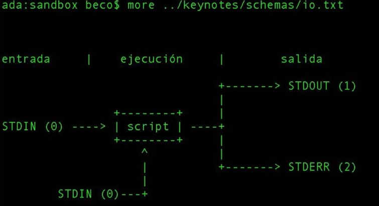
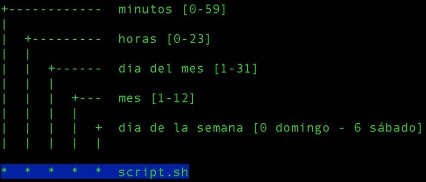

# Terminal y Línea de Comandos

```
                                                           $$$$$
                                                           $$$$$$$
               $                                           $$O$O$$
$$$$$$        $$$                                          $VVVVV$
  $$           $                                         $$  VVV  $$
  $$       $$$    $$$ $$$$   $$$    $$$  $$$$$ $$$$$    $          $$
  $$      $  $$    $$$    $$  $$     $$    $$   $$     $            $$
  $$     $   $$    $$     $$  $$     $$      $$$       $            $$$
  $$        $$$    $$     $$  $$     $$      $$$      QQ$           $$Q
  $$     $ $$$     $$     $$  $$     $$     $$ $$   QQQQQQ$       $QQQQQQ
  $$    $$ $$$ $   $$     $$  $$$   $$$    $$   $$  QQQQQQQ$     $QQQQQQQ
$$$$$$$$$$  $$$   $$$$   $$$$   $$$$ $$$ $$$$$ $$$$$  QQQQQ$$$$$$$QQQQQ
```

## <a name="INDEX">Índice</a>

- :link: [Documentos Linux](https://github.com/macknilan/Cuaderno/tree/master/Linux/docs_linux)
- [Ayuda](#1-Ayuda)
- [Chaining Operators](#2-Chaining-Operators)
- [Sistema de archivos](#3-Sistema-de-archivos)
  - [Rutas relativas y absolutas](#Rutas-relativas-y-absolutas)
  - [Comandos básicos](#Comandos-básicos)
  - [Listar directorios](#Listar-directorios)
  - [Búsqueda](#Búsqueda)
  - [Standard Input Standard Output y Standard Error](#Standard-Input-Standard-Output-y-Standard-Error)
  - [Crontab](#Crontab)
  - [Permisos](#Permisos)
  - [Enlaces simbólicos](#Enlaces-simbólicos)
- [Compresión y descompresión de archivos](#4-Compresión-y-descompresión-de-archivos)
- [Editando archivos](#5-Editando-archivos)
- [Introducción a SSH Olvídate del FTP](#6-Introducción-a-SSH-Olvídate-del-FTP)
  [[Volver al índice]](#INDEX)+ [Compresión de imagenes guetzli](#7-Compresión-de-imagenes-guetzli)
- [Compresión de imagenes mozjpeg](#8-Compresión-de-imagenes-mozjpeg)
- [How to Start Stop and Restart Services in Debian 10](#9-How-to-Start-Stop-and-Restart-Services-in-Debian-10)
- [Convertir videos gif mp4 y optimizarlos con ffmpeg](#10-Convertir-videos-gif-mp4-y-optimizarlos-con-ffmpeg)
- [How to List Installed Packages on Debian](#11-How-to-List-Installed-Packages-on-Debian)
- [Search For Available Packages From Command Line In Debian](#12-Search-For-Available-Packages-From-Command-Line-In-Debian)
- [APT Cheat Sheet](#13-APT-Cheat-Sheet)
- [History](#14-History)
- [Shortcuts and history](#15-shortcuts-and-history)
- [Bash basics](#16-bash-basics)
- [File commands](#17-file-commands)
- [Directory commands](#18-directory-commands)
- [Ssh, system info & network commands](#19-ssh-system-info-&-network-commands)
- [Variables](#20-variables)
- [Functions](#21-functions)
- [Flow controls](#22-flow-controls)
- [Command-line processing cycle](#23-command-line-processing-cycle)
- [Input/output redirectors](#24-input/output-redirectors)
- [Process handling](#25-process-handling)
- [Tips & tricks](#26-tips-&-tricks)
- [Debugging shell programs](#27-debugging-shell-programs)
- [Domain Information Groper](#28-domain-information-groper)

### 1. Ayuda

Podemos obtener ayuda sobre un comando de las siguientes maneras:

### Comando `man`

```bash
# Muestra el manual del comando
man <comando>
```

### Opción <code>--help</code>

```bash
# Muestra la ayuda del comando
<comando> --help
```

### Desde la web

[Explain Shell](http://explainshell.com/), un sitio que permite explicar específicamente la mayoría de comandos.

[[Volver al índice]](#INDEX)

### 2. Chaining Operators

This Article aims at throwing light on frequently used command­-chaining operators, with short descriptions and corresponding examples which surely will increase your productivity and lets you write short and meaningful codes beside reducing system load, at times.

#### 1. Ampersand Operator (&)

The function of `&` is to make the command run in background. Just type the command followed with a white space and `&`. You can execute more than one command in the background, in a single go.

Run one command in the background:

```bash
mack@localhost:~ping ­c5 www.mack.com &
```

Run two command in background, simultaneously:

```bash
root@localhost:/home/mack# apt-get update & apt-get upgrade &
```

#### 2. semi-colon Operator (;)

The semi-colon operator makes it possible to run, several commands in a single go and the execution of command occurs sequentially.

```bash
root@localhost:/home/mack# apt-get update ; apt-get upgrade ; mkdir test
```

The above command combination will first execute update instruction, then upgrade instruction and finally will create a `test` directory under the current working directory.

#### 3. AND Operator (&&)

The AND Operator (&&) would execute the second command only, if the execution of first command **SUCCEEDS**, i.e., **the exit status of the first command is 0**. This command is very useful in checking the execution status of last command.

For example, I want to visit website mack.com using links command, in terminal but before that I need to check if the host is live or not.

```bash
root@localhost:/home/mack# ping -c3 www.mack.com && links www.mack.com
```

#### 4. OR Operator (||)

The `OR` Operator **(||)** is much like an `else` statement in programming. The above operator allow you to execute second command only if the execution of first command fails, i.e., the exit status of first command is ‘1‘.

For example, I want to execute `apt-get update` from non-root account and if the first command fails, then the second `links www.mack.com` command will execute.

```bash
mack@localhost:~apt-get update || links mack.com
```

In the above command, since the user was not allowed to update system, it means that the exit status of first command is `1` and hence the last command ‘links mack.com‘ gets executed.

What if the first command is executed successfully, with an exit status `0`? Obviously! Second command won’t execute.

```bash
mack@localhost:~mkdir test || links mack.com
```

Here, the user creates a folder `test` in his home directory, for which user is permitted. The command executed successfully giving an exit status `0` and hence the last part of the command is not executed.

#### 5. NOT Operator (!)

The `NOT` Operator **(!)** is much like an `except` statement. This command will execute all except the condition provided. To understand this, create a directory `mack` in your home directory and `cd` to it.

```bash
mack@localhost:~mkdir mack
mack@localhost:~cd mack
```

Next, create several types of files in the folder `mack`.

```bash
mack@localhost:~/macktouch a.doc b.doc a.pdf b.pdf a.xml b.xml a.html b.html
```

See we’ve created all the new files within the folder `mack`.

```bash
mack@localhost:~/mackls
a.doc  a.html  a.pdf  a.xml  b.doc  b.html  b.pdf  b.xml
```

Now delete all the files except `html` file all at once, in a smart way.

```bash
mack@localhost:~/mackrm -r !(*.html)
```

Just to verify, last execution. List all of the available files using ls command.

```bash
mack@localhost:~/mackls

a.html  b.html
```

#### 6. AND – OR operator (&& – ||)

The above operator is actually a combination of `AND` and `OR` Operator. It is much like an `if-else` statement.

For example, let’s do ping to mack.com, if success echo `Verified` else echo `Host Down`.

```bash
mack@localhost:~/mackping -c3 www.mack.com && echo "Verified" || echo "Host Down"
```

Sample Output

```bash
PING www.mack.com (212.71.234.61) 56(84) bytes of data.
64 bytes from www.mack.com (212.71.234.61): icmp_req=1 ttl=55 time=216 ms
64 bytes from www.mack.com (212.71.234.61): icmp_req=2 ttl=55 time=224 ms
64 bytes from www.mack.com (212.71.234.61): icmp_req=3 ttl=55 time=226 ms

--- www.mack.com ping statistics ---
3 packets transmitted, 3 received, 0% packet loss, time 2001ms
rtt min/avg/max/mdev = 216.960/222.789/226.423/4.199 ms
Verified
```

Now, disconnect your internet connection, and try same command again.

```bash
mack@localhost:~/mackping -c3 www.mack.com && echo "verified" || echo "Host Down"
Sample Output
ping: unknown host www.mack.com
Host Down
```

#### 7. PIPE Operator (|)

This PIPE operator is very useful where the output of first command acts as an input to the second command. For example, pipeline the output of `ls -l` to `less` and see the output of the command.

```bash
mack@localhost:~ls -l | less
```

#### 8. Command Combination Operator {}

Combine two or more commands, the second command depends upon the execution of the first command.

For example, check if a directory `bin` is available or not, and output corresponding output.

```bash
mack@localhost:~[ -d bin ] || { echo Directory does not exist, creating directory now.; mkdir bin; } && echo Directory exists.
```

#### 9. Precedence Operator ()

The Operator makes it possible to execute command in precedence order.

```bash
Command_x1 &&Command_x2 || Command_x3 && Command_x4.
```

In the above pseudo command, what if the Command_x1 fails? Neither of the Command_x2, Command_x3, Command_x4 would executed, for this we use Precedence Operator, as:

```bash
(Command_x1 &&Command_x2) || (Command_x3 && Command_x4)
```

In the above pseudo command, if Command_x1 fails, Command_x2 also fails but Still Command_x3 and Command_x4 executes depends upon exit status of Command_x3.

#### 10. Concatenation Operator (\)

The Concatenation Operator **(\)** as the name specifies, is used to concatenate large commands over several lines in the shell. For example, The below command will open text file **test(1).txt**.

```bash
mack@localhost:~/Downloadsnano test\(1\).txt
```

[[Volver al índice]](#INDEX)

### 3. Sistema de archivos

Olvidémonos de C:, D:, E:, etc :)

[[Volver al índice]](#INDEX)

#### Rutas relativas y absolutas

En Linux, si existe el usuario <code>braulio</code>, entonces también existe una carpeta en la ruta <code>/home/braulio</code>.

Crearemos una carpeta dentro de <code>braulio</code> llamada <code>images</code>.

Entonces podemos acceder a estas carpetas mediante:

#### Ruta absoluta

```bash
# Para acceder a la carpeta images
cd /home/braulio/images

# Para acceder a la carpeta braulio
cd /home/braulio

# Para acceder a la carpeta home
cd /home
```

Donde el <code>/</code> inicial se refiere a la raiz del sistema de archivos.

#### Rutas relativas

```bash
# Si estuviera en la carpeta /home/braulio, accedo a images con:
cd images
cd ~/images
cd ./images

# Si estoy en la carpeta /home/braulio/images regreso a la carpeta padre con:
cd .. # /home/braulio

# Y a la carpeta padre del padre con:
cd ../.. # /home
```

Donde:

- El `~` significa la carpeta del usuario, es decir, /home/braulio.
- El `.` se refiere a la carpeta en sí misma.
- El `..` se refiere a la carpeta padre.

**[[Volver al índice]](#INDEX)**

[[Volver al índice]](#INDEX)

#### Comandos básicos

#### Creación de archivos y directorios

```bash
# Creamos el archivo index.html
touch index.html

# Creamos el directorio logs
mkdir logs

# Creamos varios directorios
mkdir media templates

# Creamos directorios dentro de directorios, aunque no existan
mkdir -p public/{images,css,js} # Crea el archivo public y dentro de este la carpeta images, css y js
```

#### Moverse entre directorios

```bash
# Cambiar a cierto directorio
cd <directorio>

# Ir al directorio padre
cd ..

# Ir al directorio /home/braulio desde cualquier lugar
cd ~
cd

# Ir al directorio raiz
cd /
```

#### Copiar, mover, renombrar, borrar

```bash
# Copiar directorio
cp braulio braulito
# Ahora tengo dos directorios, uno llamado braulio y otro braulito

# Copiar archivos
cp index.html inicio.html
# Ahora tengo dos archivos, uno llamado index.html y otro inicio.html

# Copiar archivos dentro de un directorio a otro
cp braulio/* otrodirectorio

# Copiar sólo los archivos html
cp braulio/*.html otrodirectorio

# Renombra la carpeta braulito a brau
mv braulito brau

# Mueve la carpeta brau al directorio padre
mv brau ..

# Mueve la carpeta index que está en la carpeta padre a mi directorio actual
mv ~/brau .

# Si no funciona podemos usar el parámetro -f (Force)
mv -f ~/brau .

# Borra un archivo
rm inicio.html

# Borra los archivos .html
rm *.html

# Borra una carpeta
rm -rf braulio
```

#### Descarga de archivos

```bash
# Descargar un archivo usando wget
wget http://nodejs.org/dist/v0.10.22/node-v0.10.22.tar.gz

# Descargar un archivo usando curl
curl http://nodejs.org/dist/v0.10.22/node-v0.10.22.tar.gz
```

#### Para los curiosos

```bash
# Ver el espacio ocupado en la carpeta actual
du

# Lo mismo pero para humanos
du -hs

# Ver el tamaño de cierto archivo
du -hs index.html

# Ver de cierta carpeta
du -hs mack

# Ver el espacio creado desde la pocisión actual con la profundidad de 1
du -h -d 1

# Ver mi directorio actual
pwd

# Ver el contenido de un archivo página por página
less archivo.html
# Después de verlo podemos salir presionando q

# Concatenar el contenido de varios archivos y mostrarlos
cat archivo.html estilo.css

# Ver desde donde se ejecuta un comando
which cat
# /bin/cat

# Ver como funciona cierto comando
type ls
# ls es un alias de 'ls --color=auto' (en Ubuntu)

# Ver todos los comandos que he escrito desde el inicio de los tiempos
less ~/.bash_history
```

**[[Volver al índice]](#INDEX)**

[[Volver al índice]](#INDEX)

#### Listar directorios

```bash

# Lista recursivamente la estructura de árbol de un directorio incluyendo tanto archivos
como directorios (**NOTA:** No viene pre-instalado así que hay que instalarlo primero con su
administrador de paquetes preferido: para RHEL/CentOS/Fedora yum install tree para
Debian/Mint/Ubuntu, para OS X `brew install tree`)
apt-get install tree

# Muestra recursivamente la estructura de árbol de un directorio pero sólo hasta el
primer subnivel de directorios
tree -L 1

# Muestra recursivamente la estructura de árbol de un directorio incluyendo tanto
archivos como directorio ocultos
tree -a

# Muestra recursivamente la estructura de árbol de un directorio tomando en cuenta
sólo los directorios
tree -d

# Muestra recursivamente la estructura de árbol de un directorio tomando en cuenta
sólo los directorios y hasta el primer subnivel
tree -dL 1


# Muestra carpetas y archivos en el directorio actual
ls

# Muestra carpetas y archivos en un directorio
ls <directorio>

# Muestra las carpetas y archivos incluyendo los ocultos, y los muestra en forma de columnas.
ls -la

# Similar al anterior en Ubuntu
ll

# Puedes crear tu propio comando con
alias myll='ls -la'

# Y lo usas con
myll

# Ver la salida anterior mostrando cierto patrón
ll | grep html
# Muestra la lista resaltando todos los que contienen el string html en su nombre

# Guardar la salida a un archivo
ll > listado1.txt
# Se crea un archivo listado1.txt con la salida de ll
```

[[Volver al índice]](#INDEX)

#### Búsqueda

##### find

```bash
# To find files by case-insensitive extension (ex: .jpg, .JPG, .jpG):
find . -iname "*.jpg"

# To find directories:
find . -type d

# To find files:
find . -type f

# To find files by octal permission:
find . -type f -perm 777

# To find files with setuid bit set:
find . -xdev \( -perm -4000 \) -type f -print0 | xargs -0 ls -l

# To find files with extension '.txt' and remove them:
find ./path/ -name '*.txt' -exec rm '{}' \;

# To find files with extension '.txt' and look for a string into them:
find ./path/ -name '*.txt' | xargs grep 'string'

# To find files with size bigger than 5 Mebibyte and sort them by size:
find . -size +5M -type f -print0 | xargs -0 ls -Ssh | sort -z

# To find files bigger than 2 Megabyte and list them:
find . -type f -size +200000000c -exec ls -lh {} \; | awk '{ print $9 ": " $5 }'

# To find files modified more than 7 days ago and list file information
find . -type f -mtime +7d -ls

# To find symlinks owned by a user and list file information
find . -type l --user=username -ls

# To search for and delete empty directories
find . -type d -empty -exec rmdir {} \;

# To search for directories named build at a max depth of 2 directories
find . -maxdepth 2 -name build -type d

# To search all files who are not in .git directory
find . ! -iwholename '*.git*' -type f

# To find all files that have the same node (hard link) as MY_FILE_HERE
find . -type f -samefile MY_FILE_HERE 2>/dev/null

# To find all files in the current directory and modify their permissions
find . -type f -exec chmod 644 {} \;
```

```bash
# Muestra todos los archivos y carpetas recursivamente dentro del directorio actual
find

# Lo mismo pero más complicado
find .

# Muestra recursivamente solo los archivos que tengan .html en la carpeta actual
find . -name \*.html

# Lo mismo
find . -name '*.html'

# Lo mismo pero con grep
find . | grep .html

# Lo mismo pero en otra carpeta
find <otracarpeta> | grep .html

# El comando locate guarda una base de datos de todos los archivos y carpetas que tenemos, actualiza estos cada cierto tiempo
# Para actualizarlo ahora mismo

updatedb

# Para encontrar cierto archivo o carpeta con el nombre brau
locate brau
```

##### grep

```bash
# Search a file for a pattern
grep pattern file

# Case insensitive search (with line numbers)
grep -in pattern file

# Recursively grep for string <pattern> in folder:
grep -R pattern folder

# Read search patterns from a file (one per line)
grep -f pattern_file file

# Find lines NOT containing pattern
grep -v pattern file

# You can grep with regular expressions
grep "^00" file  #Match lines starting with 00
grep -E "[0-9]{1,3}\.[0-9]{1,3}\.[0-9]{1,3}\.[0-9]{1,3}" file  #Find IP add

# Find all files which match {pattern} in {directory}
# This will show: "file:line my research"
grep -rnw 'directory' -e "pattern"

# Exclude grep from your grepped output of ps.
# Add [] to the first letter. Ex: sshd -> [s]shd
ps aux | grep '[h]ttpd'

# Colour in red {bash} and keep all other lines
ps aux | grep -E --color 'bash|$'
```

[[Volver al índice]](#INDEX)

#### Standard Input Standard Output y Standard Error



- STDIN = 0
- STDOUT = 1
- STDERR = 2

Independiente del lenguaje, cualquier programa tiene un flujo de entrada de datos, un flujo de salida y un modo de capturar errores.

En la terminal, podemos tener este mismo flujo de datos gracias a `“<” y “>”` `>>` es para **concatenar**.
Nuestro ejemplo fue:

```bash
# De un archivo llamado operaciones.bc, abrelo usando bc, y el resultado, mandalo a resultado
bc -q < operaciones.bc > resultado

# 1ro lee lo que se encuentra en "operaciones.bc" y lo manda a "bc -p", despues manda el STDOUT a "resultado" y los errores STDERR los manda al archivo errores
bc -p < operaciones.bc 1> resultado 2> errores

```

`| pipe` = Manda el STDOUT o el resultado a otro comando o programa:

```bash
cat operaciones.bc | bc -q
```

`> mayor que` = Imprime el STDOUT a un archivo

```bash
operaciones.bc > resultados.txt
```

`< menor que` = Lo mismo que el pipe, pero sin necesidad de ejecutar otro comando

```bash
bc -q < operaciones.bc
```

```python
# CODIGO PARA EJEMPLIFICAR STANDARD INPUT, STANDARD OUTPUT Y STANDARD ERROR
# standardIOERR.py
import  sys
import time
print"numero:"
d = input()
i = 0
while(True):
    i =i+1
    if((i % d) ==0):
            sys.stdout.write("El %d  es multiplo de %d \n " %(i,d))
    else:
            sys.stderr.write("NO!!! ALARMA: el %d No es multiplo de %d!!!\n" %(i,d))
    time.sleep(1)
```

[[Volver al índice]](#INDEX)

#### Crontab



Una de las herramientas más potentes de los sistemas UNIX, que nos permite programar la ejecución de diferentes scripts. Con crontab podemos agendar todo lo que necesitemos para facilitar nuestro trabajo y automatizar tareas.
`contrab -l` despliega el crontab que tenemos instalado. Cada una de las primeras 5 columnas que tenemos al correr este comando especifica en qué momento exacto queremos que se ejecute la tarea que vamos a definir en la sexta columna.

1. Columna 1: minuto 0-59
2. Columna 2: hora 0-23
3. Columna 3: día del mes 1-31
4. Columna 4: mes 1-12
5. Columna 5: día de la semana 0-7 (donde 0 y 7 equivalen a domingo)
6. Columna 6: script o comando que queremos que se ejecute

- `crontab -l`: Lista las tareas que tengo agendadas.
- `crontab -e`: Edita las tareas que tengo agendadas.

```bash
0          - todos los valores
1-10      - de 1 a 10
*/5        - cada 5
1,2,3,9    - ejecutate estas horas
```

[[Volver al índice]](#INDEX)

#### Permisos

Si usamos el listado en esta carpeta lo que encontremos es:

```bash
drwxr-xr-x  3 mack mack  4096 nov 22 09:35 ./
drwxrwxr-x 33 mack mack  4096 nov 21 23:13 ../
drwxrwxr-x  8 mack mack  4096 nov 22 10:18 .git/
-rw-rw-r--  1 mack mack 11325 nov 21 23:13 LICENSE
-rw-rw-r--  1 mack mack  6920 nov 22 10:18 README.md
```

Vemos 7 columnas las cuales indican:

1. Permisos
2. Directorios
3. Usuario
4. Grupo
5. Tamaño en bytes
6. Fecha de modificación
7. Archivo o directorio

Tomando la primera columna la dividimos en cuatro subcolumnas y las separamos por <code>|</code> para explicarlo mejor, en el caso del archivo README.md

```bash
-|rw-|rw-|r--
```

- La primera columna muestra <code>-</code> y nos indica que <code>README.md</code> es un archivo, caso contrario sería un directorio y mostraría <code>d</code>.

- La segunda columna muestra <code>rw-</code> y nos indica que este archivo tiene permisos de lectura (r), de escritura (w), mas no de ejecución(x) **por parte del usuario**.

- La tercera columna muestra <code>rw-</code> y nos indica que este archivo tiene permisos de lectura (r), de escritura (w), mas no de ejecución(x) **por parte del grupo**.

- La tercera columna muestra <code>r-</code> y nos indica que este archivo tiene permisos de lectura (r), mas no de escritura (w) ni de ejecución(x) **por parte de otros**.

#### Cambiando permisos

Cada permiso está representado por un número de la siguiente manera:

- Read (r) vale 4
- Write (w) vale 2
- Execute (x) vale 1

Sabiendo esto puedo cambiar los permisos del archivo index.html:

```bash
# Cambiando los permisos de index.html
chmod 775 index.html
```

Donde:

- El primer 7 viene de <code>4+2+1</code>, es decir, que <code>index.html</code> tiene permisos de <code>rwx</code> para el usuario.
- Igual que el anterior pero para el grupo.
- El 5 viene de <code>4+1</code>, es decir, que <code>index.html</code> tiene permisos de <code>r-x</code> para otros.

Para los directorios:

```bash
# Cambiando los permisos de la carpeta mack
chmod 444 mack
# Ahora la carpeta mack es de sólo lectura.

# Cambiando los permisos de la carpeta mack y de todo su contenido recursivamente
chmod -R 444 mack
```

#### Cambiando de propietario y grupo

```bash
# index.html pertenecía al usuario brau, ahora pertenecerá al usuario deicy
chown deicy index.html

# index.html pertenecía al grupo brau, ahora pertenecerá al grupo deicy
chgrp deicy index.html

# Juntando ambos comandos
chown deicy:deicy index.html
```

### Cambiando de usuario

```bash
# Estoy con el usuario braulio, y quiero usar el usuario deicy
su deicy

# Quiero ejecutar los comandos como root
sudo mkdir carpeta
# Crea una carpeta como superman
```

[[Volver al índice]](#INDEX)

#### Enlaces simbólicos

Los enlaces simbólicos sirven para tener una referencia a un archivo o carpeta y acceder a esta sin tener que ir a la ruta.

El ejemplo más básico lo vemos en los hostings que usan CPanel, donde encontramos la carpeta <code>public_html</code> y el enlace simbólico <code>www</code>, si entramos a ambos, veremos el mismo contenido.

```bash
# Para crear un enlace simbólico
ln -s path/to/the/target/directory name-of-symlink
```

```bash
# Creamos el enlace simbólico www para public_html
ln -ls ~/public_html ~/www
```

[[Volver al índice]](#INDEX)

### 4. Compresión y descompresión de archivos

### Descompresión

```bash
# Archivos tar.gz
tar -zxf archivo.tar.gz

# Archivos gz
gzip -d archivo.gz

# Archivos zip
unzip archivo.zip
```

### Compresión

```bash
# Empaqueto y comprimo la carpeta braulio y la llamo archivo.tar.gz
tar -czf archivo.tar.gz braulio

# Comprimo la carpeta braulio y la llamo archivo.gz
gzip -q archivo.gz

# Comprimo la carpeta braulio y la llamo archivo.zip
zip archivo.zip archivo
```

[[Volver al índice]](#INDEX)

### 5. Editando archivos

```bash
# Usando nano
nano index.html

# Usando vi
vi index.html

# Usando vim
vim index.html
```

- En _nano_ editamos el archivo y lo guardamos presionando <kbd>Ctrl</kbd> + <kbd>O</kbd>, salimos con <kbd>Ctrl</kbd> + <kbd>X</kbd>.
- En _vi_ o _vim_, para editar presionamos la tecla <kbd>i</kbd>, editamos lo que necesitamos, presionamos la tecla <kbd>Esc</kbd> y guardamos y salimos presionando <kbd>:wq</kbd>.

Más información en los [Recursos](#recursos).

[[Volver al índice]](#INDEX)

### 6. Introducción a SSH Olvídate del FTP

SSH (Secure Shell) es la manera rápida de acceder a equipos remotos y manejarlos mediante la consola.

### Llaves SSH

```bash
# Genero una llave SSH
ssh-keygen -t rsa -C "braulio@soncco.com"
```

- Primero nos pide un lugar donde estará guardado nuestra llave, generalmente está en el directorio <code>~/.ssh</code>
- Luego nos pide una contraseña, ponemos la que nos guste.
- Se han creado dos archivos:
  - <code>~/.ssh/id_rsa</code> (La clave privada)
  - <code>~/.ssh/id_rsa.pub</code> (La clave pública)

### Acceso remoto, olvidándonos de FTP

Pronto

**[[Volver al índice]](#INDEX)**

### 7. Recursos

### Comandos

- [Linux Command](http://www.linuxcommand.org/) - Aprender la consola
- [The Linux Cookbook](http://www.dsl.org/cookbook/cookbook_toc.html) - Tips y técnicas para uso diario
- [Linux in a Nutshell](http://my.safaribooksonline.com/0596009305?portal=oreilly) - Directorio de comandos Linux
- [Explain Shell](http://explainshell.com/) - Guía detallada de cada comando Linux

### Edición

- [Open VIM](http://www.openvim.com/) - Tutorial interactivo para aprender VIM

### Tips

- [8 Técnicas al usar la consola](http://www.howtogeek.com/110150/)

[[Volver al índice]](#INDEX)

### 7. Compresión de imagenes guetzli

- :link: [Guetzli Converter GUI](https://www.guetzliconverter.net/)
- :octocat: [Github guetzli](https://github.com/google/guetzli)
- :link: [Guetzli - JPEG Image Compression](http://blog.programster.org/guetzli-jpeg-image-compression)
- :link: [Essential Image Optimization](https://images.guide/)
- :link: [Google Blog/Announcing Guetzli: A New Open Source JPEG Encoder](https://ai.googleblog.com/2017/03/announcing-guetzli-new-open-source-jpeg.html)

```bash
sudo apt-get install guetzli
```

Como usar:

```bash
guetzli --quality 95 input.jpg output.jpg
```

> Guetzli should be called with quality >= 84, otherwise the output will have noticeable artifacts. If you want to proceed anyway, please edit the source code. Guetzli processing failed

```bash
Guetzli JPEG compressor. Usage:
guetzli [flags] input_filename output_filename

Flags:
  --verbose    - Print a verbose trace of all attempts to standard output.
  --quality Q  - Visual quality to aim for, expressed as a JPEG quality value.
                 Default value is 95.
  --memlimit M - Memory limit in MB. Guetzli will fail if unable to stay under
                 the limit. Default limit is 6000 MB.
  --nomemlimit - Do not limit memory usage.
```

[[Volver al índice]](#INDEX)

### 8. Compresión de imagenes mozjpeg

- :link: [Using mozjpeg to Create Efficient JPEGs](https://hacks.mozilla.org/2014/08/using-mozjpeg-to-create-efficient-jpegs/)
- :link: [Improved image compression: Installing mozjpeg on an Ubuntu Server](https://www.caseyhofford.com/2019/05/01/improved-image-compression-install-mozjpeg-on-ubuntu-server/)
- :octocat: [Github mozjpeg](https://gist.github.com/Kelfitas/f3fb99984698ccd79414c6a29e9f4edd)
- :octocat: [mozilla/mozjpeg](https://github.com/mozilla/mozjpeg)
- :link:[MozJPEG Guide](https://imagecompressor.io/blog/mozjpeg-guide/)
- :link: [How to Install mozjpeg](https://blarg.co.uk/blog/how-to-install-mozjpeg)

#### Instalar mozjpeg

```bash
sudo apt-get update
sudo apt-get install cmake autoconf automake libtool nasm make pkg-config
```

#### Clonar el repositorio

> Note: Do not download the zipped releases from <https://github.com/mozilla/mozjpeg/releases> , I initially tried using the tar.gz files here, but it looks like they are intended for windows computers.
> If you are getting an error that says you cannot use cmake, make sure you have downloaded the repo.

```bash
git clone https://github.com/mozilla/mozjpeg
```

#### Building mozjpeg for your system

```bash
cd mozjpeg
mkdir build && cd build
sudo cmake -G "Unix Makefiles" ../
```

Instalar el codigo compilado. Por defecto se instala en `/opt/mozjpeg`

```bash
sudo make install
```

El programa `cjpeg` esta instalado en `/opt/mozjpeg/cjpeg`. Se pude ejecutar desde esta dirección, pero es mejor hacer in link para el usuario sobre el que se esta trabajando.

```bash
cd /usr/local/bin
ln -s /opt/mozjpeg/bin/cjpeg
```

#### ejemplo

```bash
cjpeg -baseline -quality 90 foo.jpg > bar.jpg
```

### OTRA FORMA DE INSTALAR

Descargar la ultima versión

```bash
wget https://github.com/mozilla/mozjpeg/archive/v3.3.1.tar.gz
```

Ejecutar cada comando.

```bash
cd mozjpeg-1.0.1
autoreconf -fiv
mkdir build && cd build
sh ../configure
sudo make install
```

El programa `cjpeg` esta instalado en `/opt/mozjpeg/cjpeg`. Se pude ejecutar desde esta dirección, pero es mejor hacer in link para el usuario sobre el que se esta trabajando.

```bash
cd /usr/local/bin
ln -s /opt/mozjpeg/bin/cjpeg
```

#### ejemplo. opcionalmente se puede anteponer `sudo`

```bash
cjpeg -baseline -quality 90 foo.jpg > bar.jpg
```

[[Volver al índice]](#INDEX)

### 9. How to Start Stop and Restart Services in Debian 10

Ae ocupara para `init.d` y `systemctl`

```bash
systemctl start/stop/restart/reload clamav-daemon
#
sudo /etc/init.d/clamav-daemon start/stop/restart/reload
```

```bash
# systemctl
# Control the systemd system and service manager.

# List failed units:
systemctl --failed

# Start/Stop/Restart/Reload a service:
systemctl start/stop/restart/reload unit

# Show the status of a unit:
systemctl status unit

# Enable/Disable a unit to be started on bootup:
systemctl enable/disable unit

# Mask/Unmask a unit, prevent it to be started on bootup:
systemctl mask/unmask unit

# Reload systemd, scanning for new or changed units:
systemctl daemon-reload

```

Listar los servicios en debian 10

```bash
sudo ls /etc/init.d/
```

Para listar los servicios con más detalle

```bash
sudo systemctl list-unit-files
#
sudo systemctl list-units
#
sudo systemctl list-unit-files | grep clamav
```

Para revisar un servicio en particular con `init.d`

```bash
sudo /etc/init.d/clamav-daemon status
```

Para servisar el status de un servicio con `systemctl`

```bash
sudo systemctl status clamav-daemon
```

Para que un servicio no se ejecute/no se ejecute en el `boot`

Con `systemctl`

```bash
systemctl enable/disable clamav-daemon
```

Con `init.d`

```bash
sudo /etc/init.d/clamav-daemon enable/disable
```

[[Volver al índice]](#INDEX)

### 10. Convertir videos gif mp4 y optimizarlos con ffmpeg

- :link: [How to Install FFmpeg in Linux](https://www.tecmint.com/install-ffmpeg-in-linux/)
- :link: [Tecmint 15 Useful ‘FFmpeg’ Commands for Video, Audio and Image Conversion in Linux](https://www.tecmint.com/ffmpeg-commands-for-video-audio-and-image-conversion-in-linux/)
- :link: [How do I convert a video to GIF using ffmpeg, with reasonable quality?](https://superuser.com/questions/556029/how-do-i-convert-a-video-to-gif-using-ffmpeg-with-reasonable-quality)
- :link: [How to do I convert an animated gif to an mp4 or mv4 on the command line?](https://unix.stackexchange.com/questions/40638/how-to-do-i-convert-an-animated-gif-to-an-mp4-or-mv4-on-the-command-line)
- :link: [Optimizing Animated GIFs by Converting to HTML5 Video](https://rigor.com/blog/optimizing-animated-gifs-with-html5-video)
- :link: [HandBrake](https://flathub.org/apps/details/fr.handbrake.ghb)

#### How to Reduce Video File Size with FFmpeg (Command-Line)

```bash
ffmpeg -i name:video.mp4 -i name_video.mkv
```

Command-line - Compress and Convert H.264 to H.265 for Higher Compression

```bash
ffmpeg -i name_video.mp4 -vcodec libx265 -crf 28 name_video.mkv
```

1. Instalar HandBrake con Flathub

Convertir un video `mp4` a `gif` con `ffmpeg`

```bash
ffmpeg -i input.mp4 -vf "fps=10,scale=320:-1:flags=lanczos,split[s0][s1];[s0]palettegen[p];[s1][p]paletteuse" -loop 0 output.gif
```

Convertir un video `gif` a `mp4` con `ffmpeg`

```bash
ffmpeg -i animated.gif -movflags faststart -pix_fmt yuv420p -vf "scale=trunc(iw/2)*2:trunc(ih/2)*2" video.mp4
```

En el markdown para que se pueda ver el video se puede hacer de la siguiente manera

```html
<video autoplay="autoplay" loop="loop" width="400" height="300">
  <source src="video.mp4" type="video/mp4" />
  
</video>
```

[[Volver al índice]](#INDEX)

### 11. How to List Installed Packages on Debian

```bash
apt-cache pkgnames
```

```bash
apt-cache search [package-name-pattern]
```

```bash
apt-cache show [package-name]
```

```bash
sudo dpkg-query -l
#
sudo dpkg-query -l | grep -i [PACKAGE_NAME]
```

```bash
apt list --installed
#
apt list --installed | grep -i [PACKAGE_NAME]
```

```bash
dpkg --list
#
dpkg --list | grep -i [PACKAGE_NAME]
```

Contar cuantos programas estan instalados

```bash
sudo dpkg-query -f '${binary:Package}\n' -W | wc -l
```

List files in a package

```bash
dpkg -L [package-name]
```

```bash
dpkg --contents /path/to/redis_2.8.3-1_amd64.deb
```

Show packages containing a filename or filepath:

```bash
dpkg -S [filename-search-pattern]
```

```bash
dpkg -S /usr/share/man/man5
```

Show package information:

```bash
 dpkg -s [package-name]
```

```bash
dpkg -s screen
```

[[Volver al índice]](#INDEX)

### 12. Search For Available Packages From Command Line In Debian

```bash
sudo aptitude search <PACKAGE>
```

GUI Aptitude

```bash
sudo aptitude
```

Apt

```bash
sudo apt-cache search <PACKAGE>
```

Apt

```bash
apt search <PACKAGE>
```

[[Volver al índice]](#INDEX)

### 13. APT Cheat Sheet

- apt-get

  - install and --reinstall
  - remove
  - purge or --purge
  - upgrade
  - update
  - clean and autoclean

- apt-cache

  - pkgnames
  - search show

- dpkg

  - --list or -l
  - --install
  - --remove
  - --purge
  - --update
  - --contents

- Removing a Debian package:

  - sudo apt-get --purge remove [package-name]
  - sudo apt-get --purge remove [package-name] && sudo apt-get autoremove

- Clear the APT cache: `/var/cache/apt/archives/`
  - sudo apt-get clean
  - sudo apt-get autoclean

### 14. History

Para ejecutar el comando previo

```bash
!!
```

Buscar en el historial

```bash
history | grep [QUE_SE_BUSCA]
```

Ejecutar un comando en una linea especifica en el historial

```bash
!356
```

Guardar el historial en el archivo `.bash_history`

```bash
history -a
```

La opción escribe la lista completa del historial en el archivo de historial.

```bash
history -w
```

Limpia el historial

```bash
history -c
```

Eliminar una lista especifica del historial

```bash
history -d 365 375
```

Eliminar por completo el historial

```bash
history -c
history -w
```

[[Volver al índice]](#INDEX)

### 15. Shortcuts and history

```bash
CTRL+A  # move to beginning of line
CTRL+B  # moves backward one character
CTRL+C  # halts the current command
CTRL+D  # deletes one character backward or logs out of current session, similar to exit
CTRL+E  # moves to end of line
CTRL+F  # moves forward one character
CTRL+G  # aborts the current editing command and ring the terminal bell
CTRL+H  # deletes one character under cursor (same as DELETE)
CTRL+J  # same as RETURN
CTRL+K  # deletes (kill) forward to end of line
CTRL+L  # clears screen and redisplay the line
CTRL+M  # same as RETURN
CTRL+N  # next line in command history
CTRL+O  # same as RETURN, then displays next line in history file
CTRL+P  # previous line in command history
CTRL+Q  # resumes suspended shell output
CTRL+R  # searches backward
CTRL+S  # searches forward or suspends shell output
CTRL+T  # transposes two characters
CTRL+U  # kills backward from point to the beginning of line
CTRL+V  # makes the next character typed verbatim
CTRL+W  # kills the word behind the cursor
CTRL+X  # lists the possible filename completions of the current word
CTRL+Y  # retrieves (yank) last item killed
CTRL+Z  # stops the current command, resume with fg in the foreground or bg in the background

ALT+B   # moves backward one word
ALT+D   # deletes next word
ALT+F   # moves forward one word
ALT+H   # deletes one character backward
ALT+T   # transposes two words
ALT+.   # pastes last word from the last command. Pressing it repeatedly traverses through command history.
ALT+U   # capitalizes every character from the current cursor position to the end of the word
ALT+L   # uncapitalizes every character from the current cursor position to the end of the word
ALT+C   # capitalizes the letter under the cursor. The cursor then moves to the end of the word.
ALT+R   # reverts any changes to a command you’ve pulled from your history if you’ve edited it.
ALT+?   # list possible completions to what is typed
ALT+^   # expand line to most recent match from history

CTRL+X then (   # start recording a keyboard macro
CTRL+X then )   # finish recording keyboard macro
CTRL+X then E   # recall last recorded keyboard macro
CTRL+X then CTRL+E   # invoke text editor (specified by $EDITOR) on current command line then execute resultes as shell commands

BACKSPACE  # deletes one character backward
DELETE     # deletes one character under cursor

history   # shows command line history
!!        # repeats the last command
!<n>      # refers to command line 'n'
!<string> # refers to command starting with 'string'

exit      # logs out of current session
```

[[Volver al índice]](#INDEX)

### 16. Bash basics

```bash
env                 # displays all environment variables

echo $SHELL         # displays the shell you're using
echo $BASH_VERSION  # displays bash version

bash                # if you want to use bash (type exit to go back to your previously opened shell)
whereis bash        # locates the binary, source and manual-page for a command
which bash          # finds out which program is executed as 'bash' (default: /bin/bash, can change across environments)

clear               # clears content on window (hide displayed lines)
```

[[Volver al índice]](#INDEX)

### 17. File commands

```bash
ls                            # lists your files in current directory, ls <dir> to print files in a specific directory
ls -l                         # lists your files in 'long format', which contains the exact size of the file, who owns the file and who has the right to look at it, and when it was last modified
ls -a                         # lists all files in 'long format', including hidden files (name beginning with '.')
ln -s <filename> <link>       # creates symbolic link to file
readlink <filename>           # shows where a symbolic links points to
tree                          # show directories and subdirectories in easilly readable file tree
mc                            # terminal file explorer (alternative to ncdu)
touch <filename>              # creates or updates (edit) your file
mktemp -t <filename>            # make a temp file in /tmp/ which is deleted at next boot (-d to make directory)
cat <filename>                # prints file raw content (will not be interpreted)
any_command > <filename>      # '>' is used to perform redirections, it will set any_command's stdout to file instead of "real stdout" (generally /dev/stdout)
more <filename>               # shows the first part of a file (move with space and type q to quit)
head <filename>               # outputs the first lines of file (default: 10 lines)
tail <filename>               # outputs the last lines of file (useful with -f option) (default: 10 lines)
vim <filename>                # opens a file in VIM (VI iMproved) text editor, will create it if it doesn't exist
mv <filename1> <dest>         # moves a file to destination, behavior will change based on 'dest' type (dir: file is placed into dir; file: file will replace dest (tip: useful for renaming))
cp <filename1> <dest>         # copies a file
rm <filename>                 # removes a file
find . -name <name> <type>    # searches for a file or a directory in the current directory and all its sub-directories by its name
diff <filename1> <filename2>  # compares files, and shows where they differ
wc <filename>                 # tells you how many lines, words and characters there are in a file. Use -lwc (lines, word, character) to ouput only 1 of those informations
sort <filename>               # sorts the contents of a text file line by line in alphabetical order, use -n for numeric sort and -r for reversing order.
sort -t -k <filename>         # sorts the contents on specific sort key field starting from 1, using the field separator t.
rev                           # reverse string characters (hello becomes olleh)
chmod -options <filename>     # lets you change the read, write, and execute permissions on your files (more infos: SUID, GUID)
gzip <filename>               # compresses files using gzip algorithm
gunzip <filename>             # uncompresses files compressed by gzip
gzcat <filename>              # lets you look at gzipped file without actually having to gunzip it
lpr <filename>                # prints the file
lpq                           # checks out the printer queue
lprm <jobnumber>              # removes something from the printer queue
genscript                     # converts plain text files into postscript for printing and gives you some options for formatting
dvips <filename>              # prints .dvi files (i.e. files produced by LaTeX)
grep <pattern> <filenames>    # looks for the string in the files
grep -r <pattern> <dir>       # search recursively for pattern in directory
head -n file_name | tail +n   # Print nth line from file.
head -y lines.txt | tail +x   # want to display all the lines from x to y. This includes the xth and yth lines.

sed 's/<pattern>/<replacement>/g' <filename> # replace pattern in file with replacement value to std output the character after s (/) is the delimeter
sed -i 's/<pattern>/<replacement>/g' <filename> # replace pattern in file with replacement value in place
echo "this" | sed 's/is/at/g' # replace pattern from input stream with replacement value

[[ Volver al índice ]](#INDEX)

### 18. Directory commands
mkdir <dirname>               # makes a new directory
rmdir <dirname>               # remove an empty directory
rmdir -rf <dirname>           # remove a non-empty directory
mv <dir1> <dir2>              # rename a directory from <dir1> to <dir2>
cd                            # changes to home
cd ..                         # changes to the parent directory
cd <dirname>                  # changes directory
cp -r <dir1> <dir2>           # copy <dir1> into <dir2> including sub-directories
pwd                           # tells you where you currently are
cd ~                          # changes to home.
cd -                          # changes to previous working directory
```

[[Volver al índice]](#INDEX)

### 19. Ssh, system info & network commands

```bash
ssh user@host            # connects to host as user
ssh -p <port> user@host  # connects to host on specified port as user
ssh-copy-id user@host    # adds your ssh key to host for user to enable a keyed or passwordless login

whoami                   # returns your username
su <user>                # switch to a different user
su -                     # switch to root, likely needs to be sudo su -
sudo <command>           # execute command as the root user
passwd                   # lets you change your password
quota -v                 # shows what your disk quota is
date                     # shows the current date and time
cal                      # shows the month's calendar
uptime                   # shows current uptime
w                        # displays whois online
finger <user>            # displays information about user
uname -a                 # shows kernel information
man <command>            # shows the manual for specified command
info <command>           # shows another documentation system for the specific command
help                     # shows documentation about built-in commands and functions
df                       # shows disk usage
du <filename>            # shows the disk usage of the files and directories in filename (du -s give only a total)
last <yourUsername>      # lists your last logins
ps -u yourusername       # lists your processes
kill <PID>               # kills the processes with the ID you gave
killall <processname>    # kill all processes with the name
top                      # displays your currently active processes
lsof                     # lists open files
bg                       # lists stopped or background jobs ; resume a stopped job in the background
fg                       # brings the most recent job in the foreground
fg <job>                 # brings job to the foreground

ping <host>              # pings host and outputs results
whois <domain>           # gets whois information for domain
dig <domain>             # gets DNS information for domain
dig -x <host>            # reverses lookup host
wget <file>              # downloads file

time <command>             # report time consumed by command execution
```

[[Volver al índice]](#INDEX)

### 20. Variables

```bash
varname=value                # defines a variable
varname=value command        # defines a variable to be in the environment of a particular subprocess
echo $varname                # checks a variable's value
echo $$                      # prints process ID of the current shell
echo $!                      # prints process ID of the most recently invoked background job
echo $?                      # displays the exit status of the last command
read <varname>               # reads a string from the input and assigns it to a variable
read -p "prompt" <varname>   # same as above but outputs a prompt to ask user for value
column -t <filename>         # display info in pretty columns (often used with pipe)
let <varname> = <equation>   # performs mathematical calculation using operators like +, -, *, /, %
export VARNAME=value         # defines an environment variable (will be available in subprocesses)

array[0]=valA                # how to define an array
array[1]=valB
array[2]=valC
array=([2]=valC [0]=valA [1]=valB)  # another way
array=(valA valB valC)              # and another

${array[i]}                  # displays array's value for this index. If no index is supplied, array element 0 is assumed
${#array[i]}                 # to find out the length of any element in the array
${#array[@]}                 # to find out how many values there are in the array

declare -a                   # the variables are treated as arrays
declare -f                   # uses function names only
declare -F                   # displays function names without definitions
declare -i                   # the variables are treated as integers
declare -r                   # makes the variables read-only
declare -x                   # marks the variables for export via the environment

${varname:-word}             # if varname exists and isn't null, return its value; otherwise return word
${varname:word}              # if varname exists and isn't null, return its value; otherwise return word
${varname:=word}             # if varname exists and isn't null, return its value; otherwise set it word and then return its value
${varname:?message}          # if varname exists and isn't null, return its value; otherwise print varname, followed by message and abort the current command or script
${varname:+word}             # if varname exists and isn't null, return word; otherwise return null
${varname:offset:length}     # performs substring expansion. It returns the substring of $varname starting at offset and up to length characters

${variable#pattern}          # if the pattern matches the beginning of the variable's value, delete the shortest part that matches and return the rest
${variable##pattern}         # if the pattern matches the beginning of the variable's value, delete the longest part that matches and return the rest
${variable%pattern}          # if the pattern matches the end of the variable's value, delete the shortest part that matches and return the rest
${variable%%pattern}         # if the pattern matches the end of the variable's value, delete the longest part that matches and return the rest
${variable/pattern/string}   # the longest match to pattern in variable is replaced by string. Only the first match is replaced
${variable//pattern/string}  # the longest match to pattern in variable is replaced by string. All matches are replaced

${#varname}                  # returns the length of the value of the variable as a character string

*(patternlist)               # matches zero or more occurrences of the given patterns
+(patternlist)               # matches one or more occurrences of the given patterns
?(patternlist)               # matches zero or one occurrence of the given patterns
@(patternlist)               # matches exactly one of the given patterns
!(patternlist)               # matches anything except one of the given patterns

$(UNIX command)              # command substitution: runs the command and returns standard output
```

[[Volver al índice]](#INDEX)

### 21. Functions

```bash
# The function refers to passed arguments by position (as if they were positional parameters), that is, $1, $2, and so forth.
# $@ is equal to "$1" "$2"... "$N", where N is the number of positional parameters. $# holds the number of positional parameters.


function functname() {
  shell commands
}

unset -f functname  # deletes a function definition
declare -f          # displays all defined functions in your login session

[[ Volver al índice ]](#INDEX)


### 22. Flow controls

statement1 && statement2  # and operator
statement1 || statement2  # or operator

-a                        # and operator inside a test conditional expression
-o                        # or operator inside a test conditional expression

# STRINGS

str1 == str2               # str1 matches str2
str1 != str2               # str1 does not match str2
str1 < str2                # str1 is less than str2 (alphabetically)
str1 > str2                # str1 is greater than str2 (alphabetically)
str1 \> str2               # str1 is sorted after str2
str1 \< str2               # str1 is sorted before str2
-n str1                    # str1 is not null (has length greater than 0)
-z str1                    # str1 is null (has length 0)

# FILES

-a file                   # file exists or its compilation is successful
-d file                   # file exists and is a directory
-e file                   # file exists; same -a
-f file                   # file exists and is a regular file (i.e., not a directory or other special type of file)
-r file                   # you have read permission
-s file                   # file exists and is not empty
-w file                   # your have write permission
-x file                   # you have execute permission on file, or directory search permission if it is a directory
-N file                   # file was modified since it was last read
-O file                   # you own file
-G file                   # file's group ID matches yours (or one of yours, if you are in multiple groups)
file1 -nt file2           # file1 is newer than file2
file1 -ot file2           # file1 is older than file2

# NUMBERS

-lt                       # less than
-le                       # less than or equal
-eq                       # equal
-ge                       # greater than or equal
-gt                       # greater than
-ne                       # not equal

if condition
then
  statements
[elif condition
  then statements...]
[else
  statements]
fi

for x in {1..10}
do
  statements
done

for name [in list]
do
  statements that can use $name
done

for (( initialisation ; ending condition ; update ))
do
  statements...
done

case expression in
  pattern1 )
    statements ;;
  pattern2 )
    statements ;;
esac

select name [in list]
do
  statements that can use $name
done

while condition; do
  statements
done

until condition; do
  statements
done
```

[[Volver al índice]](#INDEX)

### 23. Command-line processing cycle

```bash
# The default order for command lookup is functions, followed by built-ins, with scripts and executables last.
# There are three built-ins that you can use to override this order: `command`, `builtin` and `enable`.

command  # removes alias and function lookup. Only built-ins and commands found in the search path are executed
builtin  # looks up only built-in commands, ignoring functions and commands found in PATH
enable   # enables and disables shell built-ins

eval     # takes arguments and run them through the command-line processing steps all over again
```

[[Volver al índice]](#INDEX)

### 24. Input/output redirectors

```bash
cmd1|cmd2  # pipe; takes standard output of cmd1 as standard input to cmd2
< file     # takes standard input from file
> file     # directs standard output to file
>> file    # directs standard output to file; append to file if it already exists
>|file     # forces standard output to file even if noclobber is set
n>|file    # forces output to file from file descriptor n even if noclobber is set
<> file    # uses file as both standard input and standard output
n<>file    # uses file as both input and output for file descriptor n
n>file     # directs file descriptor n to file
n<file     # takes file descriptor n from file
n>>file    # directs file description n to file; append to file if it already exists
n>&        # duplicates standard output to file descriptor n
n<&        # duplicates standard input from file descriptor n
n>&m       # file descriptor n is made to be a copy of the output file descriptor
n<&m       # file descriptor n is made to be a copy of the input file descriptor
&>file     # directs standard output and standard error to file
<&-        # closes the standard input
>&-        # closes the standard output
n>&-       # closes the ouput from file descriptor n
n<&-       # closes the input from file descriptor n

|tee <file># output command to both terminal and a file (-a to append to file)
```

[[Volver al índice]](#INDEX)

### 25. Process handling

```bash
# To suspend a job, type CTRL+Z while it is running. You can also suspend a job with CTRL+Y.
# This is slightly different from CTRL+Z in that the process is only stopped when it attempts to read input from terminal.
# Of course, to interrupt a job, type CTRL+C.

myCommand &  # runs job in the background and prompts back the shell

jobs         # lists all jobs (use with -l to see associated PID)

fg           # brings a background job into the foreground
fg %+        # brings most recently invoked background job
fg %-        # brings second most recently invoked background job
fg %N        # brings job number N
fg %string   # brings job whose command begins with string
fg %?string  # brings job whose command contains string

kill -l               # returns a list of all signals on the system, by name and number
kill PID              # terminates process with specified PID
kill -s SIGKILL 4500  # sends a signal to force or terminate the process
kill -15 913          # Ending PID 913 process with signal 15 (TERM)
kill %1               # Where %1 is the number of job as read from 'jobs' command.

ps           # prints a line of information about the current running login shell and any processes running under it
ps -a        # selects all processes with a tty except session leaders

trap cmd sig1 sig2  # executes a command when a signal is received by the script
trap "" sig1 sig2   # ignores that signals
trap - sig1 sig2    # resets the action taken when the signal is received to the default

disown <PID|JID>    # removes the process from the list of jobs

wait                # waits until all background jobs have finished
sleep <number>      # wait # of seconds before continuing

pv                  # display progress bar for data handling commands. often used with pipe like |pv
yes                 # give yes response everytime an input is requested from script/process
```

[[Volver al índice]](#INDEX)

### 26. Tips & tricks

```bash
# set an alias

cd; nano .bash_profile

> alias gentlenode='ssh admin@gentlenode.com -p 3404' # add your alias in .bash_profile

# to quickly go to a specific directory

cd; nano .bashrc

> shopt -s cdable_vars
> export websites="/Users/mac/Documents/websites"

source .bashrc
cd $websites

```

[[Volver al índice]](#INDEX)

### 27. Debugging shell programs

```bash
bash -n scriptname  # don't run commands; check for syntax errors only
set -o noexec       # alternative (set option in script)

bash -v scriptname  # echo commands before running them
set -o verbose      # alternative (set option in script)

bash -x scriptname  # echo commands after command-line processing
set -o xtrace       # alternative (set option in script)

trap 'echo $varname' EXIT  # useful when you want to print out the values of variables at the point that your script exits

function errtrap {
  es=$?
  echo "ERROR line $1: Command exited with status $es."
}

trap 'errtrap $LINENO' ERR  # is run whenever a command in the surrounding script or function exits with non-zero status

function dbgtrap {
  echo "badvar is $badvar"
}

trap dbgtrap DEBUG  # causes the trap code to be executed before every statement in a function or script
# ...section of code in which the problem occurs...
trap - DEBUG  # turn off the DEBUG trap

function returntrap {
  echo "A return occurred"
}

trap returntrap RETURN  # is executed each time a shell function or a script executed with the . or source commands finishes executing
```

[[Volver al índice]](#INDEX)

### 28. Domain Information Groper

#### dig

Este comando es util para verificar problemas con DNS y sirve tambien para realizar busquedas para mostrar el resultado de la busqueda retorna desde el servidor al que se le hace la peticion

Query Domain “A” Record

```shell
dig yahoo.com
```

Query Domain “A” Record with +short

```shell
dig yahoo.com +short
```

Querying MX Record for Domain(Mail eXchange)

```shell
dig yahoo.com MX
```

Querying SOA Record for Domain

```shell
dig yahoo.com SOA
```

Querying TTL Record for Domain

```shell
dig yahoo.com TTL
```

Querying Only Answer Section

```shell
dig yahoo.com +nocomments +noquestion +noauthority +noadditional +nostats
```

Querying ALL DNS Records Types

```shell
dig yahoo.com ANY +noall +answer
```

DNS Reverse Look-up

```shell
dig -x 72.30.38.140 +short
```

Multiples DNS

```shell
dig yahoo.com mx +noall +answer redhat.com ns +noall +answer
```

#### nslookup

Encontrar record(direccion IP) tipo "A" de un dominio

```shell
nslookup yahoo.com
```

Búsqueda inversa de dominios

```shell
nslookup 209.191.122.70
```

Búsqueda de dominios específicos

```shell
nslookup ir1.fp.vip.mud.yahoo.com.
```

Query MX (Mail Exchange) record.

```shell
nslookup -query=mx www.yahoo.com
```

Query NS(Name Server) record.

```shell
nslookup -query=ns www.yahoo.com
```

Query SOA (Start of Authority) record.

```shell
nslookup -type=soa www.yahoo.com
```

Query all Available DNS records.

```shell
nslookup -query=any yahoo.com
```

_Debug_ mode

```shell
nslookup -debug yahoo.com
```

[[Volver al índice]](#INDEX)
