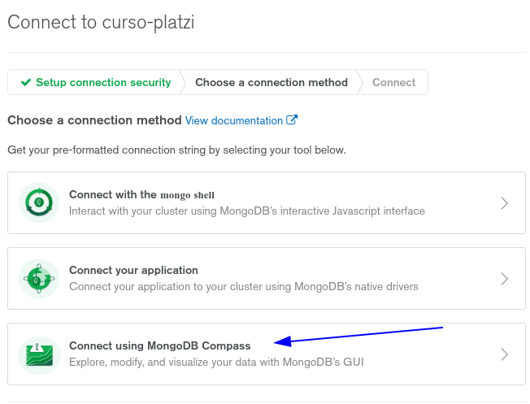

# Curso Básico de MongoDB

## 1. Introducción
### 1. Introducción y bienvenida

El proyecto del curso es PlatziMongo, una API que responde las clases que hemos subido a la plataforma y esta hecha en Python con Flask.

### 2. Bases de datos 

Las bases de datos NoSQL tienen 4 grandes familias: Key Value Stores, basadas en grafos, columnares y basadas en documentos.

1. **Key Value Stores**: Guardan la información en formato de llaves y valores. Las usamos para guardar cache, información de sesión de los usuarios o cosas muy sencillas. Son muy rápidas de consultar pero no podemos usarlas en casos más complejos donde necesitamos estructuras más especiales. El mejor ejemplo de estas bases de datos es Redis.
2. **Graph Databases**: Bases de datos basadas en Grafos. Nos permiten establecer conexiones entre nuestras entidades para realizar consultas de una forma más eficiente que en bases de datos relacionales (así como Twitter o Medium donde cada publicación tiene diferentes relaciones entre sus usuarios, likes, etc). Por ejemplo: Neo4j o JanusGraph.
3. **Wide-column Stores**: Bases de datos columnares. Tienen una llave de fila y otra de columnas para hacer consultas muy rápidas y guardar grandes cantidades de información pero modelar los datos se puede volver un poco complicado. Las usamos en Big Data, IoT, sistemas de recomendaciones, entre otras. Por ejemplo: Cassandra o HBase.
4. **Document Databases**: Bases de datos basadas en documentos. Nos permiten guardar documentos dentro de colecciones, tiene muy buena performance y flexibilidad que nos permite modelar casos de la vida real de forma sencilla y efectiva. Por ejemplo: MongoDB o CouchBase.

### 3. Definición de MongoDB y su ecosistema (herramientas de uso)

MongoDB es una base de datos gratis y de código abierto _No Relacional_ basada en documentos que nos permite guardar una gran cantidad de documentos de forma distribuida. Mongo también es el nombre de la compañía que desarrolla el código de esta base de datos.

_Una de sus principales características es que nos permite guardar nuestras estructuras o documentos en formato JSON_ (no exactamente JSON, pero si algo muy parecido, lo veremos más adelante) para tener una gran flexibilidad a la hora de modelar situaciones de la vida real.

_Por ser una base de datos distribuida podemos hablar no de uno sino de varios servidores, lo que conocemos como el Cluster de MongoDB_. Gracias a esto obtenemos una gran escalabilidad de forma horizontal (escalabilidad en cantidad de servidores).

MongoDB es _“Schema Less_” lo que permite que nuestros documentos tengan estructuras diferentes sin afectar su funcionamiento, algo que no podemos hacer con las tablas de las bases de datos relacionales. Su lenguaje para realizar queries, índices y agregaciones es muy expresivo.

+ Ecosistema MongoDB
    - Mongodb Server
    - Mobile
    - Stich(server less)
    - Community
    - Enterprice (Necesitamos licencia)
    - Atlas (Cloud)
    - Mongodb Shell: Consola de comandos
    - Mongodb Compass: Visor gráfico
    - Conectores: librerias de comunicacion
    - Mongodb charts: Herramientas de Bi

### 4. MondoDB Atlas

Tenemos varios proveedores que nos permiten utilizar o alquilar MongoDB como servicio y en este caso vamos a usar MongoDB Atlas por ser desarrollado por las mismas personas que desarrollan MongoDB.

- :link: [MongoDB Atlas](https://www.mongodb.com/cloud/atlas) tiene las siguientes características:
- :link: [m-clusters](https://www.m-clusters.com/)
- :link: [mLab](https://mlab.com/)
- :link: [ScaleGrid](https://scalegrid.io/)

* Aprovisionamiento automático de clusters con MongoDB
* Alta disponibilidad
* Altamente escalable
* Seguro
* Disponible en AWS, GCP y Microsoft Azure
* Fácil monitoreo y optimización

### 5. Instalación MongoDB en Windows
### 6. Instalación MongoDB Mac/Linux

Antes de instalar verificar que version instalar de MongoDB Community Server :arrow_down: [MongoDB Community Server](https://www.mongodb.com/try/download/community)

:link: [Install MongoDB Community Edition on Debian](https://docs.mongodb.com/manual/tutorial/install-mongodb-on-debian/)

1. Install the packages required for adding a new repository:
```bash
$ sudo apt install dirmngr gnupg apt-transport-https software-properties-common ca-certificates curl
```

2. Add the MongoDB GPG key to your system:
```bash
$ curl -fsSL https://www.mongodb.org/static/pgp/server-4.2.asc | sudo apt-key add -
```

3. Enable the MongoDB repository:
```bash
$ echo "deb [arch=amd64] http://repo.mongodb.org/apt/debian buster/mongodb-org/4.2 main" | sudo tee /etc/apt/sources.list.d/mongodb-org-4.2.list
```
Packages with older versions of MongoDB are not available for Debian 10.

4. Update the packages list and install the mongodb-org meta-package:
```bash
$ sudo apt update
$ sudo apt install mongodb-org
```
The following packages will be installed on the system as a part of the mongodb-org package:

- `mongodb-org-server` - The mongod daemon and corresponding init scripts and configurations.
- `mongodb-org-mongos` - The mongos daemon.
- `mongodb-org-shell` - The mongo shell is an interactive JavaScript interface to MongoDB. It is used to perform administrative tasks through the command line.
- `mongodb-org-tools` - Contains several MongoDB tools for importing and exporting data, statistics, as well as other utilities.

5. Start the MongoDB service and enable it to start on boot:
```bash
$ sudo systemctl enable mongod --now
```
You can follow the state of the process for errors or important messages by watching the output in the `/var/log/mongodb/mongod.log` file

If you receive an error similar to the following when starting mongod:
```bash
Failed to start mongod.service: Unit mongod.service not found.
```
Run the following command first:
```bash
sudo systemctl daemon-reload
```

```bash
# ESTATUS
$ sudo systemctl status mongod
# START
$ sudo systemctl start mongod
# RESTART
$ sudo systemctl restart mongod
# STOP
$ sudo systemctl stop mongod
```

6. To verify whether the installation has completed successfully, connect to the MongoDB database server using the mongo tool and print the connection status:
```bash
$ mongo --eval 'db.runCommand({ connectionStatus: 1 })'
```
The output will look like this:
```bash
MongoDB shell version v4.2.1
connecting to: mongodb://127.0.0.1:27017/?compressors=disabled&gssapiServiceName=mongodb
Implicit session: session { "id" : UUID("09f11c53-605f-44ad-abec-ec5801bb6b06") }
MongoDB server version: 4.2.1
{
	"authInfo" : {
		"authenticatedUsers" : [ ],
		"authenticatedUserRoles" : [ ]
	},
	"ok" : 1
}
```
A value of 1 for the ok field indicates success.

**Begin using MongoDB.**   
_Start a mongo shell_ on the same host machine as the mongod. You can run the mongo shell without any command-line options to connect to a mongod that is running on your localhost with default port 27017:
```bash
$ mongo
```

**Configuring MongoDB**

The MongoDB configuration file is named `mongod.conf` and is located in the `/etc directory`. The file is in **YAML format**.

The default configuration settings are sufficient for most users. However, for production environments, it is recommended to uncomment the security section and enable authorization, as shown below:

```bash
# /etc/mongod.conf
security:
  authorization: enabled
```

The authorization option enables **Role-Based Access Control** (_RBAC_) that regulates users access to database resources and operations. If this option is disabled, each user can access all databases and perform any action.

After editing the configuration file, restart the mongod service for changes to take effect:
```bash
$ sudo systemctl restart mongod
```

To find more information about the configuration options available in MongoDB 4.2, visit the :link: [Configuration File Options documentation page](https://docs.mongodb.com/manual/reference/configuration-options/).

Creating Administrative MongoDB User   
If you enabled the MongoDB authentication, you’ll need to create an administrative user that can access and manage the MongoDB instance. To do so, access the mongo shell with:
```bash
$ mongo
```
From inside the MongoDB shell, type the following command to connect to the admin database:
```bash
use admin
```
```bash
OUTPUT
switched to db admin
```
Issue the following command to create a new user named _mongoAdmin_ with the _userAdminAnyDatabase_ role:
```bash
db.createUser(
  {
    user: "mongoAdmin", 
    pwd: "changeMe", 
    roles: [ { role: "userAdminAnyDatabase", db: "admin" } ]
  }
)
```

```bash
Successfully added user: {
	"user" : "mongoAdmin",
	"roles" : [
		{
			"role" : "userAdminAnyDatabase",
			"db" : "admin"
		}
	]
}
```
> You can name the administrative MongoDB user as you want.

Exit the mongo shell with:
```bash
quit()
```
To test the changes, access the mongo shell using the administrative user you have previously created:
```bash
$ mongo -u mongoAdmin -p --authenticationDatabase admin
```
Enter the password when prompted. Once you are inside the MongoDB shell connect to the _admin_ database:
```bash
use admin
```
```bash
OUTPUT
switched to db admin
```
Now, print the users with:
```bash
show users
```
```bash
{
	"_id" : "admin.mongoAdmin",
	"userId" : UUID("cdc81e0f-db58-4ec3-a6b8-829ad0c31f5c"),
	"user" : "mongoAdmin",
	"db" : "admin",
	"roles" : [
		{
			"role" : "userAdminAnyDatabase",
			"db" : "admin"
		}
	],
	"mechanisms" : [
		"SCRAM-SHA-1",
		"SCRAM-SHA-256"
	]
}
```
:link: [The MongoDB 4.2 Manual](https://docs.mongodb.com/manual/)


### 7. Mongo Shell, configuración de clientes
Cuando se crea el cluster en :link: [momgodb](https://www.mongodb.com/) con su usuario y con los permisos de red para poder conectar mongo shell desde la maquina local

Conectar con el cluster de mongodb


Seleccionar conectar desde mongo shell


Copiar la lina de comando y remplazar `<dbname>` por el nombre de nustra BD "SI" es que se desdea conecctar a una BD creada, de lo contrario borrar `/<dbname>` para que se conecte al cluster
```bash
$ mongo "mongodb+srv://curso-platzi-3sjcq.mongodb.net" --username admin_user_c_mongo
```


1. correr MongoDB
```bash
$ mongo
```
2. crear y usar DB
```bash
$ use <DBNAME>
```
Mostrar la BD que se acaba de crear
```bash
$ db
```
3. listar DBs
```bash
$ show dbs
```
4. crear colección e insertar documento
```bash
$ db.<COLLECTION_NAME>.insertOne({"name":"NombrePropio"})
```
5. listar documentos de colección
```bash
$ db.<COLLECTION_NAME>.find()
```
6. listar las colecciones
```bash
$ show collections
```
7. mostrar un documento cualquiera
```bash
$ db.<COLLECTION_NAME>.findOne()
```
8. saber que DB estamos usando
```bash
$ db
```

Instalar GUI para mongo de :link: [MongoDB Compass](https://www.mongodb.com/try/download/compass)

[Archivo .deb para Debian 10](https://downloads.mongodb.com/compass/mongodb-compass_1.21.2_amd64.deb)

```bash
sudo dpkg -i mongodb-compass_1.21.2_amd64.deb
```

Hacer nueva coneccion que se obtiene de   


Selecionar el tipo de coneccion para la GUI de maogo compass   


Copiar el string para pegarlo en mongoDB compass "añadiendo nuestro password"   


### 8. MongoDB + Drivers

MongoDB es una base de datos open source, NoSQL y basada en documentos que nos permite guardar una gran cantidad información de forma distribuida. Mongo también es el nombre de la compañía que desarrolla el código de esta base de datos. 

Los drivers de MongoDB son librerías oficiales o desarrolladas por la comunidad que podemos usar para comunicar nuestras aplicaciones con las bases de datos. Una de las más populares es Mongoid, un **ORM** que convierte nuestros código Ruby en queries que entiende nuestra base de datos.

:link: [MongoDB Dirvers](https://docs.mongodb.com/drivers/)

Arquitectura   


Se agregan con el trontl de dependencias 
```bash
npm install mongodb --save
```

## 2. Operaciones CRUD
### 9. Bases de datos, Colecciones y Documentos en MongoDB

- :link: [MongoDB CRUD Operations](https://docs.mongodb.com/manual/crud/)
- :link: [Collection Methods](https://docs.mongodb.com/manual/reference/method/js-collection/)
- :link: :octocat: [ karlseguin / the-little-mongodb-book ](https://github.com/karlseguin/the-little-mongodb-book)

Las Bases de Datos son los contenedores físicos para nuestras colecciones. Cada base de datos tiene un archivo propio en el sistema de archivos de nuestra computadora o servidor y un Cluster puede tener múltiples bases de datos.

**Las Colecciones** son agrupaciones de documentos. _Son equivalentes a las tablas_ en bases de datos relacionales pero NO nos imponen un esquema o estructura rígida para guardar información.

**Los Documentos** son registros dentro de las colecciones. _Son la unidad básica de MongoDB_ y son análogos a los objetos JSON pero en realidad son BSON(TRANSFORMACIÓN BINARIA DE UN JSON PERMITE MAYORES TIPOS DE DATOS AL MOMENTO DE GUARDAR).

Representación gráfica mongoDB   


+ Base de datos:
    - Contenedor físico de colecciones.
    - Cada base de datos tiene su archivo propio en el sistema de archivos.
    - Un cluster puede tener múltiples bases de datos.
+ Colecciones:
    + Agrupación de documentos.
    + Equivalente a una tabla en las bases de datos relacionales.
    + No impone un esquema.
+ Documentos:
    - Un registro dentro de una colección.
    - Es análogo a un objeto JSON (BSON).
    - La unidad básica dentro de MongoDB.

Comparacion DB relacional a mongoDB   


### 10. Operaciones CRUD desde la consola de MongoDB

+ Conexión con el cluster de MongoDB Atlas: mongo "URL DE NUESTRO CLUSTER", (recuerda añadir tu IP a la lista de IPs permitidas para no tener problemas en esta parte).
+ Listar las bases de datos de nuestro cluster: `show dbs`
+ Seleccionar una base de datos: `use NOMBRE_BD`. Debemos crear por lo menos un documento si la base de datos es nueva porque _MongoDB no crea bases de datos vacías_.
+ Recordar qué base de datos estamos usando: `db`
+ Listar las colecciones de nuestra base de datos: `show collections`
+ Crear una colección (opcional) y añadir un elemento en formato JSON: `db.NOMBRE_COLECCIÓN.insertOne({ ... })`. La base de datos responde `true` si la operación fue exitosa y crea el campo irrepetible de `_id` si nosotros no lo especificamos.
+ Crear una colección (opcional) y añadir algunos elementos en formato JSON: `db.NOMBRE_COLECCIÓN.insertMany([{ ... }, { ... }])`. Recibe un array de elementos y devuelve todos los IDs de los elementos que se crearon correctamente.
+ Encontrar elementos en una colección: `db.NOMBRE_COLECCIÓN.find()` Podemos aplicar filtros si queremos o encontrar solo el primer resultado con el método `findOne()`.
+ Listar todos los posibles comandos que podemos ejecutar: `db.NOMBRE_COLECCIÓN.help()`.


##### Conectarse a MongoDB
Para conectarnos desde la linea de comando "mongo shell" se tiene que copiar el link para la BD de mongoDB de atlas y escribir nuestra contraseña   


```bash
mongo "mongodb+srv://curso-platzi-3sjcq.mongodb.net" --username admin_user_c_mongo
```
##### Usar la base de datos creada de platzi
```bash
use platzi-db
```


##### El campo _id si no es agregado por nosotros de forma explícita, MongoDB lo agrega por nosotros como un ObjectId
##### el campo _id es obligatorio en todos los documentos

##### ---------------------------------Create-----------------------------
```bash
db.inventory_cusro_platzi.insertOne(
   { item: "canvas", qty: 100, tags: ["cotton"], size: { h: 28, w: 35.5, uom: "cm" } }
)
```

```bash
db.inventory_cusro_platzi.insertMany( [
   { item: "canvas", qty: 100, size: { h: 28, w: 35.5, uom: "cm" }, status: "A" },
   { item: "journal", qty: 25, size: { h: 14, w: 21, uom: "cm" }, status: "A" },
   { item: "mat", qty: 85, size: { h: 27.9, w: 35.5, uom: "cm" }, status: "A" },
   { item: "mousepad", qty: 25, size: { h: 19, w: 22.85, uom: "cm" }, status: "P" },
   { item: "notebook", qty: 50, size: { h: 8.5, w: 11, uom: "in" }, status: "P" },
   { item: "paper", qty: 100, size: { h: 8.5, w: 11, uom: "in" }, status: "D" },
   { item: "planner", qty: 75, size: { h: 22.85, w: 30, uom: "cm" }, status: "D" },
   { item: "postcard", qty: 45, size: { h: 10, w: 15.25, uom: "cm" }, status: "A" },
   { item: "sketchbook", qty: 80, size: { h: 14, w: 21, uom: "cm" }, status: "A" },
   { item: "sketch pad", qty: 95, size: { h: 22.85, w: 30.5, uom: "cm" }, status: "A" }
] )
```

```bash
db.inventory_cusro_platzi.find( { item: "canvas" } )
```

```bash
db.inventory_cusro_platzi.insertOne(
   { _id: "one", item: "canvas", qty: 100, tags: ["cotton"], size: { h: 28, w: 35.5, uom: "cm" } }
)
```

##### Atomicidad, todas las operaciones de escritura en MongoDB con atómicas a nivel de documentos 

##### ---------------------------------Read-------------------------------
```bash
db.inventory_cusro_platzi.find( {} )
```
##### Igualdad 
```bash
db.inventory_cusro_platzi.find( { status: "D" } )
```
##### Operadores
```bash
db.inventory_cusro_platzi.find( { qty: { $gt: 30 } } )
```
##### Condición AND
```bash
db.inventory_cusro_platzi.find( { status: "A", qty: { $lt: 30 } } )
```
##### Condición OR con operador
```bash
db.inventory_cusro_platzi.find( { $or: [ { status: "A" }, { qty: { $lt: 30 } } ] } )
```
##### Trae el primer documento que cumpla con el filtro de acuerdo al orden natural en que los documentos se encuentren guardados en disco
```bash
db.inventory_cusro_platzi.findOne( { status: "A", qty: { $lt: 30 } } )
```

##### ---------------------------------Update-----------------------------
##### Update One
```bash
db.inventory_cusro_platzi.updateOne(
   { item: "paper" },
   {
     $set: { "size.uom": "cm", status: "P" },
     $currentDate: { lastModified: true }
   })
```
##### Update Many
```bash
db.inventory_cusro_platzi.find({qty: {$lt: 50}})
```
```bash
db.inventory_cusro_platzi.updateMany(
   { "qty": { $lt: 50 } },
   {
     $set: { "size.uom": "in", status: "P" },
     $currentDate: { lastModified: true }
   }
)
```

```bash
db.inventory_cusro_platzi.find({qty: {$lt: 50}})
```

##### Reemplazar un documento y conservar su _id
```bash
db.inventory_cusro_platzi.find({item: "paper"})
```
```bash
db.inventory_cusro_platzi.replaceOne(
   { item: "paper" },
   { item: "paper", instock: [ { warehouse: "A", qty: 60 }, { warehouse: "B", qty: 40 } ] }
)
```
```bash
db.inventory_cusro_platzi.find({item: "paper"})
```
##### ---------------------------------Delete-----------------------------
```bash
db.inventory_cusro_platzi.find({status: "A"})
```
##### Borrar muchos documentos de acuerdo a un filtro
```bash
db.inventory_cusro_platzi.deleteMany({ status : "A" })
```
```bash
db.inventory_cusro_platzi.find({status: "D"})
```
##### Borrar un documento
```bash
db.inventory_cusro_platzi.deleteOne( { status: "D" } )
```
##### Borrar todos los documentos de una base datos
```bash
db.inventory_cusro_platzi.deleteMany({})
```


### 11. Operaciones CRUD desde Compass

:link: [Query Your Data](https://docs.mongodb.com/compass/current/query/filter/)

Filtrar con mongoDB compass   


Insertar datos   


Diferentes estilos de insertar documentos


Editar, copiar, clonar, eliminar con mongoDB compass   


### 12. Configuración e instalación de dependencias para el proyecto platzi-mongo

:link: :octocat: [Repo del proyecto](https://github.com/AERC18/platzi-mongo)

### 13. Trabajando en nuestro proyecto PlatziMongo: Operaciones CRUD con Python y pymongo

:eyes: :traffic_light: Acciones del CRUD se llevan a cabo en el archivo `db.py`

## 3. Esquemas y relaciones
### 14. Tipos de datos
:link: [BSON Types](https://docs.mongodb.com/manual/reference/bson-types/)

+ **Strings**: Nos sirven para guardar textos.
+ **Boolean**: Información cierta o falsa (true y false).
+ **ObjectId**: Utilizan el tiempo exacto en el que generamos la consulta para siempre generan IDs únicos. _Existen en BSON pero no en JSON_.
+ **Date**: Nos sirven para guardar fechas y hacer operaciones de rangos entre ellas.
+ **Números**: Doubles(64 bits, punto decimal), Integers(32 bits), Integers(64 bits) y Decimals(128 bits, informacion financiera).
+ **Documentos Embebidos**: Documentos dentro de otros documentos `({})`.
+ **Arrays**: Arreglos o listas de cualquier otro tipo de datos, incluso, de otras listas.

[BSON](https://docs.mongodb.com/manual/reference/glossary/#term-bson) is a binary serialization format used to store documents and make remote procedure calls in MongoDB. The BSON specification is located at :link: [bsonspec.org](http://bsonspec.org/)

Each BSON type has both integer and string identifiers as listed in the following table:

| Type                    | Number | Alias                 | Notes               |
|-------------------------|--------|-----------------------|---------------------|
| Double                  | 1      | “double”              |                     |
| String                  | 2      | “string”              |                     |
| Object                  | 3      | “object”              |                     |
| Array                   | 4      | “array”               |                     |
| Binary data             | 5      | “binData”             |                     |
| Undefined               | 6      | “undefined”           | Deprecated.         |
| ObjectId                | 7      | “objectId”            |                     |
| Boolean                 | 8      | “bool”                |                     |
| Date                    | 9      | “date”                |                     |
| Null                    | 10     | “null”                |                     |
| Regular Expression      | 11     | “regex”               |                     |
| DBPointer               | 12     | “dbPointer”           | Deprecated.         |
| JavaScript              | 13     | “javascript”          |                     |
| Symbol                  | 14     | “symbol”              | Deprecated.         |
| JavaScript (with scope) | 15     | “javascriptWithScope” |                     |
| 32-bit integer          | 16     | “int”                 |                     |
| Timestamp               | 17     | “timestamp”           |                     |
| 64-bit integer          | 18     | “long”                |                     |
| Decimal128              | 19     | “decimal”             | New in version 3.4. |
| Min key                 | -1     | “minKey”              |                     |
| Max key                 | 127    | “maxKey”              |                     |

Tipos de datos mongoDB   


:notebook: [slidesmongo-db.pdf paginas de 36 - 40](docs/slidesmongo-db.pdf)

### 15. ¿Qué son los esquemas y las relaciones?

**Los esquemas** son la forma en que organizamos nuestros documentos en nuestras colecciones. MongoDB no impone ningún esquema pero podemos seguir buenas prácticas y estructurar nuestros documentos de forma parecida (no igual) para aprovechar la flexibilidad y escalabilidad de la base de datos sin aumentar la complejidad de nuestras aplicaciones.

_Las relaciones son la forma en que nuestras entidades o documentos sen encuentran enlazados unos con otros._ Por ejemplo: Una carrera tiene multiples cursos y cada curso tiene multiples clases.

:notebook: [slidesmongo-db.pdf paginas de 41 - 48](docs/slidesmongo-db.pdf)

### 16. Relaciones entre documentos
:notebook: [slidesmongo-db.pdf paginas de 49 - 60](docs/slidesmongo-db.pdf)

_Las documentos embebidos_ nos ayudan a guardar la información en un solo documento y nos ahorra el tiempo que tardamos en consultar diferentes documentos a partir de referencias. 

Sin embargo, las referencias siguen siendo muy importantes cuando debemos actualizar información en diferentes lugares de forma continua.


### 17. Trabajando en nuestro proyecto PlatziMongo: Diseñando el Esquema de Clases, Cursos y Carreras

Vamos a usar tanto referencias como documentos embebidos para guardar la información de nuestros cursos y carreras. Vamos a crear una colección separada para los cursos y otra para las carreras. Esto significa que, si queremos la información de nuestros cursos, debemos consultar dos colecciones diferentes.

Para solucionar este problema vamos a guardar el nombre del curso junto con la referencia al curso en la colección de cursos. Así, cuando consultemos la colección de carreras, vamos a tener también los nombres. Recuerda que si cambie el nombre del curso debes actualizarlo en ambas colecciones.

:notebook: [slidesmongo-db.pdf paginas de 61 - 64](docs/slidesmongo-db.pdf)

carreras.json
```json
{
    "_id": "5c7605235f627d4ee1c77e81",
    "nombre": "Carrera de AWS",
    "descripcion": "En es carrera aprenderas AWS",
    "cursos": [
        {
            "_id": "",
            "nombre": "Nombre del curso"
        },
        {
            "_id": "",
            "nombre": "Nombre del curso"
        }
    ]
}
```

cursos.json
```json
{
    "_id": "",
    "nombre": "",
    "descripcion": "",
    "clases": [
        {
            "_id": "",
            "orden": 1,
            "nombre": "",
            "video": ["url1"]
        },
        {
            "_id": "",
            "orden": 1,
            "nombre": "",
            "video": ["url1"]
        }
    ]
}
```

## 4. Profundización de queries dentro de MongoDB
### 18. Operadores para realizar queries y proyecciones

:link: [Query Documents](https://docs.mongodb.com/manual/tutorial/query-documents/)

:notebook: [slidesmongo-db.pdf paginas de 65 - 72](docs/slidesmongo-db.pdf)


### 19. Trabajando en nuestro proyecto PlatziMongo: Ejecución de Queries

Las busquedas se hacen en el archivo `db.py` de la carpeta `MongoDB/platzi-mongo-ejecutando-queries_19/platzi-api/db.py` en donde esta el proyecto; los cuales se ejecutan por peticiones con postman

```py
def crear_carrera(json):
    return str(db.carreras.insert_one(json).inserted_id)


def consultar_carrera_por_id(carrera_id):
    return dumps(db.carreras.find_one({'_id': ObjectId(carrera_id)}))


def actualizar_carrera(carrera):
    # Esta funcion solamente actualiza nombre y descripcion de la carrera
    return str(db.carreras.update_one({'_id': ObjectId(carrera['_id'])},
                           {'$set': {'nombre': carrera['nombre'], 'descripcion': carrera['descripcion']}})
               .modified_count)


def borrar_carrera_por_id(carrera_id):
    return str(db.carreras.delete_one({'_id': ObjectId(carrera_id)}).deleted_count)
```

### 20. Trabajando en nuestro proyecto PlatziMongo: Relaciones

Las busquedas se hacen en el archivo `db.py` de la carpeta `MongoDB/platzi-mongo-implementacion-relaciones_20/platzi-mongo-implementacion-relaciones/platzi-api/db.py` en donde esta el proyecto; los cuales se ejecutan por peticiones con postman

Se modifican las siguientes funciones

- `def consultar_curso_por_id_proyeccion(id_curso, proyeccion=None):`
- `def agregar_curso(json):`
- `def borrar_curso_de_carrera(json):`

### 21. Usando operadores para realizar Updates en arreglos
En :link: [Operators](https://docs.mongodb.com/manual/reference/operator/) se encuentran la referencia a todos los operadores que se encuentran en MongoDb, antes de emplear lógica adicional para realizar una operación vale la pena echar una ojeada a la lista de operadores que en algunos casos pueden facilitar mucho las cosas.

Para realizar las _relaciones_ entre carreras y cursos empleamos los operadores `$addToSet` y `$pull` estos operadores sirven para _agregar_ `$addToSet` o _retirar_ `$pull` documentos de un arreglo dependiendo del filtro que aplicamos.

Así cuando ejecutamos `db.carreras.update_one({'_id': ObjectId(json['id_carrera'])}, {'$addToSet': {'cursos': curso}})` `$addToSet` lo que hace es agregar el objeto curso al arreglo cursos, si el arreglo cursos no existe lo crea.

_Para retirar_ un curso de una carrera usamos `$pull` de la siguiente manera `db.carreras.update_one({'_id': ObjectId(json['id_carrera'])}, {'$pull': {'cursos': {'_id': ObjectId(json['id_curso'])}}})` aquí `$pull` recibe un filtro y _todos los elementos del arreglo cursos que cumplan con ese filtro serán borrados._

```
skip() y limit()
```
Si tenemos una consulta que retorna 100 documentos pero solamente necesitamos los documentos del número 20 al 30, la manera de hacerlo es usando `skip()` y `limit()`

Si tenemos 100 carreras y solamente queremos las primeras 10 podemos ejecutar `db.carreras.find({}).limit(10)` esta nos traerá las primeras 10 carreras.

Ahora si queremos las carreras ubicadas en los puestos 40 y 50 lo que debemos hacer es `db.carreras.find({}).skip(40).limit(10)`

Como vemos `skip()` y l`imit()` son muy útiles para realizar paginaciones, cuando tenemos consultas que retornan muchos documentos y que en algunos casos la totalidad de los documentos no es utilizada es buena práctica limitar el número de documentos que hacemos viajar entre nuestro cluster de base de datos y el código de nuestra aplicación. Esto puede ayudar a mejorar la velocidad con que las consultas son procesadas por la aplicación.

Ejercicios de práctica usando operadores

```json
// Arreglo de ejemplo
use test
db.inventory.insertMany (
    [
        { _id: 1, item: { name: "ab", code: "123" }, qty: 15, tags: [ "A", "B", "C" ] },
        { _id: 2, item: { name: "cd", code: "123" }, qty: 20, tags: [ "B" ] },
        { _id: 3, item: { name: "ij", code: "456" }, qty: 25, tags: [ "A", "B" ] },
        { _id: 4, item: { name: "xy", code: "456" }, qty: 30, tags: [ "B", "A" ] },
        { _id: 5, item: { name: "mn", code: "000" }, qty: 20, tags: [ [ "A", "B" ], "C" ] }
    ]
)

// $or
db.inventory.find({$or: [{qty: {$gt: 25}}, {qty: {$lte: 15}}]})

// $gte
db.inventory.find({qty: {$gte: 25}})

// $size
db.inventory.find({tags: {$size: 2}})

// Insertemos estos documentos de ejemplo en la colección survey
db.survey.insertMany(
    [
        { _id: 1, results: [ { product: "abc", score: 10 }, { product: "xyz", score: 5 } ] },
        { _id: 2, results: [ { product: "abc", score: 8 }, { product: "xyz", score: 7 } ] },
        { _id: 3, results: [ { product: "abc", score: 7 }, { product: "xyz", score: 8 } ] }
    ]
)

// $elemMatch
db.survey.find(
   { results: { $elemMatch: { product: "xyz", score: { $gte: 8 } } } }
)

db.survey.find(
   { results: { $elemMatch: { product: "xyz" } } }
)
```

### 22. Operaciones avanzadas con Agregaciones
:notebook: [slidesmongo-db.pdf paginas de 73 - 77](docs/slidesmongo-db.pdf)

Las **agregaciones** son operaciones avanzadas que podemos realizar sobre nuestra base de datos con un poco más de flexibilidad en nuestros documentos.

- **Pipeline de Agregaciones**: Es un grupo de multiples etapas que ejecutan agregaciones en diferentes momentos. Debemos tener muy en cuenta el performance de nuestras agregaciones porque _las agregaciones corren en todo el cluster._
- **Map-Reduce**: Nos permite definir funciones de JavaScript para ejecutar operaciones avanzadas. La función de `map` nos permite definir o “_mappear_” los campos que queremos usar y la función `reduce` nos permite ejecutar operaciones y devolver resultados especiales. Por ejemplo: podemos mappear algunos campos y calcular la cantidad de elementos que cumplen ciertas condiciones.
- **Agregaciones de propósito único**: Funciones ya definidas que nos ayudan a calcular un resultado especial pero debemos tener cuidado porque pueden mejorar o afectar el performance de la base de datos. Por ejemplo: `count()`, `estimatedDocumentCount` y `distinct`.

- :link: [Aggregation](https://docs.mongodb.com/manual/aggregation/)
- :link: [MongoDB Aggregation Pipeline by Example: Part 1](https://codeburst.io/mongodb-aggregation-pipeline-by-example-part-1-77accb976bd0)

### 23. Consultas más rápidas con Índices
:notebook: [slidesmongo-db.pdf paginas de 78 - 81](docs/slidesmongo-db.pdf)

Los índices nos ayudan a que nuestras consultas sean más rápidas porque, sin ellos, MongoDB debería escanear toda la colección en busca de los resultados.

- Tipos de índices:
    + De un solo campo
    + Compuestos
    + Multi-llave
    + Geoespaciales
    + De texto
    + Hashed

Para saber que indees existen en las colecciones de nuestra BD

1. Conectar con mongoDB a travez de `mongo shell`
```bash
mongo "mongodb+srv://curso-platzi-3sjcq.mongodb.net/" --username admin_user_c_mongo
```
2. Mostrar las bases de datos
```bash
show dbs
# OUTPUT
admin      0.000GB
local      4.739GB
platzi-db  0.000GB
```
3. Cambiar a la bd de platzi-db
```bash
use platzi-db
# OUTPUT
switched to db platzi-db
```
4. Mostrar las colecciones
```bash
show collections
# OUTPUT
inventory_cusro_platzi
```
5. Mostrar que indices de una coleccion en especifica
```bash
db.inventory_cusro_platzi.getIndexes()
# OUTPUT
[
	{
		"v" : 2,
		"key" : {
			"_id" : 1 // ESTE INDECE ES CREADO POR MONGODB POR DEFECTO
		},
		"name" : "_id_",
		"ns" : "platzi-db.inventory_cusro_platzi"
	}
]
```
6. Para crear un indice en la coleccion de tipo _text_ del campo `item` para hacer más rapidas las consultas por este campo.
```bash
db.inventory_cusro_platzi.createIndex({item: 'text'})
```
5. Mostrar que indices de una coleccion en especifica
```bash
db.inventory_cusro_platzi.getIndexes()
# OUTPUT
[
	{
		"v" : 2,
		"key" : {
			"_id" : 1
		},
		"name" : "_id_",
		"ns" : "platzi-db.inventory_cusro_platzi"
	},
	{
		"v" : 2,
		"key" : {
			"_fts" : "text",
			"_ftsx" : 1
		},
		"name" : "item_text",
		"ns" : "platzi-db.inventory_cusro_platzi",
		"weights" : {
			"item" : 1
		},
		"default_language" : "english",
		"language_override" : "language",
		"textIndexVersion" : 3
	}
]
```

Las busquedas se hacen en el archivo `db.py` de la carpeta `MongoDB/platzi-mongo-definicion-indices_23/platzi-mongo-definicion-indices/platzi-api/db.py` en donde esta el proyecto; los cuales se ejecutan por peticiones con postman

En la funcin `def consultar_curso_por_nombre(nombre):`

## 5. Recomendaciones para poner en producción tu cluster de Atlas
## 24. Recomendaciones de Arquitectura y Paso a Producción

:notebook: [slidesmongo-db.pdf paginas de 82 - 88](docs/slidesmongo-db.pdf)

+ Usar proveedores cloud con alta disponibilidad: AWS, Google Cloud o Azure son muy buenas opciones
+ No te compliques pensando en administración de servidores con MongoDB, servicios como MongoDB Atlas o mlab son muy buenas opciones
+ Guardar las credenciales en variables de entorno o archivos de configuración fuera del proyecto
+ Asegura que tu cluster se encuentra en la mis región del proveedor que tu aplicación
+ Has VPC peering entre la VPC de tu aplicación y la VPC de tu cluster
+ Cuida la lista de IPs blancas
+ Puedes habilitar la autenticación en dos pasos
+ Actualiza constantemente tu versión de MongoDB
+ Separa los ambientes de desarrollo, test y producción
+ Habilita la opción de almacenamiento encriptado

## 25. Nuestra base de datos en un cluster de producción


## 6. Conclusiones
Resumen y Conclusiones


