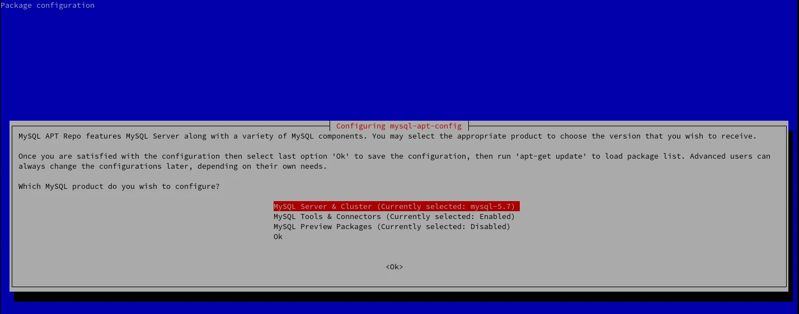

# MariaDB - MySql en Linux

## Instalar MariaDB debian
- :link: [MariaDB Downloads](https://downloads.mariadb.org/mariadb/repositories/#mirror=globotech)
- :link: [MariaDB tutorials](https://mariadb.com/kb/en/library/training-tutorials/)
- :link: [How To Install the Latest MySQL on Debian 10](https://www.digitalocean.com/community/tutorials/how-to-install-the-latest-mysql-on-debian-10)
- :link: [MySQL Lifecycle (EOL) 1](https://endoflife.software/applications/databases/mysql)
- :link: [MySQL Lifecycle (EOL) 2](http://www.oracle.com/us/support/library/lifetime-support-technology-069183.pdf)
- :link: [A Quick Guide to Using the MySQL APT Repository](https://dev.mysql.com/doc/mysql-apt-repo-quick-guide/en/)
- :link: [MySQL Community Downloads](https://dev.mysql.com/downloads/mysql/)
- :link: [Ubuntu / Debian (Architecture Independent), DEB Package ](https://dev.mysql.com/downloads/repo/apt/)

## Instalar MariaDB, crear en `source.list`

```
# MariaDB 10.2 repository list - created 2018-04-30 01:28 UTC
# http://downloads.mariadb.org/mariadb/repositories/
deb [arch=amd64,i386,ppc64el] http://sfo1.mirrors.digitalocean.com/mariadb/repo/10.2/debian stretch main
deb-src http://sfo1.mirrors.digitalocean.com/mariadb/repo/10.2/debian stretch main

```
Despues

```
sudo apt-get install software-properties-common dirmngr
sudo apt-key adv --recv-keys --keyserver keyserver.ubuntu.com 0xF1656F24C74CD1D8
sudo apt-get update
sudo apt-get install mariadb-server
```

Para añadir password y configurar las opciones de MariaDB:
```
# mysql_secure_installation
```
### Instalar MySql
Descargar archivo para los repositorios oficiales de MySql
```bash
$ wget https://dev.mysql.com/get/mysql-apt-config_0.8.13-1_all.deb
```
Instalar los repositorios
```bash
$ sudo dpkg -i mysql-apt-config_0.8.15-1_all.deb
```
En caso de que no se pueda instalar o hacer modificaiones, tambien se puede hacer de la siguiente manera
```bash
$ sudo gdebi mysql-apt-config_0.8.15-1_all.deb
```
Se le presentará el menú de configuración donde puede seleccionar la versión de MySQL que desea instalar.
Durante la instalación se presentara una configuracion en la pantalla donde se espesificara que version de MySql se prefiere, junto con otros repositorios a intalar para herramientas de MySql. Por defecto se instalara la ultima version de MySql. Seleccionar `OK` y despues `ENTER` para instalar.

[](https://github.com/macknilan/Cuaderno/blob/master/Mysql/img/debian-select-mysql-version.webp)

Se actualise el sistema
```bash
$ sudo apt update
```
Se instala MySql
```bash
$ sudo apt install mysql-server
```
Verificamos que este el servisio de MySql activo
```bash
$ sudo systemctl status mysql
```
MySql cuenta con una herramienta que se ocupa para setear la _contraseña root_ y mejorar la resiente instalación/configuración de `mysql-server`
```bash
$ sudo mysql_secure_installation
```
Verificar la instalación MySql
```bash
$ mysqladmin -u root -p version
```
Entrar a MySql
```bash
$ mysql -u root -p
```
### Instalar MySql Workbench en Debian buster 10
:link: [MySQL Community Downloads](https://dev.mysql.com/downloads/)

En [MySQL Community Downloads](https://dev.mysql.com/downloads/) descargar del :link: [MySQL Workbench](https://dev.mysql.com/downloads/workbench/)
1. Seleccionar __Ubuntu Linux__
2. Seleccionar la version **18.04**
3. Se descarga el archivo `mysql-workbench-community_8.0.19-1ubuntu18.04_amd64.deb`
4. Instalar en caso de no estar instalado `gdebi` `$ sudo apt install gdebi-core gdebi`
5. Instalar MySql Workbench `sudo gdebi mysql-workbench-community_8.0.19-1ubuntu18.04_amd64.deb`
6. Si se presenta que no esta instalada una dependencia `$ sudo apt-get install -f`

### Database Backups

Store mysql root password in `/root/.cnf` Como __root__ se puede acceder. chmod 600

```
[client]
user=root
password=<CONTRASEÑA>
```

### Back Up una DB

```
mysqldump --add-drop-table --database nombredelabasededatos > /home/nombredeusuario/backups/db/$(bin/date '+\%Y-\%m-\%d').sql.bk
```

### Back Up todas las DB
```
mysqldump --all-databases --all-routines > /path/to/fulldump.sql
```

### Restaurar a DB de un Back Up
```
mysql -u root -p [nombredelabasededatos] < archivoDeBackup.sql
```

### Para restaurar dotas las DB
Primero necesitan existir o el archivo debe de contener __CREATE TABLE__
```
mysql -u root -p < archivoDeTodasLasDB.sql
```

### Login MySQL
```
mysql -u root -p -h localhost
```

### Howto's MySql

Mostrar lista de todos usuarios de MySql
```
mysql> SELECT user,host FROM mysql.user;
```

### Mostrar variables MySql/mariadb
```
SHOW VARIABLES LIKE "%version%";
```

### Cambiar contraseña de _root_

1. `mysql -u root -p`
2. `use mysql;`
3. `update user set password=PASSWORD('your_new_password') where User='root';`
4. `flush privileges;`
5. `quit`

#### Mostrar privilegios concedidos de un usuario
1. `mysql> show grants for 'root'@'%';`
2. `SHOW GRANTS FOR 'root'@'localhost';`


#### Muestra las BD
```
mysql> show DATABASES;
```

#### Crea una BD
```
mysql> CREATE DATABASE nombredelabasededatos;
```

#### Borrar una BD
1. `mysql> DROP DATABASE nombredelabasededatos;`
2. `DROP DATABASE IF EXISTS tutorial_database;`

#### Para usar una BD
```
mysql> USE nombredelabasededatos;
```

#### Crear usuario
```
mysql> CREATE USER 'mi_usuario'@'localhost' IDENTIFIED BY 'mi_contraseña';
```

#### Crear usuario con
:link: [Chapter 13 Creating User Accounts](https://dev.mysql.com/doc/mysql-secure-deployment-guide/5.7/en/secure-deployment-user-accounts.html)

Crear un usuario forma No.1
```
mysql> CREATE USER 'mi_usuario'@'localhost' IDENTIFIED BY 'Mi contrasena 2020';
```
Crear un usuario forma No.2
```
mysql> CREATE USER 'mi_usuario'@'localhost' IDENTIFIED WITH sha256_password BY 'Mi contrasena 2020' 
       REQUIRE X509 WITH MAX_USER_CONNECTIONS 3 PASSWORD EXPIRE DEFAULT;
```
Mostrar los usuarios
```
mysql> SELECT user,authentication_string,host FROM mysql.user;
```


### Dar permisos a una DB a un usuario.
1. `GRANT permission ON DATABASENAME.* TO 'user'@'localhost';`
    - ALL – Allow complete access to a specific database. If a database is not specified, then allow complete access to the entirety of MySQL.
    - CREATE – Allow a user to create databases and tables.
    - DELETE – Allow a user to delete rows from a table.
    - DROP – Allow a user to drop databases and tables.
    - EXECUTE – Allow a user to execute stored routines.
    - GRANT OPTION – Allow a user to grant or remove another user’s privileges.
    - INSERT – Allow a user to insert rows from a table.
    - SELECT – Allow a user to select data from a database.
    - SHOW DATABASES- Allow a user to view a list of all databases.
    - UPDATE – Allow a user to update rows in a table.
2. _Dar permisos a todas las DB_ para un suario -> `GRANT CREATE ON *.* TO 'testuser'@'localhost';`
3. Dar permiso de _borrar_ una DB a un usuario -> `GRANT DROP ON tutorial_database.* TO 'testuser'@'localhost';`
4. Cuando termine de hacer los cambios de permiso, _es una buena práctica volver a cargar todos los privilegios con el comando de descarga_ -> `FLUSH PRIVILEGES;`
5. Mostrar permisos otorgados para un usuario -> `SHOW GRANTS FOR 'testuser'@'localhost';`

### Quitar/revocar permisos de una DB a un usuario.
1. `REVOKE permission ON database.table FROM 'user'@'localhost';`
    - ALL – Allow complete access to a specific database. If a database is not specified, then allow complete access to the entirety of MySQL.
    - CREATE – Allow a user to create databases and tables.
    - DELETE – Allow a user to delete rows from a table.
    - DROP – Allow a user to drop databases and tables.
    - EXECUTE – Allow a user to execute stored routines.
    - GRANT OPTION – Allow a user to grant or remove another user’s privileges.
    - INSERT – Allow a user to insert rows from a table.
    - SELECT – Allow a user to select data from a database.
    - SHOW DATABASES- Allow a user to view a list of all databases.
    - UPDATE – Allow a user to update rows in a table.
2. _Quitar permisos para todas las DB_ a un usuario -> `REVOKE CREATE ON *.* FROM 'testuser'@'localhost';`
3. _Quitar el permiso de eliminar una DB_ -> `REVOKE DROP ON tutorial_database.* FROM 'testuser'@'localhost';`
4. Cuando termine de hacer los cambios de permiso, _es una buena práctica volver a cargar todos los privilegios con el comando de descarga_ -> `FLUSH PRIVILEGES;`
5. Mostrar permisos otorgados para un usuario -> `SHOW GRANTS FOR 'testuser'@'localhost';`

#### Para borrar un usuario.
```
mysql> DROP USER 'usuario'@'localhost';
```

#### Para mostrar las tablas:
```
mysql> SHOW TABLES;
```

#### Para dar permisos desde la consola sobre todas las tablas de una base de datos
```
mysql> GRANT ALL PRIVILEGES ON nombredelabasededatos.* TO 'landani'@'localhost';
```

#### Después de dar o quitar permisos, siempre tendremos que ejecutar el siguiente comando para aplicarlos.
```
mysql> FLUSH PRIVILEGES;
```

#### Para dar permisos desde la consola sobre una tabla concreta de la base de datos
```
mysql> GRANT SELECT,INSERT,UPDATE,DELETE ON database_name.concrete_table TO 'landani'@'%';
```

#### Para quitar permisos desde la consola de mysql, ejecutaremos el siguiente comando. Si queremos afectar a una base de datos, tabla concreta, etc. lo haremos igual que para dar permisos. En este ejemplo afectamos a todas las bases de datos *(*.*)* y quitaremos todos los permisos (`ALL PRIVILEGES`)
```
mysql> REVOKE ALL PRIVILEGES ON *.* FROM 'landani'@'localhost';
```

#### Para saber que BD estoy usando.
```
mysql> SELECT DATABASE(); ------- \s
```

#### Para saber que usuario estoy parado.
```
mysql> SELECT USER(); ------- \s
mysql> SELECT CURRENT_USER;
```

#### Para saber los privilegios de un usuario.
```
mysql> SHOW GRANTS FOR 'root'@'localhost';
```

#### Para ver los privilegios consedidos a una cuenta que se esta que se esta usuando conectada al server
```
SHOW GRANTS;
SHOW GRANTS FOR CURRENT_USER;
SHOW GRANTS FOR CURRENT_USER();
```

#### How to check MySQL Server is running?
```
# mysqladmin -u root -p ping

    Enter password:
    mysqld is alive
```

#### How to Check which MySQL version I am running?
```
# mysqladmin -u root -p version
```

#### How to Find out current Status of MySQL server?
```
# mysqladmin -u root -ptmppassword status
```

#### How to check status of all MySQL Server Variable’s and value’s?
```
# mysqladmin -u root -p extended-status   
```

#### How to see all MySQL server Variables and Values?
```
# mysqladmin  -u root -p variables
```

#### How to check all the running Process of MySQL server?
```
# mysqladmin -u root -p processlist
```

#### How to reload/refresh MySQL Privileges?
```
# mysqladmin -u root -p reload;
# mysqladmin -u root -p refresh
```

#### Como apagar el servidor de MySql dse forma segura
```
# mysqladmin -u root -p shutdown
    Ó
# /etc/init.d/mysqld stop
# /etc/init.d/mysqld start
```

#### Some useful MySQL Flush commands - Following are some useful flush commands with their description.
```
flush-hosts: Flush all host information from host cache.
flush-tables: Flush all tables.
flush-threads: Flush all threads cache.
flush-logs: Flush all information logs.
flush-privileges: Reload the grant tables (same as reload).
flush-status: Clear status variables.

# mysqladmin -u root -p flush-hosts
# mysqladmin -u root -p flush-tables
# mysqladmin -u root -p flush-threads
# mysqladmin -u root -p flush-logs
# mysqladmin -u root -p flush-privileges
# mysqladmin -u root -p flush-status
```

#### How to kill Sleeping MySQL Client Process? - Use the following command to identify sleeping MySQL client process.
```
# mysqladmin -u root -p processlist
```

#### Despues con el siguiente comando se mata el proceso, es el "Id"
```
# mysqladmin -u root -p kill 5
```

#### How to Connect remote mysql server - To connect remote MySQL server, use the -h (host)  with IP Address of remote machine.
```
# mysqladmin  -h 172.16.25.126 -u root -p
```

#### How to start/stop MySQL replication on a slave server? - To start/stop MySQL replication on salve server, use the following commands.
```
# mysqladmin  -u root -p start-slave
# mysqladmin  -u root -p stop-slave
```

#### How to store MySQL server Debug Information to logs? - It tells the server to write debug information about locks in use, used memory and query usage to the MySQL log file including information about event scheduler.
```
# mysqladmin  -u root -p debug
```


