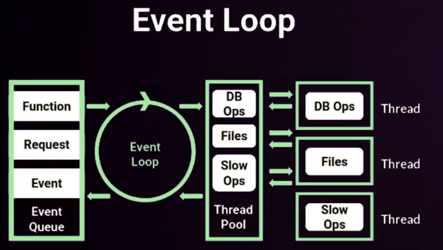
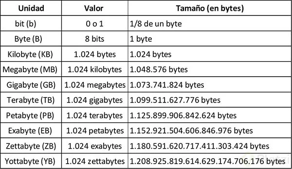

"word_wrap": "auto",

# Curso de Fundamentos de Node.js

## 1. Conocer los conceptos básicos de NodeJS
### 1. Instalación de Node.js
:link: [Node offical page](https://nodejs.org/en/)

Simplemente pulsa en el botón verde de la versión que quieras (_mi recomendación es siempre usar las versiones LTS_) y completar el proceso de instalación. Dependiendo del sistema operativo, te hará más o menos preguntas, pero con las opciones por defecto se instalará bien.

Como consejo, asegúrate de tener una buena conexión a internet cuando lo instales, para que tarde poco tiempo.

Una vez lo hayas instalado, para comprobar que todo funciona correctamente, abre una terminal (en windows, CMD o PowerShell valen perfectamente) y escribe:
```bash
node -v
```
Ese comando te devolverá la versión de Node.js que se ha instalado.

También nos habrá instalado NPM, el gestor de paquetes. Para asegurarte de que está instalado, puedes ejecutar:
```bash
npm -v
```
Y te devolverá la versión de NPM que hay instalada.

Con esto, ya tenemos instalado **Node.js** y **NPM**, que es todo lo que necesitamos para empezar con nuestro curso de Fundamentos de Node.js.

### 2.  Node: orígenes y filosofía

NojeJS es la forma más rápida de ejecutar código y escalable, corre en servidores. Es un lenguaje.

+ Origines y filosofía.
    + Es un entorno de ejecución fuera del navegador, orientado a servidores.Al estar fuera no necesito exploradores. Puedo ejecutarlo para herrameintas, transpialdores, scraping, automatización.Nos permite tener servers asincronos.

+ Caracterisitcas:
    + JS es concurrente; Monohilo, entradas y salidas asincronas.
    + Un unico proceso corrriendo en el nucleo del procesador.
    + No se queda bloqueante.

**NodeJS usa V8** como entorno de ejecución fue creado por google escrito en **c++** convierte JS en código máquina en lugar de interpretarlo en tiempo real.
Al estar escrito en c++ es muy rápido. Node es open source.  
Todo lo que no sea sintaxis de programación son módulos.  
Muchos módulos vienen por defecto en el paquete de Node.  
Puedes crear tus propios módulos.  

_Node está orientado a eventos_. Un bucle de eventos que nos permite se programar de manera reactiva. Cualquier evento se puede escuchar.

### 3.  EventLoop: asíncrona por diseño



Un proceso con un **bucle**  que gestiona de forma asincrona, todos los eventos de tu aplicación

1. **Event Queue**: Contiene todos los eventos que se generan por nuestro código (Funciones, peticiones, etc.), estos eventos quedan en una cola que van pasando uno a uno al Event Loop.
2. **Event Loop**: Se encarga de resolver los eventos ultra rápidos que llegan desde el Event Queue. En caso de no poder resolverse rápido, [enviá el evento al Thread Pool].
3. **Thread Pool**: Se encarga de gestionar los eventos de forma _asíncrona_. Una vez terminado lo devuelve al Event Loop. El Event Loop vera si lo pasa a Event Queue o no.


### 4. Monohilo: implicaciones en diseño y seguridad

/docs_fundamentos-node-platzi-master/conceptos/monohilo.js
```js
console.log('Hola mundo');
let i = 0;
setInterval(function() {
    console.log(i);
    i++;

    // if (i === 5) {
    //     console.log('forzamos error');
    //     var a = 3 + z;
    // }
}, 1000);

console.log('Segunda instrucción');
```
__Importante__: Cuando ocurre un error dentro de alguno de los hilos y no se controla apropiadamente (catch); Node detiene todos los hilos ejecución. _Esto puede ser muy peligroso_, debido a que es dificil determinar fue el origen del problema y en que punto de ejecución se encontraba cada hilo cuando fue detenido.

### 5. Variables de entorno

NodeJS_fundamentos/docs_fundamentos-node-platzi-master/conceptos/entorno.js
```
let nombre = process.env.NOMBRE || 'Sin nombre'; // SI NO SE ENCUENTRA LA VARIABLE TOMA EL VALOR POR DEFECTO
let web = process.env.MI_WEB || 'no tengo web';

console.log('Hola '+ nombre);
console.log('Mi web es '+ web);
```
Para ejecutar con Node el archivo JS con las variables de entorno
```
$ NOMBRE=Rodolfo MI_WEB=httos://mack.com node entorno.js
# salida
Hola Rodolfo
Mi web es httos://mack.com
```

### 6. Herramientas para ser más felices: Nodemon y PM2
+ :link: [nodemon reload, automatically](https://nodemon.io/)
+ :link: [npm nodemon](https://www.npmjs.com/package/nodemon)

+ **nodedemon** para usar en desarrollo, es un gestor que nos ayuda a detectar los cambios, compilarlos y ejecutarlos
```bash
sudo npm install -g nodemon
```
```bash
nodemon nombre_archivo
```
**PM2** _Producción_: Es parecida a nodemon simplemente mas avanzada y mas compleja. No se debe utilizar en desarrollo por que dará más problemas que soluciones. Nos ayudara a ver los datos de nuestra aplicación en producción, como el uso del CPU, memoria, cuantas veces se ha reiniciado.

Es un administrador de _procesos demonio_ que lo ayudará a administrar y mantener su aplicación en línea las 24 horas, los 7 días de la semana

:link: [ADVANCED, PRODUCTION PROCESS MANAGER FOR NODE.JS](https://pm2.keymetrics.io/)
:link: [npm PM2](https://www.npmjs.com/package/pm2)

```bash
npm install pm2 -g
```
```bash
pm2 start
# EMPEZAR UN DEMONIO DE UN PROGRAMA
pm2 status
# VER QUE PROGRAMAS SE ESTAN EJECUTANDO Y CUALES SON SOS ESTATUS
pm2 log
# VER EL LOG DE UN PROGRAMA EN ESPECIFICO
```

## 2. Cómo manejar la asincronía
### 7. Callbacks
**Dos funciones que son asíncronas, no se ejecutarían una después de otra, sino se llamaran dentro del Callback de la otra**

Nuestras funciones pueden compartir variables a lo largo de la ejecución.

Archivo `/docs_fundamentos-node-platzi-master/async/callback.js`
```js
function hola(nombre, miCallback) {
    setTimeout(function () {
        console.log('Hola, '+ nombre);
        miCallback(nombre);
    }, 1500);
}

function adios(nombre, otroCallback) {
    setTimeout(function() {
        console.log('Adios', nombre);
        otroCallback();
    }, 1000);
}

console.log('Iniciando proceso...');
hola('Mack', function (nombre) {
    adios(nombre, function() {
        console.log('Terminando proceso...');
    });
});
// hola('Carlos', function () {});
// adios('Carlos', function () {});
```
salida...
```bash
Iniciando proceso...
Hola, Mack
Adios Mack
Terminando proceso...
```
```bash
$ nodemon callback.js
```

### 8. Callback Hell: refactorizar o sufrir
Los _callback Hell_ se dan cuando empiezo a pasar una función como parámetro que a su vez llama a otra función como parámetro, _y así hasta n_.

Una estrategia para trabajar con estas estructuras lógicas tan monolíticas es usar estructuras de control y funciones recursivas.

Las _funciones recursivas_ se llaman así mismas y mediante la estructura de control le digo cuantas veces voy a necesitar llamar la función así misma.

Archivo `ocs_fundamentos-node-platzi-master/async/callbackHell.js`
```js
function hola(nombre, miCallback) {
    setTimeout(function () {
        console.log('Hola, '+ nombre);
        miCallback(nombre);
    }, 1500);
}
function hablar(callbackHablar) {
    setTimeout(function() {
        console.log('Bla bla bla bla...');
        callbackHablar();
    }, 1000);
}
function adios(nombre, otroCallback) {
    setTimeout(function() {
        console.log('Adios', nombre);
        otroCallback();
    }, 1000);
}
// FUNCIONES CON RECURSIVIDAD
function conversacion(nombre, veces, callback) {
    if (veces > 0) {
        hablar(function () {
            conversacion(nombre, --veces, callback); /* RECURSIVIDAD */
        })
    } else {
        adios(nombre, callback);
    }
}
// --
console.log('Iniciando proceso...');
hola('Carlos', function (nombre) {
    conversacion(nombre, 3, function() { /* RECURSIVIDAD */
        console.log('Proceso terminado');
    });
});
// CALLBACKHELL
// hola('Carlos', function (nombre) {
//     hablar(function () {
//         hablar(function () {
//             hablar(function () {
//                 adios(nombre, function() {
//                     console.log('Terminando proceso...');
//                 });
//             });
//         });
//     });
// });

```
Salida
```js
Iniciando proceso...
Hola, Carlos
Bla bla bla bla...
Bla bla bla bla...
Bla bla bla bla...
Adios Carlos
Proceso terminado
```
### 9. Promesas
Las promesas son una sintaxis mas elegante y legible de realizar callbacks, creando así un código mucho más escalable y entendible para todas las personas.

Una promesa al final no deja de ser un callback, solo que, con la novedad de tener estados, las promesas cuentan con 3 estados, resuelta, en progreso y en fallo.

Para utilizar una promesa solo debemos de instanciar una nueva, una promesa en si es una función que recibe dos parámetros, resolve y reject, que son los dos estados de una promesa.

Utilizamos resolve para retornar el valor deseado cuando una función se ejecute y utilizamos reject para cuando una función retorna un valor no deseado.
```js
New Promise( (resolve, reject) => {
    …code
    If(code === true){
        resolve(correctValue);
    }else {
        Reject(wrongValue);
    }
});
```
Para poder obtener los valores que retorna una función debemos utilizar su propiedad `.then`, esta propiedad es una función que recibe un callback el cual tendrá como parámetro el valor retornado con `resolve` o `reject`.
Siempre que usemos una promesa además de realizar la propiedad `.then` debemos invocar la propiedad `.catch`, la cual es un callback que recibe como parámetro el error ocurrido en caso de haber sucedió uno.
```js
myPromise(‘Parameter’)
    .then( data => console.log(data) )
    .catch( err => console.log(err) );
```


Archivo `/docs_fundamentos-node-platzi-master/async/promises.js`
```js
function hola(nombre) {
    return new Promise(function (resolve, reject) {
        setTimeout(function () {
            console.log('Hola, '+ nombre);
            resolve(nombre);
        }, 1500);
    });
}
function hablar(nombre) {
    return new Promise( (resolve, reject) => {
        setTimeout(function() {
            console.log('Bla bla bla bla...');
            // SE OCACIONA EL ERROR PARA QUE ENTRE EL CATCH
            //resolve(nombre); 
            reject('Hay un error');
        }, 1000);
    });
}
function adios(nombre) {
    return new Promise( (resolve, reject) => {
        setTimeout(function() {
            console.log('Adios', nombre);
            resolve();
        }, 1000);
    });
}
// ---
console.log('Iniciando el proceso..');
hola('Carlos')
    .then(hablar)
    .then(hablar)
    .then(hablar)
    .then(hablar)
    .then(adios)
    .then((nombre) => {
        console.log('Terminado el proceso');
    })
    .catch(error => {
        console.error('Ha habido un error:');
        console.error(error);
    })
```
### 10. Async/await
Archivo `/docs_fundamentos-node-platzi-master/async/asyncAwait.js`
```js
async function hola(nombre) {
    return new Promise(function (resolve, reject) {
        setTimeout(function () {
            console.log('Hola, '+ nombre);
            resolve(nombre);
        }, 1500);
    });
}
async function hablar(nombre) {
    return new Promise( (resolve, reject) => {
        setTimeout(function() {
            console.log('Bla bla bla bla...');
            //resolve(nombre);
            resolve('Hay un error');
        }, 1000);
    });
}
async function adios(nombre) {
    return new Promise( (resolve, reject) => {
        setTimeout(function() {
            console.log('Adios', nombre);
            resolve();
        }, 1000);
    });
}
async function main() {
    let nombre = await hola('Carlos');
    await hablar();
    await hablar();
    await hablar();
    await adios(nombre);
    console.log('Termina el proceso');
}
console.log('Empezamos el proceso');
main();
console.log('Va a ser la segunda instrucción')
```

En _ECMAscript 2017_ es cuando _Async_ Await entra al juego. Este nuevo feature de Javascript planteaba un mejor manejo de las promesas. Estos ya no estarían encadenados uno del otro volviendo la sintaxis más entendible y fácil de usar. Sobre todo fácil de usar. Para usarlo tan solo se necesita _async functions_ y la keyword _await_. Este keyword permite que una promesa se resuelva y retorne su valor, esto permite que podamos guardarlo en variables. Pero no todo podía ser oro. _await_ solo funciona en _async functions_. Este tipo de funciones simplemente se aseguran que lo que sea que retornen sea una promesa. Dicho de otro modo, estas funciones siempre retornan una promesa. Veámoslo en un ejemplo.

Tomaremos el ejemplo de las promesas y convertiremos su sintaxis usando _async await_
```js
// USANDO PROMESAS
callEndpoint('api/getidbyusername/davos')
    .then(results => callEndpoint('api/getfollowersbyid' + results.userId))
    .then(results => callEndpoint('api/someothercall'))
    .then(results => callEndpoint('api/someothercall'))
    .then(results => callEndpoint('api/someothercall'))
    .then(results => callEndpoint('api/someothercall'))

// usando Async Await
async function callEndpoints() {
    const userResults = await callEndpoint('api/getidbyusername/davos')
    const followersResults = await callEndpoint('api/getfollowersbyid' + userResults.userId)
    const someResults = await callEndpoint('api/someothercall')
    const moreResults = await callEndpoint('api/someothercall')
    const anotherResults = await callEndpoint('api/someothercall')
    const finalResults = await callEndpoint('api/someothercall')

    return finalResults
}

callEndpoints()
```
Async Await y Promesas trabajando juntos

Vamos a suponer que estamos programando una carga inicial del perfil de usuario y que uno de los requerimientos sea que debamos mostrar la información básica del usuario, los cursos que ha tomado en la plataforma y la lista de sus amigos antes de que termine la carga. Estos recursos se consiguen por medio de una api, y cada recurso está en una diferente url. Y las url del api de los cursos y la de amigos vienen en la información del usuario en la propiedad links.

+ Información del usuario: api/user/1234
+ Cursos que ha tomado: api/user/1234/courses
+ Lista de sus amigos: api/user/1234/friends

Este es un ejemplo de la respuesta a un pedido a la url de la información del usuario
```json
{
    user: {
        id: 1234,
        ...
        links: ['api/user/1234/courses', 'api/user/1234/friends']
    }
}
```
Entonces tenemos que hacer 3 pedidos a la api y debemos tener acceso a su data antes de que termine la carga. Está claro lo que debemos usar, _async_ _await_ y _promesas_.

Vamos a crear una _async_ function donde en primera instancia haremos un pedido a la url del usuario para obtener la información básica y los links que están como propiedad del usuario. Luego, usaremos una utilidad de las promesas, `Promise.all`. Esto hará que los pedidos se ejecuten paralelamente, por lo tanto el tiempo de espera se disminuye al no tener que ejectuar los pedidos de los links consecutivamente. Un detalle es que si alguno de estos pedidos falla en el `Promise.all`, todos fallarán. _O todo o nada._

Dentro de `Promise.all`, iteraremos sobre los links con la función de los arreglos, `map` . Este recibe una función que tiene como argumento el elemento del arreglo en cada iteración, en este caso el link. Luego dentro de la función, aplicamos un arrow function que retorna un fetch al link en cada iteración. Esto hará que en cada iteración se retorne una promesa. Al final, tendremos un arreglo de estas promesas sin resolver. Para esto aplicamos await al `Promise.all` para que resuelva todas las promesas paralelamente. Una vez ya resueltos, obtendremos todas las respuestas de los pedidos si todo fue bien y lo guardamos en una variable userResponse. Por último aplicamos todo esto de nuevo para parsear las respuestas en data de tipo objeto para que Javascript pueda hacer operaciones sobre la data.

```js
async function getAllUserInfo(id) {
    const user = await fetch('api/user/' + id)

    const userResponse = await Promise.all(user.links.map(link => fetch(link)))

    const userData = await Promise.all(userResponse.map(response => response.json()))

    return userData
}
```
### 11. ## 3. Entender los módulos del core
### 12. Globals
:link: [Node.js v14.2.0 Documentation](https://nodejs.org/api/)

Los modulos globales son módulos del core.
Una de las funciones muy usadas en Node es setInterval, clearInterval, para evaluar en n tiempo si el servidor está caído o no.

**TIP**: Si no tengo que usar variables globales no usarlas, pues son un foco de problemas

Archivo `/docs_fundamentos-node-platzi-master/modulos/globales.js`
```js
// Ubicación de ficheros
// console.log(__dirname);
// console.log(__filename);

// Timers
// console.log(setInterval);)
// console.log(clearInterval);
// console.log(setTimeout);
// console.log(clearTimeout);
// console.log(setInmediate);

// Modules
// console.log(exports);
// console.log(module);
// console.log(require);

// Seteando variables globales
// global.test = 'Ejemplo';
// console.log(test);
// console.log(global.test);
```
ejemplos:
```js
console.log(global) 
/*Object [global] {
    global: [Circular], ---> Dependencias ciruculares.
    clearInterval: [Function: clearInterval],
    clearTimeout: [Function: clearTimeout],
    setInterval: [Function: setInterval],
    setTimeout: [Function: setTimeout] {
      [Symbol(nodejs.util.promisify.custom)]: [Function]
    },
    queueMicrotask: [Function: queueMicrotask],
    clearImmediate: [Function: clearImmediate],
    setImmediate: [Function: setImmediate] {
      [Symbol(nodejs.util.promisify.custom)]: [Function]
    }
  }
*/


require(); // nos va a permitir acceder a caulqueir módulo.

setImmediate(()=>{
    console.log("Ya mismo")
})

let i = 0;
let intervalo = setInterval(() => {
    console.log('hola intervalo')
    if (i === 3) {
        clearInterval(intervalo);
    }
    i++;
}, 1000);

setImmediate(() => {
    console.log('Saludo inmediato');
});

// requiere PARA AGREGAR MODULOS A NUESTRO PROYECTO 

// console.log(process);
// MUESTRA EL DIRECTORIO DONDE ESTAMOS TRABAJANDO
console.log(__dirname);
// MUESTRA EL DIRECTORIO Y EL ARCHIVO QUE TEMENOS ABIERTO
console.log(__filename);
// ES BUENA PRACTICA NO USAR VARIABLES GLOBALES

global.miVariable = 'mi variable global';
console.log(miVariable);
```
### 13. File system
:link: [fs Promises API](https://nodejs.org/dist/latest-v10.x/docs/api/fs.html#fs_fs_promises_api)
El File System es uno de los módulos principales que nos ofrece Node, este modulo es aquel que nos permite operar directamente con los archivos de nuestro sistema, permitiéndonos crear, leer, editar o eliminar archivos de nuestra índole. _(CRUD)_

Para poder usar este modulo lo debemos importar con require en una constante con el mismo nombre del módulo:

Una vez importado podremos comenzar a usar los métodos que este módulo nos ofrece:

+ `Const fs = require(‘fs’);`
    + `fs.readFile(path, callback);`
    + `fs.writeFile(path, content, callback)`
    + `fs.unlink(path, callback)`

El file system provee una API para interactuar con el sistema de archivos cerca del estándar _POSIX_.
_POSIX_ es el estándar para interfaces de comando y shell, las siglas las significan: _“Interfaz de sistema operativo portátil”_ la X de _POSIX_ es por UNIX.

El file system es muy útil para precompiladores, para lo que requiera hacer grabados de disco, o bases de datos en node requieren un uso intensivo de Node. Todo lo que hagamos con modulos por buenas prácticas son _asincronos_, pero tienen una _version sincrona no recomendada pues pordría bloquear el event loop_ con más facilidad. [FileSystem Docs](https://nodejs.org/dist/latest-v12.x/docs/api/fs.html#fs_file_system)

Archivo `/docs_fundamentos-node-platzi-master/modulos/fs.js`
```js
const fs = require('fs');

function leer(ruta, cb) {
    fs.readFile(ruta, (err, data) => {
        cb(data.toString());
    })
}

function escribir(ruta, contenido, cb) {
    fs.writeFile(ruta, contenido, function (err) {
        if (err) {
            console.error('No he podido escribirlo', err);
        } else {
            console.log('Se ha escrito correctamente');
        }

    });
}

function borrar(ruta, cb) {
    fs.unlink(ruta, cb);
}

// escribir(__dirname + '/archivo1.txt', 'Soy un archivo nuevo', console.log);
// leer(__dirname + '/archivo1.txt', console.log)
borrar(__dirname + '/archivo1.txt', console.log);
```
### 14. Console
1.**console.clear():** limpiará la consola, aunque depende mucho del sistema operativo su comportamiento. Por ejemplo, en linux es equivalente al comando clear, mientras que en Windows borrará solo la salida en la vista de la terminal actual.
2. **console.timer(‘timer’):** comienza un temporizador que puedes usar para calcular la duración de cualquier operación. El mismo parámetros que le pasamos se pasara a `console.timerEnd()` para detener al contador.
3. **console.log**: recibe cualquier tipo y lo muestra en el consola.
4. **console.info**: es equivalente a log pero es usado para informar.
5. **console.error**: es equivalente a log pero es usado para errores.
6. **console.warn**: es equivalente a log pero es usado para warning.
7. **console.table**: muestra una tabla a partir de un objeto.
8. **console.count**: inicia un contador autoincremental.
9. **console.countReset**: reinicia el contador a 0.
10. **console.time**: inicia un cronometro en ms.
11. **console.timeEnd**: Finaliza el cronometro.
12. **console.group**: permite agrupar errores mediante identación.
13. **console.groupEnd**: finaliza la agrupación.


Archivo `/docs_fundamentos-node-platzi-master/modulos/consola.js`
```js
// Console

// console.log()
// console.info()
// console.warn()
// console.error()

// console.table()
// console.table([{ a: 1, b: 'Y' }, { a: 'Z', b: 2 }]);
// ┌─────────┬─────┬─────┐
// │ (index) │  a  │  b  │
// ├─────────┼─────┼─────┤
// │    0    │  1  │ 'Y' │
// │    1    │ 'Z' │  2  │
// └─────────┴─────┴─────┘

// console.group();
// console.groupEnd();

// EJEMPLO 1
// console.group('despedida');
//  console.log('adios');
//  console.group();
//      console.log('Carlos');
//  console.groupEnd();
// console.groupEnd();

console.count('veces');
console.count('veces');
console.count('veces');
console.countReset('veces');
console.count('veces');
```
ejemplo
```js
// FUNCIONES
functionfuncion1() {
    console.group('Funcion 1');
    console.log('esto es de funcion 1');
    console.log('esto es de funcion 1');
    funcion2();
    console.groupEnd('Funcion 1')
}
function funcion2() {
    console.group('funcion 2');
    console.log('esto es de funcion 2');
    console.groupEnd('funcion 2');
}
// AGRUPAR CON GROUP Y COMO FUNCIONA
console.log('Ver algo');
console.error('inscribe el error');
console.warn('Puede ser un warning');

console.group('-> EJEMPLO DE TABLA EN CONSOLA :')
var tabla = [
    { a: 1, b: 2 },
    { a: 5, b: 6 }]
console.table(tabla);//sirve con arrays muy largos con muchas columnas.
console.groupEnd('-> EJEMPLO DE TABLA EN CONSOLA :');
// GROUP PERMITE DAR IDENTACION A LSO CONSOLOG SIGUIEENES HASTA
// GROUP END
console.group('conversacion:')
    console.log('Hola');
    console.log('Blabla');
    console.log('Adios');
console.groupEnd('conversacion:');
funcion1();
// CONTDOR DE VECES QUE SE EJECUTA EL LOG
console.count('veces');
console.count('veces');
console.count('veces');
console.count('veces');
console.countReset('veces');
console.count('veces');
```

### 15. Errores (try / catch)
Cuando se genera un error, _node propaga el error hacia arriba_, hasta que esta es caputado. _si el error no se captura node se detiene_.

Siempre que sea posible debemos capturar todos los errores que se puedan generar en nuestros hilos.

Archivo `/docs_fundamentos-node-platzi-master/modulos/errores.js`
```js
function otraFuncion() {
    serompe();
}
function serompe() {
    return 3 + z;
}
function seRompeAsincrona(cb) {
    setTimeout(function () {
        try {
            return 3 + z;
        } catch (err) {
            console.error('Error en mi función asícnrona');
            cb(err);
        }
    })
}
try {
    //otraFuncion();
    seRompeAsincrona(function (err) {
        console.log (err.message)
    });
} catch(err) {
    console.error('Vaya, algo se ha roto...');
    console.error(err);
    console.log('Pero no pasa nada, lo hemos capturado');
}

console.log('esto de aqui está al final');
```

### 16. Procesos hijo
Archivo `/docs_fundamentos-node-platzi-master/modulos/procesoHijo.js`

Node nos permite ejecutar varios hilos de procesos desde el suyo propio, sin importar de que sea este proceso, es decir, puede ejecutar procesos de Python, otros procesos de Node u otro proceso que tengamos en nuestro sistema.

Para poder usar estos procesos usamos el modulo de `child-process`  :link: [child-process](https://nodejs.org/api/child_process.html) , este trae dos métodos que nos permitirá ejecutar los procesos que deseemos. El método `exec` y el método `spawn`.

1. `exec` _devuelve un stream_, nos permite ejecutar un comando en nuestro sistema, recibe como parametros el comando entero que deseemos y como segundo parámetro un callback con tres parámetros, un error, un stdout y un stderr.
2. `spawn` _devuelve un buffer_ es parecido al método `exec` pero un poco más complejo, permitiéndonos conocer su estado y que datos procesa en cada momento del estado de comando ejecutado.

La diferencia más significativa entre `child_process.spawn` y `child_process.exec` está en lo que _spawn devuelve un stream_ y _exec devuelve un buffer_.

:link: [Diferencia entre spawn y exec de child_process de NodeJS](https://blog.michelletorres.mx/diferencia-entre-spawn-y-exec-de-child_process-de-nodejs/)

+ Usas `spawn` cuando quieras que el proceso hijo devuelva datos binarios enormes a Node.
+ Usas `exec` cuando quieras que el proceso hijo devuelva mensajes de estado simples.
+ Usas `spawn` cuando quieras recibir datos desde que el proceso arranca.
+ Usas `exec` cuando solo quieras recibir datos al final de la ejecución.

```js
const { exec, spawn } = require('child_process');
// exec('node modulos/consola.js', (err, stdout, sterr) => {
//     if (err) {
//         console.error(err);
//         return false;
//     }

//     console.log(stdout);
// })
let proceso = spawn('ls', ['-la']);

console.log(proceso.pid);
console.log(proceso.connected);

proceso.stdout.on('data', function (dato) {
    console.log('¿Está muerto?');
    console.log(proceso.killed);
    console.log(dato.toString())
});
proceso.on('exit', function() {
    console.log('el proeso terminó');
    console.log(proceso.killed)
})
```

### 17. Módulos nativos en C++
Seguir pasos del `README.md` en la carpeta `nativos` e investugar más el respecto

### 18. HTTP
+ :link: [HTTP](https://nodejs.org/api/http.html)
+ :link: [Adding routes and logic to a pure Node.js server](https://medium.com/@officialrahulmandal/adding-routes-and-logic-to-a-pure-node-js-server-9f995298d984)
+ :link: [Node.js HTTP Module - w3schools](https://www.w3schools.com/nodejs/nodejs_http.asp)
+ :link: [Digital Ocean How To Create a Web Server in Node.js with the HTTP Module](https://www.digitalocean.com/community/tutorials/how-to-create-a-web-server-in-node-js-with-the-http-module)
+ :link: [message.url](https://nodejs.org/api/http.html#http_message_url)
+ :link: [server.listen()](https://nodejs.org/api/net.html#net_server_listen)

Node nos ofrece el modulo **HTTP** el cual nos permite principalmente _crear un servidor en nuestro computador_.
En este modulo encontraremos todo lo necesario que necesitamos para crear un _sistema de rutas_, que responderá cada ruta, los **header** que podrá mandar, etc.
Uno de los _métodos principales_ de este modulo es `createServer`, el cual nos permitirá abrir un puerto para crear el servidor.

Archivo `/docs_fundamentos-node-platzi-master/modulos/http.js`
```js
const http = require('http'); // SE REQUIERE EL MODULO HTTP

// SELE PASA UNA FUNCION "router" PARA DEFINIR EL PUERTO DONDE SE VA A ESCUCHAR ES EL 3000 CON "linsten"
http.createServer(router).listen(3000);


// REQUEST, RESPONSE
function router(req, res) {
    console.log('Nueva petición!');
    console.log(req.url); // TRAER A LA URL A LA QUE ESTAN LLAMANDO

    switch (req.url) {
        case '/hola':
            let saludo = hola();
            res.writeHead(201, { 'Content-Type': 'text/plain' })
            res.write(saludo);
            res.end(); // SE TERMINA LA PETICIÓN
            break;
        
        default:
            res.write('Error 404: No se lo que quieres');
            res.end();
    }
    // ESCRIBIR EN LA CABECERA
    // res.writeHead(201, { 'Content-Type': 'text/plain' })
    // ESCRIBIR RESPUESTA AL USUARIO
    // res.write('Hola, ya se usar HTTP de NodeJS');
    // res.end();
}
function hola() {
    return 'Hola, que tal';
}
// ES BUENA PRACTICA DECIR EN QUE PUERTO ESTA ESCUCHANDO CUANDO SE EJECUTA
console.log("Escuchando http en el puerto 3000");
```
Otro ejemplo de como realizar lo `/docs_fundamentos-node-platzi-master/modulos/http2.js` 
```js
const { createServer } = require('http');
const port = 3000;
function router(req, res) {
    switch  (req.url) {
        case '/':
            res.end('<h1>HOLA req.url /</h1>');
            break
        default:
            res.write('404 ! URL NO EXISTE');
    }
}
const server = createServer(router);
server.listen(port, (err) => {
    if (err) {
        console.log('COULD NOS STABLISH A CONNECTION TO THE SERVER');
        console.error(err.message);
    }
    console.info(`> Ready ON http://localhost: ${port}`);
});
```

### 19. OS
:link: [OS -  Node.js v14.3.0 Documentation](https://nodejs.org/api/os.html)

El modulo de Node para OS me permite acceder a elementos de muy bajo nivel, y es útil en diferentes contextos.

Archivo `/docs_fundamentos-node-platzi-master/modulos/os.js`
```js
const os = require('os');
// console.log(os.arch()); // ME DEVUELVE LA ARQUITECURA DE MI OS
// console.log(os.platform()); // ME DICE EN QUÉ PLATAFORMA ESTOY. ETURNS A STRING IDENTIFYING THE OPERATING SYSTEM PLATFORM. THE VALUE IS SET AT compile time.
console.log(os.cpus()); // PODEMOS ACCEDER A LA INFORMACIÓN DE LAS CPUS DE MI PC
console.log(os.cpus().length); // LA CANTIDAD DE CPU'S CON LO QUE CUENTA LA MAQUINA
// console.log(os.constants); // ME MUESTRAN TODOS LOS ERRORES DE SISTEMA

// ACCEDER A ESPACIOS DE MEMORIA ES MUY ÚTIL PARA SABER SI TENGO A MEMORIA SUFICIENTE PARA REALIZAR ESTA OPERACIÓN.
const SIZE = 1024;
function kb(bytes) { return bytes / SIZE }
function mb(bytes) { return kb(bytes) / SIZE }
function gb(bytes) { return mb(bytes) / SIZE }

// console.log(os.freemem()); // ME DICE EN BYTES LA MEMORIA LIBRE QUE TENEMOS
// console.log(kb(os.freemem()));
// console.log(mb(os.freemem()));
// console.log(gb(os.freemem()));
// console.log(gb(os.totalmem())); // ME MUESTRA LA MEMORIA DISPONIBLE DEL PC

// console.log(os.homedir()) // ME PERMITE SABER CUAL ES EL DIRECTORIO RAÍZ
// console.log(os.tmpdir()) // ME MUESTRA LOS DIRECTORIOS TEMPORALES, TEMPROALES UNA IMAGEN QUE VOY A PROCESAR

// console.log(os.hostname()); // VOY A SABER EL HOSTNAME DE LA MÁQUINA
console.log(os.networkInterfaces()); // PUEDO ACCEDER A MI INTERFAZ DE RED ACTIVAS EN MI MÁQUINA, PUEDO SABER  IPVX
```


### 20. Process
:link: [Process -  Node.js v14.3.0 Documentation](https://nodejs.org/api/process.html)

El módulo `process` hace parte de los módulos globales, No es necesario requerirlos en el código.

El objecto `process` _es una instancia de_ `EventEmitter`; podemos suscribirnos a el para escuchar eventos de _node_.

`UncaughtException`: Permite capturar cualquier error que no fue caputurado previamente. _Esto evita que Node cierre todos los hijos al encontrar un error no manejado._
```js
process.on('uncaughtException', (error, origen) => console.log(error, origen));
```
`exit`: Se ejecuta cuando _node_ detiene el `eventloop` y cierra su proceso principal. _Tendrán que ejecutarse procesos sincronos pues cualquier proceso asincrono no sera ejecutado._
```js
process.on('exit', () => console.log('Adios'));
```

Archivo `/docs_fundamentos-node-platzi-master/modulos/process.js`
```js
// const p = require('process');
process.on('beforeExit', () => {
    console.log('el proceso va a terminar');
});

process.on('exit', () => {
    console.log('Ale, el proceso acabó');
    setTimeout(() => {
        console.log('Esto no se va a ver nunca');
    }, 0);
});

setTimeout(() => {
    console.log('Esto se va a ver');
}, 0);

process.on('uncaughtException', (err, origen) => {
    console.error('Vaya se nos ha olvidado capturar un error');
    setTimeout(() => {
        console.log('Esto viene desde las excepciones');
    }, 0);
});
funcionQueNoExiste();
console.log('Esto si el error no se recoje, no sale');
```

## 4. Utilizar los módulos y paquetes externos
### 21. Gestión de paquetes: NPM y package.json
**npm** (_Node Package Manager_) es un administrador de paquetes que permiten ejecutar funciones ya realizadas y validadas y de esta manera acelerar y asegurar la calidad de neustro proceso de desarrollo.

Podemos buscar modulos para casi todo en :link: [NPM home page](https://www.npmjs.com/)

### 22. Construyendo módulos: Require e Import

En Node tenemos una forma de importar módulos la cual es con el método `require`, el cual es la forma por defecto de importar módulos, ya sean nuestros propios módulos como los de otras personas en nuestros proyectos JS, pero suele haber mucha confusión debido al `import`.

`import` es la forma de importar módulos en _"Ecmascript"_, el cual es un estándar de JavaScript para la web, esta forma de importar en teoría Node no la acepta oficialmente, a no ser que usemos su modo de `.mjs`.

Pero gracias a compiladores como _Babel_, nosotros podremos utilizar estas normas de _Ecmascript_ en nuestro código para cuando se ejecute se transforme en código que sea aceptable por Node.

Se recomienda en la mayoría de veces la importación con `require`.

`require` se utiliza para consumir módulos. Nos permite incluir módulos integrados de Node.js, externos (como los importados de npm) y módulos locales.
```js
const express = require('express');
```
`export` nos permite “exportar” sus objetos y métodos en modulos que pueden ser utilizados a lo largo de nuestro proyecto.

Cuando requerimos un modulo utilizando `./` indica que es un modulo que se encuentra local.
```js
// modulo.js
// vamos a declarar las funciones que vamos a exportar en el modulo.
exports.por5 = numero => numero * 5;
exports.por10 = numero => numero * 10;

// multiplicador.js
// Importamos el modulo.js y llamamos las funciones
const multiplicador = require('./modulo.js');

const numero = 10;
console.log(multiplicador.por5(numero)); //  50
console.log(multiplicador.por10(numero)); // 100
```

Exportación de modulos con la sintaxis _RequireJS_
`paquetes/modulo/modulo.js`
```js
function saludar() {
    console.log('Hola mundo!!');
}
// module.exports = saludar;
module.exports = {
    saludar,
    prop1: 'Hola que tal'
};

```
`paquetes/modulo/index.js`
```js
// Traer nuestro modulo
const modulo = require('./modulo');
// EJECUTAR UNA FUNCION DEL MODULO
// console.log(modulo);
// modulo();
console.log(modulo.prop1);
modulo.saludar();
```
Exportación de modulos con la sintaxis _Ecmascript 6_
`paquetes/modulo/es6/modulo.mjs`
```js
function saludar() {
    console.log('Hola mundo!!');
}
export default {
    saludar,
    prop1: "Soy un modulo experimental",
};
```
`paquetes/modulo/es6/index.mjs`
```js
import modulo from './modulo.mjs'

console.log(modulo.prop1);
modulo.saludar();
```
Para ejecuar
```bash
$ node --expirimental-modules index.mjs
```

### 23. Módulos útiles
+ link: [bcrypt](https://www.npmjs.com/package/bcrypt)
```js
const bcrypt = require('bcrypt');

const password = '1234Segura!';

bcrypt.hash(password, 5, function(err, hash) {
    console.log(hash); 

    bcrypt.compare('password', hash, function(err, res) {
        // console.log(err)
        console.log(res)
    })
});
```

+ link: [moment](https://www.npmjs.com/package/moment)
```js
const moment = require('moment');

let ahora = moment();

// console.log(ahora.toString());
console.log(ahora.format('YYYY/MM/DD - HH:mm'));
```

+ link: [sharp](https://www.npmjs.com/package/sharp)
```js
const sharp = require('sharp');

sharp('original.png')
    .resize(80)
    .grayscale()
    .toFile('resized.png');
```

### 24. Datos almacenados vs en memoria
En node funciona por tiempos, Cuando se escribe en memoria es ultrarapido, por que CPU y memoria son protocolos de conexción son muy rapidos, y en disco es más lento por que el disco esta pensado para almacenar en cantidad y la memoria esta pensada para leer y escribir archivos de forma puy rapida.

### 25. Buffers
+ :link: [Buffer](https://nodejs.org/docs/latest-v12.x/api/buffer.html)
+ :link: [How to Use Buffers in Node.js](https://nodejs.org/en/knowledge/advanced/buffers/how-to-use-buffers/)

Buffer son datos en binarios/crudos/raw que van de un lado para otro.

Un Buffer es algo que sale desde un Stream

Archivo `/docs_fundamentos-node-platzi-master/memoria/buffer.js`
```js
// let buffer = Buffer.alloc(4);
// let buffer = Buffer.from([1, 2, 5]);
let buffer = Buffer.from('Hola');

// console.log(buffer);
// --
let abc = Buffer.alloc(26);
console.log(abc);

for (let i = 0; i < 26; i++) {
    abc[i] = i + 97;
}
console.log(abc.toString());
//
// <Buffer 00 00 00 00 00 00 00 00 00 00 00 00 00 00 00 00 00 00 00 00 00 00 00 00 00 00>
// abcdefghijklmnopqrstuvwxyz
```
### 26. Streams
El paso de datos entre un punto y otro. 
+ stream de lectura/scriura: origien/destino
+ stream de doble sentido

**Stream**  
Podría decirse que un Stream es el proceso de ir consumiendo datos al tiempo en que se reciben. Por ejemplo, cuando vemos un video en Youtube estamos consumiendo datos por medio de streaming (readable stream, porque solo podemos ver los videos mas no editarlos) ya que lo vemos al mismo tiempo en que este se está descargando. de lo contrario habría que esperar a que se descargue el video por completo para poder verlo.

**Buffer**  
Si en el caso anterior, mientras vemos el video, fallara el internet, así sea por un segundo, la reproducción se pararía instantáneamente. Pero sabemos que en realidad no es así, el video continúa reproduciéndose por un tiempo mas. Esto es gracias a la implementación de un buffer el cuál es un espacio en memoria ram en donde la información proveniente del servidor llega por fragmentos (chunks), para luego ser consumido, y como ese almacenamiento de datos en el buffer se hace a bajo nivel, de forma binaria, el proceso es mucho mas rápido de lo que se consume. Es por eso que cuando reproducimos un video en Youtube vemos que este se carga mas rápido. (dependiendo del ancho de banda claro está)

Archivo `/docs_fundamentos-node-platzi-master/memoria/stream_lestura.js` de **"lectura"**
```js
const fs = require('fs');
const stream = require('stream');
const util = require('util');

let data = '';

let readableStream = fs.createReadStream(__dirname + '/input.txt');
readableStream.setEncoding('UTF8');

readableStream.on('data', function (chunk) {
    data += chunk;
});

readableStream.on('end', function() {
    console.log(data);
});
```

Archivo `/docs_fundamentos-node-platzi-master/memoria/stream.js` de **"lectura/escritura"**
```js
const fs = require('fs');
const stream = require('stream');
const util = require('util');

let data = '';

let readableStream = fs.createReadStream(__dirname + '/input.txt');
readableStream.setEncoding('UTF8');

// CREA UN STREAM DE TRANSFORMACIÓN DOBLE DE ESCRITURA/LECTURA
const Transform = stream.Transform;

// TRANSFORMACIÓN A MAYUSCULAS
function Mayus() {
    Transform.call(this);
}
// PARA PODER TRABAJAR CON HERENCIA EN AUTOMATICO
// SE DECLARA QUE NUSTRA FUNCION Mayus TRAE TODO LO QUE SE NECESITA DE Transform
util.inherits(Mayus, Transform);

// SE CREA EL PROTOTIPO PARA PASAR A MAYUSCULAS EL chunk 
Mayus.prototype._transform = function(chunk, codif, cb) {
    chunkMayus = chunk.toString().toUpperCase();
    this.push(chunkMayus);
    cb();
}
// SE INSTANCIA PARA PODER OCUPAR EL PROTOTIPO
let mayus = new Mayus();

// pipe LA FUNCION QUE SE UTILIZA PARA MANDARLA DE UN LUGAR A OTRO
// SE LE PASA A readableStream LA INSTANCIA DEL PROTOTIPO "mayus" Y DESPUES SE MANDA A SALIDA ESTANDAR stdout
readableStream
    .pipe(mayus)
    .pipe(process.stdout);
```

## 5. Conocer trucos que no quieren que sepas
### 27. Benchmarking (console time y timeEnd)
Archivo `/docs_fundamentos-node-platzi-master/trucos/bechmarking_2.js`

```js
console.time('todo');
let suma = 0;
console.time('bucle');
for (let i = 0; i < 100000000; i++) {
    suma += 1;
}
console.timeEnd('bucle');

let suma2 = 0;
console.time('bucle 2');
for (let j = 0; j < 1000000000; j++) {
    suma2 += 1;
}
console.timeEnd('bucle 2');

console.timeEnd('todo');
// SALIDA
// bucle: 420.592ms
// bucle 2: 2774.050ms
// todo: 3214.182ms
```
Archivo `/docs_fundamentos-node-platzi-master/trucos/bechmarking.js` para funciones asincronas.
```js
console.time('todo');
let suma = 0;
console.time('bucle');
for (let i = 0; i < 100000000; i++) {
    suma += 1;
}
console.timeEnd('bucle');

let suma2 = 0;
console.time('bucle 2');
for (let j = 0; j < 1000000000; j++) {
    suma2 += 1;
}
console.timeEnd('bucle 2');

console.time('asincrono');
console.log('Empieza el proceso async')
asincrona()
    .then(() => {
        console.timeEnd('asincrono');
    });

console.timeEnd('todo');
function asincrona() {
    return new Promise( (resolve) => {
        setTimeout(function () {
            console.log('Termina el proceso asíncrono');
            resolve();
        }, 1000)
    })
}
```

### 28. Debugger
Para poder entrar al debugger con node, es iniciando programa
```js
$ node --inspect <NOMBRE_DE_ARCHIVO.js>
```
Despues en "chrome" en la barra de direcciones nos vamos a la siguiente dirección ára abrir el inspector
```js
chrome.//inspect
```
y dar click en el link `inspect`

### 29. Error First Callbacks
:octocat: [03-error-first-example.js](https://github.com/FredKSchott/the-node-way/blob/23dc3f7f7942a4e294b2b89f4a0f36c0aaab078d/03-error-first-example.js#L18)

:link: [Error-first callbacks](https://nodejs.org/api/errors.html#errors_error_first_callbacks)

ejemplo
```js
const fs = require('fs');

function errorFirstCallback(err, data) {
  if (err) {
    console.error('There was an error', err);
    return;
  }
  console.log(data);
}

fs.readFile('/some/file/that/does-not-exist', errorFirstCallback);
fs.readFile('/some/file/that/does-exist', errorFirstCallback);
```


En los callbaks el primer parametro debe de ser el error; es por la convencion(ERROR FIRTS CALBACK) de javascript es por que todo puede fallar

Error Firts Callbacks es el que tenemos que seguir simempre con funciones asincronas y con callbacks.

Archivo `/docs_fundamentos-node-platzi-master/trucos/errorFirst.js`
```js
function asincrona(callback) {
    setTimeout(function() {
        try {
            let a = 3 + z;
            callback(null, a);
        } catch (e) {
            callback(e);
        }
    }, 1000);
}


asincrona(function (err, dato) {
    if (err) {
        console.error('Tenemos un error');
        console.error(err);
        return false; // PARAR LA EJECUCIÓN DE LA FUNCIÓN
        // throw err; // NO VA A FUNCIONAR
    }

    console.log('todo ha ido bien, mi data es', dato);
})
// SAIDA
// Tenemos un error
// ReferenceError: z is not defined
//     at Timeout._onTimeout (/home/mack/Documents/mi_cuaderno/NodeJS_fundamentos/docs_fundamentos-node-platzi-master/trucos/errorFirst.js:4:25)
```
Otro ejemplo de referencia

Archivo `/docs_fundamentos-node-platzi-master/trucos/error-firts-example.js`
```js
// The Asyncronous Method
function strictAddition(x, y, callback) {
  if(typeof x !== 'number') {
    callback( new Error('First argument is not a number') );
    return;
  }
  if(typeof y !== 'number') {
    callback( new Error('Second argument is not a number') );
    return;
  }
  var result = x + y;
  setTimeout(function() {
    callback(null, result);
  }, 500);  
}

// THE CALLBACK
function callback(err, data) {
  if(err) {
    console.log(err);
    return;
  }
  console.log(data);
}


// EXAMPLES
strictAddition(2,  10, callback); // 12strictAddition(-2, 10, callback); // 8
strictAddition('uh oh', 10, callback); // Error = "First argument is not a number"
strictAddition(2, '10', callback); // // Error = "Second argument is not a number"
```


## 6. Manejar herramientas con Node
### 30. Scraping
+ :octocat: [puppeteer](https://github.com/puppeteer/puppeteer)
+ :link: [Puppeteer](https://developers.google.com/web/tools/puppeteer)

> Puppeteer is a Node library which provides a high-level API to control Chrome or Chromium over the [DevTools Protocol](https://chromedevtools.github.io/devtools-protocol/). Puppeteer runs [headless](https://developers.google.com/web/updates/2017/04/headless-chrome) by default, but can be configured to run full (non-headless) Chrome or Chromium.

<!-- [START usecases] -->
###### What can I do?

Most things that you can do manually in the browser can be done using Puppeteer! Here are a few examples to get you started:

* Generate screenshots and PDFs of pages.
* Crawl a SPA (Single-Page Application) and generate pre-rendered content (i.e. "SSR" (Server-Side Rendering)).
* Automate form submission, UI testing, keyboard input, etc.
* Create an up-to-date, automated testing environment. Run your tests directly in the latest version of Chrome using the latest JavaScript and browser features.
* Capture a [timeline trace](https://developers.google.com/web/tools/chrome-devtools/evaluate-performance/reference) of your site to help diagnose performance issues.
* Test Chrome Extensions.
<!-- [END usecases] -->

Give it a spin: https://try-puppeteer.appspot.com/

Función auto-ejecutable: `( async () => { } ) ()`

:link: [npm puppeteer](https://www.npmjs.com/package/puppeteer)

```js
const puppeteer = require('puppeteer');

(async () => {
    // Nuestro codigo
    console.log('Lanzamos navegador!');
    // const browser = await puppeteer.launch();
    const browser = await puppeteer.launch({ headless: false });

    const page = await browser.newPage();
    await page.goto('https://es.wikipedia.org/wiki/Node.js');

    var titulo1 = await page.evaluate(() => {
        const h1 = document.querySelector('h1');
        console.log(h1.innerHTML);
        
        return h1.innerHTML;
    });

    console.log(titulo1);

    console.log('Cerramos navegador...');
    browser.close();
    console.log('Navegador cerrado');
})();
```

### 31. Automatización de procesos
:link: [npm gulp](https://www.npmjs.com/package/gulp-server-livereload)

1. Crear una capeta
2. `npm init -y`
3. 
```bash
$ npm i gulp gulp-server-livereload
```
Crear el archivo `.gitignore` y configurarlo

4. Se crea el archivo a la misma altura que `package.json` el archivo `gulpfile.js` va a ser el archivo que observe gulp y quiera provar cualquier cosa y que todo funcione.
5. 
En el archivo `gulpfile.js`
```js
const gulp = require('gulp');
const server = require('gulp-server-livereload');

gulp.task('build', function(cb) {
    console.log('Construyendo el sitio');
    setTimeout(cb, 1200);
});
```
Y se configura el archivo `package.json` para que se pueda ejecutar _gulp_ agregando la linea
```json
"scripts": {
    "test": "echo \"Error: no test specified\" && exit 1",
    "build": "gulp build" // ESTA LINEA
  },
```
Para ejecutar _gulp_ en la consola
```bash
$ gulp build
```
salida...
```bash
[23:35:17] Using gulpfile ~/Documents/mi_cuaderno/NodeJS_fundamentos/docs_fundamentos-node-platzi-master/herramientas/miAutomatizacion/gulpfile.js
[23:35:17] Starting 'build'...
Construyendo el sitio
[23:35:18] Finished 'build' after 1.21 s
```
Modifcar el En el archivo `gulpfile.js`
```js
// SE LE DICE A GULP QUE INICI IN SERVER
gulp.task('serve', function(cb) {
    gulp.src('www') // DONDE SE VA A GUARGAR LA WEB
        .pipe(server({ //SE TOMA EL "STREAM" PARA DAR ACCESO A NUESTRO SERVIDOR
            livereload: true, // SE ACTUALIZE AUTOMATICAMENTE
            open: true, // QUE AUTOMATICAMENTE NOS HABRA EL CODIGO
        }));
});
```
Se crea el la carpeta `www` cone l archivo `index.html` con sun simple
```html
<h1>Hola mundo Node</h1>
```
Ahora para servir la tarea de _gulp_ se modifica el `package.json` añadiendo la linea
```json
"serve": "gulp serve"
```
Y en la linea de comandos se ejecuta `gulp serve`   
y tiene como salida
```bash
[23:46:50] Using gulpfile ~/Documents/mi_cuaderno/NodeJS_fundamentos/docs_fundamentos-node-platzi-master/herramientas/miAutomatizacion/gulpfile.js
[23:46:50] Starting 'serve'...
[23:46:50] Webserver started at http://localhost:8000
```
Ahora en el browser se abre al dirección "http://localhost:8000" y se tieen que mostrar el contenido del HTML, y cualquier cambio se tiene nque ver en automaticamente.


Para ejecutar dos(o mas en caso de ser necesario) tareas con gulp en el archivo `gulpfile.js`
```js
gulp.task('default', gulp.series('build', 'serve'));
```
Y el archivo `package.json` se modifica para que se ejecute en _gulp_ con `start`  y se ejecuten las las tareas en serie que se configuraron.
```js
"scripts": {
    "test": "echo \"Error: no test specified\" && exit 1",
    "start": "gulp",
    "build": "gulp build",
    "serve": "gulp serve"
  },
```
salida...
```bash
[23:55:09] Using gulpfile ~/Documents/mi_cuaderno/NodeJS_fundamentos/docs_fundamentos-node-platzi-master/herramientas/miAutomatizacion/gulpfile.js
[23:55:09] Starting 'default'...
[23:55:09] Starting 'build'...
Construyendo el sitio
[23:55:10] Finished 'build' after 1.21 s
[23:55:10] Starting 'serve'...
[23:55:10] Webserver started at http://localhost:8000
```

### 32. Aplicaciones de escritorio
Se crea la carpeta `electron_app` e instalar `electron`
```bash
$ mkdir electron_app && cd electron_app
# 
$ nnpm init -y
# Crear el archivo `.gitignore` y configurarlo
$ npm i electron
#
```
Crear un archivo HTML el mismo nivel de `package.json` para efectos demostrativos.
`index.html`
```html
<html>
    <head>
        <style>
            body {
                background: #333333;
                color: #69c;
            }
        </style>
    </head>
    <body>
        <h1>SOY UNA APLICACIÓN DE ESCRITORIO CON ELECTRON</h1>
        <h2>testin...</h2>
        <button>Soy un boton</button>
    </body>
</html>
```
Se crea el archivo `index.js` es es donde se va a programar el codigo de electron
```js
// app EMPIEZA UN PROCESO BACKGROUND POR DEFECTO, PERO SE TIENEN QUE ESPECIFICAR QUE SEA CUANDO YA ESTA LISTA, NO ANTES
import { app, BrowserWindow } = require('electron');

// VENTANA PRINCIPAL PARA TODA LA APLICACION
let mainWindow;

// PARA CUANDO ESTE LISTO ELECTRON CON app, CON NODE SE ESCUCHA EL EVENTO PARA CUANDO ESTE LISTO CON ready Y CREE LA VENTANA
app.on('ready', createWindow);

// FUNCION QUE PARA CREAR LA VENTANA
function createWindow() {
    mainWindow = new BrowserWindow({
        width: 800,
        height: 600,
    });
    // PARA QUE LA PAGINA ESTE DENTRO DE LA VENTA
    mainWindow.loadFile('index.html');
}
```
Para ejecutar ejectron se modifica el archivo `package.json` se se tiene que crear un script

```json
// SE LE PONE EL PUNTO APRA QUE SE EJECUTE EN ESA RUTA
"start": "electron ."
//
// POSIBLEMENTE CON EL SIGUIENTE FORMATO POR QUE MARCA ERROR
"start": "electron . --no-sandbox"
```
NOTA: marca error hay que ver por que no se puede hacer en debian buster

