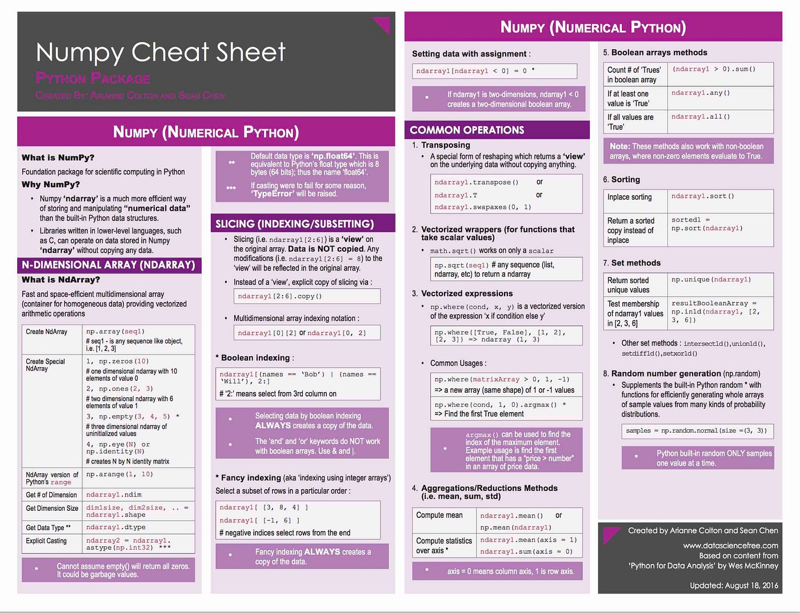

# Curso de Manipulación y Transformación de Datos con Pandas y NumPy

1. [Numpy](https://numpy.org/) 🔗 ↗️
2. [github.com/numpy/numpy : The fundamental package for scientific computing with Python.](https://platzi.com/clases/2912-pandas-numpy/47974-por-que-numpy-y-pandas/) 🔗 ↗️ :octocat:
3. [github.com/pandas-dev/pandas : Flexible and powerful data analysis / manipulation library for Python, providing labeled data structures similar to R data.frame objects, statistical functions, and much more](https://github.com/pandas-dev/pandas) 🔗 ↗️ :octocat:
4. [Pandas - General functions](https://pandas.pydata.org/docs/reference/general_functions.html) 🔗 ↗️
5. [Pandas - Release notes](https://pandas.pydata.org/docs/whatsnew/index.html) 🔗 ↗️
6. [10 minutes to pandas](https://pandas.pydata.org/docs/user_guide/10min.html) 🔗 ↗️

 Numpy Cheat Sheet 1

 Numpy Cheat Sheet 2

Black

```bash
black */*.py
```

Flake8

```bash
flake8 */*.py
```

isort multiples configuraciones

```bash
# sort multiple files
isort views.py urls.py

# show a diff before applying any change
isort views.py --diff

# just check for errors
isort urls.py --check-only
```

Aplicar cambios o verificar errores recursivamente

```bash
# check which files will be sorted
isort --recursive --check-only

# sort the whole project
isort --recursive .
```

pylint

```bash
pylint */*.py
```

## Jupyter notebook

Install the classic Jupyter Notebook with:

```bash
pip install notebook
```

To run the notebook:

```bash
jupyter notebook
# or
pipenv run jupyter notebook
```
