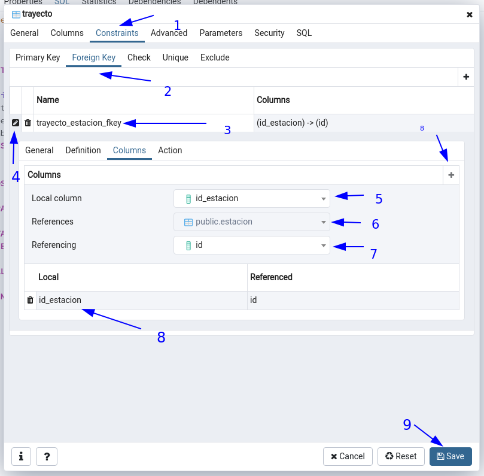

# PostgreSQL


## 1. Configurar Postgres
### 1. Bienvenida al curso
hola postgreSQL
### 2. ¿Qué es Postgresql?
- :link: [PostgreSQL 11.6 Documentation](https://www.postgresql.org/docs/11/index.html)
- :link: [PostgreSQL 11.6 Part VI. Reference](https://www.postgresql.org/docs/11/reference.html)
- :link: [PostgreSQL 11.6 Part Chapter 8. Data Types](https://www.postgresql.org/docs/11/datatype.html)
- :link: [PosgresSQL Course](https://www.youtube.com/playlist?list=PLwvrYc43l1MxAEOI_KwGe8l42uJxMoKeS)
- :octocat: [Learn by Example](https://github.com/vitaly-t/pg-promise/wiki/Learn-by-Example)

- Lenguaje
- Motor: PostgreSQL es un motor de BD Estructurar toda la informacion dentro de un servidor
- Servidor
- Ope Source
- Objeto-Relacional
- Desde 1986(University of California Berkley)
- PostGIS: Servicio de geolocalización, desarrollo de codigo interno
- PL/PgSQL: Permite desarrollar codigo dentro de PostgresSQL en el lenguaje de POstgreSQL
- Cumple con ACID: :open_file_folder: [ACID - acid_postgresql.pdf](https://github.com/macknilan/Cuaderno/blob/master/PostgreSQL/acid_postgresql.pdf)
    + Atomicidad
    + Consitencia
    + Aislamiento
    + Dirabilidad

+ Tipos de datos
+ Integridad de datos
+ Concurencia, rendimiento
+ Fiabilidad, recuperación ante desastres
+ Seguridad
+ Extensibilidad
+ Internacionalización, busqueda de texto


### 3. Instalación y configuración de la Base de Datos
#### Instalar PostgreSQL Debian 11.1

- Añadir en el archivo /etc/apt/sources.list
```bash
# PostgreSQL
# deb http://apt.postgresql.org/pub/repos/apt/ YOUR_DEBIAN_VERSION_HERE-pgdg main
deb http://apt.postgresql.org/pub/repos/apt/ stretch-pgdg main
# wget --quiet -O - https://www.postgresql.org/media/keys/ACCC4CF8.asc | sudo apt-key add -
```
- Importar la key
```bash
wget --quiet -O - https://www.postgresql.org/media/keys/ACCC4CF8.asc | sudo apt-key add -
sudo apt-get update
```
- Instalamos los paquetes de postgresql
```bash
apt-get install postgresql postgresql-client postgresql-contrib libpq-dev
```

:warning: __NOTA__: Por recomendación django se realizan los siguientes pasos para que se realisen de forma segura y mas eficiente Optimizando la configuración de POstgreSQL

+ :link: [Optimizing PostgreSQL’s configuration](https://docs.djangoproject.com/en/1.11/ref/databases/#optimizing-postgresql-s-configuration "Optimizing PostgreSQL’s configuration")

Esto acelerará las operaciones de base de datos de modo que los valores correctos no tengan que ser consultados y configurados cada vez que se establezca una conexión.

Se tiene que establecer la codificación por defecto a UTF-8, que es la que Django espera. También tienes que establecer el régimen de aislamiento de las transacciones de read committed, el cual bloquea la lectura de transacciones no confirmadas. Por último, se tendrá que establecer la zona horaria.
```bash
postgres=# ALTER ROLE [ROLE] SET default_transaction_isolation TO 'read committed';
postgres=# ALTER ROLE [ROLE] SET client_encoding TO 'utf8';
postgres=# ALTER ROLE [ROLE] SET timezone TO 'UTC';
```
- Cambiar/Asignar acceso y permisos al usuario para administrar la BD
```bash
postgres=# GRANT ALL PRIVILEGES ON DATABASE [NOMBRE_BD/ROLE] TO [USUARIO]; # ASIGNAR UNA B.D. A UN USUARIO
```

- Crear BD y un usuario para esa base de datos fuera del shell de PostgreSQL y dentro del usuario postgres(default)
```bash
 createuser mypguser #from regular shell
 createdb -O mypguser mypgdatabase
```

- Cambiar/asignar la contraseña del usuario creado, dentro de la consola de postgresql(PREFERENTEMENTE)
    - `postgres=# ALTER USER [USUARIO] WITH LOGIN ENCRYPTED PASSWORD '[CONTRASENA]';`
    - `postgres=# ALTER ROLE [USUARIO] WITH PASSWORD '[CONTRASENA]';`


### 4. Interacción con Postgres desde la Consola
#### Entrar a PostgreSql
- Para entrar a modo consola de PostgreSQL
```bash
$ psql
```
- Entrar con usuario a una BD previamente ya creados, estando posicionados en el usuario postgres
```bash
$ psql -h localhost -U [USUARIO] [NAME_DB]
```
Para entrar a la consola de PostgreSQL
```bash
$ sudo -u postgres psql
```
```bash
$ sudo su - postgres # ENTRAMOS AL USUARIO POSTGRES
postgres@host $ psql
postgres=# 
```
Si estamos logeados en la misma computadora donde esta PostgreSQL, para entrar a una BD especifica con un usuario especifico. Se cambian **mydb** y **myuser** por los correctos
```bash
$ psql -d mydb -U myuser
```
Para conectarse a un servidor remoto donde esta PostgreSQL, para entrar a una BD especifica con un usuario especifico. Se cambian **myhost** **mydb** y **myuser** por los correctos
```bash
$ psql -h myhost -d mydb -U myuser
```
Si al momento querer entrar a PostgreSQL no pregunta la contraseña, se usa la bandera `-w`
```bash
psql -d mydb -U myuser -W
psql -h myhost -d mydb -U myuser -W
```

## :warning: "NOTA" :warning: CAMBIAR LA CONTRASEÑA AL USUARIO "postgres"
Entrar a postgres de la siguiente forma
```bash
$ sudo -u postgres psql
```
_luego..._
```bash
$ \password postgres
# ESCRIBIR EL NUEVO PASSWORD
# CONFIRMAR EL PASSWORD
```
_luego..._
```bash
postgres=# \q
```
```bash
$ \l # LISTAR TODAS LAS BASES DE DATOS
$ \c NAME_DB # CAMBIAR A OTRA BASE DE DATOS
$ \dt # LISTAR TODAS LAS TABLAS DE LA BD
$ \d # DESCRIBIR LA BASE DE DATOS O LA TABLA
$ \h # VER TODAS LAS FUNCIONES QUE PODEMOS EJECUTAR EN POSTGRESQL
$ \h comando # SABER COMO SE OCUPA LA FUNCION EJE: \h DO
$ SELECT versión(); # VER LA VERSIÓN DE POSTGRESQL
$ \g # EJECUTAR LA ULTIMA FUNCIÓN QUE SE EJECUTO EN CONSOLA, NO IMPORTA QUE USUARIO EN POSTGRESQL LA EJECUTO
$ \timing # INICIALIZAR EL CONTADOR DE TIEMPO PARA QUE LA CONSOLA MUESTRE EN CADA EJECUCIÓN CUANTO SE DEMORO EN EJECUTAR ESE COMANDO
```

```bash
General - \? # for help with psql commands
\copyright  # show PostgreSQL usage and distribution terms
\g [FILE] or ;  # execute query (and send results to file or |pipe)
\gset [PREFIX]  # execute query and store results in psql variables
\h [NAME]  # help on syntax of SQL commands, * for all commands
\q  quit psql
\watch [SEC]  # execute query every SEC seconds

# Query Buffer
\e [FILE] [LINE]  # edit the query buffer (or file) with external editor
\ef [FUNCNAME [LINE]]  # edit function definition with external editor
\p  # show the contents of the query buffer
\r  # reset (clear) the query buffer
\s [FILE]  # display history or save it to file
\w FILE # write query buffer to file

# Input/Output
\copy ...  # perform SQL COPY with data stream to the client host
\echo [STRING]  # write string to standard output
\i FILE  # execute commands from file
\ir FILE  # as \i, but relative to location of current script
\o [FILE]  # send all query results to file or |pipe
\qecho # [STRING] write string to query output stream (see \o)


# Informational
(options: S = show system objects, + = additional detail)
\d[S+]  # list tables, views, and sequences
\d[S+] NAME  # describe table, view, sequence, or index
\da[S] [PATTERN]   # list aggregates
\db[+] [PATTERN]   # list tablespaces
\dc[S+] [PATTERN]   list conversions
\dC[+] [PATTERN]   # list casts
\dd[S] [PATTERN]   # show object descriptions not displayed elsewhere
\ddp [PATTERN]  # list default privileges
\dD[S+] [PATTERN]  # list domains
\det[+] [PATTERN]  # list foreign tables
\des[+] [PATTERN]  # list foreign servers
\deu[+] [PATTERN]  # list user mappings
\dew[+] [PATTERN]  # list foreign-data wrappers
\df[antw][S+] [PATRN]  # list [only agg/normal/trigger/window] functions
\dF[+] [PATTERN]  # list text search configurations
\dFd[+] [PATTERN]  # list text search dictionaries
\dFp[+] [PATTERN]  # list text search parsers
\dFt[+] [PATTERN]  # list text search templates
\dg[+] [PATTERN]  # list roles
\di[S+] [PATTERN]  # list indexes
\dl  # list large objects, same as \lo_list
\dL[S+] [PATTERN]  # list procedural languages
\dm[S+] [PATTERN]  # list materialized views
\dn[S+] [PATTERN]  # list schemas
\do[S] [PATTERN]  # list operators
\dO[S+] [PATTERN]  # list collations
\dp [PATTERN]  # list table, view, and sequence access privileges
\drds [PATRN1 [PATRN2]]  # list per-database role settings
\ds[S+] [PATTERN]  # list sequences
\dt[S+] [PATTERN]  # list tables
\dT[S+] [PATTERN]  # list data types
\du[+] [PATTERN]  # list roles
\dv[S+] [PATTERN]  # list views
\dE[S+] [PATTERN]  # list foreign tables
\dx[+] [PATTERN]  # list extensions
\dy [PATTERN]  # list event triggers
\l[+] [PATTERN]  # list databases
\sf[+]  # FUNCNAME show a function's definition
\z [PATTERN]  # same as \dp

# Formatting
\a  # toggle between unaligned and aligned output mode
\C  [STRING] # set table title, or unset if none
\f  [STRING] # show or set field separator for unaligned query output
\H  # toggle HTML output mode (currently off)
\pset [NAME [VALUE]]  # set table output option

(NAME := {format|border|expanded|fieldsep|fieldsep_zero|footer|null|

# numericlocale|recordsep|recordsep_zero|tuples_only|title|tableattr|pager})
\t [on|off]  # show only rows (currently off)
\T [STRING]  # set HTML <table> tag attributes, or unset if none
\x [on|off|auto]  # toggle expanded output (currently off)

# Connection
\c[onnect] {[DBNAME|- USER|- HOST|- PORT|-] | conninfo} 

# connect to new database (currently "postgres")
\encoding [ENCODING]  # show or set client encoding
\password [USERNAME]  # securely change the password for a user
\conninfo  # display information about current connection

#Operating System
\setenv NAME [VALUE]  # set or unset environment variable
\timing [on|off]  # toggle timing of commands (currently off)
\! [COMMAND]  # execute command in shell or start interactive shell

# Large Objects
\lo_export LOBOID FILE
\lo_import FILE [COMMENT]
\lo_list
\lo_unlink LOBOID large object operations
```


### 5. PgAdmin: Interacción con Postgres desde la Interfaz Gráfica
#### Instalación de pgAdmin4

+ :link: [pgAdmin 4 (APT)](https://www.pgadmin.org/download/pgadmin-4-apt/)
+ :link: [PostgreSQL packages for Debian and Ubuntu](https://wiki.postgresql.org/wiki/Apt)

```bash
# /etc/apt/sources.list
# PostgreSQL
deb http://apt.postgresql.org/pub/repos/apt/ buster-pgdg main
# wget --quiet -O - https://www.postgresql.org/media/keys/ACCC4CF8.asc | sudo apt-key add -

```
Ejecutar para instalar pgAdmin4
```bash
sudo apt-get update
sudo apt-get install pgadmin4
```
#### Configuración de pgAdmin4 para desktop

+ :link:[The config.py File](https://www.pgadmin.org/docs/pgadmin4/development/config_py.html#config-py)
+ :link:[Desktop Deployment](https://www.pgadmin.org/docs/pgadmin4/development/desktop_deployment.html#configuration)
+ :link:[Master Password](https://www.pgadmin.org/docs/pgadmin4/development/master_password.html)

Par deshabilitar el mensage al inicio **master password de pgAdmin4**

1. Localizar el archivo `config.py`.
2. Puede estar en la ruta `/usr/share/pgadmin4/web/config.py`
3. Crear el archivo `config_local.py` en el mismo folder, y escribir en el:
```bash
MASTER_PASSWORD_REQUIRED=False
```
4. Reiniciar el servicio de pgAdmin4

#### Command Functionality
```bash
$ sudo /etc/init.d/postgresql start Start server (Ubuntu)
$ psql -U postgres  Connect
postgres=# \l   Show databases
postgres=# \h   Help
postgres=# CREATE DATABASE jerry; # Create database
postgres=# DROP DATABASE jerry; # Delete database
postgres=# SET search_path TO schema; # above
Use schema
$ psql -U postgres -d # Use database
postgres=# \c test # Change database
postgres=# \du  # List users
postgres=# \d  # List tables
postgres=# CREATE SCHEMA sausalito; # Create schema
postgres=# \dn  # List schema
postgres=# DROP SCHEMA sausalito; # Drop schema
postgres=# SELECT * FROM sausalito.employees;  # Select rows
postgres=# CREATE TABLE sausalito.employees (id INT); # Create table
postgres=# INSERT INTO sausalito.employees VALUES (1);  # Insert record
postgres=# UPDATE sausalito.employees SET id = 4 WHERE id = 2;  # Update table record
postgres=# DELETE FROM sausalito.employees WHERE id = 3;  # Delete record
postgres=# DROP TABLE sausalito.employees;  # Drop table
postgres=# \q  # Quit from session
```
Si se muestra el mensaje `createuser: creation of new role failed: ERROR:  role "postgres" already exists` Y esto en ubuntu seguir con el paso seguiente.

_Let's start off our configuration by working with PostgreSQL. With PostgreSQL we need to create a database, create a user, and grant the user we created access to the database we created. Start off by running the following command:_

_The default database name and database user are called postgres._

*PARA CAMBIAR EL USUARIO postgresql PARA PODER HACER LA CONFIGURACIONES*
`$ sudo su - postgres` 

_Your terminal prompt should now say_ `postgres@yourserver`. _If this is the case, then run this command to create your database:_
`$ createdb mydb` _BORRAR BASE DE DATOS_: `$ dropdb dbname`

_Your database has now been created and is named_ `mydb` _if you didn't change the command. You can name your database whatever you would like. Now create your database user with the following command:_
`$ createuser` _ES CREAR USUARIO SIN NINGUN ATRIBUTO_


### 6. Archivos de Configuración

* postgresql.conf `/etc/postgresql/12/main/postgresql.conf` Archivo de configuracion
* pg_hba.conf `/etc/postgresql/12/main/pg_hba.conf` Mustra los roles y tipos/formas/equipos remotos de acceso a la BD, se refiere a autenfificación
* pg_ident.conf `/etc/postgresql/12/main/pg_ident.conf` Sirve para mapear usuario.


### 7. Comandos más utilizados en PostgreSQL

+ `postgres=# SELECT VERSION();`
+ `\?` Con el cual podemos ver la lista de todos los comandos disponibles en consola, comandos que empiezan con backslash ()
+ `\h` Con este comando veremos la información de todas las consultas SQL disponibles en consola. Sirve también para buscar ayuda sobre una consulta específica, para buscar información sobre una consulta específica basta con escribir \h seguido del inicio de la consulta de la que se requiera ayuda, así: `\h ALTER`

Comandos de navegación y consulta de información

+ `\c [NAME_DB]` Saltar entre bases de datos
+ `\l` Listar base de datos disponibles
+ `\dt` Listar las tablas de la base de datos
+ `\d` <nombre_tabla> Describir una tabla
+ `\dn` Listar los esquemas de la base de datos actual
+ `\df` Listar las funciones disponibles de la base de datos actual
+ `\dv` Listar las vistas de la base de datos actual
+ `\du` Listar los usuarios y sus roles de la base de datos actual

Comandos de inspección y ejecución

+ `\g` Volver a ejecutar el comando ejecutando justo antes
+ `\s` Ver el historial de comandos ejecutados
+ `\s <nombre_archivo>` Si se quiere guardar la lista de comandos ejecutados en un archivo de texto plano
+ `\i <nombre_archivo>` Ejecutar los comandos desde un archivo
+ `\e` Permite abrir un editor de texto plano, escribir comandos y ejecutar en lote. `\e` abre el editor de texto, escribir allí todos los comandos, luego guardar los cambios y cerrar, al cerrar se ejecutarán todos los comandos guardados.
+ `\ef` Equivalente al comando anterior pero permite editar también funciones en PostgreSQL

Comandos para debug y optimización  
+ `\timing` Activar / Desactivar el contador de tiempo por consulta

Comandos para cerrar la consola  
`\q` Cerrar la consola

#### Opciones para crear una BD

`createdb [connection-option...] [option...] [dbname [description]]`
```bash
dbname  # Specifies the name of the database to be created. The name must be unique among all PostgreSQL databases in this cluster. The default is to create a database with the same name as the current system user.
description  # Specifies a comment to be associated with the newly created database.
-D tablespace--tablespace=tablespace   #Specifies the default tablespace for the database. (This name is processed as a double-quoted identifier.)
-e--echo  # Echo the commands that createdb generates and sends to the server.
-E encoding--encoding=encoding # Specifies the character encoding scheme to be used in this database. The character sets supported by the PostgreSQL server are described in Section 23.3.1.
-l locale--locale=locale  #Specifies the locale to be used in this database. This is equivalent to specifying both --lc-collate and --lc-ctype.
--lc-collate=locale  # Specifies the LC_COLLATE setting to be used in this database.
--lc-ctype=locale  # Specifies the LC_CTYPE setting to be used in this database.
-O owner--owner=owner # Specifies the database user who will own the new database. (This name is processed as a double-quoted identifier.)
-T template--template=template # Specifies the template database from which to build this database. (This name is processed as a double-quoted identifier.)
-V--version # Print the createdb version and exit.
-?--help # Show help about createdb command line arguments, and exit.
# The options -D, -l, -E, -O, and -T correspond to options of the underlying SQL command CREATE DATABASE; see there for more information about them.
# createdb also accepts the following command-line arguments for connection parameters:
-h host--host=host # Specifies the host name of the machine on which the server is running. If the value begins with a slash, it is used as the directory for the Unix domain socket.
-p port--port=port # Specifies the TCP port or the local Unix domain socket file extension on which the server is listening for connections.
-U username--username=username # User name to connect as.
-w--no-password # Never issue a password prompt. If the server requires password authentication and a password is not available by other means such as a .pgpass file, the connection attempt will fail. This option can be useful in batch jobs and scripts where no user is present to enter a password.
-W--password # Force createdb to prompt for a password before connecting to a database.
# This option is never essential, since createdb will automatically prompt for a password if the server demands password authentication. However, createdb will waste a connection attempt finding out that the server wants a password. In some cases it is worth typing -W to avoid the extra connection attempt.
--maintenance-db=dbname # Specifies the name of the database to connect to when creating the new database. If not specified, the postgres database will be used; if that does not exist (or if it is the name of the new database being created), template1 will be used.
```
- Para crear una BD
```bash
postgres=# createdb [NAME_DB];
```
- Crear BD y un __usuario/role__ para esa base de datos dentro de __shell__ de postgresql
```bash
postgres=# CREATE DATABASE [NAME_DB] OWNER [NOMBRE_USR];
```
- Eliminar una BD
```bash
postgres=# DROP DATABASE [NAME_DB]; # Delete database
```

### 8. Presentación del Proyecto


### 9. Tipos de datos

- :link: [PostgreSQL data types, tipos de datos más utilizados](https://todopostgresql.com/postgresql-data-types-los-tipos-de-datos-mas-utilizados/)
- :link: [Chapter 8. Data Types](https://www.postgresql.org/docs/11/datatype.html)


| Name                                    	| Aliases            	| Description                                        	|
|-----------------------------------------	|--------------------	|----------------------------------------------------	|
| bigint                                  	| int8               	| signed eight-byte integer                          	|
| bigserial                               	| serial8            	| autoincrementing eight-byte integer                	|
| bit [ (n) ]                             	|                    	| fixed-length bit string                            	|
| bit varying [ (n) ]                     	| varbit [ (n) ]     	| variable-length bit string                         	|
| boolean                                 	| bool               	| logical Boolean (true/false)                       	|
| box                                     	|                    	| rectangular box on a plane                         	|
| bytea                                   	|                    	| binary data (“byte array”)                         	|
| character [ (n) ]                       	| char [ (n) ]       	| fixed-length character string                      	|
| character varying [ (n) ]               	| varchar [ (n) ]    	| variable-length character string                   	|
| cidr                                    	|                    	| IPv4 or IPv6 network address                       	|
| circle                                  	|                    	| circle on a plane                                  	|
| date                                    	|                    	| calendar date (year, month, day)                   	|
| double precision                        	| float8             	| double precision floating-point number (8 bytes)   	|
| inet                                    	|                    	| IPv4 or IPv6 host address                          	|
| integer                                 	| int, int4          	| signed four-byte integer                           	|
| interval [ fields ] [ (p) ]             	|                    	| time span                                          	|
| json                                    	|                    	| textual JSON data                                  	|
| jsonb                                   	|                    	| binary JSON data, decomposed                       	|
| line                                    	|                    	| infinite line on a plane                           	|
| lseg                                    	|                    	| line segment on a plane                            	|
| macaddr                                 	|                    	| MAC (Media Access Control) address                 	|
| macaddr8                                	|                    	| MAC (Media Access Control) address (EUI-64 format) 	|
| money                                   	|                    	| currency amount                                    	|
| numeric [ (p, s) ]                      	| decimal [ (p, s) ] 	| exact numeric of selectable precision              	|
| path                                    	|                    	| geometric path on a plane                          	|
| pg_lsn                                  	|                    	| PostgreSQL Log Sequence Number                     	|
| point                                   	|                    	| geometric point on a plane                         	|
| polygon                                 	|                    	| closed geometric path on a plane                   	|
| real                                    	| float4             	| single precision floating-point number (4 bytes)   	|
| smallint                                	| int2               	| signed two-byte integer                            	|
| smallserial                             	| serial2            	| autoincrementing two-byte integer                  	|
| serial                                  	| serial4            	| autoincrementing four-byte integer                 	|
| text                                    	|                    	| variable-length character string                   	|
| time [ (p) ] [ without time zone ]      	|                    	| time of day (no time zone)                         	|
| time [ (p) ] with time zone             	| timetz             	| time of day, including time zone                   	|
| timestamp [ (p) ] [ without time zone ] 	|                    	| date and time (no time zone)                       	|
| timestamp [ (p) ] with time zone        	| timestamptz        	| date and time, including time zone                 	|
| tsquery                                 	|                    	| text search query                                  	|
| tsvector                                	|                    	| text search document                               	|
| txid_snapshot                           	|                    	| user-level transaction ID snapshot                 	|
| uuid                                    	|                    	| universally unique identifier                      	|
| xml                                     	|                    	| XML data                                           	|


### 10. Diseño de la solución del Proyecto


### 11. Jerarquía de Bases de Datos

MER de ejemplo de curso


Toda jerarquía de base de datos se basa en los siguientes elementos:

- **Servidor de base de datos**: Computador que tiene un motor de base de datos instalado y en ejecución.
- **Motor de base de datos**: Software que provee un conjunto de servicios encargados de administrar una base de datos.
- **Base de datos**: Grupo de datos que pertenecen a un mismo contexto.
- **Esquemas de base de datos en PostgreSQL**: Grupo de objetos de base de datos que guarda relación entre sí (tablas, funciones, relaciones, secuencias).
- **Tablas de base de datos**: Estructura que organiza los datos en filas y columnas formando una matriz.

> PostgreSQL es un motor de base de datos.

+ **Estación**
    - Contiene la información de las estaciones de nuestro sistema, incluye datos de nombre con tipo de dato texto y dirección con tipo de dato texto, junto con un número de identificación único por estación.

+ **Tren**
    - Almacena la información de los trenes de nuestro sistema, cada tren tiene un modelo con tipo de dato texto y una capacidad con tipo de dato numérico que representa la cantidad de personas que puede llevar ese tren, también tiene un ID único por tren.

+ **Trayecto**
    - Relaciona los trenes con las estaciones, simula ser las rutas que cada uno de los trenes pueden desarrollar entre las estaciones

+ **Pasajero**
    - Es la tabla que contiene la información de las personas que viajan en nuestro sistema de transporte masivo, sus columnas son nombre tipo de dato texto con el nombre completo de la persona, direccion_residencia con tipo de dato texto que indica dónde vive la persona, fecha_nacimiento tipo de dato texto y un ID único tipo de dato numérico para identificar a cada persona.

+ **Viaje**
    - Relaciona Trayecto con Pasajero ilustrando la dinámica entre los viajes que realizan las personas, los cuales parten de una estación y se hacen usando un tren.

## 2. Gestión de la información en bases de datos
### 12. Creación de Tablas


Para saber el formato de que se esta ocupando con postgreSQL
```sql
SELECT current_date;
```

Crear una BD.   
eje:   
```bash
postgres=# CREATE DATABASE transporte;
# OUTPUT <p>CREATE DATABASE</p>
```
Cambiar a la BD creada
```bash
postgres=# \c transporte;
You are now connected to database "transporte" as user "postgres".
```
- Crear las tablas en la BD
    + pasajero
    + tren
    + estacion
    * trayecto
    + viaje

Crear la tabla _estacion_ el SQL correspondiente sería:
```sql
CREATE TABLE public.estacion
(
    id serial,
    nombre character varying,
    direccion character varying,
    CONSTRAINT estacion_pkey PRIMARY KEY (id)
);
```
Crear la tabla *pasajero* el SQL correspondiente sería:
```sql
CREATE TABLE public.pasajero
(
    id integer NOT NULL DEFAULT nextval('pasajero_id_seq'::regclass),
    nombre character varying(100) COLLATE pg_catalog."default",
    direccion_residencia character varying COLLATE pg_catalog."default",
    fecha_nacimiento date,
    CONSTRAINT pasajero_pkey PRIMARY KEY (id)
);
```

Crear la tabla *trayecto* el SQL correspondiente sería:
```sql
CREATE TABLE public.trayecto
(
    id serial,
    id_tren integer,
    id_estacion integer,
    nombre character varying,
    CONSTRAINT trayecto_pkey PRIMARY KEY (id)
);
```
Crear la tabla *viaje* el SQL correspondiente sería:
```sql
CREATE TABLE public.viaje
(
    id serial,
    id_pasajero integer,
    id_trayecto integer,
    inicio date,
    fin date,
    CONSTRAINT viaje_pkey PRIMARY KEY (id)
);
```

Crear la tabla *tren*, el SQL correspondiente sería:
```sql
CREATE TABLE tren ( id serial NOT NULL, modelo character varying, capacidad integer, CONSTRAINT tren_pkey PRIMARY KEY (id) );
```
La columna `id` será un número autoincremental (cada vez que se inserta un registro se aumenta en uno), `modelo` se refiere a _una referencia al tren_, `capacidad` sería la _cantidad de pasajeros que puede transportar_ y al final agregamos la *llave primaria* que será `id`.

Ahora que la tabla ha sido creada, podemos ver su definición utilizando el comando `\d tren`
```sql
                                   Table "public.tren"
  Column   |       Type        | Collation | Nullable |             Default              
-----------+-------------------+-----------+----------+----------------------------------
 id        | integer           |           | not null | nextval('tren_id_seq'::regclass)
 modelo    | character varying |           |          | 
 capacidad | integer           |           |          | 
Indexes:
    "tren_pkey" PRIMARY KEY, btree (id)
```
_PostgreSQL_ ha creado el campo id automáticamente cómo integer con una asociación predeterminada a una secuencia llamada `tren_id_seq`. De manera que cada vez que se inserte un valor, id tomará el siguiente valor de la secuencia, vamos a ver la definición de la secuencia. Para ello, `\d tren_id_seq` es suficiente:
```sql
transporte=# \d
             List of relations
 Schema |    Name     |   Type   |  Owner   
--------+-------------+----------+----------
 public | tren        | table    | postgres
 public | tren_id_seq | sequence | postgres
#
transporte=# \d tren_id_seq
                    Sequence "public.tren_id_seq"
  Type   | Start | Minimum |  Maximum   | Increment | Cycles? | Cache 
---------+-------+---------+------------+-----------+---------+-------
 integer |     1 |       1 | 2147483647 |         1 | no      |     1
Owned by: public.tren.id
```
Se inserta un registro
```sql
INSERT INTO tren( modelo, capacidad ) VALUES (‘Volvo 1’, 100);
```
```sql
transporte=# SELECT * FROM tren;
 id | modelo  | capacidad 
----+---------+-----------
  1 | Volvo 1 |       100
(1 row)
```
**Modificar** el registro por un modelo "Honda 0726"
```sql
UPDATE tren SET modelo = 'Honda 0726' Where id = 1;
```
**Eliminar** el registro creado
```sql
DELETE FROM tren WHERE id = 1;
#
transporte=# DELETE FROM tren WHERE id = 1;
DELETE 1
```
Activar la funcion para medir el tiempo de una consulta.
```sql
transporte=# \timing
Timing is on.
```
Probemos cómo funciona al medición realizando la encriptación de un texto cualquiera usando el algoritmo **md5**:
```sql
transporte=# SELECT MD5('Encriptar el texto con MD5 como ejemplo');
               md5                
----------------------------------
 c892d52fbb55da7ad5b80a9c4d535c9d
(1 row)

Time: 11.464 ms
```


### 13. Particiones
:link: [5.10. Table Partitioning - Chapter 5. Data Definition](https://www.postgresql.org/docs/10/ddl-partitioning.html)

:pushpin: **NOTA:** Solo se puede hace la partición de una tabla cuando se crea. _No es posible crear llaves primarias en tablas paticionadas._

+ Se recomienda el uso de tablas particionadas cuando se quiera almacenar información en masa, como logs o vitacoras.
+ Separación fisica de datos; pero conserva la misma estructura logica. Guardar varias partes de la misma tabla en diferentes partes del disco o en otros discos. 
+ Estructura logica.

NOTA: _No es posible crear llaves primarias en tablas particionadas_

1. Crear una tabla `vitacora viaje`   


2. Crear las tablas para sin realizar ninguna llave primaria   


3. En la pestaña de **Partition** establecer la forma en que se particionara, que puede ser por _COLUMNA_ y _EXPRESION_ ; se establlece que sea por _COLUMNA_. "fecha". Esto quiere decir que se va a crear diferentes tablas con rangos de fechas para guardar info.   


4. Se crea la siguiente secuencia SQL. Hasta este paso no se a agregado ninguna tabla particionada; no se a agredado ningún segmento.   


5. Para crear las particiones necesarias que en este ejemplo es para guardar fechas por mes; sobre el nombre de la tabla > boton derecho > INSERT Script
```sql
INSERT INTO public.vitacora_viaje(
    id_viaje, fecha)
    VALUES (1, '2010-01-01');

CREATE TABLE vitacora_viaje201001 PARTITION OF vitacora_viaje
FOR VALUES FROM ('2010-01-01') TO ('2010-02-01');
```
Con este script, se esta especificando que solo se acepte insertar datos en este rango de fechas y almacenando el registro en una tabla particionada con el nombre `vitacora_viaje201001` que hace referencia solo al mes de _enero_ (01), para el mes de _febrero_ sería `vitacora_viaje201002` 

6. Seleccionando el codigo para ejecutar lo y se cree la partición
```sql
CREATE TABLE vitacora_viaje201001 PARTITION OF vitacora_viaje
FOR VALUES FROM ('2010-01-01') TO ('2010-02-01');
```

05
7. Se hace la comprobación para insertar datos
```sql
INSERT INTO public.vitacora_viaje(
    id_viaje, fecha)
    VALUES (1, '2010-01-01');
```
8.  Se traen de vuelta los datos para ver su correcta inserción
```sql
SELECT * FROM vitacora_viaje;
```
9. Se crean tablas particionanas para todos los meses del año
```sql
CREATE TABLE vitacora_viaje201002 PARTITION OF vitacora_viaje
FOR VALUES FROM ('2010-02-01') TO ('2010-03-01');

CREATE TABLE vitacora_viaje201003 PARTITION OF vitacora_viaje
FOR VALUES FROM ('2010-03-01') TO ('2010-04-01');

CREATE TABLE vitacora_viaje201004 PARTITION OF vitacora_viaje
FOR VALUES FROM ('2010-04-01') TO ('2010-05-01');

CREATE TABLE vitacora_viaje201005 PARTITION OF vitacora_viaje
FOR VALUES FROM ('2010-05-01') TO ('2010-06-01');

CREATE TABLE vitacora_viaje201006 PARTITION OF vitacora_viaje
FOR VALUES FROM ('2010-06-01') TO ('2010-07-01');

CREATE TABLE vitacora_viaje201007 PARTITION OF vitacora_viaje
FOR VALUES FROM ('2010-07-01') TO ('2010-08-01');

CREATE TABLE vitacora_viaje201008 PARTITION OF vitacora_viaje
FOR VALUES FROM ('2010-08-01') TO ('2010-09-01');

CREATE TABLE vitacora_viaje201009 PARTITION OF vitacora_viaje
FOR VALUES FROM ('2010-09-01') TO ('2010-10-01');

CREATE TABLE vitacora_viaje2010010 PARTITION OF vitacora_viaje
FOR VALUES FROM ('2010-10-01') TO ('2010-11-01');

CREATE TABLE vitacora_viaje2010011 PARTITION OF vitacora_viaje
FOR VALUES FROM ('2010-11-01') TO ('2010-12-01');

CREATE TABLE vitacora_viaje2010012 PARTITION OF vitacora_viaje
FOR VALUES FROM ('2010-12-01') TO ('2011-01-01');
```

Otra de las ventajas de las tablas particionadas es que puedes utilizar la sentencia `TRUNCATE`, la cual elimina toda la información de una tabla, pero a nivel partición.

Es decir, si tienes una tabla con 12 particiones (1 para cada mes del año) y deseas eliminar toda la información del mes de Enero; con la sentencia `ALTER TABLE tabla TRUNCATE PARTITION enero;` podrías eliminar dicha información sin afectar el resto.

### 14. Creación de Roles
+ Lo que puede ahcer un rol   
    1. Crear y aliminar
    2. Asignar atributos
    3. Agrupar con otros roles
    4. Roles predeterminados

Listar todos los roles.
```bash
\dg[+] [PATTERN]  # list roles
```

```bash
postgres=# \h CREATE ROLE
Command:     CREATE ROLE
Description: define a new database role
Syntax:
CREATE ROLE name [ [ WITH ] option [ ... ] ]

where option can be:

      SUPERUSER | NOSUPERUSER
    | CREATEDB | NOCREATEDB
    | CREATEROLE | NOCREATEROLE
    | INHERIT | NOINHERIT
    | LOGIN | NOLOGIN
    | REPLICATION | NOREPLICATION
    | BYPASSRLS | NOBYPASSRLS
    | CONNECTION LIMIT connlimit
    | [ ENCRYPTED ] PASSWORD 'password' | PASSWORD NULL
    | VALID UNTIL 'timestamp'
    | IN ROLE role_name [, ...]
    | IN GROUP role_name [, ...]
    | ROLE role_name [, ...]
    | ADMIN role_name [, ...]
    | USER role_name [, ...]
    | SYSID uid

URL: https://www.postgresql.org/docs/12/sql-createrole.html
```

- Para crear un usuario por default
```bash
$ createuser -> ES CREAR USUARIO SIN NINGUN ATRIBUTO
```
- Para crear un usuario de forma interactiva
```bash
$ createuser --interactive mack
Shall the new role be a superuser? (y/n) n
Shall the new role be allowed to create databases? (y/n) n
Shall the new role be allowed to create more new roles? (y/n) n
```
- Crear  usuario __mack__ usando el localhost __lamaquina__ por el puerto __5000__, con atributos especificados
```bash
$ createuser -h lamaquina -p 5000 -S -D -R -e mack
```
```bash
postgres=# CREATE ROLE mack NOSUPERUSER NOCREATEDB NOCREATEROLE INHERIT LOGIN;
```
- El manejo de roles en PostgreSQL permite diferentes configuraciones, entre ellas estan:
    + `SUPERUSER/NOSUPERUSER`. Super usuario, privilegios para crear bases de datos y usuarios.
    + `CREATEDB/NOCREATEDB`. Permite crear bases de datos.
    + `CREATEROLE/NOCREATEROLE`. Permite crear roles.
    + `CREATEUSER/NOCREATEUSER`. Permite crear usuarios.
    + `LOGIN/NOLOGIN`. Este atributo hace la diferencia entre un rol y usuario. Ya que el usuario tiene permisos para acceder a la base de datos a traves de un cliente.
    + `PASSWORD`. Permite alterar la contraseña.
    + `VALID UNTIL`. Expiración de usuarios.
eje-
```bash
postgres=# ALTER ROLE [NOMBRE_DEL_ROL] WITH [opciones]
```
- Crear usuario __sin privilegios__ _para crear BD, no crear BD, no crear roles y no es super usuario_
```bash
postgres=# CREATE ROLE [NOMBRE_USR] NOSUPERUSER NOCREATEDB NOCREATEROLE LOGIN ENCRYPTED PASSWORD '[PWD_USR_DB]';
```
- Crear usuario __mack__ como __super usuario__ y asignarle una contraseña
```bash
$ createuser -P -s -e mack
Enter password for new role: xyzzy
Enter it again: xyzzy
CREATE ROLE mack PASSWORD 'md5b5f5ba1a423792b526f799ae4eb3d59e' SUPERUSER CREATEDB CREATEROLE INHERIT LOGIN;
```
- Crear usuario con contraseña encriptada.
```bash
postgres=# CREATE ROLE [NOMBRE_USR] LOGIN ENCRYPTED PASSWORD '[PWD_USR_DB]';
```
- Eliminar un usuario
```bash
postgres=# DROP USER [NOMBRE_USR];
```
#### Para verificar el usuario creado
```bash
$ psql
$ \du # LISTAR LOS USUARIOS
$ \dg # LISTAR LOS USUARIOS
$ \l # LISTAR LAS BASES DE DATOS CREADAS
$ \dl # DESPLEGAR LAS TABLAS DE LA BD CONECTADA
$ \q # Salir de la consola de postgresql
```

Para crear desde consola de PostgreSQL y crear el usuario `usuario_consulta` con la contraseña `etc123` con las opciones descritas anteriormente.
```sql
CREATE ROLE usuario_consulta WITH LOGIN NOSUPERUSER INHERIT NOCREATEDB NOCREATEROLE NOREPLICATION ENCRYPTED PASSWORD 'etc123';
```
#### Crear roles con pgadmin4
   

   
En las tablas en las cuales se les dio permiso se muestra la siguiente linea en la sentencia `SQL` para comprobar que tiene los permisos que se le concedio.
```sql
GRANT INSERT, SELECT, UPDATE ON TABLE public.estacion TO usuraio_consulta;
```

#### Crear usuario
```bash
createuser [connection-option...] [option...] [username]
```
- Entrar con el usuario *PostgreSQL* e entrar directo a la terminal interactiva de *PostgreSQL*
```bash
$ sudo -u postgres psql
```
```bash
username #Specifies the name of the PostgreSQL user to be created. This name must be different from all existing roles in this PostgreSQL installation.
-c number--connection-limit=number #Set a maximum number of connections for the new user. The default is to set no limit.
-d--createdb #The new user will be allowed to create databases.
-D--no-createdb #The new user will not be allowed to create databases. This is the default.
-e--echo #Echo the commands that createuser generates and sends to the server.
-E--encrypted #This option is obsolete but still accepted for backward compatibility.
-g role--role=role #Indicates role to which this role will be added immediately as a new member. Multiple roles to which this role will be added as a member can be specified by writing multiple -g switches.
-i--inherit #The new role will automatically inherit privileges of roles it is a member of. This is the default.
-I--no-inherit #The new role will not automatically inherit privileges of roles it is a member of.
--interactive #Prompt for the user name if none is specified on the command line, and also prompt for whichever of the options -d/-D, -r/-R, -s/-S is not specified on the command line. (This was the default behavior up to PostgreSQL 9.1.)
-l--login #The new user will be allowed to log in (that is, the user name can be used as the initial session user identifier). This is the default.
-L--no-login #The new user will not be allowed to log in. (A role without login privilege is still useful as a means of managing database permissions.)
-P--pwprompt #If given, createuser will issue a prompt for the password of the new user. This is not necessary if you do not plan on using password authentication.
-r--createrole #The new user will be allowed to create new roles (that is, this user will have CREATEROLE privilege).
-R--no-createrole #The new user will not be allowed to create new roles. This is the default.
-s--superuser #The new user will be a superuser.
-S--no-superuser #The new user will not be a superuser. This is the default.
-V--version #Print the createuser version and exit.
--replication #The new user will have the REPLICATION privilege, which is described more fully in the documentation for CREATE ROLE.
--no-replication #The new user will not have the REPLICATION privilege, which is described more fully in the documentation for CREATE ROLE.
-?--help #Show help about createuser command line arguments, and exit. createuser also accepts the following command-line arguments for connection parameters:
-h host--host=host #Specifies the host name of the machine on which the server is running. If the value begins with a slash, it is used as the directory for the Unix domain socket.
-p port--port=port #Specifies the TCP port or local Unix domain socket file extension on which the server is listening for connections.
-U username--username=username #User name to connect as (not the user name to create).
-w--no-password #Never issue a password prompt. If the server requires password authentication and a password is not available by other means such as a .pgpass file, the connection attempt will fail. This option can be useful in batch jobs and scripts where no user is present to enter a password.
-W--password #Force createuser to prompt for a password (for connecting to the server, not for the password of the new user). This option is never essential, since createuser will automatically prompt for a password if the server demands password authentication. However, createuser will waste a connection attempt finding out that the server wants a password. In some cases it is worth typing -W to avoid the extra connection attempt.
```


### 15. Llaves foráneas
:link: [Foreign key Dialog](https://www.pgadmin.org/docs/pgadmin4/4.19/foreign_key_dialog.html)

Relacion que existen entre las tablas y la información es congruente. 

1. Tabla de origen
2. Tabla destino
3. Acciones



1. Seleccionar la pertaña de _Constrains_
2. Seleccionar Foreing Key
3. Escribir el nombre de la llave foranea nombredelatablaorigen_nombredelatabladestino_fkey
4. Seleccionar el boton de modificar
5. Y en la pestaña Columns seleccionar el campo local
6. La tabla de referencia
7. Y el campo de la abla de referencia
8. Guardar/agregar
9. Salvar
10. Establecer las acciones en la pestaña Action cuando se actialice y/o eliminen datos en las tablas relacionadas

Se tiene que establecer las relaciones tal cual estan en el MER

Relacion de la tabla "trayecto" y la tabla "estacion"
```sql
ALTER TABLE public.trayecto
    ADD CONSTRAINT trayecto_estacion_fkey FOREIGN KEY (id_estacion)
    REFERENCES public.estacion (id) MATCH SIMPLE
    ON UPDATE CASCADE
    ON DELETE CASCADE
    NOT VALID;
```

### 16. Inserción y consulta de datos

Insertar datos en la tabla estacion por medio de pgAdmin   


Para insertar datos en la tabla _estacion_
```sql
INSERT INTO public.estacion(
	nombre, direccion)
	VALUES ('Estacion Norte', 'St 100#112');
```


### 17. Inserción masiva de datos

:link: **Inserción masiva de datos** :link: [mockaroo](https://mockaroo.com/) Need some mock data to test your app? Mockaroo lets you generate up to 1,000 rows of realistic test data in CSV, JSON, SQL, and Excel formats.

Download data using your browser or sign in and create your own [Mock APIs](https://mockaroo.com/mock_apis). 


Los archivos se encuentran en la carpeta _docs_, primero insertar datos en la tablas que no dependen de otras tablas.

## 3. Generar consultas avanzadas
### 18. Cruzar tablas: SQL JOIN


```sql
-- QUE PASAJEROS AN TOMADO ALMENOS UN VIAJE
SELECT * FROM pasajero
INNER JOIN viaje ON (viaje.id_pasajero = pasajero.id);

-- QUIENES NO AN TOMADO NINGUN VIAJE
SELECT * FROM pasajero
LEFT JOIN viaje ON (viaje.id_pasajero = pasajero.id)
WHERE viaje.id ISNULL;

--
SELECT 
pasajero.nombre AS pasajero,
tren.modelo AS tren,  
trayecto.nombre AS trayecto, 
estacion.nombre AS estacion,
viaje.inicio, 
viaje.fin
FROM pasajero
INNER JOIN viaje
ON viaje.id_pasajero = pasajero.id
INNER JOIN trayecto
ON viaje.id_trayecto = trayecto.id
INNER JOIN tren
ON trayecto.id_tren = tren.id
INNER JOIN estacion
ON trayecto.id_estacion = estacion.id;
```


### 19. Funciones Especiales Principales

:link: [PostgreSQL: On Conflict Do Nothing](https://www.youtube.com/watch?v=7yscNEvrrew)

- `ON CONFLICT DO`: Nos ayuda al momento de querer insertar o modificar datos, en una tabla que se pueda y depues se hace la modificación correcta; nos permite acctualizar sobre un solo dato 
- `RETURNING`: Devuelve el el resultado de la operación de un query. Es fundamental para en la creación y uso de Stored Procedures transaccionales; al momento de insertar información con id autoincremental, con RETURNING se puede obtener el valor del id e insertarlo o referenciarlo en otras tablas.
- `LIKE / ILIKE`: Sirve para hacer bisquedas de tipo expresiones regulares
- `IS / IS NOT`: Compara dos tipos de datos que no sean estandar si no que sean tipo objeto ó nulo


```sql
-- INSERCION DE UN DATO QUE YA EXISTE, NO PASA NADA
INSERT INTO public.estacion(
    id, nombre, direccion)
	VALUES (1, 'Nombre', 'Dire')
	ON CONFLICT DO NOTHING;

-- INSERCION DE UN DATO QUE YA EXISTE, TE CAMBIA LOS CAMPOS DE NOMBRE Y DIRECCION
INSERT INTO public.estacion(
    id, nombre, direccion)
    VALUES (1, 'Nombre', 'Dire')
    ON CONFLICT (id) DO UPDATE SET nombre = 'Nombre', direccion = 'Dire';

-- INSERTARA UNA TUPLA Y MOSTRARA LA TUPLA
INSERT INTO public.estacion(nombre, direccion)
    VALUES ('RETU', 'RETDIRE')
    RETURNING *;

-- %: UNO O CUALQUIER VALOR
-- _: UN VALOR
SELECT nombre FROM public.pasajero
    WHERE nombre LIKE'o%';
-- BUSCAMOS SIN IMPORTAR MAYUSCULAS O MINUSCULAS
SELECT nombre FROM public.pasajero
    WHERE nombre ILIKE'o%';

-- SI UNA ESTACION O TREN TIENE UN VALOR NULO
SELECT * FROM public.tren
    WHERE modelo ISNULL;
```

### 20. Funciones Especiales Avanzadas

* COALES: Compara dos valores y retorna el que es nulo
* NULLIF: Retorna null si son iguales
* GREATEST: Compara un arreglo y retorna el mayor
* LEAST: Compara un arreglo de valores y retorna el menor
* BLOQUES ANONIMOS: Ingresa condicionales dentro de una consulta de BD

```sql
-- BUSCA DE LA TABLA pasajero EL ID 1
SELECT * FROM pasajero WHERE id = 1;
--  DE LA TABLA pasajero SETEA EL CAMPO nombre DEL ID 1 A null
UPDATE pasajero SET nombre = NULL WHERE id = 1;
--  
SELECT COALESCE(nombre, 'Nombre en Null'), * FROM pasajero WHERE id = 1;
--  
SELECT COALESCE(nombre, 'Nombre en Null') nombre, * FROM pasajero WHERE id = 1;
--  
SELECT NULLIF(0,0);
--  
SELECT NULLIF(0,1);
--  
SELECT GREATEST(5,5,8,95,75,4225,8,6,9,212,6);
--  
SELECT LEAST(5,5,8,95,75,4225,8,6,9,212,6);

-- BLOQUES ANONIMOS
--  DE LA PASAJERO CUANDO EL VALOR DEL CAMPO DE fecha_pasajero sea mayor a 2015-01-01 ENEL CAMPO CASE DE LA TABLA DE REULTADO SE ESCRIBIRÁ "NIÑO" EM CASP CONTRARIO "MAYOR"
SELECT id, nombre, direccion_residencia, fecha_nacimiento,
CASE
WHEN fecha_nacimiento > '2015-01-01' THEN
'NIÑO'
ELSE
'MAYOR'
END
	FROM public.pasajero;
--  
```

```sql
SELECT id, nombre, fecha_nacimiento,
	CASE
	WHEN nombre ILIKE 'a%' THEN 'Comienza con A' 
	WHEN nombre ILIKE 'e%' THEN 'Comienza con E'
	WHEN nombre ILIKE 'i%' THEN 'Comienza con I'
	WHEN ( current_date - fecha_nacimiento) > 6570 Then 'Es mayor de 18 años'
	ELSE'Su nombre no inicia con A, E o I y ademas es un niño'
	END
FROM pasajero ORDER BY fecha_nacimiento;
```

### 21. Vistas
Una vista es una consulta se repite muchas veces y se convierte en un solo nombre

1. Volatil. Siempre que ejecuta la colsulta busca en la  y hace que la información que se consigue sea reciente
2. Materializada(Persistente). Siempre que ejecuta la colsulta el resultado se guarda en memoria, y la sifuiente ocasión que se ejecuja la vista traé el resultado en memoria 

Se selecciona la consulta para crear la vista   


1. Asi se mustra la vista creada
2. Forma de ejecutar la vista   


Igual que la vista _volatil_ primero se crea una consulta
```sql
SELECT *
FROM viaje
WHERE inicio > '22:00:00';
```


Es importante es si queremos llenar con datos la vista materializada al comento que se guarde la vista, y no, si queremos que cuando se ejecute por primera vez guarde los datos.   


Como se muestra la vista materializada en codigo y guardar


Se tienen que llegar con datos la primera vez que se ejecuta
```sql
REFRESH MATERIALIZED VIEW despues_noche_mview;
```

### 22. PL/SQL

:link: [Chapter 39. PL/pgSQL - SQL Procedural Language](https://www.postgresql.org/docs/9.2/plpgsql.html)
:link: [Procedimientos almacenados y PL/pgSQL](https://e-mc2.net/es/procedimientos-almacenados-y-plpgsql)


Las funciones y procedmientos almacenados son una gran herramienta para realizar las consultas de los datos. Esto optimiza recursos y le saca el jugo al motor de base de datos. Muchas empresas colocan la logica del negocio en la base de datos y asi pueden mejorar el rendimiento y cualquier arreglo en las consultas son mas sencillo de implementar.

_PL Procedural language_, también conocido como procedimientos almacenados, estas nos ayuda a desarrollar código 
directamente en el motor de bases de datos.

Estructura de un Pl es: Declaración + uso de variable + código + fin + retorno de valores o no retorna valores.

UN bloque de código se ejecuta con la palabra
```sql
DO $$
    BEGIN
    --insert código here
END
$$
```
`RAISE NOTICE ‘message’,` esta sentencia es para enviar un mensaje en el log de postgres

:link: [Retornar una tabla Stackoverflow](https://stackoverflow.com/questions/18084936/pl-pgsql-functions-how-to-return-a-normal-table-with-multiple-columns-using-an)


`DO $$` Declaración de un bloque de código SQL

Ejemplo de declaración de bloques de código con plpgsql
```sql
DO $$ 
    DECLARE
        rec record;
        contador integer :=0;
    BEGIN 
        -- RECORRE TABLA PASAJERO Y LO GUARDA EN LA VARIABLE rec
        FOR rec INSELECT * FROM pasajero LOOP 
            RAISE NOTICE 'id: % , Nombre: % ', rec.id, rec.nombre;
            contador := contador + 1;
        END LOOP;
        RAISE NOTICE 'cantidad de registros: %', contador;
    END 
$$
```
`CREATE FUNTION` Declaración de una función SQL
```sql
CREATE FUNCTION  consulta_usuarios() 
    RETURNS void
    LANGUAGE 'plpgsql';
AS $BODY$ 
    DECLARE
        rec record;
        contador integer :=0;
    BEGIN 
        -- RECORRE TABLA PASAJERO Y LO GUARDA EN LA VARIABLE rec
        FOR rec INSELECT * FROM pasajero LOOP 
            RAISE NOTICE 'id: % , Nombre: % ', rec.id, rec.nombre;
            contador := contador + 1;
        END LOOP;
        RAISE NOTICE 'cantidad de registros: %', contador;
    END 
$BODY$
```
OTRO Ejemplo:

Retornar una tabla con `plpgsql` **¡importante!** es importante cual select uses para llamar la función. La función funciona de la siguiente manera en el parámetro sí se introduce _NULL_ retorna toda la lista, si se introduce _id_ retornará esa tupla
```sql
-- FUNCION QUE RETORNA UNA TABLA
-- MOSTRAR TABLA CON PLPGSQL
-- https://stackoverflow.com/questions/18084936/pl-pgsql-functions-how-to-return-a-normal-table-with-multiple-columns-using-an

-- SI EM MEMORIA YA EXISTE EN MEMORIA LA FUNCION 
DROP FUNCTION consulta_t_pasajero(p_pasajero_id integer);
-- 
CREATE OR REPLACE FUNCTION consulta_t_pasajero(p_pasajero_id integer) 
RETURNS TABLE(idinteger, nombre charactervarying, direccion_residencia charactervarying, fecha_nacimiento date) 
LANGUAGE plpgsql
AS $BODY$
    BEGIN
		IF p_pasajero_id IS NULL THEN 
		 RETURN QUERY 
			SELECT pasajero.id, pasajero.nombre, pasajero.direccion_residencia, pasajero.fecha_nacimiento
			FROM public.pasajero;
		END IF;
		RETURN QUERY 
			SELECT pasajero.id, pasajero.nombre, pasajero.direccion_residencia, pasajero.fecha_nacimiento
			FROM public.pasajero
			WHERE pasajero.id = p_pasajero_id;
    END;
$BODY$

-- RETORNO EN FORMA DE FILA
SELECT consulta_t_pasajero(NULL); 
SELECT consulta_t_pasajero(50);
-- RETORNO EN FORMA DE TABLA
SELECT * FROM consulta_t_pasajero(NULL);
SELECT * FROM consulta_t_pasajero(50);
```


En la pestaña de _Code_ se inserta el código de la funcion sin `$$`

En la pestaña _Definition_ se selecciona el tipo de dato a retornar -> `integer` y el tipo de lenguaje que se ocupa para la funcion -> `plpgsql`

Las demás pestañas se quedan sin modificación.


NOTA: Si el nombre de la _PL_ tiene mayusculas pgAdmin le pone comullas dobles al momento de mandarla la llamar

Para saber como llamar a la funcion   


Para llamar a la funcion del ejemplo es
```sql
SELECT public."importantPL"
```

### 23. Triggers

Los triggers son de gran ayuda, ya que permiten poblar bitácoras (por ejemplo) al momento de realizar inserts o updates dentro de tablas contenidas dentro de nuestro sistema. Su estructura es:

1. Creación de función con tipo de RETURN TRIGGER.
2. Creación de trigger asociado a una acción y momento concreto sobre una tabla
    * [AFTER, BEFORE, INSTEAD] [UPDATE,INSERT,DELETE,TRUNCATE]


Para la creación de triggers se debe hacer los siguiente

- Crear la función que activará el evento. Para ello se debe tomar los siguientes aspectos:
    1. En la declaración de la función, en la sección del retorno se debe indicar que es tipo triggers es decir `RETURNS TRIGGER`. Luego indicar en que lenguaje está escrito es decir `LANGUAE ‘plpgsql’`
    2. La función tipo triggers debe retornar los valores `OLD` acepta lo viejo o `NEW` acepta lo nuevo. Sí se retorna `VOID` en nuestra función de tipo triggers no aceptamos cambios es decir `RETURN NEW;`
    3. Tanto `NEW` como `OLD` son un objeto de tipo record y contiene dentro de si el registro, es decir se puede acceder a los campos `NEW.campo_nombre` del registro

```sql
DROP FUNCTION IF EXISTS  count_on_insert_pasajero() CASCADE;

CREATE OR REPLACE FUNCTION count_on_insert_pasajero()
	RETURNS TRIGGER
	LANGUAGE 'plpgsql'
AS $BODY$
	DECLARE 
		contador integer:=0;
		rec record;
	BEGIN
		FOR rec INSELECT * FROM pasajero LOOP 
			contador := contador + 1;
		END LOOP;
		RAISE NOTICE 'cantidad de registros:	%', contador;
		
		-- insert record on conteo_pasajero
		INSERT IN TO public.conteo_pasajero (total_pasajero,hora_conteo)
		VALUES (contador, now());
		
		RETURN NEW;
	END;	
$BODY$
```
Lo siguiente será crear la regla que estará a la escucha del evento para disparar el triggers, para ello se deberá tomar los siguientes aspectos.

1. 
```sql
CREATE TRIGGER name_trigger name_event ON name_table FOR EACH ROW EXECUTE PROCEDURE name_procedure;
```
2. En la primera sección cuando declaramos el trigger debemos indicar en que momento en que se debe disparar el trigger:
```sql
CREATE TRIGGER name_trigger name_event ON name_table
```
en el `name_event` allí puede ir alguno d estos tres parámetros para llamar la ejecución del trigger, estos son:
+ BEFORE = antes,
+ AFTER=luego,
+ INSTEAD OF = hacer esto, en vez de lo que iba a hacer el motor de bases de datos.

1. 
```sql
FOR EACH ROW EXECUTE PROCEDURE name_procedure
```
indica que es para registro o fila de nuestra tabla
```sql
-- CREACIÓN DE LA REGLA PARA EJECUTAR EL TRIGGER
CREATE TRIGGER trigger_on_insert_to_pasajero
AFTER INSERT ON pasajero 
FOR EACH ROW EXECUTE PROCEDURE count_on_insert_pasajero(); 
```

## 4. Integrar bases de datos con servicios externos
### 24. Simulando una conexión a Bases de Datos remotas


Creamos una BD llamada remota
Donde tenga una tabla llamada `vip(id, fecha)`

El `usuario_consulta` debe de tener permisos sobre la tabla a consultar(remota)

Creamos la extension `dblink`
```sql
CREATE EXTENSION dblink;
```
Lo que haremos es acceder a esa BD atraves de la BD transporte
```sql
SELECT * FROM 
dblink ('dbname=remota 
        port=5432 
        host=127.0.0.1 
        user=usuario_consulta 
        password=etc123',
        'SELECT * FROM vip')
        AS datos_remotos (id integer, fecha date);
```
Uniremos(JOIN) la tabla pasajero con la tabla vip de la BD remota
```sql
SELECT * FROM pasajero
JOIN 
dblink ('dbname=remota 
        port=5432 
        host=127.0.0.1 
        user=usuario_consulta 
        password=123456',
        'SELECT * FROM vip')
        AS datos_remotos (id integer, fecha date)
USING (id)
-- SE PUDE OCUPAR USING SOLO SI LOS DOS CAMPOS A COMPAR SON DEL TIPO IGUAL
-- ON (pasajero.id = datos_remotos.id);
```
### 25. Transacciones

Muy importante para mantener la integridad de los datos. Hay que tene rmucho cuidado en cerrar siempre la transaccion, ya sea con `COMIMIT` o `ROLLBACK`.

Procesos complejos seguros
```sql
BEGIN
<consultas>
COMMIT | ROLLBACK
```
pgAdmin ya tiene predeterminado el "auto commit"   

Para efectos de clase se desactiva para los ejemplos

```sql
BEGIN; -- ESPERA QUE SE EJECUTE
SELECT NOW();
COMMIT;
```

```sql
BEGIN;
INSERT IN TO public.tren(
	 modelo, capacidad)
	VALUES ('Model Tran', 100);

INSERT IN TO public.estacion(
	 nombre, direccion)
	VALUES ('Begin', 'Tran');
COMMIT;
```

Esta transaccion falla por que inserta un id que ya existe
```sql
BEGIN;
INSERT IN TO public.tren(
	 modelo, capacidad)
	VALUES ('Model Tran', 100);

INSERT IN TO public.estacion(
	 id, nombre, direccion)
	VALUES (2, 'Begin', 'Tran');
COMMIT;
```

### 26. Otras Extensiones para Postgres
- :link: [Appendix F. Additional Supplied Modules](https://www.postgresql.org/docs/11/contrib.html)
- :link: [Extensiones PostgreSQL](https://todopostgresql.com/extensiones-postgresql/)

Cuando ejecutamos esta sentencia, vemos cuales son las extensión que tenemos habilitadas en nuestro Servidor y que podemos instalar para hacer uso de ellas.
```sql
SELECT * FROM pg_available_extensions ORDER BY name;
```


Hace la comparación de dos palabras y compara letra por letra y como se pronuncian en ingles

```sql
CREATE EXTENSION fuzzystrmatch;
SELECT levenshtein('oswaldo', 'osvaldo')
SELECT difference('oswaldo', 'osvaldo');
SELECT difference('beard', 'bird');
```

## 5. Implementar mejores prácticas
### 27. Backups y Restauración


1. **Custom**: es un formato **unico** de postgrSQL con pgAdmin
2. **Tar**: Es un archivo comprimido que contiene la estructura de la BD
3. **Plain**: Es SQL plano, como si guera una gran consulta de BD
4. **Directory**: La estructura sin comprimir de la BD

De preferencia se ocupa "Custom" por que lo hacemos con pgAdmin


### 28. Mantenimiento

`vacuum`: vaciado se refiere a quitar filas, item, columnas que ya no se estan funcionando, y lo hace postgresql para obtimizar espacio en disco

Postgres tiene dos niveles de limpieza

1. De forma prodeterminada ostgres lo ejecuta todo el tiempo en segundo plano
2. full: Es capas de bloquear las tablas y despues cuando acaba las desbloquea


Se puede hacer a nivel de BD y de tablas

1. **Vacuum**: La más importante, con tres opciones, Vacuum, Freeze y Analyze.
2. **Full**: la tabla quedará limpia en su totalidad
3. **Freeze**: durante el proceso la tabla se congela y no permite modificaciones hasta que no termina la limpieza
4. **Analyze**: No hace cambios en la tabla. Solo hace una revisión y la muestra.
5. **Reindex**: Aplica para tablas con numerosos registros con indices, como por ejemplo las llaves primarias.
6. **Cluster**: Especificamos al motor de base de datos que reorganice la información en el disco.

**NOTA**: _No se recomienda hacerla a mano por que ya las esta haciendo la BD_

### 29. Introducción a Réplicas

:link: [Chapter 26. High Availability, Load Balancing, and Replication](https://www.postgresql.org/docs/9.6/high-availability.html)

La estrategia de bloque es tener mas de una BD, tener una base de dato donde se hacen todas las modificaciones y tener una bases de datos donde solamente se hacen las lecturas; es tener una BD donde que recibe los INSERT, UPDATE y DELETE y tener otra aparte para los SELECTS

**IOPS** es una de las limitantes con la que se cuenta con el S.O. al cuando crecen las BD

### 30. Implementación de Réplicas en Postgres

- :link: [JAMAZING CLOUD EXPERIENCE - Platform-as-a-Service for YOUR Business](https://jelastic.com/)
- :link: [Deploy your application instantly on our fully redundant, high-performing and auto-scalable Cloud Platform-as-a-Service. Choose the required services and install different software stacks in just a few clicks. ](https://cloudjiffy.com/)
- :link: [Login](https://app.cloudjiffy.co/)
- :link: [Jelastic - PostgreSQL](https://docs.jelastic.com/remote-access-postgres)

WAL: WRITE AHEAD LOG

### 31. Otras buenas prácticas

Evitar bloqueos por inserciones y borrados en la misma tabla
:open_file_folder: [CAMBIAR NOMBRES DE TABLAS Y PARTICIONES](docs/cambiar-nombres-de-tablas-y-particiones.pdf)


