# Curso de Postman

## 1. Introducción y repaso de API
### 1. Introducción al curso
### 2. Estudiando el protocolo HTTP, verbos y status
Un protocolo especifica reglas en la comunicacion entre dos entes, en este caso entre dos computudoras.

`HTTP` (_Hyper Text Transfer Protocol_) fue creado especificamente para la web.

Una de las cosas que especifica el protocolo `HTTP` son los verbos:

+ **GET**: solicitar datos o algun recurso.
+ **HEAD**: traer headers (como una peticion GET pero sin contenidos). Es util cuando vamos a utilizar APIs, para comprobar si lo que vamos a enviar esta correcto y puede ser procesado.
+ **POST**: enviar datos a un recurso para la creación.
+ **PUT**: reemplazar por completo un recurso.
+ **PATCH**: reemplazar parcialmente un recurso.
+ **DELETE**: eliminar un recurso.

Otra de las cosas que especifica el protocolo `HTTP` son los codigo de estado (_status codes_). Sirven para describir el estado de la peticion hecha al servidor.

+ **1xx**: Indican que la peticion fue recibida y el servidor sigue trabajando en el proceso, es decir, no fue exitosa ni fue errónea, sino que esta siendo procesada aun.
+ **2xx**: Indican que la peticion fue recibida y procesada correctamente.
+ **3xx**: Indican que hay que tomar acciones adicionales para completar la solicitud. Por lo general estos codigos indican redireccion. Generalmente en los APIs no se usan redirecciones porque no contienen estados, es decir, toda la informacion esta contenida en una solicitud, no se guarda un estado en el servidor con una sesion por ejemplo.
+ **4xx**: Indican errores del lado del cliente, por ejemplo: se hizo mal la solicitud, faltan datos, headers o cualquier otro error que pueda ocurrir.
+ **5xx**: Indican errores del servidor. Suelen aparecer cuando existe un fallo en la ejecución en el servidor.

+ Los codigos mas comunes a la hora de interactuar con un API son:
   + **200**: Todo esta OK.
   + **201**: Todo OK cuando se hizo una solicitud POST, el recurso se creo y se guardo correctamente.
   + **204**: Indica que la solicitud se completo correctamente pero no devolvio informacion. Es muy comun cuando se hacen peticiones con el verbo DELETE.
   + **400**: Bad Request, algo esta mal en la peticion. Se nos olvido enviar un dato o algo relacionado. Por lo general la respuesta nos especifica cuales fueron los errores a la hora de hacer la peticion.
   + **401**: Unauthorized, es decir, no estamos autorizados (autenticados) a realizar la peticion.
   + **403**: Forbidden, yo no tengo acceso a ese recurso aunque este autenticado.
   + **404**: Not Found, no existe el recurso que se esta intentando acceder.
   + **500**: Interna Server Error, es un error que retorna el servidor cuando la solicitud no pudo ser procesada. Por lo general, si no tenemos acceso al backend, no tenemos control sobre los errores 500 que retorna un **API**.

### 3. Estructuras de las URLs
En un **API** es importante tener bien estructuradas las rutas por las cuales se usarán cada uno de los endpoints que contiene. Antes de entrar de lleno a explicar el **API** con el que trabajaremos en este curso veamos unos conceptos muy importantes a la hora de trabajar con **APIs**.

**Recurso**
> Es la instancia o la representación de un objeto o la representación de algo, tiene datos y operaciones asociadas a él. Por ejemplo: course, material y video son recursos que tenemos disponibles en el **API** con la que trabajaremos y podemos realizar operaciones sobre ellos: crear, actualizar y eliminar.

**Colecciones**
>Es un conjunto de recursos, por ejemplo: courses es una colección de course.

**URL**
> (Uniform Resource Locator) es la ruta en la cual puede ser ubicado un recurso y ejecutar las operaciones sobre él.

**CRUD**
> Siglas que hacen referencia a las operaciones básicas que se pueden ejecutar sobre un recurso:
   + C: Create (crear)
   + R: Read (leer)
   + U: Update (actualizar)
   + D: Delete (eliminar)

**Endpoints**  
Es el punto final de la comunicación con un ente, en este caso, un endpoint está asociado a una URL y a las operaciones que podemos ejecutar. Este término es muy utilizado en las **APIs**.

Los endpoint definen operaciones que se quieren ejecutar sobre un recurso. Por ejemplo: si queremos un conjunto de operaciones CRUD sobre Cursos podríamos crear los siguientes endpoints:
+ `/get-all-courses` : para obtener una colección de Cursos.
+ `/add-new-course`: para crear un nuevo recurso de Cursos.
+ `/delete-all-courses`: para eliminar todos los Cursos.

Y así sucesivamente. Pero, esto implicaría un problema. El **API** puede llenarse de endpoints que ejecutan una sola operación, esto no es escalable, significa que si por ejemplo el recurso Cursos pasa a llamarse Clases habría que actualizar absolutamente todas las URLs y asegurarse de ello puede convertirse en un dolor de cabeza.

Entonces, ¿cuál es la buena práctica en este caso?

Como lo vimos en la clase pasada, el protocolo HTTP especifica una serie de verbos que indican acciones. Lo ideal es que la operación que se ejecute sobre un recurso se obtenga a través del verbo HTTP de la petición y no que esté definido en el endpoint. Por ejemplo:

+ `/courses`: Dependiendo del verbo HTTP se ejecutará una operación en particular. Quedaría así:
   + **GET** `/courses`: trae la colección de Cursos.
   + **POST** `/courses`: crea un nuevo recurso de Cursos.
   + **DELETE** `/courses`: elimina todos los cursos.

De esta manera queda mucho más organizado un **API**. Pero, qué pasa si queremos traer no una colección de cursos como en los casos anteriores, sino un recurso en específico.

Por lo general cada recurso tiene un identificador único, un ID, es con esto que llamaremos a un endpoint para que nos retorne la información del recurso. Por ejemplo:

**GET** `/courses/2/`: vemos que acá se le está pasando algo que en los endpoints anteriores no veíamos, es el número 2, ese es el identificador único, de esta manera el **API** sabe que tiene que _buscar el curso con ID 2 y retornarlo_.
Así sucesivamente con cada uno de los verbos, por ejemplo: casi nunca se hace una eliminación en masa en un **API**, como el ejemplo que tenemos más arriba donde se eliminan todos los cursos. Lo ideal es que se elimine un recurso individualmente y no una colección, igualmente pasa con la actualización.

**Recursos anidados**  
Hay veces en las que un recurso depende de otro recurso, por ejemplo, comentarios depende de materiales; usualmente en los **APIs** las anidaciones se hacen hasta dos niveles, es decir:

`materials/1/comments`: estos son dos niveles
`materials/1/comments/2/answers/`: son tres niveles, ahí lo ideal sería entonces separar el endpoint de comentarios y ejecutar `comments/2/answers/`

**Nuestro API**  
Ya he dado algunos spoilers sobre lo que nuestro **API** hace, es un clon de lo que Platzi es, una plataforma es donde tenemos Cursos, Materiales, Videos y Comentarios. El **API** es sencillo y es una prueba que utilizamos en este curso para explorar toda las capacidades que nos ofrece Postman para trabajar con ellos.

Una convención que se usa a la hora de documentar **APIs** es abstraer el endpoint de la URL del sitio al cual vamos a hacer la petición, puesto que esto al final es redundante de escribir, es decir, usualmente escribimos únicamente `/api-token-auth/` en vez de `[http://mistioweb.com/api-token-auth/](http://mistioweb.com/api-token-auth/)`.

+ Los endpoints que tenemos:
   + `/api-token-auth/`
   + `/courses`
   + `/courses/:id/`
   + `/courses/:id/upload_badge/`
   + `/materials/`
   + `/materials/:id/`
   + `/materials/:id/comments/`
   + `/comments/`
   + `/comments/:id/`
   + `/comments/:id/like/`
   + `/comments/:id/dislike/`

## 2. Postman
### 4. Instalación de Postman
:link: [The Collaboration Platform for API Development](https://www.postman.com/)

### 5. Llamados a un API con GET: llamado de listas y detalles de objetos
+ :link: [docker/compose releases](https://github.com/docker/compose/releases)
+ :link: [Install Docker Compose](https://docs.docker.com/compose/install/)
+ :link: [How To Install Docker Compose on Debian 9](https://www.digitalocean.com/community/tutorials/how-to-install-docker-compose-on-debian-9)

Usar la API de Rick and Morty en caso de tener problemas con la API proporcionada por el curso
+ `https://rickandmortyapi.com/`
   + "characters": "https://rickandmortyapi.com/api/character",
   + "locations": "https://rickandmortyapi.com/api/location",
   + "episodes": "https://rickandmortyapi.com/api/episode"

### 6. Llamados a un API con GET: parámetros en la URL
"Get" con parametros
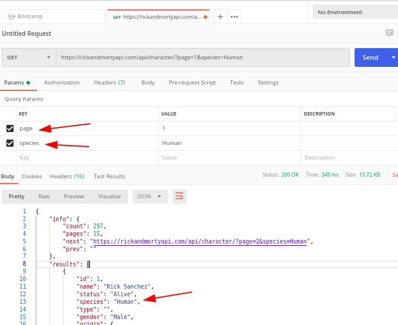

### 7. Llamados a un API con el método post utilizando JSON

"POST" con autorización
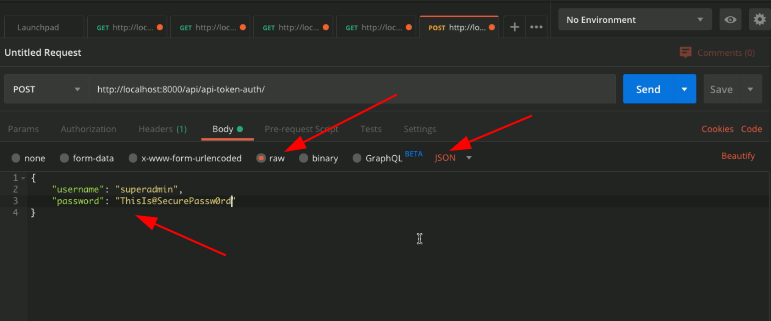

"POST" se manda el token de autorización por json para hacer POST
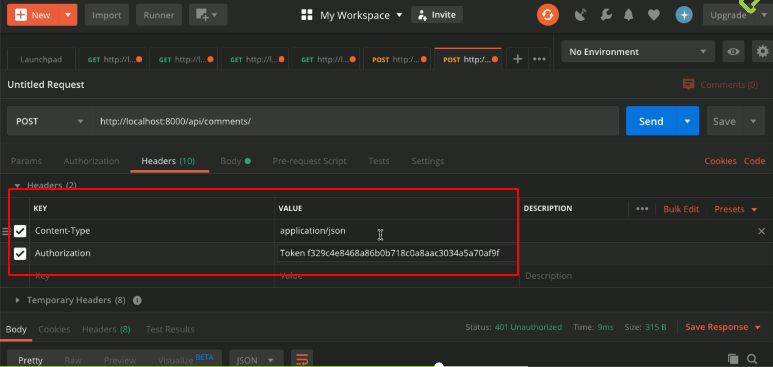

### 8. Llamados a un API con el método post utilizando Form Data
"POST" se manda el token de autorización por `x-www-form-urlencoded` para hacer POST
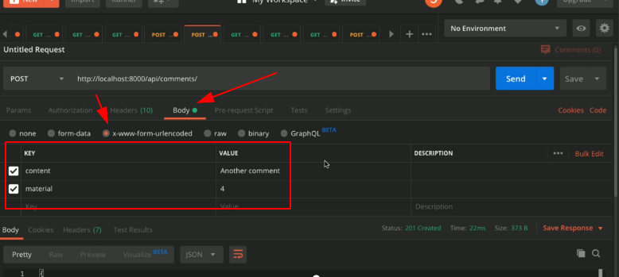

"POST" se manda el token de autorización por `form-data` para hacer POST
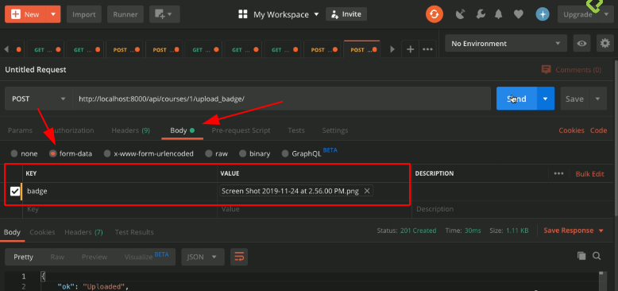

### 9. Llamados a un API con el método PUT

Las diferencias entre PUT y PATCH es que PUT es reemplazo completo de la entidad, y PATCH sólo de una parte.

### 10. Llamados a un API con el método DELETE
"DELETE" se manda el token de autorización para hacer "DELETE" al id 1 de la URL
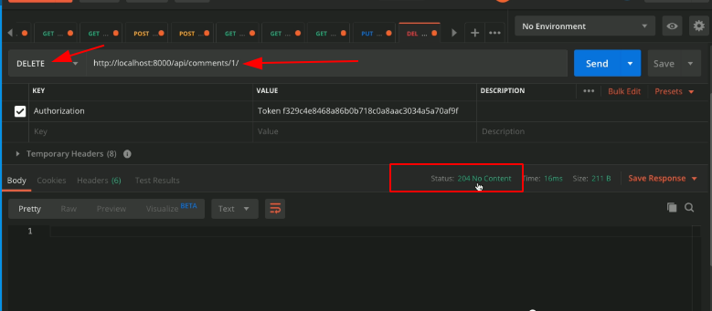

**204 (No Content)**, la petición se ha completado con éxito pero su respuesta no tiene ningún contenido (la respuesta sí que puede incluir información en sus cabeceras HTTP).

### 11. Optimización de environment de postman y configuración de la colección
Un entorno(enviroment) ase referencia a un contexto a un grupo de valores que se pueden utilizar atravez de endpoints. El entorno contiene varialbes variables.

Creación de un ambiente
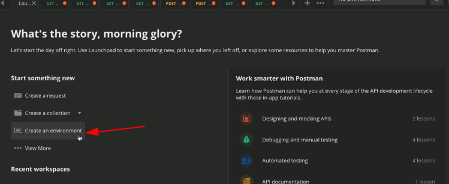

Op. de del ambiente
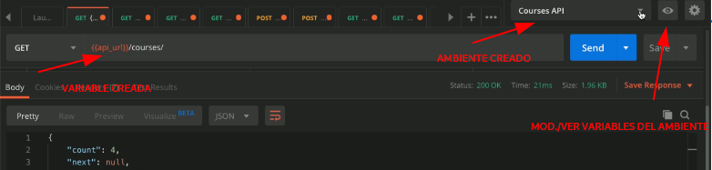

Creación de un ambiente
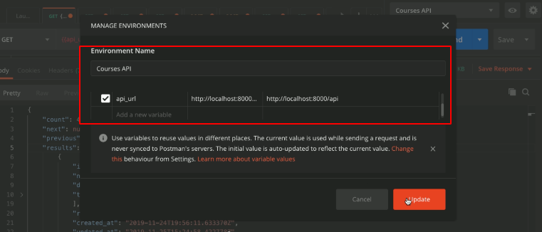

Variables dentro del entrono

Una collección es como un folder, en donde se declaran los reques que pertenecen a esa carpeta. Que funciona para crear documentación

Se crea una colección
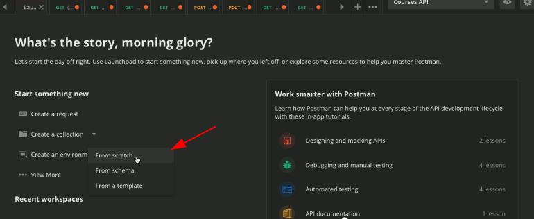

Opciones de la colección
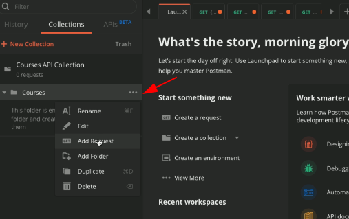

Opciones de la colección
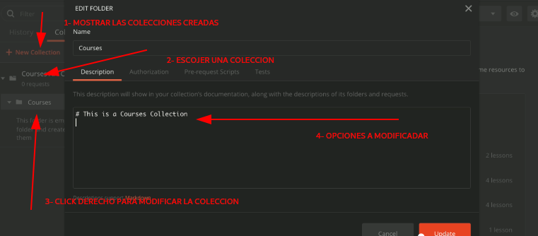

Se guarda un request
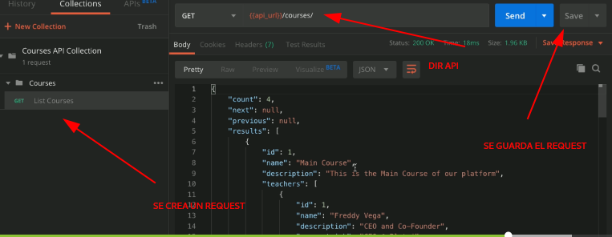

Organización de la colección

### 12. Agregar ejemplos de responses y descripción de endpoints

Cuando el llamado a un endpoint en especifico retorna **201** se guarda como ejemplo de ser exitoso el llmado
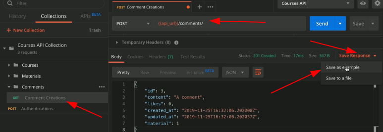

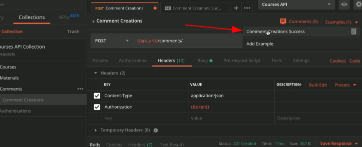

Para documentar el ENDPOINT SE OCUPA EL METODO `Options`
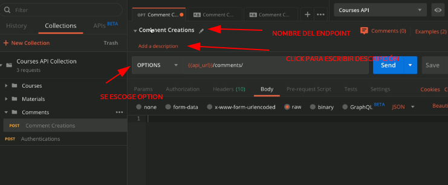

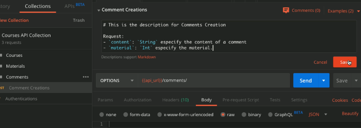

## 3. Automatización de procesos con JavaScript
### 13. Guardar el token del login con una prueba automática
+ :link: [Welcome to the Postman docs!](https://learning.postman.com/docs/postman/launching-postman/introduction/)
+ :link: [Execution order of scripts](https://learning.postman.com/docs/postman/scripts/intro-to-scripts/)

Orden de ejecución de los scripts en postman

Asignar el valor a una variable **"ANTES"**, para depues hacer petición request a API
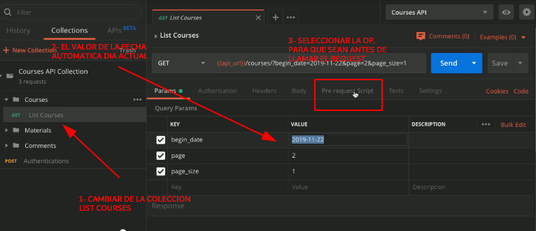

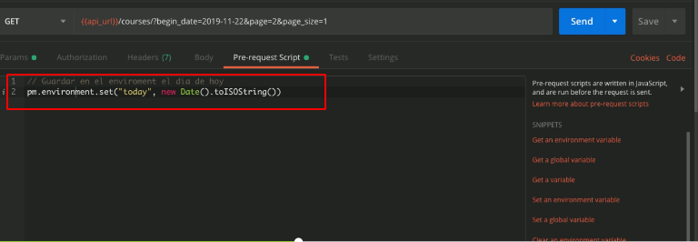

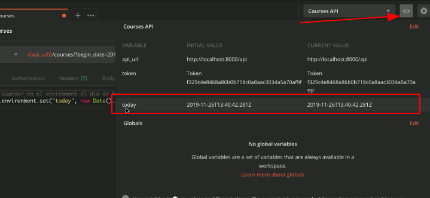

En el parametro se agraga cambia la "VALUE" anterior por la variable que se genero ya esta accesible en el entorno
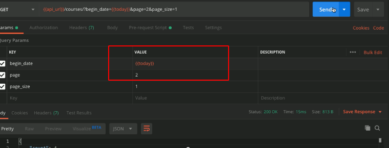

Ahora guardar el token del login **DESPUES** que se hace en el `test`
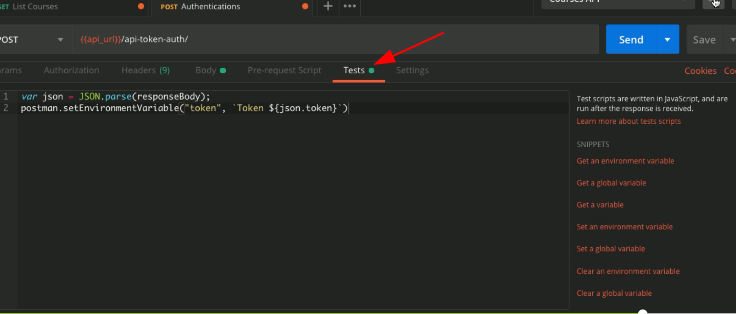

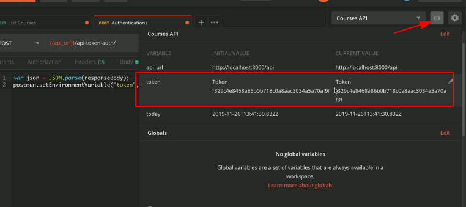

### 14. Creación de Pruebas para endpoints
:link: [Test examples](https://learning.postman.com/docs/postman/scripts/test-examples/)

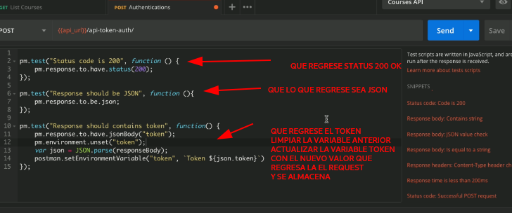

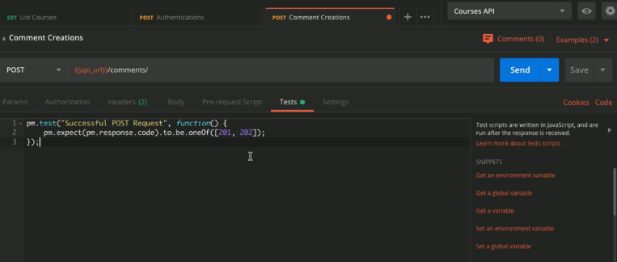

## 4. Puesta en producción
### 15. Publicar Documentación

Se tienen que exportar la colección de los endpoints que se crearon
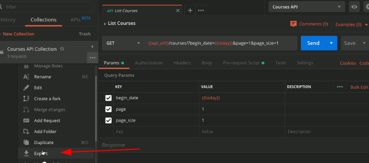

Siguiente paso
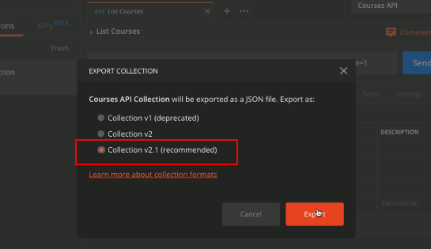
Se guarda en la maquina

Para importar una colección
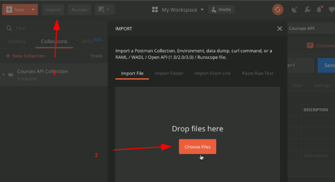

Publicar la documentación
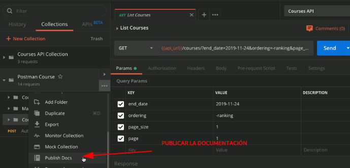

