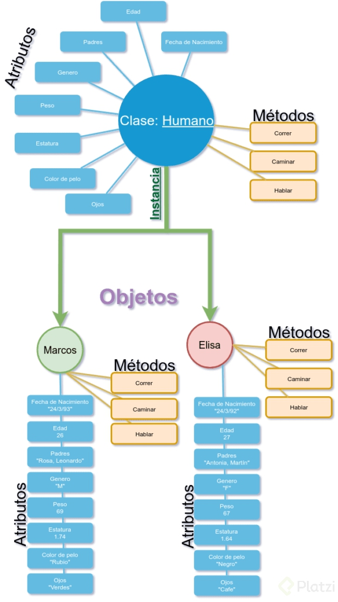
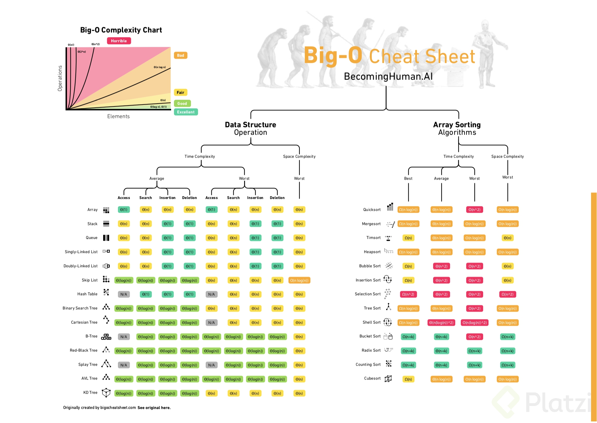

 :link: :octocat: <a href="!#" target="_blank">Documentación</a>

# Curso de POO y Algoritmos con Python

## Programación Orientada a Objetos

Uno de los elementos más importantes de los lenguajes de programación es la utilización de clases para organizar programas en módulos y abstracciones de datos.

Las clases se pueden utilizar de diversas maneras. Pero en este artículo hablaremos de cómo utilizarlas en el contexto de la programación orientada a objetos. **La clave para entender la programación orientada a objetos es pensar en objetos como agrupaciones de datos y los métodos que operan en dichos datos.**

Por ejemplo, podemos representar a una persona con _propiedades_ como nombre, edad, género, etc. y los _comportamientos_ de dicha persona como caminar, cantar, comer, etc. De la misma manera podemos representar unos audífonos con _propiedades_ como su marca, tamaño, color, etc. y sus _comportamientos_ como reproducir música, pausar y avanzar a la siguiente canción.

Puesto de otra manera, la programación orientada a objetos nos permite modelar cosas reales y concretas del mundo y sus relaciones con otros objetos.

Las ideas detrás de la programación orientada a objetos tienen más de 50 años y han sido ampliamente aceptadas y practicadas en los últimos treinta. A mediados de la década de los setenta se comenzaron a escribir artículos académicos explicando los beneficios de esta aproximación a la programación. También durante esos años se comenzaron a escribir los primeros lenguajes de programación que incorporaban estas ideas (como Smalltalk y CLU). Pero no fue hasta la llegada de Java y C++ que la idea consiguió un número importante de seguidores.

Hasta ahora, en el curso previo de esta serie hemos utilizado programación orientada a objetos de manera implícita. Cuando decimos _“Los objetos son las principales cosas que un programa de Python manipula. Cada objeto tiene un tipo que define qué cosas puede realizar un programa con dicho objeto”_, nos estamos refiriendo a las ideas principales de la programación orientada a objetos. Hemos utilizado los tipos lista y diccionario, entre muchos otros, así como los métodos asociados a dichos tipos.

Así como los creadores de un lenguaje de programación solo pueden diseñar una fracción muy pequeña de todas las _funciones útiles_ (como abs, float, type, etc.), también pueden escribir una fracción muy pequeña de los _tipos útiles_ (int, str, dict, list, etc.). Ya sabemos los mecanismos que nos permiten crear funciones, ahora veremos los mecanismos que nos permiten crear nuevos tipos (o clases).

#### Clases en Python

---
Las estructuras primitivas con las que hemos trabajado hasta ahora nos permiten definir cosas sencillas, como el costo de algo, el nombre de un usuario, las veces que debe correr un bucle, etc. Sin embargo, existen ocasiones cuando necesitamos definir estructuras más complejas, por ejemplo un hotel. Podríamos utilizar dos listas: una para definir los cuartos y una segunda para definir si el cuarto se encuentra ocupado o no.

```py
cuartos_de_hotel = [101, 102, 103, 201, 202, 203]
cuarto_ocupado = [True, False, False, True, True, False]
```

Sin embargo, este tipo de organización rápidamente se sale de control. ¿Qué tal que quisiéramos añadir más _propiedades_, cómo si el cuarto ya fue aseado o no? ¿Si el cuarto tiene cama doble o sencilla? Esto nos lleva a una falta fuerte de organización y es justamente el punto que justifica la existencia de clases.

Las clases nos permiten crear nuevos tipos que contiene información arbitraria sobre un objeto. En el caso del hotel, podríamos crear dos clases Hotel() y Cuarto() que nos permitiera dar seguimiento a las _propiedades_ como número de cuartos, ocupación, aseo, tipo de habitación, etc.

Es importante resaltar que las clases solo proveen estructura. Son un molde con el cual podemos construir objetos específicos. _La clase señala las propiedades_ que los hoteles que modelemos tendrán, pero no es ningún hotel específico. _Para eso necesitamos las instancias._

#### Instancias

---
Mientras que las clases proveen la estructura, las instancias son los objetos reales que creamos en nuestro programa: un hotel llamado PlatziHotel o Hilton. Otra forma de pensarlo es que las clases son como un formulario y una vez que se llena cada copia del formulario tenemos las instancias que pertenecen a dicha clase. Cada copia puede tener datos distintos, al igual que cada instancia es distinta de las demás (aunque todas pertenecen a una misma clase).

Para definir una clase, simplemente utilizamos el keyword class. Por ejemplo:

```py
class Hotel:
    pass
```

Una vez que tenemos una clase llamada `Hotel` _podemos generar una instancia llamando al constructor de la clase_.

```py
hotel = Hotel()
```

#### Atributos de la instancia

_Todas las clases crean objetos y todos los objetos tienen atributos._ Utilizamos el método especial `__init__` para definir el estado inicial de nuestra instancia. Recibe como primer parámetro obligatorio `self` (_que es simplemente una referencia a la instancia_).

```py
class Hotel:
    
    def __init__(self, numero_maximo_de_huespedes, lugares_de_estacionamiento):
        self.numero_maximo_de_huespedes = numero_maximo_de_huespedes
        self.lugares_de_estacionamiento = lugares_de_estacionamiento
        self.huespedes = 0


hotel = Hotel(numero_maximo_de_huespedes=50, lugares_de_estacionamiento=20)
print(hotel.lugares_de_estacionamiento) # 20
```

#### Métodos de instancia

Mientras que los **atributos de la instancia describen lo que representa el objeto**, los **métodos de instancia nos indican qué podemos hacer con las instancias de dicha clase** y normalmente operan en los mencionados atributos. Los métodos son equivalentes a funciones dentro de la definición de la clase, pero todos reciben self como primer argumento.

```py
class Hotel:

    ...

    def anadir_huespedes(self, cantidad_de_huespedes):
        self.huespedes += cantidad_de_huespedes

    def checkout(self, cantidad_de_huespedes):
        self.huespedes -= cantidad_de_huespedes

    def ocupacion_total(self):
        return self.huespedes


hotel = Hotel(50, 20)
hotel.anadir_huespedes(3)
hotel.checkout(1)
hotel.ocupacion_total() # 2
```



## Tipos de datos abstractos y clases, Instancias

Pag. 5 - 11

```py
# definicion de la clase
class <nombre_de_la_clase>(super_de_la_clase):
    def __init__(self, <params>):
        <expresion>
    
    def <nombre_del_metodo>(self, <params>):
        <expresion>
```

Ejemplo

```py
# definicion
class Persona:
    def __init__(self, nombre, edad):
        self.nombre = nombre
        self.edad = edad
    
    def saluda(self, otra_persona):
        return f"Hola, {otra_persona.nombre}, me llamo {self.nombre}"
    
#Uso
david = Persona('David', 30)
erika = Persona('Erika', 32)

david.saluda(erika)
# 'Hola, Erika, me llamo David'
```

ejemplo

```py
class Coordenada:

    def __init__(self, x, y):
        self.x = x
        self.y = y

    def distancia(self, otra_coordendada):
        x_diff = (self.x - otra_coordendada.x)**2
        y_diff = (self.y - otra_coordendada.y)**2

        return (x_diff + y_diff)**0.5


if __name__ == '__main__':
    coord_1 = Coordenada(3, 30)
    coord_2 = Coordenada(4, 8)

    print(coord_1.distancia(coord_2))
    # 22.02271554554524
    print(isinstance(coord_2, Coordenada))
    # True
```

```py
class TrafficLight:
    '''This is an updated traffic light class'''
    def __init__(self, color):
        self.color = color

    def action(self):
        if self.color=='red':
            print('Stop & wait')
        elif self.color=='yellow':
            print('Prepare to stop')
        elif self.color=='green':
            print('Go')
        else:
            print('Stop drinking ')

yellow = TrafficLight('yellow')
yellow.action()

# Prepare to stop
```

## Decomposición

Pag. 12 - 13

```py
class Car:
    def __init__(self, model, brand, color):
        self.model = model
        self.brand = brand
        self.color = color
        self._state = 'off'
        self._motor = Motor(cylinders=4)
        self._tank = Tank(10, 10)

    # Turns car on, if off only
    def turn_on(self):
        if self._state == 'off':
            print('*Car turns on*')
            self._state = 'on'

    # Turns car off, if on only
    def turn_off(self):
        if self._state == 'on':
            print('*Car turns off*')
            self._state = 'off'

    # Goes forward if on and if has gas in tank, 
    # else, does nothing or goes off
    def forward(self, type='slow'):
        if self._state == 'on' and self._tank.current_fuel > 0:
            if type == 'slow':
                print('Brumm')
                self._motor.put_gas(2)
                self._tank.use_gas(2)
            elif type == 'fast':
                print('Bruuummmmm')
                self._motor.put_gas(4)
                self._tank.use_gas(4)
        elif self._state == 'off':
            print('Car is off')
        elif self._tank.current_fuel == 0:
            print('Out of gas\n*Turns off*')
            self._state = 'off'


# Unnecesary to overcomplicate,
# we only need to know that there is a motor thats needs gas
class Motor:
    def __init__(self, cylinders, fuel='gas'):
        self.cylinders = cylinders
        self.fuel = fuel
        self._temperature = 0.0

    def put_gas(self, cuantity):
        pass


# Car's gas tank, if ca goes forward,
# gas goes down
class Tank:
    def __init__(self, capacity, current_fuel):
        self.capacity = capacity
        self.current_fuel = current_fuel

    def use_gas(self, cuantity):
        if self.current_fuel - cuantity < 0:
            self.current_fuel = 0
        else:
            self.current_fuel -= cuantity


if __name__ == '__main__':
    mycar = Car('Logan', 'Renault', 'Gray')
    mycar.forward()
    mycar.turn_on()
    mycar.forward(type='fast')
    mycar.forward()
    mycar.turn_off()
    mycar.forward(type='fast')
    mycar.turn_on()
    mycar.forward(type='fast')
    mycar.forward(type='fast')

```

## Abstracción

Una interfaz para interactuar con el objeto sin preocuparnos como funciona internamente.

Pag. 14 - 15

```py
class Lavadora:
    def __init__(self):
        pass

    def lavar(self, temperatura="caliente"):
        self._llenar_tanque_de_agua(temperatura)
        self._anadir_jabon()
        self._lavar()
        self._centrifugar()

    def _llenar_tanque_de_agua(self, temperatura):
        print(f"Llenando el tanque con agua {temperatura}")

    def _anadir_jabon(self):
        print("Anadiendo jabon")

    def _lavar(self):
        print("Lavando la ropa")

    def _centrifugar(self):
        print("Centrifugando la ropa")


if __name__ == "__main__":
    lavadora = Lavadora()
    lavadora.lavar()
```

## Funciones: base de los decoradores

El concepto de decorador en Python es algo que podríamos ubicar en un nivel _“intermedio”_ en el manejo del lenguaje, por lo que es buena idea que tengas una base sólida, sobre todo en cuanto a funciones al momento de profundizar e implementarlas.

Los decoradores son una forma sencilla de llamar funciones de orden mayor, es decir, **funciones que toman otra función como parámetro y/o retornan otra función como resultado**. De esta forma un decorador añade capacidades a una función sin modificarla.

Un ejemplo de esto son las llantas de un automóvil. Si les colocas cadenas para la nieve, el automóvil aún puede andar y además extiende su funcionalidad para conducirse en otros terrenos.

Recordando sobre funciones  
Antes de abordar el tema de decoradores haremos un pequeño repaso por las funciones, las cuales retornan un valor ante la entrada de un argumento.

Analicemos este sencillo ejemplo donde una función que multiplica un número se eleva a la tercera potencia:

```py
def elevar_cubo(numero):
 return numero * numero * numero
```

Si damos como argumento el número 3, entonces tendremos como salida el número 27 al ejecutar la función:

```py
>>> elevar_cubo(3)
27
```

Funciones como objetos de primera-clase  
Otro concepto importante a tener en cuenta es que en Python las funciones son objetos de primera-clase, es decir, que pueden ser pasados y utilizados como argumentos al igual que cualquier otro objeto (strings, enteros, flotantes, listas, etc.).

Veamos un ejemplo donde definimos 3 diferentes funciones que utilizaremos de manera conjunta:

```py
def presentarse(nombre):
 return f"Me llamo {nombre}"

def estudiemos_juntos(nombre):
 return f"¡Hey {nombre}, aprendamos Python!"

def consume_funciones(funcion_entrante):
 return funcion_entrante("David")
```

Las primeras dos funciones son obvias en su resultado, donde nos mostrarán un mensaje con el valor de la variable nombre. La tercera función puede ser más compleja de predecir, ya que toma otra función como entrada. Veamos que pasa cuando colocamos una función como atributo:

```py
>>> consume_funciones(presentarse)
'Me llamo David'

>>> consume_funciones(estudiemos_juntos)
'¡Hey David, aprendamos Python!'
```

Pongamos atención en cómo la función `consume_funciones()` se escribe con paréntesis para ser ejecutada, mientras que la función `presentarse` y `estudiemos_juntos` solo hace referencia a estas.

Funciones anidadas  
Al igual que los condicionales y bucles también puedes colocar funciones dentro de otra función.

Tómate un minuto para analizar el siguiente código e inferir cuál será el resultado de salida:

```py
def funcion_mayor():
    print("Esta es una función mayor y su mensaje de salida.")

    def librerias():
        print("Algunas librerías de Python son: Scikit-learn, NumPy y TensorFlow.")

    def frameworks():
        print("Algunos frameworks de Python son: Django, Dash y Flask.")

    frameworks()
    librerias()

```

Si llamamos a la función `funcion_mayor` tendremos la siguiente salida:

```py
>>> funcion_mayor()
Esta es una función mayor y su mensaje de salida.
Algunos frameworks de Python son: Django, Dash y Flask.
Algunas librerías de Python son: Scikit-learn, NumPy y TensorFlow.
```

Debemos considerar que las funciones anidadas dentro de `funcion_mayor` no se ejecutan hasta que se llama a esta primera, _siendo muestra del scope o alcance de las funciones_. Si las llamamos obtendremos un error

📹 

🔗 [Ejemplo decorador simple python youtube](/Python/img/python_decorator_example_01.png) ↗️

🔗 [Decoradores en python](/Python/img/python_decorator_example_01.png) ↗️

## Setters, getters y decorador property

Entendiendo el concepto de decorador  
Antes de comenzar me gustaría que analices el siguiente código:

```py
def funcion_decoradora(funcion):
    def wrapper():
        print("Este es el último mensaje...")
        funcion()
        print("Este es el primer mensaje ;)")
    return wrapper

def zumbido():
    print("Buzzzzzz")

zumbido = funcion_decoradora(zumbido)
```

out

```py
>>> zumbido()
Este es el último mensaje...
Buzzzzzz
Este es el primer mensaje ;)
```

Todo lo que sucede se conoce en programación como metaprogramación (metaprogramming), ya que una parte del programa trata de modificar a otra durante el tiempo de compilación. En tanto un decorador básicamente toma una función, le añade alguna funcionalidad y la retorna.

Mejorando la sintaxis  
Definitivamente la forma en que decoramos la función es complejo, pero afortunadamente Python lo tiene en cuenta y podemos utilizar decoradores con el símbolo `@`. Volviendo al mismo ejemplo de funcion_decoradora(), podemos simplificarlo así:

```py
@funcion_decoradora
def zumbido():
 print("Buzzzzzz")
```

En solo tres líneas de código tenemos el mismo resultado que escribir zumbido = funcion_decoradora(zumbido).

**¿Qué son getters y setters?**

A diferencia de otros lenguajes de programación, en Python los `getters` y `setters` tienen el objetivo de asegurar el encapsulamiento de datos. Cómo habrás visto, si declaramos una variable privada en Python al colocar un guion bajo al inicio de esta (_) y normalmente son utilizados para: añadir lógica de validación al momento de obtener y definir un valor y, para evitar el acceso directo al campo de una clase.

La realidad es que en Python no existen variables netamente privadas, pues aunque se declaren con un guion bajo podemos seguir accediendo a estas. En Programación Orientada a Objetos esto es peligroso, pues podemos alterar el método de alguna clase y tener efectos colaterales que afecten la lógica de nuestra aplicación.

Clases sin getters y setters

Veamos un ejemplo con una clase que almacena un dato de distancia recorrida en millas (mi) y lo convierte a kilómetros (km):

```py
class Millas:
    def __init__(self, distancia = 0):
        self.distancia = distancia

 def convertir_a_kilometros(self):
    return (self.distancia * 1.609344)
```

Ahora creemos un objeto que haga referencia a un viaje:

```py
# Creamos un nuevo objeto
avion = Millas()

# Indicamos la distancia
avion.distancia = 200

# Obtenemos el atributo distancia
>>> print(avion.distancia)
200

# Obtenemos el método convertir_a_kilometros
>>> print(avion.convertir_a_kilometros())
321.8688
```

Utilizando getters y setters

Incluyamos un par de métodos para obtener la distancia y otro para que no acepte valores inferiores a cero, pues no tendría sentido que un vehículo recorra una distancia negativa. Estos son métodos getters y setters:

```py
class Millas:
    def __init__(self, distancia = 0):
        self.distancia = distancia

    def convertir_a_kilometros(self):
        return (self.distancia * 1.609344)

    # Método getter
    def obtener_distancia(self):
        return self._distancia

    # Método setter
    def definir_distancia(self, valor):
        if valor < 0:
            raise ValueError("No es posible convertir distancias menores a 0.")
        self._distancia = valor
```

El método `getter` obtendrá el valor de la distancia que y el método `setter` se encargará de añadir una restricción. También debemos notar cómo distancia fue reemplazado por `_distancia`, denotando que es una variable privada.

Si probamos nuestro código funcionará, la desventaja es que cualquier aplicación que hayamos creado con una base similar deberá ser actualizado. Esto no es nada escalable si tenemos cientos o miles de líneas de código.

Función `property()`

Esta función está incluida en Python, en particular crea y retorna la propiedad de un objeto. La propiedad de un objeto posee los métodos `getter()`, `setter()` y `del()`.

En tanto la función tiene cuatro atributos: `property(fget, fset, fdel, fdoc)` :

+ `fget` : trae el valor de un atributo.
+ `fset` : define el valor de un atributo.
+ `fdel` : elimina el valor de un atributo.
+ `fdoc` : crea un docstring por atributo.

Veamos un ejemplo del mismo caso implementando la función `property()` :

```py
class Millas:
    def __init__(self):
        self._distancia = 0

    # Función para obtener el valor de _distancia
    def obtener_distancia(self):
        print("Llamada al método getter")
        return self._distancia

    # Función para definir el valor de _distancia
    def definir_distancia(self, recorrido):
        print("Llamada al método setter")
        self._distancia = recorrido

    # Función para eliminar el atributo _distancia
    def eliminar_distancia(self):
        del self._distancia

    distancia = property(obtener_distancia, definir_distancia, eliminar_distancia)


if __name__ == "__main__":

    # Creamos un nuevo objeto
    avion = Millas()

    # Indicamos la distancia
    avion.distancia = 200

    # Obtenemos su atributo distancia
    print(avion.distancia)
    # Llamada al método getter
    # Llamada al método setter
    # 200
```

Aunque en este ejemplo hay una sola llamada a `print`, tenemos tres líneas como salida pues esta llama a los primeros dos métodos. Por lo que la propiedad distancia es una propiedad de objeto que ayuda a mantener el acceso de forma privada.

Decorador `@property`

Este decorador es uno de varios con los que ya cuenta Python, el cual nos permite utilizar `getters` y `setters` para hacer más fácil la implementación de la programación orientada a objetos en Python cambiando los métodos o atributos de las clases de forma que no modifiquemos el código.

Pero mejor veamos un ejemplo en acción:

```py
class Millas:
    def __init__(self):
        self._distancia = 0

    # Función para obtener el valor de _distancia
    # Usando el decorador property
    @property
    def obtener_distancia(self):
        print("Llamada al método getter")
        return self._distancia

    # Función para definir el valor de _distancia
    @obtener_distancia.setter
    def definir_distancia(self, valor):
        if valor < 0:
            raise ValueError("No es posible convertir distancias menores a 0.")
        print("Llamada al método setter")
        self._distancia = valor

# Creamos un nuevo objeto 
avion = Millas()

# Indicamos la distancia
avion.distancia = 200

# Obtenemos su atributo distancia
>>> print(avion.definir_distancia)
Llamada al método getter
Llamada al método setter
200
```

## Encapsulación, getters and setters

[Role of Underscore(_) in Python](https://www.datacamp.com/community/tutorials/role-underscore-python)

La encapsulacin nos permite agrupar datos y controlar su comportamiento en nuestra clase. También nos permite controlar el acceso a nuestros datos y prevenir modificaciones no autorizadas.

```py
class CasillaDeVotacion:
    def __init__(self, identificador, pais):
        self._identificador = identificador
        self._pais = pais
        self._region = None

    @property
    def region(self):
        return self._region

    @region.setter
    def region(self, region):
        print(region)
        if region in self._pais:
            self._region = region
            raise ValueError(f"La region {region} no es valida o ya se encuentra en {self._pais}")


# casilla = CasillaDeVotacion(123, ["CDMX", "Morelos"])
# print(casilla.region)
# None
#
#
# casilla.region = "CDMX"
# ValueError: La region CDMX no es valida o ya se encuentra en ['CDMX', 'Morelos']
#
#
# casilla.region = "CDMX."
# print(casilla.region)
# "CDMX."
```

## Herencia

Pag 19 - 20

La herencia nos permite generar una jerarquía de clases en las que podemos compartir funcionamientos comunes y en el que existirá una clase _padre_ también conocida como **superclase** y una o varias _clases hijas_ conocidas como **subclases**.

Para extender de una clase _padre_ en Python solo tendremos que pasar como parámetro el nombre de la clase _padre_ **a la hija en su definición** y ya podremos usar las funcionalidades de la clase padre.

La herencia es el fenómeno que se da cuando una clase superior, ejem **Profesional** le comparte sus _atributos_ y _métodos_ a una clase derivada. Ejem. **medico** sin necesidad de que esta última clase defina _todos los atributos y métodos nuevamente_.

```py
class BaseClass:
    Cuerpo de la clase BaseClass

class DerivedClass(BaseClass):
    Cuerpo de la clase derivada
```

La clase derivada hereda características de la clase base donde se pueden agregar nuevas características, esto da como resultado la _reutilización de código_

```py
class Rectangulo:
    def __init__(self, base, altura):
        self.base = base
        self.altura = altura

    def area(self):
        return self.base * self.altura


class Cuadrado(Rectangulo):
    def __init__(self, lado):
        super().__init__(lado, lado)


if __name__ == "__main__":
    rectangulo = Rectangulo(base=3, altura=4)
    print(rectangulo.area())

    cuadrado = Cuadrado(lado=5)
    print(cuadrado.area())
```

`super()` es una funcion que te acceder a los _atributos y metodos_ de la clase base.

```py
class Espada:

    def __init__(self, nombre, rareza, dano, durabilidad):
        self.nombre = nombre
        self.rareza = rareza
        self.dano = dano
        self.durabilidad = durabilidad

    def atacar(self, objetivo):
        if self.durabilidad > 0 and objetivo["vida"] > 0:
            objetivo["vida"] -= self.dano + objetivo["resistencia"]
            self.durabilidad -= 0.7
        elif objetivo["vida"] <= 0:
            print("El objetivo ha muerto")
        else:
            print("La espada se ha roto") # durabilidad <= 0

class SuperEspada(Espada):

    def __init__(self, nombre, rareza, dano, durabilidad, atributo, dano_elemental):
        super().__init__(nombre, rareza, dano, durabilidad)
        self.atributo = atributo
        self.dano_elemental = dano_elemental

    def ataqueElemental(self, objetivo):
        if objetivo["Tipo"] == self.atributo:
            objetivo["Vida"] -= self.dano + 35 * self.dano_elemental / 100
            self.durabilidad -= 1
        elif objetivo["Tipo"] != self.atributo:
            objetivo["Vida"] -= self.dano + self.dano_elemental
            self.durabilidad -= 1
        
if __name__ == "__main__":
    espada_basica = Espada("Espada de Principiante", "Normal", 15, 100)
    print(f"Nombre: {espada_basica.nombre} \nRareza: {espada_basica.rareza}\n" )

    espada_elemental = SuperEspada("Espada Rayo", "Rara", 30, 150, "Rayo", 15)
    print(f"Nombre: {espada_elemental.nombre} \nRareza: {espada_elemental.rareza} \nAtributo: {espada_elemental.atributo}\n")
```

**Herencia multiple** una clase puede derivarse de más de una clase base en python :snake: En la herencia multiple, las caracteristicas de todas las clases base se heredan a la clase derivada.

🔗 [Herencia en python](https://ellibrodepython.com/herencia-en-python) ↗️

```py
class Base1:
    pass

class Base2:
    pass

class Multiderivada(Base1, Base2):
    pass
```

```py
class Base:
    pass

class Derivada1(Base):
    pass

class Derivada1(Derivada1):
    pass
```

## Polimorfismo

El polimorfismo en la POO nos permite modificar el comportamiento de una superclase para adaptarlo a las necesidades de una subclase. Esto nos ayudará a crear una clase general con unas definiciones por defecto que luego podremos ir adaptando según las necesidades de la clase hija

```py
class Persona:

    def __init__(self, nombre):
        self.nombre = nombre

    def avanza(self):
        print('Ando caminando')


class Ciclista(Persona):

    def __init__(self, nombre):
        super().__init__(nombre)

    def avanza(self):
        print('Ando moviendome en mi bicicleta')


def main():
    persona = Persona('David')
    persona.avanza()

    ciclista = Ciclista('Daniel')
    ciclista.avanza()


if __name__ == '__main__':
    main()
```

También podemos heredar de una clase derivada, esto se define como **herencia multi-nivel**

## Complejidad algorítmica

## Introducción a la complejidad algorítmica

🔗 [Youtube - Complejidad algoritmica](https://www.youtube.com/watch?v=GD254Gotp-4) ↗️  
Pag 23 - 26

La **complejidad algorítmica** nos permite comparar la eficiencia de 2 algoritmos, esto a su vez va a predecir el tiempo que va a tomar resolver un problema. _No solamente podemos analizar la complejidad desde la perspectiva temporal, también la podemos hacer desde la espacial_; como por ejemplo cuanto espacio en memoria necesitamos.

La **complejidad algorítmica temporal** la podemos definir como `T(n)` el cual determinara el tiempo que demora en resolver nuestro algoritmo.

Aproximaciones

¿Como podríamos aplicar nuestra función T(n)?

+ Cronometrar el tiempo en el que corre un algoritmo. Sin embargo no es una buena forma de medir los algoritmos, ya que no se puede predecir cuanto demorara a medida que crece nuestros pasos.
+ Contar los pasos con una medida abstracta de operación. Nos puede acercar a una medición ideal, sin embargo varia mucho de algoritmo en algoritmo y a medida que crece nuestro dataset existen muchos términos que llegan a ser irrelevantes.
+ Contar los pasos conforme nos aproximamos al infinito pero con una medida asintótica(con forme se acerque al infinito).

Medición temporal

Para una realizar una medida temporal simplemente calculamos la diferencia del tiempo previo y posterior de la ejecución del algoritmo.

```py
# complejidad algorítmica
import time

def factorial(n):
    respuesta = 1

    while n > 1:
        # print(f"respuesta: {respuesta} n: {n}")
        respuesta *= n
        # print(f"respuesta *= n -> {respuesta} n -> {n}")
        n -= 1

    return respuesta


def factorial_r(n):
    if n == 1:
        return 1

    return n * factorial_r(n - 1)


if __name__ == "__main__":
    n = 100

    comienzo = time.time()
    factorial(n)
    final = time.time()
    print(final - comienzo)

    comienzo = time.time()
    factorial_r(n)
    final = time.time()
    print(final - comienzo)
```

## Conteo abstracto de operación

Con esta técnica contamos los pasos que realiza nuestro algoritmo. En el siguiente _ejemplo_ respuesta tendrá los números de pasos que realiza nuestro código al ejecutar.

```py
def f(x):

    respuesta = 0

    for i in range(1000):
        respuesta += 1

    for i in range(x):
        respuesta += x

    for i in range(x):
        for j in range(x):
            respuesta += 1
            respuesta += 1

    return respuesta
```

## Notación asintótica

🔗 [Notación Big-O](https://www.youtube.com/watch?v=MyAiCtuhiqQ) ↗️  

+ _Un loop_ => crecimiento lineal.
+ _Un loop dentro de otro_ => crecimiento cuadratico
+ _Llamadas recursivas_ => crecimiento exponecncial.

Cuando hablamos de **notación asintótica** no importan las variaciones pequeñas, _el enfoque se centra en lo que pasa conforme el tamaño del problema se acerca al infinito._

Siempre tenemos que estar preparados para cualquier caso, por lo que tenemos que saber medir a nuestro algoritmo en el mejor, promedio y peor de los casos.

Lo mejor que nos permite comparar nuestros algoritmos y su capacidad es medir el peor de los casos, ahí es donde entra el **Big O notation**, donde lo único que importa es el termino de mayor tamaño, sin importar las constantes que las acompañan.


#### Ley de la suma

```py

def f(n):
    for i in range(n):
        print(i)

    for i in range(n):
        print(i)

# En este caso el mayor término es n
# O(n) + O(n) = O(n + n) = O(2n) = O(n)
```

Crece (de o de ne O(n)) con respecto a n de manera lineal.

#### Ley de la suma

```py

def f(n):
    for i in range(n):
        print(i)

    for i in range(n * n):
        print(i)

# En este caso el mayor término es n²
# O(n) + O(n * n) = O(n + n²) = O(n²)
```

#### Ley de la multiplicación

```py
def f(n):

    for i in range(n):
        for i in range(n):
            print(i, j)

# En este caso el mayor término es n²
# O(n) + O(n * n) = O(n * n) = O(n²)
```

#### Recursividad múltiple

```py
def fibonacci(n):
    print(f"n: {n}")
    if n == 0 or n == 1:
        return 1

    # print(f"({n} - 1) -> {fibonacci(n - 1)} + ({n} - 2) -> {fibonacci(n - 1)}")
    print(f"({n} - 1) + ({n} - 2): {(n -1) + (n - 2)}")
    return fibonacci(n - 1) + fibonacci(n - 2)

# En este caso el mayor término es 2**n (el símbolo ** denota "elevado a"),
# ya que realiza recursividad 2 veces por n veces.
# O(2**n)
```

## Clases de complejidad algorítmica

Existen distintos tipos de complejidad algorítmica:

+ **O(1) Constante:** no importa la cantidad de input que reciba, siempre demorara el **mismo tiempo**. Un loop de 1000.
+ **O(n) Lineal:** la complejidad crecerá de forma **proporcional** a medida que crezca el input.
+ **O(log n) Logarítmica:** nuestra función crecerá de forma **logarítmica** con respecto al input. Esto significa que en un inicio crecerá rápido, pero luego se estabilizara.
+ **O(n log n) Log lineal:** crecerá de forma **logarítmica** pero junto con una **constante**.
+ **O(n²) Polinomial:** crecen de forma cuadrática. No son recomendables a menos que el input de datos en pequeño.
+ **O(2^n) Exponencial:** crecerá de forma **exponencial**, por lo que la carga es muy alta. Para nada recomendable en ningún caso, solo para análisis conceptual.
+ **O(n!) Factorial:** crece de forma **factorial**, por lo que al igual que el exponencial su carga es muy alta, por lo que jamas utilizar algoritmos de este tipo.

🔗 [Big-O Cheat Sheet](https://www.bigocheatsheet.com/) ↗️




## Algoritmos de búsqueda y ordenación

### Búsqueda lineal

Busca en todos los elementos de manera secuencial.

```py
import random

def busqueda_lineal(lista, objetivo):
    match = False

    for elemento in lista: # O(n) Lineal
        if elemento == objetivo:
            match = True
            break

    return match


if __name__ == '__main__':
    tamano_de_lista = int(input('De que tamano sera la lista? '))
    objetivo = int(input('Que numero quieres encontrar? '))

    lista = [random.randint(0, 100) for i in range(tamano_de_lista)]

    encontrado = busqueda_lineal(lista, objetivo)
    print(lista)
    print(f'El elemento {objetivo} {"esta" if encontrado else "no esta"} en la lista')
```


### Búsqueda binaria

```py
import random

def busqueda_binaria(lista, comienzo, final, objetivo):
    print(f'buscando {objetivo} entre {lista[comienzo]} y {lista[final - 1]}')
    if comienzo > final:
        return False

    medio = (comienzo + final) // 2

    if lista[medio] == objetivo:
        return True
    elif lista[medio] < objetivo:
        return busqueda_binaria(lista, medio + 1, final, objetivo)
    else:
        return busqueda_binaria(lista, comienzo, medio - 1, objetivo)


if __name__ == '__main__':
    tamano_de_lista = int(input('De que tamano es la lista? '))
    objetivo = int(input('Que numero quieres encontrar? '))

    lista = sorted([random.randint(0, 100) for i in range(tamano_de_lista)])

    encontrado = busqueda_binaria(lista, 0, len(lista), objetivo)

    print(lista)
    print(f'El elemento {objetivo} {"esta" if encontrado else "no esta"} en la lista')
```

Comparacion de los dos tipos de busqueda.

```py
import random


def busqueda_lineal(lista, objetivo):
    contador_lineal = 0
    match = False
    for elemento in lista:  # O(n) Lineal
        contador_lineal += 1
        if elemento == objetivo:
            contador_lineal += 1
            match = True
            break

    return contador_lineal

def busqueda_binaria(lista, comienzo, final, objetivo, contador_binario=0):
    print(f"buscando {objetivo} entre {lista[comienzo]} y {lista[final - 1]}")
    contador_binario += 1
    if comienzo > final:
        return False

    medio = (comienzo + final) // 2

    if lista[medio] == objetivo:
        return contador_binario
    elif lista[medio] < objetivo:
        return busqueda_binaria(lista, medio + 1, final, objetivo, contador_binario=contador_binario)
    else:
        return busqueda_binaria(lista, comienzo, medio - 1, objetivo, contador_binario=contador_binario)


if __name__ == "__main__":
    tamano_de_lista = int(input("De que tamano es la lista? "))
    objetivo = int(input("Que numero quieres encontrar? "))

    lista = [random.randint(0, 100) for i in range(tamano_de_lista)]
    encontrado_busqueda_lineal = busqueda_lineal(lista, objetivo)

    lista = sorted([random.randint(0, 100) for i in range(tamano_de_lista)])
    encontrado_busqueda_binaria = busqueda_binaria(lista, 0, len(lista), objetivo)

    print(lista)
    print(f"Iteraciones en la busqueda lineal {encontrado_busqueda_lineal}")
    print(f"Iteraciones en la busqueda binaria {encontrado_busqueda_binaria}")

    print(
        f'El elemento {objetivo} {"esta" if encontrado_busqueda_lineal else "no esta"} en la lista'
    )
    print(
        f'El elemento {objetivo} {"esta" if encontrado_busqueda_binaria else "no esta"} en la lista'
    )
```

### Ordenamiento de burbuja

O(n²) Polinomial: crecen de forma cuadrática. No son recomendables a menos que el input de datos en pequeño.

```py
import random


def ordenamiento_de_burbuja(lista):
    n = len(lista)

    for i in range(n):
        for j in range(0, n - i - 1): # O(n) * O(n) = O(n * n) = O(n**2)

            if lista[j] > lista[j + 1]:
                lista[j], lista[j + 1] = lista[j + 1], lista[j]

    return lista

if __name__ == '__main__':
    tamano_de_lista = int(input('De que tamano sera la lista? '))

    lista = [random.randint(0, 100) for i in range(tamano_de_lista)]
    print(lista)

    lista_ordenada = ordenamiento_de_burbuja(lista)
    print(lista_ordenada)
```

### Ordenamiento por inserción

🔗 [Ordenamiento por inserción](https://visualgo.net/en/sorting?slide=1) ↗️

El ordenamiento por inserción es uno de los algoritmos más comunes que estudian los Científicos del Cómputo. Es intuitivo y fácil de implementar, pero es muy ineficiente para listas de gran tamaño.

Una de las características del ordenamiento por inserción es que ordena en **“su lugar.”** Es decir, no requiere memoria adicional para realizar el ordenamiento ya que simplemente modifican los valores en memoria.

La definición es simple:  
Una lista es dividida entre una sublista ordenada y otra sublista desordenada. Al principio, la sublista ordenada contiene un solo elemento, por lo que por definición se encuentra ordenada.

A continuación se evalua el primer elemento dentro la sublista desordenada para que podamos insertarlo en el lugar correcto dentro de la lista ordenada.

La inserción se realiza al mover todos los elementos mayores al elemento que se está evaluando un lugar a la derecha.

Continua el proceso hasta que la sublista desordenada quede vacia y, por lo tanto, la lista se encontrará ordenada.

Veamos un ejemplo:  
Imagina que tienes la siguiente lista de números:

```bash
7, 3, 2, 9, 8
```

Primero añadimos 7 a la sublista ordenada:

```bash
7, 3, 2, 9, 8
```

Ahora vemos el primer elemento de la sublista desordenada y lo guardamos en una variable para mantener el valor. A esa variable la llamaremos `valor_actual`.  
Verificamos que 3 es menor que 7, por lo que movemos 7 un lugar a la derecha.

```bash
7, 7, 2, 9, 8 (valor_actual=3)
```

3 es menor que 7, por lo que insertamos el valor en la primera posición.

```bash
3, 7, 2, 9, 8
```

Ahora vemos el número 2. 2 es menor que 7 por lo que lo movemos un espacio a la derecha y hacemos lo mismo con 3.

```bash
3, 3, 7, 9, 8 (valor_actual=2)
```

Ahora insertamos 2 en la primera posición.

```bash
2, 3, 7, 9, 8
```

9 es más grande que el valor más grande de nuestra sublista ordenada por lo que lo insertamos directamente en su posición.

```bash
2, 3, 7, 9, 8
```

El último valor es 8. 9 es más grande que 8 por lo que lo movemos a la derecha:

```bash
2, 3, 7, 9, 9 (valor_actual=8)
```

8 es más grande que 7, por lo que procedemos a insertar nuestro valor_actual.

```bash
2, 3, 7, 8, 9
```

Ahora la lista se encuentra ordenada y no quedan más elementos en la sublistav desordenada.

Antes de ver la implementación en Python, trata de implementarlo por ti mismo y compártenos tu algoritmo en la sección de comentarios.

Esta es una forma de implementar el algoritmo anterior:

```py
for indice in range(1, len(lista)):
        valor_actual = lista[indice]
        posicion_actual = indice

        while posicion_actual > 0 and lista[posicion_actual - 1] > valor_actual:
            lista[posicion_actual] = lista[posicion_actual - 1]
            posicion_actual -= 1

        lista[posicion_actual] = valor_actual
```

### Ordenamiento por mezcla

🔗 [Visualizar el argoritmo de arodenamiento por mezcla](https://visualgo.net/en/sorting) ↗️

```py
import random

def ordenamiento_por_mezcla(lista):
    if len(lista) > 1:
        medio = len(lista) // 2
        izquierda = lista[:medio]
        derecha = lista[medio:]
        print(izquierda, '*' * 5, derecha)

        # llamada recursiva en cada mitad
        ordenamiento_por_mezcla(izquierda)
        ordenamiento_por_mezcla(derecha)

        # Iteradores para recorrer las dos sublistas
        i = 0
        j = 0
        # Iterador para la lista principal
        k = 0

        while i < len(izquierda) and j < len(derecha):
            if izquierda[i] < derecha[j]:
                lista[k] = izquierda[i]
                i += 1
            else:
                lista[k] = derecha[j]
                j += 1

            k += 1

        while i < len(izquierda):
            lista[k] = izquierda[i]
            i += 1
            k += 1

        while j < len(derecha):
            lista[k] = derecha[j]
            j += 1
            k += 1
        
        print(f'izquierda {izquierda}, derecha {derecha}')
        print(lista)
        print('-' * 50)

    return lista


if __name__ == '__main__':
    tamano_de_lista = int(input('De que tamano sera la lista? '))

    lista = [random.randint(0, 100) for i in range(tamano_de_lista)]
    print(lista)
    print('-' * 20)

    lista_ordenada = ordenamiento_por_mezcla(lista)
    print(lista_ordenada)
```

## Ambientes virtuales

### Ambientes virtuales

🔗 [venv — Creation of virtual environments](https://docs.python.org/3/library/venv.html) ↗️

```py
# DENTRO DE LA CARPETA OCULTA
python3 -m venv [NOMBRE-DEL-ENTORNO-VIRTUAL]
```

Para activar el entorno virtual

```py
source .[CARPETA-OCULTA]/[NOMBRE-DEL-ENTORNO-VIRTUAL]/bin/activate
```

Para desactivar el entorno virtual

```py
([NOMBRE-DEL-ENTORNO-VIRTUAL])$ deactivate
```

### Graficado

### ¿Por qué graficar?

### Graficado simple

## Algoritmos de optimización

### Introducción a la optimización

🎥 [Que es P vs NP](https://www.youtube.com/watch?v=UR2oDYZ-Sao)

### El problema del morral


```py
def morral(tamano_morral, pesos, valores, n):

    if n == 0 or tamano_morral == 0:
        return 0

    if pesos[n - 1] > tamano_morral:
        return morral(tamano_morral, pesos, valores, n - 1)

    return max(valores[n - 1] + morral(tamano_morral - pesos[n - 1], pesos, valores, n - 1),
                morral(tamano_morral, pesos, valores, n - 1))


if __name__ == '__main__':
    valores = [60, 100, 120]
    pesos = [10, 20, 30]
    tamano_morral = 50
    n = len(valores)

    resultado = morral(tamano_morral, pesos, valores, n)
    print(resultado)
```
