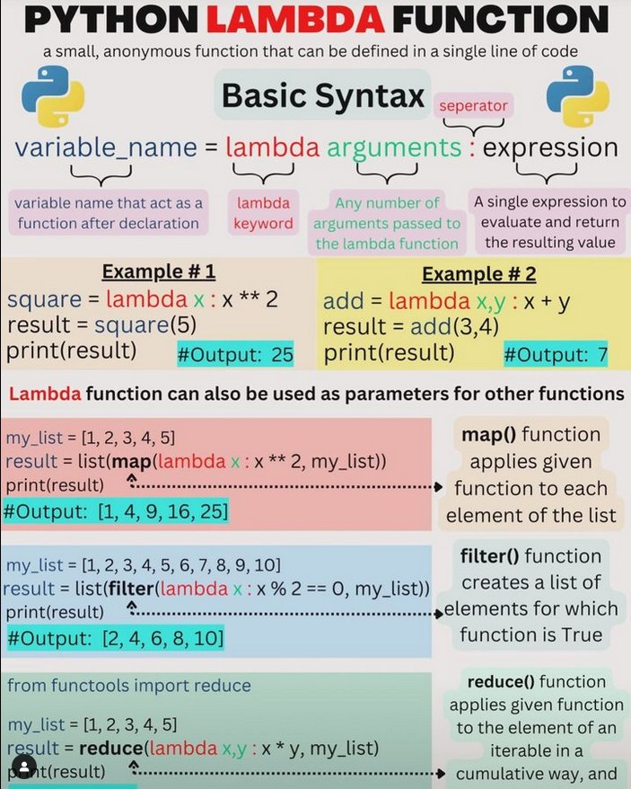

<!-- curso_practico_de_python__creacion_de_un_crud_clases -->

# CURSO DE PYTHON DE PLATZI & 🗺

### PROGRAMA DE CURSO -PLATZI-VENTAS-

- :link: <a href="http://book.pythontips.com/en/latest/index.html" target="_blank">Python Tips - Intermediate Python — Python Tips 0.1 documentation</a>
- :link: <a href="https://docs.python.org/3/library/functions.html" target="_blank">Built-in Functions</a>
- :link: <a href="itertools — Functions creating iterators for efficient looping" target="_blank"><https://docs.python.org/3.10/library/itertools.html></a>

### Tipos de datos

1. **Numeric Types**: int, float, complex
2. **Sequence Types**: list, tuple, range
3. **Text Sequence** Type: str
4. **Binary Sequence** Types: bytes, bytearray, memoryview
5. **Set Types**: set, frozenset
6. **Mapping Type**: dict
7. **Boolean Type**: bool
8. **None Type**: None (This is a special type representing the absence of a value or a null value)

### Formatos & f-strings

Also, check out:

- :link: <a href="https://pyformat.info/" target="_blank">pyformat</a>
- :link: <a href="https://strftime.org/" target="_blank">strftime.org</a>

### String Formatting

Basic formatting:

`#`: Write a comment `# this is a comment`

`\n`: New Line

`\t`: Tab

`\\` or `//`: Allowed Slash

`\'`: Allowed Single Quote

`\"`: Allowed Double quote

`{{` or `}}`: Allowed single curly bracket in formatted strings

`"your single-line text"`: Wrap a single quote (`'`) or double quote (`"`) around text / numbers to make it a string.

`\`: A `slash` in front of a `return`/`enter` will escape that. Allowing for multi-line strings without the triple quotes. Such as:

```py
"this is my string example\
when I close it here"
```

`""" your multi-line text"""`: Wrap 3x single quotes (```) or 3x double quotes (`"`) around a lot of text to allow for multi-line strings. Such as:

```py
"""this is my string example
when I close it here"""
```

#### The `.format()` method

_Empty_

```py
"{} {}".format("Hello", "World")
```

_Positional_

```py
"{0} {1} {0}".format("Hello", "World")
```

_Keyword_

```py
"{first} {second} {first}".format(first="Hello", second="World")
```

_Positional & Keyword_

```py
"{0} {second} {0}".format("Hello", second="World")

"{0} {1} {2['hello']}".format("Hello", "World", {'hello': 'sup'})
```

_Unpacking a Dictionary_

```py
data = {'name': 'Hodor', 'email': 'holdthe@door.com'}
txt = 'Name: {name}\nEmail: {email}'.format(**data)
print(txt)
```

_Numbers, Floats & Decimals_

Number / Integer

```py
"{:d}".format(32)
```

or

```py
"{}".format(32)
```

Float / Decimal

```py
"{:f}".format(32)
```

```py
pi = 3.14159265359
"{:f}".format(pi)
```

Limit to `n` decimal places. Replace `4` below with the number of decimal places to round to.

```py
pi = 3.14159265359
"{:.4f}".format(pi)
```

#### The `%` method

_Positional - Strings or Numbers_

```py
"%s %s %s %s" % ("Hello", 12, 131.312, {'hello': 'sup'})
```

_Keyword / Dictionary_

```py
"%(first)s %(second)s" % {"first":"Hello", "second":"World"}
```

_Keywords_ (Also known as named placeholders)

```py
data = {'name': 'Hodor', 'email': 'holdthe@door.com'}
txt = 'Name: %(name)s\nEmail: %(email)s' % data
print(txt)
```

_Numbers, Floats & Decimals_

Number

```py
"%d" % (32)
```

or

```py
"%s" % (32)
```

Float

```py
"%f" % (32)
```

```py
pi = 3.14159265359
"%f" % (pi)
```

Limit to `n` decimal places. Replace `2` below with the number of decimal places to round to.

```py
pi = 3.14159265359
"%.2f" % (pi)
```

#### `f` Strings (aka `f-string`)

_Strings or Number variables_

```py
first = "Hello"
second = "World"
third = 32.3122
fourth = "{:.2f}".format(third)
f"{first} {second} {first.upper()} {third} {fourth}"
```

_Dictionary_

```py
data = {'name': 'Hodor', 'email': 'holdthe@door.com'}
txt = f'Name: {data["name"]}\nEmail: {data["email"]}'
print(txt)
```

_Inline Math_

```py
hours = 21
seconds = 32
f"{hours} {seconds * 10} {seconds}"
```

_Inline Formatting_

```py
pi = 3.14159265359
f"{format(pi, '.2f')}"
```

Llamar a una función dentro de un `f-string`

```py
def greet(name):
    return f"Hello, {name}"

print(f"{greet('John')}, Welcome!")
```

Obtener los valores de un diccionario dentro de un `f-string`

```py
person = {'name': 'John', 'age': 30}
print(f"Name: {person['name']}, Age: {person['age']}")
```

Obtener los atributos de una clase dentro de un `f-string`

```py
class Person:
    def __init__(self, name, age):
        self.name = name
        self.age = age

p = Person('John', 30)
print(f"Name: {p.name}, Age: {p.age}")
```

Especificadores de formato en `f-string`

```py
from math import pi
print(f"Pi to two decimal places: {pi:.2f}")
```

Multiples lineas.

```py
name = "John"
age = 30
s = f"""
Name: {name}
Age: {age}
"""
print(s)
```

Campos anidados: puede anidar campos dentro de campos de reemplazo.

```py
import decimal

width = 10
precision = 4
value = decimal.Decimal("12.34567")
print(f"result: {value:{width}.{precision}}")

# result:      12.35
# result:     12.35
```

Formato de fechas.

```py
from datetime import datetime
now = datetime.now()
print(f"Current date and time: {now:%Y-%m-%d %H:%M:%S}")
```

### Clases

22

##### Uso de listas

Python y todos los lenguajes nos ofrecen constructos mucho más poderoso, haciendo que el desarrollo de nuestro software sea:

- Más sofisticado
- Más legible
- Más fácil de implementar
- Estos constructos se llaman Estructuras de Datos que nos permiten agrupar de distintas manera varios valores y elementos para poderlos manipular con mayor facilidad.

Las listas las vas a utilizar durante toda tu carrera dentro de la programación e ingeniería de Software.

Las listas son una secuencia de valores. A diferencia de los strings, las listas pueden tener cualquier tipo de valor. También, a diferencia de los strings, son mutables, podemos agregar y eliminar elementos.

En Python, las listas son referenciales. Una lista no guarda en memoria los objetos, solo guarda la referencia hacia donde viven los objetos en memoria

Se inician con `[]` o con la `built-in function list`.

Para copiar una lista a otra variable

```py
import copy

pais = ['Mexico', 'USA', 'Canada']
countries = None
countries = copy.copy(pais)

for country in countries:
    print(country)
```

23

#### Operadores con listas

Ahora que ya entiendes cómo funcionan las listas, podemos ver qué tipo de operaciones y métodos podemos utilizar para modificarlas, manipularlas y realizar diferentes tipos de cómputos con esta Estructura de Datos.

- El operador +(suma) concatena dos o más listas.
- El operador \*(multiplicación) repite los elementos de la misma lista tantas veces los queramos multiplicar

Solo podemos utilizar +(suma) y \*(multiplicación).

Las listas tienen varios métodos que podemos utilizar.

1. `append(x)`: nos permite añadir elementos a listas. Cambia el tamaño de la lista.
2. `buffer_info()`: Returns a tuple representing the address in which array is stored and number of elements in it.
3. `byteswap()`: Byteswap all the items of the array.
4. `count(x)`: Returns the number of occurrences of x in the array.
5. `extend(iterable)`: Appends items from iterable to the end of the array.
6. `frombytes(s)`: Appends items from the string, interpreting the string as an array of machine values.
7. `fromfile(f, n)`: Reads n items (as machine values) from the file object f and appends them to the end of the array.
8. `fromlist(list)`: Appends items from the list.
9. `fromunicode(s)`: Extends this array with data from the given unicode string.
10. `index(x)` / `index(x[, start[, end]])`: Returns the smallest i such that i is the index of the first occurrence of x in the array.
11. `insert(i, x)`: Inserts a new item x into the array before position i.
12. `pop([i])`: nos permite sacar el último elemento de la lista. También recibe un índice y esto nos permite elegir qué elemento queremos eliminar.
13. `remove(x)`: nos permite es pasarle un valor para que Python compare internamente los valores y determina cuál de ellos hace match o son iguales para eliminarlos.
14. `reverse()`: Reverse the order of the items in the array.
15. `tofile(f)`: Write all items (as machine values) to the file object f.
16. `tolist()`: Convert the array to an ordinary list with the same items.
17. `tounicode()`: Convert the array to a unicode string. The array must be a unicode type array; otherwise a ValueError is raised.
18. `sort()` / `sort(key=None, reverse=False)`: modifica la propia lista y ordenarla de mayor a menor. Existe otro método llamado `sorted`, que también ordena la lista, _pero genera una nueva instancia de la lista_.
19. `del list[index]`: nos permite eliminar elementos vía índices, funciona con slices
20. `clear()`: Removes all items from the list.
21. `copy()`: Returns a copy of the list

Ejemplos de **append** y como unir dos listas

```py
list1 = [1,2,3]
list2 = [4,5,6]
list1.append(list2)
list1
Out: [1, 2, 3, [4, 5, 6]]
```

```py
list1 = [1,2,3]
list2 = [4,5,6]
list1.extend(list2)
list1
Out: [1, 2, 3, 4, 5, 6]
```

```py
list1 = [1,2,3]
list2 = [4,5,6]
list1 += list2
list1
Out: [1, 2, 3, 4, 5, 6]
```

```py
list1 = [1,2,3]
list2 = [4,5,6]
list3 = [*list1, *list2]
list3
Out: [1, 2, 3, 4, 5, 6]
```

```py
# append
import array

arr = array.array('i', [1, 2, 3])
arr.append(4)
print(arr)  # array('i', [1, 2, 3, 4])

# buffer_info()
print(arr.buffer_info())  # Returns a tuple (address, length)
# (140118562803088, 3)

# byteswap()
arr.byteswap()
print(arr)  # array('i', [16777216, 33554432, 50331648, 67108864])

# count(x)
print(arr.count(16777216))  # 1

# extend(iterable)
arr.extend([5, 6, 7])
print(arr)  # array('i', [16777216, 33554432, 50331648, 67108864, 5, 6, 7])

# frombytes(s)
arr.frombytes(b'\x08\x00\x00\x00')
print(arr)  # array('i', [16777216, 33554432, 50331648, 67108864, 5, 6, 7, 8])

# fromfile(f, n) - Reads from a file
# fromlist(list)
arr.fromlist([9, 10])
print(arr)  # array('i', [16777216, 33554432, 50331648, 67108864, 5, 6, 7, 8, 9, 10])

# fromunicode(s) - Only applicable for unicode arrays
# index(x)
print(arr.index(16777216))  # 0

# insert(i, x)
arr.insert(0, 0)
print(arr)  # array('i', [0, 16777216, 33554432, 50331648, 67108864, 5, 6, 7, 8, 9, 10])

# pop([i])
print(arr.pop())  # 10
print(arr)  # array('i', [0, 16777216, 33554432, 50331648, 67108864, 5, 6, 7, 8, 9])

# remove(x)
arr.remove(0)
print(arr)  # array('i', [16777216, 33554432, 50331648, 67108864, 5, 6, 7, 8, 9])

# reverse()
arr.reverse()
print(arr)  # array('i', [9, 8, 7, 6, 5, 67108864, 50331648, 33554432, 16777216])

# tofile(f) - Escribe a un archivo
# tolist()
print(arr.tolist())  # [9, 8, 7, 6, 5, 67108864, 50331648, 33554432, 16777216]

# tounicode() - Solo se aplica a arreglos unicode
# sort() - Not a method of array, but can use sorted function
print(sorted(arr))  # [5, 6, 7, 8, 9, 16777216, 33554432, 50331648, 67108864]

# del list[index]
del arr[0]
print(arr)  # array('i', [8, 7, 6, 5, 67108864, 50331648, 33554432, 16777216])

# clear() - No es un método de arrays, pero se puede usar slicing para limpiar el array
del arr[:]
print(arr)  # array('i')

# copy() - No es un método de arrays, pero se puede usar slicing para copiar el array
arr = array.array('i', [1, 2, 3])
arr_copy = arr[:]
print(arr_copy)  # array('i', [1, 2, 3])
```

24

#### Diccionarios

Los diccionarios se conocen con diferentes nombres a lo largo de los lenguajes de programación como HashMaps, Mapas, Objetos, etc. En Python se conocen como Diccionarios.

Un diccionario es similar a una lista sabiendo que podemos acceder a través de un indice, pero en el caso de las listas este índice debe ser un número entero. Con los diccionarios puede ser cualquier objeto, normalmente los verán con strings para ser más explícitos, pero funcionan con muchos tipos de llaves…

Un diccionario es una asociación entre llaves(keys) y valores(values) y la referencia en Python es muy precisa. Si abres un diccionario verás muchas palabras y cada palabra tiene su definición.

Para iniciar un diccionario se usa `{}` o con la función `dict`

Estos también tienen varios métodos. Siempre puedes usar la función dir para saber todos los métodos que puedes usar con un objeto.

Si queremos ciclar a lo largo de un diccionario tenemos las opciones:

- `keys`: nos imprime una lista de las llaves
- `values` nos imprime una lista de los valores
- `items`. nos manda una lista de tuplas de los valores

1. `clear()`: Elimina todos los elementos del diccionario.
2. `copy()`: Devuelve una copia superficial del diccionario.
3. `fromkeys(seq[, v])`: Devuelve un nuevo diccionario con claves de seq y valor igual a v (por defecto es None).
4. `get(key[,d])`: Devuelve el valor de la clave. Si la clave no existe, devuelve d (por defecto es None).
5. `items()`: Devuelve un nuevo objeto de los elementos del diccionario en formato (clave, valor).
6. `keys()`: Devuelve un nuevo objeto de las claves del diccionario.
7. `pop(key[,d])`: Elimina el elemento con la clave y devuelve su valor o d si la clave no se encuentra. Si d no se proporciona y la clave no se encuentra, se genera un KeyError.
8. `popitem()`: Elimina y devuelve un elemento arbitrario (clave, valor). Genera KeyError si el diccionario está vacío.
9. `setdefault(key[,d])`: Devuelve el valor correspondiente si la clave está en el diccionario. Si no, inserta la clave con un valor de d y devuelve d (por defecto es None).
10. `update([other])`: Actualiza el diccionario con los pares clave/valor de other, sobrescribiendo las claves existentes.
11. `values()`: Devuelve un nuevo objeto de los valores del diccionario.

Los diccionarios en Python no tienen atributos específicos, pero sí tienen algunos atributos especiales disponibles para todos los objetos de Python:

- `__doc__`: La cadena de documentación de la clase, o None si no está definida.
- `__class__`: El tipo del objeto.
- `__dict__`: El espacio de nombres que soporta atributos de función arbitrarios.
- `__dir__()`: Devuelve una lista de atributos válidos para el objeto.
- `__sizeof__()`: Devuelve el tamaño del objeto en memoria, en bytes.

Aquí tienes un ejemplo de cómo usar algunos de estos métodos:

```py
# Crear un diccionario
dict1 = {"name": "John", "age": 30, "city": "New York"}

# Usar el método get
print(dict1.get("name", "Valor_si_no_se_encuentra"))  # Salida: John

# Usar el método keys
print(dict1.keys())  # Salida: dict_keys(['name', 'age', 'city'])

# Usar el método values
print(dict1.values())  # Salida: dict_values(['John', 30, 'New York'])

# Usar el método items
print(dict1.items())  # Salida: dict_items([('name', 'John'), ('age', 30), ('city', 'New York')])

# Usar el método update
dict1.update({"country": "USA"})
print(dict1)  # Salida: {'name': 'John', 'age': 30, 'city': 'New York', 'country': 'USA'}

# Usar el método pop
dict1.pop("city")
print(dict1)  # Salida: {'name': 'John', 'age': 30, 'country': 'USA'}

# Usar el método clear
dict1.clear()
print(dict1)  # Salida: {}
```

#### JSON

|      Method      |          Description           |
|:----------------:|:------------------------------:|
| JSONDecodeError  |                                |
|   JSONDecoder    |                                |
|   JSONEncoder    |                                |
|    `__all__`     |                                |
|   `__author__`   |                                |
|  `__builtins__`  |                                |
|   `__cached__`   |                                |
|    `__doc__`     |                                |
|    `__file__`    |                                |
|   `__loader__`   |                                |
|    `__name__`    |                                |
|  `__package__`   |                                |
|    `__path__`    |                                |
|    `__spec__`    |                                |
|  `__version__`   |                                |
| _default_decoder |                                |
| _default_encoder |                                |
|      codecs      |                                |
|     decoder      |                                |
| detect_encoding  |                                |
|      dumps       | encoded string writing on file |
|      dumps       |    encoding to JSON objects    |
|     encoder      |                                |
|       load       |  Decode while JSON file read   |
|      loads       |     Decode the JSON string     |
|      scanne      |                                |

**Python to JSON (Encoding)**  
La librería `json` de python realiza las siguientes traducciones de python a objetos de`json` de manera predeterminada.

|       Python       |      JSON     |
|:------------------:|:-------------:|
| dict               | Object        |
| list               | Array         |
| unicode            | String        |
| number – int, long | number – int  |
| float              | number – real |
| True               | True          |
| None               | Null          |

**JSON dumps() en Python**  
El método `json.dumps()` convierte un diccionario de python a `json` formato de cadena(string)

Sintaxis `json.dumps()`

```py
json.dumps(
    obj,
    *,
    skipkeys=False,
    ensure_ascii=True,
    check_circular=True,
    allow_nan=True,
    cls=None,
    indent=None,
    separators=None,
    default=None,
    sort_keys=False
)
```

- `obj`: The Python object that you want to convert to a JSON string.
- `skipkeys`: _optional_ A boolean indicating whether to skip keys that are not JSON serializable (default False).
- `ensure_ascii`: _optional_ A boolean indicating whether to encode non-ASCII characters as UTF-8 (default True).
- `check_circular`: _optional_ A boolean indicating whether to check for circular references (default True).
- `allow_nan`: _optional_ A boolean indicating whether to allow NaN, Infinity, and -Infinity values (default True).
- `cls`: _optional_ A class used to serialize objects that are not JSON serializable (default None).
- `indent`: _optional_ The number of spaces to use for indentation (default None).
- `separators`: _optional_ A tuple specifying the separators to use for the JSON string (default (',', ':')).
- `default`: _optional_ A function used to convert non-serializable objects to a serializable object (default None).
- `sort_keys`: _optional_ A boolean indicating whether to sort the keys of the dictionary (default False).

```py
x = {
  "name": "Ken",
  "age": 45,
  "married": True,
  "children": ("Alice","Bob"),
  "pets": ['Dog'],
  "cars": [
    {"model": "Audi A1", "mpg": 15.1},
    {"model": "Zeep Compass", "mpg": 18.1}
  ]
}
```

Ocupando `json.dumps()`

```py
x_json = json.dumps(x, sort_keys=True)
```

👇

```py
'{"age": 45, "cars": [{"model": "Audi A1", "mpg": 15.1}, {"model": "Zeep Compass", "mpg": 18.1}], "children": ["Alice", "Bob"], "married": true, "name": "Ken", "pets": ["Dog"]}'
```

**JSON to Python (Decoding)**

La decodificación(decoding) de cadenas JSON se hacen con los métodos incorporados `json.loads()` y `json.load()`.  
La siguiente tabla muestra la traducción de los objetos de _JSON_ a python que ayudan a realizar la decodificación.

|      JSON     |       Python       |
|:-------------:|:------------------:|
| Object        |        dict        |
| Array         | list               |
| String        | unicode            |
| number – int  | number – int, long |
| number – real | float              |
| True          | True               |
| False         | False              |
| Null          | None               |

Por ejemplo `json.loads()` y `json.load()`

Sintaxis `json.loads()`

```py
json.loads(
    json_string, *,
    cls=None,
    object_hook=None,
    parse_float=None,
    parse_int=None,
    parse_constant=None,
    object_pairs_hook=None,
    **kw
)
```

- `json_string`: The JSON string that you want to parse and convert into a Python object.
- `cls`: _An optional_ argument that can be used to specify a custom class for JSON decoding. If specified, it must be a subclass of json.JSONDecoder.
- `object_hook`: _An optional_ function that can be used to modify the Python object generated from the JSON data. The function takes a dictionary as its argument and returns a modified dictionary. The modified dictionary is then used to create the Python object. This can be useful if you want to convert JSON objects to custom Python objects.
- `parse_float`: _An optional_ function that can be used to parse floating-point numbers. If specified, it must take a string as its argument and return a floating-point number.
- `parse_int`: _An optional_ function that can be used to parse integer numbers. If specified, it must take a string as its argument and return an integer number.
- `parse_constant`: _An optional_ function that can be used to parse constant values (true, false, and null) in the JSON data. If specified, it must take a string as its argument and return a Python object.
- `object_pairs_hook`: _An optional_ function that can be used to modify the Python object generated from the JSON data. The function takes a list of (key, value) pairs as its argument and returns a modified dictionary. The modified dictionary is then used to create the Python object. This can be useful if you want to convert JSON objects to custom Python objects.
- `**`kw: Any additional keyword arguments that are passed to json.loads() are forwarded to the json.JSONDecoder constructor.

👀 Serialización de clases de Python hacia y desde JSON directamente(_Serializing Python Classes To and From JSON Directly_)

```py
import json

class Restaurant:
    """demonstrates adding to_json and from_json methods to a custom class"""
    
    def __init__(self, name: str, distance: float, favorite: bool):
        self.name = name
        self.distance = distance
        self.favorite = favorite

    def __repr__(self):
        return f'Restaurant(name="{self.name}", distance={self.distance}, favorite={self.favorite})'

    def to_json(self):
        return json.dumps({
            'name': self.name,
            'distance': self.distance,
            'favorite': self.favorite,
        })

    @classmethod
    def from_json(cls, json_str: str):
        dct = json.loads(json_str)
        return cls(**dct)
    
# Basic test
bean = Restaurant("Bean Vegan Cuisine", 9.1, True)
print(f"Object:  {bean}")  # 👉 Object:  Restaurant(name="Bean Vegan Cuisine", distance=9.1, favorite=True)
print(f"JSON version: {bean.to_json()}")   # 👉 JSON version: {"name": "Bean Vegan Cuisine", "distance": 9.1, "favorite": true}
bean2 = Restaurant.from_json(bean.to_json())
print(f"Reloaded Object:  {bean2}")  # 👉 Reloaded Object:  Restaurant(name="Bean Vegan Cuisine", distance=9.1, favorite=True)
```

Sintaxis `json.load()`

```py
json.load(
    fp,
    *,
    cls=None,
    object_hook=None,
    parse_float=None,
    parse_int=None,
    parse_constant=None,
    object_pairs_hook=None,
    **kw
)
```

- `fp`: The file object that contains the JSON data that you want to parse and convert into a Python object.
- `cls`: _An optional_ argument that can be used to specify a custom class for JSON decoding. If specified, it must be a subclass of json.JSONDecoder.
- `object_hook`: _An optional_ function that can be used to modify the Python object generated from the JSON data. The function takes a dictionary as its argument and returns a modified dictionary. The modified dictionary is then used to create the Python object. This can be useful if you want to convert JSON objects to custom Python objects.
- `parse_float`: _An optional_ function that can be used to parse floating-point numbers. If specified, it must take a string as its argument and return a floating-point number.
- `parse_int`: _An optional_ function that can be used to parse integer numbers. If specified, it must take a string as its argument and return an integer number.
- `parse_constant`: _An optional_ function that can be used to parse constant values (true, false, and null)

Example

Archivo `json.data`

```py
{
    "name": "John Doe",
    "age": 35,
    "email": "johndoe@example.com"
}
```

Se lee el archivo con `json.load()` en un diccionario de python

```py
import json

with open('data.json') as f:
    data = json.load(f)

print(data) # 👉 {'name': 'John Doe', 'age': 35, 'email': 'johndoe@example.com'}
```

Asi es como se accesa a los datos del diccionario.

```py
print(data['name'])  # 👉 'John Doe'
print(data['age'])   # 👉 35
print(data['email']) # 👉 'johndoe@example.com'
```

```py
import json

# Example JSON data as a string
json_string = '{"name": "John Smith", "age": 35, "is_student": false}'

# Using json.loads() to load the JSON string into a Python dictionary
json_dict = json.loads(json_string)
# 👉 {"name": "John Smith", "age": 35, "is_student": false}

# Accessing the data in the dictionary
print(json_dict['name'])        # 👉 John Smith
print(json_dict['age'])         # 👉 35
print(json_dict['is_student'])  # 👉 False

# Example JSON data in a file
with open('example.json', 'r') as f:
    # Using json.load() to load the JSON data from the file into a Python dictionary
    json_dict_from_file = json.load(f)

# Accessing the data in the dictionary
print(json_dict_from_file['name'])        # 👉 John Smith
print(json_dict_from_file['age'])         # 👉 35
print(json_dict_from_file['is_student'])  # 👉 False
```

26

#### Tuplas y conjuntos

Tuplas(tuples) son iguales a las listas, la única diferencia es que son _inmutables_, la diferencia con los strings es que pueden recibir muchos tipos valores. Son una serie de valores separados por comas, casi siempre se le agregan paréntesis para que sea mucho más legible.

Para poderla inicializar utilizamos la función tuple.

Uno de sus usos muy comunes es que cuando queremos regresar más de un valor en nuestra función.

```py
return (students, teachers)
```

Una de las características de las Estructuras de Datos es que cada una de ellas nos sirve para algo especifico. No existe en programación una navaja suiza que nos sirva para todos. Los mejores programas son aquellos que utilizan la herramienta correcta para el trabajo correcto.

Conjuntos(_sets_) nacen de la teoría de conjuntos. Son una de las Estructuras más importantes y se parecen a las listas, podemos añadir varios elementos a los conjuntos, _pero no pueden existir elementos duplicados_. _A diferencia de los_tuples_podemos agregar y eliminar, son mutables_.

Los sets se pueden inicializar con la función `set`. Una recomendación es inicializarlos con esta función para no causar confusión con los diccionarios.

- `add` nos sirve añadir elementos.
- `remove` nos permite eliminar elementos.

27

### Módulo Collections

- :link: [collections — Container datatypes](https://docs.python.org/3/library/collections.html)

El módulo collections nos brinda un conjunto de objetos primitivos que nos permiten extender el comportamiento de las built-in collections que poseé Python y nos otorga estructuras de datos adicionales. Por ejemplo, si queremos extender el comportamiento de un diccionario, podemos extender la clase UserDict; para el caso de una lista, extendemos UserList; y para el caso de strings, utilizamos UserString.

1. `namedtuple()` factory function for creating tuple subclasses with named fields
   - Los métodos adicionales para una namedtuple son los mismos que para una tupla regular, incluyendo pero no limitado a `count()` y `index()`.
2. `deque` list-like container with fast appends and pops on either end
   - Los métodos adicionales incluyen `append()`, `appendleft()`, `clear()`, `copy()`, `count()`, `extend()`, `extendleft()`, `pop()`, `popleft()`, `remove()`, `reverse()` y `rotate()`.
3. `ChainMap` dict-like class for creating a single view of multiple mappings
   - Los métodos adicionales incluyen `new_child()`, `parents()`, `maps()`, `keys()`, `values()`, `items()`, `pop()`, `popitem()`, `clear()`, `update()` y `get()`.  
4. `Counter` dict subclass for counting hashable objects
   - Los métodos adicionales incluyen `elements()`, `most_common()`, `subtract()`, `update()`, `items()`, `keys()`, `values()`, `get()`, `pop()`, `popitem()`, `clear()` y `copy()`.
5. `OrderedDict` dict subclass that remembers the order entries were added
   - Los métodos adicionales incluyen `popitem()`, `move_to_end()`, `update()`, `keys()`, `values()`, `items()`, `get()`, `pop()`, `clear()` y `copy()`.
6. `defaultdict` dict subclass that calls a factory function to supply missing values
   - Los métodos adicionales son los mismos que para un diccionario regular, incluyendo pero no limitado a `update()`, `keys()`, `values()`, `items()`, `get()`, `pop()`, `popitem()`, `clear()`, `copy()`
7. `UserDict` wrapper around dictionary objects for easier dict subclassing
8. `UserList` wrapper around list objects for easier list subclassing
9. `UserString` wrapper around string objects for easier string subclassing

1. `namedtuple()`: Se utiliza cuando quieres crear una tupla con campos nombrados. Esto puede hacer que tu código sea más auto-documentado. Se pueden utilizar donde se utilizan las tuplas regulares, y añaden la capacidad de acceder a los campos por nombre en lugar de por posición de índice.
2. `deque`: Se utiliza cuando necesitas una estructura de cola, es decir, quieres añadir y eliminar elementos de manera eficiente desde ambos extremos del contenedor. Es ideal para mantener una 'ventana deslizante' de los últimos N elementos.
3. `ChainMap`: Se utiliza para combinar varios diccionarios o mapeos. Devuelve una lista de diccionarios. Es ideal cuando quieres buscar a través de varios diccionarios como un solo mapeo.
4. `Counter`: Es una subclase de diccionario para contar objetos hashables. Es una colección donde los elementos se almacenan como claves de diccionario y sus recuentos se almacenan como valores de diccionario.
5. `OrderedDict`: Es una subclase de diccionario que recuerda el orden en que se añadieron las entradas. Si necesitas mantener el orden de inserción de las claves, esta es la herramienta ideal.
6. `defaultdict`: Es una subclase de diccionario que llama a una función de fábrica para suministrar valores faltantes. Se utiliza cuando el valor de cada elemento debe empezar con un valor predeterminado.
7. `UserDict`: Es un envoltorio alrededor de los objetos de diccionario para facilitar la subclasificación de diccionarios. Es útil cuando quieres crear tu propio diccionario con alguna funcionalidad modificada o adicional.
8. `UserList`: Es un envoltorio alrededor de los objetos de lista para facilitar la subclasificación de listas. Es útil cuando quieres crear tu propia lista con alguna funcionalidad modificada o adicional.
9. `UserString`: Es un envoltorio alrededor de los objetos de cadena para facilitar la subclasificación de cadenas. Es útil cuando quieres crear tu propia cadena con alguna funcionalidad modificada o adicional.

##### UserDict

```py
from collections import UserDict

# Define a custom dictionary by extending UserDict
class MyDict(UserDict):
    def __missing__(self, key):
        return f"{key} not found"

# Create an instance of MyDict
my_dict = MyDict({'a': 1, 'b': 2})

# Access keys
print(my_dict['a'])  # Output: 1
print(my_dict['c'])  # Output: c not found
```

##### UserList

```py
from collections import UserList

# Define a custom list by extending UserList
class MyList(UserList):
    def __len__(self):
        return f"Custom length: {super().__len__()}"

# Create an instance of MyList
my_list = MyList([1, 2, 3])

# Get length
print(len(my_list))  # Output: Custom length: 3
```

##### UserString

```py
from collections import UserString

# Define a custom string by extending UserString
class MyString(UserString):
    def upper(self):
        return f"Custom upper: {super().upper()}"

# Create an instance of MyString
my_string = MyString("hello")

# Call upper method
print(my_string.upper())  # Output: Custom upper: HELLO
```

##### Counter

```py
from collections import Counter

# Create a Counter
c = Counter(['a', 'b', 'c', 'a', 'b', 'b'])

# Access counts
print(c['a'])  # 2
print(c['b'])  # 3
print(c['c'])  # 1
```

```py
from collections import Counter

list = [1,2,3,4,1,2,6,7,3,8,1]
Counter(list)
Counter({1: 3, 2: 2, 3: 2, 4: 1, 6: 1, 7: 1, 8: 1})
```

```py
from collections import Counter

list = [1,2,3,4,1,2,6,7,3,8,1]
cnt = Counter(list)
print(cnt[1])

# 3
```

Counter tiene tres funciones adicionales.

1. Elements
2. Most_common([n])
3. Subtract([interable-or-mapping])

_elements()_

```py
from collections import Counter

cnt = Counter({1:3,2:4})
print(list(cnt.elements()))

# [1, 1, 1, 2, 2, 2, 2]
```

_most_common()_

```py
from collections import Counter

list = [1,2,3,4,1,2,6,7,3,8,1]
cnt = Counter(list)
print(cnt.most_common())

# [(1, 3), (2, 2), (3, 2), (4, 1), (6, 1), (7, 1), (8, 1)]
```

_subtract_

```py
from collections import Counter

cnt = Counter({1:3,2:4})
deduct = {1:1, 2:2}
cnt.subtract(deduct)
print(cnt)
# Output:
Counter({1: 2, 2: 2})
```

##### defaultdict

Crear diccionarios con el constructor `defaultdict()`

```py
from collections import defaultdict

# Create a defaultdict with list as default factory
dd = defaultdict(list)
# dd = defaultdict(list)

# Access a non-existent key
print(dd['a'])  # Output: []

# Add a value to 'a'
dd['a'].append(1)
print(dd['a'])  # Output: [1]
```

```py
from collections import defaultdict

nums = defaultdict(int)
nums['one'] = 1
# -
print(nums)
# Output:
defaultdict(<class 'int'>, {'one': 1, 'two': 2})
# -
print(nums['two'])
# Output:
2
```

```py
from collections import defaultdict

count = defaultdict(int)
names_list = "Mike John Mike Anna Mike John John Mike Mike Britney Smith Anna Smith".split()
for names in names_list:
    count[names] +=1
print(count)
# Output:
defaultdict(<class 'int'>, {'Mike': 5, 'Britney': 1, 'John': 3, 'Smith': 2, 'Anna': 2})
```

##### OrderedDict

Ordenar diccionario(s)

```py
from collections import OrderedDict

# Create an OrderedDict
od = OrderedDict()
od['a'] = 1
od['b'] = 2
od['c'] = 3

# Print items in order
for key, value in od.items():
    print(key, value)
# Output: 
# a 1
# b 2
# c 3
```

```py
from collections import OrderedDict

od = OrderedDict()
od['a'] = 1
od['b'] = 2
od['c'] = 3
print(od)
# Output:
OrderedDict([('a', 1), ('b', 2), ('c', 3)])
```

```py
for key, value in od.items():
    print(key, value)
# Output
a 1
b 2
c 3
```

##### deque

```py
from collections import deque

# Create a deque
d = deque([1,2,3,4,5])
# d = deque([1,2,3,4,5])

# Append to the right
d.append(6)  
print(d)  # Output: deque([1, 2, 3, 4, 5, 6])

# Append to the left
d.appendleft(0)  
print(d)  # Output: deque([0, 1, 2, 3, 4, 5, 6])
```

```py
from collections import deque

list = ["a","b","c"]
deq = deque(list)
print(deq)
# Output
deque(['a', 'b', 'c'])
```

```py
deq.append("d")
deq.appendleft("e")
print(deq)deque
# Output
deque(['e', 'a', 'b', 'c', 'd'])
```

```py
deq.pop()
deq.popleft()
print(deq)
# Output
deque(['a', 'b', 'c'])
```

```py
from collections import deque

list = ["a","b","c"]
deq = deque(list)
print(deq)
print(deq.clear())
# Output
deque(['a', 'b', 'c'])
None
```

```py
from collections import deque

list = ["a","b","c"]
deq = deque(list)
print(deq.count("a"))
# Output
1
```

##### ChainMap

```py
from collections import ChainMap

dict1 = { 'a' : 1, 'b' : 2 }
dict2 = { 'c' : 3, 'b' : 4 }
chain_map = ChainMap(dict1, dict2)
print(chain_map.maps)
# Output
[{'b': 2, 'a': 1}, {'c': 3, 'b': 4}]
```

```py
dict2['c'] = 5
print(chain_map.maps)
# Output
[{'a': 1, 'b': 2}, {'c': 5, 'b': 4}]
```

```py
from collections import ChainMap

dict1 = { 'a' : 1, 'b' : 2 }
dict2 = { 'c' : 3, 'b' : 4 }
chain_map = ChainMap(dict1, dict2)
print (list(chain_map.keys()))
print (list(chain_map.values()))
# Output
['b', 'a', 'c']
[2, 1, 3]
```

```py
from collections import ChainMap

dict3 = {'e' : 5, 'f' : 6}
new_chain_map = chain_map.new_child(dict3)
print(new_chain_map)
# Output
ChainMap({'f': 6, 'e': 5}, {'a': 1, 'b': 2}, {'b': 4, 'c': 3})
```

##### `namedtuple()`

Con `namedtuple()` es posible generar clases, los atributos del objeto son de lectura.

```py
from collections import namedtuple

# Define a namedtuple type 'Person' with fields 'name' and 'age'
Person = namedtuple('Person', ['name', 'age'])

# Create an instance of Person
bob = Person(name="Bob", age=30)

# Access the fields
print(bob.name)  # Output: Bob
print(bob.age)   # Output: 30
```

```py
from collections import namedtuple

Student = namedtuple('Student', 'fname, lname, age')
s1 = Student('John', 'Clarke', '13')
print(s1)
print(s1.fname)
```

```py
# Output
Jhon
Student(fname='John', lname='Clarke', age='13')
```

```py
from collections import namedtuple

Setting = namedtuple("Setting", ['port', 'name', 'alias'])
setting = Setting(3000, 'Rails', 'RoR')
print(setting)
# Output
Setting(port=3000, name='Rails', alias='RoR')
```

Valores por default con `namedtuple()`, en Python los valores por default se asignan de izquierda a derecha.

```py
from collections import namedtuple

Setting = namedtuple("Setting", ['port', 'name', 'alias'], defaults=('No Name', 'No Alias'))
```

Se asigna al parámetro `port` un valor.

```py
setting = Setting(port=3000)
print(setting.port)
# Output
3000
print(setting.name)
# Output
'No Name'
print(setting.alias)
# Output
'No Name'
```

Clase `Setting` definida.

```py
print(setting)
# Output
Setting(port=3000, name='No Name', alias='No Alias')
```

Creando `namedtuple` usando una lista.

```py
s2 = Student._make(['Adam','joe','18'])
print(s2)
# Output
Student(fname='Adam', lname='joe', age='18')
```

**Métodos y atributos del objeto**  
Por ejemplo, si queremos conocer todos los _atributos_ que posee un objeto

```py
from collections import namedtuple

Setting = namedtuple("Setting", ['port', 'name', 'alias'], defaults=('No Name', 'No Alias'))

Setting._fields
# Output
('port', 'name', 'alias')

Retornar una tupla de strings con cada uno de los atributos que posee dicho objeto.
```

Si lo que deseamos es convertir nuestro objeto a un diccionario, y después se puede serializar como un objeto JSON.

```py
from collections import namedtuple

Doctor = namedtuple("Medico", ['Nombre', 'Especialidad', 'Telefono'])
doctor = Doctor("Nombre Doc", "Corazon", 4359876432)
# --
Doctor._fields
('Nombre', 'Especialidad', 'Telefono')
# --
doctor.Nombre
'Nombre Doc'

doctor.Especialidad
'Corazon'

doctor.Telefono
4359876432
# --
doctor._asdict()
{'Nombre': 'Nombre Doc', 'Especialidad': 'Corazon', 'Telefono': 4359876432}
# --

```

Con el método `_replace()` se crea una nueva instancia a partir del objeto original con la posibilidad de modificar algunos de sus atributos.

```py
doctor_1 = doctor._replace(Especialidad="Pulmones")
print(doctor_1)
# Output
Medico(Nombre='Nombre Doc', Especialidad='Pulmones', Telefono=4359876432)
# -- 
doctor_1._asdict()
# Output
{'Nombre': 'Nombre Doc', 'Especialidad': 'Pulmones', 'Telefono': 4359876432}
```

Creando una nueva instancia usando una instancia existente

```py
s2 = s1._asdict()
print(s2)
# Output
OrderedDict([('fname', 'John'), ('lname', 'Clarke'), ('age', '13')])
```

Cambiando valores con la funcion \_replace()

```py
s2 = s1._replace(age='14')
print(s1)
print(s2)
# Output
Student(fname='John', lname='Clarke', age='13')
Student(fname='John', lname='Clarke', age='14')
```

29

### List comprenhensions

- :link: :snake: [Data Structures](https://docs.python.org/3/tutorial/datastructures.html)


List
[_element_ `for` _element_ `in` element_list `if` _element_meets_conditions_]

```py
[element for element in element_list if element_meets_conditions]

[element for element in range(20) if element % 3 == 0]
# Output:
[0, 3, 6, 9, 12, 15, 18]
```

Dictionary
{_key: element_ `for` _element_ `in` element*list `if` \_element_meets_conditions*}

```py
{key: element for element in element_list if element_meets_conditions}

names = ['name_one', 'name_two', 'name_three']
numbers = [1, 2, 3]
{uid: names for uid, names in zip(numbers, names)}
# Output:
{1: 'name_one', 2: 'name_two', 3: 'name_three'}
```

Set
{_element_ `for` _element_ `in` element*list `if` \_element_meets_conditions*}

```py
{element for element in element_list if element_meets_conditions}

{x for x in 'abracadabra' if x not in 'abc'}
# Output:
{'d', 'r'}
```

30

### Funciones anónimas: lambda

Python Lambda Function



Calcular el cuadrado de los números la lista

```py
numbers = [1, 2, 3, 4, 5]
squares = list(map(lambda x: x**2, numbers))
print(squares)  # Output: [1, 4, 9, 16, 25]
```

Filtrar la lista de números para obtener solo los números pares

```py
numbers = [1, 2, 3, 4, 5]
even_numbers = list(filter(lambda x: x % 2 == 0, numbers))
print(even_numbers)  # Output: [2, 4]
```

Concatenar la lista de string para que formen una sola cadena

```py
import functools

strings = ['Hello', 'World']
result = functools.reduce(lambda x, y: x + y, strings)
print(result)  # Output: 'HelloWorld'
```

Ordenar una lista de tuplas por el segundo elemento de cada tupla

```py
tuples = [(1, 'b'), (2, 'a'), (3, 'c')]
sorted_tuples = sorted(tuples, key=lambda x: x[1])
print(sorted_tuples)  # Output: [(2, 'a'), (1, 'b'), (3, 'c')]
```

Multiplicar cada elemento de una lista por 5

```py
numbers = [1, 2, 3, 4, 5]
result = list(map(lambda x: x * 5, numbers))
print(result)  # Output: [5, 10, 15, 20, 25]
```

Filtrar una lista de strings para obtener solo aquellos que empiezan con la letra 'a'

```py
words = ['apple', 'banana', 'cherry', 'date']
filtered_words = list(filter(lambda x: x[0] == 'a', words))
print(filtered_words)  # Output: ['apple']
```

Crear una lista de booleanos que indiquen si el número correspondiente en otra lista es mayor que 3

```py
numbers = [1, 2, 3, 4, 5]
result = list(map(lambda x: x > 3, numbers))
print(result)  # Output: [False, False, False, True, True]
```

Encontrar el máximo de una lista de números.

```py
numbers = [1, 2, 3, 4, 5]
max_number = reduce(lambda x, y: x if x > y else y, numbers)
print(max_number)  # Output: 5
```

Calcula el factorial de un número

```py
from functools import reduce

n = 5
factorial = reduce(lambda x, y: x * y, range(1, n+1))
print(factorial)  # Output: 120
```

Crear una lista con el largo de cada palabra en una lista de strings

```py
words = ['Hello', 'World', 'Python', 'Lambda']
lengths = list(map(lambda x: len(x), words))
print(lengths)  # Output: [5, 5, 6, 6]
```

Obtener todas las claves de un diccionario:

```py
diccionario = {'a': 1, 'b': 2, 'c': 3}
claves = list(map(lambda x: x, diccionario.keys()))
print(claves)  # Salida: ['a', 'b', 'c']
```

Obtener todos los valores de un diccionario:

```py
diccionario = {'a': 1, 'b': 2, 'c': 3}
valores = list(map(lambda x: x, diccionario.values()))
print(valores)  # Salida: [1, 2, 3]
```

Filtrar un diccionario por valores mayores a un número:

```py
diccionario = {'a': 1, 'b': 2, 'c': 3}
filtrado = dict(filter(lambda x: x[1] > 1, diccionario.items()))
print(filtrado)  # Salida: {'b': 2, 'c': 3}
```

Crear un nuevo diccionario con las claves y valores intercambiados:

```py
diccionario = {'a': 1, 'b': 2, 'c': 3}
invertido = dict(map(lambda x: (x[1], x[0]), diccionario.items()))
print(invertido)  # Salida: {1: 'a', 2: 'b', 3: 'c'}
```

Crear un nuevo diccionario con los valores al cuadrado:

```py
diccionario = {'a': 1, 'b': 2, 'c': 3}
cuadrado = dict(map(lambda x: (x[0], x[1]**2), diccionario.items()))
print(cuadrado)  # Salida: {'a': 1, 'b': 4, 'c': 9}
```

Obtener la suma de todos los valores de un diccionario:

```py
from functools import reduce

diccionario = {'a': 1, 'b': 2, 'c': 3}
suma = reduce(lambda x, y: x + y, diccionario.values())
print(suma)  # Salida: 6
```

Crear un nuevo diccionario con las claves en mayúsculas:

```py
diccionario = {'a': 1, 'b': 2, 'c': 3}
mayusculas = dict(map(lambda x: (x[0].upper(), x[1]), diccionario.items()))
print(mayusculas)  # Salida: {'A': 1, 'B': 2, 'C': 3}
```

Filtrar un diccionario por claves que sean letras minúsculas:

```py
diccionario = {'a': 1, 'B': 2, 'c': 3, 'D': 4}
filtrado = dict(filter(lambda x: x[0].islower(), diccionario.items()))
print(filtrado)  # Salida: {'a': 1, 'c': 3}
```

Crear un nuevo diccionario con los valores incrementados en uno:

```py
diccionario = {'a': 1, 'b': 2, 'c': 3}
incrementado = dict(map(lambda x: (x[0], x[1] + 1), diccionario.items()))
print(incrementado)  # Salida: {'a': 2, 'b': 3, 'c': 4}
```

Obtener el valor máximo de un diccionario:

```py
from functools import reduce

diccionario = {'a': 1, 'b': 2, 'c': 3}
maximo = reduce(lambda x, y: x if x > y else y, diccionario.values())
print(maximo)  # Salida: 3
```

Por favor, ten en cuenta que en algunos de estos ejemplos, he utilizado las funciones `map`, `filter` y `reduce` junto con las funciones lambda. Estas son funciones de orden superior que toman una función y iterable(s) como entradas, y aplican la función a los elementos del iterable(s) de una manera específica.

38

### Click

- [Click](https://click.palletsprojects.com/en/7.x/)

_Click_ es un pequeño framework que nos permite crear aplicaciones de Línea de comandos. Tiene cuatro decoradores básicos:

`@click_group`: Agrupa una serie de comandos
`@click_command`: Aca definiremos todos los comandos de nuestra apliacion
`@click_argument`: Son parámetros necesarios
`@click_option`: Son parámetros opcionales
Click también realiza las conversiones de tipo por nosotros. Esta basado muy fuerte en decoradores.

45

### Manejo de errores y jerarquía de errores en Python

- [Built-in Exceptions - 3.9.5](https://docs.python.org/3/library/exceptions.html#exception-hierarchy)
- [https://realpython.com/python-exceptions/](https://realpython.com/python-exceptions/)
- [Errores y excepciones](http://docs.python.org.ar/tutorial/2/errors.html)

Python tiene una jerarquía rica de errores que nos da posibilidades para definir errores por si no se puede leer un archivo, dividir entre cero, si existen problemas en general en nuestro código Python tirará un error. El problema con esto es que nuestro programa termina, es diferente a los errores de sintaxis donde nuestro programa nunca inicia.

Para _aventar_ un error en Python utilizamos la palabra raise. Aunque Python nos ofrece muchos errores es _buena práctica_ definir errores específicos de nuestra aplicación y usar los de Python para extenderlos.

Podemos generar nuestros propios errores creando una clase que extienda de `BaseException`.

Si queremos _evitar_ que termine nuestro programa cuando ocurra un error, debemos tener un estrategia. Debemos utilizar `try / except` cuando tenemos la posibilidad de que un pedazo de nuestro código falle

1. `try`: significa ejecuta este código y si podemos solo colocamos una sola línea de código ahí como buena práctica
2. `except`: es nuestro manejo del error, es lo que haremos si ocurre el error. Debemos ser específicos con el tipo de error que vamos a atrapar.
3. `else`: Es código que se ejecuta cuando no ocurre ningún error.
4. `finally`: Nos permite obtener un bloque de código que se va a ejecutar no importa lo que pase.

##### 3.9.5

```
BaseException
 +-- SystemExit
 +-- KeyboardInterrupt
 +-- GeneratorExit
 +-- Exception
      +-- StopIteration
      +-- StopAsyncIteration
      +-- ArithmeticError
      |    +-- FloatingPointError
      |    +-- OverflowError
      |    +-- ZeroDivisionError
      +-- AssertionError
      +-- AttributeError
      +-- BufferError
      +-- EOFError
      +-- ImportError
      |    +-- ModuleNotFoundError
      +-- LookupError
      |    +-- IndexError
      |    +-- KeyError
      +-- MemoryError
      +-- NameError
      |    +-- UnboundLocalError
      +-- OSError
      |    +-- BlockingIOError
      |    +-- ChildProcessError
      |    +-- ConnectionError
      |    |    +-- BrokenPipeError
      |    |    +-- ConnectionAbortedError
      |    |    +-- ConnectionRefusedError
      |    |    +-- ConnectionResetError
      |    +-- FileExistsError
      |    +-- FileNotFoundError
      |    +-- InterruptedError
      |    +-- IsADirectoryError
      |    +-- NotADirectoryError
      |    +-- PermissionError
      |    +-- ProcessLookupError
      |    +-- TimeoutError
      +-- ReferenceError
      +-- RuntimeError
      |    +-- NotImplementedError
      |    +-- RecursionError
      +-- SyntaxError
      |    +-- IndentationError
      |         +-- TabError
      +-- SystemError
      +-- TypeError
      +-- ValueError
      |    +-- UnicodeError
      |         +-- UnicodeDecodeError
      |         +-- UnicodeEncodeError
      |         +-- UnicodeTranslateError
      +-- Warning
           +-- DeprecationWarning
           +-- PendingDeprecationWarning
           +-- RuntimeWarning
           +-- SyntaxWarning
           +-- UserWarning
           +-- FutureWarning
           +-- ImportWarning
           +-- UnicodeWarning
           +-- BytesWarning
           +-- ResourceWarning
```

### 45

### Context managers

Los **context managers** son objetos de Python que proveen información contextual adicional al bloque de código. Esta información consiste en correr una función (o cualquier callable) cuando se inicia el contexto con el keyword `with`; al igual que correr otra función cuando el código dentro del bloque with concluye. Por ejemplo:

```py
with open(‘some_file.txt’) as f:
    lines = f.readlines()
```

Si estás familiarizado con este patrón, sabes que llamar la función `open` de esta manera, garantiza que el archivo se cierre con posterioridad. Esto disminuye la cantidad de información que el programador debe manejar directamente y facilita la lectura del código.

Existen dos formas de implementar un `context manager`: con una _clase_ o con un _generador_. Vamos a implementar la funcionalidad anterior para ilustrar el punto:

```py
class CustomOpen(object):
    def __init__(self, filename):
        self.file = open(filename)

    def __enter__(self):
        return self.file

    def __exit__(self, ctx_type, ctx_value, ctx_traceback):
        self.file.close()

with CustomOpen('file') as f:
    contents = f.read()
```

Esta es simplemente una clase de Python con dos métodos adicionales: `enter` y `exit`. Estos métodos son utilizados por el keyword `with` para determinar las acciones de inicialización, entrada y salida del contexto.

El mismo código puede implementarse utilizando el módulo `contextlib` que forma parte de la librería estándar de Python.

```py
from contextlib import contextmanager

@contextmanager
def custom_open(filename):
    f = open(filename)
    try:
        yield f
    finally:
        f.close()

with custom_open('file') as f:
    contents = f.read()
```

El código anterior funciona exactamente igual que cuando lo escribimos con una clase. La diferencia es que el código se ejecuta al inicializarse el contexto y retorna el control cuando el keyword `yield` regresa un valor. Una vez que termina el bloque `with`, el context manager toma de nueva cuenta el control y ejecuta el código de limpieza.

### yield

`yield` es una palabra clave que se utiliza en las funciones generadoras. **Una función generadora es** _un tipo especial de función que devuelve un iterador. En lugar de devolver todos los valores a la vez (como haría una lista, por ejemplo), una función generadora "produce" los valores uno a uno, en demanda._

Cuando una función generadora se llama, devuelve un objeto generador, pero no comienza a ejecutar la función. Cuando se llama a la función `next()` en el objeto generador (o cuando se itera sobre él, como en un bucle for), la función se ejecuta hasta que encuentra una declaración `yield`. En ese punto, devuelve el valor especificado en la declaración `yield`, y la función se pausa. La próxima vez que se llama a `next()`, la función continúa desde donde se detuvo, ejecutándose hasta que encuentra la siguiente declaración `yield` (o hasta que se agotan las declaraciones `yield`, en cuyo caso la función termina).

```py
def generador():
    yield 1
    yield 2
    yield 3

g = generador()
print(next(g))  # 1
print(next(g))  # 2
print(next(g))  # 3
```

Aplanar una lista anidada

```py
def flatten(nested_list):
    for i in nested_list:
        if isinstance(i, list):
            for j in flatten(i):
                yield j
        else:
            yield i

nested_list = [1, [2, [3, 4], 5], 6, [7, 8]]
# Print the flattened list
for num in flatten(nested_list):
    print(num)

# 1
# 2
# 3
# 4
# 5
# 6
# 7
# 8
```

- [What does the “yield” keyword do?](https://stackoverflow.com/questions/231767/what-does-the-yield-keyword-do#231855)

```py
def f():
    yield 1
    yield 2
    yield 3
...
g = f()
for i in g:
    print i

# 1
# 2
# 3

for i in g:
   print i

# NOTA QUE NO SE IMPRIME NADA
```

_Iterables_

When you create a list, you can read its items one by one. Reading its items one by one is called iteration:

```py
>>> mylist = [1, 2, 3]
>>> for i in mylist:
...    print(i)
1
2
3
```

`mylist` is an iterable. When you use a list comprehension, you create a list, and so an iterable:

```py
>>> mylist = [x*x for x in range(3)]
>>> for i in mylist:
...    print(i)
0
1
4
```

Everything you can use `for... in...` on is an iterable; `lists`, `strings`, files...

These iterables are handy because you can read them as much as you wish, but you store all the values in memory and this is not always what you want when you have a lot of values.

_Generators_
Generators are iterators, a kind of iterable _you can only iterate over once_. Generators do not store all the values in memory, _they generate the values on the fly_:

```py
>>> mygenerator = (x*x for x in range(3))
>>> for i in mygenerator:
...    print(i)
0
1
4
```

It is just the same except you used `()` instead of `[]`. BUT, you _cannot_ perform `for i in mygenerator` a second time since generators can only be used once: they calculate 0, then forget about it and calculate 1, and end calculating 4, one by one.

_Yield_
`yield` _is a keyword that is used like_ `return`, except the function will return a generator.

```py
>>> def createGenerator():
...    mylist = range(3)
...    for i in mylist:
...        yield i*i
...
>>> mygenerator = createGenerator() # create a generator
>>> print(mygenerator) # mygenerator is an object!
<generator object createGenerator at 0xb7555c34>
>>> for i in mygenerator:
...     print(i)
0
1
4
```

Here it's a useless example, but it's handy when you know your function will return a huge set of values that you will only need to read once.

To master yield, you must understand that _when you call the function, the code you have written in the function body does not run._ The function only returns the generator object, this is a bit tricky :-)

Then, your code will continue from where it left off each time `for` uses the generator.

Now the hard part:

The first time the for calls the generator object created from your function, it will run the code in your function from the beginning until it hits yield, then it'll return the first value of the loop. Then, each other call will run the loop you have written in the function one more time, and return the next value until there is no value to return.

The generator is considered empty once the function runs, but does not hit `yield` anymore. It can be because the loop had come to an end, or because you do not satisfy an "`if/else`" anymore.

### 47

Aplicaciones de Python en el mundo real

Python tiene muchas aplicaciones:

En las _ciencias_ tiene muchas librerías que puedes utilizar como analisis de las estrellas y astrofisica; si te interesa la medicina puedes utilizar _Tomopy_ para analizar tomografías. También están las librerías más fuertes para la ciencia de datos _numpy_, _Pandas_ y _Matplotlib_

En _CLI_ por si te gusta trabajar en la nube y con datacenters, para sincronizar miles de computadoras:

- aws
- gocloud
- rebound
- geeknote

Aplicaciones Web:

- Django
- Flask
- Bottle
- Chalice
- Webapp2
- Gunicorn
- Tornado

### 48

Python 2 vs 3
No es recomendable empezar con Python 2 porque tiene fecha de vencimiento para el próximo año.

_PEP_ = Python Enhancement Proposals

Los PEP son la forma en la que se define como avanza el lenguaje. Existen tres PEPs que debes saber.

- _PEP8_ es la guía de estilo de cómo escribir programas de Python.Es importante escribir de manera similiar para que nuestro software sea legible para el resto de la comunidad
- _PEP257_ nos explica cómo generar buena documentación en nuestro código
- _PEP20_

```py
In [1]: import this
The Zen of Python, by Tim Peters

Beautiful is better than ugly.
Explicit is better than implicit.
Simple is better than complex.
Complex is better than complicated.
Flat is better than nested.
Sparse is better than dense.
Readability counts.
Special cases aren't special enough to break the rules.
Although practicality beats purity.
Errors should never pass silently.
Unless explicitly silenced.
In the face of ambiguity, refuse the temptation to guess.
There should be one-- and preferably only one --obvious way to do it.
Although that way may not be obvious at first unless you're Dutch.
Now is better than never.
Although never is often better than *right* now.
If the implementation is hard to explain, it's a bad idea.
If the implementation is easy to explain, it may be a good idea.
Namespaces are one honking great idea -- let's do more of those!
```

### Guion bajo en Python

De esta manera no se crea una variable que no se ocupa, haciendo el código más eficiente.

```py
for _ in range(0, 10):
    print('Hola')
```

Desempaquetar tuplas

```py
first, second, *_, last = (1, 2, 3, 4, 5, 6, 7, 8, 9, 10)
print(first)
1
print(second)
2
```

Como **placeholder**, cuando se esta trabajando con el shell de python.

```py
10 + 20
>>> 30
_ + 1
>>> 31
```

**Namespace**, se evitan conflictos con el interprete y el namespace podemos hacer uso el sufijo guion bajo (`_`) y se evita el uso de palabras reservadas.

```py
type_ = 'String'
class_ = 'User'
```

Representación de números grandes, para que tengan una mejor legibilidad.

```py
>>> 1000000000000
```

```py
>>> 1_000_000_000_000
```

Para saber las palabras reservadas en python se puede hacer lo siguiente.

```py
from keyword import kwlist
print(kwlist)

[
'False', 'None', 'True', '__peg_parser__', 'and', 'as', 'assert', 'async', 'await', 'break', 
'class', 'continue', 'def', 'del', 'elif', 'else', 'except', 'finally', 'for', 'from', 'global',
 'if', 'import', 'in', 'is', 'lambda', 'nonlocal', 'not', 'or', 'pass', 'raise', 'return', 'try',
 'while', 'with', 'yield'
]
```

**Atributos privados**  
**Atributos privados** con doble guion bajo `__`.
En la clase `User` se declara el atributo `password` pero con doble guion bajo, para que se trate como privado.

Python implementa el mecanismo **name mangling** para poder simular crear atributos privados.

```py
class User:
    def __init__(self):
        self.__password = ''
```

Por lo tanto, si se intenta acceder a dicho atributo obtendremos un error.

```py
>>> user = User()
>>> user.password
Traceback (most recent call last):
  File "<stdin>", line 1, in <module>
AttributeError: 'User' object has no attribute 'password'
```

Otro ejemplo.

```py
class User:

    def __init__(self, username):
        self.__username = username


    def __private_method(self):
        print('Este es un método privado')
```

👇

```py
user = User("mack")
user.__username
# --
AttributeError                            Traceback (most recent call last)
Cell In [3], line 1
----> 1 user.__username

AttributeError: 'User' object has no attribute '__username'

In [4]: user.__private_method
```

👆 Se indica que el atributo/metodo no se encuentra definido.

Pero si se utiliza un atributo y metodos privados en un método publico **dentro de la clase** no presenta errores. Y es un tipo de encapsulamiento.

```py
class User:

    def __init__(self, username):
        self.__username = username


    def __private_method(self):
        print('Este es un método privado')


    def public_method(self):
        print(self.__username)
        self.__private_method()
```

👇

```py
user = User("mack")
user.public_method()
# --
mack
Este es un método privado
```

El interprete de 🐍 cambia el nombre de los **atributos del objeto** que tienen doble guión bajo (`__`) como prefijo

```py
user = User("mack")
# --
user.__dict__
{'_User__username': 'mack'}
```

Internamente es almancenado con la estructura `_<Clase>__<Atributo>`  
Y se puede acceder a los atributos y metodos de esta forma.

```py
user._User__username
'mack'
# --
user._User__private_method()
Este es un método privado
```

Se puede modificar los atributos privados de un objeto

```py
user._User__username = "OTRO NOMBRE"
# --
user._User__username
'OTRO NOMBRE'
```

### Función `sum`

No es tan eficiente y se puede hacer mejor :point_down:

```py
total = 0
for element in range(0, 1_000_000):
    total += element

print(total)
```

Es mejor con la función `sum`

```py
total = sum(range(0, 1_000_000))
print(total)
```

```py
```

```py
```

```py
```

```py
```

```py
```
