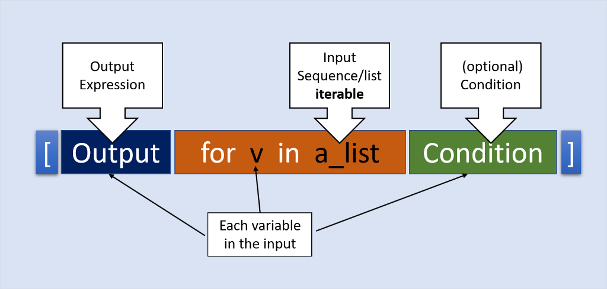
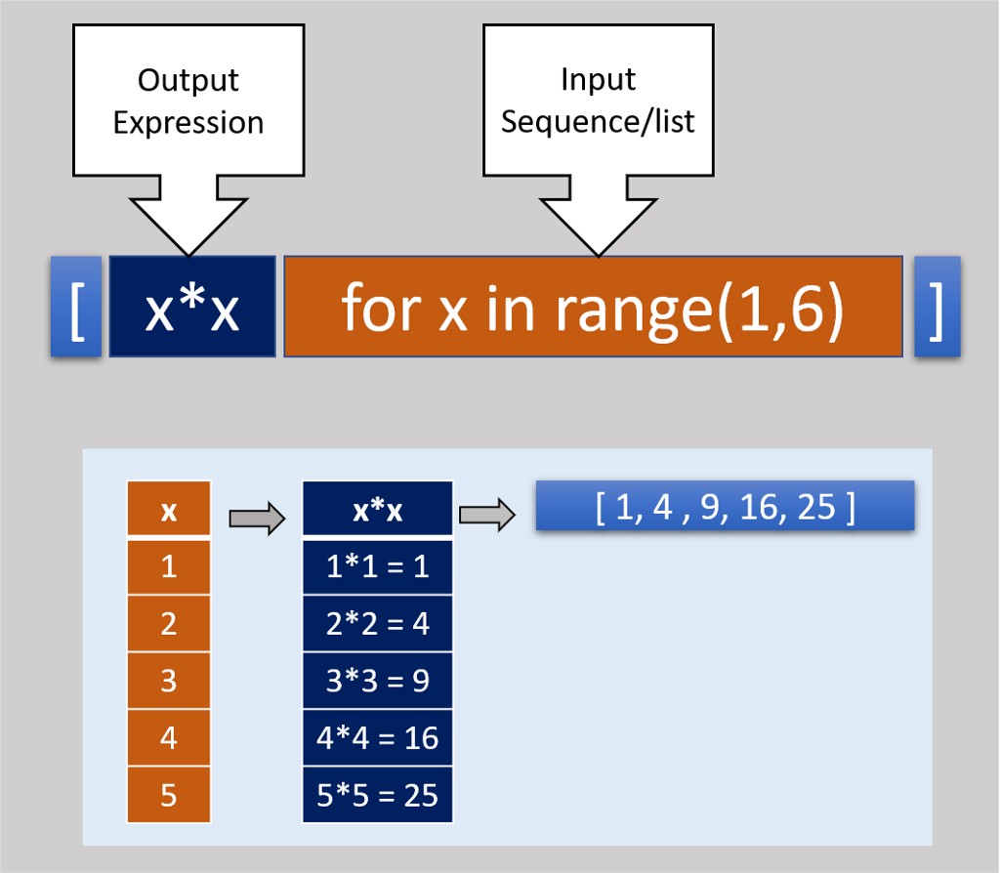
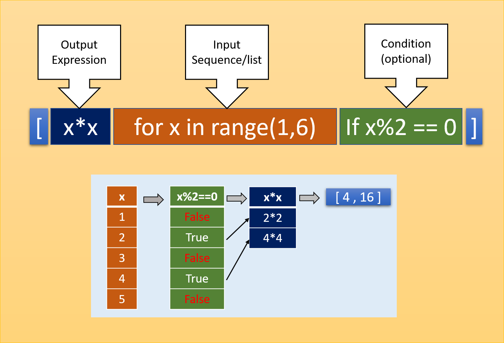

<!-- curso_practico_de_python__creacion_de_un_crud_clases -->

# CURSO DE PYTHON DE PLATZI

### PROGRAMA DE CURSO -PLATZI-VENTAS-

- :link: <a href="http://book.pythontips.com/en/latest/index.html" target="_blank">Python Tips - Intermediate Python — Python Tips 0.1 documentation</a>
- :link: <a href="https://docs.python.org/3/library/functions.html" target="_blank">Built-in Functions</a>
- :link: <a href="itertools — Functions creating iterators for efficient looping" target="_blank"><https://docs.python.org/3.10/library/itertools.html></a>

### Formatos & f-strings

Also, check out:

- :link: <a href="https://pyformat.info/" target="_blank">pyformat</a>
- :link: <a href="https://strftime.org/" target="_blank">strftime.org</a>

### String Formatting

Basic formatting:

`#`: Write a comment `# this is a comment`

`\n`: New Line

`\t`: Tab

`\\` or `//`: Allowed Slash

`\'`: Allowed Single Quote

`\"`: Allowed Double quote

`{{` or `}}`: Allowed single curly bracket in formatted strings

`"your single-line text"`: Wrap a single quote (`'`) or double quote (`"`) around text / numbers to make it a string.

`\`: A `slash` in front of a `return`/`enter` will escape that. Allowing for multi-line strings without the triple quotes. Such as:

```python
"this is my string example\
when I close it here"
```

`""" your multi-line text"""`: Wrap 3x single quotes (```) or 3x double quotes (`"`) around a lot of text to allow for multi-line strings. Such as:

```python
"""this is my string example
when I close it here"""
```

#### The `.format()` method

_Empty_

```python
"{} {}".format("Hello", "World")
```

_Positional_

```python
"{0} {1} {0}".format("Hello", "World")
```

_Keyword_

```python
"{first} {second} {first}".format(first="Hello", second="World")
```

_Positional & Keyword_

```python
"{0} {second} {0}".format("Hello", second="World")

"{0} {1} {2['hello']}".format("Hello", "World", {'hello': 'sup'})
```

_Unpacking a Dictionary_

```python
data = {'name': 'Hodor', 'email': 'holdthe@door.com'}
txt = 'Name: {name}\nEmail: {email}'.format(**data)
print(txt)
```

_Numbers, Floats & Decimals_

Number / Integer

```python
"{:d}".format(32)
```

or

```python
"{}".format(32)
```

Float / Decimal

```python
"{:f}".format(32)
```

```python
pi = 3.14159265359
"{:f}".format(pi)
```

Limit to `n` decimal places. Replace `4` below with the number of decimal places to round to.

```python
pi = 3.14159265359
"{:.4f}".format(pi)
```

#### The `%` method

_Positional - Strings or Numbers_

```python
"%s %s %s %s" % ("Hello", 12, 131.312, {'hello': 'sup'})
```

_Keyword / Dictionary_

```python
"%(first)s %(second)s" % {"first":"Hello", "second":"World"}
```

_Keywords_ (Also known as named placeholders)

```python
data = {'name': 'Hodor', 'email': 'holdthe@door.com'}
txt = 'Name: %(name)s\nEmail: %(email)s' % data
print(txt)
```

_Numbers, Floats & Decimals_

Number

```python
"%d" % (32)
```

or

```python
"%s" % (32)
```

Float

```python
"%f" % (32)
```

```python
pi = 3.14159265359
"%f" % (pi)
```

Limit to `n` decimal places. Replace `2` below with the number of decimal places to round to.

```python
pi = 3.14159265359
"%.2f" % (pi)
```

#### `f` Strings (aka `f-string`)

_Strings or Number variables_

```python
first = "Hello"
second = "World"
third = 32.3122
fourth = "{:.2f}".format(third)
f"{first} {second} {first.upper()} {third} {fourth}"
```

_Dictionary_

```python
data = {'name': 'Hodor', 'email': 'holdthe@door.com'}
txt = f'Name: {data["name"]}\nEmail: {data["email"]}'
print(txt)
```

_Inline Math_

```python
hours = 21
seconds = 32
f"{hours} {seconds * 10} {seconds}"
```

_Inline Formatting_

```python
pi = 3.14159265359
f"{format(pi, '.2f')}"
```

### Clases

22

##### Uso de listas

Python y todos los lenguajes nos ofrecen constructos mucho más poderoso, haciendo que el desarrollo de nuestro software sea:

- Más sofisticado
- Más legible
- Más fácil de implementar
- Estos constructos se llaman Estructuras de Datos que nos permiten agrupar de distintas manera varios valores y elementos para poderlos manipular con mayor facilidad.

Las listas las vas a utilizar durante toda tu carrera dentro de la programación e ingeniería de Software.

Las listas son una secuencia de valores. A diferencia de los strings, las listas pueden tener cualquier tipo de valor. También, a diferencia de los strings, son mutables, podemos agregar y eliminar elementos.

En Python, las listas son referenciales. Una lista no guarda en memoria los objetos, sólo guarda la referencia hacia donde viven los objetos en memoria

Se inician con `[]` o con la `built-in function list`.

Para copiar una lista a otra variable

```python
import copy

pais = ['Mexico', 'USA', 'Canada']
countries = None
countries = copy.copy(pais)

for country in countries:
    print(country)
```

23

#### Operadores con listas

Ahora que ya entiendes cómo funcionan las listas, podemos ver qué tipo de operaciones y métodos podemos utilizar para modificarlas, manipularlas y realizar diferentes tipos de cómputos con esta Estructura de Datos.

- El operador +(suma) concatena dos o más listas.
- El operador \*(multiplicación) repite los elementos de la misma lista tantas veces los queramos multiplicar

Sólo podemos utilizar +(suma) y \*(multiplicación).

Las listas tienen varios métodos que podemos utilizar.

- `append` nos permite añadir elementos a listas. Cambia el tamaño de la lista.
- `pop` nos permite sacar el último elemento de la lista. También recibe un índice y esto nos permite elegir qué elemento queremos eliminar.
- `sort` modifica la propia lista y ordenarla de mayor a menor. Existe otro método llamado `sorted`, que también ordena la lista, _pero genera una nueva instancia de la lista_.
- `del` nos permite eliminar elementos vía indices, funciona con slices
- `remove` nos permite es pasarle un valor para que Python compare internamente los valores y determina cuál de ellos hace match o son iguales para eliminarlos.

Ejemplos de **append** y como unir dos listas

```py
list1 = [1,2,3]
list2 = [4,5,6]
list1.append(list2)
list1
Out: [1, 2, 3, [4, 5, 6]]
```

```py
list1 = [1,2,3]
list2 = [4,5,6]
list1.extend(list2)
list1
Out: [1, 2, 3, 4, 5, 6]
```

```py
list1 = [1,2,3]
list2 = [4,5,6]
list1 += list2
list1
Out: [1, 2, 3, 4, 5, 6]
```

```py
list1 = [1,2,3]
list2 = [4,5,6]
list3 = [*list1, *list2]
list3
Out: [1, 2, 3, 4, 5, 6]
```

24

#### Diccionarios

Los diccionarios se conocen con diferentes nombres a lo largo de los lenguajes de programación como HashMaps, Mapas, Objetos, etc. En Python se conocen como Diccionarios.

Un diccionario es similar a una lista sabiendo que podemos acceder a través de un indice, pero en el caso de las listas este índice debe ser un número entero. Con los diccionarios puede ser cualquier objeto, normalmente los verán con strings para ser más explicitos, pero funcionan con muchos tipos de llaves…

Un diccionario es una asociación entre llaves(keys) y valores(values) y la referencia en Python es muy precisa. Si abres un diccionario verás muchas palabras y cada palabra tiene su definición.

Para iniciar un diccionario se usa `{}`` o con la función`dict`

Estos también tienen varios métodos. Siempre puedes usar la función dir para saber todos los métodos que puedes usar con un objeto.

Si queremos ciclar a lo largo de un diccionario tenemos las opciones:

- `keys`: nos imprime una lista de las llaves
- `values` nos imprime una lista de los valores
- `items`. nos manda una lista de tuplas de los valores

26

#### Tuplas y conjuntos

Tuplas(tuples) son iguales a las listas, la única diferencia es que son _inmutables_, la diferencia con los strings es que pueden recibir muchos tipos valores. Son una serie de valores separados por comas, casi siempre se le agregan paréntesis para que sea mucho más legible.

Para poderla inicializar utilizamos la función tuple.

Uno de sus usos muy comunes es que cuando queremos regresar más de un valor en nuestra función.

```py
return (students, teachers)
```

Una de las características de las Estructuras de Datos es que cada una de ellas nos sirve para algo especifico. No existe en programación una navaja suiza que nos sirva para todos. los mejores programas son aquellos que utilizan la herramienta correcta para el trabajo correcto.

Conjutos(_sets_) nacen de la teoría de conjuntos. Son una de las Estructuras más importantes y se parecen a las listas, podemos añadir varios elementos al conjuntos, _pero no pueden existir elementos duplicados_. _A diferencia de los_tuples_podemos agregar y eliminar, son mutables_.

Los sets se pueden inicializar con la función `set`. Una recomendación es inicializarlos con esta función para no causar confusión con los diccionarios.

- `add` nos sirve añadir elementos.
- `remove` nos permite eliminar elementos.

27

### Módulo Collections

- :link: [collections — Container datatypes](https://docs.python.org/3/library/collections.html)

El módulo collections nos brinda un conjunto de objetos primitivos que nos permiten extender el comportamiento de las built-in collections que poseé Python y nos otorga estructuras de datos adicionales. Por ejemplo, si queremos extender el comportamiento de un diccionario, podemos extender la clase UserDict; para el caso de una lista, extendemos UserList; y para el caso de strings, utilizamos UserString.

1. `namedtuple()` factory function for creating tuple subclasses with named fields
2. `deque` list-like container with fast appends and pops on either end
3. `ChainMap` dict-like class for creating a single view of multiple mappings
4. `Counter` dict subclass for counting hashable objects
5. `OrderedDict` dict subclass that remembers the order entries were added
6. `defaultdict` dict subclass that calls a factory function to supply missing values
7. `UserDict` wrapper around dictionary objects for easier dict subclassing
8. `UserList` wrapper around list objects for easier list subclassing
9. `UserString` wrapper around string objects for easier string subclassing

##### Counter

```python
from collections import Counter
```

```python
list = [1,2,3,4,1,2,6,7,3,8,1]
Counter(list)
Counter({1: 3, 2: 2, 3: 2, 4: 1, 6: 1, 7: 1, 8: 1})
```

```python
list = [1,2,3,4,1,2,6,7,3,8,1]
cnt = Counter(list)
print(cnt[1])
# Output:
3
```

Counter tiene tres funciones adicionales.

1. Elements
2. Most_common([n])
3. Subtract([interable-or-mapping])

_elements()_

```python
cnt = Counter({1:3,2:4})
print(list(cnt.elements()))
# Output:
[1, 1, 1, 2, 2, 2, 2]
```

_most_common()_

```python
list = [1,2,3,4,1,2,6,7,3,8,1]
cnt = Counter(list)
print(cnt.most_common())
# Output:
[(1, 3), (2, 2), (3, 2), (4, 1), (6, 1), (7, 1), (8, 1)]
```

_subtract_

```python
cnt = Counter({1:3,2:4})
deduct = {1:1, 2:2}
cnt.subtract(deduct)
print(cnt)
# Output:
Counter({1: 2, 2: 2})
```

##### defaultdict

Crear diccionarios con el constructor `defaultdict()`

```python
from collections import defaultdict
```

```python
nums = defaultdict(int)
nums['one'] = 1
# -
print(nums)
# Output:
defaultdict(<class 'int'>, {'one': 1, 'two': 2})
# -
print(nums['two'])
# Output:
2
```

```python
count = defaultdict(int)
names_list = "Mike John Mike Anna Mike John John Mike Mike Britney Smith Anna Smith".split()
for names in names_list:
    count[names] +=1
print(count)
# Output:
defaultdict(<class 'int'>, {'Mike': 5, 'Britney': 1, 'John': 3, 'Smith': 2, 'Anna': 2})
```

##### OrderedDict

Ordenar diccionario(s)

```python
from collections import OrderedDict
```

```python
od = OrderedDict()
od['a'] = 1
od['b'] = 2
od['c'] = 3
print(od)
# Output:
OrderedDict([('a', 1), ('b', 2), ('c', 3)])
```

```python
for key, value in od.items():
    print(key, value)
# Output
a 1
b 2
c 3
```

##### deque

```python
from collections import deque
```

```python
list = ["a","b","c"]
deq = deque(list)
print(deq)
# Output
deque(['a', 'b', 'c'])
```

```python
deq.append("d")
deq.appendleft("e")
print(deq)deque
# Output
deque(['e', 'a', 'b', 'c', 'd'])
```

```python
deq.pop()
deq.popleft()
print(deq)
# Output
deque(['a', 'b', 'c'])
```

```python
list = ["a","b","c"]
deq = deque(list)
print(deq)
print(deq.clear())
# Output
deque(['a', 'b', 'c'])
None
```

```python
list = ["a","b","c"]
deq = deque(list)
print(deq.count("a"))
# Output
1
```

##### ChainMap

```python
from collections import ChainMap
```

```python
dict1 = { 'a' : 1, 'b' : 2 }
dict2 = { 'c' : 3, 'b' : 4 }
chain_map = ChainMap(dict1, dict2)
print(chain_map.maps)
# Output
[{'b': 2, 'a': 1}, {'c': 3, 'b': 4}]
```

```python
dict2['c'] = 5
print(chain_map.maps)
# Output
[{'a': 1, 'b': 2}, {'c': 5, 'b': 4}]
```

```python
dict1 = { 'a' : 1, 'b' : 2 }
dict2 = { 'c' : 3, 'b' : 4 }
chain_map = ChainMap(dict1, dict2)
print (list(chain_map.keys()))
print (list(chain_map.values()))
# Output
['b', 'a', 'c']
[2, 1, 3]
```

```python
dict3 = {'e' : 5, 'f' : 6}
new_chain_map = chain_map.new_child(dict3)
print(new_chain_map)
# Output
ChainMap({'f': 6, 'e': 5}, {'a': 1, 'b': 2}, {'b': 4, 'c': 3})
```

##### `namedtuple()`

Con `namedtuple()` es posible generar clases, los atributos del objeto son de lectura.

```python
from collections import namedtuple

Student = namedtuple('Student', 'fname, lname, age')
s1 = Student('John', 'Clarke', '13')
print(s1)
print(s1.fname)
```

```python
# Output
Jhon
Student(fname='John', lname='Clarke', age='13')
```

```py
from collections import namedtuple

Setting = namedtuple("Setting", ['port', 'name', 'alias'])
setting = Setting(3000, 'Rails', 'RoR')
print(setting)
# Output
Setting(port=3000, name='Rails', alias='RoR')
```

Valores por default con `namedtuple()`, en Python los valores por default se asignan de izquierda a derecha.

```py
from collections import namedtuple

Setting = namedtuple("Setting", ['port', 'name', 'alias'], defaults=('No Name', 'No Alias'))
```

Se asigna al parámetro `port` un valor.

```py
setting = Setting(port=3000)
print(setting.port)
# Output
3000
print(setting.name)
# Output
'No Name'
print(setting.alias)
# Output
'No Name'
```

Clase `Setting` definida.

```py
print(setting)
# Output
Setting(port=3000, name='No Name', alias='No Alias')
```

Creando `namedtuple` usando una lista.

```python
s2 = Student._make(['Adam','joe','18'])
print(s2)
# Output
Student(fname='Adam', lname='joe', age='18')
```

**Métodos y atributos del objeto**  
Por ejemplo, si queremos conocer todos los _atributos_ que posee un objeto

```py
from collections import namedtuple

Setting = namedtuple("Setting", ['port', 'name', 'alias'], defaults=('No Name', 'No Alias'))

Setting._fields
# Output
('port', 'name', 'alias')

Retornar una tupla de strings con cada uno de los atributos que posee dicho objeto.
```

Si lo que deseamos es convertir nuestro objecto a un diccionario, y después se puede serializar como un objeto JSON.

```py
from collections import namedtuple

Doctor = namedtuple("Medico", ['Nombre', 'Especialidad', 'Telefono'])
doctor = Doctor("Nombre Doc", "Corazon", 4359876432)
# --
Doctor._fields
('Nombre', 'Especialidad', 'Telefono')
# --
doctor.Nombre
'Nombre Doc'

doctor.Especialidad
'Corazon'

doctor.Telefono
4359876432
# --
doctor._asdict()
{'Nombre': 'Nombre Doc', 'Especialidad': 'Corazon', 'Telefono': 4359876432}
# --

```

Con el método `_replace()` se crea una nueva instancia a partir del objeto original con la posibilidad de modificar algunos de sus atributos.

```py
doctor_1 = doctor._replace(Especialidad="Pulmones")
print(doctor_1)
# Output
Medico(Nombre='Nombre Doc', Especialidad='Pulmones', Telefono=4359876432)
# -- 
doctor_1._asdict()
# Output
{'Nombre': 'Nombre Doc', 'Especialidad': 'Pulmones', 'Telefono': 4359876432}
```

Creando una nueva instancia usando una instancia existente

```python
s2 = s1._asdict()
print(s2)
# Output
OrderedDict([('fname', 'John'), ('lname', 'Clarke'), ('age', '13')])
```

Cambiando valores con la funcion \_replace()

```python
s2 = s1._replace(age='14')
print(s1)
print(s2)
# Output
Student(fname='John', lname='Clarke', age='13')
Student(fname='John', lname='Clarke', age='14')
```

29

### List comprenhensions

- :link: :snake: [Data Structures](https://docs.python.org/3/tutorial/datastructures.html)







List
[_element_ `for` _element_ `in` element_list `if` _element_meets_conditions_]

```python
[element for element in element_list if element_meets_conditions]

[element for element in range(20) if element % 3 == 0]
# Output:
[0, 3, 6, 9, 12, 15, 18]
```

Dictionary
{_key: element_ `for` _element_ `in` element*list `if` \_element_meets_conditions*}

```python
{key: element for element in element_list if element_meets_conditions}

names = ['name_one', 'name_two', 'name_three']
numbers = [1, 2, 3]
{uid: names for uid, names in zip(numbers, names)}
# Output:
{1: 'name_one', 2: 'name_two', 3: 'name_three'}
```

Set
{_element_ `for` _element_ `in` element*list `if` \_element_meets_conditions*}

```python
{element for element in element_list if element_meets_conditions}

{x for x in 'abracadabra' if x not in 'abc'}
# Output:
{'d', 'r'}
```

38

### Click

- [Click](https://click.palletsprojects.com/en/7.x/)

_Click_ es un pequeño framework que nos permite crear aplicaciones de Línea de comandos. Tiene cuatro decoradores básicos:

`@click_group`: Agrupa una serie de comandos
`@click_command`: Aca definiremos todos los comandos de nuestra apliacion
`@click_argument`: Son parámetros necesarios
`@click_option`: Son parámetros opcionales
Click también realiza las conversiones de tipo por nosotros. Esta basado muy fuerte en decoradores.

45

### Manejo de errores y jerarquía de errores en Python

- [Built-in Exceptions - 3.9.5](https://docs.python.org/3/library/exceptions.html#exception-hierarchy)
- [https://realpython.com/python-exceptions/](https://realpython.com/python-exceptions/)
- [Errores y excepciones](http://docs.python.org.ar/tutorial/2/errors.html)

Python tiene una jerarquía rica de errores que nos da posibilidades para definir errores por si no se puede leer un archivo, dividir entre cero, si existen problemas en general en nuestro código Python tirará un error. El problema con esto es que nuestro programa termina, es diferente a los errores de sintaxis donde nuestro programa nunca inicia.

Para _aventar_ un error en Python utilizamos la palabra raise. Aunque Python nos ofrece muchos errores es _buena práctica_ definir errores específicos de nuestra aplicación y usar los de Python para extenderlos.

Podemos generar nuestros propios errores creando una clase que extienda de `BaseException`.

Si queremos _evitar_ que termine nuestro programa cuando ocurra un error, debemos tener un estrategia. Debemos utilizar `try / except` cuando tenemos la posibilidad de que un pedazo de nuestro código falle

1. `try`: significa ejecuta este código y si podemos solo colocamos una sola línea de código ahí como buena práctica
2. `except`: es nuestro manejo del error, es lo que haremos si ocurre el error. Debemos ser específicos con el tipo de error que vamos a atrapar.
3. `else`: Es código que se ejecuta cuando no ocurre ningún error.
4. `finally`: Nos permite obtener un bloque de código que se va a ejecutar no importa lo que pase.

##### 3.9.5

```
BaseException
 +-- SystemExit
 +-- KeyboardInterrupt
 +-- GeneratorExit
 +-- Exception
      +-- StopIteration
      +-- StopAsyncIteration
      +-- ArithmeticError
      |    +-- FloatingPointError
      |    +-- OverflowError
      |    +-- ZeroDivisionError
      +-- AssertionError
      +-- AttributeError
      +-- BufferError
      +-- EOFError
      +-- ImportError
      |    +-- ModuleNotFoundError
      +-- LookupError
      |    +-- IndexError
      |    +-- KeyError
      +-- MemoryError
      +-- NameError
      |    +-- UnboundLocalError
      +-- OSError
      |    +-- BlockingIOError
      |    +-- ChildProcessError
      |    +-- ConnectionError
      |    |    +-- BrokenPipeError
      |    |    +-- ConnectionAbortedError
      |    |    +-- ConnectionRefusedError
      |    |    +-- ConnectionResetError
      |    +-- FileExistsError
      |    +-- FileNotFoundError
      |    +-- InterruptedError
      |    +-- IsADirectoryError
      |    +-- NotADirectoryError
      |    +-- PermissionError
      |    +-- ProcessLookupError
      |    +-- TimeoutError
      +-- ReferenceError
      +-- RuntimeError
      |    +-- NotImplementedError
      |    +-- RecursionError
      +-- SyntaxError
      |    +-- IndentationError
      |         +-- TabError
      +-- SystemError
      +-- TypeError
      +-- ValueError
      |    +-- UnicodeError
      |         +-- UnicodeDecodeError
      |         +-- UnicodeEncodeError
      |         +-- UnicodeTranslateError
      +-- Warning
           +-- DeprecationWarning
           +-- PendingDeprecationWarning
           +-- RuntimeWarning
           +-- SyntaxWarning
           +-- UserWarning
           +-- FutureWarning
           +-- ImportWarning
           +-- UnicodeWarning
           +-- BytesWarning
           +-- ResourceWarning
```

### 45

### Context managers

Los **context managers** son objetos de Python que proveen información contextual adicional al bloque de código. Esta información consiste en correr una función (o cualquier callable) cuando se inicia el contexto con el keyword with; al igual que correr otra función cuando el código dentro del bloque with concluye. Por ejemplo:

```python
with open(‘some_file.txt’) as f:
    lines = f.readlines()
```

Si estás familiarizado con este patrón, sabes que llamar la función `open` de esta manera, garantiza que el archivo se cierre con posterioridad. Esto disminuye la cantidad de información que el programador debe manejar directamente y facilita la lectura del código.

Existen dos formas de implementar un `context manager`: con una _clase_ o con un _generador_. Vamos a implementar la funcionalidad anterior para ilustrar el punto:

```python
class CustomOpen(object):
    def __init__(self, filename):
        self.file = open(filename)

    def __enter__(self):
        return self.file

    def __exit__(self, ctx_type, ctx_value, ctx_traceback):
        self.file.close()

with CustomOpen('file') as f:
    contents = f.read()
```

Esta es simplemente una clase de Python con dos métodos adicionales: enter y exit. Estos métodos son utilizados por el keyword with para determinar las acciones de inicialización, entrada y salida del contexto.

El mismo código puede implementarse utilizando el módulo `contextlib` que forma parte de la librería estándar de Python.

```python
from contextlib import contextmanager

@contextmanager
def custom_open(filename):
    f = open(filename)
    try:
        yield f
    finally:
        f.close()

with custom_open('file') as f:
    contents = f.read()
```

El código anterior funciona exactamente igual que cuando lo escribimos con una clase. La diferencia es que el código se ejecuta al inicializarse el contexto y retorna el control cuando el keyword `yield` regresa un valor. Una vez que termina el bloque `with`, el context manager toma de nueva cuenta el control y ejecuta el código de limpieza.

### yield

- [What does the “yield” keyword do?](https://stackoverflow.com/questions/231767/what-does-the-yield-keyword-do#231855)

```python
>>> def f():
...   yield 1
...   yield 2
...   yield 3
...
>>> g = f()
>>> for i in g:
...   print i
...
1
2
3
>>> for i in g:
...   print i
...
>>> # Note that this time nothing was printed
```

_Iterables_

When you create a list, you can read its items one by one. Reading its items one by one is called iteration:

```python
>>> mylist = [1, 2, 3]
>>> for i in mylist:
...    print(i)
1
2
3
```

`mylist` is an iterable. When you use a list comprehension, you create a list, and so an iterable:

```python
>>> mylist = [x*x for x in range(3)]
>>> for i in mylist:
...    print(i)
0
1
4
```

Everything you can use `for... in...` on is an iterable; `lists`, `strings`, files...

These iterables are handy because you can read them as much as you wish, but you store all the values in memory and this is not always what you want when you have a lot of values.

_Generators_
Generators are iterators, a kind of iterable _you can only iterate over once_. Generators do not store all the values in memory, _they generate the values on the fly_:

```python
>>> mygenerator = (x*x for x in range(3))
>>> for i in mygenerator:
...    print(i)
0
1
4
```

It is just the same except you used `()` instead of `[]`. BUT, you _cannot_ perform `for i in mygenerator` a second time since generators can only be used once: they calculate 0, then forget about it and calculate 1, and end calculating 4, one by one.

_Yield_
`yield` _is a keyword that is used like_ `return`, except the function will return a generator.

```python
>>> def createGenerator():
...    mylist = range(3)
...    for i in mylist:
...        yield i*i
...
>>> mygenerator = createGenerator() # create a generator
>>> print(mygenerator) # mygenerator is an object!
<generator object createGenerator at 0xb7555c34>
>>> for i in mygenerator:
...     print(i)
0
1
4
```

Here it's a useless example, but it's handy when you know your function will return a huge set of values that you will only need to read once.

To master yield, you must understand that _when you call the function, the code you have written in the function body does not run._ The function only returns the generator object, this is a bit tricky :-)

Then, your code will continue from where it left off each time `for` uses the generator.

Now the hard part:

The first time the for calls the generator object created from your function, it will run the code in your function from the beginning until it hits yield, then it'll return the first value of the loop. Then, each other call will run the loop you have written in the function one more time, and return the next value until there is no value to return.

The generator is considered empty once the function runs, but does not hit `yield` anymore. It can be because the loop had come to an end, or because you do not satisfy an "`if/else`" anymore.

### 47

Aplicaciones de Python en el mundo real

Python tiene muchas aplicaciones:

En las _ciencias_ tiene muchas librerías que puedes utilizar como analisis de las estrellas y astrofisica; si te interesa la medicina puedes utilizar _Tomopy_ para analizar tomografías. También están las librerías más fuertes para la ciencia de datos _numpy_, _Pandas_ y _Matplotlib_

En _CLI_ por si te gusta trabajar en la nube y con datacenters, para sincronizar miles de computadoras:

- aws
- gocloud
- rebound
- geeknote

Aplicaciones Web:

- Django
- Flask
- Bottle
- Chalice
- Webapp2
- Gunicorn
- Tornado

### 48

Python 2 vs 3
No es recomendable empezar con Python 2 porque tiene fecha de vencimiento para el próximo año.

_PEP_ = Python Enhancement Proposals

Los PEP son la forma en la que se define como avanza el lenguaje. Existen tres PEPs que debes saber.

- _PEP8_ es la guía de estilo de cómo escribir programas de Python.Es importante escribir de manera similiar para que nuestro software sea legible para el resto de la comunidad
- _PEP257_ nos explica cómo generar buena documentación en nuestro código
- _PEP20_

```python
In [1]: import this
The Zen of Python, by Tim Peters

Beautiful is better than ugly.
Explicit is better than implicit.
Simple is better than complex.
Complex is better than complicated.
Flat is better than nested.
Sparse is better than dense.
Readability counts.
Special cases aren't special enough to break the rules.
Although practicality beats purity.
Errors should never pass silently.
Unless explicitly silenced.
In the face of ambiguity, refuse the temptation to guess.
There should be one-- and preferably only one --obvious way to do it.
Although that way may not be obvious at first unless you're Dutch.
Now is better than never.
Although never is often better than *right* now.
If the implementation is hard to explain, it's a bad idea.
If the implementation is easy to explain, it may be a good idea.
Namespaces are one honking great idea -- let's do more of those!
```

### Guion bajo en Python

De esta manera no se crea una variable que no se ocupa, haciendo el código más eficiente.

```py
for _ in range(0, 10):
    print('Hola')
```

Desempaquetar tuplas

```py
first, second, *_, last = (1, 2, 3, 4, 5, 6, 7, 8, 9, 10)
print(first)
1
print(second)
2
```

Como **placeholder**, cuando se esta trabajando con el shell de python.

```py
10 + 20
>>> 30
_ + 1
>>> 31
```

**Namespace**, se evitan conflictos con el interprete y el namespace podemos hacer uso el sufijo guion bajo (`_`) y se evita el uso de palabras reservadas.

```py
type_ = 'String'
class_ = 'User'
```

Representación de números grandes, para que tengan una mejor legibilidad.

```py
>>> 1000000000000
```

```py
>>> 1_000_000_000_000
```

Para saber las palabras reservadas en python se puede hacer lo siguiente.

```py
from keyword import kwlist
print(kwlist)

[
'False', 'None', 'True', '__peg_parser__', 'and', 'as', 'assert', 'async', 'await', 'break', 
'class', 'continue', 'def', 'del', 'elif', 'else', 'except', 'finally', 'for', 'from', 'global',
 'if', 'import', 'in', 'is', 'lambda', 'nonlocal', 'not', 'or', 'pass', 'raise', 'return', 'try',
 'while', 'with', 'yield'
]
```

**Atributos privados**  
**Atributos privados** con doble guion bajo `__`.
En la clase `User` se declara el atributo `password` pero con doble guion bajo, para que se trate como privado.

Python implementa el mecanismo **name mangling** para poder simular crear atributos privados.

```py
class User:
    def __init__(self):
        self.__password = ''
```

Por lo tanto, si se intenta acceder a dicho atributo obtendremos un error.

```py
>>> user = User()
>>> user.password
Traceback (most recent call last):
  File "<stdin>", line 1, in <module>
AttributeError: 'User' object has no attribute 'password'
```

Otro ejemplo.

```py
class User:

    def __init__(self, username):
        self.__username = username


    def __private_method(self):
        print('Este es un método privado')
```

👇

```py
user = User("mack")
user.__username
# --
AttributeError                            Traceback (most recent call last)
Cell In [3], line 1
----> 1 user.__username

AttributeError: 'User' object has no attribute '__username'

In [4]: user.__private_method
```

👆 Se indica que el atributo/metodo no se encuentra definido.

Pero si se utiliza un atributo y metodos privados en un método publico **dentro de la clase** no presenta errores. Y es un tipo de encapsulamiento.

```py
class User:

    def __init__(self, username):
        self.__username = username


    def __private_method(self):
        print('Este es un método privado')


    def public_method(self):
        print(self.__username)
        self.__private_method()
```

👇

```py
user = User("mack")
user.public_method()
# --
mack
Este es un método privado
```

El interprete de 🐍 cambia el nombre de los **atributos del objeto** que tienen doble guión bajo (`__`) como prefijo

```py
user = User("mack")
# --
user.__dict__
{'_User__username': 'mack'}
```

Internamente es almancenado con la estructura `_<Clase>__<Atributo>`  
Y se puede acceder a los atributos y metodos de esta forma.

```py
user._User__username
'mack'
# --
user._User__private_method()
Este es un método privado
```

Se puede modificar los atributos privados de un objeto

```py
user._User__username = "OTRO NOMBRE"
# --
user._User__username
'OTRO NOMBRE'
```

### Función `sum`

No es tan eficiente y se puede hacer mejor :point_down:

```py
total = 0
for element in range(0, 1_000_000):
    total += element

print(total)
```

Es mejor con la función `sum`

```py
total = sum(range(0, 1_000_000))
print(total)
```

```py
```

```py
```

```py
```

```py
```

```py
```
