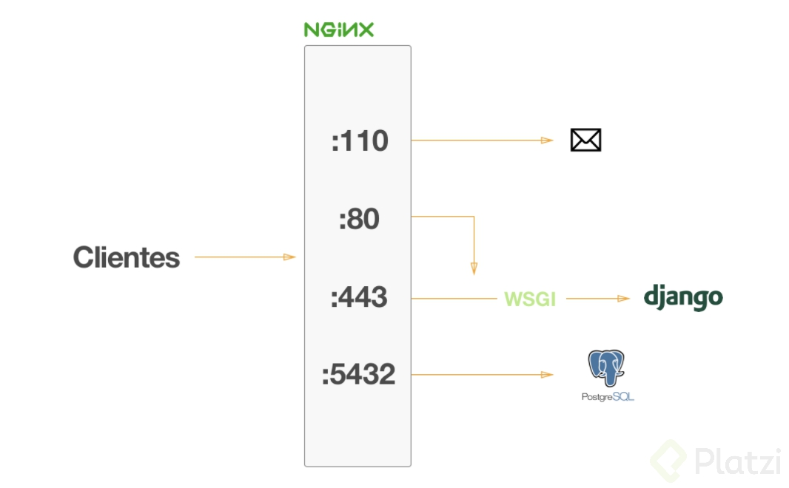
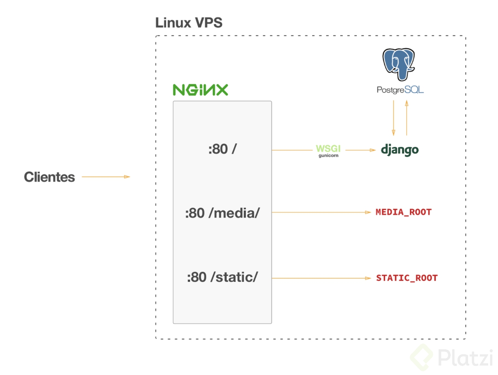
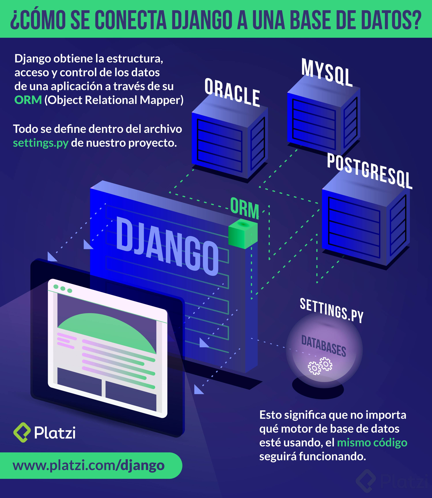

:octocat:[Link en repo del proyecto](https://github.com/macknilan/platzigram-1)

### 2 Historia de web development

Al inicio de la web todos los sitios eran construidos en texto plano. Conforme las necesidades hay ido cambiando la web tambien lo ha hecho.

Django nace en 2004 para crear y mantener sitios muy grandes. Generar un ORM, es decir que e permite conectarte a la base de datos a traves del framework. Django se toma la seguridad de las aplicaciones con mucha seriedad. Django es un framework muy escalable. Django es muy versatil, ha sido usado para todo tipo de proyectos, desde redes sociales hasta proyectos cientificos.

Django es open source.

Al inicio de la web todo era texto plano *(HTML)*, al transcurrir del tiempo se necesitaban cosas más complejas como conexión a BD’s y de ahi nace *CGIscript*
Nace con el objetivo de que a través de un `request`, se ejecute un script dentro del servidor, pero esto fue generando problemas con la escabilidad.y por ende difícil de mantener, de esta necesidad nace PHP.
Luego nacen los *frameworks* para poder resolver tareas comunes, como:

- Protocolos HTTP.
- Conexiones a bases de datos.
- Interacciones con el HTML(templates).

- Django
    + Nace en 2003, con la necesidad de hacer web’s con la filosofía de hacer las cosas de manera agíl.
    + Poder hacer sitios escalables.
    + URLs bien diseñadas.
    + HTTP request y responses.
    + ORM, que es conectar a na DB a traves de una interfaz python.

- Características.
    + Rápido desarrollo.
    + Listo para todo.
    + Seguro contra ataques.
    + Versátil.
    + Ventajas

Es desarrollado en Python.
- DRY(Don’t repeat yourself).
- Comunidad Open Source.

### 3 Crear un ambiente virtual

Los entornos virtuales nos permiten isolar multiples dependencias para el desarrollo de proyecto, puede pasar por ejemplo cuando trabajas con diferentes versiones de python o de django.

*Python 3* trae la creación y manejo de entornos virtuales como parte del modulo central.

`python3 -m venv .env`

Se recomienda crear una carpeta en donde se encuentren todos los entornos virtuales de Python3 __(oculta)__
```bash
$ mkdir .[CARPETA-OCULTA]
```
```bash
# DENTRO DE LA CARPETA OCULTA
python3 -m venv [NOMBRE-DEL-ENTORNO-VIRTUAL]
```
Para activar el entorno virtual
```bash
$ source .[CARPETA-OCULTA]/[NOMBRE-DEL-ENTORNO-VIRTUAL]/bin/activate
```
Para desactivar el entorno virtual
```bash
([NOMBRE-DEL-ENTORNO-VIRTUAL])$ deactivate
```

- :link: [Using Different Versions of Python - pyenv](https://github.com/pyenv/pyenv)

- :link: [venv — Creation of virtual environments](https://docs.python.org/3/library/venv.html)
```bash
$ python -m venv -h
```

usage: venv [-h] [--system-site-packages] [--symlinks | --copies] [--clear]
            [--upgrade] [--without-pip]
            ENV_DIR [ENV_DIR ...]

Creates virtual Python environments in one or more target directories.

positional arguments:
  ENV_DIR               A directory to create the environment in.

optional arguments:
  -h, --help            show this help message and exit
  --system-site-packages
                        Give the virtual environment access to the system
                        site-packages dir.
  --symlinks            Try to use symlinks rather than copies, when symlinks
                        are not the default for the platform.
  --copies              Try to use copies rather than symlinks, even when
                        symlinks are the default for the platform.
  --clear               Delete the contents of the environment directory if it
                        already exists, before environment creation.
  --upgrade             Upgrade the environment directory to use this version
                        of Python, assuming Python has been upgraded in-place.
  --without-pip         Skips installing or upgrading pip in the virtual
                        environment (pip is bootstrapped by default)

Once an environment has been created, you may wish to activate it, e.g. by
sourcing an activate script in its bin directory.


### 13 Glosario

- *ORM*: Object-relational mapping. Es el encargado de permitir el acceso y control de una base de datos relacional a 
través de una abstracción a clases y objetos.
- *Templates*: Archivos HTML que permiten la inclusión y ejecución de lógica especial para la presentación de datos.
- *Modelo*: Parte de un proyecto de Django que se encarga de estructurar las tablas y propiedades de la base de datos 
a ravés de clases de Python.
- *Vista*: Parte de un proyecto de Django que se encarga de la lógica de negocio y es la conexión entre el template y 
el modelo.
- *App*: Conjunto de código que se encarga de resolver una parte muy específica del proyecto, contiene sus modelos, 
vistas, urls, etc.
- *Patrón* de diseño: Solución común a un problema particular.

### 32 Arquirectura / Conceptos / Componentes

Liberar un proyecto de Django a producción es una tarea bastante sencilla pero que puede confundir a muchos la primera vez que se intente (a mi me sucedió). El objetivo de esta lectura es tener una breve a introducción a la arquitectura de un proyecto de Django corriendo en un servidor de producción (un servidor de verdad) y que consecuentemente los siguientes tutoriales de configuración tengan más sentido al momento de que los leas.

Al principio del curso hablamos de un archivo llamado `wsgi.py` ubicado dentro del folder de las configuraciones del proyecto, conviviendo junto con el archivo `urls.py` y `settings.py`. *WSGI* significa *Web Server Gateway Interface* y es un protocolo sencillo de llamadas para que un web server (como NGINX o Apache) se comuniquen con una aplicación web o framework escritos en Python.

`WSGI` nos permite delegar el trabajo de aplicar reglas complejas de enrutamiento a un web server como NGINX y al mismo tiempo lograr que exista una comunicación del usuario final de nuestro proyecto de Python. Dicho esto, esta sería la ilustración de un servidor que expone múltiples servicios como *e-mail* a través de *pop3*, un app server usando `SSL`, otro app server redirigiendo las peticiones HTTP a HTTPS y una base de datos de PostgreSQL:



Para el caso particular del proyecto del curso, nosotros usaremos un servidor Linux corriendo Ubuntu 16.04 en el cual configuraremos una base de datos de PostgreSQL, un web server NGINX y correremos nuestro proyecto de Django usando Gunicorn. Los archivos estáticos y subidos por los usuarios serán también servidos usando NGINX ya que no es trabajo de Django realizar estas tareas. La base de datos no tiene que estar disponible para el público por lo que no hay necesidad de que NGINX la exponga.



### 33 ¿Cómo conectar Django a una base de datos?

Django obtiene la estructura, acceso y control de los datos de una aplicación a través de su *ORM* *(Object Relational Mapper)*, esto significa que no importa qué motor de base de datos esté usando, el mismo código seguirá funcionando, configurar esto en un proyecto de Django es cuestión de segundos.

Todo se define dentro del archivo settings.py de nuestro proyecto dentro de la variable `DATABASES`:

*DATABASE*

Será el nodo padre que nos servirá para indicar que definiremos una base de datos.
Dentro, tendremos el nodo default este tendrá toda la configuración clave de la base de datos.
Además, Django puede trabajar con múltiples bases de datos usando una estrategia llamada *routers* por lo que el diccionario `DATABASES` puede contener múltiples llaves con diferentes bases de datos. Pero eso sí, necesita siempre existir una llave *“default”*.

Es un diccionario de python el cual requiere definir una base de datos por *default*, más de eso al final, usando la llave *default* que a su vez será otro diccionario con los datos de configuración:

La configuración recibirá el engine el cual puede ser:
- PostgreSQL: `'django.db.backends.postgresql’`
- MySQL: `'django.db.backends.mysql’`
- SQLite: `'django.db.backends.sqlite3’`
- Oracle: `'Django.db.backends.oracle’`
- El nombre de la base de datos `NAME`
- El usuario `USER`
- La contraseña `PASSWORD`
- La ubicación o host del servidor de la base de datos `HOST`
- Y el puerto de conexión `PORT`

Adicionalmente, se pueden configurar más detalles por base de datos, por ejemplo, configurar que todos los *queries* de una vista sean empaquetados en una sola transacción a la base de datos usando `ATOMIC_REQUESTS=True`

:link: [Multiple databases](https://docs.djangoproject.com/en/2.1/topics/db/multi-db/)



### 34 Configurar el servidor

info en repo privado...

### 35 Preparación del VPS (en AWS)

Para la demostración de la clase se usa una máquina `t2.nanoque` *Amazon Web Services* provee con Ubuntu Server. Toda la configuración del proyecto vive en el mismo servidor. Es decir, tanto la base de datos como los archivos estáticos y el código fuente son manejados por una sola máquina. Es importante mencionar que en casos donde nuestro proyecto es más grande y requiere de una mejor arquitectura, *es recomendable separar cada uno* de estos de manera que la base de datos tenga su propio servidor, que exista un balanceo de carga hacia las instancias que manejan el código y que la media y los estáticos sean servidos desde una *CDN*. El caso de instalación que veremos en este post es un método que se puede usar en cualquier servidor Linux con Ubuntu Server; por lo que no es una configuración que únicamente se pueda llevar a cabo usando *AWS*. Cualquier proveedor que te dé acceso a una máquina Linux es útil.

##### Crear el servidor
1. Accede a la sección de Amazon *EC2*
2. Da clic en el botón *Launch Instance*
3. Selecciona `Ubuntu 16.04` como el Sistema Operativo deseado
4. Elige el tipo de instancia que más se adecúe a tus necesidades (`t2.micro` es parte de la capa gratuita)
5. En el paso 3, deja todas las configuraciones tal y como están
6. Selecciona la cantidad de GB de almacenamiento que quieras tener en tu instancia
7. Asigna un nombre descriptivo a la instancia
8. Crea un nuevo grupo de seguridad con el puerto `22`, `80` abiertos desde cualquier IP por el protocolo `TCP`
9. Selecciona `Launch`
10. Crea nuevas llaves `SSH` y descargarlas al ordenado

##### Conectarse al servidor

Para conectarnos al servidor usaremos la llave que acabamos de descargar. Es muy importante nunca perder esta llave ya que si la perdemos no tendremos otra forma de acceder al servidor.

1. Poner la llave en modo lectura: 
```bash
# chmod 0400 Platzi.pem
```
2. Conectarse al servidor usando la *IP pública que AWS nos asigna*:
```bash
$ sudo ssh -i Platzi.pem ubuntu@IP
```

