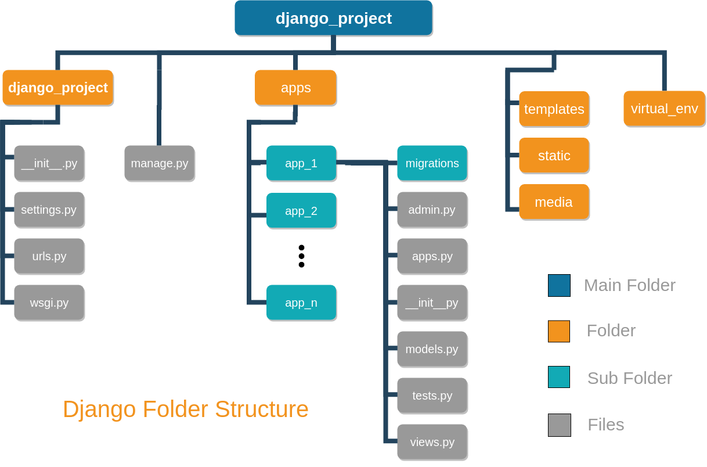

#### <a name="INDEX"> 📇 </a>

:link: **Links** :link:

- :link: [Last estable release python](https://endoflife.date/python)
- :link: [discuss.python.org release](https://discuss.python.org/tag/release)
- :link: [Google Python Style Guide](https://google.github.io/styleguide/pyguide.html)

**NOTA**
Para remover/desinstalar un pro programa:

```bash
sudo apt-get purge --auto-remove [PACKAGE_NAME]
```

# Django en maquina de desarrollo

## 1. Actualizar los paquetes de Ubuntu o del sistema Debian

```bash
sudo apt install python3-pip python3-venv
```

```bash
pip install -r requirements.txt
#
pip install -r requirements.txt --ignore-installed --force-reinstall --upgrade --no-cache-dir
```

Desinstalar todos los paquetes del ambiente virtual #1.

```bash
pip uninstall -y -r <(pip freeze) # <() is known as -process substitution- in linux
```

Desinstalar todos los paquetes del ambiente virtual #2.

```bash
pip uninstall -y -r requirements.txt
```

### Actualizar el índice local de paquetes

```bash
sudo apt-get update
```

### Actualizar todos los paquetes que puedan ser actualizados

```bash
sudo apt-get dist-upgrade
```

### Remover los paquetes que no sean necesarios

```bash
sudo apt-get autoremove
```

### Reiniciar la maquina (solo necesario para algunas actualizaciones)

```bash
sudo reboot
```

## 2. Instalar build-essential y python dev

Build-essential es el paquete que provee todas las herramientas de compilación estándar de C.
Python-dev provee los archivos necesarios para compilar módulos Python/C.
Para instalar `pip` en Debian/Ubuntu

```bash
sudo apt-get install python-setuptools build-essential python-dev
```

### Para instalar pip en Debian/Ubuntu

:link: [GitHub - pypa/get-pip](https://github.com/pypa/get-pip)

```bash
# Install the latest version of pip
curl -sSL https://bootstrap.pypa.io/get-pip.py -o get-pip.py
python get-pip.py
```

### Para instalar pip3 para Python 3.5+

```bash
sudo apt-get install python3-pip
```

Para verificar la instalación

```bash
# Python 2
pip -V
# Python 3
pip3 -V
#
python3 -m pip --version
```

## 3. Instalar pip en Debian/Ubuntu

```bash
sudo apt-get install python-pip
```

### Actualizar `pip`

```bash
pip install -U pip
$ pip install --upgrade pip
```

:link: <https://pip.pypa.io/en/latest/installing.html>  
**NOTA**: En caso de presentar un error con la instalación o funcionamiento de `pip` ó `pip3`

```bash
python2 -m pip install --user --upgrade pip
#
$ python3 -m pip install --user --upgrade pip
```

### :warning: PARA INSTALAR PAQUETES CON :snake: **PYTHON 3** DE FORMA ESPECIFICA/CORRECTA :warning

```bash
python3 -m pip install --user [name_app]
# OR
python3 -m pip install --user --no-cache-dir [name_app]
# python3 -> Ocupar python3
# -m -> Ejecutar el modulo
# pip -> Ejecutar el modulo pip
# install -> Opcion, en este caso 'install'
# --user -> Instalar paquetes para el usuario actual, en lugar que para todos los usuarios del sistemas.
# --no-cache-dir -> desahabilitar cache
# Instalar <name_app>
```

### Listar los paquetes que se encuentran desactualizados

- :link: [how-to-update-all-python-packages](https://www.activestate.com/resources/quick-reads/how-to-update-all-python-packages/)

```bash
python3 -m pip list --outdate --format=columns
```

### :rotating_light: :construction: :construction: INFORMACIÓN OFICIAL DE PyPA(Python Packaging Authority) :construction: :construction: :rotating_light

- :link: [Python Packaging Authority](https://www.pypa.io/en/latest/)
- :link: [Installing Packages](https://packaging.python.org/tutorials/installing-packages/)
- :link: [Managing Application Dependencies](https://packaging.python.org/tutorials/managing-dependencies/)

## 4 Crear un ambiente virtual con Python 3

### 4.1 Crear un ambiente virtual con `pyenv`

- :link: :octocat: [Using Different Versions of Python - pyenv](https://github.com/pyenv/pyenv)
- 🔗 ↗️ [Set up multiple python versions on your computer](https://k0nze.dev/posts/install-pyenv-venv-vscode/)

Instalar `pyenv` clonar el repo :octocat: [pyenv](https://github.com/pyenv/pyenv)

```bash
git clone https://github.com/pyenv/pyenv.git ~/.pyenv
```

Después de instalar `pyenv` se tiene que configurar para añadir al `$PATH` del sistema en linux.

```bash
echo 'export PYENV_ROOT="$HOME/.pyenv"' >> ~/.bashrc
echo 'export PATH="$PYENV_ROOT/bin:$PATH"' >> ~/.bashrc
echo 'eval "$(pyenv init --path)"' >> ~/.bashrc
```

Después reiniciar shell para que los cambios tengan efecto.

Para listar todas las versiones de `pyenv` que se pueden instalar

```bash
pyenv install -l
```

Para instalar algunas de las versiones de python listadas.

```bash
pyenv install [PYTHON_VERSION]
# ejem la ultima version de 3.9

pyenv install 3.9.16
```

Mostrar las versiones instaladas en la maquina.

```bash
pyenv versions

# output
* system (set by /home/mack/.pyenv/version)
  3.9.16
```

Para establecer una version de python diferente a la predeterminada de forma _global_

```bash
pyenv global [PYTHON_VERSION]
```

Para instalar una version diferente a la predeterminada en la terminal actual hasta que se cierre la terminal.

```bash
pyenv shell [PYTHON_VERSION]
```

Para configurar una versión de Python del proyecto que esté activa tan pronto como se entra a la carpeta `cd` del proyecto.

Esto crea dentro del proyecto una carpeta `.python-version` que contiene `[PYTHON_VERSION]` en la cual se establece la version de python que se ocupara para el proyecto.

Incluso se puede comprobar ingresando `pyenv version`, he indicará en función de qué configuración se seleccionó la versión de Python actualmente activa.

```bash
pyenv local [PYTHON_VERSION]
```

Dentro de la carpeta se crea un el archivo `.python-version` en el cual se establece que la version de python para **todo** lo que desarrolle dentro de la carpeta.

La lista de comandos para `pyenv` :octocat: [Pyenv commands](https://github.com/pyenv/pyenv/blob/master/COMMANDS.md)

Para actualizar `pyenv` cuando se encuentre se instala clonando el repo :octocat:

```bash
cd $(pyenv root) # cd ~/.pyenv
git pull

```

### 4.2 Crear un ambiente virtual con `venv`

- :link: [venv — Creation of virtual environments](https://docs.python.org/3/library/venv.html)

Se recomienda crear una carpeta en donde se encuentren todos los entornos virtuales de Python3 **(oculta)**

```bash
mkdir .[CARPETA-OCULTA]
```

```bash
# DENTRO DE LA CARPETA OCULTA
python3 -m venv [NOMBRE-DEL-ENTORNO-VIRTUAL]
```

Para activar el entorno virtual

```bash
source .[CARPETA-OCULTA]/[NOMBRE-DEL-ENTORNO-VIRTUAL]/bin/activate
```

Para desactivar el entorno virtual

```bash
([NOMBRE-DEL-ENTORNO-VIRTUAL])$ deactivate
```

```bash
usage: venv [-h] [--system-site-packages] [--symlinks | --copies] [--clear]
            [--upgrade] [--without-pip] [--prompt PROMPT] [--upgrade-deps]
            ENV_DIR [ENV_DIR ...]

Creates virtual Python environments in one or more target directories.

positional arguments:
  ENV_DIR               A directory to create the environment in.

optional arguments:
  -h, --help            show this help message and exit
  --system-site-packages
                        Give the virtual environment access to the system
                        site-packages dir.
  --symlinks            Try to use symlinks rather than copies, when symlinks
                        are not the default for the platform.
  --copies              Try to use copies rather than symlinks, even when
                        symlinks are the default for the platform.
  --clear               Delete the contents of the environment directory if it
                        already exists, before environment creation.
  --upgrade             Upgrade the environment directory to use this version
                        of Python, assuming Python has been upgraded in-place.
  --without-pip         Skips installing or upgrading pip in the virtual
                        environment (pip is bootstrapped by default)
  --prompt PROMPT       Provides an alternative prompt prefix for this
                        environment.
  --upgrade-deps        Upgrade core dependencies: pip setuptools to the
                        latest version in PyPI

Once an environment has been created, you may wish to activate it, e.g. by
sourcing an activate script in its bin directory.
```

## 5 Crear un ambiente virtual Pipenv

- :link: [Pipenv: Python Dev Workflow for Humans](https://pipenv.kennethreitz.org/en/latest/)
- :link: [Basic Usage of Pipenv](https://pipenv.kennethreitz.org/en/latest/basics/)

Instalar Pipenv

```bash
python3 -m pip install --user pipenv
# OR
$ pip3 install pipenv
```

Crear el ambiente virtual  
Dentro de la carpeta donde estaran los archivos del proyecto.

```bash
# CREAR UN AMBIENTE VIRTUAL CON PYTHON 3 CON EL NOMBRE DE LA CARPETA
$ pipenv --three
```

Instalar desde Pipfile, si hay uno:

```bash
pipenv install
```

Instalar paquetes que solo se ocuparan que ocuparan en proceso de desarrollo

```bash
pipenv install flake8 --dev
```

Especificar la version de Python  
Para usar python 3

```py
pipenv --python 3
```

Para usar python 3.9.6

```py
pipenv --python 3.9.6
```

Para usar python 2.7.14

```py
pipenv --python 2.7.14
```

Eliminar el ambiente virtual  
Dentro de la carpeta donde estaran los archivos del proyecto.

```bash
pipenv --rm
```

Activar ambiente virtual  
Dentro de la carpeta donde se estan los archivos del proyecto.

```bash
pipenv shell
```

Salir/Desactivar del ambiente virtual

```bash
pipenv exit
# Ó
$ exit
```

Revisar la version de Python dentro del ambiente virtual

```bash
python --version
```

Instalar un paquete con Pipenv

```bash
pipenv install <NOMBRE_DE_PAQUETE>
```

Antes de actualizar Django, para asegurar de resolver cualquier advertencia de obsolescencia reportada. De forma predeterminada, las advertencias de obsolescencia están desactivadas. Para saber cuales son:

```bash
python -Wa manage.py test
```

Instalar un paquete con Pipenv con una version en especifico.

```bash
pipenv install django==1.11
```

Listar los paquetes instalados por pipenv

```bash
pipenv lock -r
#
pipenv lock --requirements
```

Crear `requirements.txt` con pipenv

```bash
pipenv lock -r > requirements.txt
```

Desistalar un paquete dentro del emviente virtual

```bash
pipenv uninstall <nombre_del_paquete>
```

Instalar un paquete dentro del ambiente virtual **para desarrollo**

```bash
pipenv uninstall <nombre_del_paquete> --dev
```

Instalar paquetes en el ambiente virtual desde el archivo `requirements.txt`

```bash
pipenv install -r path/to/requirements.txt
```

Revisar vulnerabilidades en el ambiente virtual

```bash
pipenv check
```

Revisar las depencias dentro delos paquetes instalados en nustro ambiente virtual.

```bash
pipenv graph
```

Generar archivo `Pipfile.lock`

```bash
pipenv lock
```

> En caso especifico para manejar los comandos con **django**, se pueden hacer de forma normal.

## 6 Crear un ambiente virtual Poetry

- :link: [Poetry home](https://python-poetry.org/)
- :link: [Poetry docs](https://python-poetry.org/docs/cli/)
- :octocat: [Poetry Github Home](https://github.com/python-poetry/poetry)

`$ poetry new [PROJECT-NAME]` : Crea un nuevo proyecto en python. En el lugar donde se ejecuta crea una carpeta con el nombre _[PROJECT-NAME]_ con los siguientes archivos archivos.

```bash
.
├── [PROJECT-NAME]
│   └── __init__.py
├── pyproject.toml
├── README.rst
├── tests
│   ├── __init__.py
│   └── test_[PROJECT-NAME].py
└── treee.txt
```

- `$ poetry init` : Crea el archivo `pyproject.toml` interactivamente; no importa si ya existe previamente.
- `$ poetry install` : Instala los paquetes que estan dentro de archivo `pyproject.toml`. Si hay un archivo `poetry.lock` en el directorio actual, usará las versiones exactas de allí en lugar de resolverlos. Esto asegura que todos los que usan la biblioteca obtendrán las mismas versiones de las dependencias.
- `$ poetry add [PACKAGE-NAME]` : Instalal un paquete en el ambiente virtual.
- `$ poetry add -D [PACKAGE-NAME]` : Instala un paquete en el ambiente virtual para desarrollo.
- `$ poetry show` : Para listar todos los paquetes disponibles.
- `$ poetry remove [PACKAGE-NAME]` : Desinstala un paquete en el ambiente virtual.
- `$ poetry remove -D [PACKAGE-NAME]` : Desistala un paquete en el ambiente virtual para desarrollo.
- `$ poetry update` : Para conseguir las ultimas versiones de las depencias y actualizar el archivo `poetry.lock`.
- `$ poetry shell` : Crea si no lo esta; el ambiente virtual con la versión de python que esta indicando en el archivo `pyproject.toml`. Para salir del ambiente virtual `exit`
- `$ poetry build` : Crea el paquete que se encuentra en el projecto, listo para publicarlo y que otros lo instalen y usen.
- `$ poetry publish` : Publica el paquete en Pypi.
- `$ poetry publish --build` : Crea y publica el paquete.
- `$ poetry self update` : Actualiza poetry a la ultima version estable.

Environment

- `$ poetry env info` : Mostrar información del ambiente virtual
- `$ poetry env list` : Enumerar los entornos asociados con el proyecto
- `$ poetry env remove <NAME-OF-ENV>` : Eliminar emviente virtual

:footprints: Pasos

1. Crear un nuevo proyecto `$ poetry new [PROJECT-NAME]`
2. Modificar el archivo `pyproject.toml` para indicar que version de python se desea ocupar

```bash
[tool.poetry.dependencies]
python = "^3.8.10"
```

3. Creear el ambiente virtual `$ poetry install`
4. Crear\Entrar al ambiente virtual `$ poetry shell`
5. salir del amviente virtual creado `$ exit`

## 7 ¿:-?

### Actualizar las versiones de los paquetes en "requirements.txt"

Mostrar una lista de los paquetes que se encuentran desactualizados ó que ya hay versiones nuevas para instalar en caso de ser necesario.
Se mostrará una lista con las versiones actuales(instaladas) y versiones nuevas del lado derecho.

```bash
pip list --outdated
```

Instalar el paquete mediante `pip` fuera del ambiente virtual(preferentemente) como lo recomienda el manual.

- :link: [pip-upgrader](https://github.com/simion/pip-upgrader)

```bash
pip install pip-upgrader
# Note: this packages installs the following requirements: 'docopt', 'packaging', 'requests', 'terminaltables', 'colorclass'
```

- To avoid installing all these dependencies in your project, you can install `pip-upgrader` in your system, rather than your virtualenv. If you install it in your system, and need to upgrade it, run `pip install -U pip-upgrader`

```bash
requirements_file(s)          The requirement FILE, or WILDCARD PATH to multiple files. (positional arguments)
--prerelease                  Include prerelease versions for upgrade, when querying pypi repositories.
-p <package>                  Pre-choose which packages tp upgrade. Skips any prompt.
--dry-run                     Simulates the upgrade, but does not execute the actual upgrade.
--skip-package-installation   Only upgrade the version in requirements files, don\'t install the new package.
--skip-virtualenv-check       Disable virtualenv check. Allows installing the new packages outside the virtualenv.
--use-default-index           Skip searching for custom index-url in pip configuration file(s).
```

ejemplo:

```bash
pip-upgrade             # auto discovers requirements file. Prompts for selecting upgrades
pip-upgrade requirements.txt
pip-upgrade requirements/dev.txt requirements/production.txt

# skip prompt and manually choose some/all packages for upgrade
pip-upgrade requirements.txt -p django -p celery
pip-upgrade requirements.txt -p all

# include pre-release versions
pip-upgrade --prerelease
```

## :chart_with_upwards_trend: Generar MER(UML) diagrama de los modelos de django

:link: [django-extensions](https://django-extensions.readthedocs.io/en/latest/graph_models.html)

```bash
# DENTRO DEL ambiente VIRTUAL
$ pip install django-extensions
```

Instalar django-extensions en django

```bash
# setings.py
INSTALLED_APPS = (
    ...
    'django_extensions',
    ...
)
```

Instalar los generadores

- Graphviz
- Dotplus

```bash
sudo apt-get install graphviz libgraphviz-dev pkg-config
```

Dentro del ambiente virtual

```bash
pip install pygraphviz
$ pip install pydot
```

Para generar el modelo grafico.

```bash
python manage.py graph_models -e -g -l dot -o core.png core # olny app core
$ python manage.py graph_models -a -g -o eventex.png # all
```

## Proyectos Django

Django es? es uno de los frameworks más populares para crear web apps.

- Cuáles son las características de Django

  - Rápido
  - Open Source

- Algunos proyectos que usan Django son:

  - Instagram
  - Pinterest
  - National Geographic
  - Platzi

- Posee tres características:
  - Es veloz: Aunque no el framework mas veloz.
  - Es seguro: Posee protección contra: `([documentación](https://docs.djangoproject.com/es/4.0/topics/security/#clickjacking-protection))` - **Cross site scripting (XSS) protection** - **Cross site request forgery (CSRF) protection** - **SQL injection protection** - **Clickjacking protection**
  - Es escalable: Permite que tu app crezca de forma escalable

1. Crear una carpeta con el nombre de la carpeta del proyecto con la primera letra en mayúsculas.
2. `python3 -m venv [NOMBRE-DEL-ENTORNO-VIRTUAL]`

- Para instalar django (estando dentro del ambiente virtual),

```bash
pip install django
```

2.1. Para instalar una actualización **ESPECIFICA** en el ambiente virtual con pip

```bash
pip install --upgrade django
```

2.2. Para instalar la **ULTIMA** actualización en el ambiente virtual con pip

```bash
pip install -U Django
```

3. Crear un proyecto en django

```bash
django-admin startproject [NombreDeTuProyecto]
```

Después de hacer hacer el proyecto se tiene que crear las tablas del proyecto, con el siguiente comando.  
Crea\prepara las migraciones para cualquier cambio que se halla echo para después aplicarlas.

```bash
python manage.py makemigrations
```

Despues para aplicar las migraciones se ejecuta el sig comando; de esta manera los cambios echos a las BD se aplican y en caso de aver errores se mostraran en pantalla

```bash
python manage.py migrate
```

salida..

```bash
Operations to perform:
  Apply all migrations: admin, auth, contenttypes, sessions
  Running migrations:
  Applying contenttypes.0001_initial... OK
  Applying auth.0001_initial... OK
  Applying admin.0001_initial... OK
  Applying admin.0002_logentry_remove_auto_add... OK
  Applying contenttypes.0002_remove_content_type_name... OK
  Applying auth.0002_alter_permission_name_max_length... OK
  Applying auth.0003_alter_user_email_max_length... OK
  Applying auth.0004_alter_user_username_opts... OK
  Applying auth.0005_alter_user_last_login_null... OK
  Applying auth.0006_require_contenttypes_0002... OK
  Applying auth.0007_alter_validators_add_error_messages... OK
  Applying auth.0008_alter_user_username_max_length... OK
  Applying sessions.0001_initial... OK
```

Esto se hace para poder crear la BD inicial del proyecto y después se tiene que crear el usuario (super usuario) para que tenga acceso sin restricciones al proyecto y a las aplicaciones.

```bash
python manage.py createsuperuser
```

_NOTA_: Se tiene que crear un usuario y la contraseña tiene que cimplir con los requerimientos NUEVOS de seguridad.  
Para correr el proyecto se ejecuta entramos a `http://localhost:8000/admin - http://127.0.0.1:8000/admin` y entramos con el usuario y contraseña anterior puestas

```bash
python manage.py runserver
```

_NOTA:_ ejecutando el siguiente comando nos muestra todas las opciones que podemos realizar cuando esta correctamente instalado

```bash
./manage.py
```

Aoutput

```bash
Type 'manage.py help <subcommand>' for help on a specific subcommand.

Available subcommands:

[auth]
  changepassword
  createsuperuser

[contenttypes]
  remove_stale_contenttypes

[django]
  check
  compilemessages
  createcachetable
  dbshell
  diffsettings
  dumpdata
  flush
  inspectdb
  loaddata
  makemessages
  makemigrations
  migrate
  sendtestemail
  shell
  showmigrations
  sqlflush
  sqlmigrate
  sqlsequencereset
  squashmigrations
  startapp
  startproject
  test
  testserver

[sessions]
  clearsessions

[staticfiles]
  collectstatic
  findstatic
  runserver
```

Para ejecutar el shell de python

```bash
python manage.py shell
```

- Con el shell de python se puede hacer CRUD en la B.D. Para revisar los datos que se modificaron a la tabla -> `$`
  4 Crear (app) aplicación en django para un proyecto

```bash
python manage.py startapp [NombreDeLaApp] (POR CONVENCIÓN LAS APPS/MODULOS SE CREA SU NOMBRE EN PLURAL)
```

Tambien se puede especificar el directorio de la aplicación como segundo parámetro:

```bash
python manage.py startapp <app_name> <app_directory>
# ejem
# python manage.py startapp users apps/users
```

## Administrador de django

### Cambiar/crear Nuevo Usuario en Django

```bash
./manage.py createsuperuser [# LAS PREGUNTAS SIGUIENTES SE CONTESTAN CORRECTAMENTE]
$ ./manage.py changepassword [# POR DEFAULT TOMA EL DE SISTEMA, EN CASO DE NO EXISTIR EL USUARIO Y DE PREFERENCIA SE DEBE DE CREAR UNO NUEVO]
```

### Configuraciones para modificar/mejorar el administrador de django

`list_display` -> Permite mejorar los listados agregando múltiples columnas.

- Un campo o atributo del modelo
- Una función que reciba una instancia del modelo.
- Una función en el ModelAdmin

- `list_filter` -> Permite agregar filtros para cuando queremos ver solo algunos de los datos. ( la barra que se encuentra en la barra de la derecha )
- `search_fields` -> Permite realizar una búsqueda por texto sencilla automática.
- `list_editable` -> Permite editar campos directamente en la lista. NO PUEDE EDITAR EL PRIMER CAMPO DE LA LISTA.
- `actions` -> Permite ejecutar acciones para multiples elementos de la lista --como exportar en excel
- `raw_id_fields` -> Permite evitar muchos problemas de carga cuando hay MUCHOS modelos asociados.
- `inlines` -> Permite controlar modelos relacionados dese el administrador de un modelo.
- `filter_horizontal` -> O `filter_vertical` permiten que el manejo de ManyToMany sea mucho más sencillo.
- `Context processors` -> Es una manera sencilla de agregar todas a todas tus platillas, Es un elemento que permite agregar datos al contexto que usan las plantillas para renderizarse.

**Middlewares** -> Es un elemento que permite modificar _GLOBALMENTE_ el comportamiento de tu aplicación de django, modificando la entrada y la salida. Es agregar un **plug.in** para django.

- Necesita agregarle un dato a una sesión del usuario
- Necesita detectar el pais de un usuario y cambiar su información acorde
- Necesita agregar una variable HTTP
- Necesita mostrar información según el subdominio.

**APIs REST** -> REPRESENTATIONAL STATE TRANSFER, y fue propuesta en una tesis de doctorado. Usa los cuatro métodos HTTP ( GET, POST, PUT, DELETE ) para ejecutar diferentes operaciones, lo importante son los recursos.

- Para exponer tus datos a otros programas
- Para facilitar el desarrollo de frontend
- Para crear arquitecturas orientadas a servicios

## Cache Django

:link: <https://docs.djangoproject.com/en/4.1/topics/cache/>
¿Cuando usarlo?  
Cuando necesitas una información que consume tiempo de calcular, procesar o conseguir (traer tweets, fotos de instagram) Cuando quieres que todo vaya mucho más rapido

- Low level
- Por vista - Per view -> :link: <https://docs.djangoproject.com/en/4.1/topics/cache/#the-per-site-cache>
- En las plantillas
  En Django se tiene que llevar un orden para poner en los _Middleware_ el cache por vista. -> Middleware ordering

### Cache para las sesiones. Para un mejor rendimiento es posible utilizar en Django un backend de sesión basado en cache

:link: <https://docs.djangoproject.com/en/4.1/topics/http/sessions/#using-cached-sessions>
Se pone en el `setings.py`  
Para no pegarle tanto a la b.d. Este cache funciona de manera simultanea. Cada escritura que se ahce en la cache tambien se hace en la BD. La sesion solo usa la BD si los datos no estan en la memoria cache.

```bash
SESSION_ENGINE = 'django.contrib.sessions.backends.cached_db'
```

A un más -- si no nos importa que se pierda la sesion. Esta opción es para una simple sesion de cache. La sesion se almacena en la cache directo. No es persistente, se borrara si se llena la cache o si el servidor es reiniciado.

```bash
SESSION_ENGINE = 'django.contrib.sessions.backends.cache'
```

## Cache con REDIS

### Instalar REDIS

- :link: :house: [Quickstart](https://redis.io/topics/quickstart)
- :link: [Redis Django](https://docs.djangoproject.com/en/dev/topics/cache/#redis)
- :link: [Redis Security](https://redis.io/topics/security)
- :link: [How To Install and Secure Redis on Ubuntu 22.04](https://www.digitalocean.com/community/tutorials/how-to-install-and-secure-redis-on-ubuntu-22-04)

Para poder hacer una contraseña en la linea de comandos se puede hacer de la siguiente manera:

```bash
# Generate 32 bytes, base64 encode
openssl rand -base64 32
```

👇

```bash
AkxB9lmNkDc80ZEuGR4B0lhQPdhwvTlTv95sANXYMYM=
```

Con Openssl generar una contraseña SHA512

```bash
openssl passwd -6 -salt <SOME_SALT_HERE>
```

La cadena `SALT` podría ser cualquier cadena aleatoria, solo asegúrese de que no sea corta.

```bash
openssl passwd -6 -salt mack
Password: <SECRIBE_LA_CONTRASEÑA>
```

👇

```bash
$6$mack$o8RgiFIGx85x48u4pxx1RBfFHxc/C4bpVo.d7m/45gCXDe6zFk3OTNa9SYWkpSzONDkjS/WhH1pVhZ9oLSluR/
```

Para poder hacer una contraseña en la linea de comandos se puede hacer de la siguiente manera:

```bash
echo "cualquer-texto" | sha512sum
```

👇

```bash
8898c46dfd4e3e3f35082bfa1dae27e9e2d9991785828478f05fba38a98dd8ab5dc503658620684ed6cfa7b7d43c6d322c9ff9568b9c0b3c164b35f5d5191380
```

## Templates

Configuración para que busque en todas las carpetas del proyecto la carpeta **templates**

```py
# from pathlib import Path
# # Build paths inside the project like this: BASE_DIR / 'subdir'.
# BASE_DIR = Path(__file__).resolve(strict=True).parent.parent.parent
# APPS_DIR = BASE_DIR / "apps"

# TEMPLATES
# ------------------------------------------------------------------------------
# https://docs.djangoproject.com/en/dev/ref/settings/#templates
TEMPLATES = [
    {
        # https://docs.djangoproject.com/en/dev/ref/settings/#std:setting-TEMPLATES-BACKEND
        "BACKEND": "django.template.backends.django.DjangoTemplates",
        # https://docs.djangoproject.com/en/dev/ref/settings/#dirs
        "DIRS": [str(APPS_DIR / "templates")],
        # https://docs.djangoproject.com/en/dev/ref/settings/#app-dirs
        "APP_DIRS": True,
        "OPTIONS": {
            # https://docs.djangoproject.com/en/dev/ref/templates/api/#using-requestcontext
            "context_processors": [
                "django.template.context_processors.debug",
                "django.template.context_processors.request",
                "django.contrib.auth.context_processors.auth",
                "django.template.context_processors.i18n",
                "django.template.context_processors.media",
                "django.template.context_processors.static",
                "django.template.context_processors.tz",
                "django.contrib.messages.context_processors.messages",
            ],
        },
    },
]
```

## Estatic & Media files

En el archivo `settings.py` va la siguiente configuración.

```py
# STATIC
# ------------------------------------------------------------------------------
# https://docs.djangoproject.com/en/4.2/howto/static-files/
# https://docs.djangoproject.com/en/dev/ref/settings/#static-root
STATIC_ROOT = str(BASE_DIR / "staticfiles")
# https://docs.djangoproject.com/en/dev/ref/settings/#static-url
STATIC_URL = "/static/"
# https://docs.djangoproject.com/en/dev/ref/contrib/staticfiles/#std:setting-STATICFILES_DIRS
STATICFILES_DIRS = [str(APPS_DIR / "static")]
# https://docs.djangoproject.com/en/dev/ref/contrib/staticfiles/#staticfiles-finders
STATICFILES_FINDERS = [
    "django.contrib.staticfiles.finders.FileSystemFinder",
    "django.contrib.staticfiles.finders.AppDirectoriesFinder",
]

# MEDIA
# ------------------------------------------------------------------------------
# https://docs.djangoproject.com/en/dev/ref/settings/#media-root
MEDIA_ROOT = str(APPS_DIR / "media")
# https://docs.djangoproject.com/en/dev/ref/settings/#media-url
MEDIA_URL = "/media/"
```

En el `archivo url.py` que se encuentra al mismo nivel del archivo `settings.py`

```py
urlpatterns = (
    [
        path(settings.ADMIN_URL, admin.site.urls),
    ]
    + static(settings.MEDIA_URL, document_root=settings.MEDIA_ROOT)
    + static(settings.STATIC_URL, document_root=settings.STATIC_ROOT)
)
```

## Administración de las contraseñas en Django

- Se ocupa de preferencia **Argon2** :link: [Using Argon2 with Django](https://docs.djangoproject.com/en/dev/topics/auth/passwords/#using-argon2-with-django)
- Par apoder ocupar **Argon2** se tienen que instalar en el ambiente de del proyecto. :link: [pypi.org/project/argon2-cffi/](https://pypi.python.org/pypi/argon2_cffi/)

```bash
pip install argon2-cffi
```

```py
PASSWORD_HASHERS = [
    "django.contrib.auth.hashers.Argon2PasswordHasher",
    "django.contrib.auth.hashers.PBKDF2PasswordHasher",
    "django.contrib.auth.hashers.PBKDF2SHA1PasswordHasher",
    "django.contrib.auth.hashers.BCryptSHA256PasswordHasher",
    "django.contrib.auth.hashers.ScryptPasswordHasher",
]
```

## Manejando archivos en AWS S3


### Instalar boto3 & django-storages

> Boto3 es un **SDK** "Software Development Kid" de "Amazon Web Services" **AWS** para **python**, que permite a los usuarios escribir software para hacer uso de los servicios de **AWS S3 y EC2**

- :link: - <http://boto3.readthedocs.io/en/latest/>
- :link: - <https://github.com/boto/boto3>

Estando dentro del ambiente virtual del proyecto

```bash
pip install boto3
```

> django-storages, es una colección de backends de almacenamiento personalizados para Django y boto3.

- :link:- <https://django-storages.readthedocs.io/en/latest/>
- :link:- <https://github.com/jschneier/django-storages>

Estando dentro del ambiente virtual.

```bash
pip install django-storages
```

Se añade `storages` en el archivo **settings.py**

```bash
INSTALLED_APPS = (
  ...
  'storages',
  ...
)
```

```py
# STORAGES
# ------------------------------------------------------------------------------
# https://django-storages.readthedocs.io/en/latest/#installation
INSTALLED_APPS += ["storages"]
# https://django-storages.readthedocs.io/en/latest/backends/amazon-S3.html#settings
AWS_ACCESS_KEY_ID = env("DJANGO_AWS_ACCESS_KEY_ID")
# https://django-storages.readthedocs.io/en/latest/backends/amazon-S3.html#settings
AWS_SECRET_ACCESS_KEY = env("DJANGO_AWS_SECRET_ACCESS_KEY")
# https://django-storages.readthedocs.io/en/latest/backends/amazon-S3.html#settings
AWS_STORAGE_BUCKET_NAME = env("DJANGO_AWS_STORAGE_BUCKET_NAME")
# https://django-storages.readthedocs.io/en/latest/backends/amazon-S3.html#settings
AWS_QUERYSTRING_AUTH = False
# DO NOT change these unless you know what you're doing.
_AWS_EXPIRY = 60 * 60 * 24 * 7
# https://django-storages.readthedocs.io/en/latest/backends/amazon-S3.html#settings
AWS_S3_OBJECT_PARAMETERS = {
    "CacheControl": f"max-age={_AWS_EXPIRY}, s-maxage={_AWS_EXPIRY}, must-revalidate",
}
# https://django-storages.readthedocs.io/en/latest/backends/amazon-S3.html#settings
AWS_S3_MAX_MEMORY_SIZE = (env.int("DJANGO_AWS_S3_MAX_MEMORY_SIZE"),)  # 100MB
# https://django-storages.readthedocs.io/en/latest/backends/amazon-S3.html#settings
AWS_S3_REGION_NAME = env("DJANGO_AWS_S3_REGION_NAME")
# https://django-storages.readthedocs.io/en/latest/backends/amazon-S3.html#cloudfront
AWS_S3_CUSTOM_DOMAIN = f"{AWS_STORAGE_BUCKET_NAME}.s3.amazonaws.com"
aws_s3_domain = AWS_S3_CUSTOM_DOMAIN or f"{AWS_STORAGE_BUCKET_NAME}.s3.amazonaws.com"

# STATIC & MEDIA
# ------------------------
STORAGES = {
    "default": {
        "BACKEND": "storages.backends.s3.S3Storage",
        "OPTIONS": {
            "location": "blog_sand_box/media",
            "file_overwrite": False,
            "default_acl": "public-read",
        },
    },
    "staticfiles": {
        "BACKEND": "whitenoise.storage.CompressedManifestStaticFilesStorage"
    },
}
MEDIA_URL = f"https://{aws_s3_domain}/media/"
COLLECTFAST_STRATEGY = "collectfast.strategies.boto3.Boto3Strategy"
```

## Instalar git

Para instalar git la versión mas reciente del link

- :link: <https://github.com/git/git.git>
- :link: <https://www.kernel.org/pub/software/scm/git/>

```bash
sudo apt-get update
$ sudo apt-get install git
$ sudo apt-get update
```

```bash
sudo apt-get install libcurl4-gnutls-dev libexpat1-dev gettext libz-dev libssl-dev cmake gcc
```

```bash
wget https://github.com/git/git/archive/v1.9.2.zip -O git.zip
```

```bash
unzip git.zip
$ cd git-XXX
$ make prefix=/usr/local all
$ sudo make prefix=/usr/local install
```

## Paso_GIT

**HACER LA LLAVE SSH**
Si quiere crear un par de llave RSA en vez de DSA solo debe usar -t rsa ( no debe especificar el largo "-b" por defecto el largo para RSA es de 4096 y es suficiente)

```bash
ssh-keygen -o -a 512 -t ed25519 -f ~/.ssh/<NAME-FOR-THE-KEY> -C "comentario_de_la_llave+your_john@example.com"  #-> frase_de_la_llave
```

## Adding your SSH key to the ssh-agent

Before adding a new SSH key to the ssh-agent to manage your keys, you should have [checked for existing SSH](https://help.github.com/articles/checking-for-existing-ssh-keys/) keys and [generated a new SSH key](https://help.github.com/articles/generating-a-new-ssh-key-and-adding-it-to-the-ssh-agent/#generating-a-new-ssh-key)

1. Start the ssh-agent in the background.

```bash
eval "$(ssh-agent -s)"
Agent pid 59566
```

2. Add your SSH private key to the ssh-agent. If you created your key with a different name, or if you are adding an existing key that has a different name, replace id_rsa in the command with the name of your private key file.

```bash
ssh-add ~/.ssh/id_rsa
```

3. Add the SSH key to your GitHub account.Copy the SSH key to your clipboard.
   If your SSH key file has a different name than the example code, modify the filename to match your current setup. When copying your key, don't add any newlines or whitespace.

```bash
sudo apt-get install xclip
# Downloads and installs xclip. If you don't have `apt-get`, you might need to use another installer (like `yum`)

$ xclip -sel clip < ~/.ssh/id_rsa.pub
# Copies the contents of the id_rsa.pub file to your clipboard
```

**NOTA**.- Tip: If xclip isn't working, you can locate the hidden .ssh folder, open the file in your favorite text editor, and copy it to your clipboard.

4. In the upper-right corner of any page, click your profile photo, then click Settings.
5. Authentication keysIn the user settings sidebar, click SSH and GPG keys.
6. SSH Key buttonClick New SSH key or Add SSH key.
7. In the "Title" field, add a descriptive label for the new key. For example, if you're using a personal Mac, you might call this key "Personal MacBook Air".
8. The key fieldPaste your key into the "Key" field.
9. The Add key buttonClick Add SSH key.
10. Sudo mode dialogIf prompted, confirm your GitHub password.

## Probando su conexión ssh

After you've set up your SSH key and added it to your GitHub account, you can test your connection.  
Before testing your SSH connection, you should have:

- [Checked for existing SSH keys](https://help.github.com/articles/checking-for-existing-ssh-keys)
- [Generated a new SSH key](https://help.github.com/articles/generating-a-new-ssh-key-and-adding-it-to-the-ssh-agent)
- [Added a new SSH key to your GitHub account](https://help.github.com/articles/adding-a-new-ssh-key-to-your-github-account)

1. Abrir la terminal y

```bash
ssh -T git@github.com
```

# Attempts to ssh to GitHub

Se mostraran mensajes de advertencia ejem:

```bash
The authenticity of host 'github.com (192.30.252.1)' can't be established.
RSA key fingerprint is 16:27:ac:a5:76:28:2d:36:63:1b:56:4d:eb:df:a6:48.
Are you sure you want to continue connecting (yes/no)?

The authenticity of host 'github.com (192.30.252.1)' can't be established.
RSA key fingerprint is SHA256:nThbg6kXUpJWGl7E1IGOCspRomTxdCARLviKw6E5SY8.
Are you sure you want to continue connecting (yes/no)?
```

**Nota**: The example above lists the GitHub IP address as 192.30.252.1. When pinging GitHub, you may see a range of IP addresses. For more information, see "What IP addresses does GitHub use that I should whitelist?"

2. Verify that the fingerprint in the message you see matches one of the messages in step 2, then type yes:

```bash
Hi username! You've successfully authenticated, but GitHub does not
provide shell access.
```

You may see this error message:

```bash
Agent admitted failure to sign using the key.
debug1: No more authentication methods to try.
Permission denied (publickey).
```

This is a known problem with certain Linux distributions. For more information, see "[Error: Agent admitted failure to sign](https://help.github.com/articles/error-agent-admitted-failure-to-sign)".
Verify that the resulting message contains your username. If you receive a "permission denied" message, see "[Error: Permission denied (publickey)](https://help.github.com/articles/error-permission-denied-publickey)".  
Para entrar vía terminal a maquina remota vía ssh

```bash
ssh root@XXX.XXX.XXX.XXX -> Después pedirá cambia la contraseña por otra nueva "xxxxxxxxxxxxxxx"
```

Para que se pueda conectar el VPS con nuestro repositorio en github se tiene que hacer una llave ssh en el usuario en el que se esta ejecutando nuestra aplicación.

Cuando se crea la llave `ssh`, en el repositorio de github se añade. Con nombre `<NAME-FOR-THE-KEY>`

```bash
ssh-keygen -o -a 512 -t ed25519 -f ~/.ssh/<NAME-FOR-THE-KEY> -C "comentario_de_la_llave+your_john@example.com"  #-> frase_de_la_llave
```

Cuando se crea la llave ssh y esta instalal en github ahora en nuestra sesión de nuestro usuario en vps dentro de la carpeta donde se encuentra manage.py y dentro del ambiente virtual se ejecuta

```bash
git init
```

Se agrega la dirección del repositorio remoto

```bash
git remote add origin [REPOSITORIO HTTPS o SSH]
```

Se comprueba que se añadieron correctamente

```bash
git remote -v
```

Para descargar/jalar el repositorio a nuestro vps, tiene que ser de la rama master

```bash
git pull origin master -> Piede el password del ssh
```

## Mardar a producción Django(Ubuntu 24.04) dokerizado con nginx y postgresl por medio de Nginx Proxy Manager y Portainer en DigitalOcean

🚨 Tomando en cuenta el proyecto [Blog Sand Box](https://github.com/macknilan/blog_sand_box) :octocat: 🔗 👈

- [Portainer](https://docs.portainer.io/start/install-ce/server/docker/linux) 🔗
- [Nginx Proxy Manager](https://nginxproxymanager.com/guide/) 🔗

### Creacion de dominio y subdominios

Se tienen que crear el dominios con el proveedor de dominios que se tenga, por ejemplo [Namecheap](https://www.namecheap.com/)

Con [cloudflare](https://www.cloudflare.com/) se tiene que cambiar los DNS de nuestro dominio a los DNS de cloudflare.

Por ejemplo una lista de DNS en cloudflare se tiene que añadir los DNS para el proyecto y uso de Nginx Proxy Manager, Portainer y el dominio principal.

| Type | Name           |
| ---- | -------------- |
| A    | www            |
| A    | proxymanager   |
| A    | portainer      |
| A    | my-domain-name |

### Crear un "droplet" en digitalocean

- Antes de crear el droplet se tiene que crear la llave `ssh`

```bash
ssh-keygen -o -a 512 -t ed25519 -f ~/.ssh/<NAME-FOR-THE-KEY> -C "comentario_de_la_llave+your_john@example.com"  #-> frase_de_la_llave
```

y se guarda en `~/.ssh/<NAME-FOR-THE-KEY> <NAME-FOR-THE-KEY.pub>`

```bash
ssh-keygen -o -a 512 -t ed25519 -f ~/.ssh/<NAME-FOR-THE-KEY> -C "comentario_de_la_llave+your_john@example.com"
Generating public/private ed25519 key pair.
Enter passphrase (empty for no passphrase):
Enter same passphrase again:
Your identification has been saved in /home/XXXX/.ssh/<NAME-FOR-THE-KEY>
Your public key has been saved in /home/XXXX/.ssh/<NAME-FOR-THE-KEY>.pub
The key fingerprint is:
SHA256:XXXXXXXXXXXXXXXX/XXXXXX/Goeg0CwrEobr0o5XXXX comentario_de_la_llave+your_john@example.com
The key's randomart image is:
+--[ED25519 256]--+
|      ...        |
|     o o         |
|    . B .        |
|   . B * o       |
|  . oEO S o o . .|
|   o ..B + o o +.|
| .. ..= . . . o +|
|.=.. ..=   o   +.|
|+o+ ... ... . ooo|
+----[SHA256]-----+

```

- Se copia la llave a `xxxxxxxx_xxxxxxx_xxxxx_xxxxx.pub` **digitalocean** cuando se crea el droplet como método de autenticación.

```bash
cat ~.ssh/xxxxxxxx_xxxxxxx_xxxxx_xxxxx.pub
```

- [How to Connect to your Droplet with OpenSSH](https://docs.digitalocean.com/products/droplets/how-to/connect-with-ssh/openssh/) 🔗

Finalizado la creacion de la maquina **droplet**, copiar la IP publica de la maquina creada y conectarse a la maquina creada con el siguiente comando en conjunto con la llave creada localmente anteriormente.

```bash
ssh -i ~/.ssh/<NAME-FOR-THE-KEY> root@[IP-PUBLICA-MAQUINA]
```

```bash
The authenticity of host '203.0.000.0 (203.0.000.0)' can't be established.
ECDSA key fingerprint is XX:XX:XX:f9:EX:AM:PL:XX:e1:55:00:ad:d6:6d:22:XX.
Are you sure you want to continue connecting (yes/no)? yes
/usr/bin/ssh-copy-id: INFO: attempting to log in with the new key(s), to filter out any that are already installed
/usr/bin/ssh-copy-id: INFO: 1 key(s) remain to be installed -- if you are prompted now it is to install the new keys
username@203.0.000.0's password:
```

- Deshabilitar el acceso mediante con contraseña root

1. Por seguridad es mejor solo entrar al servidor con las llaves y no ocupar ninguna contraseña escrita.
2. Es necesario editar las configuraciones SSHd del servidor en la ruta -> `/etc/ssh/sshd_config`
3. Editarlo con "vim" en la linea donde se encuentre `PermitRootLogin` para que se vea como sigue:

```bash
...
PermitRootLogin without-password
...
and
...
PasswordAuthentication no
...
```

Después es necesario reiniciar la VM o reiniciar el servicio **sshd** de la siguiente manera

```bash
# ps auxw | grep ssh
USER PID %CPU %MEM VSZ RSS TTY STAT START TIME COMMAND
root 681 0.0 0.1 49948 2332 ? Ss 2012 3:23 /usr/sbin/sshd -D
```

```bash
sudo systemctl restart ssh
# or
# kill -HUP 681
```

Ahora el inicio de sesión **root** del servidor está protegido y puede entrar intentando con SSH directamente como **root**, este servidor desde un sistema que no tiene sus claves compartidas y será expulsado automáticamente sin que se le solicite una contraseña de root.

A las llaves creadas se les cambian los permisos para que solo sean de solo lectura para **root** de muestro sistema de archivos  
:link: <https://es.wikipedia.org/wiki/Chmod>

```bash
# chmod 400 ruta/al/archivo/.ssh/xxxxxxxx_xxxxxxx_xxxxx_xxxxx.pub
```

```bash
# chmod 400 ruta/al/archivo/.ssh/xxxxxxxx_xxxxxxx_xxxxx_xxxxx.pub
```

> 4 es para "lectura"  
> 2 es para "escritura"  
> 1 es para "ejecución"  
> 0 es para "denegar permiso"

```bash
chmod [DIGITIGO-DUEÑO][DIGITO-GRUPO][DIGITO-RESTO] <ARCHIVO>
```

### Crear usuarios en el servidor de producción

**NOTA**:
Para poder hacer una contraseña en la linea de comandos se puede hacer de la siguiente manera con `_sha512sum_`:

```bash
echo "cualquer-texto" | sha512sum
```

salida..

```bash
8898c46dfd4e3e3f35082bfa1dae27e9e2d9991785828478f05fba38a98dd8ab5dc503658620684ed6cfa7b7d43c6d322c9ff9568b9c0b3c164b35f5d5191380
```

Para poder hacer una contraseña en la linea de comandos se puede hacer de la siguiente manera con `_pwgen_`:

```bash
sudo apt install pwgen
```

```bash
pwgen -ysBvC 64 3
```

salida..

```bash
:;v"K)w{j~q@F'!@=bR3V#c:g/_qd*P'r)R~V<mT9~R\V)J7/R-&Rh^*z$b\4t>w
?;+"!@c@\!np"xVhxJ,,HRbdWv:t[?"x|>!M~,jTV.9?[%%Rjc^{n3,f>m*z$'hT
ghnk=+.9K&X4_>9^47`cbt;>}/*sk9;9k|TN/9wfKmkRMRtkw~m`Ps^!3-WCv^=N
```

```bash
=C/j<WV!tHtN*(%w-h;m:Fxs~<gV4Nt]Fdb@(3bj7C-]9V/WK<J%n$|fL!*>f^bp
K=Hm*(=fwb"Kv'!\Fq/@%d%']RF?!]Vv.\_}9:qs^hrx@*JK:rzc-(\_Mj{qtfv`"N fk\&kfgvf-gN9b&rN&}F%"LK&'@4C#s3Ljq/{vC[V|3%(`n)g9s-(m\T%RprRmVf
```

Para poder hacer una contraseña en la linea de comandos se puede hacer de la siguiente manera con `openssl`:

```bash
# Base64

openssl rand -base64 60
```

👇

```bash
7nQO7dSOMDYk+H6fbtWO8AR1hr0cv0SUbh1NnnKLrlgfiDOqQWkmaKP4rY2BRAuf
```

### HEX

```bash
openssl rand -hex NUMBER
```

👇

```bash
e57951687696e53005ee4ca76994e88b47fa3b0b8341b6f43e1d81227655c6df721f5f008695c8f6c59185fd160db51dee68
```

```bash
openssl rand -base64 125
```

👇

```bash
McUZ4TI+NqTIcFRMIQHij5n9Rw4DIOPuZcb43JxVFUKR35s/6AsMCzYWi185ShMB
LIgnCZDGJ8lcDN3zposeExDBFBL/Y9DxpHESUP7SoxbRpHD7abd4rKUMjQPzHChM
FRz+h5VI+uymbHEkXpWx0W2uMz+A+L2uMttIYEc=
```

```bash
openssl rand -hex 50
```

👇

```bash
94af9853533a50422970448e4a7ce7c5d8a23bd2d0629f0f4f52f003af0501554ed6345fd75efb345d744afb97109e52dba1
```

#### Se crea un usuario nuevo

```bash
sudo adduser [NEW-USER]  👈
#
sudo adduser --full_name "John Doe" --home /home/johndoe --shell /bin/bash new_username
```

Se agrega el nuevo usuario a grupo `sudo`

```bash
sudo usermod -aG sudo [NEW-USER]

# -G, --groups -> Al grupo al que se añadirá.
# -a, --append -> Añadir el usuario al grupo suplementario y solo se usa con "-G"
```

#### Copiar la key ssh del usuario `root` al usuario creado

Para entrar por medio de `SHH` de la llave que esta creada en `root` al usuario creado, es necesario copiar las llaves publicas al nuevo usuario creado, dentro de la VM y dentro del usuario `root` se ejecuta el comando:

```bash
rsync --archive --chown=[NEW-USER]:[NEW-USER] ~/.ssh /home/[NEW-USER]

# `--archive`, archive mode, equivalent to `-rlptgoD`.
# This option tells `rsync` to syncs directories recursively, transfer special and block devices, preserve symbolic links, modification times, groups, ownership, and permissions.
```

🚨 Para comrpobar que se puede acceder con el usuario `[NEW-USER]` salir de VM y entrar con las llave de cuando se creo ls VM

```bash
ssh -i ~/.ssh/<NAME-FOR-THE-KEY> [NEW-USER]@[IP-PUBLICA-MAQUINA]
```

### Instalar Docker 🐋 y Docker compose en la VM

Preferentemente instalar Docker con el usuario creado [NEW-USER] con los permisos de `sudo`

```bash
sudo apt install curl gnupg ca-certificates
```

```bash
# Add Docker's official GPG key:
sudo apt update
sudo apt install ca-certificates curl
sudo install -m 0755 -d /etc/apt/keyrings
sudo curl -fsSL https://download.docker.com/linux/ubuntu/gpg -o /etc/apt/keyrings/docker.asc
sudo chmod a+r /etc/apt/keyrings/docker.asc

# Add the repository to Apt sources:
echo \
  "deb [arch=$(dpkg --print-architecture) signed-by=/etc/apt/keyrings/docker.asc] https://download.docker.com/linux/ubuntu \
  $(. /etc/os-release && echo "$VERSION_CODENAME") stable" | \
  sudo tee /etc/apt/sources.list.d/docker.list > /dev/null
sudo apt update
```

Instalar la ultima version

```bash
sudo apt install docker-ce docker-ce-cli containerd.io docker-buildx-plugin docker-compose-plugin
```

Crear el grupo de Docker

```bash
sudo groupadd docker
```

Agregar el usario al grupo

```bash
sudo usermod -aG docker ${USER}
```

Re-iniciar para que los cambios tomem efecto

Verificar la instalacion

```bash
docker run hello-world
```

Revisar el status del servivio de Docker

```bash
sudo systemctl status docker.service
```

### Instalar un **FireWall** -> UFW (Uncomplicated Firewall)

Revisar si UFW esta instalado y el status

```bash
sudo ufw status verbose
```

Primero habilitar el puerto `22` para poder entrar por `SSH` para después habilitar UFW

```bash
sudo ufw enable
```

🚨 Los puertos que se van a habilitar son los siguientes 80, 443, 81, 5432

Link extra -> [UFW Essentials: Common Firewall Rules and Commands](https://www.digitalocean.com/community/tutorials/ufw-essentials-common-firewall-rules-and-commands)

#### Para instalar UFW

```bash
sudo apt-get install ufw
```

#### Para usar UFW con IPV6 - LAS CONFIGURACIONES PARA IPV4 FUNCIONAN PARA IPV6

Si el servidor Ubuntu tiene habilitado IPv6, asegurarse de que UFW esté configurado para admitir IPv6 para que  
administre reglas de firewall para IPv6 además de IPv4.  
Para hacer esto, abra la configuración de UFW con su editor favorito

```bash
# vim /etc/default/ufw
```

```bash
IPV6=yes
```

#### Revisar el status y las reglas, de forma predeterminada UFW esta deshabilitado

```bash
sudo ufw status verbose

Salida:
Status: inactive
```

#### Por ejemplo si estuviera habilidato SHH el puerto 22 se veria de esta forma

```bash
Salida:
Status: active
Logging: on (low)
Default: deny (incoming), allow (outgoing), disabled (routed)
New profiles: skip

To Action From
-- ------ ----
22/tcp ALLOW IN Anywhere
```

#### NOTA: ANTES DE QUE SE HABILITE UFW Y CONFIGURARLO SE TIENE QUE CONFIGURAR EL PUERTO DE SSH

#### Para poner por default las reglas de UFW

Estos parametros son suficientes para una computadora personal, pero los servidores necesitan responder a peticiones desde fuera

```bash
sudo ufw default deny incoming
$ sudo ufw default allow outgoing
```

#### Permitir conexiones SHH

```bash
sudo ufw allow ssh
```

#### Permitir conexiones SHH POR EL PUERTO

```bash
sudo ufw allow 22
```

#### Permitir conexiones SHH POR OTRO PUERTO

```bash
sudo ufw allow 2222
```

#### Habilitar ufw

```bash
sudo ufw enable
```

#### Para ver las reglas que estan definidas

```bash
sudo ufw status verbose
```

#### Permitir otras conexiones

#### HTTP—port 80

Conexiones HTTP , conexiones que no estan encriptadas

```bash
sudo ufw allow http
```

#### Permitir el servicio HTTP por puerto

```bash
sudo ufw allow 80
```

#### HTTPS—port 443

Conexiones HTTPS, conexiones que estan encriptadas

```bash
sudo ufw allow https
```

#### Permitir el servicio HTTPS por puerto

```bash
sudo ufw allow 443
```

#### FTP—port 21

Conexiones FTP , transferencia de archivos encriptada

```bash
sudo ufw allow ftp
```

#### Permitir el servicio FTPS por puerto

```bash
sudo ufw allow 21/tcp
```

#### Permitir puertos especificos

```bash
sudo ufw allow 6000:6007/tcp
$ sudo ufw allow 6000:6007/udp
```

#### Permitir IP especifica

```bash
sudo ufw allow from 15.15.15.51
```

#### Permitir IP especifica y asignarle un puerto

```bash
sudo ufw allow from 15.15.15.51 to any port 22
```

#### Permitir sub-redes

Si se requiere permitir las direcciones que van desde 15.15.15.15 a 15.15.15.254

```bash
sudo ufw allow from 15.15.15.0/24
```

#### Asignarle a la subred que se conecte por el puerto 22

```bash
sudo ufw allow from 15.15.15.0/24 to any port 22
```

#### Si desea crear una regla de firewall que solo se aplique a una interfaz de red específica

Puede hacer especificando `allow in on` seguido del nombre de la **interfaz de red**.  
Es posible que desee buscar sus interfaces de red antes de continuar.

```bash
ip addr
```

Output Excerpt:

```bash
2: eth0: <BROADCAST,MULTICAST,UP,LOWER_UP> mtu 1500 qdisc pfifo_fast state

3: eth1: <BROADCAST,MULTICAST> mtu 1500 qdisc noop state DOWN group default
```

Se tiene que identificar la red la interfas de la red publica, y despues se podria habilitar el servicio HTTP
(puerto 80)

```bash
sudo ufw allow in on eth0 to any port 80
```

Haciendo esto, se le permite a la interfas de red recibir peticiones HTTP de usuarios de internet

#### Si se requiere permitir a MySQL que tiene el puerto 3306, que escuche peticiones de una red privada en la interfaz eth1, se podria hacer

Esto permitiría que otros servidores en su red privada se conectaran a su base de datos MySQL

```bash
sudo ufw allow in on eth1 to any port 3306
```

### Denegar conexiones

De menera predeterminada UFW niega peticiones, pero si se requiere enfatizar o denegar especificas conexiones de uan IP especifica o subred  
Para denegar, se pueden ocupar las reglas antes mencionadas, solo lo que se necesita hacer es cambiar "alow" por "deny"

#### Denegar conexiones HTTP

```bash
sudo ufw deny http
```

#### Denegar conexiones de 15.15.15.15

```bash
sudo ufw deny from 15.15.15.51
```

#### Borrar/eliminar reglas, hay dos formas

Se pueden eliminar por "**el numero de la regla**" o por "**la regla actual**"

#### EL NUMERO DE LA REGLA

Para saber cual es el numero de la regla.

```bash
sudo ufw status numbered
```

salida...

```bash
Status: active

  To Action From
  -- ------ ----
[ 1] 22 ALLOW IN 15.15.15.0/24
[ 2] 80 ALLOW IN Anywhere
```

Si se requiere eliminar la regla dos

```bash
sudo ufw delete 2
```

#### LA REGLA ACTUAL

Si se requiere eliminar la regla "allow http" y se aliminará IPv4 y IPv6

```bash
sudo ufw delete allow http
```

#### REINICIAR EL SERVICIO ufw

Si ya tiene las reglas de UFW configuradas pero decide que desea comenzar de nuevo, puede usar el comando de reinicio

```bash
sudo ufw reset
```

### Nginx Proxy Manager [page](https://nginxproxymanager.com/guide/) 🔗 ↗️

Para usar nginx proxy manager se tiene que crear el archivo `*.yml` en la VM en la ruta `/opt/` y crear la carpeta `nginxproxymanager` con [NEW-USER] no `root`

```bash
cd /opt/
#
sudo mkdir nginxproxymanager
#
cd nginxproxymanager
```

Crear el archivo `docker-compose.yml`

```bash
sudo vim docker-compose.yml
```

Con la siguiente configuracion

```bash
version: "3.9"
services:
  app:
    image: 'jc21/nginx-proxy-manager:latest'
    restart: unless-stopped
    ports:
      - '80:80'
      - '81:81'
      - '443:443'
    volumes:
      - ./data:/data
      - ./letsencrypt:/etc/letsencrypt

networks:
    default:
        name: reverse_proxy_net
        external: true
```

Para la configuración de nginx proxy manager se crea el archivo anterior y se tiene que crear la red `reverse_proxy_net` en la VM por medio de docker

```bash
docker network create reverse_proxy_net
```

Revisar que la red este creada

```bash
docker network ls
# 👇
NETWORK ID     NAME                DRIVER    SCOPE
...
XXXXXXXXXXXX   reverse_proxy_net   bridge    local
```

En la ruta del archivo `/opt/nginxproxymanager` ejecutar docker compose para crear el contenedor y revisar si la configuracion esta creada adecuadamente

```bash
docker compose up -d
# 👇
docker compose ps
# 👇
NAME                      IMAGE                             COMMAND   SERVICE   CREATED          STATUS          PORTS
nginxproxymanager-app-1   jc21/nginx-proxy-manager:latest   "/init"   app       18 seconds ago   Up 17 seconds   0.0.0.0:80-81->80-81/tcp, :::80-81->80-81/tcp, 0.0.0.0:443->443/tcp, :::443->443/tcp

```

Para comprobar que el servicio se este ejecutando correctamente de nginx proxy manager con la IP de VM en el browser y el puerto `81`

```bash
[IP-PUBLICA-MAQUINA]:81
```

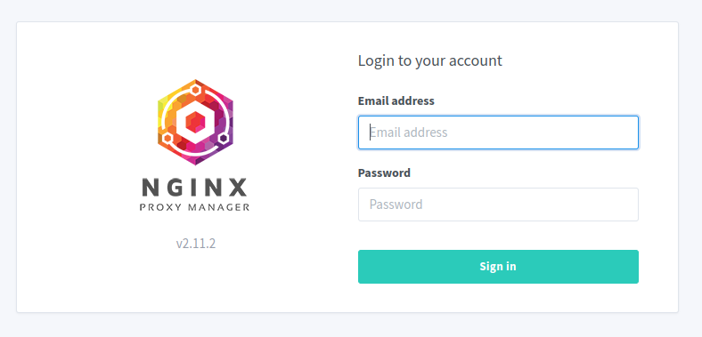

Se debe de mostrar UI con la opcion de ingresar usuario y contraseña que por defecto son 👇 para despues seguir el procedimiento que indica para cambiar por otras seguras.

```bash
Email:    admin@example.com
Password: changeme
```

### Portainer [page](https://docs.portainer.io/start/install-ce/server/docker/linux) 🔗 ↗️

- [Portainer Github](https://github.com/portainer/portainer)
- [Portainer Docs](https://docs.portainer.io/start/install-ce/server/docker/linux)

Para configurar **Portainer Community Edition (CE)** que es como Docker Desktop pero que funciona desde un contenedor y se instala en el VM para manegar los contenedores desde el VM de madera mas eficiente y no desde CLI

Primero se tiene que crear un volumen en la VM para el uso de portainer

```bash
docker volume create portainer_data
```

Descargar he instalar portainer usando Docker/container usando la misma red creada con Docker la que tambien es usada por Nginx Proxy Manager

```bash
docker run -d -p 8000:8000 --network=reverse_proxy_net --name portainer --restart=always -v /var/run/docker.sock:/var/run/docker.sock -v portainer_data:/data portainer/portainer-ce:latest
```

- `docker run`: This is the core command that instructs Docker to create and run a new container.
- `-d`: This flag tells Docker to run the container in detached mode. In simpler terms, the container will run in the background without attaching to the terminal.
- `-p 8000:8000`: This flag maps the container's port `8000` to the host machine's port `8000`. This allows you to access the Portainer web interface by visiting <http://localhost:8000> in your web browser.
- `--network=reverse_proxy_net`: This option specifies that the container should join a network named `reverse_proxy_net`. This network likely exists for communication between containers in your environment (assuming you have one set up).
- `--name portainer`: This flag assigns the name "portainer" to the container, making it easier to identify and manage.
- `--restart=always`: This option ensures that the Portainer container automatically restarts in case it crashes or the system reboots.
- `-v /var/run/docker.sock:/var/run/docker.sock`: This flag mounts the Docker socket on the host machine (/var/run/docker.sock) to the same location within the container (/var/run/docker.sock). This allows Portainer to access and manage Docker on the host machine.
- `-v portainer_data:/data`: This flag creates a volume named `portainer_data` and mounts it to the `/data` directory inside the container. This volume will persist data between container restarts, ensuring your Portainer configuration and settings are preserved.
- `portainer/portainer-ce:latest`: This specifies the image to use for the container. In this case, it's the official Portainer Community Edition image with the "latest" tag.

Confirmar que los dos contenedores Nginx Proxy Manager y Portainer

```bash
docker ps

# 👇

CONTAINER ID   IMAGE                             COMMAND        CREATED              STATUS              PORTS                                                                                  NAMES
XXXXXXXXXXXX   portainer/portainer-ce:latest     "/portainer"   About a minute ago   Up About a minute   9000/tcp, 0.0.0.0:8000->8000/tcp, :::8000->8000/tcp, 9443/tcp                          portainer
XXXXXXXXXXXX   jc21/nginx-proxy-manager:latest   "/init"        3 hours ago          Up 3 hours          0.0.0.0:80-81->80-81/tcp, :::80-81->80-81/tcp, 0.0.0.0:443->443/tcp, :::443->443/tcp   nginxproxymanager-app-1
```

Se puede revisar/verificar que los dos contenedores estan utilizando la misma red en la VM `reverse_proxy_net`

```bash
docker network inspect reverse_proxy_net
```

Exponer la UI de Portainer como reverse proxy en la VM con la IP de la VM y el puerto `81` ejecutando se `[IP-PUBLICA-MAQUINA]:81` (nginx-proxy-manager)

Se tiene que agregar un `Host`. En la UI `Host -> Proxy Host -> Add Proxy Host`

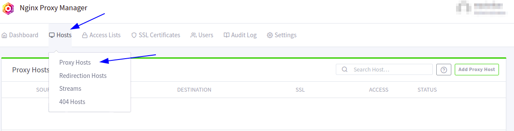
`

- En la pestaña `Details` en el campo `Domain Names` se agrega el sub-dominio creado para usarse para portainer `[NOMBRE-SUB_DOMINIO].[NOMBRE-DOMINIO].host`

  - En el campo `Forward Hostname / IP` se agrega el nombre del sub-dominio `portainer` <-- es el nombre del contenedor mostrado en `docker ps` anteriormente.
  - En el campo `Forward Port` se setea el puerto `9000`
  - Se activa la opción `Block Common Exploits`

- En la pestaña `SSL`
  - En el campo `SSL Certificate` se selecciona la opción `Request a new SSL Certificate`
  - Se activa la opción `Force SSL`
  - Se activa la opción `HTTP/2 Support`
  - Se activa la opción `I Agree to the Let's Encrypt Terms of Service`

Se guardan cambios **Save** para que se cree el certificado **SSL**

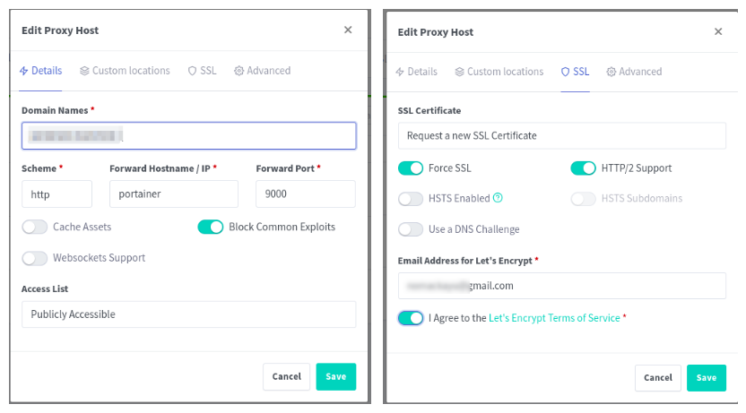

En la ruta de la UI `Host -> Proxy Host -> Add Proxy Host` click en el proxi host que tiene el dominio `[NOMBRE-SUB_DOMINIO].[NOMBRE-DOMINIO].host` para que aparesca la ventana de inicio/configuración de portainer para crear el usuario administrador con con usuario y contraseña fuertes.

Si no se muestra, se ejecuta el comando para reiniciar el comando portainer

```bash
docker restart portainer
```

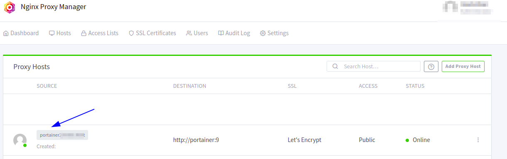

Cuando se crea el nuevo usuario y la contraseña ejecutar en caso de ser necesario al comando anterior para entrar al dashboard de portainer

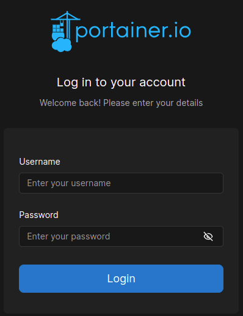

Para mostrar una pantalla de Portainer en el dominio `[NOMBRE-SUB_DOMINIO].[NOMBRE-DOMINIO].host` 👇

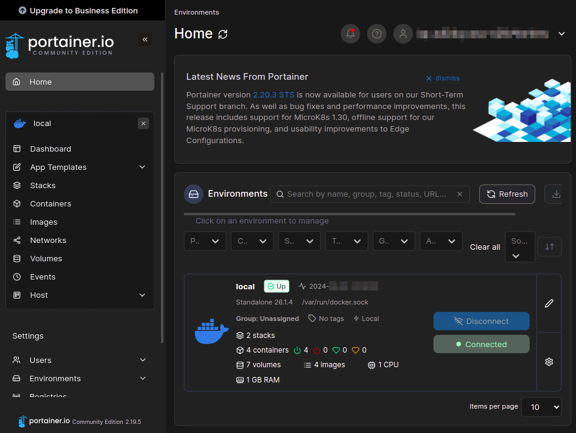

### Subir el proyecto de Django a la VM

En el usuario creado anteriormente [NEW-USER] se tiene que crear una carpeta para el proyecto de Django `app`

```bash
/home/[NEW-USER]/app
```

Dentro de la carpeta `app` se tiene que clonar el repositorio de github de la rama `main` con el comando

```bash
git clone [REPOSITORIO HTTPS o SSH] . # -> el punto es para que se clone en la carpeta actual
```

**Todoos** los archivos del repositorio se tienen que mover a la carpeta `app` y se tiene que crear un archivo `.env` para _produccion_

Una vez que se encuentre en la carpeta `app` el proyecto y con las variables de entorno para **producción** se tiene que ejecutar el siguiente comando para crear el contenedor de Docker

```bash
docker compose -f production.yml up --build -d --remove-orphans
```

Los siguientes son algunos comandos utiles para el manejo de los contenedores de Docker en el proyecto de Django

```bash
docker compose -f production.yml exec django python manage.py makemigrations
#
docker compose -f production.yml exec django python manage.py migrate
#
docker compose -f production.yml exec django python manage.py createsuperuser
#
docker compose -f production.yml exec django python manage.py collectstatic
#
```

Cuando se ejecuta el comando `build` de docker anterior en Portainer se tienen que mostrar los contenedores relacionados con el proyecto de Django junto con el contenedor de Nginx Proxy Manager y Portainer

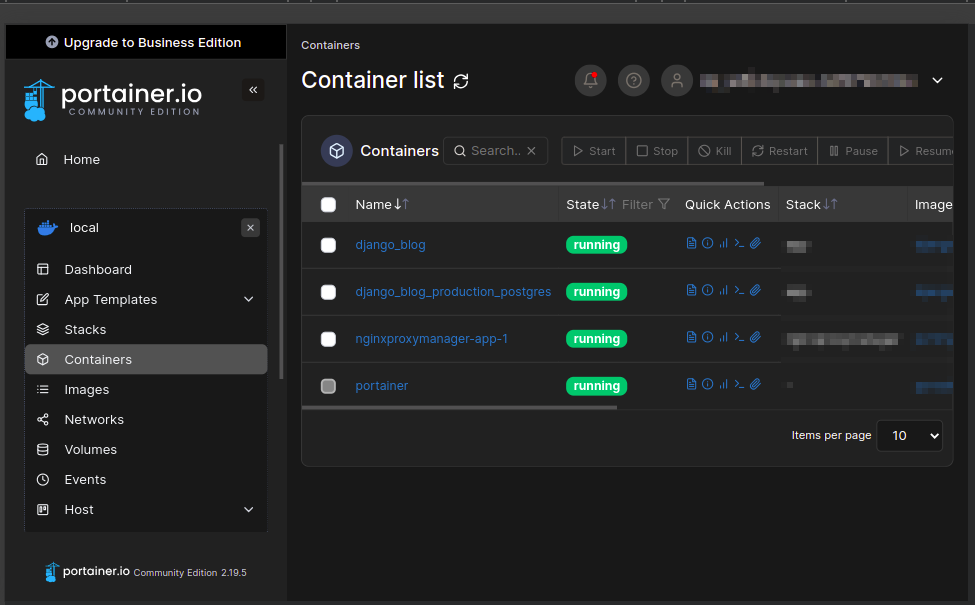

### Configuración en Nginx Proxy Manager de los dominios para el proyecto de Django

1. Agregar en "Nginx Proxy Manager" `[IP-PUBLICA-MAQUINA]:81` la un nuevo _host_, en la pestaña de `Hosts -> Proxy Hosts` del lado derecho agregar con el boton `Add Proxy Host`
2. Em la pestaña `Details`
   1. En el campo `Domain Names` se agrega el nombre del dominio `[NOMBRE-SUB_DOMINIO].[NOMBRE-DOMINIO].host` seguido tambien con el sub-dominio `www.[NOMBRE-SUB_DOMINIO].[NOMBRE-DOMINIO].host`
   2. En el campo `Forward Hostname / IP` se ingresa el nombre del servicio con el que se esta ejecutando en el archivo `production.yml` en el que ese esta ejecutando django.
   3. En el campo `Forward Port` se eingresa el puerto que esta declarado en el archivo `docker -> production -> django -> start`
   4. Se activa la opción `Block Common Exploits`
3. En la pestaña `Custtom Locations`
   1. Se agregan lo que se establecio en el archivo `docker/local/nginx/default.conf` en cada uno de los campos `Define location`
      - `home/root` se agrega `/` en el campo `Define location`, en `Forward Hostname / IP` se escribe el nombre que esta declarado en el archivo `docker/local/nginx/default.conf` en `location` dentro de la seccion de `server` y en el campo `Forward Port` se eingresa el puerto que esta declarado en el archivo `docker -> production -> django -> start`
      - Se agrega `/admin` en el campo `Define location`, en `Forward Hostname / IP` se escribe el nombre que esta declarado en el archivo `docker/local/nginx/default.conf` en `location` dentro de la seccion de `server` y en el campo `Forward Port` se eingresa el puerto que esta declarado en el archivo `docker -> production -> django -> start`
      - Se agrega `/staticfiles` en el campo `Define location`, en `Forward Hostname / IP` se escribe el nombre que esta declarado en el archivo `docker/local/nginx/default.conf` en `location` dentro de la seccion de `server` y en el campo `Forward Port` se eingresa el puerto que esta declarado en el archivo `docker -> production -> django -> start`
      - Se agrega `/mediafiles` en el campo `Define location`, en `Forward Hostname / IP` se escribe el nombre que esta declarado en el archivo `docker/local/nginx/default.conf` en `location` dentro de la seccion de `server` y en el campo `Forward Port` se eingresa el puerto que esta declarado en el archivo `docker -> production -> django -> start`r
4. En la pestaña `SSL`
   - En el campo `SSL Certificate` se selecciona `Request a new SSL Certificate`
   - Se activa `Force SSL`
   - Se activa `HTTP/2 Support`
   - Se activa `I Agree to the...`
5. `Save` 👇

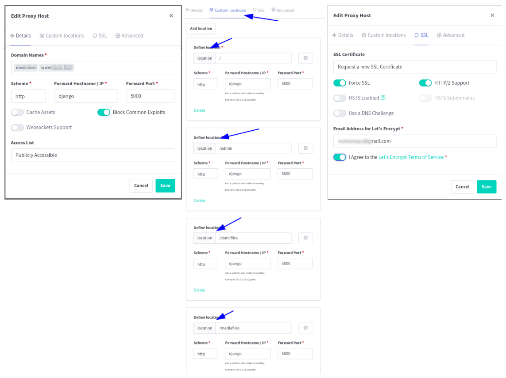

Cuando se acabe de generar el certificado SSL se muestra algo paraceido a la siguiente imagen

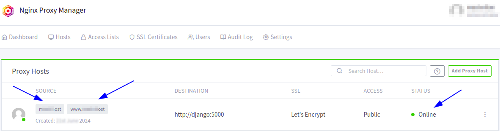

### Habilitar Nginx Prixy Manager UI sobre `https`

1. En la ruta `Host -> Proxy Host` se selecciona `Add Proxy Host`
   - En la pestaña `Details` en el campo `Domain Names` se agrega dominio previamente creado de tipo "A" que puede ser `proxymanager.<NOMBRE-DOMINIO>`
     - En la misma pestaña en el campo `Forward Hostname / IP` se escribe la IP de la VM
     - El en el campo `Forward Port` es el puerto `81`
     - La opción `Block Common Exploits` se activa
   - En la pestaña `SSL`
     - La op. `SSL Certificate` se selecciona `Request a new SSL Certificate`
     - La opción `Force SSL` se activa
     - La opción `HTTP/2 Support` se activa
     - En la opción `Email Address for Let's Encrypt` se escribe el correo electronico
     - Se activa la opción `I Agree to the Let's Encrypt Terms of Service`
   - Se guarda al configuración con el boton `Save`

👇

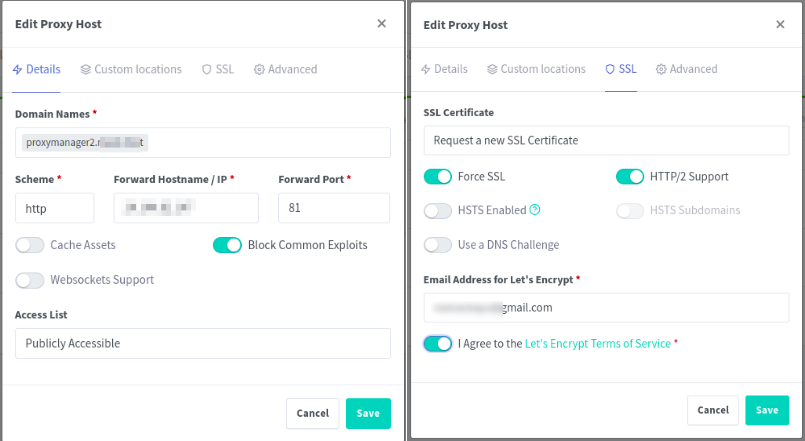

Dependiendo de la cantidad de contenedores/servicios que se ocupen en el proyecto de Django se tiene que agregar un nuevo _host_ en Nginx Proxy Manager para cada uno de los servicios que se ocupen en el proyecto de Django

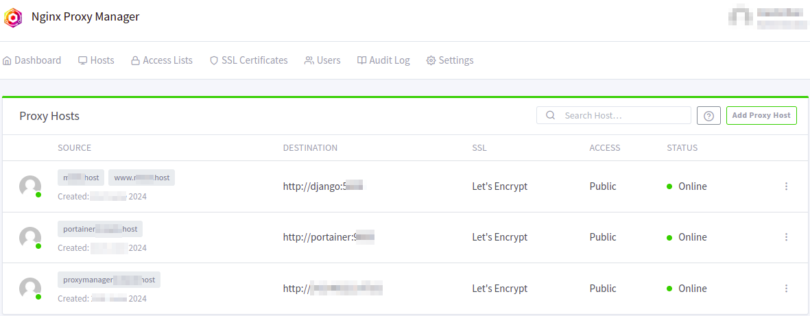

[[Volver al inicio]](#INDEX)
