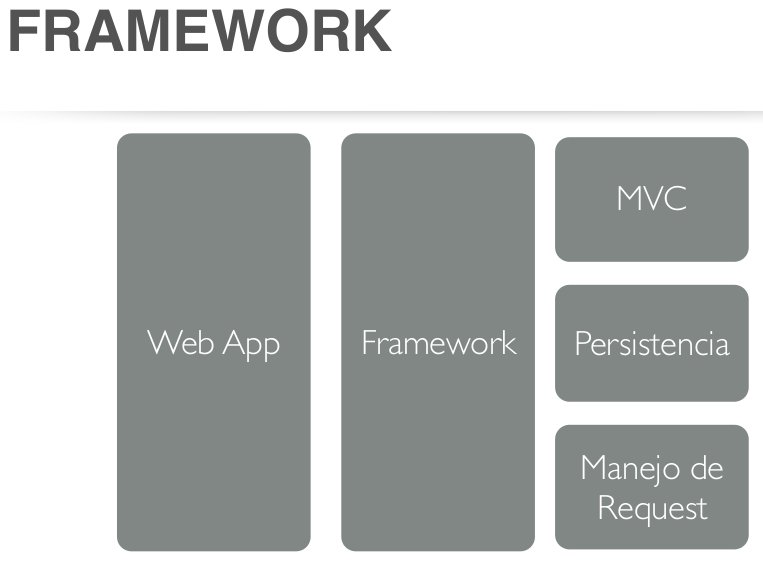
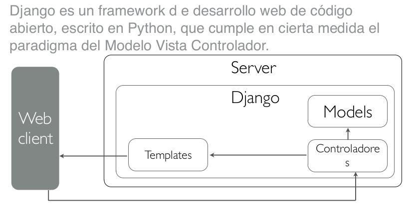
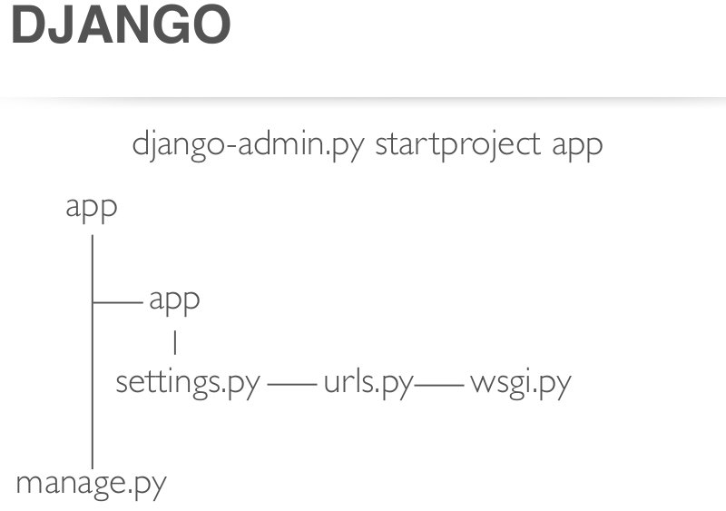
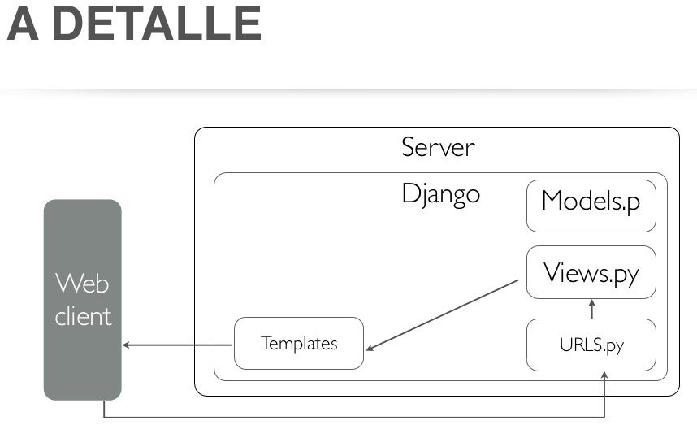
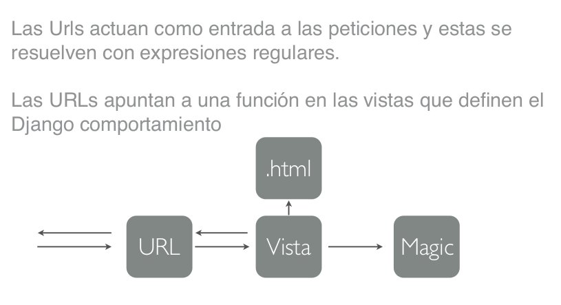
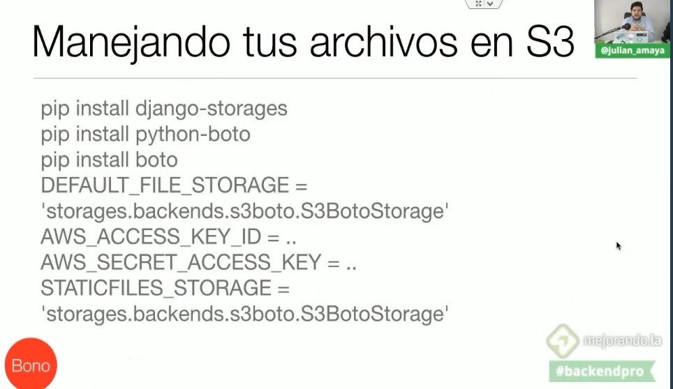
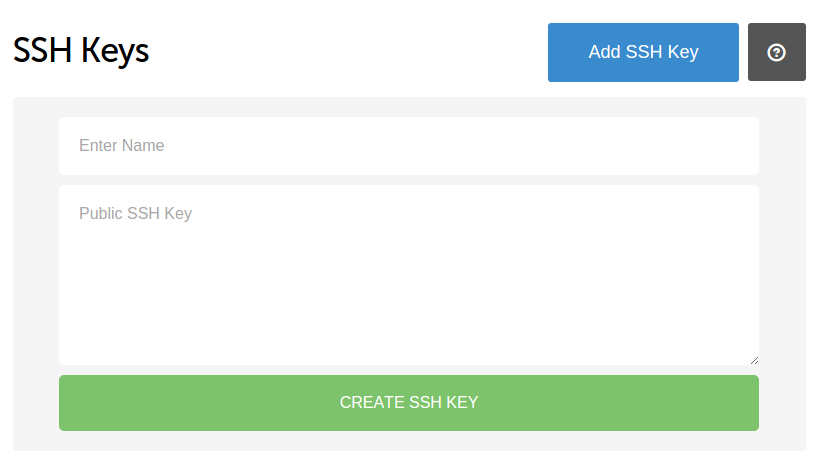
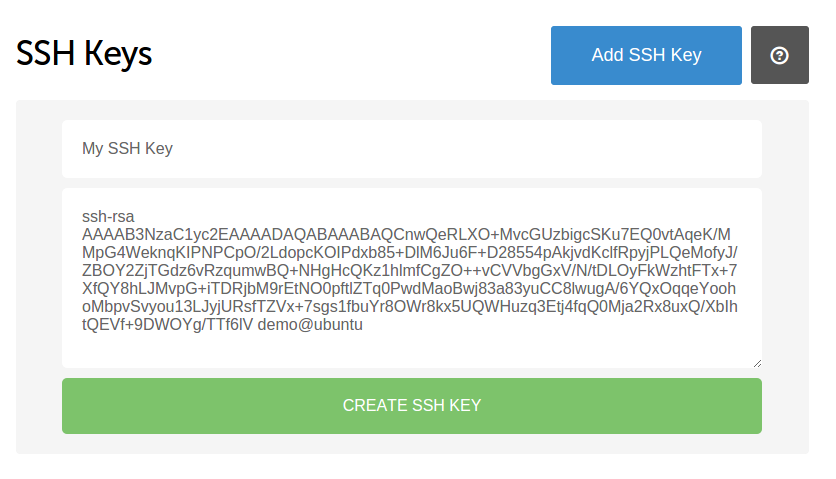
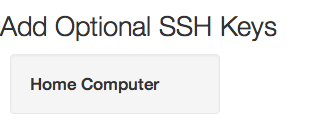

#### <a name="INDEX"> :whale2: + :snake: </a>

- [Django on Docker](#Django-on-Docker)
- [Django on Docker in progress](#Django-on-Docker-in-progress)
- [Docker With Django And Postgresql](#Docker-With-Django-And-Postgresql)

**NOTA**
Para remover/desinstalar un pro programa:

```bash
$ sudo apt-get purge --auto-remove [PACKAGE_NAME]
```

# Django en maquina de desarrollo.

## 1. Actualizar los paquetes de Ubuntu o del sistema Debian:

```bash
$ sudo apt install python3-pip python3-venv
```

```bash
$ pip install -r requirements.txt
```

### Actualizar el índice local de paquetes

```bash
$ sudo apt-get update
```

### Actualizar todos los paquetes que puedan ser actualizados

```bash
$ sudo apt-get dist-upgrade
```

### Remover los paquetes que no sean necesarios

```bash
$ sudo apt-get autoremove
```

### Reiniciar la maquina (solo necesario para algunas actualizaciones)

```bash
$ sudo reboot
```

## 2. Instalar build-essential y python dev

Build-essential es el paquete que provee todas las herramientas de compilación estándar de C.
Python-dev provee los archivos necesarios para compilar módulos Python/C.
Para instalar `pip` en Debian/Ubuntu

```bash
$ sudo apt-get install python-setuptools build-essential python-dev
```

### Para instalar pip en Debian/Ubuntu

:link: [GitHub - pypa/get-pip](https://github.com/pypa/get-pip)

```bash
$ # Install the latest version of pip
$ curl https://bootstrap.pypa.io/get-pip.py | python
$ # Install the latest version of pip, supported by a legacy Python
$ curl https://bootstrap.pypa.io/3.2/get-pip.py | python3.2
$ # Install a specific version of pip
$ curl https://bootstrap.pypa.io/get-pip.py | python - 'pip==8.0.0'
```

### Para instalar pip3 para Python 3.5+

```bash
$ sudo apt-get install python3-pip
```

Para verificar la instalación

```bash
# Python 2
$ pip -V
# Python 3
$ pip3 -V
```

## 3. Instalar pip en Debian/Ubuntu

```bash
sudo apt-get install python-pip
```

### Actualizar `pip`

```bash
$ pip install -U pip
$ pip install --upgrade pip
```

:link: https://pip.pypa.io/en/latest/installing.html  
**NOTA**: En caso de presentar un error con la instalación o funcionamiento de `pip` ó `pip3`

```bash
$ python2 -m pip install --user --upgrade pip
#
$ python3 -m pip install --user --upgrade pip
```

### :warning: PARA INSTALAR PAQUETES CON :snake: **PYTHON 3** DE FORMA ESPECIFICA/CORRECTA :warning:

```bash
$ python3 -m pip install --user [name_app]
# OR
$ python3 -m pip install --user --no-cache-dir [name_app]
# python3 -> Ocupar python3
# -m -> Ejecutar el modulo
# pip -> Ejecutar el modulo pip
# install -> Opcion, en este caso 'install'
# --user -> Instalar paquetes para el usuario actual, en lugar que para todos los usuarios del sistemas.
# --no-cache-dir -> desahabilitar cache
# Instalar <name_app>
```

### Listar los paquetes que se encuentran desactualizados

- :link: [how-to-update-all-python-packages](https://www.activestate.com/resources/quick-reads/how-to-update-all-python-packages/)

```bash
$ python3 -m pip list --outdate --format=columns
```

### :rotating_light: :construction: :construction: INFORMACIÓN OFICIAL DE PyPA(Python Packaging Authority) :construction: :construction: :rotating_light:

- :link: [Python Packaging Authority](https://www.pypa.io/en/latest/)
- :link: [Installing Packages](https://packaging.python.org/tutorials/installing-packages/)
- :link: [Managing Application Dependencies](https://packaging.python.org/tutorials/managing-dependencies/)

## 4. Instalar virtualenv y virtualenvwrapper

_Virtualenv_ se usa para aislar en ambientes virtuales diferentes los paquetes que vamos a instalar.  
_Virtualenvwrapper_ se usa para agilizar _virtualenv_

### Instalar virtualenv y virtualenvwrapper

```bash
# BETTER :ok:
$ python3 -m pip install --user virtualenv virtualenvwrapper
# NOT
$ sudo pip install virtualenv virtualenvwrapper
```

**NOTA**: En caso de presentar un error con la instalación o funcionamiento.  
En caso de que causar _error_ al momento de instalar `virtualenv` y `virtualenvwrapper` y no se puestre en la ruta `/usr/local/bin` el archivo `virtualenvwrapper.sh` intentar con el siguiente comando.

```bash
$ sudo -H pip3 install virtualenv
$ sudo -H pip3 install virtualenvwrapper
```

### Editar el archivo .bashrc con ayuda de vim

```bash
$ vim .bashrc
```

### Agregar la siguiente linea al final del archivo para habilitar el `virtualenvwrapper`

```bash
export WORKON_HOME=$HOME/.virtualenvs
export PROJECT_HOME=$HOME/[NOMBRE_DE_USUARIO]
source /usr/local/bin/virtualenvwrapper.sh # ESTO ES PARA LAS DISTRIBUCIONES DEBIAN Y UBUNTU
```

:warning: En caso de encontrarse con el siguiente error

```bash
/usr/bin/python: No module named virtualenvwrapper
virtualenvwrapper.sh: There was a problem running the initialization hooks.

If Python could not import the module virtualenvwrapper.hook_loader,
check that virtualenvwrapper has been installed for
VIRTUALENVWRAPPER_PYTHON=/usr/bin/python and that PATH is
set properly.
```

**Hacer lo siguiente:**  
Añadir la linea `export VIRTUALENVWRAPPER_PYTHON=/usr/bin/python3`  
Para que quede del siguiente modo.

```bash
export VIRTUALENVWRAPPER_PYTHON=/usr/bin/python3
export WORKON_HOME=$HOME/.virtualenvs
export PROJECT_HOME=$HOME/[NOMBRE_DE_USUARIO]
source /usr/local/bin/virtualenvwrapper.sh # ESTO ES PARA LAS DISTRIBUCIONES DEBIAN Y UBUNTU
```

Salvar y cerrar el editor. Salir y volver a acceder de la consola.

```bash
$ exit
```

### Lo anterior se hace para que no se tenga que hacer lo siguiente

```bash
$ source virtualenvwrapper.sh
$ workon NOMBRE_ENTORNO
```

Por defecto virtualenvwrapper crea todos los virtualenvs en la carpeta `~/.virtualenvs`. Sin embargo ese comportamiento se puede cambiar. Para eso se necesita agregar un par de variables de entorno al archivo `~/.bashrc` ó `~/.bash_profile`:

```bash
export WORKON_HOME=/opt/virtualenvs
export VIRTUALENVWRAPPER_HOOK_DIR=$WORKON_HOME/hooks
```

La variable `WORKON_HOME` determina en que directorio se deben crear los virtualenvs al ejecutar el comando mkvirtualenv.
La segunda variable, `VIRTUALENVWRAPPER_HOOK_DIR`, establece el directorio en donde se instalaran algunos scripts muy útiles que pueden ser usados para automatizar ciertas tareas, como por ejemplo hacer un commit a un repositorio justo antes de desactivar el _virtualenv_.

## 5. Crear un ambiente virtual

### Crear un ambiente virtual

```bash
$ mkvirtualenv <NOMBRE_DEL_AMBIENTE_VIRTUAL>
```

Para revisar el ambiente virtual cual es su version de python

```bash
$(nombre_ambiente_virtual) ~/ nombre_carpeta python --version
```

Output

```bash
python 2.7.6
```

Para saber en que ruta esta instalado python 2 & 3

```bash
$ which python2
```

Output

```bash
/usr/bin/python2
```

```bash
$ which python3
```

Output

```bash
/usr/bin/python3
```

**PARA CREAR UN AMBIENTE VIRTUAL CON UNA VERSION DE PYTHON ESPECIFICA**

```bash
#python 2
$ mkvirtualenv --python=/usr/bin/python2 <NOMBRE_DEL_AMBIENTE_VIRTUAL>
```

```bash
#python 3
$ mkvirtualenv --python=/usr/bin/python3 <NOMBRE_DEL_AMBIENTE_VIRTUAL>
```

### Algunos comandos útiles para el ambiente virtual:

### Desactivar ambiente virtual

```bash
$ deactivate
```

### Activar ambiente virtual o cambiar a otro

```bash
$ workon <NOMBRE_DEL_AMBIENTE_VIRTUAL>
```

### Mostrar lo paquetes instalados en un ambiente virtual

```bash
$ workon <NOMBRE_DEL_AMBIENTE_VIRTUAL>
```

```bash
$ pip freeze
```

### Listar los ambientes vistuales

```bash
$ lsvirtualenv
```

_lsvirtualenv [-b] [-l] [-h]_

- -b -> Brief mode, disables verbose output.
- -l -> Long mode, enables verbose output. Default.
- -h -> Print the help for lsvirtualenv.

### Mostrar los detalles de un solo ambiente vistual

```bash
$ showvirtualenv <NOMBRE DEL AMBIENTE VIRTUAL>
```

### Remover el ambiente virtual posicionando nos en la carpeta del proyecto

```bash
$ rmvirtualenv <NOMBRE DE LA CARPETA VIRTUAL> (Se tiene que desactivar primero el ambiente virtual)
```

### Calling lssitepackages shows the content of the site-packages directory of the currently-active virtualenv.

```bash
$ lssitepackages
```

### Mostrar todos los comandos

```bash
$ virtualenvwrapper
```

```
add2virtualenv: add directory to the import path
allvirtualenv: run a command in all virtualenvs
cdproject: change directory to the active project
cdsitepackages: change to the site-packages directory
cdvirtualenv: change to the $VIRTUAL_ENV directory
cpvirtualenv: duplicate the named virtualenv to make a new one
lssitepackages: list contents of the site-packages directory
lsvirtualenv: list virtualenvs
mkproject: create a new project directory and its associated virtualenv
mktmpenv: create a temporary virtualenv
mkvirtualenv: Create a new virtualenv in $WORKON_HOME
rmvirtualenv: Remove a virtualenv
setvirtualenvproject: associate a project directory with a virtualenv
showvirtualenv: show details of a single virtualenv
toggleglobalsitepackages: turn access to global site-packages on/off
virtualenvwrapper: show this help message
wipeenv: remove all packages installed in the current virtualenv
workon: list or change working virtualenvs
```

## 6 Crear un ambiente virtual con Python 3

### Crear un ambiente virtual

Se recomienda crear una carpeta en donde se encuentren todos los entornos virtuales de Python3 **(oculta)**

```bash
$ mkdir .[CARPETA-OCULTA]
```

```bash
# DENTRO DE LA CARPETA OCULTA
python3 -m venv [NOMBRE-DEL-ENTORNO-VIRTUAL]
```

Para activar el entorno virtual

```bash
$ source .[CARPETA-OCULTA]/[NOMBRE-DEL-ENTORNO-VIRTUAL]/bin/activate
```

Para desactivar el entorno virtual

```bash
([NOMBRE-DEL-ENTORNO-VIRTUAL])$ deactivate
```

- :link: [Using Different Versions of Python - pyenv](https://github.com/pyenv/pyenv)
- :link: [venv — Creation of virtual environments](https://docs.python.org/3/library/venv.html)

```bash
$ python -m venv -h

usage: venv [-h] [--system-site-packages] [--symlinks | --copies] [--clear]
            [--upgrade] [--without-pip]
            ENV_DIR [ENV_DIR ...]

Creates virtual Python environments in one or more target directories.

positional arguments:
  ENV_DIR               A directory to create the environment in.

optional arguments:
  -h, --help            show this help message and exit
  --system-site-packages
                        Give the virtual environment access to the system
                        site-packages dir.
  --symlinks            Try to use symlinks rather than copies, when symlinks
                        are not the default for the platform.
  --copies              Try to use copies rather than symlinks, even when
                        symlinks are the default for the platform.
  --clear               Delete the contents of the environment directory if it
                        already exists, before environment creation.
  --upgrade             Upgrade the environment directory to use this version
                        of Python, assuming Python has been upgraded in-place.
  --without-pip         Skips installing or upgrading pip in the virtual
                        environment (pip is bootstrapped by default)

Once an environment has been created, you may wish to activate it, e.g. by
sourcing an activate script in its bin directory.
```

## 7 Crear un ambiente virtual Pipenv

- :link: [Pipenv: Python Dev Workflow for Humans — pipenv 2018.11.27.dev0 documentation](https://pipenv.kennethreitz.org/en/latest/)
- :link: [Basic Usage of Pipenv](https://pipenv.kennethreitz.org/en/latest/basics/)

Instalar Pipenv

```bash
$ python3 -m pip install --user pipenv
# OR
$ pip3 install pipenv
```

Crear el ambiente virtual  
Dentro de la carpeta donde estaran los archivos del proyecto.

```bash
# CREAR UN AMBIENTE VIRTUAL CON PYTHON 3 CON EL NOMBRE DE LA CARPETA
$ pipenv --three
```

Eliminar el ambiente virtual  
Dentro de la carpeta donde estaran los archivos del proyecto.

```bash
$ pipenv --rm
```

Activar ambiente virtual  
Dentro de la carpeta donde se estan los archivos del proyecto.

```bash
$ pipenv shell
```

Salir/Desactivar del ambiente virtual

```bash
$ pipenv exit
```

Revisar la version de Python dentro del ambiente virtual

```bash
$ python --version
```

Instalar un paquete con Pipenv

```bash
$ pipenv install <NOMBRE_DE_PAQUETE>
```

Instalar un paquete con Pipenv con una version en especifico.

```bash
$ pipenv install django==1.11
```

Listar los paquetes instalados

```bash
$ pipenv lock -r
```

Desistalar un paquete dentro del emviente virtual

```bash
$ pipenv uninstall <nombre_del_paquete>
```

Instalar un paquete dentro del ambiente virtual **para desarrollo**

```bash
$ pipenv uninstall <nombre_del_paquete> --dev
```

Instalar paquetes en el ambiente virtual desde el archivo `requirements.txt`

```bash
$ pipenv install -r ./requirements.txt
```

Revisar vulnerabilidades en el ambiente virtual

```bash
$ pipenv check
```

Revisar las depencias dentro delos paquetes instalados en nustro ambiente virtual.

```bash
$ pipenv graph
```

Generar archivo `Pipfile.lock`

```bash
$ pipenv lock
```

> En caso especifico para manejar los comandos con **django**, se pueden hacer de forma normal.

## 8 Crear un ambiente virtual poetry

- :link: [Poetry home](https://python-poetry.org/)
- :link: [Poetry docs](https://python-poetry.org/docs/cli/)
- :octocat: [Poetry Github Home](https://github.com/python-poetry/poetry)

`$ poetry new [PROJECT-NAME]` : Crea un nuevo proyecto en python. En el lugar donde se ejecuta crea una carpeta con el nombre _[PROJECT-NAME]_ con los siguientes archivos archivos.

```bash
.
├── [PROJECT-NAME]
│   └── __init__.py
├── pyproject.toml
├── README.rst
├── tests
│   ├── __init__.py
│   └── test_[PROJECT-NAME].py
└── treee.txt
```

- `$ poetry init` : Crea el archivo `pyproject.toml` interactivamente; no importa si ya existe previamente.
- `$ poetry install` : Instala los paquetes que estan dentro de archivo `pyproject.toml`. Si hay un archivo `poetry.lock` en el directorio actual, usará las versiones exactas de allí en lugar de resolverlos. Esto asegura que todos los que usan la biblioteca obtendrán las mismas versiones de las dependencias.
- `$ poetry add [PACKAGE-NAME]` : Instalal un paquete en el ambiente virtual.
- `$ poetry add -D [PACKAGE-NAME]` : Instala un paquete en el ambiente virtual para desarrollo.
- `$ poetry show` : Para listar todos los paquetes disponibles.
- `$ poetry remove [PACKAGE-NAME]` : Desinstala un paquete en el ambiente virtual.
- `$ poetry remove -D [PACKAGE-NAME]` : Desistala un paquete en el ambiente virtual para desarrollo.
- `$ poetry update` : Para conseguir las ultimas versiones de las depencias y actualizar el archivo `poetry.lock`.
- `$ poetry shell` : Crea si no lo esta; el ambiente virtual con la versión de python que esta indicando en el archivo `pyproject.toml`. Para salir del ambiente virtual `exit`
- `$ poetry build` : Crea el paquete que se encuentra en el projecto, listo para publicarlo y que otros lo instalen y usen.
- `$ poetry publish` : Publica el paquete en Pypi.
- `$ poetry publish --build` : Crea y publica el paquete.
- `$ poetry self:update` : Actualiza poetry a la ultima versino estable.

:1234: Pasos

1. Crear un nuevo proyecto `$ poetry new [PROJECT-NAME]`
2. Modificar el archivo `pyproject.toml` para indicar que version de python se desea ocupar

```bash
[tool.poetry.dependencies]
python = "^3.7"
```

3. Creear el ambiente virtual `$ poetry install`
4. Crear\Entrar al ambiente virtual `$ poetry shell`

## 9 Crear un ambiente virtual Conda

- :link: :traffic_light: [Conda](https://docs.conda.io/en/latest/)
- :link: [Download anaconda individual](https://www.anaconda.com/products/individual)
- :link: [User guide](https://docs.anaconda.com/anaconda/user-guide/?utm_source=anaconda.com&utm_medium=individual-get-started)
- :link: :notebook: [Anaconda-Starter-Guide](https://docs.anaconda.com/anaconda/user-guide/cheatsheet/)
- :link: []()
- :link: []()

```bash
$ conda
```

Display information about current conda install

```bash
$ conda info
```

Crear un ambiente virtual con python 3.5.10

```bash
$ conda create --name demo python=3.5.10
```

Activar el ambiente virtual

```bash
$ conda activate demo
```

Deshactivar el ambiente virtual

```bash
$ conda deactivate
```

Listar los anvientes virtuales

```bash
$ conda info --envs
#
$ conda env list
```

Eliminar un amviente virtual

```bash
$ conda env remove --name demo
#
$ conda env remove -n demo
```

### Actualizar las versiones de los paquetes en "requirements.txt"

Mostrar una lista de los paquetes que se encuentran desactualizados ó que ya hay versiones nuevas para instalar en caso de ser necesario.
Se mostrará una lista con las versiones actuales(instaladas) y versiones nuevas del lado derecho.

```bash
$ pip list --outdated
```

Instalar el paquete mediante `pip` fuera del ambiente virtual(prefrerentemente) como lo recomienta el manual.

- :link: [pip-upgrader](https://github.com/simion/pip-upgrader)

```bash
$ pip install pip-upgrader
# Note: this packages installs the following requirements: 'docopt', 'packaging', 'requests', 'terminaltables', 'colorclass'
```

> To avoid installing all these dependencies in your project, you can install `pip-upgrader` in your system, rather than your virtualenv. If you install it in your system, and need to upgrade it, run `pip install -U pip-upgrader`

```bash
requirements_file(s)          The requirement FILE, or WILDCARD PATH to multiple files. (positional arguments)
--prerelease                  Include prerelease versions for upgrade, when querying pypi repositories.
-p <package>                  Pre-choose which packages tp upgrade. Skips any prompt.
--dry-run                     Simulates the upgrade, but does not execute the actual upgrade.
--skip-package-installation   Only upgrade the version in requirements files, don\'t install the new package.
--skip-virtualenv-check       Disable virtualenv check. Allows installing the new packages outside the virtualenv.
--use-default-index           Skip searching for custom index-url in pip configuration file(s).
```

ejemplo:

```bash
$ pip-upgrade             # auto discovers requirements file. Prompts for selecting upgrades
$ pip-upgrade requirements.txt
$ pip-upgrade requirements/dev.txt requirements/production.txt

# skip prompt and manually choose some/all packages for upgrade
$ pip-upgrade requirements.txt -p django -p celery
$ pip-upgrade requirements.txt -p all

# include pre-release versions
$ pip-upgrade --prerelease
```

### :chart_with_upwards_trend: Generar MER(UML) diagrama de los modelos de django :chart_with_downwards_trend:

:link: [django-extensions](https://django-extensions.readthedocs.io/en/latest/graph_models.html)

```bash
# DENTRO DEL ambiente VIRTUAL
$ pip install django-extensions
```

Instalar django-extensions en django

```bash
# setings.py
INSTALLED_APPS = (
    ...
    'django_extensions',
    ...
)
```

Instalar los generadores

- Graphviz
- Dotplus

```bash
$ sudo apt-get install graphviz libgraphviz-dev pkg-config
```

Dentro del ambiente virtual

```bash
$ pip install pygraphviz
$ pip install pydot
```

Para generar el modelo grafico.

```bash
$ python manage.py graph_models -e -g -l dot -o core.png core # olny app core
$ python manage.py graph_models -a -g -o eventex.png # all
```

## Estructura de django para crear proyectos

1. Crear una carpeta con el nombre de la carpeta del proyecto con la primera letra en mayúsculas.
2. `$ mkvirtualenv <Nombre del ambiente virtual>` (Esto es para crear en una sola carpeta las carpetas bin, include, lib, local) y la carpeta la crea en `/home/rodolfo/.virtualenvs/<NOMBRE DE LA CARPETA CREADA>`

- Para instalar django (estando dentro del ambiente virtual),

```bash
$ pip install django
```

2.1. Para instalar una actualización **ESPECIFICA** en el ambiente virtual con pip

```bash
$ pip install --upgrade django==1.6.5
```

2.2. Para instalar la **ULTIMA** actualizacón en el ambiente virtual con pip

```bash
$ pip install -U Django
```

3. Crear un proyecto en django

```bash
$ django-admin.py startproject [NombreDeTuProyecto]
```

Despues de hacer hacer el proyecto se tiene que ceacrear las tablas del proyecto, con el siguiente comando.  
Crea\prepara las migraciones para cualquier cambio que se halla echo para despues aplicarlas.

```bash
$ python manage.py makemigrations
```

Despues para aplicar las migraciones se ejecuta el sig comando; de esta manera los cambios echos a las BD se aplican y en caso de aver errores se mostraran en pantalla

```bash
$ python manage.py migrate
```

salida..

```bash
Operations to perform:
  Apply all migrations: admin, auth, contenttypes, sessions
  Running migrations:
  Applying contenttypes.0001_initial... OK
  Applying auth.0001_initial... OK
  Applying admin.0001_initial... OK
  Applying admin.0002_logentry_remove_auto_add... OK
  Applying contenttypes.0002_remove_content_type_name... OK
  Applying auth.0002_alter_permission_name_max_length... OK
  Applying auth.0003_alter_user_email_max_length... OK
  Applying auth.0004_alter_user_username_opts... OK
  Applying auth.0005_alter_user_last_login_null... OK
  Applying auth.0006_require_contenttypes_0002... OK
  Applying auth.0007_alter_validators_add_error_messages... OK
  Applying auth.0008_alter_user_username_max_length... OK
  Applying sessions.0001_initial... OK
```

Esto se hace para poder crear la BD inicial del proyecto y despues se tiene que crear el usuario (super usuario) para que tenga acceso sin restriciones al proyecto y a las aplicaciones.

```bash
$ python manage.py createsuperuser
```

_NOTA_: Se tiene que crear un usuario y la contraseña tiene que cimplir con los requerimientos NUEVOS de seguridad.  
Para correr el proyecto se ejecuta entramos a `http://localhost:8000/admin - http://127.0.0.1:8000/admin` y entramos con el usuario y contraseña anterior puestas

```bash
$ python manage.py runserver
```

_NOTA:_ ejecutando el siguiente comando nos muestra todas las opciones que podemos realizar cuando esta correctamente instalado

```bash
./manage.py
Type 'manage.py help <subcommand>' for help on a specific subcommand.

Available subcommands:

[auth]
  changepassword
  createsuperuser

[contenttypes]
  remove_stale_contenttypes

[django]
  check
  compilemessages
  createcachetable
  dbshell
  diffsettings
  dumpdata
  flush
  inspectdb
  loaddata
  makemessages
  makemigrations
  migrate
  sendtestemail
  shell
  showmigrations
  sqlflush
  sqlmigrate
  sqlsequencereset
  squashmigrations
  startapp
  startproject
  test
  testserver

[sessions]
  clearsessions

[staticfiles]
  collectstatic
  findstatic
  runserver
```

Para ejecutar el shell de python

```bash
$ python manage.py shell
```

- Con el shell de python se puede hacer CRUD en la B.D. Para revisar los datos que se modificaron a la tabla -> `$`
  4 Crear (app) aplicación en django para un proyecto

```bash
$ python manage.py startapp [NombreDeLaApp] (POR CONVENCIÓN LAS APPS/MODULOS SE CREA SU NOMBRE EN PLURAL)
```

## Administrador de django

### Cambiar/crear Nuevo Usuario en Django

```bash
$ ./manage.py createsuperuser [# LAS PREGUNTAS SIGUIENTES SE CONTESTAN CORRECTAMENTE]
$ ./manage.py changepassword [# POR DEFAULT TOMA EL DE SISTEMA, EN CASO DE NO EXISTIR EL USUARIO Y DE PREFERENCIA SE DEBE DE CREAR UNO NUEVO]
```

### Configuraciones para modificar/mejorar el administrador de django

`list_display` -> Permite mejorar los listados agregando múltiples columnas.

- Un campo o atributo del modelo
- Una función que reciba una instancia del modelo.
- Una función en el ModelAdmin

- `list_filter` -> Permite agregar filtros para cuando queremos ver solo algunos de los datos. ( la barra que se encuentra en la barra de la derecha )
- `search_fields` -> Permite realizar una búsqueda por texto sencilla automática.
- `list_editable` -> Permite editar campos directamente en la lista. NO PUEDE EDITAR EL PRIMER CAMPO DE LA LISTA.
- `actions` -> Permite ejecutar acciones para multiples elementos de la lista --como exportar en excel
- `raw_id_fields` -> Permite evitar muchos problemas de carga cuando hay MUCHOS modelos asociados.
- `inlines` -> Permite controlar modelos relacionados dese el administrador de un modelo.
- `filter_horizontal` -> O `filter_vertical` permiten que el manejo de ManyToMany sea mucho más sencillo.
- `Context processors` -> Es una manera sencilla de agregar todas a todas tus platillas, Es un elemento que permite agregar datos al contexto que usan las plantillas para renderizarse.

**Middlewares** -> Es un elemento que permite modificar _GLOBALMENTE_ el comportamiento de tu aplicación de django, modificando la entrada y la salida. Es agregar un **plug.in** para django.

- Necesita agregarle un dato a una sesión del usuario
- Necesita detectar el pais de un usuario y cambiar su información acorde
- Necesita agregar una variable HTTP
- Necesita mostrar información según el subdominio.

**APIs REST** -> REPRESENTATIONAL STATE TRANSFER, y fue propuesta en una tesis de doctorado. Usa los cuatro métodos HTTP ( GET, POST, PUT, DELETE ) para ejecutar diferentes operaciones, lo importante son los recursos.

- Para exponer tus datos a otros programas
- Para facilitar el desarrollo de frontend
- Para crear arquitecturas orientadas a servicios

## Cache Django

:link: https://docs.djangoproject.com/en/1.11/topics/cache/
¿Cuando usarlo?  
Cuando necesitas una información que consume tiempo de calcular, procesar o conseguir (traer tweets, fotos de instagram) Cuando quieres que todo vaya mucho más rapido

- Low level
- Por vista - Per view -> :link: https://docs.djangoproject.com/en/1.11/topics/cache/#the-per-site-cache
- En las plantillas
  En Django se tiene que llevar un orden para poner en los _Middleware_ el cache por vista. -> Middleware ordering

```bash
""" setting.py """
MIDDLEWARE = [
  'django.middleware.security.SecurityMiddleware',
  'django.middleware.cache.UpdateCacheMiddleware', # ESTO PARA USAR CACHING PERO EN PRODUCCION EN LA 2da LINEA
  'django.contrib.sessions.middleware.SessionMiddleware',
  'django.middleware.common.CommonMiddleware',
  'django.middleware.csrf.CsrfViewMiddleware',
  'django.contrib.auth.middleware.AuthenticationMiddleware',
  'django.contrib.messages.middleware.MessageMiddleware',
  'django.middleware.cache.FetchFromCacheMiddleware', # ESTO PARA USAR CACHING PERO EN PRODUCCION EN LA PENULTINA LINEA
  'django.middleware.clickjacking.XFrameOptionsMiddleware',
]
```

### Cache para las sesiones. Para un mejor rendimiento es posible utilizar en Django un backend de sesión basado en cache.

:link: https://docs.djangoproject.com/en/1.11/topics/http/sessions/#using-cached-sessions
Se pone en el `setings.py`  
Para no pegarle tanto a la b.d. Este cache funciona de manera simultanea. Cada escritura que se ahce en la cache tambien se hace en la BD. La sesion solo usa la BD si los datos no estan en la memoria cache.

```bash
SESSION_ENGINE = 'django.contrib.sessions.backends.cached_db'
```

A un más -- si no nos importa que se pierda la sesion. Esta opción es para una simple sesion de cache. La sesion se almacena en la cache directo. No es persistente, se borrara si se llena la cache o si el servidor es reiniciado.

```bash
SESSION_ENGINE = 'django.contrib.sessions.backends.cache'
```

## Cache con REDIS

### Instalar REDIS

- :link: :house: [Quickstart] (https://redis.io/topics/quickstart)
- :link: [Redis Security](https://redis.io/topics/security)
- :link: [How To Install and Secure Redis on Debian 9 DigitalOcean](https://www.digitalocean.com/community/tutorials/how-to-install-and-secure-redis-on-debian-9#step-1-%E2%80%94-installing-and-configuring-redis)

### Configurar redis en debian para que funcione de manera correcta en localhost y en producción en debian y ubuntu

```bash
sudo apt update
sudo apt install redis-server
```

#### 1.- Se edita el archivo "redis.conf"

```bash
$ sudo vim /etc/redis/redis.conf
```

En el archivo, encuentra la directiva `supervised`. Actualmente, esto está establecido en **no**. Como estamos ejecutando un O.S. (Debian[Buster]) que usa el sistema **init(systemd)**, podemos cambiar esto a **systemd**

```bash
# "/etc/redis/redis.conf"
# If you run Redis from upstart or systemd, Redis can interact with your
# supervision tree. Options:
# supervised no - no supervision interaction
# supervised upstart - signal upstart by putting Redis into SIGSTOP mode
# supervised systemd - signal systemd by writing READY=1 to $NOTIFY_SOCKET
# supervised auto - detect upstart or systemd method based on
# UPSTART_JOB or NOTIFY_SOCKET environment variables
# Note: these supervision methods only signal "process is ready."
# They do not enable continuous liveness pings back to your supervisor.
supervised systemd
```

Para que los cambios tengan efecto se reincia el servicio

```bash
$ sudo systemctl restart redis
```

#### 1.- Comprobando REDIS

```bash
$ sudo systemctl status redis

# SALIDA...
● redis-server.service - Advanced key-value store
   Loaded: loaded (/lib/systemd/system/redis-server.service; enabled; vendor preset: enabled)
   Active: active (running) since Sat 2019-02-16 13:35:18 CST; 1h 16min ago
     Docs: http://redis.io/documentation,
           man:redis-server(1)
  Process: 652 ExecStartPost=/bin/run-parts --verbose /etc/redis/redis-server.post-up.d (code=exited, status=0/SUCCESS)
  Process: 603 ExecStart=/usr/bin/redis-server /etc/redis/redis.conf (code=exited, status=0/SUCCESS)
  Process: 522 ExecStartPre=/bin/run-parts --verbose /etc/redis/redis-server.pre-up.d (code=exited, status=0/SUCCESS)
 Main PID: 651 (redis-server)
    Tasks: 3 (limit: 4915)
   Memory: 756.0K
      CPU: 7.460s
   CGroup: /system.slice/redis-server.service
           └─651 /usr/bin/redis-server 127.0.0.1:6379

Feb 16 13:35:17 mack systemd[1]: Starting Advanced key-value store...
Feb 16 13:35:17 mack run-parts[522]: run-parts: executing /etc/redis/redis-server.pre-up.d/00_example
Feb 16 13:35:18 mack run-parts[652]: run-parts: executing /etc/redis/redis-server.post-up.d/00_example
Feb 16 13:35:18 mack systemd[1]: Started Advanced key-value store.
```

#### 2.- Comprobando su funcionamiento

```bash
$ redis-cli
$ 127.0.0.1:6379> ping
$ 127.0.0.1:6379> PONG
$ 127.0.0.1:6379> set test "It's working!"
$ 127.0.0.1:6379> OK
$ 127.0.0.1:6379> get test
$ 127.0.0.1:6379> "It's working!"
$ 127.0.0.1:6379> exit
```

#### 3.- Redis Security

Abrir el el archivo `redis.conf` para solo permitir conexiones de `localhost`

```bash
$ sudo vim /etc/redis/redis.conf
```

Localizar la linea y quitar `#`si se encuentra

```bash
bind 127.0.0.1
```

Guardar. cerrar y re-iniciar el servicio Redis

```bash
$ sudo systemctl restart redis
```

Para comprobar que se realizaron los cambios se tiene que revisar con el siguiente comando `netstat`

```bash
$ sudo netstat -lnp | grep redis
#salida...

tcp        0      0 127.0.0.1:6379          0.0.0.0:*               LISTEN      10959/redis-server
```

### 3.1 (**SEGURIDAD**) Configurar contraseña para acceder a redis

Buscar en el archivo `/etc/redis/redis.conf`

```bash
# requirepass foobared
```

Descomentarlo y cambiarlo por:

```bash
requirepass [CONTRASEÑA]
```

**NOTA-1**
Para poder hacer una contraseña en la linea de comandos se puede hacer de la siguiente manera:

```bash
# Generate 32 bytes, base64 encode
$ openssl rand -base64 32
AkxB9lmNkDc80ZEuGR4B0lhQPdhwvTlTv95sANXYMYM=
```

Para que quede de la siguiente manera

```bash
/etc/redis/redis.conf
requirepass zi7pLVue2GpIS8ffGU1z/99+uEdVWm/5rAZ7Vl4K3NzFYDtZhjNzSV91BWWVs2BXfMzWgmUm+eru9h5P
```

Guardar. cerrar y re-iniciar el servicio Redis

```bash
$ sudo systemctl restart redis
```

**NOTA-2**:
Para poder hacer una contraseña en la linea de comandos se puede hacer de la siguiente manera:

```bash
$ echo "cualquer-texto" | sha512sum
```

```bash
$ echo "cualquer-texto" | sha512sum
```

salida..

```bash
8898c46dfd4e3e3f35082bfa1dae27e9e2d9991785828478f05fba38a98dd8ab5dc503658620684ed6cfa7b7d43c6d322c9ff9568b9c0b3c164b35f5d5191380
```

#### 4. Se crea el archivo para que el sistema systemd pueda administrarlo. Se creca el archivo y se edita con la siguiente

```bash
# vim /etc/systemd/system/redis.service
```

```bash
# /etc/systemd/system/redis.service
[Unit]
Description=Redis In-Memory Data Store
After=network.target

[Service]
User=redis
Group=redis
ExecStart=/usr/local/bin/redis-server /etc/redis/redis.conf
ExecStop=/usr/local/bin/redis-cli shutdown
Restart=always

[Install]
WantedBy=multi-user.target
```

Despues se tiene que **guardar** y **cerrar.**

- En la seccion **[Unit]** se añade la descripción y la deficinón del requerimiento que la red va a estar disponible antes de iniciar el servicio.
- En la sección **[Servicio]**, necesitamos especificar el comportamiento del servicio. Por razones de seguridad, no deberíamos ejecutar nuestro servicio como **root**. Deberíamos usar un usuario y un grupo dedicado, que llamaremos **redis** para simplificar. Que se creeara mas adelante.
- Para iniciar el servicio, solo debemos llamar al binario `redis-server`, apuntando a nuestra configuración. Para detenerlo, podemos usar el comando Redis `shutdown`, que se puede ejecutar con el binario `redis-cli`. Además, dado que queremos que Redis se recupere de los fallos cuando sea posible, configuraremos la directiva de reinicio en `always`:
- Finalmente en la sección **[Install]** definimos el objetivo del sistema `systemd` que deberia conectarse al servicio si esta habilitado(configurado para iniciar al arranque de la maquina)

#### 5. Crear los direcorios, archivos de redis y usuarios y grupos

Crear el **usuario** redis y **grupo** redis

```bash
# adduser --system --group --no-create-home redis
```

Se crea la carpeta `/var/lib`

```bash
#  mkdir /var/lib/redis
```

Se cambian el grupo y el usuario a quien pertence la carpeta y se cambian los permisos para restringir el acceso

```bash
# chown redis:redis /var/lib/redis
# chmod 770 /var/lib/redis
```

#### 6.- Iniciar, parar, reiniciar el servicio creado

```bash
# systemctl start redis
```

```bash
# systemctl status redis
```

```bash
# systemctl stop redis
```

salida...

```bash
➜ ~ systemctl status redis
● redis.service - Redis In-Memory Data Store
  Loaded: loaded (/etc/systemd/system/redis.service; disabled; vendor preset: enabled)
  Active: active (running) since Tue 2018-01-16 17:20:27 CST; 54min ago
 Main PID: 14706 (redis-server)
  Tasks: 4 (limit: 4915)
  Memory: 1.0M
  CPU: 5.092s
  CGroup: /system.slice/redis.service
  └─14706 /usr/local/bin/redis-server 127.0.0.1:6379
```

#### 7. Hacer las pruebas para comprobar si funciona redis

#### 8. Para hacer que el servicio se inicie al inicio

```bash
# systemctl enable redis
```

salida...

```bash
Created symlink from /etc/systemd/system/multi-user.target.wants/redis.service to /etc/systemd/system/redis.service.
```

### Instalar Redis cache backend for Django

Para que funcione django con redis se tienen que instalar el paquete django-redis

- :link: https://github.com/niwinz/django-redis
- :link: http://niwinz.github.io/django-redis/latest/
  Para que se hagan las configuraciones.  
  En el (dentro) ambiente del trabajo del proyecto:

```bash
$ pip install django-redis
```

En el `settings.py` de queda de la iguiente manera:

```bash
""" CACHE """
CACHES = {
  "default": {
  "BACKEND": "django_redis.cache.RedisCache",
  "LOCATION": os.environ['CACHELOCATION'],
  "OPTIONS": {
       "CLIENT_CLASS": "django_redis.client.DefaultClient",
       "PASSWORD": os.environ['CACHEPSWD'],
       }
  }
}
""" CACHE """
```

## Templates

Configuración para que busque en todas las carpetas del proyecto la carpeta **templates**

```bash
TEMPLATES = [
  {
       'BACKEND': 'django.template.backends.django.DjangoTemplates',
        # SE LE DICE A DJANGO QUE BUSQUE LA CARPETA templates
       'DIRS': [os.path.join(os.path.dirname(__file__), 'templates'), ],
        # SE LE DICE A DJANGO QUE EN CADA APP BUSQUE LA CARPETA templates
       'APP_DIRS': True,
       'OPTIONS': {
       'context_processors': [
            'django.template.context_processors.debug',
            'django.template.context_processors.request',
            'django.contrib.auth.context_processors.auth',
            'django.contrib.messages.context_processors.messages',
             # CUSTOM CONTEXT_PROCESSOR
            'muebleria.context_processors.lista_link_muebles_relacionados',
            ],
       },
  },
]
```

## Estatic & Media files

En el archivo `settings.py` va la siguiente configuración.

```bash
""" [STATIC & MEDIA FILES] """

STATIC_URL = '/static/'

MEDIA_URL = '/media/'

STATICFILES_DIRS = (
  os.path.join(BASE_DIR, 'static'),
)

"""
SE ANADE LA RUTA PARA STATIC Y MEDIA FILES AFUERA DE CARPETA DE PROYECTO EN CARPETA COLLECT_STATIC
"""
STATIC_ROOT = os.path.join(os.path.dirname(BASE_DIR), "COLLECT_STATIC", "static_root")
MEDIA_ROOT = os.path.join(os.path.dirname(BASE_DIR), "COLLECT_STATIC", "media_root")

""" [STATIC & MEDIA FILES] """
```

En el `archivo url.py` que se encuentra al mismo nivel del archivo `settings.py`

```bash
if settings.DEBUG:
  """
  PARA SERVIR LOS ARCHIVOS ESTATICOS EN DESARROLLO
  """
  urlpatterns += static(settings.STATIC_URL, document_root=settings.STATIC_ROOT)
  urlpatterns += static(settings.MEDIA_URL, document_root=settings.MEDIA_ROOT)
```

## Administración de las contraseñas en Django

- Se ocupa de preferencia **Argon2** :link: https://docs.djangoproject.com/en/2.0/topics/auth/passwords/#using-argon2-with-django
- Par apoder ocupar **Argon2** se tienen que instalar en el ambiente de del proyecto. :link: https://pypi.python.org/pypi/argon2_cffi/

```bash
$ pip install argon2-cffi
```

```bash
""" settings.py """
PASSWORD_HASHERS = [
  'django.contrib.auth.hashers.Argon2PasswordHasher',
  'django.contrib.auth.hashers.PBKDF2PasswordHasher',
  'django.contrib.auth.hashers.PBKDF2SHA1PasswordHasher',
  'django.contrib.auth.hashers.BCryptSHA256PasswordHasher',
  'django.contrib.auth.hashers.BCryptPasswordHasher',
]
```

## Manejando archivos en AWS S3



## Instalar git

Para instalar git la versión mas reciente del link

- :link: https://github.com/git/git.git
- :link: https://www.kernel.org/pub/software/scm/git/

```bash
$ sudo apt-get update
$ sudo apt-get install git
$ sudo apt-get update
```

```bash
$ sudo apt-get install libcurl4-gnutls-dev libexpat1-dev gettext libz-dev libssl-dev
```

```bash
$ wget https://github.com/git/git/archive/v1.9.2.zip -O git.zip
```

```bash
$ unzip git.zip
$ cd git-XXX
$ make prefix=/usr/local all
$ sudo make prefix=/usr/local install
```

## Paso_GIT

**HACER LA LLAVE SSH**
Si quiere crear un par de llave RSA en vez de DSA solo debe usar -t rsa ( no debe especificar el largo "-b" por defecto el largo para RSA es de 4096 y es suficiente)

```bash
$ ssh-keygen -t rsa -b 4096 -C "comentario_de_la_llave+your_email@example.com" -> frase_de_la_llave
```

## Adding your SSH key to the ssh-agent

Before adding a new SSH key to the ssh-agent to manage your keys, you should have [checked for existing SSH](https://help.github.com/articles/checking-for-existing-ssh-keys/) keys and [generated a new SSH key](https://help.github.com/articles/generating-a-new-ssh-key-and-adding-it-to-the-ssh-agent/#generating-a-new-ssh-key)

1. Start the ssh-agent in the background.

```bash
$ eval "$(ssh-agent -s)"
Agent pid 59566
```

2. Add your SSH private key to the ssh-agent. If you created your key with a different name, or if you are adding an existing key that has a different name, replace id_rsa in the command with the name of your private key file.

```bash
$ ssh-add ~/.ssh/id_rsa
```

3. Add the SSH key to your GitHub account.Copy the SSH key to your clipboard.
   If your SSH key file has a different name than the example code, modify the filename to match your current setup. When copying your key, don't add any newlines or whitespace.

```bash
$ sudo apt-get install xclip
# Downloads and installs xclip. If you don't have `apt-get`, you might need to use another installer (like `yum`)

$ xclip -sel clip < ~/.ssh/id_rsa.pub
# Copies the contents of the id_rsa.pub file to your clipboard
```

**NOTA**.- Tip: If xclip isn't working, you can locate the hidden .ssh folder, open the file in your favorite text editor, and copy it to your clipboard.

4. In the upper-right corner of any page, click your profile photo, then click Settings.
5. Authentication keysIn the user settings sidebar, click SSH and GPG keys.
6. SSH Key buttonClick New SSH key or Add SSH key.
7. In the "Title" field, add a descriptive label for the new key. For example, if you're using a personal Mac, you might call this key "Personal MacBook Air".
8. The key fieldPaste your key into the "Key" field.
9. The Add key buttonClick Add SSH key.
10. Sudo mode dialogIf prompted, confirm your GitHub password.

## Probando su conexión ssh

After you've set up your SSH key and added it to your GitHub account, you can test your connection.  
Before testing your SSH connection, you should have:

- [Checked for existing SSH keys](https://help.github.com/articles/checking-for-existing-ssh-keys)
- [Generated a new SSH key](https://help.github.com/articles/generating-a-new-ssh-key-and-adding-it-to-the-ssh-agent)
- [Added a new SSH key to your GitHub account](https://help.github.com/articles/adding-a-new-ssh-key-to-your-github-account)

1. Abrir la terminal y

```bash
$ ssh -T git@github.com
```

# Attempts to ssh to GitHub

Se mostraran mensajes de advertencia ejem:

```bash
The authenticity of host 'github.com (192.30.252.1)' can't be established.
RSA key fingerprint is 16:27:ac:a5:76:28:2d:36:63:1b:56:4d:eb:df:a6:48.
Are you sure you want to continue connecting (yes/no)?

The authenticity of host 'github.com (192.30.252.1)' can't be established.
RSA key fingerprint is SHA256:nThbg6kXUpJWGl7E1IGOCspRomTxdCARLviKw6E5SY8.
Are you sure you want to continue connecting (yes/no)?
```

**Nota**: The example above lists the GitHub IP address as 192.30.252.1. When pinging GitHub, you may see a range of IP addresses. For more information, see "What IP addresses does GitHub use that I should whitelist?"

2. Verify that the fingerprint in the message you see matches one of the messages in step 2, then type yes:

```bash
Hi username! You've successfully authenticated, but GitHub does not
provide shell access.
```

You may see this error message:

```bash
Agent admitted failure to sign using the key.
debug1: No more authentication methods to try.
Permission denied (publickey).
```

This is a known problem with certain Linux distributions. For more information, see "[Error: Agent admitted failure to sign](https://help.github.com/articles/error-agent-admitted-failure-to-sign)".
Verify that the resulting message contains your username. If you receive a "permission denied" message, see "[Error: Permission denied (publickey)](https://help.github.com/articles/error-permission-denied-publickey)".  
Para entrar vía terminal a maquina remota vía ssh

```bash
$ ssh root@XXX.XXX.XXX.XXX -> Después pedirá cambia la contraseña por otra nueva "xxxxxxxxxxxxxxx"
```

Para que se pueda conectar el VPS con nuestro repositorio en github se tiene que hacer una llave ssh en el usuario en el que se esta ejecutando nuestra aplicación.  
Cuando se crea la llave ssh, en el repositorio de github se añade. Con nombre lacanteramack854JdsK

```bash
$ ssh-keygen -t rsa -b 4096 -C "comentario_de_la_llave" -> Frase contrasena_de_la_llave
```

Cuando se crea la llave ssh y esta instalal en github ahora en nuestra sesión de nuestro usuario en vps dentro de la carpeta donde se encuentra manage.py y dentro del ambiente virtual se ejecuta

```bash
$ git init
```

Se agrega la dirección del repositorio remoto

```bash
$ git remote add origin [REPOSITORIO HTTPS o SSH]
```

Se comprueba que se añadieron correctamente

```bash
$ git remote -v
```

Para descargar/jalar el repositorio a nuestro vps, tiene que ser de la rama master

```bash
$ git pull origin master -> Piede el password del ssh
```

## Instalar gunicorn, nginx, postgresql

### Para instalar gunicorn :link: [gunicorn.org](http://gunicorn.org/)

> The gateway translates the request received from the web server so the application can handle it. The gateway is often responsible for logging and reporting as well. We will use Gunicorn as our Gateway for this tutorial.

Dentro del ambiente virtual del proyecto.

```bash
$ pip install gunicorn
```

### Para instalar nginx :link: [nginx.com](https://www.nginx.com/)

> nginx (pronunciado en inglés “engine X”) es un servidor web/proxy inverso ligero de alto rendimiento y un proxy para protocolos de correo electrónico (IMAP/POP3). https://nginx.org/en/

> The web server receives an HTTP request from the client (the browser) and is usually responsible for load balancing, proxying requests to other processes, serving static files, caching and more. The web server usually interprets the request and sends it to the gateway.

```bash
$ sudo apt-get install nginx
```

### Instalar PostgreSql :link: https://www.postgresql.org/

En debian 9  
Añadir en el archivo `/etc/apt/sources.list`

```bash
deb http://apt.postgresql.org/pub/repos/apt/ stretch-pgdg main
```

Importar la key

```bash
# wget --quiet -O - https://www.postgresql.org/media/keys/ACCC4CF8.asc | sudo apt-key add -
```

Para que quede de la siguiente mandera:

```bash
# PostgreSQL
deb http://apt.postgresql.org/pub/repos/apt/ stretch-pgdg main
# wget --quiet -O - https://www.postgresql.org/media/keys/ACCC4CF8.asc | sudo apt-key add -
```

```bash
# apt-get install postgresql postgresql-client postgresql-contrib libpq-dev
```

### Instalar boto3 & django-storages

> Boto3 es un **SDK** "Software Development Kid" de "Amazon Web Services" **AWS** para **python**, que permite a los usuarios escribir software para hacer uso de los servicios de **AWS S3 y EC2**

- :link: - http://boto3.readthedocs.io/en/latest/
- :link: - https://github.com/boto/boto3

Estando dentro del ambiente virtual del proyecto

```bash
$ pip install boto3
```

> django-storages, es una colección de backends de almacenamiento personalizados para Django y boto3.

- :link:- https://django-storages.readthedocs.io/en/latest/
- :link:- https://github.com/jschneier/django-storages

Estando dentro del ambiente virtual.

```bash
$ pip install django-storages
```

Se añade `storages` en el archivo **settings.py**

```bash
INSTALLED_APPS = (
  ...
  'storages',
  ...
)
```

## Usar diferentes archivos **settings**, para poder trabajar con diferentes ambientes.

ejemplo:

```bash
settings/
     __init__.py
     base.py
     local_audreyr.py
     local_pydanny.py
     local.py
     staging.py
     test.py
     production.py
```

ejemplo:

```bash
[PROYECTO]
├── OLD_settings.py
├── settings
│   ├── base.py
│   ├── dev.py
│   ├── __init__.pyc
│   └── prod.py
├── urls.py
└── wsgi.py
```

Para ejecutar los diferentes tipos de ambientes se hace de la siguiente manera

```bash
$ ./manage.py runserver --settings=<NOMBRE_DEL_PROYECTO>.settings.<NOMBRE_DEL_ARCHIVO_QUE_ESTAMOS_CORRIENDO>
```

```bash
$ ./manage.py runserver --settings=NOMBRE_DEL_PROYECTO.settings.prod
```

## Crear un "droplet" en digitalocean

- Antes de crear el droplet se tiene que crear la llave ssh

```bash
$ ssh-keygen -t rsa -b 4096 -C "comentario_de_la_llave+your_email@example.com"
```

y se guarda en `~/.ssh/<LLAVE> <LLAVE.pub>`

```bash
$ ssh-keygen -t rsa -b 4096 -C "COMENTARIO_DE_LA_LLAVE+YOUR_EMAIL@EXAMPLE.COM"
Generating public/private rsa key pair.
Enter file in which to save the key (/home/mack/.ssh/id_rsa): <FRASE_DE_LA_LLAVE>
Enter passphrase (empty for no passphrase): [SE_ESCRIBE_LA_FRASE]
Enter same passphrase again: [SE_ESCRIBE_LA_FRASE]
Your identification has been saved in xxxxxxxx_xxxxxxx_xxxxx_xxxxx.
Your public key has been saved in xxxxxxxx_xxxxxxx_xxxxx_xxxxx.pub.
The key fingerprint is:
SHA256:Lo1yGGq1tFSKqe+YLm4rdAW5M9Ahl4ZBP9sDy3tQq6c COMENTARIO_DE_LA_LLAVE+YOUR_EMAIL@EXAMPLE.COM
The key's randomart image is:
+---[RSA 4096]----+
|.++o+ |
| o+* |
| o+o.. |
| .*B+. |
| o=X+ S |
| o *+=.+ |
|o +o=o+ o |
|o* +o . |
|O=+E |
+----[SHA256]-----+
```

Ya que se tiene la llave creada se tiene en entrar al panel de control, y abrir la página [SHH Page](https://cloud.digitalocean.com/settings/security) y seleccionar el boton de **Create a New SSH Key**  


- Para la sección etiquetada como **Nombre**, escriba el nombre de la máquina en la que creó el par de claves (por ejemplo, **Computadora personal**).
- Para la sección etiquetada **clave SSH pública**, copie y pegue la clave pública que creó en el paso anterior.
- Generalmente puede obtener esta clave copiando los resultados de:

- Se copia la llave a `xxxxxxxx_xxxxxxx_xxxxx_xxxxx.pub` **digitalocean**.

```bash
$ cat ~.ssh/xxxxxxxx_xxxxxxx_xxxxx_xxxxx.pub
```



- Los pasos anteriores han explicado cómo configurar un servidor con claves SSH preinstaladas. Sin embargo, no puede usar el panel de control para agregar claves a los **droplets** ya creadas.
- Para agregar llaves adicionales a **droplets** preexistentes, puede pegar las claves usando SSH:

```bash
$ cat ~/.ssh/id_rsa.pub | ssh root@[LA_IP_DE_EL_DROPLET] "cat >> ~/.ssh/authorized_keys"
```

Cuando realmente esté creando un nuevo servidor, seleccione las teclas que desea instalar en su servidor desde la pantalla **Create a droplet**. Puede seleccionar tantas llaves como desee:  

Ya que este creado el "droplet" desaparece mensaje "Your root password will be emailed to you". Y no se recibirá el correo con la contraseña de root

- Ya que esta creado el "droplet" con la llave pre-instalada nos conectamos de la siguiente manera.

```bash
$ ssh root@[IP_DE_LA_MAQUINA_DROPLET]
```

Paso seguido se escriben las contraseñas de las llaves.  
Cuando nos conectamos con otra maquina creada que comparte la llave, no hay nececidad de escribir la contraseña de **root**  
Cuando se elimina (destruye) un "droplet" y antes de crear un **droplet** nuevo al cual nos conectamos, posiblemente se pueda ver este mensaje

```bash
@@@@@@@@@@@@@@@@@@@@@@@@@@@@@@@@@@@@@@@@@@@@@@@@@@@@@@@@@@@
@ WARNING: REMOTE HOST IDENTIFICATION HAS CHANGED! @
@@@@@@@@@@@@@@@@@@@@@@@@@@@@@@@@@@@@@@@@@@@@@@@@@@@@@@@@@@@
IT IS POSSIBLE THAT SOMEONE IS DOING SOMETHING NASTY!
Someone could be eavesdropping on you right now (man-in-the-middle attack)!
It is also possible that a host key has just been changed.
```

Si se presenta el caso el nuevo **droplet** posiblemente tiene la misma IP que la anterior eliminada (destruida) pero una llave SHH diferente, Se puede eliminar el mensaje de **advertencia** eliminando la anterior llave SHH del sistema con este COMANDO.

```bash
ssh-kengen -T [IP_DE_LA MAQUINA_DROPLET]
```

- DESHABILITAR EL ACCESO MEDIANTE CON CONTRASEÑA ROOT

1. Por seguridad es mejor solo entrar al servidor con las llaves y no ocupar ninguna contraseña escrita.
2. Es necesario editar las configuraciones SSHd del servidor en la ruta -> /etc/ssh/sshd_config
3. Editarlo con "vim" en la linea donde se encuentre "PermitRootLogin" para que se vea como sigue:

```bash
...
PermitRootLogin without-password
...
and
...
PasswordAuthentication no
...
```

Después es necesario reiniciar el **droplet** o reiniciar el servicio **sshd** de la siguiente manera

```bash
# ps auxw | grep ssh
USER PID %CPU %MEM VSZ RSS TTY STAT START TIME COMMAND
root 681 0.0 0.1 49948 2332 ? Ss 2012 3:23 /usr/sbin/sshd -D
```

```bash
$ sudo systemctl restart ssh
# or
# kill -HUP 681
```

Ahora el inicio de sesión **root** del servidor está protegido y puede entrar intentando con SSH directamente como **root**, este servidor desde un sistema que no tiene sus claves compartidas y será expulsado automáticamente sin que se le solicite una contraseña de root.  
A las llaves creadas se les cambian los permisos para que solo sean de solo lectura para **root** de muestro sistema de archivos  
:link: https://es.wikipedia.org/wiki/Chmod

```bash
# chmod 400 ruta/al/archivo/.ssh/xxxxxxxx_xxxxxxx_xxxxx_xxxxx.pub
```

```bash
# chmod 400 ruta/al/archivo/.ssh/xxxxxxxx_xxxxxxx_xxxxx_xxxxx.pub
```

> 4 es para "lectura"  
> 2 es para "escritura"  
> 1 es para "ejecución"  
> 0 es para "denegar permiso"

```bash
chmod [DIGITIGO-DUEÑO][DIGITO-GRUPO][DIGITO-RESTO] <ARCHIVO>
```

## Crear usuarios en el servidor de producción

**NOTA**:
Para poder hacer una contraseña en la linea de comandos se puede hacer de la siguiente manera con _sha512sum_:

```bash
$ echo "cualquer-texto" | sha512sum
```

salida..

```bash
8898c46dfd4e3e3f35082bfa1dae27e9e2d9991785828478f05fba38a98dd8ab5dc503658620684ed6cfa7b7d43c6d322c9ff9568b9c0b3c164b35f5d5191380
```

Para poder hacer una contraseña en la linea de comandos se puede hacer de la siguiente manera con _pwgen_:

```bash
$ pwgen -ysBvC 64 3
```

salida..

```bash

```

=C/j<WV!tHtN*(%w-h;m:Fxs~<gV4Nt]Fdb@(3bj7C-]9V/WK<J%n$|fL!*>f^bp
K=Hm*(=fwb"Kv'!\Fq/@%d%']RF?!]Vv.\_}9:qs^hrx@*JK:rzc-(\_Mj{qtfv`"N fk\&kfgvf-gN9b&rN&}F%"LK&'@4C#s3Ljq/{vC[V|3%(`n)g9s-(m\T%RprRmVf

```
Para poder hacer una contraseña en la linea de comandos se puede hacer de la siguiente manera con *openssl*:
```

### Base64

openssl rand -base64 NUMBER

### HEX

openssl rand -hex NUMBER

```
salida..
```

openssl rand -base64 125
77(c3b9b=39--d03=2f6b8d408398c-9af8233f....

openssl rand -hex 8
feedfacedeadbeef

````
1. Se crea un usuario nuevo
```bash
# adduser [NOMBRE_DE_USUARIO]
````

salida..

```bash
# adduser [NOMBRE_DE_USUARIO]
Adding user `NOMBRE_DE_USUARIO' ...
Adding new group `NOMBRE_DE_USUARIO' (1000) ...
Adding new user `NOMBRE_DE_USUARIO' (1000) with group `NOMBRE_DE_USUARIO' ...
Creating home directory `/home/prueba1' ...
Copying files from `/etc/skel' ...
Enter new UNIX password:
Retype new UNIX password:
passwd: password updated successfully
Changing the user information for prueba1
Enter the new value, or press ENTER for the default
Full Name []:
Room Number []:
Work Phone []:
Home Phone []:
Other []:
Is the information correct? [Y/n] y
```

Para eliminar el usuario

```bash
# deluser [NOMBRE_DE_USUARIO]
```

Posterior se tiene que eliminar de la carpeta `/home/` la carpeta con el nombre del usuario `[NOMBRE_DEL_USUARIO]`

2. Se tiene que añadir el usuario al grupo **sudo**

```bash
# usermod -aG sudo [NOMBRE_DE_USUARIO]
```

> -G, --groups -> Al grupo al que se añadirá.  
> -a, --append -> Añadir el usuario al grupo suplementario y solo se usa con "-G"

[Guide to **adduser** - **useradd**](https://www.tecmint.com/add-users-in-linux/)

3. Instalar un **FireWall** -> UFW (Uncomplicated Firewall)

Link extra -> [UFW Essentials: Common Firewall Rules and Commands](https://www.digitalocean.com/community/tutorials/ufw-essentials-common-firewall-rules-and-commands)

#### Para instalar UFW

```bash
$ sudo apt-get install ufw
```

#### Para usar UFW con IPV6 - LAS CONFIGURACIONES PARA IPV4 FUNCIONAN PARA IPV6

Si el servidor Ubuntu tiene habilitado IPv6, asegurarse de que UFW esté configurado para admitir IPv6 para que  
administre reglas de firewall para IPv6 además de IPv4.  
Para hacer esto, abra la configuración de UFW con su editor favorito

```bash
# vim /etc/default/ufw
```

```bash
IPV6=yes
```

#### Revisar el status y las reglas, de forma predeterminada UFW esta deshabilitado

```bash
sudo ufw status verbose

Salida:
Status: inactive
```

#### Por ejemplo si estuviera habilidato SHH el puerto 22 se veria de esta forma

```bash
Salida:
Status: active
Logging: on (low)
Default: deny (incoming), allow (outgoing), disabled (routed)
New profiles: skip

To Action From
-- ------ ----
22/tcp ALLOW IN Anywhere
```

#### NOTA: ANTES DE QUE SE HABILITE UFW Y CONFIGURARLO SE TIENE QUE CONFIGURAR EL PUERTO DE SSH

#### Para poner por default las reglas de UFW

Estos parametros son suficientes para una computadora personal, pero los servidores necesitan responder a peticiones desde fuera

```bash
$ sudo ufw default deny incoming
$ sudo ufw default allow outgoing
```

#### Permitir conexiones SHH

```bash
$ sudo ufw allow ssh
```

#### Permitir conexiones SHH POR EL PUERTO

```bash
$ sudo ufw allow 22
```

#### Permitir conexiones SHH POR OTRO PUERTO

```bash
$ sudo ufw allow 2222
```

#### Habilitar ufw

```bash
$ sudo ufw enable
```

#### Para ver las reglas que estan definidas

```bash
$ sudo ufw status verbose
```

### Permitir otras conexiones

#### HTTP—port 80

Conexiones HTTP , conexiones que no estan encriptadas

```bash
sudo ufw allow http
```

#### Permitir el servicio HTTP por puerto

```bash
sudo ufw allow 80
```

#### HTTPS—port 443

Conexiones HTTPS, conexiones que estan encriptadas

```bash
sudo ufw allow https
```

#### Permitir el servicio HTTPS por puerto

```bash
sudo ufw allow 443
```

#### FTP—port 21

Conexiones FTP , transferencia de archivos encriptada

```bash
sudo ufw allow ftp
```

#### Permitir el servicio FTPS por puerto

```bash
sudo ufw allow 21/tcp
```

#### Permitir puertos especificos

```bash
$ sudo ufw allow 6000:6007/tcp
$ sudo ufw allow 6000:6007/udp
```

#### Permitir IP especifica

```bash
$ sudo ufw allow from 15.15.15.51
```

#### Permitir IP especifica y asignarle un puerto

```bash
$ sudo ufw allow from 15.15.15.51 to any port 22
```

#### Permitir sub-redes

Si se requiere permitir las direcciones que van desde 15.15.15.15 a 15.15.15.254

```bash
$ sudo ufw allow from 15.15.15.0/24
```

#### Asignarle a la subred que se conecte por el puerto 22

```bash
sudo ufw allow from 15.15.15.0/24 to any port 22
```

#### Si desea crear una regla de firewall que solo se aplique a una interfaz de red específica,

Puede hacer especificando `allow in on` seguido del nombre de la **interfaz de red**.  
Es posible que desee buscar sus interfaces de red antes de continuar.

```bash
ip addr
```

Output Excerpt:

```bash
2: eth0: <BROADCAST,MULTICAST,UP,LOWER_UP> mtu 1500 qdisc pfifo_fast state

3: eth1: <BROADCAST,MULTICAST> mtu 1500 qdisc noop state DOWN group default
```

Se tiene que identificar la red la interfas de la red publica, y despues se podria habilitar el servicio HTTP
(puerto 80)

```bash
$ sudo ufw allow in on eth0 to any port 80
```

Haciendo esto, se le permite a la interfas de red recibir peticiones HTTP de usuarios de internet

#### Si se requiere permitir a MySQL que tiene el puerto 3306, que escuche peticiones de una red privada en la interfaz eth1, se podria hacer

Esto permitiría que otros servidores en su red privada se conectaran a su base de datos MySQL

```bash
sudo ufw allow in on eth1 to any port 3306
```

### Denegar conexiones

De menera predeterminada UFW niega peticiones, pero si se requiere enfatizar o denegar especificas conexiones de uan IP especifica o subred  
Para denegar, se pueden ocupar las reglas antes mencionadas, solo lo que se necesita hacer es cambiar "alow" por "deny"

#### Denegar conexiones HTTP

```bash
sudo ufw deny http
```

#### Denegar conexiones de 15.15.15.15

```bash
sudo ufw deny from 15.15.15.51
```

### Borrar/eliminar reglas, hay dos formas

Se pueden eliminar por "**el numero de la regla**" o por "**la regla actual**"

#### EL NUMERO DE LA REGLA

Para saber cual es el numero de la regla.

```bash
sudo ufw status numbered
```

salida...

```bash
Status: active

  To Action From
  -- ------ ----
[ 1] 22 ALLOW IN 15.15.15.0/24
[ 2] 80 ALLOW IN Anywhere
```

Si se requiere eliminar la regla dos

```bash
sudo ufw delete 2
```

#### LA REGLA ACTUAL

Si se requiere eliminar la regla "allow http" y se aliminará IPv4 y IPv6

```bash
sudo ufw delete allow http
```

#### REINICIAR EL SERVICIO ufw

Si ya tiene las reglas de UFW configuradas pero decide que desea comenzar de nuevo, puede usar el comando de reinicio

```bash
sudo ufw reset
```

### Django on Docker

:construction: En la carpeta Docker se encuentra el ejemplo **dj_docker**

#### :whale: + :snake: Docker + Django

:construction: En la carpeta Docker se encuentra el ejemplo **dj_docker**

Descargar la imagen de PostgreSQL

```bash
$ docker pull postgres
```

Iniciar una instancia de PostgreSQL

```bash
$ docker run --name some-postgres -e POSTGRES_PASSWORD=mysecretpassword -d postgres
```

Ya que el contenedor/imagen se este ejecutando, en otra terminal(o en la misma), ejecutar el siguiente comando, para poder entrar al contenedor

```bash
docker exec -it postgres psql -U postgres
```

- :link: [Django on Docker - A Simple Introduction](https://www.codingforentrepreneurs.com/blog/django-on-docker-a-simple-introduction)
- :link: [Installing system packages in Docker with minimal bloat](https://pythonspeed.com/articles/system-packages-docker/)

Crear una carpeta `dj_docker`

Instalar pipenv

```bash
$ python3 -m pip install --user pipenv
```

Crear carpeta con el nombre del projecto

```bash
$ mkdir dj_docker
```

Crear el ambiente virtual

```bash
# --tree QUE OCUPE PYTHON 3
$ pipenv --three
```

Instalar django

```bash
$ pipenv install django
```

Instalar gunicorn

```bash
$ pipenv install gunicorn
```

Activar amviente virtual

```bash
$ pipenv shell
```

Crear un proyecto en django

```bash
$ pipenv run django-admin startproject dj_docker .
```

BD local y migraciones

```bash
python manage.py makemigrations
python manage.py migrate
python manage.py createsuperuse
#
USER: dj_doker_2020
PWD: dj docker 2020
```

Actualizar dentro de `settings.py`

```bash
# importar os
import os
...
# DEBUG can be True/False or 1/0
DEBUG = int(os.environ.get('DEBUG', default=1))
```

Crear el archivo `.env` en carpeta raiz solo con la info de `DEBUG=1`

```bash
touch .env
# EDITAR EL ARCHIVO Y PONER SOLO LA INFO
DEBUG=1
```

Probar la configuración con

```bash
$ gunicorn dj_docker.wsgi:application --bind 0.0.0.0:8000
```

En local browser ir a la dirección `http://localhost:8000/`

Crear el archivo `Dockerfile` la imagen y el contenedor

Dentro de la carpeta del proyecto `dj_docker` crear el archivo `Dockerfile`

```bash
$ touch Dockerfile
```

Estructura de archivos y carpetas del projecto

```bash
.
├── db.sqlite3
├── dj_docker
│   ├── asgi.py
│   ├── __init__.py
│   ├── settings.py
│   ├── urls.py
│   └── wsgi.py
├── Dockerfile
├── .env
├── install-packages.sh
├── manage.py
├── Pipfile
└── Pipfile.lock
```

El archivo `Dockerfile` ocupa la imagen

```bash
$ docker pull $ docker pull python:3.9-slim-buster
```

```bash
# BASE IMAGE
FROM python:3.9-slim-buster

# RUN ITS CONTENT THE FILE TO INSTALL
# UPDATES FROM THE DEBIAN REPOSITORIES
COPY install-packages.sh .
RUN chmod +x install-packages.sh
RUN ./install-packages.sh

# CREATE AND SET WORKING DIRECTORY
RUN mkdir /app
WORKDIR /app

# ADD CURRENT DIRECTORY CODE TO WORKING DIRECTORY
ADD . /app/

# SET DEFAULT ENVIRONMENT VARIABLES
ENV PYTHONUNBUFFERED 1
ENV PYTHONDONTWRITEBYTECODE 1
ENV DEBIAN_FRONTEND=noninteractive
# ENV LANG C.UTF-8

# SET PROJECT ENVIRONMENT VARIABLES
# GRAB THESE VIA PYTHON'S os.environ
# THESE ARE 100% OPTIONAL HERE
ENV PORT=8000

RUN apt-get update \
  # && apt-get install -y apt-utils \
  # DEPENDENCIES FOR BUILDING PYTHON PACKAGES
  && apt-get install -y build-essential \
  # PSYCOPG2 DEPENDENCIES
  && apt-get install -y libpq-dev \
  # TRANSLATIONS DEPENDENCIES
  && apt-get install -y gettext \
  # INSTALL GIT
  && apt-get install -y git \
  # CLEANING UP UNUSED FILES
  && apt-get purge -y --auto-remove -o APT::AutoRemove::RecommendsImportant=false \
  && rm -rf /var/lib/apt/lists/*

# INSTALL ENVIRONMENT DEPENDENCIES
RUN pip3 install --upgrade pip
RUN pip3 install pipenv

# INSTALL DEPENDENCIES FOR PROJECT FROM PIPFILE
RUN pipenv install --skip-lock --system --dev

EXPOSE 8888
CMD gunicorn dj_docker.wsgi:application --bind 0.0.0.0:$PORT
```

:eyes: En el mismo nivel se crea el archivo `install-packages.sh` el cual tiene por objetivo instalar las actualizaciones de debian por separado (_hay que hacer más pruebas para obtener menor peso de la imagen_)

```bash
#!/bin/bash

# Bash "strict mode", to help catch problems and bugs in the shell
# script. Every bash script you write should include this. See
# http://redsymbol.net/articles/unofficial-bash-strict-mode/ for
# details.
set -euo pipefail

# Tell apt-get we're never going to be able to give manual
# feedback:
export DEBIAN_FRONTEND=noninteractive

# Update the package listing, so we know what package exist:
apt-get update

# Install security updates:
apt-get -y upgrade

apt-get -y install --no-install-recommends apt-utils

# Install a new package, without unnecessary recommended packages:
apt-get -y install --no-install-recommends syslog-ng

# Delete cached files we don't need anymore:
apt-get clean
rm -rf /var/lib/apt/lists/*
```

Construir la imagen Docker

```bash
$ docker build -t simple-django-on-docker -f Dockerfile .
```

Ejecutar el contenedor

```bash
$  docker run -it -p 80:8888 simple-django-on-docker
```

En la dirección `http://localhost` para comprobar que se esta ejecutando

[[Volver al inicio]](#INDEX)

## :construction: :construction: :construction: :construction:

### Django on Docker in progress

## :construction: :construction: :construction: :construction:

Crear una carpeta `core`

Instalar pipenv

```bash
$ $ python3 -m pip install --user pipenv
```

Crear carpeta con el nombre del projecto

```bash
$ mkdir core
```

Crear el ambiente virtual

```bash
# --tree QUE OCUPE PYTHON 3
$ pipenv --three
```

Instalar django & libreria para PosrgreSQL

```bash
$ pipenv install django
# psycopg2
$ pipenv install psycopg2
# django-environ
$ pipenv install django-environ
```

:rotating_light: Activar ambiente virtual

```bash
$ pipenv shell
```

Crear un proyecto en django

```bash
$ pipenv run django-admin startproject core .
```

:eyes: Tener previamente PostgreSQL :octocat: [PostgreSQL](https://github.com/macknilan/Cuaderno/blob/master/PostgreSQL/PostgreSQL.md)

Cambiar la configuración de conección en `settings.py` para que se conecte a la BD de _PostgreSQL(local)_ y hacer pruebas de conexión

```bash
DATABASES = {
	'default': {
    	'ENGINE': 'django.db.backends.postgresql_psycopg2',
    	'NAME': 'sandbox',
    	'USER': 'user_sandbox',
    	'PASSWORD': 'user_sandbox_2020',
    	# 'HOST': 'db', # SET IN docker-compose.yml
    	'HOST': 'localhost',
    	'PORT': '5432',
	}
}
```

BD local y migraciones

```bash
python manage.py makemigrations
python manage.py migrate
python manage.py createsuperuse
#
USER: core_2020
PWD: dj pg docker 2020
```

Actualizar dentro de `settings.py`

```bash
# importar os
import os
...
# DEBUG can be True/False or 1/0
DEBUG = int(os.environ.get('DEBUG', default=1))
```

Crear el archivo `.env` en carpeta raiz solo con la info de `DEBUG=1`

```bash
touch .env
# EDITAR EL ARCHIVO Y PONER SOLO LA INFO
DEBUG=1
```

En la carpeta `core`

El archivo `Dockerfile` ocupa la imagen

```bash
$ docker pull $ docker pull python:3.9-slim-buster
```

```bash
# BASE IMAGE
FROM python:3.9-slim-buster

# RUN ITS CONTENT THE FILE TO INSTALL
# UPDATES FROM THE DEBIAN REPOSITORIES
COPY install-packages.sh .
RUN chmod +x install-packages.sh
RUN ./install-packages.sh

# CREATE AND SET WORKING DIRECTORY
RUN mkdir /app
WORKDIR /app

# ADD CURRENT DIRECTORY CODE TO WORKING DIRECTORY
ADD . /app/

# SET DEFAULT ENVIRONMENT VARIABLES
ENV PYTHONUNBUFFERED 1
ENV PYTHONDONTWRITEBYTECODE 1
ENV DEBIAN_FRONTEND=noninteractive
# ENV LANG C.UTF-8

# SET PROJECT ENVIRONMENT VARIABLES
# GRAB THESE VIA PYTHON'S os.environ
# THESE ARE 100% OPTIONAL HERE
# ENV PORT=8000

RUN apt-get update \
  # && apt-get install -y apt-utils \
  # DEPENDENCIES FOR BUILDING PYTHON PACKAGES
  && apt-get install -y build-essential \
  # PSYCOPG2 DEPENDENCIES
  && apt-get install -y libpq-dev \
  # TRANSLATIONS DEPENDENCIES
  && apt-get install -y gettext \
  # INSTALL GIT
  && apt-get install -y git \
  # CLEANING UP UNUSED FILES
  && apt-get purge -y --auto-remove -o APT::AutoRemove::RecommendsImportant=false \
  && rm -rf /var/lib/apt/lists/*

# INSTALL ENVIRONMENT DEPENDENCIES
RUN pip3 install --upgrade pip
RUN pip3 install pipenv

# INSTALL DEPENDENCIES FOR PROJECT FROM PIPFILE
RUN pipenv install --skip-lock --system --dev

EXPOSE 8000
```

:eyes: En el mismo nivel se crea el archivo `install-packages.sh` el cual tiene por objetivo instalar las actualizaciones de debian por separado (_hay que hacer más pruebas para obtener menor peso de la imagen_)

- :link: :whale2: [Compose file versions and upgrading](https://docs.docker.com/compose/compose-file/compose-versioning/)

:file_cabinet: `local.yml`

```bash
version: '3.9'

services:
  postgres:
    image: postgres
    env_file:
      - ./.envs/.local/.postgres
    container_name: postgres
    volumes:
      - local_postgres_data:/var/lib/postgresql/data
      # - local_postgres_data_backups:/backups
    ports:
      - "5432:5432"
  django:
    build: .
    env_file:
      - ./.envs/.local/.django
      - ./.envs/.local/.postgres
    container_name: django
    command: python /app/manage.py migrate
    command: python /app/manage.py runserver 0.0.0.0:8000
    volumes:
      - .:/app
    ports:
        - "8000:8000"
    depends_on:
        - postgres
volumes:
  local_postgres_data:
```

Estructura de archivos y carpetas del projecto

```bash
.
├── core
│   ├── asgi.py
│   ├── __init__.py
│   ├── settings.py
│   ├── urls.py
│   └── wsgi.py
├── Dockerfile
├── install-packages.sh
├── local.yml
├── manage.py
├── Pipfile
└── Pipfile.lock
```

Como la imagen esta previamente desarrollada con un proyecto

```bash
# COMPOSE_FILE
$ export COMPOSE_FILE=local.yml

$ docker-compose build
$ docker-compose up
$ docker-compose ps
$ docker-compose down
```

```bash
$ docker-compose -f local.yml up --build
#
$ docker-compose -f local.yml ps
```

### Docker With Django And Postgresql

## :construction: :construction: (WIP) :construction: :construction:

1. Hacer folder `sandbox_dj_docker`
2. Crear el archivo `requirements.txt`

```txt
Django >= 3.2
psycopg2-binary >= 2.9
```

3. Crear el archivo Dockerfile

```
# GET THE IMAGE SLIM-BUSTER
FROM python:3.9-slim-buster
# FORCE STDIN, STDOUT AND STDERR TO BE TOTALLY UNBUFFERED. ON SYSTEMS WHERE IT MATTERS, ALSO PUT STDIN, STDOUT AND STDERR IN BINARY MODE.
ENV PYTHONUNBUFFERED=1
WORKDIR /code
COPY requirements.txt /code/
RUN pip3 install -r requirements.txt
COPY . /code/
#
```

4. Crear el archivo `docker-compose.yml`

```yml
version: "3.9"

services:
  db:
    image: postgres
    volumes:
      - ./data/db:/var/lib/postgres/data
    environment:
      - POSTGRES_DB=postgres
      - POSTGRES_USER=postgres
      - POSTGRES_PASSWORD=postgres
  web:
    build: .
    command: python3 manage.py runserver 0.0.0.0:8000
    volumes:
      - .:/code
    ports:
      - "8000:8000"
    depends_on:
      - db
```

5. ejecutar el siguiente comando para crear el proyecto en la carpeta que se creo

```bash
$ docker-compose run web django-admin startproject dj_docker .
```

🚨 ¿POR QUE SE INSTALA CON ROOT, INVESTIGAR?

5. Modificar en el `settings.py`

```py
...
import psycopg2.extensions
...
ALLOWED_HOSTS = ['0.0.0.0']
...
DATABASES = {
    'default': {
        'ENGINE': 'django.db.backends.postgresql_psycopg2',
        'NAME': 'postgres',
        'USER': 'postgres',
        'PASSWORD': 'postgres',
        'HOST': 'db',  # SET IN docker-compose.yml
        'PORT': '5432',
    },
    'OPTIONS': {
        'isolation_level': psycopg2.extensions.ISOLATION_LEVEL_SERIALIZABLE,
    },
}
```

6. Ejecutar los comando para ejecutar docker

```bash
# REALISAR LAS MIGRACIONES
$  docker-compose run web python manage.py makemigrations
#
$  docker-compose run web python manage.py migrate
# PARA LEVANTAR/INICIAR DOCKER-COMPOSE
$ docker-compose up
# PARA DETENER DOCKER-COMPOSE
$ docker-compose down
```

[[Volver al inicio]](#INDEX)
