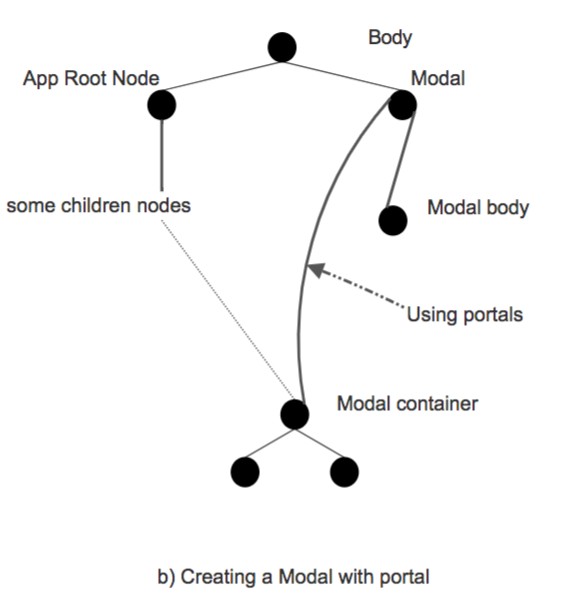

# Curso de React.js

## 1. Introducción a React.js

### 1. ¿Qué es React.js?

**React** cumple su función como biblioteca ya que para utilizar su código se debe importar. También es un Framework aunque las convenciones de cómo debe ser organizado todo no son estrictas.
En este curso aprenderás las prácticas que la comunidad ha decidido que son buenas.

**React es declarativo**, lo que quiere decir que se le indica qué debe hacer pero no cómo debe hacerse, ahorrando de esta manera muchos pasos.
```language
code
```
**JSX** es _HTML_ dentro de Javascript, esto se verá más adelante en detalle.

**React** está _estructurado por componentes_ que son como pequeños bloques de lego que al ser unidos forman aplicaciones de **React**. Estos componentes pueden tener estilos, ser enlazados a eventos y sus estados pueden ser modificados.

Con **React** también se tiene la ventaja de que será escrito una sola vez y podrá ser utilizado en aplicaciones web, móviles, entre otras.

### 2. Pre-requisitos

- **Desarrollo web online**: Esto implica tener familiaridad y fortaleza en el uso de HTML y CSS.
- **Javascript**: React es Javascript. Es importante saber usar Javascript en el navegador. Es deseable conocer JQuery y saber sobre promesas, clases y tener conocimientos sobre asincronía.
- **Terminal**: La línea de comandos es indispensable para instalar herramientas, correr servidores y hacer diversas tareas.

### 3. Herramientas que usaremos

- **Navegador**: Especialmente Chrome ya que cuenta con óptimas herramientas de desarrollo.
- **React Developer Tools**: Es una herramienta Open Source creada por Facebook y tiene instalación para Chrome o Firefox. Nos dejará ver el código de React inspeccionando elementos.
- **Editor de texto**: Puedes usar cualquiera, en este curso sugerimos Visual Studio Code. Tiene muchos plugins útiles para el desarrollo.
- **Prettier**: Es un plugin que hace que el código se vea bien sin importar cómo esta escrito.

### 4. Create-react-app

:link: [Create React App - Getting Started](https://create-react-app.dev/docs/getting-started/)

**Create-react-app** es una aplicación moderna que se usa desde una línea de comando. Antes de ella se configuraba todo el entorno manualmente lo cual tomaba mucho tiempo.

**Pasos para obtenerlo**:  
Se debe instalar desde la línea de comando usando, estando parado donde se desea crear la carpeta del proyecto.

```bash
npx create-react-app hello-react
```

En este punto se estará instalando React y otras herramientas, también se configurará el entorno usando **Webpack**.

Una vez se instala todo entra a la carpeta `src` donde estará todo el código fuente de la aplicación, siendo el más importante `index.js` que es el punto de entrada a la aplicación.

Finalmente para correr la aplicación se usa el comando

```bash
npm start
```

- Otras herramientas:
  - **Babel**: Traduce Javascript moderno (JSX) a un Javascript que todos los navegadores puedan interpretar.
  - **Eslint**: Lee el código y avisa de errores.

## 2. Fundamentos
### 5. Clonar el código de GitHub

:octocat: [platzi-badges](https://github.com/sparragus/platzi-badges)

CLonar el repositorio desde la commit `ReactDOM.render`

```git
git clone --branch 1.ReactDOM.render https://github.com/Sparragus/platzi-badges.git
```

Se tiene que eliminar el archivo `.git`

1. Luego de tener descargada la carpeta, entramos a la carpeta desde la terminal, luego escribimos lo siguiente para ver cuales dependencias se han actualizado:

```bash
npx npm-check-updates -u
```

2. Luego instalar las dependencias con

```bash
npm install
```

### 6. ReactDOM.render

- **React y ReactDOM** trabajarán en conjunto.
  - React como análogo a **createElement**
  - ReactDOM a **appendChild**
- `ReactDOM.render()` toma dos argumentos: Qué queremos renderizar y dónde lo queremos renderizar.
- Siempre que escribas JSX es requisito importar React.

```javascript
import React from "react";
import ReactDOM from "react-dom";

const element = <h1>Hello, Platzi Badges!</h1>;

const container = document.getElementById("app");

// ReactDOM.render(__qué__, __dónde__);
ReactDOM.render(element, container);
```

### 7. JSX
JSX === Azúcar Sintactica === JavaScript

**JSX** es una extensión de _JavaScript_ creada por Facebook para el uso con la biblioteca React. Sirve de preprocesador (como Sass o Stylus a CSS) y transforma el código generado con React a _JavaScript_.

**JSX** tiene su alternativa que es `React.createElement` pero es preferible **JSX** porque es mucho más legible y expresivo. Ambos tienen el mismo poder y la misma capacidad.

`React.createElement` recibe 3 argumentos:
1. El tipo de elemento que estamos creando
2. Sus atributos o props
3. Y el children que es el contenido.

Ejemplo:
`React.createElement(‘a’, { href: ‘https://platzi.com’ }, ‘Ir a Platzi’);`

En **JSX** se utilizan las llaves para introducir variables o expresiones de _Javascript_. Lo que sea que esté adentro se va a evaluar y su resultado se mostrará en pantalla.

Las expresiones pueden ser llamadas a otras funciones, cálculos matemáticos, etc. _Si las expresiones son false, 0, null, undefined, entre otros, no se verán._


## 3. Creación y diseño de componentes
### 8. ¿Qué es un componente?
NOTA: Pagina(s) 20 - 32 de slides del curso

:octocat: [¿En qué se diferencian los componentes de función de las clases?](https://overreacted.io/es/how-are-function-components-different-from-classes/)

Los componentes en React son **bloques de construcción**.
Las aplicaciones hechas con React son como figuras de Lego. Junta varias piezas (componentes) y puedes construir un website tan pequeño o tan grande como quieras.
Los componentes serán barras de búsquedas, enlaces, encabezados, el header, etc.
**”Componente” vs “elemento"**
Un elemento es a un objeto como un componente es a una clase. Si el elemento fuera una casa, el componente serían los planos para hacer esa casa.

**Identificación de componentes**
Para identificarlos debes hacerte las siguientes preguntas:

1. ¿Qué elementos se repiten? Estos son los elementos en una lista o los que comparten aspecto visual y su funcionalidad.
2. ¿Qué elementos cumplen una función muy específica? Estos sirven para encapsular la lógica y permiten juntar muchos comportamientos y aspectos visuales en un solo lugar.

__Identificar componentes es una habilidad esencial para poder desarrollar aplicaciones de React.__

_‘Componente’ vs ‘Elemento’_  
+ Un elemento es a un objeto como un componente es a una clase.
+ Si el elemento fuera una casa, el componente sería los planos para hacer  esa casa.


### 9. Qué es y cómo funciona un componente en React.js


1. Nacen
2. Crecen
3. Desaparecen

El ciclo de vida de los componentes tienen 3 faces -> MONTAJE, ACTUALIZACIÓN, ELIMINACIÓN DE COMPONENTES
1. **Montaje** Cuando los usuarios llegan a nuestra aplicación, cuando tienen su primera interacción con el, que es cuando aparecen los componentes.
2. **Actualización** Cuando los componentes cambian y otros no; si cambian pasan por una actualización y se ejecuta `render()` generando el nuevo `DOM` y react manda la señal de conformación `componentDidUpdate()`. Es un buen monento para reaccionar a cambios. Como por ejemplo añadir una sugerencia a una bebida.
3. **Eliminación de los componentes**, al entrar a otra página, varios componentes que se veian  ya no estaran en ella, react manda la señal `componentWillUnmount()`, seguido de la eliminación del codigo en el `DOM`


### 10. Nuestro primer componente
**NOTA**: Nombre de commit `Add. _Curso ReactJS_ 3.PrimerComponente` en mi repo

Dentro de la carpeta `src` crear carpeta `components` y otra `images`

En carpeta `components` se crea el primer componente se crea el archivo `Badge.js`

Se afecta el archivo `index.js` para importar el nuevo componente.
```js
import React from 'react';
import ReactDOM from 'react-dom';
import Badge from './components/Badge'
const container = document.getElementById('app');
ReactDOM.render(<Badge />, container);
```

### 11. Cómo aplicar estilos
**NOTA**: Nombre de commit `Add. _Curso ReactJS_ 4.Estilos` en mi repo

Dentro de la carpeta `components` se crea otra carpeta `styles` que son los estilso para los componentes.

Se importan el en el componente `Badge`
```js
import './styles/Badge.css';
```
Se importan las clases pero con **className** para que react las identifique
En el archivo `index.js` se importan los estylos globales y los archivos de estilos bootstrap, creando un archivo a mismo nivel de la carpeta `src` archivo `global.css` que son cambios personalisados para el proyecto.
```js
import './global.css';
```
Y en Badge.js se cambian etiquetas.

+ Para los estilos crearemos una carpeta llamada **Styles** y allí vivirán todos los archivos de estilos que tienen que ver con los componentes.
* Para usar los estilos es necesario importarlos con **import**
* React funciona ligeramente diferente y para los atributos de clases no se utiliza class sino **className**
* Es posible utilizar Bootstrap con React, sólo debe ser instalado con `npm install bootstrap` y debe ser importado en el index.js
* Existen estilos que son usados de manera global o en varios componentes, _así que deben ser importados en el_ `index.js`


### 12. Props

Los _props que es la forma corta de properties_ son argumentos de una función y en este caso serán los atributos de nuestro componente como **class, src, etc**.

Estos props salen de una variable de la clase que se llama `this.props` y los valores son asignados directamente en el `ReactDOM.render()`.

Para pasarle _props_ el componente `Badge` se modifican los archivos `index.js` y `Badge.js`. Se pasan como parametros del `index.js` al `Badge.js` como `this.props`
`index.js`
```js
import React from 'react';
import ReactDOM from 'react-dom';
import 'bootstrap/dist/css/bootstrap.css';
import './global.css';
import Badge from './components/Badge';
const container = document.getElementById('app');
ReactDOM.render(
  <Badge
    firstName="Richard"
    lastName="Kaufman"
    avatarUrl="https://www.gravatar.com/avatar/21594ed15d68ace3965642162f8d2e84?d=identicon"
    jobTitle="Frontend Engineer"
    twitter="sparragus"
  />,
  container
);
```
`Badge.js`
```js
import React from 'react';
import './styles/Badge.css';
import confLogo from '../images/badge-header.svg';
class Badge extends React.Component {
  render() {
    return (
      <div className="Badge">
        <div className="Badge__header">
          
        </div>

        <div className="Badge__section-name">
          
          <h1>
            {this.props.firstName} <br /> {this.props.lastName} /* <-- PROPS */
          </h1>
        </div>
        <div className="Badge__section-info">
          <h3>{this.props.jobTitle}</h3> // <-- PROPS
          <div>@{this.props.twitter}</div> // <-- PROPS
        </div>
        <div className="Badge__footer">#platziconf</div>
      </div>
    );
  }
}
export default Badge;
```


### 13. Nuestra primera página
**NOTA**: Nombre de commit `Add. _Curso ReactJS_ 6.NuestraPrimeraPagina"` en mi repo

Navbar es un componente que se importa de Bootstrap

+ Las páginas en React son componentes y conseguir distinguirlas nos servirá para saber que es un componente que adentro lleva otros componentes.
  * Al escribir los _props_ no importa el orden en el que lo hagas, únicamente importa el nombre.

Dentro de la carpeta `src` se crea la nueva pagina se crea en la carpeta `pages` el archivo/componente `BadgeNew.js` que sera la nueva página y tambien , la carpeta `styles` y dentro `BadgeNew.css`

Dentro de la carpeta `components` se crea el archivo del componente `Navbar.js` y dentro de `styles` su archivo de estilos `Navbar.css`

En el archivo `index.js` se modifica para importar la nueva pagina `BadgeNew`
```js
import React from 'react';
import ReactDOM from 'react-dom';
import 'bootstrap/dist/css/bootstrap.css';

import './global.css';
import BadgeNew from './pages/BadgeNew';

const container = document.getElementById('app');

ReactDOM.render(<BadgeNew />, container);
```

### 14. Enlazando eventos

+ React dispone de eventos. Cada vez que se recibe información en un input se obtiene un evento `onChange` y se maneja con un método de la clase this.handleChange
+ Los _elementos button_ también tienen un evento que es `onClick`.
+ Cuando hay un botón dentro de un formulario, este automáticamente será de tipo `submit`. Si no queremos que pase así hay dos maneras de evitarlo: especificando que su valor es de tipo button o manejándolo desde el formulario cuando ocurre el evento `onSubmit`.

Se crea en la carpeta de `components` el nuevo componente de formulario `BadgeForm.js` y se tienen que tomar en cuenta como se manejan los eventos en el formulario con:
```js
handleChange = e => {
  console.log({
    name: e.target.name,
      value: e.target.value,
    });
  };

  handleClick = e => {
    console.log('Button was clicked');
  };

  handleSubmit = e => {
    e.preventDefault();
    console.log('Form was submitted');
  };
```
Y se enlasa el formulario con `Badge.js` con
```js
import BadgeForm from '../components/BadgeForm';
// y 
<div className="col-6">
  <BadgeForm />
</div>
```
para que en la página se pueda mostrar

Un componente de React dispone de eventos sin la necesidad de generarlos mediante `addEventListener`

Un evento son cosas que el usuario hace o que el navegador hace, mismos que podemos cachar en react para hacer cosas cuando se activan (trigger) los eventos.

Un evento es una prop que recibe una función callback `( ()⇒{} o handleEvent)`

Los eventos más comunes que podemos utilizar serían `onClick`, `onChange`, `onKeyPress`, `onFocus`, `onScroll`. pero nos son los únicos, podemos manejar casi todos los eventos de html interponiendo un on y usando camelCase.

```jsx
const Button = (props) => {
  handleClick = (event) => {
		event.preventDefault()
    alert('Handling click')
  }
  return (
    <div>
			<h1>Manzanas</h1>
			<button onClick={handleClick}>Click me</button>
		</div>
  );
}
```


### 15. Manejo de estado
**NOTA**: Nombre de commit `Add. _Curso ReactJS_ 8.ManejoDeEstado"` en mi repo
Hasta esta clase todos los componentes han obtenido su información a través de props que vienen desde afuera (otros componentes) pero hay otra manera en la que los componentes pueden producir su propia información y guardarla para ser consumida o pasada a otros componentes a través de sus props. _La clave está en que la información del_ **state** a otros componentes pasará en una sola dirección y podrá ser consumida pero no modificada.

Para inicializar el estado de las variables del formulario
```js
state = {},
```
Antes de la funcion `handleChange` que se encarga de manejar/obtener los valores de los inputs.

Para guardar la información en el estado se usa una función de la clase component llamada **setState** a la cual se le debe pasar un objeto con la información que se quiere guardar.
```js
handleChange = e => {
    this.setState({
      [e.target.name]: e.target.value,
    });
  };
```
Se guarda en un arreglo los estados del formulario/los valores de los inputs

Aunque no se ve, la información está siendo guardada en dos sitios. Cada input guarda su propio valor y al tiempo la está guardando en **setState**, lo cual no es ideal. 

_Para solucionarlo hay que modificar los inputs de un estado de no controlados a controlados._
```js
value={this.state.firstName}
// --
value={this.state.lastName}
// --
value={this.state.email}
```


### 16. Levantamiento del estado
**NOTA**: Nombre de commit `Add. _Curso ReactJS_ 9.LevantarElEstado 01"` en mi repo

**Levantar el estado** es una técnica de React que pone el estado en una localización donde se le pueda pasar como props a los componentes. Lo ideal es poner el estado en el lugar más cercano a todos los componentes que quieren compartir esa información.

Algo interesante que le da el nombre a React es su parte de **“reactivo”** ya que cada vez que hay un cambio en el estado o en los props que recibe un componente se vuelve a renderizar todo el componente y todos sus descendientes.

Ahora guardaremos las variables en el `BadgeNew.js` que contiene el formulario y los badges, por lo que:

+ En `BadgeNew.js`  
  1. _Inicializamos el state_ y creamos un `objeto form`, con todos sus atributos inicializados vacíos tambien
  2. Creamos el método `handleChange` para que cree una copia, la edite y la guarde en el state.form cada que suceda el evento `onchange`

+ Dentro del render
  3. Mandamos como _props_ cada uno de los states del form a `<Badge />`
  4. Mandamos como _props_ el "arreglo" del `state.form` a `BadgeForm.js` para que refleje el valor(?no estoy seguro)
  5. Declaramos el atributo `onchange` en _BadgeForm_ para que llame al metodo `handleChange`

+ En `Badge.js`
  6. Mostramos cada uno de los valores recibidos como `this.props.name` dentro del render

+ En el `BadgeForm.js`
  7. Mostramos cada posicion en el atributo value con `this.props.formValues.value`
  8. Declaramos que al hacer un cambio se vera reflejado en el change padre, mediante el `onchange` hijo

1. `BadgeNew.js`
```js
  state = {
    form: {
        firstName: '',
      lastName: '',
      email: '',
      jobTitle: '',
      twitter: '',
    },
  };
```
2. `BadgeNew.js`
```js
  handleChange = e => {
      this.setState({
      form: {
        ...this.state.form,
        [e.target.name]: e.target.value,
      },
    });
  };
```
2.1. `BadgeNew.js`
```js
<div className="col-6">
  <BadgeForm
    onChange={this.handleChange}
    formValues={this.state.form}
  />
</div>
```
3 - 4 `<Badge />`
```js
<Badge
  firstName={this.state.form.firstName}
  lastName={this.state.form.lastName}
  twitter={this.state.form.twitter}
  jobTitle={this.state.form.jobTitle}
  email={this.state.form.email}
  avatarUrl="https://www.gravatar.com/avatar/21594ed15d68ace3965642162f8d2e84?d=identicon"
/>
```
6. `Badge.js`
```js
Mostramos cada uno de los valores recibidos como `this.props.name` dentro del render
```
7 - 8. `BadgeForm.js`
```js
onChange={this.props.onChange}
value={this.props.formValues.firstName}
// --
value={this.props.formValues.lastName}
// --
value={this.props.formValues.email}
// -- 
value={this.props.formValues.jobTitle}
// --
value={this.props.formValues.twitter}
```

### 17. Listas de componentes
**NOTA**: Nombre de commit `Add. _Curso ReactJS_ 10.ListaDeComponentes"` en mi repo


Se modifica el archivo `index.js` para que se importe a la pagina principal la nueva pagina `index.js` 
```js
import React from 'react';
import ReactDOM from 'react-dom';
import 'bootstrap/dist/css/bootstrap.css';
import './global.css';
import BadgeNew from './pages/BadgeNew';
import Badges from './pages/Badges';
const container = document.getElementById('app');
ReactDOM.render(<Badges />, container);
```
Se crea el archivo `Badges.js` el cual es la nueva página que contendra el `set` de la `data` ya seteado con información. y el template para mostrar la información 

Que será enviada al nuevo componente que se encarga de "Listar" los badges `BadgesList.js` por medio del componente.
Se modifica el archivo `index.js` para que se importe a la pagina principal la nueva pagina `Badges.js` 
```js
<BadgesList badges={this.state.data} />
```
En el nuevo componente `BadgesList.js` importa la clase **BadgesListItem** que se encuentra en el mismo componente y se encarga de deplegar la info del `data` siertos datos del objeto `set`
`BadgesList.js`
```js
class BadgesListItem extends React.Component {
  render() {
    return (
      <div className="BadgesListItem">
        

        <div>
          <strong>
            {this.props.badge.firstName} {this.props.badge.lastName}
          </strong>
          <br />@{this.props.badge.twitter}
          <br />
          {this.props.badge.jobTitle}
        </div>
      </div>
    );
  }
}
class BadgesList extends React.Component {
  render() {
    return (
      <div className="BadgesList">
        <ul className="list-unstyled">
          {this.props.badges.map(badge => {
            return (
              <li key={badge.id}>
                <BadgesListItem badge={badge} />
              </li>
            );
          })}
        </ul>
      </div>
    );
  }
}
export default BadgesList;
```

## 4. React Router
### 18. Introducción a React Router
NOTA: Pagina(s) 33 - 55 de slides del curso

Las aplicaciones que se trabajan en React son llamadas **single page apps**. Esto es posible gracias a **React Router** que es una librería Open Source.

**Multi Page Apps**: Cada página implica una petición al servidor. La respuesta usualmente tiene todo el contenido de la página.

**Single Page Apps** _(SPA)_: Aplicaciones que cargan una sola página de HTML y cualquier actualización la hacen re-escribiendo el HTML que ya tenían.

**React Router (v4)**: Nos da las herramientas para poder hacer _SPA_ fácilmente. Usaremos 4 componentes:

1. **BrowserRouter**: es un componente que debe estar siempre lo más arriba de la aplicación. Todo lo que esté adentro funcionará como una _SPA_.
2. **Route**: Cuando hay un match con el path, se hace render del component. _El component va a recibir tres props_: **match, history, location**.
3. **Switch**: Dentro de _Switch_ solamente van elementos de _Route_. _Switch_ se asegura que solamente un _Route_ se renderize.
4. **Link**: Toma el lugar del elemento <a>, evita que se recargue la página completamente y actualiza la URL.


### 19. División de la aplicación en rutas
**NOTA**: Nombre de commit `Add. _Curso ReactJS_ 19.División de la aplicación en rutas` en mi repo

:link: [npm eact-router-dom](https://www.npmjs.com/package/react-router-dom)

Para instalar _React Router_ lo hacemos desde la terminal con `npm install react-router-dom`. Como es importante usar exactamente la misma versión, del `package.json` en “dependencies” se quita lo que está delante del 4.

**Link** internamente tiene un elemento `<a>` pero va a interceptar el clic para navegar de manera interna sin refrescar toda la página.

El archivo index se modifica para que se agregué el nuevo componente que es `app`

`index.js`
```js
import React from 'react';
import ReactDOM from 'react-dom';
import 'bootstrap/dist/css/bootstrap.css';
import './global.css';
import App from './components/App';
const container = document.getElementById('app');
ReactDOM.render(<App />, container);
```
Se agrega un nuevo componente `App` en la cual actuara para la rutas de la _single page app_, y ahora esta se encargaŕa de importar `BagdeNew` y `Badges`

Se crea la lógica para las rutas importando `BrowserRouter` 

`App.js`
```js
import React from 'react';
import { BrowserRouter, Switch, Route } from 'react-router-dom';
import BadgeNew from '../pages/BadgeNew';
import Badges from '../pages/Badges';
function App() {
  return (
    <BrowserRouter>
      <Switch>
        <Route exact path="/badges" component={Badges} /> // exact ES PARA QUE SEA EXACTAMENTE LA RUTA.
        <Route exact path="/badges/new" component={BadgeNew} />
      </Switch>
    </BrowserRouter>
  );
}
export default App;
```
En el archivo `Badges.js` el cual tiene el boton que nos lleva al componente `BadgesNew` se cambia el elemto `<a>` por `<Link>` el cual se importa, y ahce que ne vavege internamente sin tener que refrescar toda la página

`Badges.js`
```JS
import { Link } from 'react-router-dom'; // SE IMPORTA Link
```

```JS
<Link to="/badges/new" className="btn btn-primary">
    New Badge
</Link>
```

### 20. Mejorando la User Interface con un Layout
**NOTA**: Nombre de commit `Add. _Curso ReactJS_ 12.MejoranLaUIConUnLayout` en mi repo

**React podemos crear componentes con clase y sin clase.**

Los componentes _con clase siempre deben de llevar el método_ `render()`, y se les considera _“Statefull”_ o _“Componentes Inteligentes”_, estos tiene lógica para operar con los datos que se les proporciona, y a medida que se hagan cambios al componente, este cambiara para mostrar los nuevos datos o resultado.

_Los componentes sin clase (creados con function)_, a diferencia de los anteriores, _no llevan un metodo render_. Son más simples en en sentido que solo se usan para mostrar datos, no pueden hacer manipulacion de información. A estos componentes se les llama _“Stateless”_ o _“Componentes Tontos_” por el hecho de que solo despliegan datos.

En resumen, Richard usa un componente _“Stateless”_ para el Layout porque como no necesita ser renderizado múltiples veces porque su contenido no cambia dado a que solo es el _NavBar_ que se usa en toda la aplicación.

Se modifica el archivo `App.js` para que se agregue el Layout que se mostrara en todos los dmeas componentes.

Además se agrega el componente que se mostrara cuando no se encuentre la página y se muestre el error personalisado **404** 
```js
import React from 'react';
import { BrowserRouter, Switch, Route } from 'react-router-dom';
import Layout from './Layout';
import BadgeNew from '../pages/BadgeNew';
import Badges from '../pages/Badges';
import NotFound from '../pages/NotFound'; /* SE CREA UNA RUTA SIN PATH SOLO EL COMPONENTE */

function App() {
  return (
    <BrowserRouter>
    <Layout> {/* PARA QUE ESTO FUNCIONE SE TIENE QUE USAR children DE LOS props QUE SE SETEAN EN Layout.js */}
      <Switch> 
        <Route exact path="/badges" component={Badges} />
        <Route exact path="/badges/new" component={BadgeNew} />
        <Route component={NotFound} /> {/* SE CREA UNA RUTA SIN PATH SOLO EL COMPONENTE */}
      </Switch>
    </Layout>
    </BrowserRouter>
  );
}
export default App;
```
Se crea el componente **Layout** en el archivo `Layout.js`
```js
import React from 'react';
import Navbar from './Navbar';

function Layout(props) {
  // const children = props.children;
/* SIEMPRE QUE SE REGRESA EL elemento en el render SE TIENE QUE REGRESAR UN ELEMENTO 
PARA NO TENER UN div FORZADO EN TODOS LOS COMPONENTES EN LOS QUE SE USA `React.Fragment`
COMPONENTE ESPECIAL QUE REACT ENTIENDE Y QUE HACE QUE REGRESEMOS MAS DE UN ELEMENTO, AUNQUE PARESCA QUE SOLO ES NO */
  return (
    <React.Fragment>
      <Navbar />
      {props.children}
    </React.Fragment>
  );
}
export default Layout;
```
`NotFound.js` componente para mostrar pagina de error 404 
```js
import React from 'react';
function NotFound() { /*ES UN COMPONETE SIN ESTADO*/
  return <h1>404: Not Found</h1>;
}
export default NotFound;
```


## 5. Component Lifecycle
### 21. Introducción del ciclo de vida de un componente
NOTA: Pagina(s) 55 - 67 de slides del curso

Cuando React renderiza los componentes decimos que entran en escena, cuando su estado cambia o recibe unos props diferentes se actualizan y cuando cambiamos de página se dice que se desmontan.

+ **Montaje:**
  * Representa el momento donde se inserta el código del componente en el DOM.
  * Se llaman tres métodos: `constructor`, `render`, `componentDidMount`.
+ **Actualización:**
  * Ocurre cuando los props o el estado del componente cambian.
  * Se llaman dos métodos: `render`, `componentDidUpdate`.
+ **Desmontaje:**
  * Nos da la oportunidad de hacer limpieza de nuestro componente.
  * Se llama un método: `componentWillUnmount`.

**¿Qué son los métodos del ciclo vida?**  
Todos los componentes en React pasan por una serie de fases que generalmente se denominan “Ciclo de Vida del componente” es un proceso que React hace en cada componente, en algunos casos no podemos verlos como un bloque de código y en otros podemos llamarlos en nuestro componente para asignar una actividad según sea el caso necesario.

Los componentes en react pasan por un **Montaje**, **Actualización**, **Desmontaje** y **Manejo de errores.**

+ **Montaje**:
  + En esta fase nuestro componente se crea junto a la lógica y los componentes internos y luego es insertado en el DOM.
+ Actualización:
  + En esta fase nuestro componente está al pendiente de cambios que pueden venir a través de un cambio en “state” o “props” esto en consecuencia realizan una acción dentro de un componente.
+ **Desmontaje**:
  + En esta etapa nuestro componente “Muere” cuando nosotros no necesitamos un elemento de nuestra aplicación, podemos pasar por este ciclo de vida y de esta forma eliminar el componente de la representación que tiene en el DOM.
+ **Manejo de Errores**:
  * Cuando nuestro código se ejecuta y tiene un error, podemos entrar en una fase donde se puede entender mejor qué está sucediendo con la aplicación.

Algo que debemos tener en cuenta es que un componente NO debe pasar por toda las fases, un componente puede ser montado y desmontado sin pasar por la fase de actualización o manejo de errores.

Ahora que entendemos las fases que cumple el ciclo de vida en React vamos a entrar a detalle en cada uno de ellos para ver qué piezas de código se ejecutan y nos ayudarán a crear aplicaciones en React pasando por un ciclo de vida bien estructurado.

+ **Montado**:
  1. `Constructor()` Este es el primer método al que se hace un llamado, aquí es donde se inicializan los métodos controladores, eventos del estado.
  2. `getDerivedStateFromProps()` Este método se llama antes de presentarse en el DOM y nos permite actualizar el estado interno en respuesta a un cambio en las propiedades, es considerado un método de cuidado, ya que su implementación puede causar errores sutiles.
  3. `render()` Si queremos representar elementos en el DOM en este método es donde se escribe esta lógica, usualmente utilizamos JSX para trabajar y presentar nuestra aplicación.
  4. `ComponentDidMount()` Este método se llama inmediatamente que ha sido montado en el DOM, aquí es donde trabajamos con eventos que permitan interactuar con nuestro componente.

+ **Actualización**:
  1. `getDerivedStateFromProps()` Este método es el primero en ejecutarse en la fase de actualización y funciona de la misma forma que en el montaje.
  2. `shouldComponentUpdate()` Dentro de este método se puede controlar la fase de actualización, podemos devolver un valor entre verdadero o falso si queremos actualizar o no el componente y es utilizado principalmente para optimización.
  3. `render()` Se llama el método render que representa los cambios en el DOM.
  4. `componentDidUpdate()` Este método es invocado inmediatamente después de que el componente se actualiza y recibe como argumentos las propiedades y el estado y es donde podemos manejar nuestro componente.

+ **Desmontado**
  1. `componentWillUnmount()` Este método se llama justo antes de que el componente sea destruido o eliminado del DOM.
  2. `Manejo de Errores:`
    1. `getDerivedStateFromError()` Una vez que se lanza un error este es el primer método que se llama, el cual recibe el error como argumento y cualquier valor devuelto en este método es utilizado para actualizar el estado del componente.
    2. `componentDidCatch()` Este método es llamado después de lanzarse un error y pasa como argumento el error y la información representada sobre el error.

Ahora que entendemos cada una de las fases que tiene el ciclo de vida de react, podemos utilizarlas según sea necesario en nuestra aplicación y de esta forma crear las interacciones que necesitemos.

### 22. Práctica del ciclo de vida
Analizar el console.log del archivo `Badges.js` para entender el ciclo de vida de los componentes

`Badges.js`
```js
class Badges extends React.Component {
  constructor(props) {
    /*SE RECIBEN LOS props SE UTLIZAN PARA INICIALIZAR LA SUPER CLASE QUE EN ESTE CASO EN component*/
    super(props);
    console.log('1. constructor()');
    /*EN EL CONSTRUCTOR ES DONDE SE "RECOMIENDA" QUE SE INCIAALISE ESTADO*/
    this.state = {
      data: [],
    };
  }

  componentDidMount() {
    console.log('3. componentDidMount()');
    /*SE SIMULA LA PETICIÓN A API CON EL setTimeout*/
    /* REGRESA EL VALOR DE id */
    this.timeoutId = setTimeout(() => {
      /*SE SETEA EL ESTADO, PREVIAMENTE VACIO*/
      this.setState({
        data: [
          {
            id: '2de30c42-9deb-40fc-a41f-05e62b5939a7',
            firstName: 'Freda',
            lastName: 'Grady',
            email: 'Leann_Berge@gmail.com',
            jobTitle: 'Legacy Brand Director',
            twitter: 'FredaGrady22221-7573',
            avatarUrl:
              'https://www.gravatar.com/avatar/f63a9c45aca0e7e7de0782a6b1dff40b?d=identicon',
          },
          {
            id: 'd00d3614-101a-44ca-b6c2-0be075aeed3d',
            firstName: 'Major',
            lastName: 'Rodriguez',
            email: 'Ilene66@hotmail.com',
            jobTitle: 'Human Research Architect',
            twitter: 'MajorRodriguez61545',
            avatarUrl:
              'https://www.gravatar.com/avatar/d57a8be8cb9219609905da25d5f3e50a?d=identicon',
          },
          {
            id: '63c03386-33a2-4512-9ac1-354ad7bec5e9',
            firstName: 'Daphney',
            lastName: 'Torphy',
            email: 'Ron61@hotmail.com',
            jobTitle: 'National Markets Officer',
            twitter: 'DaphneyTorphy96105',
            avatarUrl:
              'https://www.gravatar.com/avatar/e74e87d40e55b9ff9791c78892e55cb7?d=identicon',
          },
        ],
      });
    }, 3000);
  }

  componentDidUpdate(prevProps, prevState) {
    /*LOS VAORES preVIOS*/
    console.log('5. componentDidUpdate()');
    console.log({
      prevProps: prevProps,
      prevState: prevState,
    });

    console.log({
      /*LOS VALORES QUE SE TIENEN AHORA*/
      props: this.props,
      state: this.state,
    });
  }

  componentWillUnmount() {
    console.log('6. componentWillUnmount');
    /* clearTimeout ES UNA FUNCION PARA CANCELAR EL setTimeout Y SE HACE POR MEDIO DE this.timeoutId*/
    clearTimeout(this.timeoutId);
  }

  render() {
    console.log('2/4. render()');
    return (
```

## 6. Llamadas a un API
### 23. Introducción llamadas a un API
NOTA: Pagina(s) 68 - 77 de slides del curso

Las llamadas a una _API_ siguen un patrón similar siempre que las hacemos, cada llamada consta de tres estados:

1. **Loading**: cuando la petición se envía y estamos esperando.
2. **Error**: se debe dejar un mensaje para el usuario para arreglar el error o volver a intentarlo.
3. **Data**: los datos nos pueden llegar de dos formas, o en error o con los datos requeridos.

### 24. React.js: Cómo traer datos de un API en React

React.js: Cómo traer datos de un **API** en React
Una llamada a una **API** es un proceso asíncrono, es decir que lo comenzamos pero no sabemos cuándo acabará. Por lo mismo la función a escribir debe ser _asíncrona_.
La llamada se hará usando `fetch` que es una función de JavaScript que al pasarle una dirección de internet, hará una petición `GET` y lo que sea que exista ahí será devuelto.

Se añadio ejemplo para manejar llamado a API de Rick and Morty en la carpeta `rickAndMorty`


### 25. Solicitando datos (GET)

Se tienen que descargar 2 cosas, la carpeta `server` junto con el archivo `api.js`. La carpeta server entera, a la altura de la carpeta **src**. 

El archivo `api.js` debe estar dentro de **src**. Lo tienes todo en **Archivos** y **Enlaces** arriba a la derecha.

Seguidamente es necesario abrir la terminal e instalar las siguientes dependencias:

+ `faker` (Crea un servicio _falso_ de datos para nuestra petición a la api creada por Richard)
+ `json-server` (Crea nuestra _falso_ puerto **3001** para la petición a la api)
+ `npm-run-all` (cuidado, no es `run-all` que también existe)

Se pueden hacer al mismo tiempo todas:
```bash
npm install faker json-server npm-run-all --save-dev
```
Finalmente entramos en el archivo `package.json` y reescribimos los _scripts_ para que quede de la siguiente forma:
```json
“scripts”: {
    “start”: “npm-run-all -p client server”,
    “client”: “react-scripts start”,
    “server”: “json-server --port 3001 --watch server/db.json”,
    “seed”: “node server/seed.js”,
    “build”: “react-scripts build”,
    “test”: “react-scripts test”,
    “eject”: “react-scripts eject”
}
```
Explicados:
```json
“start”: “npm-run-all -p client server”,
```
Ejecuta todos los scripts a una
```json
“server”: “json-server --port 3001 --watch server/db.json”,
```
Crea un servidor falso con un _puerto 3001_ y unos datos que busca la api en el archivo especificado.
```json
“seed”: “node server/seed.js”,
```
Crea los datos falsos

Volvemos a la terminal y tecleamos:
```bash
npm run start
```
Listo ya deberia de funcionar

### 26. Mejorando la Experiencia de Usuario durante una petición
**NOTA**: Nombre de commit `Add. _Curso ReactJS_ 15.MejorandoElUXDeUnaPeticion 01` en mi repo


Para mejorar la experiencia de usuario se tienen que modificar el archivo `Badges.js` para insertar el componente `<PageLoading />;` que hace que se muestre un icono miestras se espera la respuesta del API y se mejora el mensaje de error con el compomente `<PageError error={this.state.error} />;` el cual genera un mensaje mas peronalizado
 Se crean y modifican los archivos `Badges.js`, `PageLoading.js`, `BadgesList.js`, `Loader.js`, `api.js` `PageError.js`

`Badges.js`
```js
import React from 'react';
import { Link } from 'react-router-dom';
import './styles/Badges.css';
import confLogo from '../images/badge-header.svg';
import BadgesList from '../components/BadgesList';
import PageLoading from '../components/PageLoading';
import PageError from '../components/PageError';
import api from '../api';

class Badges extends React.Component {
  state = {
    loading: true,
    error: null,
    data: undefined,
  };
  componentDidMount() {
    this.fetchData();
  }
  fetchData = async () => {
    this.setState({ loading: true, error: null });
    try {
      const data = await api.badges.list();
      this.setState({ loading: false, data: data });
    } catch (error) {
      this.setState({ loading: false, error: error });
    }
  };
  /* SE CREA EL COMPONENTE <PageLoading />;  */
  render() {
    if (this.state.loading === true) {
      return <PageLoading />;
    }
    /* SE CREA EL COMPONENTE  PageError QUE REGRESA EL ERROR QUE SE DECLARA EN EL APPI COMO EJEMPLO*/
    /*import React from 'react';
    import './styles/PageError.css';
    function PageError(props) {
      return <div className="PageError">❌{props.error.message}😱</div>;
    }
    export default PageError;*/
    if (this.state.error) {
      return <PageError error={this.state.error} />;
    }
    return (
      <React.Fragment>
        <div className="Badges">
          <div className="Badges__hero">
            <div className="Badges__container">
              
            </div>
          </div>
        </div>

        <div className="Badges__container">
          <div className="Badges__buttons">
            <Link to="/badges/new" className="btn btn-primary">
              New Badge
            </Link>
          </div>

          <BadgesList badges={this.state.data} />
        </div>
      </React.Fragment>
    );
  }
}
export default Badges;
```

### 27. Enviando datos (POST)
`MD5` es una pequeña librería a la cual se le da un texto y ella regresa un `hash`.

Podremos hacer pruebas para cifrar nuestros textos a md5 en el siguiente sitio MD5 Online

_Hola Platzi = d3bfb9302fb1007c0f996b41cba2818c_
Se instala el paquete :link: [MD5](https://www.npmjs.com/package/md5)

Se centra la imagen del _hero_ y se cambia por `import header from '../images/platziconf-logo.svg';`

En el archico `Badge.js` el componente se _Badge_ se agregan valores predeterminados cuando no se escriben la info en el el _form_ 
```js
<Badge
    firstName={this.state.form.firstName || 'FIRST_NAME'}
    lastName={this.state.form.lastName || 'LAST_NAME'}
    twitter={this.state.form.twitter || 'twitter'}
    jobTitle={this.state.form.jobTitle || 'JOB_TITLE'}
    email={this.state.form.email || 'EMAIL'}
    avatarUrl="https://www.gravatar.com/avatar/21594ed15d68ace3965642162f8d2e84?d=identicon"
/>
```
Se cambin la imagen del componente _Gravatar_ y se tieien que cambiar el hash que se general para cada una en la url `https://www.gravatar.com/avatar/21594ed15d68ace3965642162f8d2e84?d=identicon`
`Gravatar.js`
```js
import React from 'react';
import md5 from 'md5';
// Aprende más del Gravatar en: http://gravatar.com
function Gravatar(props) {
  const email = props.email;
  const hash = md5(email);

  return (
    
  );
}

export default Gravatar;
```
Y en el archivo `Badge.js` se manda a llamar el componente y se le pasa el props por del correo 
```js
<Gravatar className="Badge__avatar" email={this.props.email} />
```
Se mandan los que ya tenemos y se añade al componente _BadgeForm_ en el archivo `BadgeNew.js` la funcion que maneja el _submit_ del _form_ se llama al props
```js
<BadgeForm
    onChange={this.handleChange}
    onSubmit={this.handleSubmit} // <--
    formValues={this.state.form}
/>
```
En el archivo `BadgeForm.js` del elemeto _form_ se cambia el evento `onSubmit` para que llame al prop `<form onSubmit={this.props.onSubmit}>`

Se maneja el evento tipo submit del formulario del componente `BadgeForm` con `onSubmit={this.handleSubmit}` para que llame la funcion async para hacer **POST** a lal _API_ y semaneja el error con el `tray...catch` y se manejan los errores para poder mostrar los al usuario en caso de existir
`BadgeNew.js`
```js
handleSubmit = async e => {
    e.preventDefault();
    this.setState({ loading: true, error: null });

    try {
      await api.badges.create(this.state.form);
      this.setState({ loading: false });
    } catch (error) {
      this.setState({ loading: false, error: error });
    }
```


### 28. Manejando los estados de la petición durante el POST
De la misma manera en la que se manejan los estados cuando se solicitan datos, deben ser manejados cuando los datos son enviados.

Existe un tiempo entre que se da clic y los datos son enviados. Ese tiempo de espera es necesario visualizarlo. Igual hay que mostrar mensajes de error cuando no funcionan las cosas.

Se modifican los archivos `BadgeNew.js` y el archivo `BadgeForm.js` para conseguirlo
`BadgeNew.js`
```js
import PageLoading from '../components/PageLoading'; /* SE IMPORTA */
```
El estado se modifica para decir que no esta cargando la pagina cuando aparece y se establece el error en _null_ desde el principio
```js
state = {
    loading: false, /* SE AGREGA */
    error: null, /* SE COMIENZA SIN ERROR */
    form: {
      firstName: '',
      lastName: '',
      email: '',
      jobTitle: '',
      twitter: '',
    },
  };
```
Se modifica el el handleSubmut
```js
handleSubmit = async e => {
    e.preventDefault();
    this.setState({ loading: true, error: null });

    try {
      await api.badges.create(this.state.form);
      this.setState({ loading: false });
      /* EN CASO DE QUE EJECUTE EXITOSAMENTE EL POST SE REDIRIGE A LA PAGINA DE BadgeList */
      /* match, history, location son el prop que las paginas reciben y se le pasa hostory */
      this.props.history.push('/badges');

    } catch (error) {
      this.setState({ loading: false, error: error });
    }
  };
```

```js
render()
    /* SI SE ENCIENDE LOADIN SI GRESA LA VISUALIZACIÓN DEL COMPONENTE PageLoading */
    if (this.state.loading) {
      return <PageLoading />;
    }
```
Se modifica el componente BadgeForm para que manege el error y lo muestr en el formulario
```js
<BadgeForm
    onChange={this.handleChange}
    onSubmit={this.handleSubmit}
    formValues={this.state.form}
    error={this.state.error} /* PARA QUE SE MUESTRE UN ERROR DENTRO DEL FORMULARIO */
/>
```
En el archivo `BadgeForm.js` se añade despues dle boton el _if_ para que muestre el error en caso de que no se pudo hacer _POST_
`BadgeForm.js`
```js
/* SI EXISTE EL ERROR OCURRE LO SIGUIENTE PARA MOSTRAR EL ERROR EN EL FORMULARIO */
{this.props.error && (
    <p className="text-danger">{this.props.error.message}</p>
)}
```

### 29. Actualizando datos (PUT)
**NOTA**: Nombre de commit `Add. _Curso ReactJS_ 18.EditandoElBadge` en mi repo

Se crea el archivo `BadgeEdit.js`
```js
import React from 'react';

import './styles/BadgeEdit.css';
import header from '../images/platziconf-logo.svg';
import Badge from '../components/Badge';
import BadgeForm from '../components/BadgeForm';
import PageLoading from '../components/PageLoading';
import api from '../api';

class BadgeEdit extends React.Component {
  state = {
    loading: true, /* COMO SE CAMBIA A UNA PETICION A LA API SE CAMBIA A true */
    error: null,
    form: {
      firstName: '',
      lastName: '',
      email: '',
      jobTitle: '',
      twitter: '',
    },
  };

/* CUANDO SE PIDEN LOS DATOS EN componentDidMount() SE LLAMA A FUNCION fetchData() */
  componentDidMount() {
    this.fetchData();
  }

  fetchData = async e => {
    this.setState({ loading: true, error: null });

    try {
      const data = await api.badges.read(this.props.match.params.badgeId); /* read TOMA EL VALOR DEL ID, REACT ROUTER PASA UN PROP A LOS COMPONENTES match.params */

      this.setState({ loading: false, form: data }); /* SE GUARDAN DENTRO DEL FORM */
    } catch (error) {
      this.setState({ loading: false, error: error });
    }
  };

  handleChange = e => {
    this.setState({
      form: {
        ...this.state.form,
        [e.target.name]: e.target.value,
      },
    });
  };

  /* handleSubmit AHORA ES DE ACTUALIAR  */
  handleSubmit = async e => {
    e.preventDefault();
    this.setState({ loading: true, error: null });

    try {
      /* SE CAMBIA create POR update EL PRIMER ARGUMENTO ES EL id Y EL SEGUNDO LA INFO DEL FORMULARIO */
      await api.badges.update(this.props.match.params.badgeId, this.state.form);
      this.setState({ loading: false });

      this.props.history.push('/badges');
    } catch (error) {
      this.setState({ loading: false, error: error });
    }
  };

  render() {
    if (this.state.loading) {
      return <PageLoading />;
    }

    return (
      <React.Fragment>
        <div className="BadgeEdit__hero">
          
        </div>

        <div className="container">
          <div className="row">
            <div className="col-6">
              <Badge
                firstName={this.state.form.firstName || 'FIRST_NAME'}
                lastName={this.state.form.lastName || 'LAST_NAME'}
                twitter={this.state.form.twitter || 'twitter'}
                jobTitle={this.state.form.jobTitle || 'JOB_TITLE'}
                email={this.state.form.email || 'EMAIL'}
                avatarUrl="https://www.gravatar.com/avatar/21594ed15d68ace3965642162f8d2e84?d=identicon"
              />
            </div>

            <div className="col-6">
              <h1>Edit Attendant</h1>/* SE AGREGA ESTA LINEA DE TITULO */
              <BadgeForm
                onChange={this.handleChange}
                onSubmit={this.handleSubmit}
                formValues={this.state.form}
                error={this.state.error}
              />
            </div>
          </div>
        </div>
      </React.Fragment>
    );
  }
}

export default BadgeEdit;
```
Se modifica el archivo `App.js` importando el la nueva pagina
```js
import BadgeEdit from '../pages/BadgeEdit';/* SE IMPORTA */
// 
// EN LA URL SE AÑADE LA VARIALE PARA QUE SE ALMACENE EL ID
<Route exact path="/badges/:badgeId/edit" component={BadgeEdit} />/* :badgeId -> SE DECLARA UNA VARIABLE PARA QEU TENGA UN VALOR */
```
Se modifica el archivo `BadgeList.js` para indicarle que _id_ le corresponde a cada badge
```js
return (
      <div className="BadgesList">
        <ul className="list-unstyled">
          {this.props.badges.map(badge => {
            return (
              <li key={badge.id}>
        /* SE PONETE EL COMPONENTE DENTRO DEL ENLACE PARA PORDER INDIARLE EL id DE badge Y SE CAMBIA EL ESTILO*/                
        <Link
                  className="text-reset text-decoration-none"
                  to={`/badges/${badge.id}/edit`}
                >
                  <BadgesListItem badge={badge} />
                </Link>
              </li>
            );
          })}
        </ul>
      </div>
    );
```

### 30. Actualizaciones automáticas
**Polling** consiste en que cada cierto tiempo que es definido por nosotros se buscan los datos y se actualizan automáticamente. Esto se hará constantemente hasta que el usuario se vaya de la página

Se ejecutala el `setInterval` cada 5 segundos y se cancela cuando no esta presente la pagina con `componentWillUnmount()` con ayuda de `clearInterval(this.intervalId);` que recive el id de `setInterval`

`Badges.js`
```js
componentDidMount() {
    this.fetchData();

    this.intervalId = setInterval(this.fetchData, 5000);
  }

  componentWillUnmount() {
    clearInterval(this.intervalId);
  }

  fetchData = async () => {
    this.setState({ loading: true, error: null });

    try {
      const data = await api.badges.list();
      this.setState({ loading: false, data: data });
    } catch (error) {
      this.setState({ loading: false, error: error });
    }
  };
```
Para que no sea tan intrusivo el llamado de `setInterval` en la condicion `state.loading === true` y cuando no este definido data `!this.state.data` en el objeto `state`
```js
render() {
    if (this.state.loading === true && !this.state.data) {
      return <PageLoading />;
    }
```
Se añade un indicador debajo de la lista con un nuevo componente para qeu cada ves que se carge se muestre un indicador que esta haciendo algo y es cuando el _estado loadin es true_
```js
// SE IMPORTA 
import MiniLoader from '../components/MiniLoader';

{this.state.loading && <MiniLoader />}
```

## 7. Mejorando la UI
### 31. Los detalles de un Badge
**NOTA**: Nombre de commit `Add. _Curso ReactJS_ 20.DetallesDeUnBadge` en mi repo

Para mostrar los detalles del Badge se modifica el archivo `App.js` para agragar la pagina y se carge en la aplicación
```js
import BadgeDetails from '../pages/BadgeDetails';/* SE CREA UNA NUEVA PAGINA PARA LOS DETALLES DE BADGE */
//
<Route exact path="/badges/:badgeId" component={BadgeDetails} /> /* SE CREA UNA NUEVA PAGINA PARA LOS DETALLES DE BADGE */
```
En el archivo `BadgesList.js` se modifica la line para que se redirija a la pagina de detalles de badege
```js
<Link
  className="text-reset text-decoration-none"
  to={`/badges/${badge.id}`}/* SE ELIMINA /edit PARA QUE NO SE VALLA A OTRA URL */
>
  <BadgesListItem badge={badge} />
</Link>
```
Se crea `BadgeDetail.js` con su archivo css
```js
import React from 'react';
import { Link } from 'react-router-dom';

import './styles/BadgeDetails.css';
import confLogo from '../images/platziconf-logo.svg';
import PageLoading from '../components/PageLoading';
import PageError from '../components/PageError';
import Badge from '../components/Badge';
import api from '../api';

class BadgeDetails extends React.Component {
  state = {
    loading: true,
    error: null,
    data: undefined,
  };

  componentDidMount() {
    this.fetchData();
  }

  fetchData = async () => {
    this.setState({ loading: true, error: null });

    try {
      const data = await api.badges.read(this.props.match.params.badgeId);
      this.setState({ loading: false, data: data });
    } catch (error) {
      this.setState({ loading: false, error: error });
    }
  };

  render() {
    if (this.state.loading) {
      return <PageLoading />;
    }

    if (this.state.error) {
      return <PageError error={this.state.error} />;
    }

    const badge = this.state.data;

    return (
      <div>
        <div className="BadgeDetails__hero">
          <div className="container">
            <div className="row">
              <div className="col-6">
                
              </div>
              <div className="col-6 BadgeDetails__hero-attendant-name">
                <h1>
                  {badge.firstName} {badge.lastName}
                </h1>
              </div>
            </div>
          </div>
        </div>

        <div className="container">
          <div className="row">
            <div className="col">
              <Badge
                firstName={badge.firstName}
                lastName={badge.lastName}
                email={badge.email}
                twitter={badge.twitter}
                jobTitle={badge.jobTitle}
              />
            </div>
            <div className="col">
              <h2>Actions</h2>
              <div>
                <div>
                  <Link
                    className="btn btn-primary mb-4"
                    to={`/badges/${badge.id}/edit`}
                  >
                    Edit
                  </Link>
                </div>

                <div>
                  <button className="btn btn-danger">Delete</button>
                </div>
              </div>
            </div>
          </div>
        </div>
      </div>
    );
  }
}

export default BadgeDetails;
```


### 32. UI Components y Container Components
**NOTA**: Nombre de commit `Add. _Curso ReactJS_ 21.UIContainerComponents` en mi repo

En la programación es bueno separar las tareas en diferentes funciones y en React sucede lo mismo. Cuando un componente hace demasiado, probablemente es mejor dividirlo en dos.

Esta técnica de componentes presentacionales y componentes container es común, útil y hace parte de las buenas prácticas.

`BadgeDetailsContainer.js` se encarga de la logica

`BadgeDetails.js` se encarga de la presentación

### 33. Portales
**NOTA**: Nombre de commit `Add. _Curso ReactJS_ 22.Portals` en mi repo

Hay momentos en los que queremos renderizar un modal, un _tooltip_, etc. Esto puede volverse algo complicado ya sea por la presencia de un `z-index` o un `overflow hidden`.

En estos casos lo ideal será renderizar en un nodo completamente aparte y para esto React tiene una herramienta llamada **Portales** que funcionan parecido a `ReactDOM.render`; se les dice qué se desea renderizar y dónde, con la diferencia de que ese dónde puede ser fuera de la aplicación.

+ ¿Por qué usamos un Portal para asegurar que los modales queden en un nodo fuera de la aplicación principal?
    + **R: Para evitar problemas de stilos, en particular, con el z-index**

Se modifica el archivo `BadgeDetails.js`. se importa ReactDOM y debajo del boton de **Delete** se inserta el codigo para agregar el "Portal" que sera el "Modal" para conformar la eliminación.

`BadgeDetails.js`
```js
import ReactDOM from 'react-dom'; /* SE IMPORTA EL ReactDom */
// 
<div>
    <button className="btn btn-danger">Delete</button>
    {/* Revibe doa valores {ReactDOM.createPortal(que, donde)} */}
    {ReactDOM.createPortal(
        <h1>Hola, realmente no estoy aquí</h1>,
        document.getElementById('modal') {/* ESTA EN EL ARCHIVO index.html */}
    )}
</div>
```
Y el archivo `index.html`  se agrega una linea para insertar el portal
```js
<div id="modal"></div><!-- SE AGREGA PARA PODER AGREGAR EL PORTAL "MODAL" -->
```

### 34. Modales
**NOTA**: Nombre de commit `Add. _Curso ReactJS_ 23.Modals` en mi repo



La técnica de usar componentes genéricos para crear uno nuevo especializado se llama composición y es una herramienta que todo buen programador debe saber utilizar.

1. `BadgeDetailsContainer.js` se encarga de la **logica**
2. `BadgeDetails.js` se encarga de la **presentación**

Se crea el componente modal en el archivo `Modal.js` muestra el contenido de modal

Modal ES UN COMPONENTE **"FUNCIONAL"** NO TIENE MANEJO DE ESTADO. _EL MANEJO DE ESTADO LE TOCA AL CONTENEDOR QUIEN LE PASA LA FUNCION_ `onCloseModal={this.handleCloseModal}` EN EL COMPONENTE `BadgeDetailsContainer.js`

`Modal.js`
```js
import React from 'react';
import ReactDOM from 'react-dom';/* SE IMPORTA ReactDOM PARA CREAR EL PORTAL*/
import './styles/Modal.css';

function Modal(props) { /* Modal ES UN COMPONENTE "-FUNCIONAL-" NO TIENE MANEJO DE ESTADO. EL MANEJO DE ESTADO LE TOCA AL CONTENEDOR QUIEN LE PASA LA FUNCION */
  if (!props.isOpen) {/* RECIBE SUN PROPS PARA DECIDIR SI SE CIERRA O ABRE EL MODAL PREGUNTA ¿isOpen? SI ES true SE MUSTRA */
    return null;
  }

  return ReactDOM.createPortal(/* SE DETERMINA (que elemento, donde) */
    <div className="Modal"> /* ESTE ES EL QUE "MODAL" */
      <div className="Modal__container">
        /* SE MUESTRA EL BOTON PARA CERRAR EL MODAL EL CUAL RECIBE EL PROPS PARA CERRAR */
        <button onClick={props.onClose} className="Modal__close-button"> /* props.onClose ES EL ESTADO QUE SE SE ENVIA POR PROPS PARA CERRAR EL MODAL CUANDO SE DA CLICK EN LA "x" */
          X
        </button>

        {props.children} {/* SE MUESTRA EL CONTENIDO QUE DEPENDE DE LO QUE HAGA CADA MODAL Y SE MUESTRA EL children QUE SE LE ENVÍA POR MEDIO DE props  */}
      </div>
    </div>,
    document.getElementById('modal')/* ESTE ES EL DONDE, EL DOM EL ELEMENTO div CON EL ID "modal"  */
  );
}

export default Modal;
```

El archivo `BadgeDetailsContainer.js` es el encargado de mandar los _props_ para abrir, cerrar el modal y eliminar el Badge por medio de `onCloseModal`, `onOpenModal` y preguntar si esta abieto/cerrado `modalIsOpen`, `onDeleteBadge` los cuales se eencargan de manejar las funciones.

`BadgeDetailsContainer.js`
```js
import React from 'react';

import BadgeDetails from './BadgeDetails';
import PageLoading from '../components/PageLoading';
import PageError from '../components/PageError';
import api from '../api';

class BadgeDetailsContainer extends React.Component {
  state = {
    loading: true,
    error: null,
    data: undefined,
    modalIsOpen: false,/* SE INICIALIZA ESTADO DEL MODAL SI DE ABIERTO/CERRADO */
  };

  componentDidMount() {
    this.fetchData();
  }

  fetchData = async () => {
    this.setState({ loading: true, error: null });

    try {
      const data = await api.badges.read(this.props.match.params.badgeId);
      this.setState({ loading: false, data: data });
    } catch (error) {
      this.setState({ loading: false, error: error });
    }
  };
  /* CAMBIA LA FUNCION DEL ESTADO DEL MODAL  SI DE ABIERTO/CERRADO */
  handleOpenModal = e => {
    this.setState({ modalIsOpen: true });
  };

  /* CAMBIA LA FUNCION DEL ESTADO DEL MODAL  SI DE ABIERTO/CERRADO */
  handleCloseModal = e => {
    this.setState({ modalIsOpen: false });
  };

  /* FUNCION ASINCRONA PARA ELIMINAR EL BADGE SELECCIONADO */
  handleDeleteBadge = async e => {
    this.setState({ loading: true, error: null });

    try {
      await api.badges.remove(this.props.match.params.badgeId);
      this.setState({ loading: false });
      /* CON history QUE PROCEDE DE ROUTER SE MANDA REDIRECCIONA EN CASO DE EXITO ELINADO EL BADGE */
      this.props.history.push('/badges');
    } catch (error) {
      this.setState({ loading: false, error: error });
    }
  };

  render() {
    if (this.state.loading) {
      return <PageLoading />;
    }

    if (this.state.error) {
      return <PageError error={this.state.error} />;
    }

    return (
      <BadgeDetails
        {/* PROPS PARA MANDAR ABRIR/CERRAR EL MODAL Y ELIMINAR */}
        onCloseModal={this.handleCloseModal}
        onOpenModal={this.handleOpenModal}
        {/* PROPS PARA PREGUNTAR SI ESTA ABERTO/CERRADO EL MODAL */}
        modalIsOpen={this.state.modalIsOpen}
        onDeleteBadge={this.handleDeleteBadge}
        {/* SE MANDA LA data QUE ESTA EN EL OBJETO state */}
        badge={this.state.data}
      />
    );
  }
}

export default BadgeDetailsContainer;

```
En el archivo `BadgeDetails.js` se importa el componente **DeleteBadgeModal** en el cual se muestra la el mensaje dentro del modal de SI o NO eliminar el registro y se encarga de recibir los eventos onclick
```js
import DeleteBadgeModal from '../components/DeleteBadgeModal';

function BadgeDetails(props) {
  const badge = props.badge;

  return (
    ...
```
```js
// ...
  <div>
    {/* PRPOS QUE SE ENVIA PARA ABRIR MODAL Y CONFIRMAR ELIMINAR BADGE */}
    <button onClick={props.onOpenModal} className="btn btn-danger">
      Delete
    </button>
    <DeleteBadgeModal
      {/* COMPONENTE QUE PRESENTA EL CONTENIDO DE DEL MODAL PARA DECIDIR SI/NO ELIMINAR */}
      {/* SE MANDAN LOS PROPS "isOpen" "onClose" "onDeleteBadge" */}
      isOpen={props.modalIsOpen}
      onClose={props.onCloseModal}
      onDeleteBadge={props.onDeleteBadge}
    />
// ...
```

En el componente `DeleteBageModal.js` se importa el "modal" para hacer "compocision" se le pasa "children" a modal para aprovechar el comportamiento que modal tienepara EXTENDERLO

`DeleteBageModal.js`
```js
import React from 'react';
/*
SE IMPORTA EL "MODAL" PARA HACER "COMPOCISION" SE LE PASA "children" A MODAL
PARA APROVECHAR EL COMPORTAMIENTO QUE MODAL TIENEPARA EXTENDERLO
*/
import Modal from './Modal';

function DeleteBadgeModal(props) {
  return (
    /* SE PASAN/RECIBEN LOS PROPS */
    <Modal isOpen={props.isOpen} onClose={props.onClose}>
      <div className="DeleteBadgeModal">
        <h1>Are You Sure?</h1>
        <p>You are about to delete this badge.</p>

        <div>
          <button onClick={props.onDeleteBadge} className="btn btn-danger mr-4">
            Delete
          </button>
          <button onClick={props.onClose} className="btn btn-primary">
            Cancel
          </button>
        </div>
      </div>
    </Modal>/* PROPS CHILDREN */
  );
}

export default DeleteBadgeModal;
```

### 35. Hooks
NOTA: Pagina(s) 78 - 81 de slides del curso

**NOTA**: Nombre de commit `Add. _Curso ReactJS_ 24.Hooks` en mi repo

Las funciones no tienen un estado propio que manejar como ciclos de vida a los que deben suscribirse, mientras tanto las clases sí cuentan con ello.

React tiene un feature llamado **Hooks** que permite que las funciones también tengan _features_ que solamente tienen las clases.

**Hooks**: _Permiten a los componentes funcionales tener características que solo las clases tienen_:

1. **useState**: Para manejo de estado.
2. **useEffect**: Para suscribir el componente a su ciclo de vida.
3. **useReducer**: Ejecutar un efecto basado en una acción.
4. **Custom Hooks**: Usamos los hooks fundamentales para crear nuevos _hooks custom_. Estos hooks irán en su propia función y su nombre comenzará con la palabra `use`. _Otra de sus características es que no pueden ser ejecutados condicionalmente (if)_.

+ `useState` regresa un _arreglo de dos argumentos_.
    + El uso correcto de `React.useState` -> `const [ name, setName ] = React.useState("")`

`BadgeDetails.js`
```js
// ...
function useIncreaseCount(max) {
  const [count, setCount] = React.useState(0);

  if (count > max) {
    setCount(0);
  }

  return [count, setCount];
}

function BadgeDetails(props) {
  const [count, setCount] = useIncreaseCount(4);

  const badge = props.badge;

  return (
    <div>
// ...
    <button
      onClick={() => {
        setCount(count + 1);
      }}
      className="btn btn-primary mr-4"
    >
      Increase Count: {count}
    </button>
// ...
```

### 36. Search filter
**NOTA**: Nombre de commit `Add. _Curso ReactJS_ 23.Modals` en mi repo

:link: [Video explicando ejemplos de Hooks de Reactjs](https://www.youtube.com/watch?v=ISGCTngdp8c)

Para hacer el filtrado de la lista de Bages se realiza en el componente `BadgesList.js`

Para la utilización de lis `Hooks` no no tinenen que ser en una **clase**, tienen que ser en e nuna funcion _"Function ó Functional Stateless Component"_

ejemplo:
```js
function FuntionalCOmponent() {}
const FuntionalComponent2 = () => {};
```


`BadgesList.js`
```js
import React from 'react';
import { Link } from 'react-router-dom';

import './styles/BadgesList.css';
import Gravatar from './Gravatar';

class BadgesListItem extends React.Component {
  render() {
    return (
      <div className="BadgesListItem">
        <Gravatar
          className="BadgesListItem__avatar"
          email={this.props.badge.email}
        />

        <div>
          <strong>
            {this.props.badge.firstName} {this.props.badge.lastName}
          </strong>
          <br />@{this.props.badge.twitter}
          <br />
          {this.props.badge.jobTitle}
        </div>
      </div>
    );
  }
}
/* --------------------------  HOOK PERSONALIZADO -------------------------- */
function useSearchBadges(badges) {
  const [query, setQuery] = React.useState('');
  const [filteredBadges, setFilteredBadges] = React.useState(badges);

  React.useMemo(() => {
    const result = badges.filter(badge => {
      return `${badge.firstName} ${badge.lastName}`
        .toLowerCase()
        .includes(query.toLowerCase());
    });

    setFilteredBadges(result);
  }, [badges, query]);

  return { query, setQuery, filteredBadges };
}

function BadgesList(props) {
  const badges = props.badges;

  const { query, setQuery, filteredBadges } = useSearchBadges(badges);

  if (filteredBadges.length === 0) {
    return (
      <div>
        <div className="form-group">
          <label>Filter Badges</label>
          <input
            type="text"
            className="form-control"
            value={query}
            onChange={e => {
              setQuery(e.target.value);
            }}
          />
        </div>

        <h3>No badges were found</h3>
        <Link className="btn btn-primary" to="/badges/new">
          Create new badge
        </Link>
      </div>
    );
  }
/* --------------------------  HOOK PERSONALIZADO -------------------------- */
  return (
    <div className="BadgesList">
      <div className="form-group">
        <label>Filter Badges</label>
        <input
          type="text"
          className="form-control"
          value={query}
          onChange={e => {
            setQuery(e.target.value);
          }}
        />
      </div>

      <ul className="list-unstyled">
        {filteredBadges.map(badge => {
          return (
            <li key={badge.id}>
              <Link
                className="text-reset text-decoration-none"
                to={`/badges/${badge.id}`}
              >
                <BadgesListItem badge={badge} />
              </Link>
            </li>
          );
        })}
      </ul>
    </div>
  );
}

export default BadgesList;
```


