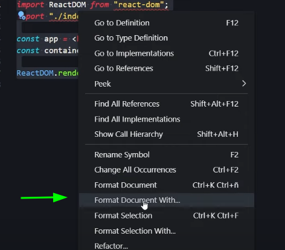
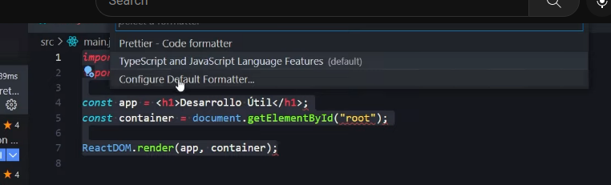
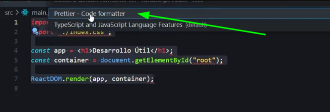

# Configuración Eslint y Prettier para ReactJS

```
::::::::::::::::::::::::::::::::::::::::::::::::::             :J555555555555555555555555J:           
::::::::::::::::::::::::::::::::::::::::::::::::::            ^5GGPPPPPPPGGGGGGGGPPPPPPPGG5^          
::::::::::^~~~~~~~~~~~~~~~~~^:^^^^^^^^^^::::::::::           ~PGPPPPPPPGGG5J!!J5GGGPPPPPPPGP~         
::::::::::~77777777777777777~:^^^^^^^^^^::::::::::          7GGPPPPGGGPY7^.    .^7YPGGGPPPPGG7        
::::::::::^7777!:~JJJJJJJJJJJJJJ7:^^^^^^::::::::::        .JGPPGGGP5?~.            .~?5PGGGPPGJ.      
::::::::::^!!!77!!777!^!77777!^~7!^^^^^^::::::::::       :YGPPG5J!:      .:~77~:.      :!J5GPPGY.     
::::::::::^777!!!7!!!~^~!!!!7!^~7!~^^^^^::::::::::      ^5GPGP~.      :~!????????!~:      .~PGPG5^    
::::::::::~?JJ!:!7!:^^^^^^:~7777!77~:^^^::::::::::     !PGPPG5     ^!7??????????????7!^     5GPPGP~   
::::::::::~7777777!:^^^^^^:7J?????J!:^^^::::::::::    7GGPPPG5    .????????????????????.    5GPPPGG7  
::::::::::^77^~????7^^!777!7777777^^^^^^::::::::::  .JGPPPPPG5    .????????????????????.    5GPPPPPGJ.
::::::::::^!!~~777!7~~!77!!!7777!~^^^^^^::::::::::  ?GPPPPPPG5    .????????????????????.    5GPPPPPPG?
::::::::::^777777^:!77777~:!????!:^^^^^^::::::::::  :YGPPPPPG5    .????????????????????.    5GPPPPPGY:
::::::::::~77^^??JJJJJJJJJJJ!:^^^^:^^^^^::::::::::   .?GPPPPG5    .????????????????????.    5GPPPPG?. 
::::::::::^7777777!^^~~~^^~~^^^^^^^^^^^^::::::::::     7GGPPG5     ~7????????????????7~     5GPPGG7   
::::::::::^777!!77!:^^^^^^^^^^^^^^^^^^^^::::::::::      ~PGPG5:      .^!7????????7!^.      :5GPGP~    
::::::::::^777~:7?7:^^^^^^^:^^^^:^^^^^^^::::::::::       :5GPPPY7^.      :^!??!~:      .^7YPPPG5:     
::::::::::^7777777!:^^^^^^^^^^:^^^^^^^^^::::::::::        .YGPPGGG5J!:      ..      :!J5GGGPPGY.      
::::::::::^^^^^^^^^::^^^^^^^^:::^^^^^^^:::::::::::          ?GPPPPGGGP5?~.      .~?5PGGGPPPPG?        
::::::::::::::::::::::::::::::::::::::::::::::::::           !PGPPPPPPGGGPY7^^7YPGGGPPPPPPGP!         
::::::::::::::::::::::::::::::::::::::::::::::::::            ^PGPPPPPPPPGGGGGGGGPPPPPPPPGP^          
                                                               :J555555555555555555555555J:           
```

## 🚨 11-2022 🚨

🔗 🏠 [Eslint](https://eslint.org/) ↗️  
🔗 🏠 [Prettier](https://prettier.io/) ↗️  

🎥 <https://www.youtube.com/watch?v=3BHXuZvI4FI> ↗️

Instalar eslint como dependencia de desarrollo dentro de la carpeta del proyecto.

```bash
npm i -D eslint
```

Para eslint configurar lo con su propia herramienta.

```bash
npx eslint --init
```

Muestra las siguientes preguntas para que se ajuste a nuestro proyecto, para que trabaje con react.

```bash
➜ npx eslint --init    
You can also run this command directly using 'npm init @eslint/config'.
✔ How would you like to use ESLint? · style
✔ What type of modules does your project use? · esm
✔ Which framework does your project use? · react
✔ Does your project use TypeScript? · No / Yes
✔ Where does your code run? · browser
✔ How would you like to define a style for your project? · guide
✔ Which style guide do you want to follow? · standard
✔ What format do you want your config file to be in? · JavaScript
Checking peerDependencies of eslint-config-standard@latest
The config that you have selected requires the following dependencies:

eslint-plugin-react@latest eslint-config-standard@latest eslint@^8.0.1 eslint-plugin-import@^2.25.2 eslint-plugin-n@^15.0.0 eslint-plugin-promise@^6.0.0
✔ Would you like to install them now? · No / Yes
✔ Which package manager do you want to use? · npm
Installing eslint-plugin-react@latest, eslint-config-standard@latest, eslint@^8.0.1, eslint-plugin-import@^2.25.2, eslint-plugin-n@^15.0.0, eslint-plugin-promise@^6.0.0
```

Como se muestra arriba, pide instalar dependencias, y se instalan con `npm`  👆

Y se crea el archivo `.eslintrc.js` en raíz del proyecto.

```js
module.exports = {
  env: {
    browser: true,
    es2021: true
  },
  extends: [
    'plugin:react/recommended',
    'standard'
  ],
  overrides: [
  ],
  parserOptions: {
    ecmaVersion: 'latest',
    sourceType: 'module'
  },
  plugins: [
    'react'
  ],
  rules: {
  }
}
```

Se instala en **VSCode** la librería **ESLint de Microsoft**

Se añade en `.eslintrc.js`. Que viene del plug-in de _eslint_ de github para react.

```js
extends: [
    'plugin:react/recommended',
    'plugin:react/jsx-runtime',  // <--- new
    'standard'
  ],
```

Se instala prettier.

```bash
npm i -D prettier
```

En la carpeta del proyecto en raíz, se crea el archivo `.prettierrc`. Se puede tomar como ejemplo de su página en [_doc's_](https://prettier.io/docs/en/options.html)  ejemplos de lo que se requiere de reglas para nuestro proyecto, en formato _json_

```json
{
    "bracketSpacing": true,
    "jsxSingleQuote": true,
    "printWidth": 120,
    "printWidth": 80,
    "semi": true,
    "singleQuote": true,
    "tabWidth": 2,
    "trailingComma": "es5"
}
```

Se instala _Prettier Formatter for Visual Studio Code_ y se activa.

Se configura en VSCode con que librería se va a hacer el formato.







Verificar que VSCode este activada la opción **Format on save** en _User_ y _Workspace_

Para que se queden configurado las reglas de _Prettier_ por en sima de las de _Eslint_ se instala el paquete

🔗 [npm link eslint-config-prettier](https://www.npmjs.com/package/eslint-config-prettier "npm link eslint-config-prettier")

```bash
npm i -D eslint-config-prettier
```

En el archivo `.eslintrc.js` se configura para que tome los cambios.

```json
extends: [
    'plugin:react/recommended',
    'plugin:react/jsx-runtime',
    'standard',
    'prettier'  // <-- 👀
    ],
```


Establecer los siguientes comando en el archivo `package.json` para su correcto funcionamiento con prettier.

```js
"scripts": {
    "start": "react-scripts start",
    "build": "react-scripts build",
    "test": "react-scripts test",
    "eject": "react-scripts eject",
    "format": "prettier --write .",  // <--- new
},
```

Después crear el archivo `.prettierignore` en raíz de del proyecto para que prettier ignore archivos que no es necesario que haga su formato.

```txt
dit
package-lock.json
```

Después crear el archivo `.eslintignore` en raíz de del proyecto para que prettier ignore _eslint_. Eslint no es un _"lint"_ para todo tipo de archivos sino solo para `.js` y `.jsx` y no hay que excluir el archivo `package-lock.json` por que no es ninguno de los anteriores.

```txt
dist
```

Establecer los siguientes comando en el archivo `package.json` para su correcto funcionamiento con eslint.

```js
"scripts": {
    "start": "react-scripts start",
    "build": "react-scripts build",
    "test": "react-scripts test",
    "eject": "react-scripts eject",
    "format": "prettier --write .",
    "lint": "eslint --fix . --ext .js,.jsx"  // <-- new
},
```

De esta manera se pueden ejecutar estos dos comando para dar formato establecido y mostrar lint de los archivos

```bash
npm run format
```

```bash
npm run lint
```

Cuando se ejecuta el comando anterior y se muestra el siguiente mensaje 👇

```bash
➜ npm run lint  

> todo-app-react@0.1.0 lint
> eslint --fix . --ext .js,.jsx

Warning: React version not specified in eslint-plugin-react settings. See https://github.com/jsx-eslint/eslint-plugin-react#configuration .
```

Seguir las instrucciones de la liga [eslint-plugin-react#configuration](https://github.com/jsx-eslint/eslint-plugin-react#configuration)

Y modificar el archivo `.eslintrc.js` para agregar la siguiente modificación.

```js
  settings: {
    "react": {
      version: 'detect', // React version. "detect" automatically picks the version you have installed.
    },
  },
```

Y el resultado es de la siguiente manera.

```bash
➜ npm run lint

> todo-app-react@0.1.0 lint
> eslint --fix . --ext .js,.jsx


/home/mack/Documents/todo-app-react/src/App.test.js
  4:1  error  'test' is not defined    no-undef
  7:3  error  'expect' is not defined  no-undef

✖ 2 problems (2 errors, 0 warnings)
```

**NOTA:** Si se presenta error

```bash
`The react-scripts package provided by Create React App requires a dependency:

"eslint": "5.12.0"
```

En el archivo `package.json` actualizar `react-scripts` a **5.0.1** para que quede se la siguiente manera.

```json
"dependencies": {
    "@testing-library/jest-dom": "^5.16.5",
    "@testing-library/react": "^13.4.0",
    "@testing-library/user-event": "^13.5.0",
    "react": "^18.2.0",
    "react-dom": "^18.2.0",
    "react-scripts": "^5.0.1", // <-- 👁️
    "web-vitals": "^2.1.4"
},
```
