# Curso de Sistemas de Diseño para Desarrolladores

## 1. Introducción
### 1. Introducción y presentación
### 2. Conoce Sistemas de Diseño populares
Conocer otros sistemas de diseño te permite tener referencias a la hora de pensar cómo empezar el tuyo. Muchos están documentados y puedes ver sus aprendizajes paso a paso en el proceso de construirlo.

El sistema de diseño se basa en ayudar de manera estandarizada y óptima los procesos de creación de funcionalidades, flujos y componentes del producto.

+ Es por eso que podemos definir diferentes puntos a tener en cuenta ahora que construyamos nuestro sistema de diseño:
    1. Flujo del equipo
    2. Sistema de versionamiento y alta de documentos y pantallas
    3. Documentación
    4. Construcción y distribución
    5. Revisión y deploy

Como haremos la revisión de los archivos de construcción y mantendremos sano nuestro sistema, o las conexiones a nuestro sistema.

Además te permite vislumbrar todo lo que vamos a construir a lo largo de este curso, y determinar qué aspectos de tu Sistema de Diseño son necesarios o prescindibles.

Un sistema de diseño busca sobre todo mejorar el flujo de trabajo de equipo permitiéndole aprender e iterar mucho más rápido y eficiente

## 2. Instalación y flujos de trabajo
### 3. Bonus: Personalizando la Terminal

Personalizar la terminal con ["Oh My ZSH!"](https://ohmyz.sh/)

### 4. Instalación y flujos de trabajo
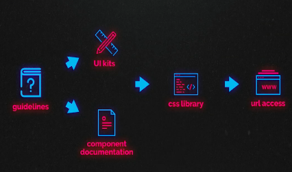
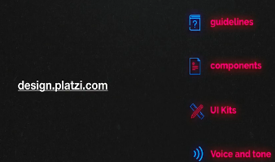

El Sistema de Diseño es como una “API del diseño”, que te servirá para comunicar tu sistema a nivel código.

Estos son los pasos que tendremos en cuenta:

Empezaremos por crear una URL que centralice los elementos principales de tu Sistema de Diseño.
Instalaremos Node y Express para poder construir tu web de manera muy visual rápidamente.

+ :link: [Node js](https://nodejs.org/es/)
+ :link: [npm | Build amazing things](https://www.npmjs.com/)
+ :link: [Express Infraestructura web rápida, minimalista y flexible para Node.js](https://expressjs.com/es/)
+ :link: [Express application generator](https://expressjs.com/en/starter/generator.html)
+ :link: [Create New Express.js Apps in Minutes with Express Generator](https://www.sitepoint.com/create-new-express-js-apps-with-express-generator/)

1. Instalar **node**
2. Instalar **express**
    2.1. Instalar express de forma global
```bash
$ sudo npm install express-generator -g
```
    2.2. Instalar Express en el directorio <MY_APP> y guardar en la lista de dependencias.
```bash
$ npm install express --save
```
3. NOTA: You can run the application generator with the npx command (available in Node.js 8.2.0).
```bash
$ npx express-generator --version
# OUTPUT
npx: installed 10 in 3.114s
4.16.1
```
4. Dentro de la carpta del proyecto "Desing-system"
```bash
$ npx express-generator --view=pug Desing-system
```
Salida..
```bash
npx: installed 10 in 2.915s

   create : Desing-system/
   create : Desing-system/public/
   create : Desing-system/public/javascripts/
   create : Desing-system/public/images/
   create : Desing-system/public/stylesheets/
   create : Desing-system/public/stylesheets/style.css
   create : Desing-system/routes/
   create : Desing-system/routes/index.js
   create : Desing-system/routes/users.js
   create : Desing-system/views/
   create : Desing-system/views/error.pug
   create : Desing-system/views/index.pug
   create : Desing-system/views/layout.pug
   create : Desing-system/app.js
   create : Desing-system/package.json
   create : Desing-system/bin/
   create : Desing-system/bin/www

   change directory:
     $ cd Desing-system

   install dependencies:
     $ npm install

   run the app:
     $ DEBUG=desing-system:* npm start

```
El arbol de direcotrios queda así, **dentro de la carpeta de proyecto que se creeo**
```bash
.
├── bin
├── node_modules
├── public
├── routes
└── views
```
5. Entrar a la carpeta
```bash
$ cd Desing-system
```
6. Instalar
```bash
$ npm install
```
7. Para iniciar el servidor
```bash
$ npm start
# http://127.0.0.1:3000/
```
7.1. Para hacer debug
```bash
 $ DEBUG=desing-system:* npm start
 # http://127.0.0.1:3000/
```

### 5. Instalación de Node / Express desde 0
**Punto 4**

### 6. Bonus: html, css, js
:octocat: [Github Platzi_DS](https://github.com/rulotico/Platzi_DS)
```bash

├── images
├── javascripts
└── stylesheets # ESTAN LOS ESTILOS
```
En la carpeta `public/views` se encuentran los archivos `.pug`

## 3. Automatización
### 7. Automatización (Pre procesadores)
+ :link: [Gulp A toolkit to automate & enhance your workflow](https://gulpjs.com/)
+ :link: [Quick Start](https://gulpjs.com/docs/en/getting-started/quick-start)
+ :link: [Gulp plugins](https://gulpjs.com/plugins/)

Dentro de nuestro proyecto vamos a instalar otras dos dependencias `npm install gulp` y `npm install scss`

**¿Qué es gulp?**
Gulp es una herramienta para poder automatizar procesos por medio de pipelines, o sea flujos , digamos que le decimos primero haz esto y luego haz esto con tan solo un comando, justo lo que necesitamos.

**¿Qué es SCSS?**
Como CSS requiere de muchos caracteres pues SCSS lo hace más fácil donde utilizamos el poder de la programación para definir variables y construir de manera modular CSS, esto nos mantiene óptimos y sobre todo podemos asegurar la consistencia de nuestro sistema. Comenzamos a instalar las funciones que necesitas para potenciar tu SCSS y terminaremos de hacerlo en la siguiente clase.

1. Instalar gulp de manera global
```bash
$ npm install --global gulp-cli
```
2. Verla version de gulp
```bash
$ gulp --version
# OUTPUT
CLI version: 2.2.0
Local version: Unknown
```
3. Dentro de la carpeta del proyecto donde esta el archivo `package.jason` de lo contrario iniciarlo mediante `npm init` instalar _gulp_ en las dependencias **dev** de desarrollo
```bash
$ npm install --save-dev gulp
```
4. Para evitar el error de comunicación asíncrona basta con reemplazar el código del archivo `gulpfile.js` por el siguiente:
```javascript
var gulp = require('gulp');
var sass = require('gulp-sass');
// var concat = require('gulp-concat');
// var minifyCSS = require('gulp-minify-css');
// var version = require('./package.json');

//npm install gulp --save --only=dev
gulp.task('hello', async () => {
  console.log('Hello ');
});

//npm install gulp-sass
gulp.task('sass', async () => {
  return gulp
    .src('scss/**/*.scss')
    .pipe(sass()) // Converts Sass to CSS with gulp-sass
    .pipe(gulp.dest('public/stylesheets'));
});
```
5. Se instala sas de npm
```bash
$ npm install gulp-sass
```

6. para ejecutar las funciones
```bash
$ gulp hello
```
7. Para convertit el archivo **sass -> css**
```bash
$ gulp sass
```

### 8. Continuando con la automatización
Continuamos la instalación de las funciones que necesitamos de gulp, y una vez instalados ahora vamos crear los siguientes archivos y funciones:

+ Dentro de la carpeta de SCSS crearemos una estructura atómica
    * Fundations
    * Atomos
    * Moléculas
    * Organismos
    * Páginas
    * Templates

+ En gulp vamos a crear las siguientes funciones:
    + Compilador de `SCSS` a `main.css`

El archivo `gulpfile.js` quedaria así
```javascript
var gulp = require('gulp');
var sass = require('gulp-sass');
var minifyCSS = require('gulp-minify-css');
var concat = require('gulp-concat');
// var version = require('./package.json');

// npm install gulp --save --only=dev
gulp.task('hello', async () => {
  console.log('Hello ');
});

// npm install gulp-sass
gulp.task('sass', async () => {
  return gulp
    .src('scss/**/*.scss')
    .pipe(sass()) // Converts Sass to CSS with gulp-sass
    .pipe(gulp.dest('public/stylesheets'));
});

// npm install gulp-minify-css
// npm install gulp-concat
gulp.task('style_min', () => {
  return gulp
    .src('scss/**/*.scss')
    .pipe(sass())
    .pipe(minifyCSS())
    .pipe(concat('style_main.min.css'))
    .pipe(gulp.dest('public/stylesheets'))
});

// npm install gulp-watch
// PARA VERSIONES ARRIVA DE 4 EN GULP
gulp.task('watch', () => {
    gulp.watch('scss/**/*.scss', gulp.series('style_min'));
});
```
Para que funcione `gulp style_min` que es fucionar los archivos que se encuentran en la carpeta de **scss** en un solo archivo con nombre `style_main.min.css`  como se menciona en `gulp.task('style_min', () => {` se ejecuta `gulp style_min`

Con `gulp watch` se ejecuta para que se quede en escucha cuando se hacen los cambios y se reflejen inmediatamente en la funcion `gulp.task('watch', () => {`

## 4. Paradigmas
### 9. SMACSS: Arquitectura de CSS escalable y modular
Existen diferentes paradigmas y vamos a revisar algunos de ellos en las próximas clases para definir el mejor para nuestro sistema pues depende mucho de las necesidades de cada proyecto.

En esta clase analizaremos el paradigma **SMACSS** o _Scalable and Modular Architecture for CSS_ (**Arquitectura en CSS Escalable y Modular**).

**SMACSS** se trata de una manera de construcción para los estilos de tu sistema. Es un paradigma basado en las siguientes categorías, que analizaremos en profundidad en esta clase:
+ Base
+ Layout
+ Module
+ State
+ Theme

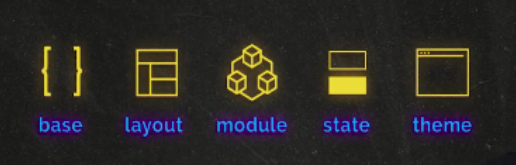
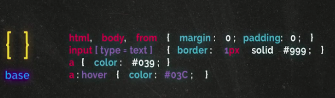
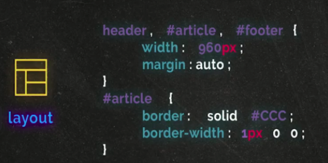
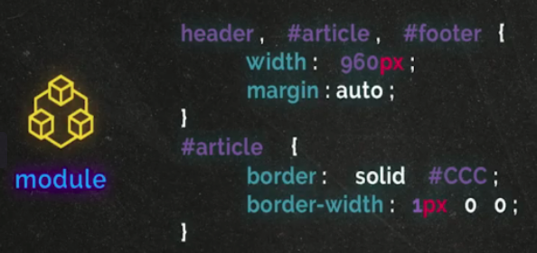
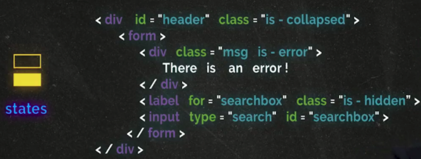
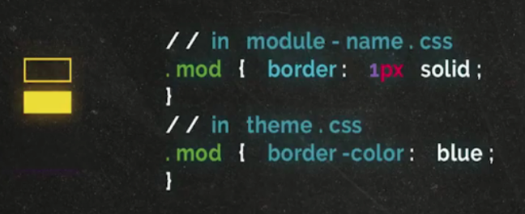

1. **Base rules.** These are styles of the main website elements - body, input, button, ul, ol, etc. In this section, we use mainly [HTML tags and attribute selectors](https://magora-systems.com/how-to-use-css-selectors/), in exceptional cases - classes (for example, if you have JavaScript-style selections);
2. **Layout rules.** Here are the styles of global elements, the size of the cap, footer, sidebar, etc. Jonathan suggests using id here in selectors since these elements will not occur more than 1 time on the page. However, the author of the article considers this a bad practice (whenever an id appears in the styles, somewhere in the world the kitten is sad).
3. **Modules rules.** Blocks that can be used multiple times on a single page. For module classes, it is not recommended to use id and tag selectors (for reuse and context independence, respectively).
4. **State rules.** In this section, the various statuses of the modules and the basis of the site are prescribed. This is the only section in which the use of the keyword "! Important" is acceptable.
5. **Theme rules.** Design styles that you might need to replace.

### 10. OCSS: Orientación de objetos en CSS
**OCSS o Object-Oriented CSS** (_Orientación de objetos en CSS_).

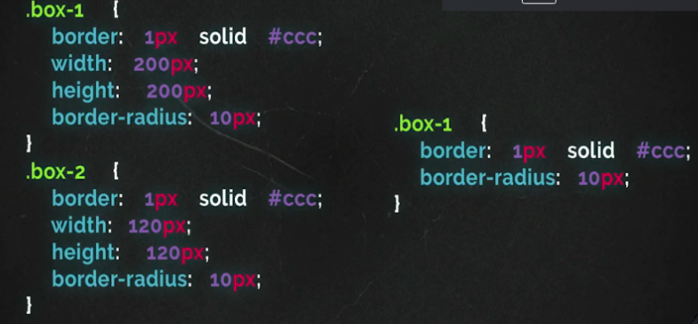

Este se trata de un paradigma basado en la creación de objetos, que son básicamente lo que también se llama modulo o componente en otros paradigmas.

Este paradigma puede no incluir la estructura base del html.

[OOCSS] (https://github.com/stubbornella/oocss/wiki) significa CSS orientado a objetos. 

Este enfoque tiene dos [ideas] principales (http://www.slideshare.net/stubbornella/object-oriented-css):

- Separación de estructura y diseño.
- Separación de contenedor y contenido.

Usando esta estructura, el desarrollador obtiene clases generales que pueden usarse en diferentes lugares.

En este paso, hay dos noticias (como siempre, buenas y malas):

- **Bueno**: reduce la cantidad de código reutilizándolo (principio DRY).
- **Malo**: soporte complejo. Cuando cambia el estilo de un elemento en particular, lo más probable es que tenga que cambiar no solo CSS (porque la mayoría de las clases son comunes), sino también agregar clases al marcado.

Además, el enfoque **OOCSS** en sí no ofrece reglas específicas, sino recomendaciones abstractas, por lo que la forma en que este método termina en producción varía.

De hecho, las ideas en **OOCSS** inspiraron a otros a crear sus propias formas más concretas de estructuración de código.

### 11. BEM
**BEM** es un paradigma que anticipa modificadores de un componente.

En esta metodología categorizamos o dividimos las clases de la siguiente manera:

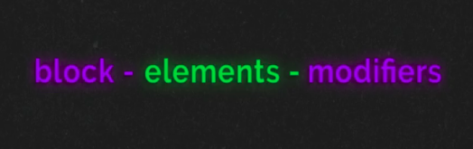
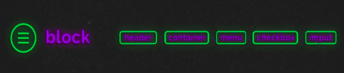
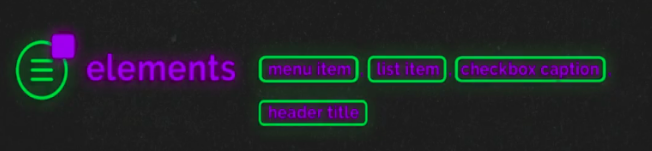
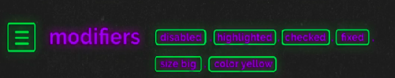
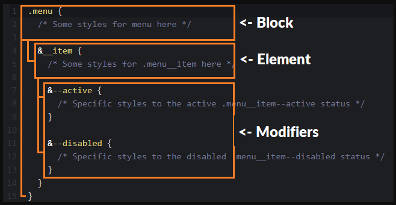

**Block (Bloque)**
>Los bloques consideran contenedores de los componentes que nos sirven para englobarlos tipo objetos.

**Elements (Elementos)**
>Los elementos que van dentro de estos contenedores

**Modifiers (modificadores)**
>Son clases de lo más geniales, nos permiten modificar el comportamiento o estilo de un componente.

### 12. Bonus: Bootstrap

Es un libreria de elementos que ya esta construida.

## 5. Naming
### 13. Naming
**Modificadores**
Son clases que modifican el comportamiento o clase de un elemento.

**Utilidades**
Son clases que nos ayudan a generar ciertas propiedades de uso general.

## 6. Qué son los tokens
### 14. ¿Qué son los tokens?
Nuestro objetivo es sistematizar nuestros procesos entonces nuestro sistema tiene que ser un ente configurable. En este sentido, los tokens son configuraciones que afectan a todo nuestro sistema tales como:

+ Colores
+ Tipografía
+ Reglas de espaciado
+ Brakepoints

Definiremos nuestros colores basándonos en algún paradigma o en los guidelines y UI kit del producto, para definir estas variables es importante que si trabajamos con un diseñador, este también este presente y pueda verificar la viabilidad de lo que estamos haciendo.

Vamos a crear las reglas necesarias para fundamentar nuestro sistema de columnas y podremos hacer otras extras que nos permitan generar un nuevo sistema de interacción mobile. Para esto crearemos un archivo llamado brakepoints.scss

Folder Tokens

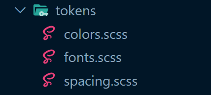

`colors.scss`
```sass
// Brand colors
$white_brand: #fff;
$green_brand: #98ca3d;

// Action colors
$primary_action: #abe542;
$seconday_action: #8f97a2;

// Boolean colors
$positive: #15ff93;
$negative: #f04f8d;

//Backgrounds
$background_blue: #233946;
//  Basic colors
$white_normal: #f9f9f9;
$black_normal: #1c1d21;
```
`fonts.scss`
```sass
@import url("https://fonts.googleapis.com/css?family=Montserrat&display=swap");
$font: "Montserrat", sans-serif;
// Typos
$p: 12px;
$small: 10px;
$h1: 50px;
$h2: 30px;
$h3: 20px;
// Typo Bolds
$black: 800;
$bolder: 600;
$medium: 600;
$normal: 500;
$light: 400;
```

`spacing.scss`
```sass
$space: 10px;

// Opcional:
// $space_half: 5px;
// $space_x2: 20px;
// $space_x3: 30px;
```

Folder Fundations

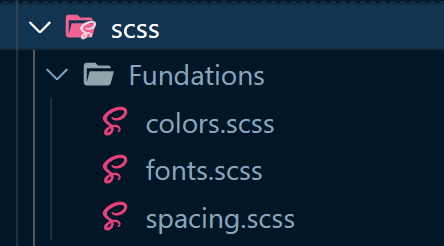

`fonts.scss`
```sass
@import "../tokens/fonts.scss";
@import "../tokens/colors.scss";
@import "../tokens/spacing.scss";

body,
html {
  font-family: $font;
}
h1 {
  font-size: $h1;
}
h2 {
  font-size: $h2;
}
h3 {
  font-size: $h3;
}
h1,
h2,
h3 {
  margin-top: $space;
  margin-bottom: $space;
}
p,
a,
.normal {
  font-size: $p;
  margin-top: $space;
  margin-bottom: $space;
}
.small {
  font-size: $small;
}
.bold {
  font-weight: $bolder;
}
```

`spacing.scss`
```sass
@import "../tokens/spacing.scss";

@mixin constructor($num) {
  padding: $num;
  &_margin {
    margin: $num;
  }

  &_top {
    padding-top: $num;
    &_margin {
      margin-top: $num;
    }
  }

  &_bottom {
    padding-top: $num;
    &_margin {
      margin-bottom: $num;
    }
  }

  &_left {
    padding-top: $num;
    &_margin {
      margin-left: $num;
    }
  }
  &right {
    padding-top: $num;
    &_margin {
      margin-right: $num;
    }
  }
}

.spaced {
  padding: $space;
}
.space {
  @include constructor($space);
}
.space_2 {
  @include constructor($space * 2);
}
.space_3 {
  @include constructor($space * 3);
}
.space_4 {
  @include constructor($space * 4);
}
.space_5 {
  @include constructor($space * 5);
}
```

## 7. Espaciado
### 15. Espaciado

Ya que tenemos elementos dentro de nuestro sistema, ahora tenemos que poner a prueba nuestros tokens de espaciado para ello crearemos un organismo para ver cuál es el efecto de nuestras reglas cuando los átomos conviven en un ecosistema de elementos.

El organismo más común de toda plataforma es el formulario que nos ayuda a recopilar información del usuario. Para esto tomaremos elementos como:

+ Label
+ Input
+ Alert
+ Btn
+ Modals

## 8. Grillas
### 16. Grillas

:link: [A Simple Responsive Grid, Made Even Better With Sass](https://webdesign.tutsplus.com/tutorials/a-simple-responsive-grid-made-even-better-with-sass--cms-21540)

Para esto necesitamos crear un sistema de columnas.

+ Antes de hacerlo vamos a cuestionar si usaremos un layout al que tengamos que seguir, pues esto es bastante importante para la reglamentación de nuestro grid.
+ Utilizaremos el sistema de doce columnas como lo hace Bootstrap, basados en un layout.
+ Una vez definido tenemos cómo funcionan nuestras columnas, el departamento de diseño tienen que estimar cómo es que sus componentes se van a comportar y para ello este sistema les ayudara cuando estén diseñando.
+ Una parte importante es que el documento de diseño como programación, siga las mismas reglas.
+ Dentro de nuestro _wrapper_, donde definiremos el contenido construiremos los _grid_, podemos basarnos en librerías de grids que ya existen en internet, solo tenemos que modificar los estilos para que tengan sentido dentro de nuestro sistema.
+ Hay tres cosas importantes qué definir dentro del _grid_ de nuestro sistema:
    1. Nomenclatura de columnas
    2. Nomenclatura de los brakepoints
    3. Obtener los tokens de nuestro sistema para esta definición.

En la carpeta _vendors_ en _scss_ se ocupa para poner los estinos de externos.

### 17. Bonus: Animando en CSS

:link: [@keyframes](https://developer.mozilla.org/en-US/docs/Web/CSS/@keyframes)

```css
@keyframes mymove{
    0% {opacity:1}
      25% {opacity:1}
      50% {opacity:.5}
      75% {opacity:.5}
      90%{opacity: .2}
      100% {opacity:1}
    }
```

## 9. Mi primer componente
### 18. Mi primer componente
Para definir un componente necesitarás tener previamente definidos:

+ Tokens
+ Naming
+ Modificadores o Utilities

Al construir el componente en cuestión, seguimos las buenas prácticas que venimos aprendiendo. Es importante que tengas documentado el proceso en tu librería y un espacio para definir nuevos componentes.

Se tiene que tener en cuenta la carpeta `routes` la cual tienen las rutas de las vitas que estan en `views`

Se tienen que leer el proyecto de la carpeta `Platzi_DS`

## 10. Documentación
### 19. Documentación
Hay que tener en cuenta que somos parte de un proceso, un proceso que empieza desde la idea de resolver un problema, se crea una herramienta y se le da al usuario.

Es súper importante documentar cada elemento del sistema para que el siguiente en la construcción de esta gran fabrica de elementos le pueda ser más fácil y eficiente la construcción.

También te permite anticiparte a los momentos que puede tener el que se dedique a conectar este componente y brindarle las herramientas necesarias es nuestro trabajo.

Algunos puntos importantes que tienes que definir en tu documentación dentro del sistema
1. **Titulo** El nombre del componente que viene desde el diseño del componente.
2. **Descripción** La descripción de por qué estamos haciendo este componente y que resuelve
3. **Implementación** Descripción sobre cómo puedes implementar este componente en tu proyecto
4. **Estados** Estados que tiene con los modificadores o utilidades y si pudiera no funcionar en otros contextos o reglas que no se hayan definido.
5. **Bitacora** Donde defines que cambios a tenido el componente durante la vida del sistema

## 11. Testing
### 20. Testing
Es muy importante definir la manera en que calificarás el éxito, cómo tendremos la capacidad de evaluar lo que diseñamos y construimos vs el usuario.

Para eso crearemos indicadores dentro del sistema que nos permitan tener esa respuesta y demuestre ante el equipo las desiciones que tomamos.

+ Evaluemos el código vs Diseño
+ Evaluemos el comportamiento
+ Evaluemos el mobile

Para hacer estas pruebas yo recomiendo que lo puedas tener dentro de una plataforma tipo KANBAN Al final del día tu puedes definir tu lista de Testing, ésta ve de forma general la evaluación de un componente pero en tu proyecto dependiendo del producto que estas desarrollando tal vez requiera más o menos.

### 21. Bonus: Debug en el navegador
Inspeccionar en chrome con las herramientas de desarrollador.

## 12. Deploy y versionamiento
### 22. Cómo empezar en Github
Crear un repositorio y subir cambios de nuestro proyecto.

### 23. Deploy y versionamiento
Nuestro sistema también tienen niveles de producción y hasta ahora hemos trabajo en _test_, es momento de crear un _pipeline_ de producción para que sea publico a todo mundo y se pueda utilizar de manera frecuente.

Vamos a utilizar **Heroku** para desarrollar este _pipeline_ y también aprenderemos a hacer una _bitácora_ de actualizaciones del sistema pues es importante informar al equipo del cambio.

Para ello tenemos que definir en nuestro sistema una nueva ruta en la cual vamos a ir poniendo cuales son las nuevas actualizaciones, recuerda que el sistema servirá para que más equipo puedan construir es por ello que tratas de ser sumemente claro.

La función `/Whats_new` Nos ayudará a que la gente pueda ver las actualizaciones.

- Consejos:
    * Trata de ser conciso.
    * informa de las clases que tuvieron algún cambio y conflictos que tu visualizas que pudiera haber.
    * Incluye hyperlinks.

## 13. Design review
### 24. Design review
Los más importante del sistema es que todos los equipos que participan en la creación de software estén alineados.

Es por esto que también tienes que evaluar cuales son los puntos buenos o malos de tu sistema y saber si necesitas una reestructura o mejorar ciertos procesos, siempre es bueno tener en mente hacia a donde vas y que quieres lograr con el sistema, pues sin un objetivo claro todos estaremos trabajando sin un objetivo común.

Algunos puntos muy importante para cuidar el trabajo en equipo son:

1. Ten juntas semanales donde hables del sistema.
2. Pregunta a otros departamentos si les facilita la construcción del producto.
3. De no ser así media que cosas puedes hacer.
4. **No generes deuda técnica**, los cambios y parches rápidos al final del día te vendrán a tirar el sistema.
5. **Ten un roadmap del sistema**. Siempre trata de ser sistemático y trabaja para los demás. Todo el equipo te lo agradecerá.
6. Siempre asegura que lo que imaginas se diseñe y que lo que diseñas se construya.


