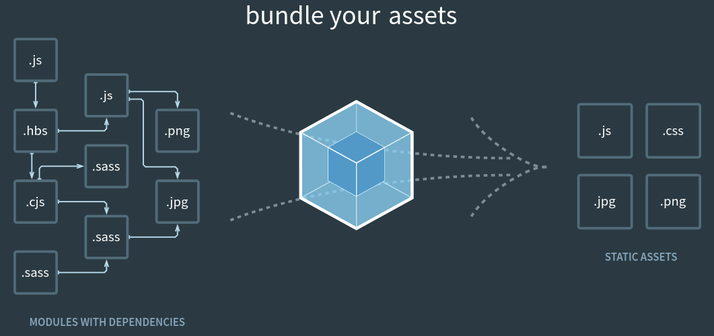

# WebPack

## MyNotes

+ :link: [Offical webpage Webpack](https://webpack.js.org/)
+ :link: [Offical webpage Webpack Configuration](https://webpack.js.org/configuration/)
+ :link: [Create App - Frontend build config generator](https://createapp.dev/webpack)

:eyes: :rotating_light:
```
Para HTML = usar ( )
Para Lógica = usar { }
```

Para ver tu proyecto desde el celular:

Si agregas `--host 0.0.0.0` (sustituye `0.0.0.0` _por tu dirección IP_ que puedes ver en la configuración de tu red) al script start, puedes acceder desde otros dispositivos al proyecto. Por ejemplo:
```
"start": "webpack-dev-server --open --mode development --host 192.168.1.101"
```
:o:
```
"start": "webpack-dev-server --open --mode development --host 0.0.0.0"
```
Ahora al ejecutar `npm run start` tu proyecto se puede visualizar desde otros dispositivos conectados a tu red con la dirección IP. Por ejemplo:

`http://192.168.1.101:8080/`

#### Webpack
> Se define como un empaquetador de módulos estaticos para aplicaciones JavaScript modernas.

+ Gestión de dependencias
+ Ejecución de tareas
+ Conversión de formatos
+ Servidor de desarrollo
+ Carga y uso de módulos




#### Webpack Config
```js
const path = require('path');

module.export = {
    entry: '',
    output: {
        path: path.resolve(__dirname, 'dist'),
        filename: '[name].js'
    },
    resolve: {
        extensions: []
    },
    module: {
        rules: []
    },
    plugins: []
}
```
#### Múltiples archivos de configuración
```js
const path = require('path');

module.export = {
    // PROD
    mode: 'production',
    devtool: 'source-map',
    optimization: {
        ...
    },
    // DEVELOP
    mode: 'production',
    devtool: 'eval-source-map',
}
```
#### Babel
> Es una herramienta que nos permite transformar nuestro código Javascript JS6 a Javascript que cualquier navegador soporte

#### Hot Reload

```js
module.export = {
    ...
    devServer: {
        contentBase: path.join(__dirname, 'dist'),
        compress: true,
        port: 9000
    }
}
```

1. Crear folder  `$ mkdir <folder_name>`
2. Install git `$ git init`
3. Install npm `$ npm init -y`
4. Install react `$ npm install react react-dom`
5. Crear archivo en raiz`.gitignore` recomendado por Platzi de :link: [.gitignore](https://gist.github.com/gndx/747a8913d12e96ff8374e2125efde544)
6. Instalar `npm install --save-dev @babel/core` :link:[@babel/core](https://www.npmjs.com/package/@babel/core)
6. Instalar `npm install -D babel-loader @babel/core @babel/preset-env` :link: [Babel Loader](https://www.npmjs.com/package/babel-loader)
7. Instalar `npm install --save-dev @babel/preset-react` :link: [@babel/preset-react](https://www.npmjs.com/package/@babel/preset-react)
8. `$ npm audit fix`
9. Crear el archivo `.babelrc` en raiz
10. Instalar `npm install --save-dev webpack webpack-cli html-webpack-plugin html-loader`
11. Orden de archivos al momento
```bash
├── package.json
├── package-lock.json
├── public
│   └── index.html
├── src
│   ├── components
│   └── index.js
└── webpack.config.js
```
12. Script para ejecutar las tareas de Webpack `package.json` se modifica añadiendo lo siguiente para compilar el proyecto
```json
{
  "scripts": {
    "build": "webpack --mode production"
  },
}
```
13. `$ npm run build`

14. Instalación de Webpack Dev Server:
```bash
$ npm install --save-dev webpack-dev-server
```

15. Para probrar lo que estamos contruyendo y crear un entorno de desarrollo local que nos permita ver los cambios en tiempo real.

Script para ejecutar el servidor de Webpack y visualizar los cambios en tiempo real (package.json):

Modo de desarrollo

`package.json`
```json
{
  "scripts": {
    "build": "webpack --mode production",
    "start": "webpack-dev-server --open --mode development"
  },
}
```
16. Instalar :link:[file-loader](https://www.npmjs.com/package/file-loader) para subir archivos.
```bash
$ npm install file-loader --save-dev
```
Se modifica el Webpack `webpack.config.js`
```js
...
      {
        test: /\.(png|jp(e*)g|svg|gif)$/,
        use: [
          {
            loader: 'file-loader',
            options: {
              name: './assets/[hash].[ext]'
            },
          },
        ],
      },
...
```
Dentro de la carpeta `src` se crea la carpeta `assets`

17. Los **preprocesadores** como _Sass_ son herramientas que nos permiten escribir CSS con una sintaxis un poco diferente y más amigable que luego se transformará en CSS normal. Gracias a _Sass_ podemos escribir CSS con variables, mixins, bucles, entre otras características.

Instalación de _Sass_:
```bash
$ npm install --save-dev mini-css-extract-plugin css-loader node-sass sass-loader
```
Se añade una nueva regla "test" a la Configuración de Sass en Webpack `webpack.config.js`:
```js
const MiniCssExtractPlugin = require('mini-css-extract-plugin');
// ...
module: {
  rules: [
    {
      test: /\.(s*)css$/,
      use: [
        { loader: MiniCssExtractPlugin.loader },
        'css-loader',
        'sass-loader',
      ],
    }, 
  ],
},
// ...
plugins: [
  new MiniCssExtractPlugin({
    filename: 'assets/[name].css',
  }),
],`
```
La estructura recomendada es que dentro de la carpeta `src` se se cree la carpeta `assets` y dentro de esta, crear otra carpeta llamada `styles` y se crea el archivo `App.scss`

Hasta el momento la estructura
```bash
src
├── assets
│   └── styles
│       └── componentes
    │       └── <NOMBRE_DE_LOS_COMPONENTES>.scss
├── components
│   └── <NOMBRE_DE_LOS_COMPONENTES>.jsx
└── index.js
```
18. Eslint

+ :link: [ESLint Find and fix problems in your JavaScript code](https://eslint.org/)
+ :link: [Configuring ESLint](https://eslint.org/docs/user-guide/configuring)

Los _linters_ como **ESLint** son herramientas que nos ayudan a seguir buenas prácticas o guías de estilo de nuestro código.
Se encargan de revisar el código que escribimos para indicarnos dónde tenemos errores o posibles errores. En algunos casos también pueden solucionar los errores automáticamente. De esta manera podemos solucionar los errores incluso antes de que sucedan.   
Instalación de **ESLint**:

El archivo sigerido por Platzi de [.gitignore](https://gist.github.com/gndx/747a8913d12e96ff8374e2125efde544)

+ :link: [eslint-config-airbnb](https://www.npmjs.com/package/eslint-config-airbnb)

```bash
$ npm install --save-dev eslint babel-eslint eslint-config-airbnb eslint-plugin-import eslint-plugin-react eslint-plugin-jsx-a11y

```
19. Prettier an opinionated code formatter. :link: [Prettier](https://prettier.io/)

+ :link: [Prettier npm](https://www.npmjs.com/package/prettier)
```bash
$ npm install --save-dev prettier
```

`.pretierrc`
```json
{
  "trailingComma": "es5",
  "semi": true,
  "singleQuote": true
}
```
Modificar el archivo `package.json` para poder ejecutar los comandos

`package.json`
```json
{
  "scripts": {
      "format": "prettier --write '{*.js,src/**/*.{js,jsx}}'",
      //"format": "prettier --write '{*.js,src/**/*.js}'",
      "lint": "eslint src/ --fix"
  },
}
```
#### Para usar/habilitar Async/Await con react, webpack

Se tiene que instalar el paquete de :link: [@babel/plugin-transform-runtime](https://babeljs.io/docs/en/babel-plugin-transform-runtime)

Y modifcar el archivo `.babelrc` añadiendo la siguiente linea
```json
{
  "plugins": ["@babel/plugin-transform-runtime"]
}
```
Para que quede de la siguiente manera
```json
{
  "presets": ["@babel/preset-env", "@babel/preset-react"],
  "plugins": ["@babel/plugin-transform-runtime"]
}
```

#### ¿Que son los hooks?
> Son funciones que nos permiten acceder a *casi todas* las caracteristicas de RactJs desde componentes funcionales

+ Hooks principales
    - `useState` : **Añadir un estado** local en el componente
    - `useEffect` : __Ejecuta una funcion__ cada vez que necesitemos renderizar nuestro componente
    - `useContext` : Permite acceder al contexto del API y tener valores que se ocuparan en todo la aplicación de forma global.
+ Hooks auxiliares
    - `useReducer` Nos permite acualizar el estado del componente
    - `useCallback` 
    - `useMemo` 
    - `useRef` Permite tomar referencias de los elementos del DOM
    - `useImperativeHandle` 
    - `useLayoutEffect` 
    - `useDebugValue` Acceder a valores sin usar el `console.log`


```js
import React, { useState } from 'react'

export default function Counter() {
    // counter -> ES EL VALOR DEL ESTADO
    // setCount -> METODO PARA ACTUALIZAR EL ESTADO DEL COMPONENTE
    const [counter, setCount] = useState (0)
    return(
        <div>
            <span>{ counter }</span>
            <buttom onCLick={() => setCount(counter + 1)}>+</buttom>
            <buttom onCLick={() => setCount(counter - 1)}>+</buttom>
        </div>
    )
}

```
Para ocupar Material-UI

+ :link: [Material-UI](https://material-ui.com/getting-started/installation/)
+ :link: :octocat: [Github Material-UI](https://github.com/mui-org/material-ui)
+ :link: :octocat: [Github template example sing-in](https://material-ui.com/getting-started/templates/sign-in/)
```bash
$ npm install @material-ui/core
```
```bash
$ npm install @material-ui/icons
```

Para instalar **React router** para moverse entre las páginas de la app

+ :link: [React router quick start](https://reactrouter.com/web/guides/quick-start)
+ :link: [npm React router](https://www.npmjs.com/package/react-router)
+ :link: :octocat: [Github React router](https://github.com/ReactTraining/react-router)
```bash 
$ npm install react-router-dom
```

+ :link: [webpack configuration](https://webpack.js.org/configuration/dev-server/#devserverhistoryapifallback)

Debemos modificar nuestra configuración del entorno de desarrollo local _para que pueda funcionar con el uso de rutas_, debemos ir al archivo `webpack.config.js` y añadir este fragmento de código antes de `plugins`:

```js
module.exports = {
  {/*...*/}
  devServer: {  
    historyApiFallback: true,  
  },
  {/*...*/}
}
```

+ **Atributos para los Route Objects**:
    - `path`: la ruta en la que se renderizará el componente en forma de cadena de texto
    - `exact`: un booleano para definir si queremos que la ruta tiene o no que ser exacta para renderizar un componente. Eg: /index !== /index/all.
    - `strict`: un booleano para definir si queremos que el último slash sea tomado en cuenta para renderizar un componente. Eg: /index !== /index/.
    - `sensitive`: un booleano para definir si queremos distinguir entre minúsculas y mayúsculas, y tomar esto en cuenta para renderizar un componente. Eg: /index !== /Index
    - `component`: recibe un componente a renderizar. Crea un nuevo elemento de React cada vez. Esto causa que el componente se monte y desmonte cada vez (no actualiza).
    - `render`: recibe un método que retorna un componente. A diferencia de component no remonta el componente.
+ **Tipos de enrutadores**:
    -  `BrowserRouter`: Es el enrutador que quizá más tiempo utilices como frontend, usa el HTML5 history API lo que quiere decir que es el enrutador que nos da la posibilidad de cambiar las rutas en el navegador.
    - `HashRouter`: Funciona similar al BrowserRouter, pero usa un hash (#) al inicio de cada url.
    - `MemoryRouter`: Mantiene el historial de búsqueda en memoria y te sirve para realizar pruebas sin navegador. En este curso no haremos pruebas unitarias por lo tanto no veremos este enrutador.
    - `StaticRouter`: Nunca cambia de dirección, es perfecto para realizar Server Side Render.


#### Para /mandar a llamarcarga variables de entorno desde un archivo `.env` se instala el paquete **dotenv**

:link:  [dotenv](https://www.npmjs.com/package/dotenv)
```js
$ npm install dotenv --save
```

#### Para instalar **axios**

:link: [axios](https://www.npmjs.com/package/axios)
```js
$ npm install axios
```

#### Para poder crear variables de entorno se instala `dotenv-webpack`

+ :link: [dotenv-webpack](https://github.com/mrsteele/dotenv-webpack)
+ :link: [npm dotenv-webpack](https://www.npmjs.com/package/dotenv-webpack)

```js
npm install dotenv-webpack --save-dev
```


